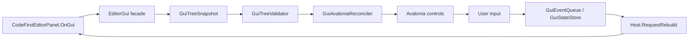

# Code-first UI 设计

> 本文档描述 Studio 内部受信任扩展的 Code-first UI 方案。目标是让工具作者获得类似 IMGUI 的快速开发体验，同时让 Shell 继续掌握 Dock、生命周期、主题、命令、状态、诊断和 Avalonia 控件创建。

## 1. 目标

Code-first UI 解决的是内部工具面板、调试面板和自定义 Inspector 的快速开发问题。典型目标包括：

- Frame Debugger 面板。
- RenderGraph pass 列表和 pass 详情。
- 资源、纹理、shader、material 调试检查器。
- 临时内部工具窗口。
- 小型属性编辑器和验证面板。

设计目标：

- 写法接近 IMGUI：工具作者在 `OnGui(EditorGui gui)` 中顺序描述 UI。
- 底层保持 retained UI：Shell 将 UI 描述树 diff/reconcile 到 Avalonia 控件。
- 扩展不能直接创建窗口、Dock 控件或全局状态。
- UI 状态、文档状态、Dock 布局状态严格分离。
- 持久化修改必须走命令、事务、Undo/Redo、Dirty State 和验证。
- 第一版只覆盖小工具需要的控件，不做完整 UI Toolkit。

## 2. 非目标

第一阶段不做：

- 任意第三方插件 ABI/API。
- 外部程序集热加载。
- 运行时加载任意 XAML 作为安全边界。
- 真正 immediate-mode renderer。
- 允许扩展直接 `new Window`、直接操作 Dock、直接持有 Avalonia 控件。
- 完整 Inspector 反射系统。
- 完整 node graph、timeline、viewport gizmo UI。
- 自动把 `OnGui` 字段修改写入项目文件。

## 3. 核心设计判断

Code-first UI 不是“每帧直接画 UI”。Studio 基于 Avalonia，Avalonia 是 retained UI。真正 IMGUI 的每帧绘制模型会绕开 Avalonia 控件树、焦点、虚拟化、样式、可访问性和绑定体系。

正确模型是：

```text
Code-first panel OnGui()
    -> GuiFrameBuilder records GuiNode tree
    -> GuiTreeValidator validates keys and shape
    -> GuiAvaloniaReconciler diffs previous tree
    -> Avalonia controls are created, reused, updated, or detached
```

开发者体验像 IMGUI，但引擎内部是可验证、可测试、可恢复的 retained UI。



### 3.1 资料对照审查

| 资料来源 | 可借鉴点 | 对 Studio 的约束 |
| --- | --- | --- |
| Unity IMGUI `EditorWindow.OnGUI` | 代码式窗口开发很快，适合内部工具和调试面板；窗口仍接入 Unity 的菜单、Dock 和布局保存。 | 借鉴 `OnGui` 书写体验，但不能让扩展绕过 Shell 创建窗口或持有 Dock。 |
| Unity UI Toolkit `CreateGUI` | 新版编辑器 UI 更推荐 retained visual tree，并强调列表控件复用、热重载后恢复状态。 | Studio 的 `OnGui` 不直接绘制，而是生成可 diff 的树；列表必须预留虚拟化和状态恢复。 |
| Dear ImGui | API 目标是减少 UI 状态同步，适合工具、调试器、Profiler 和短生命周期面板。 | 只借鉴“顺序写 UI、事件返回值简单”的 ergonomics，不采用它的渲染后端、Dock 或字体/输入体系。 |
| Avalonia XAML / MVVM / compiled bindings | Avalonia 的强项是 retained 控件树、样式、绑定、模板和可测试 ViewModel。 | 复杂长期面板仍优先 XAML + ViewModel；Code-first 只产出 UI-neutral 节点，由 Shell adapter 创建 Avalonia 控件。 |
| Godot `EditorPlugin` / `EditorInspectorPlugin` | 插件按显式贡献点加入 Dock、菜单、Inspector，并要求停用时移除注册。 | Studio 扩展必须有贡献登记、生命周期清理和失败隔离，不能留下隐式全局注册。 |
| Unreal Slate commands / DetailsView | 命令集、Details/Property 视图和过滤/收藏/可访问性是编辑器 UI 基础设施。 | Code-first 按钮走 command router；持久属性编辑走 property handle/transaction，不直接写模型。 |

审查结论：当前文档的大方向正确，但需要进一步补足 rebuild 触发、事件消费边界、布局管理、控件所有权、属性编辑事务和不可选方案，避免实现时滑向“另一个 UI 框架”。

### 3.2 补充设计决策

| ID | 决策 | 理由 |
| --- | --- | --- |
| CFUI-D-001 | `EditorGui` facade 每次 rebuild 临时创建，本身不保存业务状态。 | 避免 facade 变成隐式 ViewModel；状态归属必须可追踪。 |
| CFUI-D-002 | 交互节点必须使用显式 key；自动 key 只允许用于无交互、无状态的静态占位节点，MVP 可以直接禁止自动 key。 | 焦点、输入、列表选择、滚动和错误定位都依赖稳定 identity。 |
| CFUI-D-003 | Avalonia 控件只由 Shell adapter 创建和持有，扩展永远拿不到控件实例。 | 保持主题、焦点、可访问性、生命周期和未来 ABI 边界可控。 |
| CFUI-D-004 | 用户输入先进入 `GuiEventQueue` / `GuiStateStore`，再在下一次 `OnGui` 中消费。 | 避免控件事件直接执行面板逻辑，保证 UI 构建路径单一且可测试。 |
| CFUI-D-005 | rebuild 是显式失效驱动，不等于每帧刷新；多次失效在 UI dispatcher 上合并。 | 防止调试面板因为高频后端数据拖慢 Shell。 |
| CFUI-D-006 | 布局只暴露少量 production editor primitives：vertical、horizontal、toolbar、split、scroll、list、property group。 | 限制 API 面，避免第一版复制 Avalonia Grid/Flex/Canvas。 |
| CFUI-D-007 | 持久数据修改只能走 command 或后续 `EditorPropertyHandle`。 | 保证 Undo/Redo、Dirty State、验证、保存失败处理一致。 |
| CFUI-D-008 | 样式、主题、字体、间距、错误颜色和 focus visual 全由 Shell 样式层提供。 | 内部工具也必须看起来像同一个编辑器，且可支持暗色/高 DPI/可访问性。 |
| CFUI-D-009 | 后端数据只以 immutable snapshot 或查询服务进入面板；`OnGui` 不等待 GPU、IO 或编译。 | 避免 UI 线程和 render loop 互相阻塞。 |

## 4. 架构分层

建议分层：

```text
Core
  Code-first UI contracts:
    CodeFirstEditorPanel
    EditorGui
    GuiNode
    GuiNodeKind
    GuiStateKey
    GuiTreeSnapshot

Shell
  Code-first UI runtime:
    CodeFirstPanelHostViewModel
    GuiFrameBuilder
    GuiTreeValidator
    GuiStateStore
    GuiEventQueue
    GuiAvaloniaReconciler
    GuiControlAdapter

UI
  Reusable visual controls:
    compact property row
    validation message
    toolbar primitives
    virtual list styles

Features
  Internal panels:
    FrameDebuggerPanel
    ResourceInspectorPanel
    ShaderDiagnosticsPanel
```

原则：

- `Core` 定义 UI-neutral 合同，不引用 Avalonia 控件。
- `Shell` 拥有 Avalonia 适配、Dock 接入、生命周期调度和诊断。
- `Features` 写内部工具逻辑，不直接控制 Dock。
- `UI` 只提供可复用视觉控件和样式。

## 5. 与现有 Studio 架构接入

当前已有可复用基础：

- `PanelDescriptor`：描述面板 ID、标题、默认 Dock 区域、菜单路径、缓存策略和内容工厂。
- `PanelInstanceManager`：根据 `DockContentCachePolicy` 创建或复用面板内容。
- `EditorDockTabViewModel`：在面板 attach、activate、deactivate、detach 时转发生命周期。
- `IEditorPanelLifecycleSink`：面板实例生命周期回调。
- `IEditorPanelFrameUpdateSink`：面板帧更新回调。
- `EditorPanelFrameScheduler`：按 active/manual/frame rate 调度面板帧更新。
- `WorkbenchCommandRouter`：统一命令执行和失败反馈。
- `EditorExtensionHost`：声明贡献、验证、注册、激活和释放。

Code-first UI 不替换这些系统。它只是一种 `PanelDescriptor.CreateContent()` 产出的内容类型。

第一版接入方式：

```csharp
builder.AddPanel(new PanelDescriptor(
    "render.frameDebugger",
    "Frame Debugger",
    PanelKind.Tool,
    DockArea.Right,
    "Window/Rendering/Frame Debugger",
    DockContentCachePolicy.KeepAlive,
    () => new CodeFirstPanelHostViewModel(
        new FrameDebuggerPanel(...))));
```

后续可增加语法糖：

```csharp
builder.AddCodeFirstPanel(
    "render.frameDebugger",
    "Frame Debugger",
    DockArea.Right,
    () => new FrameDebuggerPanel(...));
```

语法糖不能改变底层合同。最终仍然注册为 `PanelDescriptor`。

## 6. 作者 API

### 6.1 面板基类

```csharp
public abstract class CodeFirstEditorPanel
{
    protected EditorPanelContext Context { get; private set; } = EditorPanelContext.Empty;

    protected virtual void OnCreate(EditorPanelContext context) {}

    protected virtual void OnEnable() {}

    protected abstract void OnGui(EditorGui gui);

    protected virtual void OnSelectionChanged(EditorSelectionSnapshot selection) {}

    protected virtual void OnFrame(EditorPanelFrameContext frame) {}

    protected virtual void OnDisable() {}

    protected virtual void OnDestroy() {}
}
```

说明：

- `OnCreate` 只调用一次，适合初始化轻量状态和订阅服务。
- `OnEnable` 在面板被 attach 或重新打开时调用。
- `OnGui` 声明当前 UI。
- `OnSelectionChanged` 接收编辑器选择状态。
- `OnFrame` 用于需要帧更新的调试面板。
- `OnDisable` 在关闭、隐藏或 detach 前调用。
- `OnDestroy` 释放订阅、缓存和临时资源。

### 6.2 示例写法

```csharp
public sealed class FrameDebuggerPanel : CodeFirstEditorPanel
{
    private string filter = string.Empty;
    private string? selectedPassId;
    private bool liveCapture;

    protected override void OnGui(EditorGui gui)
    {
        gui.Label("title", "RenderGraph");

        using (gui.Toolbar("toolbar"))
        {
            if (gui.Button("capture", "Capture Frame"))
            {
                gui.ExecuteCommand("render.captureFrame");
            }

            gui.Toggle("live", "Live", ref liveCapture);
        }

        filter = gui.TextField("filter", "Filter", filter);

        using (gui.Split("main", SplitDirection.Horizontal, 0.42))
        {
            using (gui.Panel("pass-list", "Passes"))
            {
                selectedPassId = gui.List(
                    "passes",
                    visiblePasses,
                    selectedPassId,
                    pass => pass.Id,
                    pass => pass.Name);
            }

            using (gui.Panel("details", "Details"))
            {
                var pass = FindPass(selectedPassId);
                gui.Property("name", "Name", pass?.Name ?? "");
                gui.Property("inputs", "Inputs", pass?.Inputs.Count ?? 0);
                gui.Property("outputs", "Outputs", pass?.Outputs.Count ?? 0);
            }
        }
    }
}
```

### 6.3 API 规则

- 交互控件必须传显式 key。
- key 在同一父节点下必须唯一。
- key 不应该来自显示文本，因为文本会本地化或变化。
- `OnGui` 不能阻塞 UI 线程。
- `OnGui` 不能直接保存项目文件。
- `OnGui` 不能直接创建 Avalonia 控件。
- 大列表必须走 `List` / `VirtualList`，不能生成几千个普通子节点。

## 7. 内部数据模型

### 7.1 GuiNode

```csharp
public sealed record GuiNode(
    GuiNodeId Id,
    GuiNodeKind Kind,
    string? Label,
    GuiValue Value,
    GuiLayoutHints Layout,
    IReadOnlyList<GuiNode> Children);
```

`GuiNodeId` 应包含：

```text
PanelId
FullKeyPath
Kind
Version
```

`FullKeyPath` 示例：

```text
render.frameDebugger/main/pass-list/passes
render.frameDebugger/main/details/name
```

`GuiNodeKind` 第一版建议：

```text
Root
Vertical
Horizontal
Toolbar
Panel
Split
Scroll
Foldout
Label
Button
Toggle
TextField
List
Property
ValidationMessage
```

### 7.2 GuiValue

`GuiValue` 是 UI-neutral 值容器。第一版只支持有限类型：

```text
None
String
Boolean
Integer
Double
EnumName
CommandId
ListItems
Severity
```

不要第一版就放任意 `object`，否则验证、序列化、测试和诊断都会变弱。

### 7.3 List item

列表项需要稳定 ID：

```csharp
public sealed record GuiListItem(
    string Id,
    string Label,
    string? Detail = null,
    string? IconKey = null,
    EditorDiagnosticSeverity? Severity = null);
```

选择状态使用 item ID，不使用 index。index 会在过滤、排序、刷新后失效。

## 8. 构建流程

每次 rebuild 执行：

```text
1. Host creates GuiFrameBuilder.
2. Host creates EditorGui facade.
3. Panel.OnGui(gui) records nodes.
4. Builder returns GuiTreeSnapshot.
5. Validator checks keys, nesting, values, and unsupported nodes.
6. Reconciler diffs previous tree and current tree.
7. Avalonia controls update.
8. Consumed input events are cleared.
9. Diagnostics are published if needed.
```

伪代码：

```csharp
public void Rebuild()
{
    var builder = new GuiFrameBuilder(panelId, stateStore, eventQueue);
    var gui = new EditorGui(builder, commandRouter, diagnostics);

    try
    {
        panel.OnGui(gui);
        var nextTree = builder.Build();
        var validation = validator.Validate(nextTree);
        if (!validation.IsValid)
        {
            ShowValidationFailure(validation);
            return;
        }

        reconciler.Apply(previousTree, nextTree);
        previousTree = nextTree;
        eventQueue.ConsumeFrameEvents();
    }
    catch (Exception exception)
    {
        diagnostics.Publish(...);
        ShowPanelError(exception);
    }
}
```

### 8.1 Rebuild 触发和合并

`RequestRebuild` 需要记录原因，便于调试性能和避免无意义刷新：

```text
InitialOpen
LifecycleChanged
InputEvent
SelectionChanged
CommandResult
DataSnapshotChanged
ThemeChanged
FrameTick
ExplicitRefresh
```

合并规则：

- 同一 UI dispatcher tick 内的多次 `RequestRebuild` 合并为一次。
- `InputEvent` 优先级高于 `FrameTick`，文本输入不能被帧刷新饿死。
- `ThemeChanged` 和 `LifecycleChanged` 可以强制 full reconcile。
- `DataSnapshotChanged` 只携带 snapshot version，不在 UI 线程拉取后端数据。
- `FrameTick` 只有 panel 声明需要帧更新时才触发；普通工具面板不随 viewport 每帧重建。

### 8.2 两阶段更新逻辑

每次更新分成两个阶段：

```text
Phase A: build
  consume pending input state
  run panel.OnGui(gui)
  produce GuiTreeSnapshot
  validate snapshot

Phase B: apply
  reconcile controls
  publish diagnostics
  clear consumed one-shot events
  keep unconsumed state such as text/focus/scroll
```

如果 Phase A 失败，Phase B 不应清空上一帧可用 UI。Shell 应显示错误 overlay 或 placeholder，同时保留可恢复路径。

## 9. key 和 identity 逻辑

UI 控件复用依赖稳定 identity。

identity 规则：

```text
Node identity = PanelId + FullKeyPath + GuiNodeKind
```

同 key 但 kind 变化：

```text
previous: TextField("filter")
next:     List("filter")
```

处理方式：

```text
detach old control
create new control
clear incompatible local control state
publish warning diagnostic in debug builds
```

重复 key：

```csharp
gui.TextField("filter", "Filter A", a);
gui.TextField("filter", "Filter B", b);
```

处理方式：

```text
validation failure
panel shows diagnostic placeholder
previous valid UI remains if possible
```

## 10. 事件模型

Code-first UI 不能直接在 Avalonia click event 中执行任意 panel UI 逻辑，否则逻辑会分散在控件适配器里。事件应进入 `GuiEventQueue`，再由下一次 `OnGui` 消费。

### 10.1 Button

Avalonia Button click：

```text
Button click
    -> GuiEventQueue.Enqueue(ButtonClicked(fullKey))
    -> Host.RequestRebuild()
```

下一次 `OnGui`：

```csharp
if (gui.Button("capture", "Capture Frame"))
{
    gui.ExecuteCommand("render.captureFrame");
}
```

`gui.Button` 检查并消费 `ButtonClicked(fullKey)`，只返回一次 `true`。

### 10.2 TextField

Avalonia TextBox text changed：

```text
Text changed
    -> GuiStateStore.SetText(fullKey, newText)
    -> Host.RequestRebuild(debounce optional)
```

下一次 `OnGui`：

```csharp
filter = gui.TextField("filter", "Filter", filter);
```

返回值优先级：

```text
state store value
    > incoming argument value
    > default value
```

这让输入框可以保持焦点和未提交文本。

### 10.3 Toggle

Toggle 和 TextField 类似，但值是 `bool`。对本地 UI 状态可以直接 `ref`：

```csharp
gui.Toggle("live", "Live", ref liveCapture);
```

对持久文档状态不能直接 `ref`，应走 command 或 property handle。

### 10.4 List

List selection：

```text
Selection changed
    -> GuiStateStore.SetSelectedItem(fullKey, itemId)
    -> Host.RequestRebuild()
```

`gui.List` 返回 selected item ID。不要返回 index。

### 10.5 事件消费规则

事件消费必须有严格语义：

- `ButtonClicked` 是 one-shot event，只能被同一次 `OnGui` 中对应 key 的 `Button` 消费一次。
- `TextField`、`Toggle`、`List` 这类状态控件不依赖 one-shot event 返回当前值，而是从 `GuiStateStore` 读取最新状态。
- 如果控件在下一次 build 中消失，未消费的 one-shot event 被丢弃并记录 debug trace，不延迟触发到未来同 key 新控件。
- 如果 key 相同但 kind 改变，对应事件和局部控件状态都必须清理。
- command 执行结果不能在 Avalonia event handler 内直接改 UI；结果进入 diagnostics / command state 后触发 rebuild。

`CommandButton` 是 `Button + ExecuteCommand` 的便利 API，但语义仍然是事件先消费、命令后执行：

```csharp
gui.CommandButton(
    "capture",
    "Capture Frame",
    "render.captureFrame");
```

Shell 需要在 adapter 层同步 command 可用状态，用于 disabled state、tooltip 和快捷键提示。

## 11. 状态模型

必须区分三类状态。

### 11.1 Shell layout state

由 Dock 系统保存：

```text
panel id
dock area
tab order
active tab
floating window bounds
split ratios
```

Code-first UI 不写这些状态。

### 11.2 Panel local UI state

由 `GuiStateStore` 或 panel 字段保存：

```text
filter text
selected pass id
foldout expanded
scroll offset
split ratio inside panel
last selected detail tab
```

这些是编辑器用户状态，不是项目数据。可选地保存到用户设置，不写入可发布资产。

### 11.3 Persistent document state

例如：

```text
scene entity
component data
material parameter
asset import setting
project render setting
```

必须通过命令、事务、Undo/Redo、Dirty State 和验证。

### 11.4 状态所有权矩阵

| 状态 | Owner | 保存位置 | 何时清理 |
| --- | --- | --- | --- |
| Dock 布局、tab 顺序、浮动窗口尺寸 | Shell dock system | 用户布局设置 | 布局 reset 或面板贡献移除 |
| TextField 未提交文本、split ratio、foldout、scroll offset | `GuiStateStore` | 可选用户设置 | panel 销毁或 key/kind 改变 |
| 面板业务选择，如 selected pass id | panel model 或 `GuiStateStore` | 通常不写项目 | snapshot 失效或面板关闭 |
| 编辑器全局选择 | selection service | 编辑器会话状态 | 用户选择变化或项目关闭 |
| 场景、材质、导入设置 | document / asset model | 项目文件或资产数据库 | command undo、revert 或关闭项目 |

判断标准：如果状态会影响可发布结果，它就不是 Code-first UI local state，必须离开 `GuiStateStore`。

## 12. 布局模型

Code-first UI 提供少量受控布局 primitive。

### 12.1 Vertical / Horizontal

用于普通排列：

```csharp
using (gui.Vertical("main"))
{
    gui.Label("title", "RenderGraph");
    gui.TextField("filter", "Filter", filter);
}
```

映射到 Avalonia：

```text
Vertical   -> StackPanel Orientation=Vertical
Horizontal -> StackPanel Orientation=Horizontal
```

注意：长列表不能放在普通 `StackPanel` 中无限创建子控件。

### 12.2 Toolbar

用于按钮和开关：

```csharp
using (gui.Toolbar("toolbar"))
{
    gui.Button("capture", "Capture");
    gui.Toggle("live", "Live", ref live);
}
```

映射到紧凑水平容器，使用统一图标、间距和 tooltip 规则。

### 12.3 Split

用于面板内部左右或上下拆分：

```csharp
using (gui.Split("main", SplitDirection.Horizontal, 0.4))
{
    using (gui.Panel("left", "Passes")) { }
    using (gui.Panel("right", "Details")) { }
}
```

`Split` 的 ratio 属于 panel local UI state，可按用户设置保存。

### 12.4 Scroll

用于非虚拟的小内容滚动：

```csharp
using (gui.Scroll("details-scroll"))
{
    gui.Property("name", "Name", name);
}
```

大列表必须用 `List` / `VirtualList`。

### 12.5 List / VirtualList

第一版可以只有 `List`，但内部实现必须预留虚拟化：

```csharp
selectedPassId = gui.List(
    "passes",
    passItems,
    selectedPassId);
```

映射到 Avalonia 应优先使用支持虚拟化的 items control 策略。不能为几千个 pass 或资源创建几千个复杂控件。

### 12.6 布局管理原则

不建议使用链式 DSL：

```csharp
builder.Panel("render.frameDebugger", "Frame Debugger")
    .Text("RenderGraph")
    .Button("Capture Frame", "render.captureFrame")
    .List("passes")
    .TextInput("Filter");
```

问题是它把“创建控件”和“布局作用域”混在一起，后续很难表达 split、toolbar、滚动区域、详情区域、条件内容、validation message 和局部状态。

推荐使用 scoped block：

```csharp
using (gui.Vertical("root"))
{
    using (gui.Toolbar("toolbar"))
    {
        gui.CommandButton("capture", "Capture Frame", "render.captureFrame");
        gui.Toggle("live", "Live", ref liveCapture);
    }

    filter = gui.TextField("filter", "Filter", filter);

    using (gui.Split("content", SplitDirection.Horizontal, 0.42))
    {
        using (gui.Panel("passes", "Passes"))
        {
            selectedPassId = gui.List("pass-list", passItems, selectedPassId);
        }

        using (gui.Panel("details", "Details"))
        {
            DrawPassDetails(gui, selectedPassId);
        }
    }
}
```

布局规则：

- 面板根节点默认是 vertical，不需要作者声明窗口外壳。
- `Panel` 表示面板内部的分组区，不是 Dock window。
- `Toolbar` 只能放轻量 command、toggle、search、menu，不放大列表或复杂表单。
- `Split` 的 ratio 是 panel local state；同 key 保留，key 改变时重置。
- `Scroll` 只给详情和短表单使用；列表、日志、资产结果必须用虚拟化控件。
- 不提供任意 absolute positioning。需要 viewport overlay、gizmo、graph canvas 时单独设计专用控件。
- 初版不暴露 Avalonia `Grid`。如果需要表单对齐，提供 `PropertyGroup` / `PropertyRow`，而不是让每个工具自定义列宽。

### 12.7 样式、焦点和可访问性

Code-first 控件不能携带任意颜色、字体和 margin。允许的视觉输入应是语义化的：

```text
severity: info / warning / error
textTone: primary / secondary / muted
textSize: body / caption / title
iconKey: registered editor icon
tooltip: plain text
```

Shell adapter 负责：

- 使用编辑器统一主题资源。
- 为按钮、输入、列表和命令提供可见 focus state。
- 保持 tab order 与代码声明顺序一致。
- 在 rebuild 后按 key 恢复焦点、selection 和 scroll。
- 为命令按钮提供 tooltip 和快捷键提示。
- 避免 validation message 出现/消失导致主要控件跳动。

## 13. 命令和 Undo 边界

### 13.1 命令按钮

推荐：

```csharp
if (gui.Button("capture", "Capture Frame"))
{
    gui.ExecuteCommand("render.captureFrame");
}
```

或：

```csharp
gui.CommandButton("capture", "Capture Frame", "render.captureFrame");
```

`ExecuteCommand` 必须走 Shell command router，不能直接调用随机服务。

### 13.2 本地 UI 状态

允许直接修改：

```csharp
filter = gui.TextField("filter", "Filter", filter);
```

这是本地 filter，不影响项目数据。

### 13.3 持久属性编辑

不允许：

```csharp
material.Roughness = gui.FloatField("roughness", "Roughness", material.Roughness);
```

推荐后续引入 property handle：

```csharp
gui.PropertyField("roughness", materialHandle.Property("roughness"));
```

`PropertyField` 内部负责：

```text
begin edit
validate preview value
commit command
mark dirty
record undo
publish diagnostics
```

MVP 不实现完整 `PropertyField`。MVP 只做调试显示和本地 UI 状态。

### 13.4 属性编辑事务生命周期

后续实现 `EditorPropertyHandle` 时，交互语义应固定为：

```text
focus field
    -> begin edit session
type / drag / choose asset
    -> update preview value
    -> validate value
commit by Enter / focus lost / picker accept
    -> execute named command
    -> record undo
    -> mark dirty
cancel by Escape / command failure
    -> restore previous value
    -> publish diagnostics
```

不同控件可以有不同提交时机：

- 文本框：输入期间只更新 local edit buffer，提交后写 document。
- slider/drag numeric：拖动期间可 preview，鼠标释放时合并为一个 undo step。
- asset picker：选择确认后提交；取消不产生 dirty state。
- toggle：可以立即提交，但仍必须走 command。

这套事务语义属于编辑器底层服务，不属于单个 Code-first panel。

## 14. 生命周期接入

Host content 应实现现有接口：

```csharp
internal sealed class CodeFirstPanelHostViewModel :
    IEditorPanelLifecycleSink,
    IEditorPanelFrameUpdateSink,
    IDisposable
{
}
```

映射规则：

```text
OnPanelAttached    -> panel.OnCreate once, panel.OnEnable, Rebuild
OnPanelActivated   -> mark active, Rebuild if needed
OnEditorPanelFrame -> panel.OnFrame, Rebuild if panel requested
OnPanelDeactivated -> mark inactive
OnPanelDetached    -> panel.OnDisable, maybe panel.OnDestroy depending cache policy
Dispose            -> panel.OnDestroy
```

`DockContentCachePolicy.KeepAlive`：

```text
close tab -> OnDisable
reopen    -> OnEnable with same panel instance and GuiStateStore
app exit  -> OnDestroy
```

`DockContentCachePolicy.RecreateOnOpen`：

```text
close tab -> OnDisable, OnDestroy
reopen    -> new panel instance
```

## 15. Reconcile 算法

`GuiAvaloniaReconciler` 输入：

```text
previous GuiTreeSnapshot
next GuiTreeSnapshot
root Avalonia container
control cache by GuiNodeId
```

算法：

```text
ApplyNode(parentControl, previousNode, nextNode):
  if previousNode is null:
    create control for nextNode
    attach to parent
    apply properties
    recurse children

  else if previousNode.Id != nextNode.Id:
    detach previous control subtree
    create control for nextNode
    attach to parent at same slot
    apply properties
    recurse children

  else:
    reuse existing control
    update changed properties
    reconcile children by key order
```

子节点匹配：

```text
match by GuiNodeId
preserve order from next tree
remove missing nodes
insert new nodes at requested index
```

更新原则：

- 不更新未变化的 Avalonia 属性。
- 不重建正在编辑的 TextBox。
- 不丢失焦点。
- 不丢失 list selection。
- 不丢失 scroll offset，除非节点 key 变化。
- 不让异常破坏上一帧可用 UI。

### 15.1 控件所有权和 adapter 边界

`GuiControlAdapter` 是唯一能接触 Avalonia 控件的层。每种 node kind 对应一个 adapter：

```text
LabelAdapter
ButtonAdapter
TextFieldAdapter
ToggleAdapter
ToolbarAdapter
ListAdapter
SplitAdapter
PropertyRowAdapter
```

adapter 职责：

- 创建、更新、复用、释放 Avalonia 控件。
- 把 Avalonia event 转成 `GuiEventQueue` / `GuiStateStore` 更新。
- 应用 Shell style class、automation name、tooltip、shortcut hint。
- 保持 focus、selection、scroll 和 text composition。
- 拦截 adapter 异常并上报 diagnostics。

adapter 禁止：

- 调用 panel 业务方法。
- 直接保存文档数据。
- 直接执行 renderer 或 asset pipeline 操作。
- 把 Avalonia 控件实例暴露给扩展。

## 16. 错误处理和诊断

错误类型：

```text
duplicate key
invalid nesting
unsupported node kind
invalid value type
OnGui exception
command not found
command failed
adapter exception
```

处理策略：

- `OnGui` 抛异常：保留上一帧 UI 或显示错误占位，不让 Shell 崩溃。
- validation failure：显示面板级诊断，指出 key、node kind、错误字段。
- command failure：走现有 command feedback 和 diagnostics。
- adapter failure：发布 Shell diagnostics，显示降级占位。

错误占位应是普通 Avalonia UI，由 Shell 创建。扩展不能覆盖错误显示。

## 17. 线程模型

规则：

- `OnGui` 在 UI 线程执行。
- Avalonia 控件创建和更新只在 UI 线程执行。
- 后台任务不能直接调用 `OnGui`。
- 后台数据到达后，只能更新线程安全 snapshot，然后请求 UI dispatcher rebuild。
- `OnFrame` 必须轻量，不能阻塞渲染或 UI。

后台数据建议：

```text
renderer diagnostics thread
    -> immutable snapshot
    -> diagnostics service or panel model
    -> UI dispatcher RequestRebuild
```

## 18. 性能策略

Code-first UI 容易被误用为“每次生成大量节点”。必须约束：

- 大列表必须走 `List` / `VirtualList`。
- `OnGui` 不做搜索、排序、文件 IO、shader 编译、GPU 查询。
- `OnGui` 只读取已经准备好的 snapshot。
- 高频 rebuild 要 debounce 或 coalesce。
- `GuiTreeSnapshot` 尽量复用不可变轻量对象。
- 文本输入不应触发昂贵后端刷新。
- Frame Debugger 只在有新 frame snapshot 或用户操作时刷新详情。

建议增加统计：

```text
last build time
last reconcile time
node count
control count
event count
validation error count
```

这些统计可以先写入 debug diagnostics，不做 UI。

## 19. 安全和边界

内部受信任不等于无边界。

Code-first panel 禁止：

- 直接创建 `Window`。
- 直接修改 Dock tree。
- 直接访问 Avalonia visual tree。
- 直接保存项目文件。
- 直接调用 renderer backend handle。
- 在 `OnGui` 中阻塞等待 GPU 或 IO。
- 使用 service locator 随意拿全局服务。

允许：

- 通过 context 访问受控服务。
- 通过 command router 执行命令。
- 读取只读 diagnostics snapshot。
- 持有本地 UI 状态。
- 订阅受控事件，并在 `OnDestroy` 释放。

## 20. API 版本和兼容

Code-first UI 应有 schema version：

```csharp
public readonly record struct GuiApiVersion(int Major, int Minor);
```

面板可声明最低版本：

```csharp
public override GuiApiVersion RequiredGuiApiVersion => new(1, 0);
```

版本策略：

- 新增控件：minor 增加。
- 改变控件语义：major 增加。
- 删除控件：只允许 major。
- Shell 对不支持版本显示诊断，不加载面板内容。

## 21. 文件和命名建议

建议目录：

```text
Core/CodeFirstUI/Abstractions/CodeFirstEditorPanel.cs
Core/CodeFirstUI/Abstractions/IEditorGui.cs
Core/CodeFirstUI/Models/GuiNode.cs
Core/CodeFirstUI/Models/GuiNodeKind.cs
Core/CodeFirstUI/Models/GuiTreeSnapshot.cs
Core/CodeFirstUI/Models/GuiListItem.cs
Core/CodeFirstUI/Building/GuiFrameBuilder.cs
Core/CodeFirstUI/Events/GuiEventQueue.cs
Core/CodeFirstUI/State/GuiStateStore.cs
Core/CodeFirstUI/Validation/GuiTreeValidator.cs
Core/CodeFirstUI/Validation/GuiTreeValidation*.cs

Shell/CodeFirstUI/Hosting/CodeFirstPanelHostViewModel.cs
Shell/CodeFirstUI/Authoring/EditorGui.cs
Shell/CodeFirstUI/Reconciliation/GuiAvaloniaReconciler.cs
Shell/CodeFirstUI/Adapters/*.cs

Shell/Views/CodeFirstPanelHostView.axaml
Shell/Views/CodeFirstPanelHostView.axaml.cs

Tests/Editor.Tests/Core/CodeFirstUI/Building/*.cs
Tests/Editor.Tests/Core/CodeFirstUI/Events/*.cs
Tests/Editor.Tests/Core/CodeFirstUI/State/*.cs
Tests/Editor.Tests/Core/CodeFirstUI/Validation/*.cs
```

如果后续发现 `Core` 放 UI contract 太重，可以拆到独立 `Editor.Core.EditorUi` 命名空间，但仍不能引用 Avalonia。

## 22. MVP 切片

### Slice 1: UI-neutral contract

交付：

- `CodeFirstEditorPanel`。
- `GuiNode` / `GuiNodeKind` / `GuiTreeSnapshot`。
- `GuiFrameBuilder`。
- key path 栈。
- duplicate key validation。

测试：

- 构建 Label/Button/TextField/List 节点。
- 同级 duplicate key 报错。
- 嵌套 path 正确。
- unsupported value type 报错。

### Slice 2: Host and lifecycle

交付：

- `CodeFirstPanelHostViewModel`。
- 接入 `IEditorPanelLifecycleSink`。
- 接入 `IEditorPanelFrameUpdateSink`。
- `OnCreate` / `OnEnable` / `OnDisable` / `OnDestroy` 调用顺序。

测试：

- `KeepAlive` close/reopen 保留状态。
- `RecreateOnOpen` close 后销毁。
- active frame update 只在 active 时调用。

### Slice 3: Avalonia renderer MVP

交付：

- Host view。
- Label/Button/TextField/Toggle/Toolbar/Vertical。
- Button event queue。
- TextField state store。

测试：

- button click 在下一次 `OnGui` 返回 true 一次。
- TextField 输入不丢焦点。
- 同 key 同 kind 复用控件。
- 同 key 不同 kind 替换控件。

### Slice 4: Frame Debugger sample panel

交付：

- `FrameDebuggerPanel` 内部试点。
- filter。
- pass list。
- selected pass details。
- capture command button。

测试：

- 打开面板显示空数据状态。
- 输入 filter。
- 选择 pass 后详情更新。
- capture command 走 command router。
- 后端 snapshot 缺失时显示 unavailable。

### Slice 5: Diagnostics and performance guard

交付：

- `OnGui` exception placeholder。
- validation diagnostics。
- node count / reconcile time debug record。
- large list warning。

测试：

- `OnGui` 抛异常不崩溃 Shell。
- duplicate key 显示诊断。
- invalid nesting 显示诊断。

### Slice 6: Contract tests and UI adapter tests

交付：

- builder contract tests。
- event queue one-shot tests。
- state store clear/reuse tests。
- reconciler control reuse tests。
- focus and text editing preservation tests。

测试：

- 同 key 同 kind rebuild 后 adapter 不重建控件。
- TextField 正在输入时，外部 snapshot 刷新不覆盖未提交文本。
- Button click 连续两次 rebuild 只触发一次。
- key/kind 改变时清理旧事件和旧局部状态。
- validation failure 保留上一帧可用 UI。

## 23. 验收标准

第一阶段完成的最低标准：

- 内部模块可注册一个 Code-first panel。
- 面板可停靠、关闭、重开、浮动。
- 生命周期顺序可测试。
- `OnGui` 可声明 Label、Button、TextField、Toggle、Toolbar、List。
- 控件使用稳定 key。
- Button 事件一次性消费。
- TextField 输入保持焦点和文本。
- List 选择使用 item id。
- Split ratio、scroll、foldout 等局部状态按 key 保留。
- 多个 rebuild request 可以合并，普通面板不会随 viewport 每帧重建。
- 命令执行走现有 command router。
- `OnGui` 异常不会杀死主窗口。
- validation failure 保留上一帧可用 UI 或显示可恢复错误占位。
- Code-first panel 不直接引用 Avalonia 控件。
- 样式、tooltip、focus visual 和快捷键提示由 Shell 统一提供。
- 文档明确 XAML + ViewModel 仍是复杂 UI 主路径。

## 24. 与 XAML UI 的关系

Code-first UI 和 XAML UI 是两种 authoring 方式，不是两套生命周期。

```text
XAML + ViewModel
    -> PanelDescriptor
    -> Shell lifecycle
    -> Avalonia view

Code-first UI
    -> PanelDescriptor
    -> CodeFirstPanelHostViewModel
    -> Shell lifecycle
    -> GuiNode tree
    -> Avalonia controls
```

建议分工：

- 复杂长期面板：XAML + ViewModel。
- 调试工具和小型 Inspector：Code-first UI。
- 未来声明式扩展：XAML UI adapter。

选择准则：

| 场景 | 首选方式 |
| --- | --- |
| 需要复杂视觉层级、模板、动画、深度数据绑定 | XAML + ViewModel |
| 需要快速内部调试面板、过滤、列表、按钮、只读详情 | Code-first UI |
| 需要通用 Inspector 属性编辑 | 先实现 property handle，再由 XAML 或 Code-first 调用 |
| 需要第三方/外部包声明 UI | 暂缓，先验证内部贡献模型和诊断边界 |
| 需要 viewport overlay、graph、timeline | 单独专用控件，不放进 MVP Code-first primitive |

## 25. 主要风险

| Risk | Impact | Mitigation |
| --- | --- | --- |
| 变成完整 UI Toolkit | 范围失控，重复 Avalonia | MVP 只做调试面板需要的少量控件。 |
| key 不稳定 | 焦点、滚动、选择丢失 | 强制交互控件显式 key，验证 duplicate key。 |
| OnGui 做重活 | UI 卡顿 | 文档和测试要求 OnGui 只读 snapshot，不做 IO/GPU/query。 |
| 持久数据绕过命令 | Undo/Dirty State 失效 | 第一版不提供直接文档写入 API，后续用 property handle。 |
| 控件适配泄漏 Avalonia | 扩展 ABI 被 Avalonia 绑死 | Core 合同 UI-neutral，Avalonia 只在 Shell adapters。 |
| 大列表性能差 | 调试面板卡顿 | List 预留虚拟化，限制普通 children 数量。 |

## 26. 已拒绝方案

| 方案 | 拒绝原因 |
| --- | --- |
| 扩展直接返回 Avalonia `Control` | 最快，但 Shell 无法统一验证、诊断、样式、生命周期和未来扩展边界。 |
| 直接嵌入 Dear ImGui 作为编辑器 UI 层 | 会形成第二套输入、字体、Dock、主题、可访问性和渲染管线，不适合当前 Avalonia Shell。 |
| 第一版实现完整 XAML 运行时加载和沙箱 | 安全、资源解析、binding context、错误回滚和版本兼容成本过高，应先做内部可信路径。 |
| 链式 builder DSL 作为主 API | 难表达真实编辑器布局和生命周期，复杂后会退化成不可读 fluent 配置。 |
| 让 `OnGui` 直接修改项目模型 | 会绕过命令、Undo/Redo、Dirty State 和验证。 |
| 每帧无条件 rebuild 所有 Code-first 面板 | 简单但性能不可控，尤其会影响渲染调试和大列表。 |

## 27. 仍需决策

| ID | 问题 | 建议默认值 |
| --- | --- | --- |
| CFUI-Q-001 | UI-neutral contract 放在现有 `Core`，还是拆独立命名空间/程序集？ | 先放 `Core/Abstractions` 和 `Core/Models`，出现跨层压力后再拆。 |
| CFUI-Q-002 | panel local UI state 是否跨会话保存？ | MVP 只保存在实例生命周期内；split ratio 和 filter 可后续接用户设置。 |
| CFUI-Q-003 | 第一个试点面板是谁？ | Frame Debugger，因为它最能验证后端 snapshot、列表、详情、命令和诊断。 |
| CFUI-Q-004 | 是否第一版支持自定义 Inspector？ | 只支持只读/调试型 Inspector；可写属性等 property handle 成熟后再开。 |
| CFUI-Q-005 | 是否暴露 icon、menu、shortcut API？ | command contribution 已有后再由 `CommandButton` 读取，不让 panel 自己定义全局快捷键。 |
| CFUI-Q-006 | 是否允许内部扩展使用 XAML 和 Code-first 混合？ | 允许同一扩展贡献不同面板，但单个面板首版只选择一种 authoring 方式。 |

## 28. 参考资料

- Unity Editor Windows：`https://docs.unity3d.com/Manual/editor-EditorWindows.html`
- Unity UI Toolkit custom Editor window：`https://docs.unity3d.com/Manual/UIE-HowTo-CreateEditorWindow.html`
- Dear ImGui README：`https://github.com/ocornut/imgui`
- Avalonia compiled bindings：`https://docs.avaloniaui.net/docs/xaml/compilation`
- Godot EditorPlugin：`https://docs.godotengine.org/en/stable/classes/class_editorplugin.html`
- Godot EditorInspectorPlugin：`https://docs.godotengine.org/en/stable/classes/class_editorinspectorplugin.html`
- Unreal Slate Overview：`https://dev.epicgames.com/documentation/unreal-engine/slate-overview-for-unreal-engine`
- Unreal command framework：`https://dev.epicgames.com/documentation/unreal-engine/API/Runtime/Slate/Framework/Commands`
- Unreal DetailsView：`https://dev.epicgames.com/documentation/unreal-engine/API/Editor/PropertyEditor/IDetailsView`

## 29. 设计结论

Code-first UI 应接受，但要缩小为：

```text
IMGUI-like authoring API
retained UI implementation
Shell-owned lifecycle
command-owned mutations
UI-neutral Core contract
Avalonia-only Shell adapter
Frame Debugger first MVP
```

它不是 XAML 的替代品。它是内部工具和调试面板的快速 authoring 层。复杂产品级 UI 仍然优先使用 Avalonia XAML + ViewModel。
