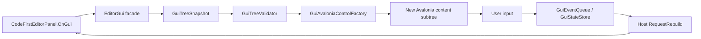

# Code-first UI 设计

状态：Partial（公共 UI-neutral tree、state、event、validation 与整棵 Avalonia content subtree 重建已实现；
keyed reconcile/control reuse 尚未实现；Avalonia content backend 与统一 extension contract 仍在迁移）

更新日期：2026-07-28

> 本文定义统一 Editor Extension Framework 的受限 Code-first UI authoring。Studio 内置功能、项目 `Editor/`、
> Package 和已安装插件使用同一合同。它是低频、小规模、标准工具 schema，不是 Avalonia code-only UI 的别名，
> 也不追求成为第二套通用 UI toolkit。Host 继续掌握 Dock、生命周期、主题、命令、状态、诊断和 Avalonia 控件创建。

前端的 Panel/Action/Tool、state、invalidation 和 Host lifecycle 总合同见
[Studio 前端框架](architecture/studio-frontend-framework.md)；扩展来源、`.asmdef`、Package 和 ALC 见
[Editor 扩展开发模型](architecture/editor-extension-authoring.md)；复杂 XAML/code-only Avalonia content 的
lease、资源和 reload tier 见 [Avalonia/XAML Editor 扩展规范](architecture/editor-extension-avalonia.md)。
本文只定义 Code-first backend。

## 1. 目标

Code-first UI 解决的是工具面板、调试面板和自定义 Inspector 的快速开发问题。典型目标包括：

- Frame Debugger 面板。
- RenderGraph pass 列表和 pass 详情。
- 资源、纹理、shader、material 调试检查器。
- 项目内临时或长期工具面板。
- 小型属性编辑器和验证面板。

设计目标：

- 写法接近 IMGUI：工具作者在 `OnGui(EditorGui gui)` 中顺序描述 UI。
- 底层使用 retained UI：当前 Shell 把每次有效 UI 描述树构造成新的 Avalonia content subtree；
  keyed diff/reconcile 是未实现 target，不是 v1 事实。
- 扩展不能直接创建顶层窗口、Dock 控件或全局状态。
- UI 状态、文档状态、Dock 布局状态严格分离。
- 持久化修改必须走命令、事务、Undo/Redo、Dirty State 和验证。
- 现有 primitive 集合冻结；不再以“补齐控件”为由扩成完整 UI Toolkit。

## 2. 非目标

本文不负责：

- extension discovery、`.asmdef`、Package 或 ALC load/reload；
- Avalonia/XAML backend 的 content factory 和 compatibility；
- 把任意 XAML 当作安全边界；
- 真正 immediate-mode renderer。
- 允许 Code-first 扩展直接 `new Window`、操作 Dock 或持有 Avalonia 控件。
- 完整 Inspector 反射系统。
- 完整 node graph、timeline、viewport gizmo UI。
- 自动把 `OnGui` 字段修改写入项目文件。

## 3. 核心设计判断

Code-first UI 不是“每帧直接画 UI”。Studio 基于 Avalonia，Avalonia 是 retained UI。真正 IMGUI 的每帧绘制模型会绕开 Avalonia 控件树、焦点、虚拟化、样式、可访问性和绑定体系。

当前模型是：

```text
Code-first panel OnGui()
    -> GuiFrameBuilder records GuiNode tree
    -> GuiTreeValidator validates keys and shape
    -> GuiAvaloniaControlFactory builds a new Avalonia content subtree
    -> host replaces the previous content subtree
```

开发者体验像 IMGUI，但运行时仍使用 Avalonia retained controls。`GuiStateStore` 可以保留显式建模的本地状态；
它不能替代 control identity，也不能证明 focus、IME composition、scroll 或虚拟化容器在重建后保持。


```mermaid
flowchart LR
    Panel["CodeFirstEditorPanel.OnGui"] --> Gui["EditorGui facade"]
    Gui --> Tree["GuiTreeSnapshot"]
    Tree --> Validator["GuiTreeValidator"]
    Validator --> Factory["GuiAvaloniaControlFactory"]
    Factory --> Controls["New Avalonia content subtree"]
    Controls --> Input["User input"]
    Input --> Events["GuiEventQueue / GuiStateStore"]
    Events --> Host["Host.RequestRebuild"]
    Host --> Panel
```

只有真实 consumer 与 profile 证明整棵 subtree replacement 不可接受，并且窄 keyed update 能显著降低风险时，
才单独设计 reconciler。不能把 target 算法写成当前保证。

### 3.1 资料对照审查

| 资料来源 | 可借鉴点 | 对 Studio 的约束 |
| --- | --- | --- |
| Unity IMGUI `EditorWindow.OnGUI` | 代码式窗口开发很快，适合内部工具和调试面板；窗口仍接入 Unity 的菜单、Dock 和布局保存。 | 借鉴 `OnGui` 书写体验，但不能让扩展绕过 Shell 创建窗口或持有 Dock。 |
| Unity UI Toolkit `CreateGUI` | 新版编辑器 UI 使用 retained visual tree；UXML 与 C# 都创建同一 `VisualElement` tree。 | Studio 的 XAML 与 code-only Avalonia 归入同一 content backend；这不要求 Code-first 自建通用 virtual tree。 |
| Dear ImGui | API 目标是减少 UI 状态同步，适合工具、调试器、Profiler 和短生命周期面板。 | 只借鉴“顺序写 UI、事件返回值简单”的 ergonomics，不采用它的渲染后端、Dock 或字体/输入体系。 |
| Avalonia XAML / MVVM / compiled bindings | Avalonia 的强项是 retained 控件树、样式、绑定、模板和可测试 ViewModel。 | 复杂长期面板仍优先 XAML + ViewModel；Code-first 只产出 UI-neutral 节点，由 Shell adapter 创建 Avalonia 控件。 |
| Godot `EditorPlugin` / `EditorInspectorPlugin` | 插件按显式贡献点加入 Dock、菜单、Inspector，并要求停用时移除注册。 | Studio 扩展必须有贡献登记、生命周期清理和失败隔离，不能留下隐式全局注册。 |
| Unreal Slate commands / DetailsView | 命令集、Details/Property 视图和过滤/收藏/可访问性是编辑器 UI 基础设施。 | Code-first 按钮走 command router；持久属性编辑走 property handle/transaction，不直接写模型。 |

审查结论：Panel/command/lifecycle 方向正确，但 v1 已经覆盖较多 primitive，且当前没有 keyed reconcile。
因此先冻结 surface、公开真实重建语义，并把文本编辑密集、高频、大列表、复杂 binding/template 与 custom control
留给 Avalonia content backend；不能继续用 target 能力为新增 node kind 辩护。

### 3.2 补充设计决策

| ID | 决策 | 理由 |
| --- | --- | --- |
| CFUI-D-001 | `EditorGui` facade 每次 rebuild 临时创建，本身不保存业务状态。 | 避免 facade 变成隐式 ViewModel；状态归属必须可追踪。 |
| CFUI-D-002 | 交互节点必须使用显式 key；自动 key 只允许用于无交互、无状态的静态占位节点，MVP 可以直接禁止自动 key。 | 焦点、输入、列表选择、滚动和错误定位都依赖稳定 identity。 |
| CFUI-D-003 | Code-first backend 的 Avalonia 控件只由 Host adapter 创建和持有；Code-first panel 拿不到控件实例。 | 保持主题、焦点、可访问性、生命周期和 UI-neutral API 边界可控；使用 `Asharia.Editor.Avalonia` 的另一种 backend 不受此条误伤。 |
| CFUI-D-004 | 用户输入先进入 `GuiEventQueue` / `GuiStateStore`，再在下一次 `OnGui` 中消费。 | 避免控件事件直接执行面板逻辑，保证 UI 构建路径单一且可测试。 |
| CFUI-D-005 | rebuild 是显式失效驱动，不等于每帧刷新；多次失效在 UI dispatcher 上合并。 | 防止调试面板因为高频后端数据拖慢 Shell。 |
| CFUI-D-006 | 布局只暴露少量 production editor primitives：vertical、horizontal、toolbar、split、scroll、list、property group。 | 限制 API 面，避免第一版复制 Avalonia Grid/Flex/Canvas。 |
| CFUI-D-007 | 持久数据修改只能走 command 或后续 `EditorPropertyHandle`。 | 保证 Undo/Redo、Dirty State、验证、保存失败处理一致。 |
| CFUI-D-008 | 样式、主题、字体、间距、错误颜色和 focus visual 全由 Host 样式层提供。 | 所有来源的工具都必须看起来像同一个编辑器，且可支持暗色/高 DPI/可访问性。 |
| CFUI-D-009 | 后端数据只以 immutable snapshot 或查询服务进入面板；`OnGui` 不等待 GPU、IO 或编译。 | 避免 UI 线程和 render loop 互相阻塞。 |
| CFUI-D-010 | 冻结现有 node kind；新增 primitive 需要两个真实 consumer，或证明 Avalonia content 更复杂。 | 阻止 Code-first 复制控件、布局、样式和 binding 系统。 |
| CFUI-D-011 | 当前 full-subtree replacement 是公开限制；keyed reconcile 必须作为独立、可测 Slice。 | 保持文档与代码一致，避免虚假的 focus/IME/virtualization 保证。 |

## 4. 架构分层

建议分层：

```text
Core
  Code-first UI contracts:
    CodeFirstEditorPanel
    EditorGui
    GuiNode
    GuiNodeKind
    GuiStateKey
    GuiTreeSnapshot

Shell
  Code-first UI runtime:
    CodeFirstPanelHostViewModel
    GuiFrameBuilder
    GuiTreeValidator
    GuiStateStore
    GuiEventQueue
    GuiAvaloniaControlFactory
    GuiAvaloniaReconciler (target only, not implemented)

UI
  Reusable visual controls:
    compact property row
    validation message
    toolbar primitives
    virtual list styles

Features
  Internal panels:
    FrameDebuggerPanel
    ResourceInspectorPanel
    ShaderDiagnosticsPanel
```

原则：

- 当前 `Core` 定义 UI-neutral 合同，不引用 Avalonia 控件；目标迁移到 `Asharia.Editor/UI/CodeFirst`。
- 当前 `Shell` 拥有 Avalonia 适配、Dock 接入、生命周期调度和诊断；目标迁移到 `Asharia.Studio.Presentation.Avalonia`。
- 当前 `Features` 写 built-in 工具逻辑；目标 `BuiltInExtensions` 与项目/Package extension 使用相同 API，均不直接控制 Dock。
- `UI` 只提供可复用视觉控件和样式。

## 5. 与现有 Studio 架构接入

当前已有可复用基础：

- `PanelDescriptor`：描述面板 ID、标题、默认 Dock 区域、菜单路径、缓存策略和内容工厂。
- `PanelInstanceManager`：根据 `DockContentCachePolicy` 创建或复用面板内容。
- `EditorDockTabViewModel`：在面板 attach、activate、deactivate、detach 时转发生命周期。
- `IEditorPanelLifecycleSink`：面板实例生命周期回调。
- `IEditorPanelFrameUpdateSink`：面板帧更新回调。
- `EditorPanelFrameScheduler`：按 active/manual/frame rate 调度面板帧更新。
- `WorkbenchCommandRouter`：统一命令执行和失败反馈。
- `EditorExtensionHost`：声明贡献、验证、注册、激活和释放。

Code-first UI 不替换这些系统。它只是一种 `PanelDescriptor.CreateContent()` 产出的内容类型。

第一版接入方式：

```csharp
builder.AddPanel(new PanelDescriptor(
    "render.frameDebugger",
    "Frame Debugger",
    PanelKind.Tool,
    DockArea.Right,
    "Window/Rendering/Frame Debugger",
    DockContentCachePolicy.KeepAlive,
    () => new CodeFirstPanelHostViewModel(
        new FrameDebuggerPanel(...))));
```

后续可增加语法糖：

```csharp
builder.AddCodeFirstPanel(
    "render.frameDebugger",
    "Frame Debugger",
    DockArea.Right,
    () => new FrameDebuggerPanel(...));
```

语法糖不能改变底层合同。最终仍然注册为 `PanelDescriptor`。

## 6. 作者 API

### 6.1 面板基类

```csharp
public abstract class CodeFirstEditorPanel
{
    protected EditorPanelContext Context { get; private set; } = EditorPanelContext.Empty;

    protected virtual void OnCreate(EditorPanelContext context) {}

    protected virtual void OnEnable() {}

    protected abstract void OnGui(EditorGui gui);

    protected virtual void OnSelectionChanged(EditorSelectionSnapshot selection) {}

    protected virtual void OnFrame(EditorPanelFrameContext frame) {}

    protected virtual void OnDisable() {}

    protected virtual void OnDestroy() {}
}
```

说明：

- `OnCreate` 只调用一次，适合初始化轻量状态和订阅服务。
- `OnEnable` 在面板被 attach 或重新打开时调用。
- `OnGui` 声明当前 UI。
- `OnSelectionChanged` 接收编辑器选择状态。
- `OnFrame` 用于需要帧更新的调试面板。
- `OnDisable` 在关闭、隐藏或 detach 前调用。
- `OnDestroy` 释放订阅、缓存和临时资源。

### 6.2 示例写法

```csharp
public sealed class FrameDebuggerPanel : CodeFirstEditorPanel
{
    private string filter = string.Empty;
    private string? selectedPassId;
    private bool liveCapture;

    protected override void OnGui(EditorGui gui)
    {
        gui.Label("title", "RenderGraph");

        using (gui.Toolbar("toolbar"))
        {
            if (gui.Button("capture", "Capture Frame"))
            {
                gui.ExecuteCommand("render.captureFrame");
            }

            gui.Toggle("live", "Live", ref liveCapture);
        }

        filter = gui.TextField("filter", "Filter", filter);

        using (gui.Split("main", SplitDirection.Horizontal, 0.42))
        {
            using (gui.Panel("pass-list", "Passes"))
            {
                selectedPassId = gui.List(
                    "passes",
                    visiblePasses,
                    selectedPassId,
                    pass => pass.Id,
                    pass => pass.Name);
            }

            using (gui.Panel("details", "Details"))
            {
                var pass = FindPass(selectedPassId);
                gui.Property("name", "Name", pass?.Name ?? "");
                gui.Property("inputs", "Inputs", pass?.Inputs.Count ?? 0);
                gui.Property("outputs", "Outputs", pass?.Outputs.Count ?? 0);
            }
        }
    }
}
```

### 6.3 API 规则

- 交互控件必须传显式 key。
- key 在同一父节点下必须唯一。
- key 不应该来自显示文本，因为文本会本地化或变化。
- `OnGui` 不能阻塞 UI 线程。
- `OnGui` 不能直接保存项目文件。
- `OnGui` 不能直接创建 Avalonia 控件。
- `List` 只表达单层、结构简单的集合；高频更新、复杂 item template 或超大数据集使用 Avalonia content backend。

## 7. 内部数据模型

### 7.1 GuiNode

```csharp
public sealed record GuiNode(
    GuiNodeId Id,
    GuiNodeKind Kind,
    string? Label,
    GuiNodePayload Payload,
    IReadOnlyList<GuiNode> Children);
```

当前 `GuiNodeId` 包含：

```text
PanelId
KeyPath
Kind
```

`FullKeyPath` 是由 `PanelId` 和 `KeyPath` 计算出的诊断/定位字符串。示例：

```text
render.frameDebugger/main/pass-list/passes
render.frameDebugger/main/details/name
```

当前 `GuiNodeKind` 是实现事实，按用途可分为：

```text
structure: Root, Vertical, Horizontal, Toolbar, Panel, Split, NavigationView, Scroll, Foldout
display: Label, Separator, ProgressBar, ValidationMessage
command/input: Button, Toggle, ComboBox, RadioGroup, ColorField,
               Vector2Field, Vector3Field, Vector4Field, Slider,
               NumberInput, TextField
data: List, Property
```

这不是下一轮扩展清单。现有集合冻结；新增 kind 受 CFUI-D-010 约束。

### 7.2 GuiNodePayload

`GuiNodePayload` 是受限的 UI-neutral record，只包含现有节点需要的 typed fields，例如：

```text
TextValue / PropertyValue / IsChecked / IsExpanded
NumericValue / NumericMinimum / NumericMaximum
ColorValue / Vector2Value / Vector3Value / Vector4Value
ListItems / SelectedItemId
SplitDirection / SplitRatio
DiagnosticSeverity
```

不要加入任意 `object`。新增 field 必须由现有 node kind 和真实 consumer 驱动，否则应选择 Avalonia content backend。

### 7.3 List item

列表项需要稳定 ID：

```csharp
public sealed record GuiListItem(
    string Id,
    string Label,
    string? Detail = null,
    string? IconKey = null,
    EditorDiagnosticSeverity? Severity = null);
```

选择状态使用 item ID，不使用 index。index 会在过滤、排序、刷新后失效。

## 8. 构建流程

每次 rebuild 执行：

```text
1. Host creates GuiFrameBuilder.
2. Host creates EditorGui facade.
3. Panel.OnGui(gui) records nodes.
4. Builder returns GuiTreeSnapshot.
5. Validator checks keys, nesting, values, and unsupported nodes.
6. GuiAvaloniaControlFactory builds a new content subtree.
7. Host replaces the previous content subtree.
8. Consumed input events are cleared.
9. Diagnostics are published if needed.
```

伪代码：

```csharp
public void Rebuild()
{
    var builder = new GuiFrameBuilder(panelId, stateStore, eventQueue);
    var gui = new EditorGui(builder, commandRouter, diagnostics);

    try
    {
        panel.OnGui(gui);
        var nextTree = builder.Build();
        var validation = validator.Validate(nextTree);
        if (!validation.IsValid)
        {
            ShowValidationFailure(validation);
            return;
        }

        var nextContent = controlFactory.Build(nextTree);
        host.ReplaceContent(nextContent);
        previousTree = nextTree;
        eventQueue.ConsumeFrameEvents();
    }
    catch (Exception exception)
    {
        diagnostics.Publish(...);
        ShowPanelError(exception);
    }
}
```

### 8.1 Rebuild 触发和合并

`RequestRebuild` 需要记录原因，便于调试性能和避免无意义刷新：

```text
InitialOpen
LifecycleChanged
InputEvent
SelectionChanged
CommandResult
DataSnapshotChanged
ThemeChanged
FrameTick
ExplicitRefresh
```

合并规则：

- 同一 UI dispatcher tick 内的多次 `RequestRebuild` 合并为一次。
- `InputEvent` 优先级高于 `FrameTick`，文本输入不能被帧刷新饿死。
- `ThemeChanged` 和 `LifecycleChanged` 触发 full rebuild。
- `DataSnapshotChanged` 只携带 snapshot version，不在 UI 线程拉取后端数据。
- `FrameTick` 只有 panel 声明需要帧更新时才触发；普通工具面板不随 viewport 每帧重建。

### 8.2 两阶段更新逻辑

每次更新分成两个阶段：

```text
Phase A: build
  consume pending input state
  run panel.OnGui(gui)
  produce GuiTreeSnapshot
  validate snapshot

Phase B: apply
  build and replace content subtree
  publish diagnostics
  clear consumed one-shot events
  keep explicitly modeled state such as text/selection/split
```

如果 Phase A 失败，Phase B 不应清空上一帧可用 UI。Shell 应显示错误 overlay 或 placeholder，同时保留可恢复路径。

## 9. key 和 identity 逻辑

UI 控件复用依赖稳定 identity。

identity 规则：

```text
Node identity = PanelId + FullKeyPath + GuiNodeKind
```

同 key 但 kind 变化：

```text
previous: TextField("filter")
next:     List("filter")
```

处理方式：

```text
detach old control
create new control
clear incompatible local control state
publish warning diagnostic in debug builds
```

重复 key：

```csharp
gui.TextField("filter", "Filter A", a);
gui.TextField("filter", "Filter B", b);
```

处理方式：

```text
validation failure
panel shows diagnostic placeholder
previous valid UI remains if possible
```

## 10. 事件模型

Code-first UI 不能直接在 Avalonia click event 中执行任意 panel UI 逻辑，否则逻辑会分散在控件适配器里。事件应进入 `GuiEventQueue`，再由下一次 `OnGui` 消费。

### 10.1 Button

Avalonia Button click：

```text
Button click
    -> GuiEventQueue.Enqueue(ButtonClicked(fullKey))
    -> Host.RequestRebuild()
```

下一次 `OnGui`：

```csharp
if (gui.Button("capture", "Capture Frame"))
{
    gui.ExecuteCommand("render.captureFrame");
}
```

`gui.Button` 检查并消费 `ButtonClicked(fullKey)`，只返回一次 `true`。

### 10.2 TextField

Avalonia TextBox text changed：

```text
Text changed
    -> GuiStateStore.SetText(fullKey, newText)
    -> Host.RequestRebuild(debounce optional)
```

下一次 `OnGui`：

```csharp
filter = gui.TextField("filter", "Filter", filter);
```

返回值优先级：

```text
state store value
    > incoming argument value
    > default value
```

这让 state store 可以保留最新文本值；当前 subtree replacement 不保证保持原 control、focus 或 IME composition。

### 10.3 Toggle

Toggle 和 TextField 类似，但值是 `bool`。对本地 UI 状态可以直接 `ref`：

```csharp
gui.Toggle("live", "Live", ref liveCapture);
```

对持久文档状态不能直接 `ref`，应走 command 或 property handle。

### 10.4 List

List selection：

```text
Selection changed
    -> GuiStateStore.SetSelectedItem(fullKey, itemId)
    -> Host.RequestRebuild()
```

`gui.List` 返回 selected item ID。不要返回 index。

### 10.5 事件消费规则

事件消费必须有严格语义：

- `ButtonClicked` 是 one-shot event，只能被同一次 `OnGui` 中对应 key 的 `Button` 消费一次。
- `TextField`、`Toggle`、`List` 这类状态控件不依赖 one-shot event 返回当前值，而是从 `GuiStateStore` 读取最新状态。
- 如果控件在下一次 build 中消失，未消费的 one-shot event 被丢弃并记录 debug trace，不延迟触发到未来同 key 新控件。
- 如果 key 相同但 kind 改变，对应事件和局部控件状态都必须清理。
- command 执行结果不能在 Avalonia event handler 内直接改 UI；结果进入 diagnostics / command state 后触发 rebuild。

`CommandButton` 是 `Button + ExecuteCommand` 的便利 API，但语义仍然是事件先消费、命令后执行：

```csharp
gui.CommandButton(
    "capture",
    "Capture Frame",
    "render.captureFrame");
```

Shell 需要在 adapter 层同步 command 可用状态，用于 disabled state、tooltip 和快捷键提示。

## 11. 状态模型

必须区分三类状态。

### 11.1 Shell layout state

由 Dock 系统保存：

```text
panel id
dock area
tab order
active tab
floating window bounds
split ratios
```

Code-first UI 不写这些状态。

### 11.2 Panel local UI state

由 `GuiStateStore` 或 panel 字段保存：

```text
filter text
selected pass id
foldout expanded
split ratio inside panel
last selected detail tab
```

这些是编辑器用户状态，不是项目数据。可选地保存到用户设置，不写入可发布资产。
当前 `GuiStateStore` 不保存原生 control identity、focus、IME composition 或 scroll offset。

### 11.3 Persistent document state

例如：

```text
scene entity
component data
material parameter
asset import setting
project render setting
```

必须通过命令、事务、Undo/Redo、Dirty State 和验证。

### 11.4 状态所有权矩阵

| 状态 | Owner | 保存位置 | 何时清理 |
| --- | --- | --- | --- |
| Dock 布局、tab 顺序、浮动窗口尺寸 | Shell dock system | 用户布局设置 | 布局 reset 或面板贡献移除 |
| TextField 文本、split ratio、foldout、list/navigation selection | `GuiStateStore` | 可选用户设置 | panel 销毁或 key/kind 改变 |
| 面板业务选择，如 selected pass id | panel model 或 `GuiStateStore` | 通常不写项目 | snapshot 失效或面板关闭 |
| 编辑器全局选择 | selection service | 编辑器会话状态 | 用户选择变化或项目关闭 |
| 场景、材质、导入设置 | document / asset model | 项目文件或资产数据库 | command undo、revert 或关闭项目 |

判断标准：如果状态会影响可发布结果，它就不是 Code-first UI local state，必须离开 `GuiStateStore`。

## 12. 布局模型

Code-first UI 提供少量受控布局 primitive。

### 12.1 Vertical / Horizontal

用于普通排列：

```csharp
using (gui.Vertical("main"))
{
    gui.Label("title", "RenderGraph");
    gui.TextField("filter", "Filter", filter);
}
```

映射到 Avalonia：

```text
Vertical   -> StackPanel Orientation=Vertical
Horizontal -> StackPanel Orientation=Horizontal
```

注意：长列表不能放在普通 `StackPanel` 中无限创建子控件。

### 12.2 Toolbar

用于按钮和开关：

```csharp
using (gui.Toolbar("toolbar"))
{
    gui.Button("capture", "Capture");
    gui.Toggle("live", "Live", ref live);
}
```

映射到紧凑水平容器，使用统一图标、间距和 tooltip 规则。

### 12.3 Split

用于面板内部左右或上下拆分：

```csharp
using (gui.Split("main", SplitDirection.Horizontal, 0.4))
{
    using (gui.Panel("left", "Passes")) { }
    using (gui.Panel("right", "Details")) { }
}
```

`Split` 的 ratio 属于 panel local UI state，可按用户设置保存。

### 12.4 Scroll

用于非虚拟的小内容滚动：

```csharp
using (gui.Scroll("details-scroll"))
{
    gui.Property("name", "Name", name);
}
```

`Scroll` 不能承载大列表。当前 `List` 映射为使用 `VirtualizingStackPanel` 的 `ListBox`，
但每次有效 tree 更新仍会重建整个 content subtree。

### 12.5 List

当前 `List` 用于单层、结构简单且更新频率受控的集合：

```csharp
selectedPassId = gui.List(
    "passes",
    passItems,
    selectedPassId);
```

现有 adapter 已使用虚拟化 items panel。虚拟化不能抵消整棵 content subtree replacement：
高频更新、复杂 item template、层级树或超大数据集直接使用 Avalonia content backend，不新增一个平行的 `VirtualList` kind。

### 12.6 布局管理原则

不建议使用链式 DSL：

```csharp
builder.Panel("render.frameDebugger", "Frame Debugger")
    .Text("RenderGraph")
    .Button("Capture Frame", "render.captureFrame")
    .List("passes")
    .TextInput("Filter");
```

问题是它把“创建控件”和“布局作用域”混在一起，后续很难表达 split、toolbar、滚动区域、详情区域、条件内容、validation message 和局部状态。

推荐使用 scoped block：

```csharp
using (gui.Vertical("root"))
{
    using (gui.Toolbar("toolbar"))
    {
        gui.CommandButton("capture", "Capture Frame", "render.captureFrame");
        gui.Toggle("live", "Live", ref liveCapture);
    }

    filter = gui.TextField("filter", "Filter", filter);

    using (gui.Split("content", SplitDirection.Horizontal, 0.42))
    {
        using (gui.Panel("passes", "Passes"))
        {
            selectedPassId = gui.List("pass-list", passItems, selectedPassId);
        }

        using (gui.Panel("details", "Details"))
        {
            DrawPassDetails(gui, selectedPassId);
        }
    }
}
```

布局规则：

- 面板根节点默认是 vertical，不需要作者声明窗口外壳。
- `Panel` 表示面板内部的分组区，不是 Dock window。
- `Toolbar` 只能放轻量 command、toggle、search、menu，不放大列表或复杂表单。
- `Split` 的 ratio 是 panel local state；同 key 保留，key 改变时重置。
- `Scroll` 只给详情和短表单使用；列表、日志、资产结果必须用虚拟化控件。
- 不提供任意 absolute positioning。需要 viewport overlay、gizmo、graph canvas 时单独设计专用控件。
- 初版不暴露 Avalonia `Grid`。如果需要表单对齐，提供 `PropertyGroup` / `PropertyRow`，而不是让每个工具自定义列宽。

### 12.7 样式、焦点和可访问性

Code-first 控件不能携带任意颜色、字体和 margin。允许的视觉输入应是语义化的：

```text
severity: info / warning / error
textTone: primary / secondary / muted
textSize: body / caption / title
iconKey: registered editor icon
tooltip: plain text
```

Shell adapter 负责：

- 使用编辑器统一主题资源。
- 为按钮、输入、列表和命令提供可见 focus state。
- 保持 tab order 与代码声明顺序一致。
- 当前恢复显式建模的 text、selection、split/foldout state；focus、IME 和原生 scroll identity 属于 target regression。
- 为命令按钮提供 tooltip 和快捷键提示。
- 避免 validation message 出现/消失导致主要控件跳动。

## 13. 命令和 Undo 边界

### 13.1 命令按钮

推荐：

```csharp
if (gui.Button("capture", "Capture Frame"))
{
    gui.ExecuteCommand("render.captureFrame");
}
```

或：

```csharp
gui.CommandButton("capture", "Capture Frame", "render.captureFrame");
```

`ExecuteCommand` 必须走 Shell command router，不能直接调用随机服务。

### 13.2 本地 UI 状态

允许直接修改：

```csharp
filter = gui.TextField("filter", "Filter", filter);
```

这是本地 filter，不影响项目数据。

### 13.3 持久属性编辑

不允许：

```csharp
material.Roughness = gui.FloatField("roughness", "Roughness", material.Roughness);
```

推荐后续引入 property handle：

```csharp
gui.PropertyField("roughness", materialHandle.Property("roughness"));
```

`PropertyField` 内部负责：

```text
begin edit
validate preview value
commit command
mark dirty
record undo
publish diagnostics
```

MVP 不实现完整 `PropertyField`。MVP 只做调试显示和本地 UI 状态。

### 13.4 属性编辑事务生命周期

后续实现 `EditorPropertyHandle` 时，交互语义应固定为：

```text
focus field
    -> begin edit session
type / drag / choose asset
    -> update preview value
    -> validate value
commit by Enter / focus lost / picker accept
    -> execute named command
    -> record undo
    -> mark dirty
cancel by Escape / command failure
    -> restore previous value
    -> publish diagnostics
```

不同控件可以有不同提交时机：

- 文本框：输入期间只更新 local edit buffer，提交后写 document。
- slider/drag numeric：拖动期间可 preview，鼠标释放时合并为一个 undo step。
- asset picker：选择确认后提交；取消不产生 dirty state。
- toggle：可以立即提交，但仍必须走 command。

这套事务语义属于编辑器底层服务，不属于单个 Code-first panel。

### 13.5 NavigationView route pages

Use `NavigationView` for editor pages that need a left directory and right-side content. Routes may contain `/` segments and Shell is responsible for showing them as a hierarchy.

```csharp
private static readonly GuiNavigationPage[] Pages =
[
    new("overview", "Overview", DrawOverview),
    new("render/debug/frame-debugger", "Frame Debugger", DrawFrameDebugger),
];

using (var navigation = gui.NavigationView("catalog", Pages, "overview"))
{
    navigation.DrawSelected(gui);
}
```

The formal authoring surface is the route page registry. Source generators may generate this registry later from attributes, but runtime reflection is not required for the MVP.

Route contract:
- `route` is a stable id, not display text.
- Empty routes, empty route segments, and empty labels are invalid.
- Routes must be unique within one `NavigationView`; duplicate routes are reported by `GuiTreeValidator`.
- `selectedRoute` and split ratio belong to `GuiStateStore` as panel-local UI state.
- If a stored route no longer exists, `NavigationView` falls back to `defaultRoute`, then the first page.

## 14. 生命周期接入

Host content 应实现现有接口：

```csharp
internal sealed class CodeFirstPanelHostViewModel :
    IEditorPanelLifecycleSink,
    IEditorPanelFrameUpdateSink,
    IDisposable
{
}
```

映射规则：

```text
OnPanelAttached    -> panel.OnCreate once, panel.OnEnable, Rebuild
OnPanelActivated   -> mark active, Rebuild if needed
OnEditorPanelFrame -> panel.OnFrame, Rebuild if panel requested
OnPanelDeactivated -> mark inactive
OnPanelDetached    -> panel.OnDisable, maybe panel.OnDestroy depending cache policy
Dispose            -> panel.OnDestroy
```

`DockContentCachePolicy.KeepAlive`：

```text
close tab -> OnDisable
reopen    -> OnEnable with same panel instance and GuiStateStore
app exit  -> OnDestroy
```

`DockContentCachePolicy.RecreateOnOpen`：

```text
close tab -> OnDisable, OnDestroy
reopen    -> new panel instance
```

## 15. Target：keyed reconcile 算法（未实现）

本节只记录未来可能的优化方向，不是当前 contract 或验收保证。进入实现前必须先提供：

- 一个真实 panel 的 rebuild/profile 数据；
- focus、IME composition、scroll、selection 和 virtualization regression；
- 证明直接使用 Avalonia content backend 不是更简单的选择；
- 独立 Issue/PR 与可回退的最小 node subset。

满足这些进入条件后，`GuiAvaloniaReconciler` 的输入才考虑为：

```text
previous GuiTreeSnapshot
next GuiTreeSnapshot
root Avalonia container
control cache by GuiNodeId
```

算法：

```text
ApplyNode(parentControl, previousNode, nextNode):
  if previousNode is null:
    create control for nextNode
    attach to parent
    apply properties
    recurse children

  else if previousNode.Id != nextNode.Id:
    detach previous control subtree
    create control for nextNode
    attach to parent at same slot
    apply properties
    recurse children

  else:
    reuse existing control
    update changed properties
    reconcile children by key order
```

子节点匹配：

```text
match by GuiNodeId
preserve order from next tree
remove missing nodes
insert new nodes at requested index
```

更新原则：

- 不更新未变化的 Avalonia 属性。
- 不重建正在编辑的 TextBox。
- 不丢失焦点。
- 不丢失 list selection。
- 不丢失 scroll offset，除非节点 key 变化。
- 不让异常破坏上一帧可用 UI。

### 15.1 Target 控件 adapter 边界

当前实现由单个 `GuiAvaloniaControlFactory` 创建 subtree。只有 reconciler Slice 获批后，才考虑把每种 node kind
拆成能创建、更新和释放控件的 adapter：

```text
LabelAdapter
ButtonAdapter
TextFieldAdapter
ToggleAdapter
ToolbarAdapter
ListAdapter
SplitAdapter
PropertyRowAdapter
```

adapter 职责：

- 创建、更新、复用、释放 Avalonia 控件。
- 把 Avalonia event 转成 `GuiEventQueue` / `GuiStateStore` 更新。
- 应用 Shell style class、automation name、tooltip、shortcut hint。
- 保持 focus、selection、scroll 和 text composition。
- 拦截 adapter 异常并上报 diagnostics。

adapter 禁止：

- 调用 panel 业务方法。
- 直接保存文档数据。
- 直接执行 renderer 或 asset pipeline 操作。
- 把 Avalonia 控件实例暴露给扩展。

## 16. 错误处理和诊断

错误类型：

```text
duplicate key
invalid nesting
unsupported node kind
invalid value type
OnGui exception
command not found
command failed
adapter exception
```

处理策略：

- `OnGui` 抛异常：保留上一帧 UI 或显示错误占位，不让 Shell 崩溃。
- validation failure：显示面板级诊断，指出 key、node kind、错误字段。
- command failure：走现有 command feedback 和 diagnostics。
- adapter failure：发布 Shell diagnostics，显示降级占位。

错误占位应是普通 Avalonia UI，由 Shell 创建。扩展不能覆盖错误显示。

## 17. 线程模型

规则：

- `OnGui` 在 UI 线程执行。
- Avalonia 控件创建和更新只在 UI 线程执行。
- 后台任务不能直接调用 `OnGui`。
- 后台数据到达后，只能更新线程安全 snapshot，然后请求 UI dispatcher rebuild。
- `OnFrame` 必须轻量，不能阻塞渲染或 UI。

后台数据建议：

```text
renderer diagnostics thread
    -> immutable snapshot
    -> diagnostics service or panel model
    -> UI dispatcher RequestRebuild
```

## 18. 性能策略

Code-first UI 容易被误用为“每次生成大量节点”。必须约束：

- `List` 只用于单层、简单、更新频率受控的数据；更复杂或更大的集合使用 Avalonia content backend。
- `OnGui` 不做搜索、排序、文件 IO、shader 编译、GPU 查询。
- `OnGui` 只读取已经准备好的 snapshot。
- 高频 rebuild 要 debounce 或 coalesce。
- `GuiTreeSnapshot` 尽量复用不可变轻量对象。
- 文本输入不应触发昂贵后端刷新。
- Frame Debugger 只在有新 frame snapshot 或用户操作时刷新详情。

建议增加统计：

```text
last build time
last build/replace time
node count
control count
event count
validation error count
```

这些统计可以先写入 debug diagnostics，不做 UI。

## 19. 安全和边界

进程内受信任不等于无边界。

Code-first panel 禁止：

- 直接创建 `Window`。
- 直接修改 Dock tree。
- 直接访问 Avalonia visual tree。
- 直接保存项目文件。
- 直接调用 renderer backend handle。
- 在 `OnGui` 中阻塞等待 GPU 或 IO。
- 使用 service locator 随意拿全局服务。

允许：

- 通过 context 访问受控服务。
- 通过 command router 执行命令。
- 读取只读 diagnostics snapshot。
- 持有本地 UI 状态。
- 订阅受控事件，并在 `OnDestroy` 释放。

## 20. API 兼容

当前 Code-first panel 与 Host 同属 `Asharia.Editor` compatibility band，不另设 `GuiApiVersion`。
Package/extension 兼容由现有 assembly/API/capability 检查负责；不为尚不存在的并行 schema 维护第二套版本系统。

只有出现两个必须同时运行、且 node 语义不能由 capability 明确表达的 Host/API band 时，
才为 version negotiation 建立独立 Slice、迁移规则和兼容 fixture。

## 21. 当前文件布局

UI-neutral contract：

```text
apps/studio/src/Asharia.Editor/UI/CodeFirst/Abstractions/*.cs
apps/studio/src/Asharia.Editor/UI/CodeFirst/Authoring/EditorGui.cs
apps/studio/src/Asharia.Editor/UI/CodeFirst/Building/GuiFrameBuilder.cs
apps/studio/src/Asharia.Editor/UI/CodeFirst/Events/GuiEventQueue.cs
apps/studio/src/Asharia.Editor/UI/CodeFirst/Models/*.cs
apps/studio/src/Asharia.Editor/UI/CodeFirst/State/GuiStateStore.cs
apps/studio/src/Asharia.Editor/UI/CodeFirst/Validation/*.cs
```

Avalonia host：

```text
apps/studio/Shell/CodeFirstUI/Hosting/CodeFirstPanelHostViewModel.cs
apps/studio/Shell/CodeFirstUI/Adapters/*.cs
apps/studio/Shell/CodeFirstUI/Views/CodeFirstPanelHostView.axaml
apps/studio/Shell/CodeFirstUI/Views/CodeFirstPanelHostView.axaml.cs
```

测试按 owner 分开：

```text
apps/studio/Tests/Asharia.Editor.Tests/UI/CodeFirst/**
apps/studio/Tests/Editor.Tests/Shell/CodeFirstUI/**
```

## 22. 实现记录与后续切片

### Slice 1: UI-neutral contract（Delivered）

交付：

- `CodeFirstEditorPanel`。
- `GuiNode` / `GuiNodeKind` / `GuiTreeSnapshot`。
- `GuiFrameBuilder`。
- key path 栈。
- duplicate key validation。

测试：

- 构建 Label/Button/TextField/List 节点。
- 同级 duplicate key 报错。
- 嵌套 path 正确。
- virtualized list 放进 `Scroll` 时验证失败。
- duplicate navigation route 报错。

### Slice 2: Host and lifecycle（Delivered）

交付：

- `CodeFirstPanelHostViewModel`。
- 接入 `IEditorPanelLifecycleSink`。
- 接入 `IEditorPanelFrameUpdateSink`。
- `OnCreate` / `OnEnable` / `OnDisable` / `OnDestroy` 调用顺序。

测试：

- `KeepAlive` close/reopen 保留状态。
- `RecreateOnOpen` close 后销毁。
- active frame update 只在 active 时调用。

### Slice 3: Avalonia control adapter（Delivered）

交付：

- Host view。
- Label/Button/TextField/Toggle/Toolbar/Vertical。
- Button event queue。
- TextField state store。

测试：

- button click 在下一次 `OnGui` 返回 true 一次。
- TextField committed value 可由 state store 恢复。
- tree 更新会替换 content subtree；测试不宣称同 key control reuse。
- key/kind 改变时清理不兼容的显式 state/event。

### Slice 4: Frame Debugger sample panel（Delivered）

交付：

- `FrameDebuggerPanel` 内部试点。
- filter。
- pass list。
- selected pass details。
- capture command button。

测试：

- 打开面板显示空数据状态。
- 输入 filter。
- 选择 pass 后详情更新。
- capture command 走 command router。
- 后端 snapshot 缺失时显示 unavailable。

### Slice 5: Diagnostics and performance guard（Partial）

交付：

- `OnGui` exception placeholder。
- validation diagnostics。
- node count / build/replace time debug record。
- large list warning。

当前已有 validation failure 和 Host error placeholder；node/build-replace telemetry 与基于数据量的 warning
尚未完成，不应视为 v1 已有保证。

测试：

- `OnGui` 抛异常不崩溃 Shell。
- duplicate key 显示诊断。
- invalid nesting 显示诊断。

### Slice 6: Target keyed update evidence（Deferred）

进入条件：

- 一个真实 consumer 的 build/replace profile。
- focus、IME、scroll、selection 和 virtualization regression fixture。
- 证明迁移到 Avalonia content backend 更复杂。

若进入，最低测试：

- 同 key 同 kind rebuild 后 adapter 不重建控件。
- TextField 正在输入时，外部 snapshot 刷新不覆盖未提交文本。
- Button click 连续两次 rebuild 只触发一次。
- key/kind 改变时清理旧事件和旧局部状态。
- validation failure 保留上一帧可用 UI。

### v1 implementation status

当前 v1 已迁移到公共 `Asharia.Editor` contract，覆盖 UI-neutral node、state store、event queue、validation、
Shell-owned Avalonia control creation、lifecycle host 与示例 panel。它在 tree 更新时重建并替换整棵 content subtree，
没有 `GuiAvaloniaReconciler`、keyed control reuse 或 focus/IME preservation 保证。

Backend/native/runtime integration 仍在 v1 范围外。Runtime data 必须先作为 snapshot、diagnostic、provider status
或 command result 进入 Studio；Code-first panel 不能直接读取 native/runtime owner。

## 23. 验收标准

当前 v1 的最低标准：

- built-in、project 和 Package module 可通过同一 API 注册 Code-first panel。
- 面板可停靠、关闭、重开、浮动。
- 生命周期顺序可测试。
- `OnGui` 可声明 Label、Button、TextField、Toggle、Toolbar、List。
- 控件使用稳定 key。
- Button 事件一次性消费。
- TextField committed value 通过 state store 可恢复；跨 subtree replacement 的 focus/IME 保持不作当前保证。
- List 选择使用 item id。
- TextField 文本、list selection、split ratio 和 foldout 等显式局部状态按 key 保留。
- 多个 rebuild request 可以合并，普通面板不会随 viewport 每帧重建。
- 命令执行走现有 command router。
- `OnGui` 异常不会杀死主窗口。
- validation failure 保留上一帧可用 UI 或显示可恢复错误占位。
- Code-first panel 不直接引用 Avalonia 控件。
- 样式、tooltip、focus visual 和快捷键提示由 Shell 统一提供。
- 文档明确 XAML + ViewModel 仍是复杂 UI 主路径。

## 24. 与 XAML UI 的关系

Code-first UI 与 Avalonia content 是同一 Editor Extension Framework 的两个 backend，不是两套 module、contribution
或 panel lifecycle。Avalonia content 内部的 compiled XAML 与直接代码只是两种 authoring syntax，共用同一控件运行时。

```text
XAML + ViewModel
    -> Asharia.Editor.Avalonia contribution
    -> host-owned panel lifecycle/container
    -> extension Avalonia content

Code-first UI
    -> Asharia.Editor contribution
    -> CodeFirstPanelHostViewModel
    -> host-owned panel lifecycle/container
    -> GuiNode tree
    -> Avalonia controls
```

建议分工：

- 复杂长期面板：`Asharia.Editor.Avalonia` + compiled XAML/ViewModel。
- 低频、小规模、标准调试工具：Code-first UI。
- algorithmic composition 但需要 retained identity/typed binding：code-only Avalonia。
- 同一 extension 可以贡献不同 backend 的不同 panel；单个 panel 选择一个 backend。

选择准则：

| 场景 | 首选方式 |
| --- | --- |
| 需要复杂视觉层级、模板、动画、深度数据绑定 | XAML + ViewModel |
| 需要 algorithmic composition、typed binding、稳定 control identity | code-only Avalonia |
| 需要低频、小规模、标准过滤/按钮/只读详情 | Code-first UI |
| 需要通用 Inspector 属性编辑 | 先实现 property handle，再由 XAML 或 Code-first 调用 |
| 项目或 Package 需要标准工具 UI | Code-first，与 built-in 使用同一 API |
| 项目或 Package 需要复杂 XAML/custom control | `Asharia.Editor.Avalonia`，受更严格 UI backend version band 约束 |
| 需要 viewport overlay、graph、timeline | 单独专用控件，不放进 MVP Code-first primitive |

## 25. 主要风险

| Risk | Impact | Mitigation |
| --- | --- | --- |
| 变成完整 UI Toolkit | 范围失控，重复 Avalonia | 冻结现有 node kind；新增 primitive 需要两个 consumer 或明确反证。 |
| 把 target reconcile 当作当前事实 | 焦点、IME、大列表和性能保证失真 | 明确 full-subtree replacement；独立 Slice 才能新增 keyed guarantee。 |
| key 不稳定 | 焦点、滚动、选择丢失 | 强制交互控件显式 key，验证 duplicate key。 |
| OnGui 做重活 | UI 卡顿 | 文档和测试要求 OnGui 只读 snapshot，不做 IO/GPU/query。 |
| 持久数据绕过命令 | Undo/Dirty State 失效 | 第一版不提供直接文档写入 API，后续用 property handle。 |
| Code-first 控件适配泄漏 Avalonia | UI-neutral API 被 Avalonia 绑死 | Code-first contract 保留在 `Asharia.Editor`；复杂 UI 明确选择独立的 `Asharia.Editor.Avalonia` compatibility band。 |
| 大列表性能差 | 调试面板卡顿 | List 预留虚拟化，限制普通 children 数量。 |

## 26. 已拒绝方案

| 方案 | 拒绝原因 |
| --- | --- |
| Code-first panel 直接返回 Avalonia `Control` | 会破坏 UI-neutral schema contract；需要 raw control 时应显式使用 Avalonia content backend。 |
| Avalonia extension 自行创建顶层 `Window` 或修改 Dock | 会夺走 Host 的 layout、focus、lifecycle、restore 和 platform ownership。 |
| 直接嵌入 Dear ImGui 作为编辑器 UI 层 | 会形成第二套输入、字体、Dock、主题、可访问性和渲染管线，不适合当前 Avalonia Shell。 |
| 把 compiled XAML/ALC 当作安全沙箱 | 进程内 extension 仍是受信任代码；不可信扩展需要 OS process boundary。 |
| 链式 builder DSL 作为主 API | 难表达真实编辑器布局和生命周期，复杂后会退化成不可读 fluent 配置。 |
| 让 `OnGui` 直接修改项目模型 | 会绕过命令、Undo/Redo、Dirty State 和验证。 |
| 每帧无条件 rebuild 所有 Code-first 面板 | 简单但性能不可控，尤其会影响渲染调试和大列表。 |

## 27. 决策记录与未决项

| ID | 状态 | 问题 | 结论或当前默认 |
| --- | --- | --- | --- |
| CFUI-Q-001 | Decided | UI-neutral contract 放在哪里？ | 当前已位于公共 `Asharia.Editor/UI/CodeFirst`。 |
| CFUI-Q-002 | Deferred | panel local UI state 是否跨会话保存？ | 只保存在实例生命周期内；真实用户需求出现后再为选定字段建立 user-setting schema。 |
| CFUI-Q-003 | Delivered | 第一个试点面板是谁？ | Frame Debugger 已验证 snapshot、列表、详情、命令和诊断路径。 |
| CFUI-Q-004 | Deferred | 是否支持自定义 Inspector？ | 只支持只读/调试型 Inspector；可写属性等 property handle 成熟后再开。 |
| CFUI-Q-005 | Deferred | 是否暴露 icon、menu、shortcut API？ | 统一 action contribution 完成后由 action placement 提供；panel 不定义全局快捷键。 |
| CFUI-Q-006 | Decided | 是否允许扩展使用 XAML 和 Code-first？ | 同一扩展可贡献不同 backend 的 panel；单个 panel 选择一种 backend。XAML 与 code-only Avalonia 可在同一 Avalonia content 内混用。 |

## 28. 参考资料

- Unity Editor Windows：`https://docs.unity3d.com/Manual/editor-EditorWindows.html`
- Unity UI Toolkit custom Editor window：`https://docs.unity3d.com/Manual/UIE-HowTo-CreateEditorWindow.html`
- Unity UI Toolkit retained-mode architecture：`https://docs.unity3d.com/6000.0/Documentation/Manual/ui-systems/introduction-ui-toolkit.html`
- Dear ImGui README：`https://github.com/ocornut/imgui`
- Avalonia code-only UI：`https://docs.avaloniaui.net/docs/fundamentals/coded-ui`
- Avalonia compiled bindings：`https://docs.avaloniaui.net/docs/data-binding/compiled-bindings`
- Godot EditorPlugin：`https://docs.godotengine.org/en/stable/classes/class_editorplugin.html`
- Godot EditorInspectorPlugin：`https://docs.godotengine.org/en/stable/classes/class_editorinspectorplugin.html`
- Unreal Slate Overview：`https://dev.epicgames.com/documentation/unreal-engine/slate-overview-for-unreal-engine`
- Unreal command framework：`https://dev.epicgames.com/documentation/unreal-engine/API/Runtime/Slate/Framework/Commands`
- Unreal DetailsView：`https://dev.epicgames.com/documentation/unreal-engine/API/Editor/PropertyEditor/IDetailsView`
- O3DE Action Manager source：`https://github.com/o3de/o3de/tree/development/Code/Framework/AzToolsFramework/AzToolsFramework/ActionManager`
- Godot editor source：`https://github.com/godotengine/godot/tree/master/editor`
- Avalonia 12.0.4 source：`https://github.com/AvaloniaUI/Avalonia/tree/12.0.4`

## 29. 设计结论

Code-first UI 是统一 Editor Framework 中受限、UI-neutral 的标准工具 authoring backend：

```text
IMGUI-like authoring API
Avalonia retained-control implementation
current full-subtree replacement
Host-owned lifecycle
command-owned mutations
public Asharia.Editor contract
Avalonia Presentation adapter
small, low-frequency standard tools
```

它不是 XAML 或 code-only Avalonia 的替代品，也不再限定为内部工具。Built-in、项目 `Editor/` 和 Package extension
都可以使用，但只有符合稳定 primitive、低频 rebuild 和小规模 tree 的 panel 才应选择它。复杂、文本编辑密集、
高频、大列表或需要 binding/template/custom control 的 UI，通过同一 module/contribution/lifecycle 使用
Avalonia content backend；XAML 与直接代码只是该 backend 的两种 authoring syntax。
