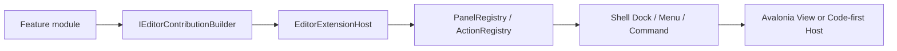
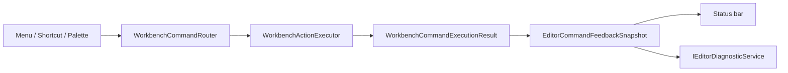
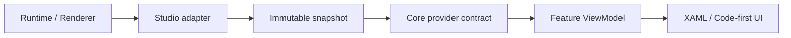

# Studio 框架设计

状态：当前阶段框架总纲
更新日期：2026-07-01

本文整理 `apps/studio` 的核心设计理念和框架边界。它不是功能清单，也不是实现进度表。它回答三个问题：

1. Studio 这个编辑器前端到底按什么框架组织。
2. 当前哪些框架合同已经成立，哪些还只是 v0。
3. 什么时候才允许接入底层 runtime、renderer、native bridge 或 Vulkan viewport。

## 1. 总体判断

Studio 不是没有框架设计。当前已经有编辑器平台框架的骨架：

```text
Core      定义 UI-neutral 合同和数据模型。
Shell     拥有窗口、Dock、菜单、命令、快捷键、状态栏、弹窗和生命周期。
UI        提供主题 token、基础控件、树控件和原生控件覆盖。
Features 通过贡献点注册面板和动作，不直接控制 Shell。
Tests     验证 ViewModel、service、Dock、command 和 Code-first 合同。
```

但它还不是完整编辑器框架。当前大部分能力处于 v0：合同方向正确，闭环还不完整。下一阶段的重点应是把平台闭环补齐，而不是提前接真实底层。

## 2. 核心理念

### 2.1 Studio 是 presentation host

Studio 是编辑器 UI 和工作台宿主，不拥有 engine truth。场景、资产、渲染资源、RenderGraph、native handle 和 GPU 生命周期不能进入 Avalonia 控件树。

正确方向：

```text
runtime / renderer / asset pipeline
  -> adapter
  -> immutable snapshot
  -> Core provider contract
  -> Feature ViewModel projection
  -> Avalonia UI
```

禁止方向：

```text
Avalonia control -> renderer handle
Code-first panel -> native bridge
Feature ViewModel -> Vulkan object
Shell Dock tree -> runtime object lifetime
```

### 2.2 Shell 拥有编辑器外壳

Shell 是全局外壳 owner，负责：

- `MainWindow`
- Dock layout tree
- floating window host
- menu projection
- shortcut routing
- command palette
- status bar
- dialog host
- panel lifecycle
- command feedback

Feature 只贡献 panel/action/provider，不直接创建 Window，不修改 Dock tree，不读取 Shell 内部状态。

### 2.3 用户意图先进入 command

菜单、快捷键、Command Palette、后续 toolbar 和 context menu 都应使用同一条命令路径：

```text
WorkbenchActionDescriptor
  -> WorkbenchActionRegistry
  -> WorkbenchCommandRouter.Execute(commandId)
  -> WorkbenchActionExecutor
  -> WorkbenchCommandExecutionResult
  -> command feedback / diagnostics
```

后续 Undo / Redo、Dirty State 和可写 Inspector 应接入同一命令/事务体系，不能另起隐藏入口。

### 2.4 数据进入 UI 前必须降级为 snapshot

Feature ViewModel 消费的是 UI-neutral snapshot，不是底层对象。snapshot 必须满足：

- 不暴露 native pointer、Vulkan handle 或 Avalonia control。
- 可从后台线程发布，但 UI 更新必须切回 UI dispatcher。
- 有明确版本、状态或过期语义。
- 能表达 empty、unavailable、faulted、stale。
- 可以被测试构造，不依赖真实 runtime。

当前已经成立的例子是 `ISceneSnapshotProvider`。Hierarchy 和 Inspector 通过同一个只读 scene snapshot 投影 UI。

### 2.5 XAML 和 Code-first 是两种 authoring，不是两套框架

长期核心面板优先使用 XAML + ViewModel：

- Hierarchy
- Inspector
- Console
- Problems
- MainWindow
- Command Palette
- Dialog Host

Code-first UI 用于内部工具和调试面板：

- Frame Debugger 试点
- RenderGraph pass 列表
- 只读资源/纹理/shader 诊断
- 小型临时工具
- UI style / component guide

Code-first UI 的本质是：

```text
OnGui(EditorGui)
  -> GuiNode tree
  -> GuiTreeValidator
  -> Shell-owned Avalonia host
```

它不是即时渲染器，不是完整 UI Toolkit，也不是底层直连 API。

## 3. 框架分层

### 3.1 Core

Core 放跨 Feature 共享的 UI-neutral 合同：

- `PanelDescriptor`
- `WorkbenchActionDescriptor`
- `WorkbenchCommandExecutionResult`
- `IEditorSelectionService`
- `IEditorDiagnosticService`
- `IEditorBackgroundTaskService`
- `IEditorTransactionService`
- `IEditorLifecycleEventService`
- `ISceneSnapshotProvider`
- Code-first UI 的 node、state、event、validation model

Core 不依赖 Avalonia、Shell、Feature、renderer、native bridge 或文件系统。

### 3.2 Shell

Shell 编排编辑器外壳：

- Dock workspace
- panel registry 和 panel instance manager
- command router 和 shortcut router
- command palette
- dialog host
- status feedback
- background task summary
- lifecycle events
- Code-first Avalonia host
- composition root

Shell 可以依赖 Core 和 UI，不承载具体 Feature 的业务逻辑。

### 3.3 UI

UI 放可复用视觉能力：

- color / metric token
- base controls
- tree controls
- native control style overrides
- feedback controls

UI 不依赖具体 Feature。控件只暴露 Avalonia property 和视觉状态，不包含 scene 查询、导入逻辑、命令执行策略或底层访问。

### 3.4 Features

Feature 是垂直面板或工具切片：

- `Features/Hierarchy`
- `Features/Inspector`
- `Features/SceneView`
- `Features/Console`
- `Features/Problems`
- `Features/UiStyle`

Feature 通过 `IEditorFeatureModule` 声明贡献。Feature 内部可以有自己的 Views、ViewModels、Models、Services、Styles，但不直接依赖另一个 Feature。

## 4. 当前框架状态

### 4.1 已经成立

这些合同已经能作为后续开发基础：

- 自研 Dock layout graph。
- Panel 注册、打开、关闭、KeepAlive / RecreateOnOpen。
- Workbench action 和 command route。
- 菜单、快捷键、Command Palette 共用 command id。
- Dialog host v0。
- Background task service v0 和状态栏摘要。
- Command feedback v0 和 diagnostics 发布。
- Selection service v0。
- Scene snapshot provider v0。
- Hierarchy / Inspector 的只读 selection-to-inspector 流。
- Editor extension host v0，面向内置 Feature 组合。
- Code-first UI 的 node tree、state store、event queue 和 validation 基础。

### 4.2 部分成立

这些方向正确，但不能当作完整框架使用：

- Console / Problems 有 ViewModel 投影，但可见 UI 还不完整。
- Code-first UI 缺 `OnGui` 异常恢复和错误占位。
- Transaction service 是 UI-neutral v0，还没有接真实文档写入。
- Status bar 只有摘要，还不是完整 notification / task center。
- Design preview 覆盖不完整，部分 design-time 仍会碰 runtime composition。
- Scene View 只是 shell 面板，不是 viewport framework。

### 4.3 明确推迟

这些现在不应实现为真实能力：

- full scene authoring
- writable Transform / Component Inspector
- native C ABI
- native Vulkan viewport
- managed plugin hot reload
- runtime-loaded arbitrary XAML
- external plugin returning Avalonia `Control`
- direct renderer handle exposure to Studio UI

这些能力进入前必须有单独 ADR、smoke plan、Issue slice 和失败状态设计。

## 5. 框架数据流

### 5.1 Panel contribution



原则：

- Feature 只声明贡献。
- Shell 决定放到哪个 workspace、tab、floating window。
- panel content 的创建和释放由 Shell 管。

### 5.2 Command feedback



原则：

- 普通失败默认进入 status/diagnostics，不弹 modal。
- 必须用户决策的操作才进入 Dialog。
- 长任务必须进入 background task service。

### 5.3 Bottom-up runtime data



原则：

- adapter 是底层和 Studio 的唯一桥。
- snapshot 是跨线程、跨模块边界的数据包。
- UI 不同步查询 GPU、文件 IO 或 native runtime。

## 6. 底层接入门槛

接真实底层前，必须先满足这些条件：

1. 对应 UI 面板能显示 empty、loading、unavailable、faulted、stale。
2. provider contract 可以用 fixture 测试，不需要真实 runtime。
3. UI 更新只消费 snapshot，不持有底层对象。
4. 后台线程发布结果后通过 dispatcher 更新 ViewModel。
5. command result 和 diagnostics 可以记录失败原因。
6. 底层 adapter 的生命周期有 owner，能在项目关闭、面板关闭、app exit 时释放。
7. 没有把 Vulkan、C ABI 或 renderer backend 细节提升为通用 UI 模型。

因此，近期只能设计并验证只读 renderer diagnostics contract，不应直接接 native viewport 或 live RenderGraph capture。

## 7. 推荐推进顺序

### Slice 1: visible diagnostics panels v0

补齐 Console / Problems 的可见 UI。目标是让 diagnostics 不只存在于状态栏，也能被底部面板扫描。

不做：

- native log ingestion
- shell command input
- persisted log storage
- final data grid

### Slice 2: code-first failure recovery

补齐 Code-first UI 的失败隔离：

- `OnGui` exception 不崩 Shell。
- validation failure 显示错误占位。
- 保留上一帧有效 UI。
- 发布 diagnostics。

### Slice 3: design preview isolation

让重要 View 的 design-time data 不读写文件、不启动 runtime composition、不依赖本机 layout。

### Slice 4: scene view unavailable state

把 Scene View 明确标成 shell / deferred / no render target attached，避免误导为 live viewport。

### Slice 5: renderer diagnostics snapshot contract v0

定义只读合同，先不接底层：

- frame stats snapshot
- render path snapshot
- render graph pass snapshot
- render resource summary snapshot
- renderer diagnostic record

### Slice 6: frame debugger fixture panel

用 Code-first UI 做 Frame Debugger 试点，只消费 fixture snapshot。验证列表、选择、详情、命令和失败状态。

### Slice 7: real adapter spike

在 UI 和 snapshot 合同稳定后，做一个受限 adapter spike。目标是证明底层数据能异步投影到 UI，不做完整 native viewport。

## 8. 设计红线

任何后续开发如果触碰以下行为，应先停下来写设计：

- Feature 直接创建 Window。
- Feature 直接修改 Dock tree。
- ViewModel 持有 Avalonia `Control`。
- UI 直接访问 renderer/native handle。
- Code-first panel 直接保存项目文件。
- Console / Problems 直接读取底层日志源而不经过 diagnostics service。
- 可写 Inspector 绕过 command / transaction。
- runtime/editor 状态混存在同一个模型里。

## 9. 验证方式

文档-only 改动：

```powershell
git diff --check
```

C# / XAML 改动：

```powershell
dotnet test Editor.sln
git diff --check
```

UI-sensitive 改动还需要手工检查：

```text
1. 默认窗口能打开。
2. 主要面板可见。
3. 空数据、失败数据和窄面板不溢出。
4. 状态栏、Console、Problems 的反馈不互相矛盾。
5. 关闭、重开、浮动、恢复布局后状态没有丢失。
```

## 10. 与现有文档关系

- `项目规范.md`：长期目录、分层、命名、MVVM 和合入规则。
- `Studio代码分类.md`：新增或整理代码时的分类、子目录职责、v0 例外和迁移优先级。
- `编辑器UI平台规范.md`：当前阶段可做和推迟的 UI 平台能力。
- `Dock系统指南.md`：Dock 当前实现事实和后续 Dock 切片。
- `Code-first UI设计.md`：Code-first authoring 和 host 的详细设计。
- `编辑器功能需求清单.md`：长期功能目录，不代表当前 Sprint。

本文是这些资料的框架总纲。若后续修改分层、数据流、底层接入门槛或框架红线，应同步更新本文。
