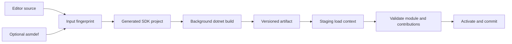

# Editor 扩展开发模型

状态：Target（已批准，尚未实现完整加载链）

更新日期：2026-07-11

## 1. 目的

本文定义游戏工程开发者如何在项目内编写 Studio 扩展，以及 Package、已安装插件和 Studio 内置功能如何复用同一套 Editor Framework。

构建/ALC 的正式运行时合同见 [Editor 扩展构建、装载与重载](editor-extension-build-and-reload.md)；复杂 XAML 的正式 Host 边界见 [Avalonia/XAML Editor 扩展规范](editor-extension-avalonia.md)。本文保留开发者入口和必要摘要，不覆盖这两份专题规范。

核心结论：

> 内置功能、项目 `Editor/`、Package `Editor/` 和已安装插件不是四种 API。它们是同一种 `EditorModule` 的四种来源。

来源只影响发现位置、启用策略、构建缓存和可重载性，不改变 Panel、Inspector、Command、Viewport Tool 或 Avalonia UI 的 authoring contract。

## 2. 最小项目体验

项目根目录的 `Editor/` 是 project-local editor code 的唯一隐式入口：

```text
MyGame/
  Assets/
  Source/
  Editor/
    MyGameEditorModule.cs
    Panels/
    Inspectors/
    ViewportTools/
```

没有程序集定义时，Studio 把 `Editor/**/*.cs` 编译为一个隐式程序集。文档/UI 可显示 `MyGame.Editor`，但真实稳定 `AssemblyName` 必须由 `projectId` 派生为 `Asharia.Project.<ProjectIdHash>.Editor`；项目显示名或目录改名不改变 identity。该程序集只面向 Editor，不进入 Player、Cook 或 Runtime 发布物。

```csharp
using Asharia.Editor;

[EditorModule(
    Id = "com.example.mygame.editor",
    Scope = EditorModuleScopeKind.Project,
    Activation = EditorModuleActivationKind.OnScopeReady,
    Handover = EditorModuleHandoverKind.Coexist)]
public sealed class MyGameEditorModule : EditorModule
{
    public override void Configure(EditorModuleBuilder editor)
    {
        editor.Panels.AddCodeFirst<MyGameToolsPanel>(
            id: "com.example.mygame.tools",
            title: "My Game Tools");

        editor.Inspectors.Add<PlayerInspector>();
        editor.Viewport.Tools.Add<SpawnPointTool>();
    }
}
```

Studio 不扫描项目内任意深度、任意同名的 `Editor/`。Package 拥有各自的 `Editor/`；项目自有代码统一进入项目根 `Editor/`，避免隐藏编译顺序。

## 3. 程序集定义

大型项目或 Package 使用 `*.asmdef` 建立显式程序集边界。`.asmdef` 是 Asharia 面向开发者的程序集定义，不是插件清单，也不是完整构建脚本。

```text
MyGame/
  Editor/
    MyGame.Editor.asmdef
    MyGameEditorModule.cs
```

```json
{
  "$schema": "https://schemas.asharia.dev/assembly-definition/v1.json",
  "schemaVersion": 1,
  "name": "MyGame.Editor",
  "rootNamespace": "MyGame.Editor",
  "target": "editor",
  "references": [
    "Asharia.Editor"
  ],
  "managedPackageReferences": [],
  "uiBackend": "code-first",
  "platforms": [
    "win-x64",
    "linux-x64",
    "osx-x64",
    "osx-arm64"
  ],
  "allowUnsafeCode": false,
  "reloadPolicy": "managed"
}
```

字段语义：

| 字段 | 语义 |
| --- | --- |
| `name` | 全局稳定的程序集名；不能用路径或显示标题代替 |
| `target` | `editor` 表示不进入游戏 Runtime/Player |
| `references` | 按程序集名解析的显式依赖 |
| `managedPackageReferences` | 需要 restore 的 NuGet/managed package reference；解析结果进入 lock/fingerprint |
| `uiBackend` | `code-first`、`avalonia` 或 `mixed` |
| `platforms` | 可构建和加载的 RID；省略表示所有 Studio 支持平台 |
| `allowUnsafeCode` | 是否允许 managed unsafe；默认 `false` |
| `reloadPolicy` | `managed` 或 `restart-required` |

Managed package entry 使用固定 schema：

```json
{
  "id": "Example.Library",
  "version": "[1.2.3]",
  "assets": ["compile", "runtime"]
}
```

`version` 使用 NuGet VersionRange 语法；推荐 exact `[x.y.z]`，允许 range 也必须由 lock 固定到精确 graph。`assets` 默认只允许 `compile`/`runtime`；`analyzers`、`build`、`buildTransitive` 或 native asset 会执行或注入构建逻辑，必须显式声明相应 trusted-build capability，并可能提升为 external-build/restart-required。

嵌套 `.asmdef` 可以定义子程序集；源码归属最近的祖先 `.asmdef`。不允许同一目录出现多个 `.asmdef`，不允许程序集依赖环。

`reloadPolicy` 是 assembly 的请求上限，不是单方面承诺。Package generation 的有效策略取所有 assembly、module handover、UI backend、native/external dependency 中最严格者；Avalonia/XAML 和 native dependency 默认提升为 `restart-required`，除非 Host compatibility table 明确开放更高 reload tier。

Studio 将 `.asmdef` 转换为缓存中的 SDK-style `.csproj` 并调用 `dotnet build`。生成的 `.csproj` 是构建实现，不是第二份由开发者维护的扩展定义。

程序集身份不是 simple assembly name。Host 使用：

```text
EditorAssemblyId = (PackageName, AssemblyName)
```

项目根 `Editor/` 使用由 `asharia.project.json` 的稳定 `projectId` 派生的 synthetic package name；先把 UUID 规范为 lowercase `canonicalProjectId`，零配置 implicit assembly 再使用 lowercase hex `ProjectIdHash = first128bits(SHA-256(UTF8(canonicalProjectId)))` 派生 `Asharia.Project.<ProjectIdHash>.Editor`。Package assembly 使用 `asharia.package.json.name`。`.asmdef` 中同 Package reference 可以写 assembly name，跨 Package reference 必须写 `packageName::assemblyName`。Host-provided `Asharia.Editor` 和 `Asharia.Editor.Avalonia` 是保留名称。

`EditorAssemblyId` 解决逻辑 owner 与依赖寻址，但所有 process-resident Editor entry/aggregate assembly，以及可被 Avalonia/resource/tooling 通过 global simple-name lookup 访问的 resource assembly，simple name 仍必须按大小写不敏感比较全局唯一。该 name reservation 只有 Collectible unload probe 证明旧 assembly 消失后才释放；Pinned/Static/Leaked generation 到进程退出都继续占用。纯代码 private dependency 可以在隔离 ALC 中重名；Code-first 只允许同一 `EditorAssemblyId` 的 old/new staging 临时同名，不能让无关 Package 复用，且不得走 global lookup。Avalonia experimental reload 必须使用 generation-unique physical name 与 exact resource routing。推荐公开 assembly 使用公司/Package 限定名称，例如 `Example.Terrain.Editor`。

任意外部 `.csproj` 不参与隐式发现。确需自定义 MSBuild target 的受信任扩展，可以在 Package 清单中显式声明 external build project；这类模块默认 `restart-required`，不享受可重复构建和热重载保证。

## 4. Package 与 Plugin

Package 是分发和依赖单位；Plugin 是“包含 Editor contribution 且被启用的 Package”的产品称呼，不是另一套框架。

```text
Packages/
  Terrain/
    asharia.package.json
    Runtime/
      Native/
    Editor/
      Terrain.Editor.asmdef
      TerrainEditorModule.cs
      Views/
      Assets/
```

`asharia.package.json` 是仓库已经使用的统一 Package manifest。Editor Framework 在现有格式上增加可选的 `editor` section，不另造 Studio 专用 package manifest：

```json
{
  "name": "com.example.terrain",
  "displayName": "Terrain Tools",
  "version": "1.2.0",
  "description": "Terrain runtime and editor tools.",
  "dependencies": [
    {
      "name": "com.example.brushes",
      "version": ">=2.1.0 <3.0.0",
      "source": "asharia-official",
      "allowPrerelease": false
    }
  ],
  "editor": {
    "compatibility": {
      "studio": ">=1.0.0 <2.0.0",
      "editorApi": ">=1.0.0 <2.0.0",
      "avaloniaBridge": ">=1.0.0 <2.0.0"
    },
    "assemblies": [
      {
        "source": "Editor/Terrain.Editor.asmdef"
      }
    ],
    "requestedCapabilities": []
  }
}
```

Compatibility range 同样使用 `asharia-comparator-set-v1`，不接受 `1.*` 等 wildcard：

- `studio` 对比 Studio product manifest 的 exact SemVer；
- `editorApi` 对比 Studio SDK manifest 中 `Asharia.Editor` public API SemVer；
- `avaloniaBridge` 对比 `Asharia.Editor.Avalonia` bridge SemVer，纯 Code-first Package 可以省略；
- prerelease Host version 默认不匹配，除非 `editor.compatibilityAllowPrerelease: true`；
- TFM/RID、module-index schema 和 native ABI 仍是独立 compatibility dimension，不塞入上述 SemVer range。

Host 在执行 extension code 前按 lock 固定的 manifest/artifact metadata 检查这些版本；schema conformance fixtures 必须覆盖 lower/upper boundary、prerelease、缺失字段和不支持 grammar。

`editor.requestedCapabilities` 表示 filesystem/network/process/native 等安装审计与用户确认，不等于 Module runtime `EditorCapabilityId` dependency graph，也不构成进程内安全沙箱。

为兼容现有 Engine Package，`dependencies` 也接受字符串，例如 `"com.asharia.core"`。字符串只表示当前 workspace/随 Studio catalog 中唯一的同名 dependency，解析后仍由 lock 固定 exact version/source/hash，不能用于从远程 registry 漂移选择版本。可发布的外部依赖使用 object entry：`name` + Asharia Package SemVer `version` range，可选 `source` 只能引用 Studio/Project policy 中预先配置的 logical source ID，不能写任意 URL 或 credential。

Resolve/Update 对同一 PackageName 求所有 version range 的交集；同 version 不同 source/hash 不做静默覆盖。一个 Studio process 的 Application + Project graph 对每个 PackageName 只允许一个精确 resolved identity。

Asharia Package range 使用固定 `asharia-comparator-set-v1` grammar，不复用 NuGet range，也不接受 npm 的 caret/tilde/OR/wildcard：

```text
range       := comparator (SP comparator)*
comparator  := ("=" | ">" | ">=" | "<" | "<=")? semver
semver      := SemVer 2.0.0 exact version
```

所有 comparator 是 AND；裸版本等价于 `=`。版本 precedence 遵循 SemVer 2.0.0，build metadata 不参与 precedence；Package name 与 source ID 使用 lowercase ASCII canonical form，SemVer prerelease identifier 按 SemVer 大小写敏感比较。Prerelease candidate 默认排除，只有 dependency entry 显式 `allowPrerelease: true` 才参与。Manifest/schema、resolver、CLI、native tooling 和 Studio 必须共享同一 grammar version 与 conformance fixture，遇到不支持的语法直接失败。

可分发 Package 可以在 `editor.prebuiltArtifacts` 中提供经过 CI 验证的 Package-wide artifact：

```json
{
  "editor": {
    "assemblies": [
      {
        "source": "Editor/Terrain.Editor.asmdef"
      }
    ],
    "prebuiltArtifacts": [
      {
        "id": "net10-any",
        "artifact": "EditorArtifacts/net10.0/Terrain.Editor.package-artifact.json"
      }
    ]
  }
}
```

Artifact manifest 覆盖该 Package 的全部 Editor assembly，记录每个 logical `EditorAssemblyId`、TFM、RID/any、Editor API、Avalonia bridge、module-index schema、DLL/PDB/resource，以及 Package aggregate host、统一 `.deps.json`、private/native asset table 和 content hash。Lock 必须为整个 Package generation 选择 `source-build` 或某个 prebuilt artifact ID；不允许逐 assembly 混合 source/prebuilt 后临时合成依赖闭包。散落 DLL 不是完整插件。

`managedPackageReferences` 的 feed/credential policy 由 Project/Studio 统一配置，`.asmdef` 不能注入任意 restore source。直接和传递版本进入锁文件；Host-shared Editor/Avalonia assembly 不能被该字段覆盖。

职责必须分离：

- `asharia.package.json`：现有 Package `name`/版本/依赖，以及可选 Editor assembly、兼容范围和安装审计用 `requestedCapabilities`；
- `*.asmdef`：程序集、引用、平台、UI backend 和编译策略；
- `[EditorModule]`：Panel、Command、Inspector、Importer、Viewport Tool 等 contribution；
- CMake/native package metadata：C++ Runtime Module 的构建与装载。

项目 Package、用户级已安装 Package、C++ Engine Package 和 Studio 随附 Package 使用同一个 `asharia.package.json` identity。不存在“内部插件清单”和“第三方插件清单”两种 schema。

项目提交 `asharia.packages.lock.json` 固定 Project catalog；Studio installation/user profile 维护同 schema 的 Application catalog lock，供全局 Installed Package 在没有 Project 时解析（即使它只包含 Project-scoped module）。打开 Project 时，active Application 与其他 Project catalog 都是精确约束；同名 Package 必须具有完全相同的 `PackageGenerationId`、artifact selection、managed/native resolved subgraph 和 closure hash 才复用，只比较 manifest version/source/content hash 不足。若另一个 ProjectSession 正在 lease 旧 generation，普通更新返回 `PackageGenerationInUse` 并要求先关闭冲突 session；不能暗中改写其他 Project lock 或并行加载两个 generation。

Package 安装/更新先进入 content-addressed 临时位置并创建 candidate catalog snapshot。只有完整 generation/reload closure build、load、validate、required activation outcome（Active 或显式 WaitingForCapability）与 registry commit 成功，才推进规范 lock 和 active catalog pointer；真实 activation failure 或 crash 恢复完整 previous snapshot，不能让新 lock 与旧 LKG artifact 混用。不能在 active Package 目录原地覆盖。

Managed/NuGet dependency 由显式 Resolve/Update 操作写入上述 lock；普通 build 从 lock 为每个 generated assembly/aggregate project materialize 标准 NuGet `packages.lock.json` 并启用 `RestoreLockedMode`，再校验 aggregate `.deps.json` 与 Asharia lock 完全一致。漂移直接失败，不能先 floating restore 再事后记录。完整合同见 [Editor 扩展构建、装载与重载](editor-extension-build-and-reload.md)。

## 5. 统一 EditorModule

```csharp
public abstract class EditorModule
{
    public abstract void Configure(EditorModuleBuilder editor);

    public virtual ValueTask<IEditorModuleActivation> ActivateAsync(
        EditorModuleContext context,
        CancellationToken cancellationToken) =>
        new(EditorModuleActivation.Empty);
}

public interface IEditorModuleActivation : IAsyncDisposable
{
    ValueTask<EditorModuleQuiesceResult> QuiesceAsync(
        EditorModuleStopReason reason,
        CancellationToken cancellationToken);

    ValueTask ResumeAsync(
        EditorModuleResumeContext context,
        CancellationToken cancellationToken);
}
```

`EditorModuleActivation.Empty` 是框架提供的幂等 no-op lease，纯 contribution module 使用默认实现即可。

规则：

- 构造函数与 `Configure()` 必须无 IO、native call、线程创建和控件创建副作用；
- `Configure()` 只声明不可变 contribution 与模块局部服务；
- 相同 artifact/DefinitionContext 的 `Configure()` 输出必须确定性一致，不读取 clock、random、environment 或隐式 current project；
- 可能失败的连接、订阅和后台任务进入 `ActivateAsync()`；
- 所有订阅、任务、provider 和 UI resource 必须由 module scope 或 activation lease 追踪；
- `QuiesceAsync()` 停止接收新工作并到达可切换安全点，但不销毁 generation；
- reload 在 commit 前失败时，Host 可以调用 `ResumeAsync()` 恢复旧 generation；
- `DisposeAsync()` 完成不可逆释放，调用后不得恢复；
- Host 按注册逆序释放 lease，普通模块不能移除其他 owner 的 contribution。

`EditorModuleResumeContext` 包含 `ReloadRollback` 或 `CapabilityRecovered` reason、当前 `ScopeInstanceId` 与新的 capability ID/Epoch snapshot；它不暴露 concrete EngineBridge/native handle。Reload rollback 可以复用原 capability epoch，device/runtime recovery 必须显式传入新 epoch，module 不能从旧 context 猜测。

`[EditorModule].Id` 是稳定 `ModuleLocalId`，采用命名空间化字符串；`EditorModuleDefinitionId = (EditorAssemblyId, ModuleLocalId, ScopeKind)`。Entry CLR type 只记录在 module index，不参与稳定 identity，因此重命名类不影响 old→candidate 匹配。省略、重复或不合法 ID 是生成/构建错误；修改 ID 是显式 breaking change，必须伴随 state/contribution migration。

### 5.1 Definition object 与 scope activation

Host 每个 Package generation、每个 `EditorModuleDefinitionId` 只创建一个 CLR `EditorModule` definition object，并且只调用一次 `Configure()`。Application catalog 在没有 Project 时也可以 configure/validate Project-scoped definition。

Source Generator 在 module index 中生成 definition factory；module type 必须是非抽象 class并提供无参数构造路径（构造函数可以由同 assembly 生成代码访问），不使用 Host DI constructor。Package/assembly 的 immutable manifest/configuration 通过 `EditorModuleBuilder.DefinitionContext` 读取，Project/service state 只能在 `ActivateAsync(EditorModuleContext, ...)` 取得。

同一个 definition object 的 `ActivateAsync()` 会对不同 `EditorModuleInstanceId` 调用一次，并可能因多个 ProjectSession 并发执行。约束：

- definition constructor/`Configure()` 完成后对象必须 immutable、thread-safe；
- 不得在 definition 字段保存 `EditorModuleContext`、当前 Project、subscription、task、provider、Control 或 per-scope mutable state；
- descriptor/factory delegate 只能捕获 immutable generation configuration，scope state 必须通过 factory context/activation lease 显式取得；
- 每个 scope 的 mutable state 和 teardown 全部属于返回的 `IEditorModuleActivation`；Host 对同一 `EditorModuleInstanceId` single-flight activation，但不串行化不同 ProjectSession；
- analyzer 对明显的 mutable field/context capture 报错或警告；无法证明 thread-safe 的 module 可以改用显式 activation object/factory helper，但仍遵守同一 identity/lifetime。

Host 提供默认 activation scope，普通纯 contribution/module 不需要手写 lifetime object。直接拥有 thread、watcher、subscription 或其他副作用的模块才需要扩展 quiesce/resume 行为。

`[EditorModule]` 的 module index 固定 `Activation = OnScopeReady | OnDemand` 与 `Handover = Coexist | QuiesceThenActivate | RestartRequired`。`OnDemand` module 再在 `Configure()` descriptor 中声明一个或多个 activation trigger：

```text
OnCommand:<id>
OnPanel:<id>
OnInspector:<type-id>
OnAsset:<asset-type-id>
OnPlayMode
Manual
```

`Configure()` 和 descriptor validation 总会在 generation staging 时运行；activation trigger 只延迟 `ActivateAsync()` 的副作用。Command/panel/provider host 在第一次使用 contribution 前确保 owner module 已激活。默认 Project module 为 `OnScopeReady`；昂贵工具选择 `OnDemand` 和精确 trigger，不能全部挤入 Studio startup。

Handover policy 语义：

```text
Coexist              candidate 可在旧 generation quiesce 前激活
QuiesceThenActivate  旧 generation 可逆 quiesce 后才激活 candidate
RestartRequired      不提供进程内 generation replacement
```

普通无独占资源 module 使用 `Coexist`；singleton provider 等独占角色使用 `QuiesceThenActivate`。后者只有在 `QuiesceAsync()` 能释放 exclusivity、`ResumeAsync()` 能确定性重新取得它时才属于 managed reload；否则必须 `RestartRequired`。Host validation 禁止 singleton role 误报为可并存。

Handover 沿 required activation dependency 传播：依赖 `QuiesceThenActivate` module 的 candidate，即使自身声明 `Coexist`，也必须延迟到旧 graph quiesce 后按 dependencies-first 激活。Candidate activation 不允许引用旧 generation 的 service/instance。

### 5.2 Required dependency graph

Assembly/Package reference 只解决 build/load，不自动产生 module activation 顺序。Module 在 `Configure()` 中声明 runtime dependency：

```csharp
editor.Dependencies.RequireModule(TerrainEditorModules.Core);
editor.Dependencies.RequireCapability(EditorCapabilities.Project.EngineReadyV1);
editor.Dependencies.OptionalCapability(TerrainEditorCapabilities.BrushLibraryV1);
editor.Capabilities.Provide(TerrainEditorCapabilities.TerrainToolsV1);
```

- required module/capability edge 进入 activation topology、failure closure 和 QTA delayed propagation；
- `Provide` 只在 Configure 阶段声明 provider；capability availability 只有 owner activation Active 后才变为 Ready，owner quiesce/fault/dispose 时同步撤销或进入 Recovering；
- optional capability 不创建 activation edge，缺失时 module 必须正常降级并通过 context 查询；
- Project → Project dependency 绑定同一 `ProjectSessionId`；Project → Application 允许；Application → Project 禁止；
- 跨 Package `RequireModule`/capability provider 必须同时存在 Package dependency 与 assembly reference，禁止运行时隐式发现；
- Host capability（例如 Project/Engine ready）作为明确的 lifecycle node；Project pending 先 configure dependency graph，再启动 required Engine capability，最后 activation；
- required cycle、scope 逆向依赖、缺失 provider、ambiguous singleton provider 都在 candidate 可见前失败。

`EditorCapabilityId` 包含 contract major（例如 `.v1`），v1 不做运行时 range 猜测。提供方版本升级需要新的 ID 或 Editor API compatibility decision。

`RequireCapability` 是 module activation gate，不是 Project-open veto。若已声明的 Host capability 暂时 `Unavailable/Recovering`，module instance 进入 `WaitingForCapability`，其 descriptor 随原子 scope partition 发布但呈 disabled/unavailable placeholder；capability Ready 后 Host 对该 `EditorModuleInstanceId` single-flight activation。第三方 extension 不能声明 hard Project-open gate；只有 Host infrastructure 自身决定 `Ready/EngineUnavailable`。

Capability 带单调 `Epoch`。Device lost/restart 时，依赖 module 先 `QuiesceAsync(CapabilityLost)` 并进入 Blocked；新 epoch Ready 后 Host 对仍可恢复的 activation 调 `ResumeAsync()`，否则 dispose scope activation并重新 `ActivateAsync()`。失败只 fault 该 module instance/dependent chain并显示诊断，不清空无关 Project contribution。

`[EditorModule]` 的 Source Generator 生成程序集内 module index。Host 使用生成索引定位入口；反射扫描只作为开发期诊断兜底，不是主要加载协议。

## 6. Module scope

Module source 与 module scope 是两个正交维度：

```csharp
public enum EditorModuleScopeKind
{
    Application,
    Project,
}
```

| Scope | 实例数和生命周期 | 可用服务 | 典型模块 |
| --- | --- | --- | --- |
| `Application` | 每 Studio process 一个；最后关闭 | preferences、global diagnostics、application commands | 全局 Package 管理/诊断工具 |
| `Project` | 每个 `ProjectSession` 一个；Project close 前停用 | project、documents、assets、worlds、Play Mode、viewport | Scene、Inspector、项目工具、importer UI |

Built-in assembly 可以同时包含 Application-scoped 和 Project-scoped module；内置 Scene/Hierarchy/Inspector 应是 Project scope。Application catalog 中的 installed Package 也可以声明两种 module。项目根 `Editor/` 和仅由项目 Package graph 发现的 module 只能声明 Project scope，因为其 source 和 dependency graph 随该 Project 发现与销毁。

Scope 由 `[EditorModule(Scope = ...)]` 或生成 module index 明确记录，不能根据 `ExtensionSourceKind` 猜测。`EditorModuleContext` 只暴露该 scope 合法的 service；Application module 不存在隐式 `CurrentProject`。

Module definition identity 与 runtime instance identity 分开。Project module instance 使用 `EditorModuleInstanceId = (EditorModuleDefinitionId, ProjectSessionId)`；其 contribution registry、command context、Panel/provider resolution 都按 `ProjectSessionId` 分区。同一 Package 在两个 ProjectSession 中可以实例化相同 logical contribution ID，不会注册到另一项目；持久化 layout/state 仍保存 project-local logical contribution/definition ID，重新打开时绑定到新的 scope instance。

创建 ProjectSession 时，Host 不逐 module 直接注册，而是把 BuiltIn、Application-catalog Installed、目标 Project catalog 与项目根 `Editor/` 的 Project-scoped descriptor 合并到不可见 ProjectScope partition，统一验证 ID/role/dependency/capability，并记录每个 instance 的 Active/Waiting/Faulted/Blocked outcome 后原子发布。Structural failure 才丢弃该 `ProjectSessionId` partition；committed-catalog activation fault 以 error placeholder 隔离，不回滚 Application catalog或影响其他 Project。

Panel/document instance 自己还有更细生命周期，但不因此为每个 Panel 创建一份 Module。未来若需要 `Workspace`/`Document` module scope，必须版本化 module contract 后新增，不能把它伪装成 Project scope。

## 7. Contribution 类型

公共 Editor Framework 至少提供：

- Panel、Editor-owned Window content；
- Command、Menu、Toolbar、Shortcut、Command Palette；
- Inspector、Property Drawer、Decorator；
- Asset Editor、Importer frontend、Preview；
- Viewport Tool、Overlay、Gizmo、Selection handler；
- Project/User Settings page；
- Diagnostic source、Background task；
- Custom document/editor。

Contribution descriptor 是不可变声明；运行实例由对应 Host 创建和释放。Contribution ID 必须采用反向域名或同等命名空间化形式。ID 冲突是配置错误，Host 报告双方 owner 并拒绝提交，不进行静默覆盖。

## 8. UI authoring

### 8.1 Code-first

Code-first 是默认且兼容性最稳定的方式：

```csharp
public sealed class TerrainPanel : CodeFirstEditorPanel
{
    protected override void OnGui(EditorGui ui)
    {
        ui.Toolbar("toolbar", toolbar =>
        {
            toolbar.SearchField("search", searchText_);
            toolbar.CommandButton("bake", TerrainCommands.Bake);
        });

        ui.Split("content", split =>
        {
            split.List("layers", layers_, selectedLayerId_);
            split.PropertyGroup("properties", selectedLayer_);
        });
    }
}
```

`OnGui` 产生 UI-neutral node tree，由 Studio 的 Avalonia reconciler 创建和复用控件。它不是 GPU immediate renderer，也不允许访问 Avalonia visual tree。

### 8.2 Avalonia/XAML

复杂长期 UI 可以引用可选的 `Asharia.Editor.Avalonia`：

```csharp
editor.Panels.AddAvalonia<TerrainGraphView, TerrainGraphViewModel>(
    id: "com.example.terrain.graph",
    title: "Terrain Graph");
```

允许扩展创建 panel content `Control`、`UserControl`、templated control 和 compiled XAML。Host 仍拥有顶层 Window、Dock container、focus scope、面板生命周期和错误占位。

Avalonia 扩展禁止：

- 创建或管理 Studio 顶层 `Window`；
- 修改 Dock tree 或替换 Shell chrome；
- 向 `Application.Current.Styles` 注入全局样式；
- 持有 native window、Vulkan surface、swapchain 或 renderer pointer；
- 绕过 Command/Transaction/Undo 修改项目数据。

资源使用程序集限定的 `avares://AssemblyName/...`。样式挂在扩展内容根或专属 ControlTheme 下，并消费 Studio semantic tokens。

`Asharia.Editor.Avalonia` 是同一扩展 API 的可选 UI bridge，不是第三方专用 SDK。内置、项目和 Package extension 都可使用；其兼容周期比 UI-neutral `Asharia.Editor` 更严格。

## 9. 构建、缓存与文件变化



要求：

- 构建在独立进程和后台任务中运行，不阻塞 Avalonia UI thread；
- 输出写入项目 `.asharia/` 或用户缓存，不写入 `Editor/` 源码目录；
- cache key 至少包含源码、`.asmdef`、Package lock、Editor API、SDK 和目标 RID；
- 文件监听事件只触发 debounce；是否重建以重新计算的 fingerprint 为准；
- watcher error、窗口重新获得焦点、Git checkout 和项目切换触发完整扫描；
- 编译失败保留 last-known-good artifact，并把结构化诊断投影到 Problems/Console；
- 新构建被更新输入超越时取消或丢弃，绝不激活过期 artifact。

构建执行统一调用 `dotnet`，使用 `ProcessStartInfo.ArgumentList`，不依赖 PowerShell、`.bat`、Visual Studio 或平台 shell。

## 10. 加载与重载

默认 load/reload unit 是 Package generation，而不是单个 `.asmdef`。一个 Package 的所有 managed assembly 和 private dependency 进入同一个隔离 `AssemblyLoadContext`；项目根 `Editor/` 视为一个 synthetic Package。先把 UUID `projectId` 规范为 lowercase canonical text，再生成 reserved name `project:<projectId>:editor`、version sentinel `0.0.0-project`、logical source `project:<projectId>/editor`；content hash 是 canonical `Editor/**` source/resource/asmdef 集合的 hash，本机绝对路径不进入 identity。这样 Package identity、资源、私有依赖和生命周期拥有同一个边界。

Managed-reload-eligible dynamic unit 使用 collectible ALC；已知 `restart-required` unit 使用隔离、non-collectible pinned ALC；App 直接引用的 BuiltIn assembly 是 default-ALC static generation。三者由 `PackageGenerationHost` 统一管理 scope/registry lease。以下 Host contract 必须解析到默认加载上下文中的共享实例：

```text
Asharia.Editor full identity
Asharia.Editor.Avalonia full identity
Host-pinned Avalonia compatibility identities
Host 明确公开的其他 framework full identities
BCL/runtime assemblies through normal runtime resolution
```

共享表是 full-identity allowlist，不是 `Avalonia.*`/`System.*` 名称通配。扩展请求必须解析到 Host 已知 assembly provenance 和 compatibility band。

扩展不得私带另一份共享 contract 或不兼容 Avalonia 主版本。扩展私有依赖保留在自身加载上下文；跨 Package CLR 类型依赖必须同时出现在 `asharia.package.json.dependencies` 和 `.asmdef` assembly reference 中，重载和卸载按 dependents-first 顺序执行。

重载只对声明为 `managed` 且通过 `Coexist` 或可逆 `QuiesceThenActivate` handover contract 的模块开放。持有无法可逆交接的 exclusive global/native resource 的模块必须 `restart-required`。

以下流程只适用于 managed-reload-eligible collectible closure；restart-required 走 PendingRestart，不在当前进程执行：

1. 后台构建新 artifact；
2. 在 staging load context 中加载、索引、`Configure()` 和验证；
3. 计算 required activation graph；只在旧 graph quiesce 前按 dependencies-first 激活不依赖 delayed/QTA module 的 early `Coexist` set；Dormant lazy module 不强行激活；
4. Host 保存 UI-neutral state，并让旧 graph 按 dependents-first quiesce；
5. 按 dependencies-first 激活 QTA module 及其全部 delayed dependents；
6. 执行预校验后的 registry closure 与对应 catalog snapshot commit；
7. commit 前失败时按 dependents-first 释放整个 candidate closure，再按 dependencies-first `ResumeAsync()` 完整旧 graph；
8. commit 后 Detach/Dispose 全部旧 View、task、provider 和 activation lease；
9. 对旧 collectible closure 调用 `Unload()` 并执行负向泄漏检查；
10. 下次启动/构建失败时选择完整 last-known-good catalog snapshot。

原子性适用于 contribution registry closure 的可见性和对应 versioned catalog snapshot；任意外部副作用不宣称自动事务化。无法满足 staging/coexist/quiesce/resume contract 的模块必须要求重启。

`.NET` unload 是 cooperative。已知 `restart-required` Package 从首次 load 就进入隔离、non-collectible pinned host：Project close 释放 module/UI scope 但保留 exact generation，重开项目复用它，source/lock 变化只生成诊断并等待进程重启。Managed collectible generation 无法卸载时，Host 隔离整个 Package reload unit 并停止继续创建新 ALC；已经调用过 `Unload()` 的 leaked host 不能复用，只能要求重启。包含 native library、无法释放的 global/static reference 或自定义 external MSBuild 的模块应主动声明 `restart-required`。

Pinned Package 对其 transitive Package generation 保留 dependency lease；依赖更新同样需要重启，不能在 pinned dependent 背后替换 assembly/service identity。

Restart-required update 不在当前进程加载 candidate。Host 持久化包含 candidate lock/closure、previous committed snapshot 与 boot-attempt 状态的 PendingRestart snapshot；下次 clean boot 只尝试 candidate 一次，成功后才推进规范 lock/LKG。Application catalog 只激活启动时存在的 Application scope；Project catalog 必须在目标 ProjectSession/Engine context 中取得有效 required outcome（Active 或 soft-gate Waiting）。失败或 crash 后立即/下次 relaunch previous committed snapshot，不能在可能被 Avalonia/global registry 污染的同一进程混载旧 generation。

Avalonia/XAML assembly 默认 `restart-required`。只有当 Avalonia backend 已证明 generation-aware resource resolution、旧 Control 全部 detach、extension styles/resources 清理、全局 property/type registry 注销和 ALC negative leak probe 后，某个 compatibility band 才能开放 managed reload；不能仅凭 `Unload()` 被调用就宣称 XAML 热重载成功。

跨 reload 保存的状态必须是 Host 拥有的、可序列化的 UI-neutral 数据，并带 state schema version。禁止把插件类型实例、delegate、Control 或 Assembly 保存到下一 generation。

## 11. C++ 与 Editor Framework

C++ Engine 负责：

- World、ECS/object model、simulation；
- renderer、Vulkan device、GPU resource、frame scheduling；
- native asset/runtime system；
- native plugin ABI 和 platform backend。

C# Editor Framework 负责：

- Editor module discovery、build、load、activation；
- Panel、Inspector、Command、Undo、Selection 和工具工作流；
- Avalonia presentation；
- Engine snapshot、command 和 viewport tool 的 managed projection。

同一个 Package 可以包含 Runtime C++ Module 和 Editor C# Module，但 Editor code 通过稳定 Engine service、type ID、snapshot 和 command contract 访问 native 能力，不持有 C++ pointer 或自行销毁 Engine resource。

Hybrid Package 的顺序由 EngineHost/ProjectSession 统一协调：

```text
resolve Package/RID
  -> EngineHost load native runtime module and negotiate ABI
  -> publish typed Editor-facing capability
  -> activate Project-scoped managed EditorModule

project close/restart
  -> quiesce managed tools/providers
  -> dispose managed activation
  -> stop native callbacks/work
  -> EngineHost unload/restart native module
```

Managed extension 不直接 P/Invoke Engine Package。Native ABI 必须定义 version/struct-size、allocator/release、thread/callback、error ownership 和 shutdown drain。Native module failure 使对应 capability/module 进入 unavailable/degraded，不允许 managed half-activation。

Importer contribution 只是 Editor frontend、settings 和 diagnostics。真正 import/cook 必须进入可 headless、确定性、可由 CI 调用的 asset pipeline，不能把生产导入逻辑放在 Avalonia View 或 EditorModule 回调中。

Viewport extension 只贡献 tool、overlay、gizmo 和 input policy；Scene/Game frame 的 native 渲染和 GPU presentation 仍由 EngineHost 与 Viewport service 拥有。

## 12. 信任与安全

进程内 managed extension 是受信任代码。`AssemblyLoadContext` 只解决依赖隔离和协作式卸载，不是安全或可靠性沙箱。

Package 可以在 `requestedCapabilities` 声明 filesystem、network、process、native 等安装权限意图，用于审计、启用确认和未来 out-of-process routing；当前不能声称这些声明可以阻止插件直接调用 BCL。真正不可信扩展必须进入独立 OS process/container，并使用收窄协议。

## 13. 兼容性

- `Asharia.Editor` 遵循语义版本；同一 major 内保持公共 contract 的源代码/二进制兼容目标；
- contribution schema、`.asmdef` 和 Package schema 独立版本化；
- `Asharia.Editor.Avalonia` 与 Studio 支持的 Avalonia major/minor compatibility band 绑定；
- Host 在执行扩展代码前验证 Package、Editor API、UI backend、RID 和 native ABI；
- 不兼容模块显示明确诊断并保持禁用，不能尝试“尽量加载”；
- Preview API 使用独立 namespace/attribute，不能假装稳定 API。

版本维度不能混成一个字符串：

| 维度 | 用途 |
| --- | --- |
| Package SemVer | 分发、依赖和 lock resolution |
| CLR `AssemblyVersion` | type/binary binding；Editor API major 内保持稳定策略 |
| File/Informational version | artifact provenance 和具体 build |
| Editor API version | 公共 module/service/contribution contract |
| Avalonia bridge band | Avalonia/XAML binary compatibility |
| Module-index schema | module discovery protocol |
| `.asmdef` schema | assembly/build input |
| State schema | reload/layout state migration |
| TFM/RID | managed runtime 与平台 artifact |
| Native ABI | C++ struct/call/ownership compatibility |

Public API 使用 ApiCompat/PublicApiAnalyzer 和历史 fixture 强制验证；不能只靠文档声称“同 major 兼容”。

## 14. 验收门禁

至少验证：

- built-in、project、Package 三种来源注册相同 contribution 后行为一致；
- 多 ProjectSession 下 `EditorModuleInstanceId`、registry、command/panel/provider resolution 不串项目；
- ProjectScope 合并跨 catalog descriptor 后一次提交；structural failure 无 partial partition，runtime activation fault 以 owner/dependent status 隔离；
- 项目根 `Editor/` 无 `.asmdef` 可构建，且不进入 Player；
- project rename/checkout path 变化不改变 implicit `AssemblyName`/`EditorAssemblyId`；
- `.asmdef` 依赖、RID、环和重复程序集名校验；
- legacy workspace dependency 与 object SemVer range/source conflict 可确定性解析并锁定；
- 所有 process-resident Editor/global-resource assembly simple name 保持 reservation，直到 proven-unloaded/process exit；
- Code-first 与 Avalonia panel 均由同一 panel lifecycle host 管理；
- 扩展不能获得 Dock mutation 或 top-level Window ownership；
- required candidate failure 恢复完整 last-known-good closure；commit 后 Dormant lazy activation failure 只隔离 owner module instance/contribution；
- duplicate contribution ID 在可见前失败；
- reload 后无旧 Panel、event、task、provider、Control 或 module instance 残留；
- restart-required Package close/reopen 复用 exact pinned generation，变更只在重启后加载；
- PendingRestart clean-boot 成功提交、失败/崩溃 relaunch previous snapshot 且无 crash loop；
- Windows、Linux、macOS 使用相同清单和 build pipeline；
- native module 变化进入 Engine restart/restart-required 路径。

## 15. 参考资料

- [Unity reserved Editor folder](https://docs.unity3d.com/6000.0/Documentation/Manual/SpecialFolders.html)
- [Unity assembly definition and packages](https://docs.unity3d.com/6000.0/Documentation/Manual/cus-asmdef.html)
- [Unreal Engine plugins](https://dev.epicgames.com/documentation/en-us/unreal-engine/plugins-in-unreal-engine)
- [Godot editor plugins](https://docs.godotengine.org/en/stable/tutorials/plugins/editor/making_plugins.html)
- [VS Code contribution points](https://code.visualstudio.com/api/references/contribution-points)
- [.NET plugin loading](https://learn.microsoft.com/en-us/dotnet/core/tutorials/creating-app-with-plugin-support)
- [.NET assembly unloadability](https://learn.microsoft.com/en-us/dotnet/standard/assembly/unloadability)
- [NuGet PackageReference lock files and locked mode](https://learn.microsoft.com/en-us/nuget/consume-packages/package-references-in-project-files)
- [Semantic Versioning 2.0.0](https://semver.org/spec/v2.0.0.html)
- [Avalonia XAML compilation](https://docs.avaloniaui.net/docs/xaml/compilation)
- [Avalonia assets and avares](https://docs.avaloniaui.net/docs/fundamentals/including-assets)
- [ADR-0005：managed Editor module 构建与重载](../adr/0005-managed-editor-module-build-and-reload.md)
