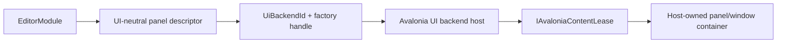

# Avalonia/XAML Editor 扩展规范

状态：Target（authoring 已批准；动态加载尚未实现）

更新日期：2026-07-11

## 1. 目的

本文定义 `Asharia.Editor.Avalonia` 的公共 authoring 与 Studio Avalonia backend 边界。目标是在允许 Graph、Timeline、Asset Browser、Profiler、复杂 Inspector 等 compiled XAML/custom control 的同时，保持 Window、Dock、生命周期、主题、Engine 和 native rendering ownership 归 Host。

Code-first 与 Avalonia/XAML 是同一 `EditorModule` 的两种 UI backend，不是内部/第三方两套 SDK。

## 2. 分层



`Asharia.Studio.Application` 只保存：

```text
PanelContributionDescriptor
UiBackendId
GenerationScopedFactoryHandle
Owner Module/Generation
```

`UiBackendId` 与 opaque `GenerationScopedFactoryHandle` 定义在 UI-neutral `Asharia.Editor`，所以 Application 可以编译引用。`Asharia.Editor.Avalonia` 只定义 typed registration extension、Control-facing factory 和 `IAvaloniaContentLease`；Presentation backend 用 handle 解析 generation registry 中的实际 Type/delegate。

实际 `Type`、factory delegate、Control、DataTemplate 和 Avalonia resource reference 只存在于 `Asharia.Editor.Avalonia`/Presentation backend 的 generation scope。Application 不使用 `object`/reflection 绕过 UI-neutral dependency。

## 3. Authoring contract

```csharp
editor.Panels.AddAvalonia<TerrainGraphView, TerrainGraphViewModel>(
    id: "com.example.terrain.graph",
    title: "Terrain Graph");
```

Backend factory 不返回裸 `Control`，而返回 lifecycle lease：

```csharp
public interface IAvaloniaContentLease : IAsyncDisposable
{
    Control Content { get; }

    ValueTask AttachAsync(
        AvaloniaContentHostContext context,
        CancellationToken cancellationToken);

    ValueTask ActivateAsync(CancellationToken cancellationToken);

    ValueTask DeactivateAsync(
        AvaloniaContentDeactivateReason reason,
        CancellationToken cancellationToken);

    ValueTask DetachAsync(
        AvaloniaContentDetachReason reason,
        CancellationToken cancellationToken);
}
```

Lease 同时拥有 Content 和 teardown。Host 拥有 panel container、Dock/Window binding 和 lease 调用顺序。

生命周期是：

```text
Created -> Attached -> Activated
Activated -> Deactivated
Deactivated -> Activated | Detached
Detached -> Attached | Disposed
Created | Attached | Deactivated -> Disposed
```

`Attach/Detach` 是可逆 host-binding transition，`DisposeAsync()` 是 terminal transition。Host 在 UI dispatcher 串行调用；每次成功 Attach 必须恰好对应一次 Detach，每次成功 Activate 必须恰好对应一次 Deactivate。取消或重复 close 不能造成 double subscription/double dispose。

ViewModel 只依赖 `Asharia.Editor` service；View 可以依赖 `Asharia.Editor.Avalonia` 和 Host-pinned Avalonia compatibility band。Engine mutation 仍经 command/transaction。

## 4. 允许能力

Avalonia extension content 可以使用：

- `UserControl`、Control composition 和 compiled XAML；
- binding、DataTemplate、ItemsControl/virtualized control；
- extension-local Styles、ResourceDictionary、ControlTheme；
- DrawingContext/custom rendering control；
- pointer、keyboard、focus、drag/drop 等 content-level input；
- extension assembly 中的 image/font/resource；
- Host 提供的 semantic theme/resource token；
- extension-local popup/tooltip，但必须登记到 content lease 并在 detach 时关闭。

允许 authoring 不代表允许 managed hot reload；reload tier 见第 9 节。

## 5. Host ownership

扩展只提供内容，Host 拥有：

- Studio top-level `Window` 和 floating host；
- Dock tree、tab identity、layout persistence 和 drop target；
- content container、error/loading placeholder；
- focus scope、global command routing 和 shortcut arbitration；
- theme baseline、DPI 和 accessibility policy；
- Viewport composition surface、native control host 和 GPU import；
- panel attach/activate/deactivate/detach/dispose；
- module generation 和 ALC。

需要独立 Window 的扩展贡献 `EditorWindowDescriptor + content factory`，由 Window host 创建真实 Window。扩展不能返回已经创建的 Window。

## 6. 明确禁止/unsupported

进程内 trusted code 技术上仍可调用 Avalonia/BCL API，以下是 contract + analyzer + runtime diagnostics 约束，不是 security sandbox：

- `new Window`、`TopLevel` ownership 或 `Application` lifetime 修改；
- 访问/修改 Dock implementation 或 visual tree outside content root；
- `Application.Current.Styles/Resources` 全局注入；
- 全局 DataTemplate、theme replacement 或无作用域 selector；
- `NativeControlHost`、platform handle、composition/GPU interop；
- native window/surface/swapchain/image/semaphore pointer；
- static event/service locator 保存 Host 或 View；
- 自己创建未登记 timer、dispatcher callback、thread 或 popup；
- 绕过 Editor command/transaction 写 scene/asset/project state。

`Asharia.Editor.Analyzers` 对可静态检测的禁止项报 error/warning；Host 在 factory output、attach/detach 和 shutdown 时做 runtime diagnostics。由于代码在同进程，这些机制不能阻止恶意插件。

## 7. 资源与样式

资源按 assembly URI 引用：

```xml
<Image Source="avares://Terrain.Editor/Assets/Brush.png" />
```

规则：

- assembly logical identity 必须由 loader 映射到当前 Package generation；
- extension asset/style 不加入全局 Application dictionary；
- style 放在 content root、专属 wrapper 或 extension ControlTheme 下；
- selector 必须以 extension root class/control type 限定，禁止无作用域 `Button`/`TextBox` override；
- 主题颜色、spacing、typography、focus/error 状态优先使用 Studio semantic token；
- asset URI、resource key 和 style diagnostics 包含 Package/Assembly/Generation。

Avalonia 官方支持 compiled XAML、library asset 和 `avares://AssemblyName/...`，但标准 loader 的 simple-name lookup/cache 不足以自动解决 old/new 同名 generation。Steady-state 下，所有可被 global resource lookup 访问的 assembly simple name 必须按大小写不敏感比较进程内唯一。Host 在开放 Avalonia managed reload 前必须为 candidate 生成 generation-unique physical assembly name，并提供 logical resource identity 到 exact generation 的路由/cache invalidation，而不是依赖默认“第一个同名 assembly”。

## 8. Attach、Detach 与 terminal teardown

Attach：

1. backend 解析 generation-scoped factory handle；
2. 首次打开时在 Avalonia dispatcher 创建 ViewModel/content lease；
3. Host 设置 content container，并调用 `AttachAsync(context)` 建立本次 logical host binding；
4. attach 完成后才允许 `ActivateAsync()`、input 和 frame callback；
5. factory/attach failure 显示 Host error placeholder，不破坏其他 panel。

`KeepAlive` close 使用可逆路径：

1. 调用 `DeactivateAsync()`，停止 Active-lifetime input/frame callback、timer 和 task；
2. 关闭属于当前 attachment 的 popup、flyout、tooltip 和 context menu；
3. 调用 `DetachAsync()`，释放 focus/pointer capture、visual-host subscription 和 attachment-lifetime callback；
4. 从 visual/logical tree 移除 content，并清空 Host container 的 `Content`/`DataContext`/Items/Templates；
5. 保留 content lease、ViewModel 和明确的 Lease-lifetime state，以便再次 `AttachAsync()`/`ActivateAsync()`。

Lease 必须区分三类 owner scope：Active-lifetime 在 Deactivate 停止；Attachment-lifetime 在 Detach 释放；Lease-lifetime 可以跨 KeepAlive close 保留，但必须在 terminal Dispose 释放。Detach 不能把后台 UI/input work 留在运行状态，也不能销毁用户期望 KeepAlive 的 persistent state。

释放分成三个层级，不能混用。

Content-instance terminal Dispose（`RecreateOnOpen` close，或上层 retire 的第一阶段）：

1. 如仍 Active，先 Deactivate；如仍 Attached，再 Detach；
2. 调用 `DisposeAsync()`，取消/等待该 content lease 的 task、timer、dispatcher callback、binding/event subscription；
3. 清空该 extension content 的 DataContext、Items、Templates 和其他已知 retained root；
4. 释放 content-instance generation lease。不得撤销 Package generation factory、backend table 或 resource descriptor，其他 panel/Project 可能仍在使用。

Scope partition retire（module reload、Project/Application scope close）：

1. terminal Dispose 该 `ScopeInstanceId` 的全部 content instance；
2. 所有 content lease 归零后，移除该 scope 的 contribution/factory binding 和 registry partition；
3. 排空该 scope 的 dispatcher work，释放 scope generation lease；
4. 不触碰其他 ProjectSession 的 partition，也不提前清理 Package-level resource registration。

Package generation retire：

- Collectible Tier-1：只有全部 scope/content/dependency lease 归零后，才撤销 generation factory/backend table；全部 resource consumer detach 后，按 physical assembly identity 使 Avalonia `AssetLoader` assembly descriptor/resource cache entry 失效，再执行 ALC unload probe；
- Tier-0 Pinned：保留 exact generation 的 Package-level factory metadata 和 resource registration，进入 `InactivePinned`；新 Project scope 重新建立 scope binding。它不调用 `Unload()` 或 weak-reference disappearance probe；
- BuiltIn Static：保留 default-ALC registration 到进程退出。

以上 transition 都必须在 UI dispatcher 上。GC/finalizer 不是 teardown 路径。

Extension lifecycle callback 抛错、取消或超时不能中断 Host cleanup。Host 使用 `try/finally` 独立完成当前层级拥有的动作：关闭已登记 popup，移除 visual/logical root，清空 container root，并释放 content/scope handle；不得越级撤销共享 generation resource。所有 callback/cleanup error 聚合到 diagnostics。Collectible Tier-1 generation retire 仍执行 ALC leak probe；Pinned/Static 不 probe，若 scope cleanup 未能证明安全则标记 `FaultedPinned`，该 generation 在重启前不得重用。In-process Host 不能强制终止失控的 extension task，因此 timeout 必须保留 pending root/Task 诊断并要求重启。

可逆 KeepAlive 的 Deactivate/Detach 任一步失败时，该 lease 立即 Faulted，不得再次 Attach。Host 转入上述 terminal best-effort cleanup；下一次打开只能新建 lease，不能复用 half-attached instance。

Resource cache invalidation 只发生在 Collectible Tier-1 generation retire，用于释放旧 generation root，不参与选择“哪个 generation 获胜”。无法精确移除旧 physical assembly descriptor/cache 时，该 generation 必须 quarantined 到进程退出，不得报告成功 unload或创建下一代 ALC。Tier-0 为复用 exact pinned generation而有意保留 Package-level descriptor/cache。

## 9. Reload tiers

### Tier 0：restart-required（默认）

所有 Avalonia/XAML module 默认属于 Tier 0。源码可以后台编译并产生 candidate diagnostics，但新 assembly 在 Studio restart 或明确的完整重启路径后激活。

Tier-0 dynamic Package 首次加载即使用隔离、non-collectible `PinnedPackageGenerationHost`。Project close 仍 terminal dispose 全部 Control/ViewModel/scope，但保留 exact assembly generation 到进程退出；同一 lock 再次打开时复用该 host。源码、lock 或 artifact 变化只能构建并提示 restart，不能再创建第二个 Tier-0 ALC。

以下能力在当前 Avalonia 12 compatibility band 强制 Tier 0：

- 自定义 `AvaloniaProperty`/`DirectProperty`；
- 自定义 `RoutedEvent`；
- custom/templated control type；
- global/static style、resource、event 或 service；
- `NativeControlHost`、TopLevel、platform/composition integration；
- external custom MSBuild/native dependency。

原因是 Avalonia 存在进程级 type/property/routed-event/resource registry/cache。当前公开清理能力不足以证明旧 owner Type 和 assembly 一定解除引用。

### Tier 1：experimental managed content reload（未来）

只有显式 compatibility capability 开启后，且 extension 同时满足以下条件才可试验：

- 只组合 Host/Avalonia 已加载控件，不定义自有 AvaloniaProperty/RoutedEvent/custom Control；
- resource resolution 精确绑定 candidate generation；
- old/new 使用 generation-unique physical assembly name，logical resource URI 由 backend exact routing；
- 无全局 style/template/static subscription；
- content lease 完整 teardown 并通过 UI dispatcher drain；
- backend registry cleanup 和 ALC weak-reference negative test 通过；
- 重复 reload canary 无 Type/Control/thread/handle 增长。

Tier 1 不是默认承诺，也不能由 extension 单方面在 `.asmdef` 声明开启；Host compatibility table 决定是否支持。

### Code-first

Code-first extension 不加载 extension-owned Avalonia type/resource，因而可以进入普通 managed reload eligibility；它仍需满足 module activation scope、quiesce/resume 和 ALC leak contract。

## 10. Viewport 与自绘控件

Avalonia custom drawing 只用于 UI graph、curve、timeline、preview chrome 等 Editor presentation。Scene/Game View 的 actual game frame 仍来自 C++ renderer：

```text
C++ renderer frame
  -> EngineInterop frame lease
  -> Presentation-owned import/composition surface
  -> Host Viewport panel container
  -> extension overlays/tools through public contract
```

Extension 不创建或导入 native GPU resource。Viewport tool/overlay 使用 `Asharia.Editor.Viewports` contract。

## 11. Compatibility

- `Asharia.Editor.Avalonia` 与 Studio Avalonia major/minor band 一起发布；
- extension build 不复制 `Avalonia.*`，运行时共享 Host full assembly identity；
- `AssemblyVersion` 在支持的 Editor API major 内保持策略稳定，package/file/informational version 单独记录；
- compiled XAML、resource URI、module index 和 UI backend capability 都进入 artifact fingerprint；
- Host 在执行 factory 前验证 API/backend/RID compatibility；
- 不兼容 content contribution 被禁用并显示 owner/version diagnostic。

## 12. 验证

- Code-first 与 Avalonia content 共享 panel lifecycle/command/state；
- extension content 无法通过公共 API 取得 Window/Dock/native surface；
- factory/attach/detach/dispose failure isolation；
- callback 抛错/timeout 不短路 Host `finally` cleanup；KeepAlive transition failure 强制 fault + terminal recreate；
- Attach/Activate/Deactivate/Detach 每个成功 transition 恰好配对，重复 close/dispose 幂等；
- KeepAlive Detach 后使用同一 lease/ViewModel 重新 Attach/Activate，Active/Attachment work 已暂停且 persistent state 保留；
- RecreateOnOpen 与 reload/Project close 执行 terminal Dispose，不保留旧 generation Control；
- 关闭单个 RecreateOnOpen panel 只释放 content instance；关闭一个 Project 只 retire 其 scope，不撤销其他 scope/generation factory/resource；
- Tier-0 close/reopen 复用一个 pinned host，generation 变化要求 restart，不重复创建 ALC；
- extension-local style 不影响其他 panel/Shell；
- `avares` resource 从正确 Package generation 解析；
- popup/tooltip/timer/dispatcher callback 在 detach 后消失；
- Host container 的 Content/DataContext/Template 不保留旧 type；
- custom AvaloniaProperty/RoutedEvent fixture 被标记 restart-required；
- experimental Tier 1 重复 reload canary 和 ALC negative leak；
- Windows、Linux、macOS 真实 desktop focus/input/theme/DPI smoke。

## 13. 参考资料

- [Avalonia XAML compilation](https://docs.avaloniaui.net/docs/xaml/compilation)
- [Avalonia assets and avares](https://docs.avaloniaui.net/docs/fundamentals/including-assets)
- [Avalonia styles](https://docs.avaloniaui.net/docs/styling/styles)
- [Avalonia control themes](https://docs.avaloniaui.net/docs/styling/control-themes)
- [Avalonia RoutedEventRegistry source](https://github.com/AvaloniaUI/Avalonia/blob/12.0.4/src/Avalonia.Base/Interactivity/RoutedEventRegistry.cs)
- [AvaloniaPropertyRegistry source](https://github.com/AvaloniaUI/Avalonia/blob/12.0.4/src/Avalonia.Base/AvaloniaPropertyRegistry.cs)
- [Avalonia StandardAssetLoader source](https://github.com/AvaloniaUI/Avalonia/blob/12.0.4/src/Avalonia.Base/Platform/StandardAssetLoader.cs)
