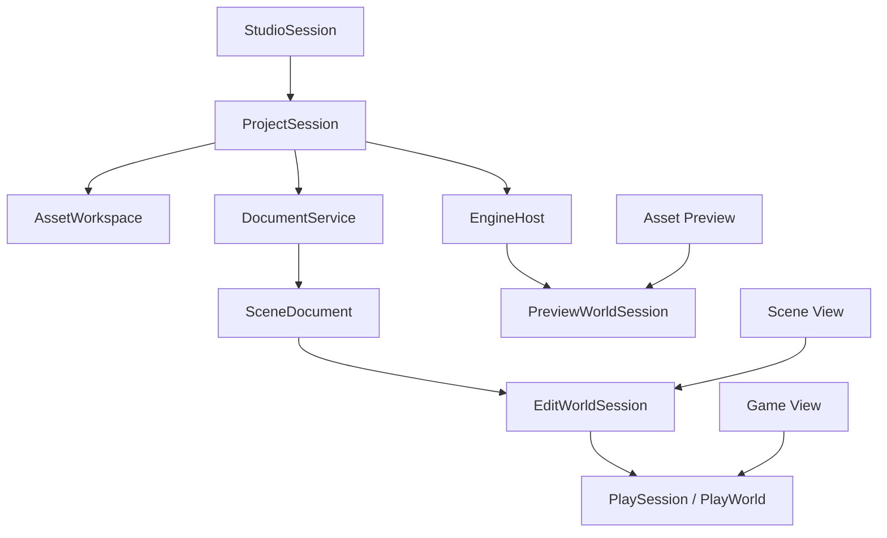
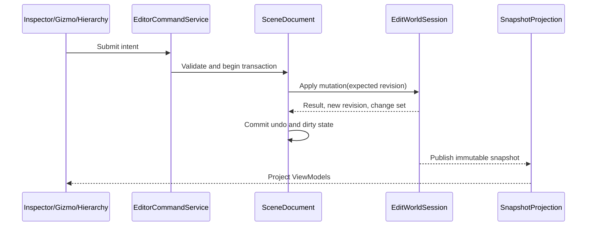
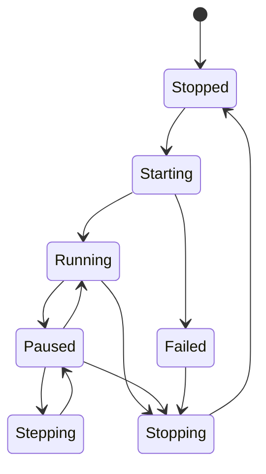

# 编辑世界与 Play Mode

状态：Target（迁移中）

更新日期：2026-07-11

## 1. 目的

本文定义游戏引擎编辑器中的 Project、SceneDocument、Edit World、Play World、Preview World、事务、selection remap 和 Play presentation。

## 2. 当前实现事实

当前 Studio 只有 fixture-backed scene snapshot、Hierarchy/Inspector 只读投影和 Scene View composition spike。尚无正式 project/document/world session、写入 bridge、Play state machine 或 Game View。

因此本文描述 Target 合同。任何实现不得把 fixture provider 或 ViewModel 状态升级为 engine truth。

## 3. Domain 关系



## 4. ProjectSession

`ProjectSession` 拥有：

- project identity 和配置；
- `EngineHost` connection；
- `AssetWorkspace`；
- open documents；
- project-scoped providers 和 diagnostics；
- Play/Preview session registry。

关闭 Project 必须先停止 Play/Preview、关闭 documents/world sessions，再停止 EngineHost。Window 不拥有 Project。

## 5. SceneDocument 与 EditWorldSession

`SceneDocument` 是编辑器文档，拥有：

- stable document/scene ID；
- 当前 authoritative revision；
- dirty state；
- validation/save state；
- undo/redo history；
- 对 `EditWorldSession` 的逻辑引用。

`EditWorldSession` 是 native engine 中的可编辑 world。SceneDocument 不暴露其 native pointer。

### 写入流程



合同要求：

- entity/component/property/asset/document 使用 stable ID；
- mutation 必须携带 expected revision；
- engine mutation 成功后才提交 undo entry 和 dirty state；
- Undo/Redo 经过同一 engine command boundary；
- mutation 失败保持 transaction stack 和 document state 不变；
- snapshot、index 和 revision 原子发布；
- 旧 revision 不得覆盖新 revision。

## 6. PlaySession

进入 Play 不直接推进 Edit World simulation。Play World 来自一个确定的 Edit revision。

```text
SceneDocument revision N
  -> validate and freeze input
  -> create PlaySession
  -> clone/load PlayWorld from revision N
  -> start simulation
  -> pause/step/resume as requested
  -> stop and destroy PlayWorld
  -> return to unchanged EditWorld
```

状态：



Simulation tick 由 native engine 拥有。Studio 的 UI timer 不推进 gameplay、physics 或 script update。

## 7. Apply Play Changes

默认退出 Play 不修改 Edit World，也不设置 document dirty。

未来 “Apply/Keep Simulation Changes” 必须：

1. 选择允许回写的 entity/component/property 范围；
2. 计算 Play revision 与起始 Edit revision 的 change set；
3. 对当前 Edit revision 做冲突检查；
4. 生成显式 editor transaction；
5. 通过 EditWorld mutation 应用；
6. 记录 undo 和 dirty state。

禁止复制 Play World 内存覆盖 Edit World。

## 8. PreviewWorldSession

模型、材质、动画、粒子和灯光预览使用隔离 Preview World。它拥有独立相机、灯光、环境和临时 runtime resource 引用，不污染 Edit/Play World。

Preview World 可以按 asset/document 复用，但必须有容量上限、空闲回收和 project-close cleanup。

## 9. Selection 与 World remap

Editor selection 必须包含 world/document scope：

```text
EditorSelection
  WorldSessionId
  EntityId
  ComponentId?
  PropertyId?
```

规则：

- Scene View selection 默认属于 Edit World；
- Game View debug selection 属于 Play World；
- Play start 可以通过 stable source ID 建立 Edit→Play remap；
- Play stop 后不能留下指向已销毁 Play entity 的 active selection；
- Inspector 必须明确显示正在查看 Edit、Play 还是 Preview 对象；
- 对 Play object 的编辑默认是 debug-only，不进入 Edit transaction。

## 10. Play presentation 模式

`PlaySession` 与显示位置解耦：

```text
PlayPresentationMode
  EmbeddedGameView
  EditorWindowGameView
  StandaloneProcess
```

### EmbeddedGameView

默认快速迭代模式。Play World 由 native renderer 渲染到 offscreen image，再导入 Studio 内部 Dock Game View。

### EditorWindowGameView

Studio-owned Avalonia secondary Window，使用同一 shared-image presentation contract。适合双屏、固定尺寸和保持调试 UI。

### StandaloneProcess

独立 game process 创建 native OS window、`VkSurfaceKHR`、swapchain 和完整 platform input。它是 fullscreen、HDR、VR、present mode、raw input、多客户端和 release-like 性能的验证路径。

Embedded/EditorWindow 的性能数字不能代表 standalone game。

## 11. Viewport world target

| Viewport role | 默认 world | Overlay/Input |
| --- | --- | --- |
| Scene | Edit World | editor camera、grid、gizmo、selection |
| Game | Play World | game camera、game input |
| AssetPreview | Preview World | preview controls |
| Debug | 显式 renderer resource/pass | debug navigation |

Simulate mode可以显式让 Scene View 观察 Play World，但必须改变 world scope 和 selection 语义，不能静默切换。

## 12. Asset 边界

`AssetWorkspace` 拥有 source asset、metadata、import settings、dependency 和 cooked artifact。SceneDocument 只引用 stable Asset ID。

Avalonia View 不读取 source file、不执行 import、不创建 GPU resource。Engine resource system 加载 runtime/cooked resource，并通过状态 snapshot 向 Studio 投影。

## 13. 验证

需要验证：

- Play start 从确定 revision 创建独立 world；
- Stop 不修改 Edit World/dirty state；
- Pause/Step 不依赖 UI frame rate；
- selection remap 和 stale Play selection cleanup；
- mutation revision conflict 与 undo failure atomicity；
- embedded、secondary window 和 standalone presentation 生命周期；
- Edit Scene View 与 Play Game View 同时显示；
- Project close 时 Play/Preview/Edit 逆序释放。

外部设计依据：

- Unreal In-Editor Testing：<https://dev.epicgames.com/documentation/en-us/unreal-engine/ineditor-testing-play-and-simulate-in-unreal-engine>
- Unreal multi-world PIE：<https://dev.epicgames.com/documentation/unreal-engine/play-in-editor-multiplayer-options-in-unreal-engine>
