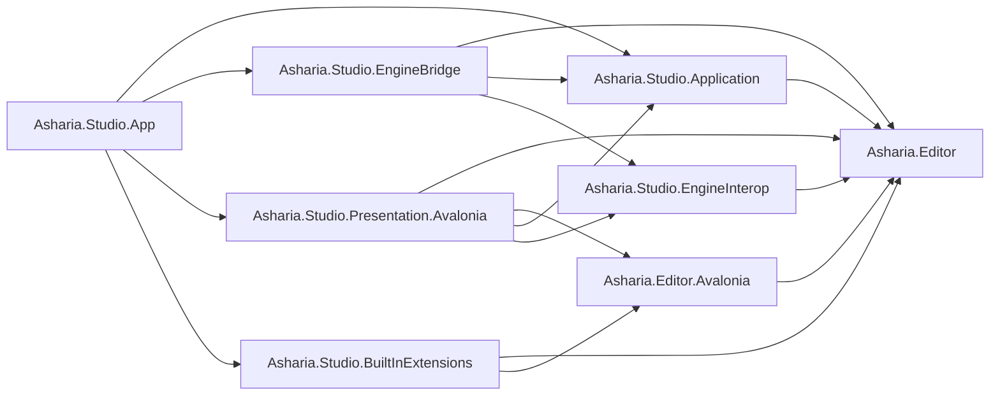

# Studio 代码框架设计

状态：Target（迁移中）

更新日期：2026-07-12

## 1. 目的

本文把 Studio 架构落到 solution、project、目录、命名空间、依赖、composition、测试和迁移位置。目标是同时服务两类开发者：

- Studio/Engine 开发者：实现 Shell、Dock、Engine Bridge、Viewport 和 Extension Host；
- 游戏项目/Package 开发者：只依赖公共 Editor Framework 编写编辑器扩展。

公共 API 与宿主实现必须分离，但内置、项目和第三方扩展不能因此形成不同能力模型。`Asharia.Studio.BuiltInExtensions` 通过只引用公共 API 来 dogfood 同一框架。

## 2. 当前事实

legacy production executable、Avalonia/Shell/Dock host implementation、built-in Feature 和对应回归测试仍由 `Editor.sln` 承载：

```text
Editor.csproj
Tests/Editor.Tests/Editor.Tests.csproj
```

legacy `Editor.csproj` 仍包含 Avalonia、Shell、Dock、Feature、尚未提升的 UI-neutral model/service、P/Invoke/native adapter 和 Windows DLL copy target；它不再拥有 Code-first production source。当前 legacy 主要命名空间为 `Editor.Core.*`、`Editor.Shell.*`、`Editor.UI.*` 和 `Editor.Features.*`。

迁移脚手架已经建立 `Asharia.Studio.sln`。UI-neutral `src/Asharia.Editor/Asharia.Editor.csproj` 已提供第一批 public module identity、scope/policy、definition metadata、activation/quiesce/resume、capability Epoch snapshot，以及 code-first required/optional module/capability 与 provided capability 声明合同。`EditorModuleBuilder.Build()` 把声明顺序冻结为防御性只读快照；重复、自依赖、required/optional 冲突和 Application→Project module edge 在声明期 fail-fast，跨 Package/provider graph 仍由未来 Host 验证。

完整的 Code-first authoring、tree、state、events 和 validation 现已编译进 dependency-free `Asharia.Editor`；其所需的 Diagnostics、Commands 和 Panels UI-neutral 前置合同也已成为公共 API。`Asharia.Editor` 还提供 declaration-only Panel contribution contract：稳定的 contribution/backend/factory-local ID、不可变 `EditorPanelDescriptor`、`EditorModuleBuilder.Panels`、module-local duplicate validation，以及随 `Build()` 一起冻结的有序只读快照。Panel scope 只来自 `EditorModuleDefinitionContext.DefinitionId.Scope`，descriptor 不重复保存 scope。

Panel declaration 的 `ContentFactory` 是 `EditorFactoryLocalId`，不是 CLR factory 或 generation handle。未来 Host 必须在 staging 时把 Package generation、owner module definition 与 local ID 绑定为 generation-scoped runtime handle；当前仍没有 Panel registry、factory binding、Dock integration、Host resolver 或 runtime display。legacy `PanelDescriptor(Func<object>)` 只留在 `Editor` compatibility implementation，不是公共 ABI。

legacy `Editor` 通过 `ProjectReference` 消费这些公共合同，并继续拥有 Avalonia adapter、Dock、Shell host 和 UI dispatcher implementation。纯 Code-first 行为测试由 `Tests/Asharia.Editor.Tests` 承载，架构门禁由 `Tests/Asharia.Studio.Architecture.Tests` 承载；迁移期继续沿用现有大写 `Tests/`。其他 contribution descriptors、registry、静态 Host/resolver、Package generation 和 activation topology 仍未实现，留给后续切片。

`Asharia.Editor.Dialogs` 现拥有七个 UI-neutral public type：severity、action role、稳定 action ID、action descriptor、request、completion kind 和 result。Action ID、role、default、destructive 与 completion 是相互独立的语义；request 构造会验证全部结构 invariant，并冻结输入 action 的防御性只读快照。公开的 action 声明顺序是确定的 diagnostics/test 顺序，不承诺 Windows、Linux 或 macOS 上的屏幕排列。

现有 compatibility Dialog Host 已改为消费该公共合同；Presentation 仍拥有 overlay、focus、action projection 和 single-active-modal policy，第二个 active request 会被拒绝。用户触发的 system dismiss 结果仍与未来 operation cancellation 分离。`Editor.Core.Models.Dialogs` 已删除，且没有 wrapper、type forwarding 或重复 model。当前仍没有 dialog service、owner-window routing、custom content、platform ordering、localization、file picker、progress、notification 或 modal queue。

`Asharia.Editor` 已形成可供项目 `Editor/` 和 Package 扩展编译引用的稳定 assembly；legacy `Editor` 到公共 API 的依赖方向由 `ProjectReference` 和架构测试执行。剩余迁移仍需让 built-in Feature 停止使用内部 host API，并继续把后续目标 project 边界交给编译器执行。

## 3. 术语

| 术语 | 含义 |
| --- | --- |
| Editor Framework | `Asharia.Editor`、可选 UI bridge 及其 host implementation 的整体 |
| Public Editor API | 扩展可以编译引用的 `Asharia.Editor*` assembly |
| Studio Host | session、extension、Dock、Window、build/load、Engine Bridge 和 presentation 实现 |
| Built-in Extension | 随 Studio 发布、但只使用公共 Editor API 的 Feature module |
| Host Infrastructure | Shell、Dock、platform、EngineHost 等不能由普通扩展替换的基础设施 |
| Extension Source | BuiltIn、Project、Package、Installed；不是能力等级 |

## 4. 目标 Solution

```text
apps/studio/
  Asharia.Studio.sln

  src/
    Asharia.Editor/
      Asharia.Editor.csproj

    Asharia.Editor.Avalonia/
      Asharia.Editor.Avalonia.csproj

    Asharia.Editor.Analyzers/
      Asharia.Editor.Analyzers.csproj

    Asharia.Studio.Application/
      Asharia.Studio.Application.csproj

    Asharia.Studio.EngineInterop/
      Asharia.Studio.EngineInterop.csproj

    Asharia.Studio.EngineBridge/
      Asharia.Studio.EngineBridge.csproj

    Asharia.Studio.Presentation.Avalonia/
      Asharia.Studio.Presentation.Avalonia.csproj

    Asharia.Studio.BuiltInExtensions/
      Asharia.Studio.BuiltInExtensions.csproj

    Asharia.Studio.App/
      Asharia.Studio.App.csproj
      App.axaml
      App.axaml.cs
      Program.cs

  tests/
    Asharia.Editor.Tests/
    Asharia.Editor.Analyzers.Tests/
    Asharia.Studio.Application.Tests/
    Asharia.Studio.EngineInterop.Tests/
    Asharia.Studio.EngineBridge.Tests/
    Asharia.Studio.Presentation.Avalonia.Tests/
    Asharia.Studio.ExtensionIntegration.Tests/
    Asharia.Studio.Architecture.Tests/
```

八个 runtime production project 是稳定技术边界；`Asharia.Editor.Analyzers` 是额外的 build-time analyzer/source-generator project，不进入 Studio/extension runtime closure。Built-in Feature 初期共同位于 `Asharia.Studio.BuiltInExtensions`，只有当独立发布、编译或 reload unit 确有价值时再拆分。

## 5. Project 依赖



`App --> BuiltIn` 是有意的 runtime ProjectReference。Built-in assembly 随 executable 进入 default ALC，由 `StaticPackageGenerationHost` 接入同一 module/registry/scope lifecycle，但 reload/unload 是 no-op 并标记 `restart-required`。App 不得再把同一 built-in artifact 加载到 dynamic ALC。Project/Package/Installed dynamic artifact 按 policy 使用 `CollectiblePackageGenerationHost`（managed-reload eligible）或 `PinnedPackageGenerationHost`（Tier-0/native/external-build restart-required）。

允许矩阵：

| Project | 可引用 | 禁止引用 |
| --- | --- | --- |
| `Asharia.Editor` | BCL、批准的 immutable collection/annotation 基础包 | Avalonia、Studio Host、P/Invoke、filesystem implementation |
| `Asharia.Editor.Avalonia` | Editor、Host 指定 Avalonia compatibility band | Application、Dock、EngineBridge、App |
| `Asharia.Editor.Analyzers` | pinned Roslyn API、schema parser | Studio runtime implementation、Avalonia runtime、EngineBridge |
| `Studio.Application` | Editor | Avalonia、P/Invoke、Presentation、BuiltIn Feature |
| `Studio.EngineInterop` | Editor | Avalonia、P/Invoke implementation、Application policy |
| `Studio.EngineBridge` | Editor、Application、EngineInterop | Avalonia、Dock、Feature View |
| `Studio.Presentation.Avalonia` | Editor、Editor.Avalonia、Application、EngineInterop | EngineBridge implementation、Feature 业务、P/Invoke |
| `Studio.BuiltInExtensions` | Editor、Editor.Avalonia | Application、EngineBridge、Presentation implementation、App |
| `Studio.App` | composition 所需项目 | Feature 业务实现、renderer command recording |

`BuiltInExtensions` 的禁止引用是统一 API 的关键门禁。若内置 Inspector/Panel 需要新增能力，应将抽象加入 `Asharia.Editor`，实现加入 Application/Presentation，然后由 composition 提供。

生产项目之间禁止使用 `InternalsVisibleTo` 绕过引用方向。它只允许最小范围的 test assembly。

## 6. `Asharia.Editor`

这是所有 Editor extension 的稳定、UI-neutral 公共 assembly：

```text
Asharia.Editor/
  Assets/
  Commands/
  Contributions/
  Diagnostics/
  Documents/
  Editing/
  Extensions/
  Inspectors/
  Panels/
  PlayMode/
  Projects/
  Selection/
  Settings/
  Tasks/
  Transactions/
  UI/CodeFirst/
  Viewports/
  Worlds/
```

包括：

- stable IDs、immutable snapshot/request/result；
- `EditorModule`、`EditorModuleDefinitionId`/`EditorModuleInstanceId`、builder、context 和 contribution descriptor；
- required/optional module dependency、provided/required `EditorCapabilityId` 与 capability Epoch contract；
- UI-neutral `UiBackendId` 与 opaque `GenerationScopedFactoryHandle`；
- extension-facing service ports；
- Panel/command/provider/tool lifecycle contract；
- Code-first authoring API、UI-neutral node/state/event schema；
- transaction/property handle/selection/diagnostic contract。

不包括：

- registry、ExtensionHost、Dock、Window 或 build/load implementation；
- Avalonia type；
- P/Invoke、native library name、OS handle 或 Vulkan type；
- concrete filesystem/process/network service；
- Feature-specific ViewModel。

示例端口：

```csharp
public interface IEditorSelectionService
{
    EditorSelectionSnapshot Current { get; }
    IDisposable Subscribe(Action<EditorSelectionSnapshot> observer);
}

public interface IEditorCommandService
{
    ValueTask<EditorCommandResult> ExecuteAsync(
        EditorCommandId commandId,
        EditorCommandArguments arguments,
        CancellationToken cancellationToken);
}

public interface IEditorViewportService
{
    ViewportSnapshot GetSnapshot(ViewportId viewportId);
    ValueTask<ViewportHitTestResult> HitTestAsync(
        ViewportHitTestRequest request,
        CancellationToken cancellationToken);
}
```

接口表达 editor capability，不暴露 concrete EngineBridge、native handle 或 Dock implementation。

## 7. `Asharia.Editor.Avalonia`

这是同一 Editor API 的可选复杂 UI authoring bridge：

```text
Asharia.Editor.Avalonia/
  Contributions/
  Panels/
  Theming/
  Views/
```

包括：

- `AddAvalonia<TView,TViewModel>()` 等 builder extension；
- 把 Avalonia typed factory 注册为 `Asharia.Editor.GenerationScopedFactoryHandle` 的 builder extension；
- `IAvaloniaContentLease` 和 Control-facing factory contract；
- Studio semantic theme resource keys；
- extension content root 和 lifecycle adapter contract。

它允许 extension 通过 content lease 提供 panel content `Control` 和显式 teardown，但不把裸 Control 当作完整 lifetime，也不公开 Dock、Window host、composition surface 或 GPU presentation implementation。

`Asharia.Editor.Avalonia` 与 Studio 支持的 Avalonia compatibility band 绑定。Build 输出不得私带另一份 `Avalonia.*` 或 `Asharia.Editor.Avalonia`；加载器始终共享 Host 的 assembly identity。

### Build-time `Asharia.Editor.Analyzers`

该 project 作为 analyzer/source generator 分发，负责：

- 生成 `[EditorModule]` module index；
- 校验 module scope、stable contribution ID 和部分 `.asmdef`/AdditionalFiles contract；
- 对 Code-first 引用 Avalonia、扩展创建 Window/TopLevel、global style、direct Engine P/Invoke 等可静态检测的 unsupported pattern 报告；
- 生成 public API 使用诊断和 deprecated/preview API 提示。

Analyzer 不是安全边界，也不进入 extension runtime artifact。其版本进入 build fingerprint，并由 Studio SDK manifest 固定。

## 8. `Asharia.Studio.Application`

```text
Asharia.Studio.Application/
  Commands/
  Diagnostics/
  Documents/
  Extensions/
    Build/
    Catalog/
    Discovery/
    Hosting/
    Loading/
    Reload/
    Restart/
  Panels/
  PlayMode/
  Projects/
  Scheduling/
  Sessions/
  Transactions/
  Viewports/
  Worlds/
```

职责：

- `StudioSession`、`ProjectSession` 和 shutdown orchestration；
- extension discovery/build/load/reload use case；
- Collectible/Pinned/Static `PackageGenerationHost`、PendingRestart/BootAttempt coordinator；
- contribution validation、ProjectScope registry transaction、module scope/activation graph；
- document、command、transaction、selection、diagnostics；
- Engine/World/Viewport consumer-owned ports；
- task/provider/panel scheduling policy。

Application 不引用 Avalonia。Avalonia-specific contribution 通过 `UiBackendId + GenerationScopedFactoryHandle` 路由到 App 注册的 UI backend host；实际 Type/delegate/Control 只由 Presentation 的 generation registry 持有，Application 不实例化或检查 `Control`。

构造函数只建立对象关系；filesystem、process、native 或异步失败工作进入显式 factory/`StartAsync()`。

## 9. EngineInterop 与 EngineBridge

### EngineInterop

只放 Engine producer 与 Presentation consumer 共享的 narrow waist：

```text
Capabilities/
Frames/
Handles/
Synchronization/
```

包括 viewport frame lease、opaque external GPU descriptor、ownership/transfer、capability 和 completion result。它不导入 OS handle、不调用 P/Invoke、不引用 Avalonia。

### EngineBridge

```text
Abi/
Adapters/
Loading/
Platforms/Windows/
Platforms/Linux/
Platforms/MacOS/
```

职责：

- native library 定位与显式加载；
- ABI version/struct-size negotiation；
- C packet 与 Editor/Application contract 的复制转换；
- Engine/World/Viewport port implementation；
- native resource lease 和错误映射。

P/Invoke struct、pointer 和 platform handle 不越过 Bridge/Interop 边界。构造函数不加载 DLL、不创建设备。

## 10. Presentation 与 Built-in Extensions

### Presentation.Avalonia

```text
Commands/
Docking/
ExtensionUiBackends/
  CodeFirst/
  Avalonia/
Panels/
Services/
Shell/
Theme/
ViewportPresentation/
Windows/
```

职责：

- Avalonia Window、Dock、focus、input、clipboard、drag/drop；
- Code-first reconciler 和 control adapters；
- Avalonia extension content host；
- DataTemplate、semantic theme、accessibility；
- composition surface 与 external GPU frame import。

Code-behind 只处理 visual/platform bridge。业务 command、transaction、provider connection 和 native mutation不进入 code-behind。

### BuiltInExtensions

```text
Features/
  Console/
  FrameDebugger/
  GameView/
  Hierarchy/
  Inspector/
  Problems/
  SceneView/
  UiStyle/
```

每个 Feature 提供一个或多个 `[EditorModule]`，使用与项目 extension 完全相同的 builder 和 service。Module 显式声明 Application 或 Project scope；Scene、Hierarchy、Inspector、Game View 等 built-in module 是 Project scope，不因为来源为 BuiltIn 就变成全局 singleton。它不创建 `EngineHost`、不访问 registry implementation、不修改 Dock tree。

Distribution build 为该 assembly 生成 reserved PackageIdentity `com.asharia.studio.builtin-extensions`，version/content hash 来自 Studio distribution manifest；registry/diagnostics 中不能把 BuiltIn owner 记录为空或只记录磁盘路径。

Scene/Game View 的内容可以使用公共 Viewport panel contract；实际 native surface/importer 仍由 Presentation/EngineBridge 提供。

## 11. App 与 Composition

`Asharia.Studio.App` 是唯一 executable 和 composition root：

```text
App/
  Composition/
    StudioBootstrap.cs
    EditorUiBackendCatalog.cs
    PlatformBackendCatalog.cs
  App.axaml
  App.axaml.cs
  Program.cs
```

它负责：

- 选择 Windows/Linux/macOS backend；
- 构造 Application、EngineBridge 和 Presentation adapter；
- 注册 Code-first/Avalonia UI backend host；
- 把 default ALC 中唯一的 built-in assembly 作为 `ExtensionSourceKind.BuiltIn` 交给同一 extension host；
- 启动和异步关闭唯一 `StudioSession`。

初期使用显式 constructor composition。只有对象图、scope 和测试证明 DI container 有实际收益时再另立 ADR。

Built-in 与动态扩展使用完全相同的 `EditorModule`、scope、contribution 和 failure boundary；差异只在 deployment/load policy。Built-in 代码更新跟随 Studio rebuild/restart，不参与 collectible ALC/LKG hot replacement。

## 12. Editor 项目与 Package 代码布局

项目开发者看到的代码不进入 `apps/studio/src`：

```text
MyGame/
  Editor/
    MyGame.Editor.asmdef        # 可选
    MyGameEditorModule.cs
    Panels/
    Inspectors/
    ViewportTools/

  Packages/
    Terrain/
      asharia.package.json
      Runtime/
        Native/
      Editor/
        Terrain.Editor.asmdef
        TerrainEditorModule.cs
```

详细规则见 [Editor 扩展开发模型](editor-extension-authoring.md)。长期代码不能同时把 `.asmdef` 和生成 `.csproj` 当作 source of truth。

## 13. 命名空间与可见性

```text
Asharia.Editor.*
Asharia.Editor.Avalonia.*
Asharia.Studio.Application.*
Asharia.Studio.EngineInterop.*
Asharia.Studio.EngineBridge.*
Asharia.Studio.Presentation.Avalonia.*
Asharia.Studio.BuiltInExtensions.*
Asharia.Studio.App.*
```

规则：

- 类型默认 `internal`；真实 public extension contract 才进入 `Asharia.Editor*`；
- public contract 不出现 `StudioHost` concrete type；
- 不创建 `Common`、`Helpers`、`Managers` 或 `Utils` bucket；
- Feature 之间通过 Editor service/contribution/command/snapshot 通信；
- project extraction 与全仓 namespace rename 不在同一个 PR 完成。

## 14. Async、错误与所有权

- 可失败 IO/native/GPU/build 操作使用 `Task`/`ValueTask`、`CancellationToken` 和 typed result；
- 除 Avalonia event bridge 外禁止 `async void`；
- task 必须属于 Studio、Project、Module、Panel、Provider 或 Command scope；
- exception 在 module/panel/command/provider/task/application boundary 被观察并转为 diagnostics；
- snapshot 使用 immutable collection 或防御性复制，并携带 revision/generation；
- UI object 只在 Avalonia dispatcher 访问；
- constructor 不执行 build、DLL load、engine start、filesystem scan 或 subscription；
- shutdown 和 reload 按依赖逆序，不能依赖 static finalizer。

## 15. 测试项目

### Editor.Tests

- stable ID、descriptor、Code-first node/state/event；
- public API compatibility baseline；
- 无 Avalonia、native runtime 和 Studio host。

### Application.Tests

- session、transaction、selection、extension graph/generation；
- build/reload use case 使用 fake process/filesystem/clock；
- last-known-good、PendingRestart、rollback、dependency ordering；
- PackageGenerationHost policy、ProjectScope transaction、capability Epoch 和 NativeSafeBarrier。

### EngineInterop/EngineBridge.Tests

- handle ownership、lease exactly-once completion；
- ABI/version/size、buffer copy、status mapping、unavailable library；
- fake native entrypoint，无真实 Avalonia。

### Presentation.Avalonia.Tests

- headless binding、focus、Dock、Window、Code-first reconcile；
- Avalonia extension content/style/resource scope；
- fake frame lease 和 viewport presentation。

### ExtensionIntegration.Tests

使用临时 fixture project/package 验证：

- implicit `Editor/`、`.asmdef` 和 generated project；
- Code-first/Avalonia extension build/load；
- built-in/project/package 行为一致；
- built-in 只存在 default ALC 单一 identity，static generation dispose 后不尝试 unload；
- dependency conflict、reload、ALC leak、last-known-good；
- multi-Project scope isolation、definition reentrancy、Pinned reopen 和 PendingRestart relaunch；
- Windows/Linux/macOS path/RID matrix。

### Architecture.Tests

- project reference matrix；
- BuiltInExtensions 只引用 public Editor API；
- public API 不泄漏 Avalonia（Editor）或 host implementation；
- App 是唯一 executable/composition root；
- 禁止生成 project/source 文件进入 Git。

## 16. 当前目录迁移

| 当前路径 | 目标 |
| --- | --- |
| `Core/Models` 中稳定 extension-facing model | `Asharia.Editor` |
| `Core/Abstractions` 中 extension-facing service | `Asharia.Editor` |
| `Core/CodeFirstUI` | `Asharia.Editor/UI/CodeFirst` |
| `Core/Services` | 按 owner 拆到 Application；fixture 到 tests |
| `Core/Interop/*/Api` | EngineBridge/Abi |
| `Core/Interop/*/Adapters` | EngineBridge/Adapters |
| platform GPU descriptor/lease | EngineInterop |
| `Shell/Composition/EditorExtensionHost*` | Application/Extensions/Hosting |
| `Shell/CodeFirstUI` | Presentation/ExtensionUiBackends/CodeFirst |
| `Shell/Docking`、Window、focus | Presentation.Avalonia |
| `UI/Styles`、icons、base controls | Presentation.Avalonia/Theme 或公共 semantic key |
| `Features/*` | BuiltInExtensions/Features |
| `Features/Workbench` composition | 删除聚合职责；App 注册 built-in catalog |
| root `App.*`、`Program.cs` | Studio.App |
| `Tests/Editor.Tests` | 按目标 test project 渐进拆分 |

迁移时先抽 public contract 和 adapter，再移动 implementation。每一步保持 solution 可构建，禁止一次性目录搬迁后留待后续修复依赖。

## 17. 迁移期规则

在项目尚未拆分前：

- 新 extension-facing contract 可以暂放 UI-neutral `Core`，但必须标注目标 `Asharia.Editor`；
- 新 Code-first primitive 不引用 Avalonia；adapter 留在 Shell；
- 新复杂 Feature 可以使用 Avalonia/XAML，但不得自行创建 Window/Dock；
- 新 P/Invoke 只能进入现有 Interop 兼容区，不得被 View/ViewModel 调用；
- 不新增 `WorkbenchFeatureModule` 聚合依赖；新 Feature 应有独立 module；
- 不为过渡期创建 static singleton/service locator；
- 不提前把目标文档中的 `Asharia.Studio.sln` 命令描述成当前可执行事实。

## 18. 禁止模式

```text
BuiltInExtensions -> Studio.Application/Presentation implementation
Project Editor code -> Studio internal assembly
EditorModule -> new Window / mutate Dock tree
View or ViewModel -> P/Invoke / EngineBridge concrete type
Asharia.Editor -> Avalonia / filesystem implementation / native handle
Application -> Dispatcher.UIThread
EngineBridge -> Avalonia / Dock / Feature
Code-first panel -> Avalonia visual tree
Avalonia extension -> Application.Current.Styles global mutation
PanelDescriptor -> Func<object> as permanent public ABI
File watcher event count -> build truth
ALC unload -> claimed security boundary
UI timer -> gameplay simulation tick
```

## 19. 验证

当前文档变更从仓库根执行：

```powershell
powershell -ExecutionPolicy Bypass -File tools\check-text-encoding.ps1 -Root apps\studio\docs
git diff --check
```

迁移期间必须同时验证旧 executable solution 和目标 solution：

```powershell
dotnet test apps\studio\Editor.sln -c Release
dotnet test apps\studio\Asharia.Studio.sln -c Release
```

## 20. 相关文档

- [Studio 架构总览](studio-overview.md)
- [Editor 扩展开发模型](editor-extension-authoring.md)
- [Editor 扩展构建、装载与重载](editor-extension-build-and-reload.md)
- [Avalonia/XAML Editor 扩展规范](editor-extension-avalonia.md)
- [Studio 统一扩展模型](studio-extension-model.md)
- [Studio 生命周期](studio-lifecycle.md)
- [编辑世界与 Play Mode](editor-worlds-and-play-mode.md)
- [Viewport 渲染架构](viewport-rendering.md)
- [ADR-0004：统一 Editor Extension Framework](../adr/0004-unified-editor-extension-framework.md)
- [ADR-0005：managed Editor module 构建与重载](../adr/0005-managed-editor-module-build-and-reload.md)
