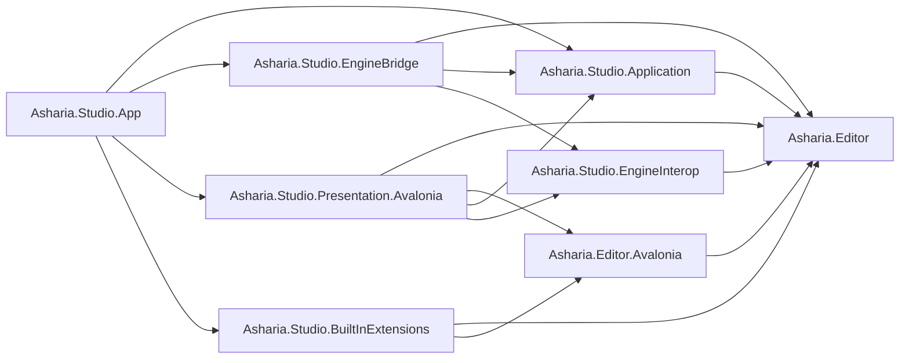

# Studio 代码框架设计

状态：Superseded by [ADR-0007](../adr/0007-studio-frontend-hard-cut.md)

更新日期：2026-07-31

> 本文记录旧八项目 Extension Framework 迁移设计。当前编译期边界、删除范围和 hard-cut 门禁见
> [Studio 前端硬切架构](studio-frontend-hard-cut.md)。

## 1. 目的

本文把 Studio 架构落到 solution、project、目录、命名空间、依赖、composition、测试和迁移位置。目标是同时服务两类开发者：

- Studio/Engine 开发者：实现 Shell、Dock、Engine Bridge、Viewport 和 Extension Host；
- 游戏项目/Package 开发者：只依赖公共 Editor Framework 编写编辑器扩展。

公共 API 与宿主实现必须分离，但内置、项目和第三方扩展不能因此形成不同能力模型。`Asharia.Studio.BuiltInExtensions` 通过只引用公共 API 来 dogfood 同一框架。

## 2. 当前事实

legacy production executable、Avalonia/最小Shell和其余断开Core/UI surface仍位于root
`Editor.csproj` 与 `Tests/Editor.Tests`；部分项目的旧 `Editor.sln` 已删除，唯一 solution 是 `Asharia.Studio.sln`：

```text
Editor.csproj
Tests/Editor.Tests/Editor.Tests.csproj
```

legacy `Editor.csproj` 仍包含Avalonia、最小Shell与尚未提升或待删的UI-neutral model/service；R0已删除native DLL copy target、
viewport/Frame Debugger managed P/Invoke岛，不再拥有Code-first、Workbench、Dock或built-in Feature source。当前legacy主要命名空间为`Editor.Core.*`与`Editor.Shell.*`。

canonical `Asharia.Studio.sln` 已精确列出 6 个 production 与 7 个 test projects；R0.5新增的
`Asharia.Studio.DevelopmentProtocol`是无runtime dependency的development-only合同项目，
`Asharia.Studio.DevelopmentHost`包含直接读取唯一Application diagnostic/log hub的无状态投影与typed in-process Host/session；
Debug `StudioCompositionSession`拥有并停止该Host，Editor只以Debug条件边引用它。该assembly另有尚未接App的Windows current-user
Named Pipe adapter与真实transport tests；两者及其独立tests不进入Editor Release image。App endpoint/discovery、CLI、MCP尚未实现。
`Asharia.Studio.Headless.Tests`只负责Avalonia 12/xUnit v3 dispatcher下的production Shell证据。R0已删除`src/Asharia.Editor`最后24个module identity/policy/builder/activation/capability/contribution/panel declaration source及9个self-test文件，因为它们没有Host/loader/registry/content consumer；随后空public project/test、App/Architecture/solution edge与distribution identity/deps/image合同也已删除，不再提供public SDK或空DLL。

R0 已从 dependency-free `Asharia.Editor` 删除完整 Code-first authoring/tree/state/events/validation 与
`UiBackendId.CodeFirst`；Shell host 和专属测试同时删除。legacy root移除后确认 command router/status projection也无
production consumer，因此公共 command/status contract随后整体删除。declaration-only Panel/Extensions/Contributions SCC
也已删除，不能据此恢复第二UI authoring或extension SDK。

Task 4曾迁移background task、diagnostic、editing、lifecycle、selection、transaction、scene/world、Viewport与Panel合同；
ADR-0007随后按production reachability逐族硬切。Frame Debug snapshot/provider public DTO及native payload/bridge因只有stub tests、
无render-lane consumer且发行物拒绝其DLL而整体删除，不属于当前公共扩展ABI。其余旧合同继续以hard-cut文档为唯一current truth。

`Asharia.Studio.EngineBridge` 已建立 managed Scene World、entity lifecycle、local Transform 与 entity display-name boundary：ABI v1 World create/destroy、entity create/destroy/is-alive、local Transform get/set 和 entity-name get/set 使用 source-generated native import，Bridge 关闭 runtime marshalling 并只传递显式 unmanaged value 或调用期 pinned UTF-8 bytes；成功后只发布不透明、不可外泄的 World owner、`Asharia.Runtime.EntityId`、`TransformValue` 与 managed `string`。全部调用必须回到创建线程，错误线程与 native failure 都不丢失 World ownership，成功销毁后 exactly-once 清空。local Transform 的 finite/unit-quaternion validation 由 native ABI 唯一拥有，managed Bridge 不复制容差算法或静默 normalize/clamp；名称使用 strict UTF-8、最多 4096 bytes、caller-owned query/copy buffer，且始终只是 mutable/non-unique display/debug text。该边界没有 finalizer-driven cleanup，因为 native World 明确要求 owner-thread destroy；当前仍没有 snapshot provider、Application/ProjectSession wiring 或 native library deployment policy。

旧Panel declaration的`EditorFactoryLocalId`从未绑定CLR factory、generation handle或Host resolver，且legacy compatibility implementation已删除。该无consumer declaration SCC现已整体删除；未来只有真实Panel owner/第二consumer成立后，才重新定义generation-scoped factory合同。

legacy root `Editor` 当前只通过 `ProjectReference` 消费`Asharia.Studio.Application` bounded diagnostics，并继续拥有Avalonia adapter、最小Shell和UI dispatcher implementation。Code-first与断开的Dock行为测试已随实现删除；架构门禁断言两个 Code-first source root、Dock source roots与全局 `ViewLocator` 均不存在。

R0确认 `Asharia.Studio.Application.Extensions` 的static generation Host、module registry、scope transaction与activation
只被3份专属tests实例化；ProjectCode与legacy compatibility adapter删除后没有production consumer，因此实现和tests
已整体删除。Panel runtime叶清理后，`Asharia.Studio.Application`及其test工程也已移除对旧`Asharia.Editor`的最后
ProjectReference；Application当前只拥有bounded diagnostics，不声明extension/panel/provider能力。

R0审计确认Selection的4个public types与Application内存service没有App/Shell/Document/Scene/panel producer或reader；两侧self-tests及distribution fixture的`typeof(IEditorSelectionService)`合成锚点不是产品consumer。完整岛、self-tests与synthetic type引用现已删除且未换绑其他public type。未来selection必须从真实Document/World/asset owner、typed scoped identity、revision/existence与close invalidation重新通过I0/I1。

R0确认Background Task的public ID/state/snapshot/service与Application状态实现没有App/MainWindow producer；该实现不持有真实`Task`、worker、CTS、cancel signal或shutdown join，只在无界dictionary里保留terminal snapshots。完整岛及两侧self-tests现已删除。未来首个真实background operation必须由owner持有work、cancel/join与bounded terminal evidence后重新通过I0/I1。

R0确认Lifecycle Event的public kind/snapshot/service与Application 100项recent-event实现没有App/MainWindow/Dock producer、reader或subscription；所谓Window hook已随legacy Presentation删除。该完整岛及两侧self-tests现已删除。唯一process lifecycle由`StudioProcessSession`直接执行并产出typed receipt；未来事件面必须有真实owner transition和对称subscription后重新通过I0/I1。

R0确认Editing/Transactions的7个public types与Application closure-based undo/redo实现没有Document、App或native mutation producer；string target/field和closure compensation不能表达authority/revision/uncertain commit，且异常可丢history。该完整岛及self-tests现已删除。未来首个写Slice必须从typed intent、expected revision、authoritative receipt/inverse、journal cursor和savepoint重新通过I0/I1。

Diagnostics/log 的 process identity、scope/context、record、cursor window 与 hub contract 由 `Asharia.Studio.Application.Diagnostics` 拥有；`App` 是唯一 production hub owner。diagnostic/log 分别写入预分配的 2,048/8,192 slot ring，publish 为 O(1) 且记录 cursor/drop/truncation；subscriber 有 64 个固定 slot，异常与 publisher 隔离。Avalonia 的自有 `ILogSink`、native failure mapping 与 managed command/status mapping 写入同一 hub，Console/Problems 只是只读投影。无record、hub或consumer的旧 `Asharia.Editor.Diagnostics.EditorDiagnosticSeverity` 已随 R0 SDK closure删除；public API absence gate禁止恢复第二套severity truth。

R0确认Viewport scheduling的12个public options/context/state/request/result types与Application纯planner没有App、UI/native backend或renderer frame-loop owner；4个test文件是全部consumer。该完整managed岛现已删除，且C++ editor/native smoke不作为Studio consumer。未来必须先建立真实ViewportSession、surface generation、frame lease/ack与bounded backpressure，再从I0/I1设计scheduler和monotonic timestamp合同。

R0确认Panel lifecycle/frame的9个public callback/context与Application scheduler没有Window/Dock/Control/panel instance producer；所谓Presentation `DispatcherTimer`调用链早已随legacy UI删除。完整runtime岛、专属tests和3个孤立public self-tests现已删除。未来真实panel由同一Window/Dock owner持有content、dispatcher与detach/dispose receipt；出现真实第二consumer前不重建通用scheduler。

R0 在删除 legacy composition root 后确认 command/status projection、Workbench action registry/router、shortcut、menu、command palette 与 public `Asharia.Editor.Commands` 都没有 production consumer，因此已连同专属测试整体删除。未来 action合同必须等真实 Document/selection use case，并由当前 hard-cut ADR重新设计；不得从本文恢复旧类型。

R0确认`Asharia.Editor.Dialogs`七个public types在Dialog presentation删除后没有任何production consumer；三个test文件只自证DTO invariant，架构测试反而强制精确库存。该namespace现已连同self-tests删除，且没有wrapper或type forwarding。未来Dialog必须由真实request producer、owner Window、typed completion和owner-close策略重新通过I0/I1；不得从本文恢复旧DTO或compatibility host。

`Asharia.Editor` assembly/project/test/solution/image identity已在R0删除；当前没有可供项目`Editor/`或Package扩展编译引用的public SDK，也没有built-in Feature host。未来真实第二consumer必须重新通过I0-I6并建立新ADR，不能从本文目标图恢复旧合同。

## 3. 术语

| 术语 | 含义 |
| --- | --- |
| Editor Framework | `Asharia.Editor`、可选 UI bridge 及其 host implementation 的整体 |
| Public Editor API | 扩展可以编译引用的 `Asharia.Editor*` assembly |
| Studio Host | session、extension、Dock、Window、build/load、Engine Bridge 和 presentation 实现 |
| Built-in Extension | 随 Studio 发布、但只使用公共 Editor API 的 Feature module |
| Host Infrastructure | Shell、Dock、platform、EngineHost 等不能由普通扩展替换的基础设施 |
| Extension Source | BuiltIn、Project、Package、Installed；不是能力等级 |

## 4. 目标 Solution

```text
apps/studio/
  Asharia.Studio.sln

  src/
    Asharia.Editor/
      Asharia.Editor.csproj

    Asharia.Editor.Avalonia/
      Asharia.Editor.Avalonia.csproj

    Asharia.Editor.Analyzers/
      Asharia.Editor.Analyzers.csproj

    Asharia.Studio.Application/
      Asharia.Studio.Application.csproj

    Asharia.Studio.EngineInterop/
      Asharia.Studio.EngineInterop.csproj

    Asharia.Studio.EngineBridge/
      Asharia.Studio.EngineBridge.csproj

    Asharia.Studio.Presentation.Avalonia/
      Asharia.Studio.Presentation.Avalonia.csproj

    Asharia.Studio.BuiltInExtensions/
      Asharia.Studio.BuiltInExtensions.csproj

    Asharia.Studio.App/
      Asharia.Studio.App.csproj
      App.axaml
      App.axaml.cs
      Program.cs

  tests/
    Asharia.Editor.Tests/
    Asharia.Editor.Analyzers.Tests/
    Asharia.Studio.Application.Tests/
    Asharia.Studio.EngineInterop.Tests/
    Asharia.Studio.EngineBridge.Tests/
    Asharia.Studio.Presentation.Avalonia.Tests/
    Asharia.Studio.ExtensionIntegration.Tests/
    Asharia.Studio.Architecture.Tests/
```

八个 runtime production project 是稳定技术边界；`Asharia.Editor.Analyzers` 是额外的 build-time analyzer/source-generator project，不进入 Studio/extension runtime closure。Built-in Feature 初期共同位于 `Asharia.Studio.BuiltInExtensions`，只有当独立发布、编译或 reload unit 确有价值时再拆分。

## 5. Project 依赖


```mermaid
flowchart LR
    Editor["Asharia.Editor"]
    EditorAvalonia["Asharia.Editor.Avalonia"]
    Application["Asharia.Studio.Application"]
    Interop["Asharia.Studio.EngineInterop"]
    Bridge["Asharia.Studio.EngineBridge"]
    Presentation["Asharia.Studio.Presentation.Avalonia"]
    BuiltIn["Asharia.Studio.BuiltInExtensions"]
    App["Asharia.Studio.App"]

    EditorAvalonia --> Editor
    Application --> Editor
    Interop --> Editor
    Bridge --> Editor
    Bridge --> Application
    Bridge --> Interop
    Presentation --> Editor
    Presentation --> EditorAvalonia
    Presentation --> Application
    Presentation --> Interop
    BuiltIn --> Editor
    BuiltIn --> EditorAvalonia
    App --> Application
    App --> Bridge
    App --> Presentation
    App --> BuiltIn
```

`App --> BuiltIn` 是有意的 runtime ProjectReference。Built-in assembly 随 executable 进入 default ALC，由 `StaticPackageGenerationHost` 接入同一 module/registry/scope lifecycle，但 reload/unload 是 no-op 并标记 `restart-required`。App 不得再把同一 built-in artifact 加载到 dynamic ALC。Project/Package/Installed dynamic artifact 按 policy 使用 `CollectiblePackageGenerationHost`（managed-reload eligible）或 `PinnedPackageGenerationHost`（Tier-0/native/external-build restart-required）。

允许矩阵：

| Project | 可引用 | 禁止引用 |
| --- | --- | --- |
| `Asharia.Editor` | BCL、批准的 immutable collection/annotation 基础包 | Avalonia、Studio Host、P/Invoke、filesystem implementation |
| `Asharia.Editor.Avalonia` | Editor、Host 指定 Avalonia compatibility band | Application、Dock、EngineBridge、App |
| `Asharia.Editor.Analyzers` | pinned Roslyn API、schema parser | Studio runtime implementation、Avalonia runtime、EngineBridge |
| `Studio.Application` | Editor | Avalonia、P/Invoke、Presentation、BuiltIn Feature |
| `Studio.EngineInterop` | Editor | Avalonia、P/Invoke implementation、Application policy |
| `Studio.EngineBridge` | Runtime.Contracts、Editor、Application、EngineInterop | Avalonia、Dock、Feature View |
| `Studio.Presentation.Avalonia` | Editor、Editor.Avalonia、Application、EngineInterop | EngineBridge implementation、Feature 业务、P/Invoke |
| `Studio.BuiltInExtensions` | Editor、Editor.Avalonia | Application、EngineBridge、Presentation implementation、App |
| `Studio.App` | composition 所需项目 | Feature 业务实现、renderer command recording |

`BuiltInExtensions` 的禁止引用是统一 API 的关键门禁。若内置 Inspector/Panel 需要新增能力，应将抽象加入 `Asharia.Editor`，实现加入 Application/Presentation，然后由 composition 提供。

生产项目之间禁止使用 `InternalsVisibleTo` 绕过引用方向。它只允许最小范围的 test assembly。

## 6. `Asharia.Editor`

这是所有 Editor extension 的稳定、UI-neutral 公共 assembly：

```text
Asharia.Editor/
  Assets/
  Commands/
  Contributions/
  Diagnostics/
  Documents/
  Editing/
  Extensions/
  Inspectors/
  Panels/
  PlayMode/
  Projects/
  Selection/
  Settings/
  Tasks/
  Transactions/
  UI/CodeFirst/
  Viewports/
  Worlds/
```

包括：

- stable IDs、immutable snapshot/request/result；
- `EditorModule`、`EditorModuleDefinitionId`/`EditorModuleInstanceId`、builder、context 和 contribution descriptor；
- required/optional module dependency、provided/required `EditorCapabilityId` 与 capability Epoch contract；
- UI-neutral `UiBackendId` 与 opaque `GenerationScopedFactoryHandle`；
- extension-facing service ports；
- Panel/command/provider/tool lifecycle contract；
- Code-first authoring API、UI-neutral node/state/event schema；
- transaction/property handle/selection/diagnostic contract。

不包括：

- registry、ExtensionHost、Dock、Window 或 build/load implementation；
- Avalonia type；
- P/Invoke、native library name、OS handle 或 Vulkan type；
- concrete filesystem/process/network service；
- Feature-specific ViewModel。

示例端口：

```csharp
public interface IEditorSelectionService
{
    EditorSelectionSnapshot Current { get; }
    IDisposable Subscribe(Action<EditorSelectionSnapshot> observer);
}

public interface IEditorCommandService
{
    ValueTask<EditorCommandResult> ExecuteAsync(
        EditorCommandId commandId,
        EditorCommandArguments arguments,
        CancellationToken cancellationToken);
}

public interface IEditorViewportService
{
    ViewportSnapshot GetSnapshot(ViewportId viewportId);
    ValueTask<ViewportHitTestResult> HitTestAsync(
        ViewportHitTestRequest request,
        CancellationToken cancellationToken);
}
```

接口表达 editor capability，不暴露 concrete EngineBridge、native handle 或 Dock implementation。

## 7. `Asharia.Editor.Avalonia`

这是同一 Editor API 的可选复杂 UI authoring bridge：

```text
Asharia.Editor.Avalonia/
  Contributions/
  Panels/
  Theming/
  Views/
```

包括：

- `AddAvalonia<TView,TViewModel>()` 等 builder extension；
- 把 Avalonia typed factory 注册为 `Asharia.Editor.GenerationScopedFactoryHandle` 的 builder extension；
- `IAvaloniaContentLease` 和 Control-facing factory contract；
- Studio semantic theme resource keys；
- extension content root 和 lifecycle adapter contract。

它允许 extension 通过 content lease 提供 panel content `Control` 和显式 teardown，但不把裸 Control 当作完整 lifetime，也不公开 Dock、Window host、composition surface 或 GPU presentation implementation。

`Asharia.Editor.Avalonia` 与 Studio 支持的 Avalonia compatibility band 绑定。Build 输出不得私带另一份 `Avalonia.*` 或 `Asharia.Editor.Avalonia`；加载器始终共享 Host 的 assembly identity。

### Build-time `Asharia.Editor.Analyzers`

该 project 作为 analyzer/source generator 分发，负责：

- 生成 `[EditorModule]` module index；
- 校验 module scope、stable contribution ID 和部分 `.asmdef`/AdditionalFiles contract；
- 对 Code-first 引用 Avalonia、扩展创建 Window/TopLevel、global style、direct Engine P/Invoke 等可静态检测的 unsupported pattern 报告；
- 生成 public API 使用诊断和 deprecated/preview API 提示。

Analyzer 不是安全边界，也不进入 extension runtime artifact。其版本进入 build fingerprint，并由 Studio SDK manifest 固定。

## 8. `Asharia.Studio.Application`

```text
Asharia.Studio.Application/
  Commands/
  Diagnostics/
  Documents/
  Extensions/
    Build/
    Catalog/
    Discovery/
    Hosting/
    Loading/
    Reload/
    Restart/
  Panels/
  PlayMode/
  Projects/
  Scheduling/
  Sessions/
  Transactions/
  Viewports/
  Worlds/
```

职责：

- `StudioSession`、`ProjectSession` 和 shutdown orchestration；
- extension discovery/build/load/reload use case；
- Collectible/Pinned/Static `PackageGenerationHost`、PendingRestart/BootAttempt coordinator；
- contribution validation、ProjectScope registry transaction、module scope/activation graph；
- document、command、transaction、selection、diagnostics；
- Engine/World/Viewport consumer-owned ports；
- task/provider/panel scheduling policy。

Application 不引用 Avalonia。Avalonia-specific contribution 通过 `UiBackendId + GenerationScopedFactoryHandle` 路由到 App 注册的 UI backend host；实际 Type/delegate/Control 只由 Presentation 的 generation registry 持有，Application 不实例化或检查 `Control`。

构造函数只建立对象关系；filesystem、process、native 或异步失败工作进入显式 factory/`StartAsync()`。

## 9. EngineInterop 与 EngineBridge

### EngineInterop

只放 Engine producer 与 Presentation consumer 共享的 narrow waist：

```text
Capabilities/
Frames/
Handles/
Synchronization/
```

包括 viewport frame lease、opaque external GPU descriptor、ownership/transfer、capability 和 completion result。它不导入 OS handle、不调用 P/Invoke、不引用 Avalonia。

### EngineBridge

```text
Abi/
Adapters/
Loading/
Platforms/Windows/
Platforms/Linux/
Platforms/MacOS/
```

职责：

- native library 定位与显式加载；
- ABI version/struct-size negotiation；
- C packet 与 Editor/Application contract 的复制转换；
- Engine/World/Viewport port implementation；
- native resource lease 和错误映射。

P/Invoke struct、pointer 和 platform handle 不越过 Bridge/Interop 边界。构造函数不加载 DLL、不创建设备。

当前最小落地只引用 `Asharia.Runtime.Contracts`：`SceneWorld` 持有 owner-thread-affine native World，
公开 `CreateEntity()`、`DestroyEntity(EntityId)`、`IsAlive(EntityId)`、
`GetLocalTransform(EntityId)`、`SetLocalTransform(EntityId, TransformValue)`、
`GetEntityName(EntityId)` 与 `SetEntityName(EntityId, string)`，但不公开 native handle。
非法零 ID 不进入 native destroy，stale generation 仍交给 native 判定；native success 若返回非法 ID 或
非 0/1 liveness 值会被视为协议错误。local Transform 输入保持逐值透传，并由 native 返回
`InvalidTransform`。名称读取先查询长度，再复制到最多 4096 bytes 的 managed buffer；写入只在同步调用期间
pin strict UTF-8 bytes，native 在返回前复制。名称不具备 identity/path/uniqueness 语义；snapshot/query
projection、Application composition 和 native library deployment 继续由后续独立 Slice 负责。

当前 Scene World lifetime 仍由 ABI v1 create/destroy 与 owner-thread deterministic disposal 定义，entity/local Transform/name 调用共享同一 owner check。它有意不使用 `SafeHandle`/finalizer 作为 owner，因为 finalizer thread 不能满足 native create-thread destroy 合同；未来 Project/Edit/Play/Preview session 必须在自己的 owner execution context 上关闭 World。

## 10. Presentation 与 Built-in Extensions

### Presentation.Avalonia

```text
Commands/
Docking/
ExtensionUiBackends/
  CodeFirst/
  Avalonia/
Panels/
Services/
Shell/
Theme/
ViewportPresentation/
Windows/
```

职责：

- Avalonia Window、Dock、focus、input、clipboard、drag/drop；
- Code-first content builder；keyed reconciler/control update adapters 属于未实现 target；
- Avalonia extension content host；
- DataTemplate、semantic theme、accessibility；
- composition surface 与 external GPU frame import。

Code-behind 只处理 visual/platform bridge。业务 command、transaction、provider connection 和 native mutation不进入 code-behind。

### BuiltInExtensions

```text
Features/
  Console/
  FrameDebugger/
  GameView/
  Hierarchy/
  Inspector/
  Problems/
  SceneView/
  UiStyle/
```

R0 hard-cut 后当前不存在 `[EditorModule]`、builder、Host 或 built-in Feature module；本节只保留未来能力重新通过 I0/I1 后的候选边界。若届时存在真实 consumer，built-in 与项目 extension 应使用同一套经重新批准的声明合同，Module 必须显式声明 Application 或 Project scope；Scene、Hierarchy、Inspector、Game View 等 project-owned 能力不能因为来源为 BuiltIn 就变成全局 singleton，也不能创建 `EngineHost`、访问 registry implementation 或修改 Dock tree。

Distribution build 为该 assembly 生成 reserved PackageIdentity `com.asharia.studio.builtin-extensions`，version/content hash 来自 Studio distribution manifest；registry/diagnostics 中不能把 BuiltIn owner 记录为空或只记录磁盘路径。

Scene/Game View 的内容可以使用公共 Viewport panel contract；实际 native surface/importer 仍由 Presentation/EngineBridge 提供。

## 11. App 与 Composition

`Asharia.Studio.App` 是唯一 executable 和 composition root：

```text
App/
  Composition/
    StudioBootstrap.cs
    EditorUiBackendCatalog.cs
    PlatformBackendCatalog.cs
  App.axaml
  App.axaml.cs
  Program.cs
```

它负责：

- 选择 Windows/Linux/macOS backend；
- 构造 Application、EngineBridge 和 Presentation adapter；
- 注册 Code-first/Avalonia UI backend host；
- 把 default ALC 中唯一的 built-in assembly 作为 `ExtensionSourceKind.BuiltIn` 交给同一 extension host；
- 启动和异步关闭唯一 `StudioSession`。

初期使用显式 constructor composition。只有对象图、scope 和测试证明 DI container 有实际收益时再另立 ADR。

Built-in 与动态扩展使用完全相同的 `EditorModule`、scope、contribution 和 failure boundary；差异只在 deployment/load policy。Built-in 代码更新跟随 Studio rebuild/restart，不参与 collectible ALC/LKG hot replacement。

## 12. Editor 项目与 Package 代码布局

项目开发者看到的代码不进入 `apps/studio/src`：

```text
MyGame/
  Editor/
    MyGame.Editor.asmdef        # 可选
    MyGameEditorModule.cs
    Panels/
    Inspectors/
    ViewportTools/

  Packages/
    Terrain/
      asharia.package.json
      Runtime/
        Native/
      Editor/
        Terrain.Editor.asmdef
        TerrainEditorModule.cs
```

详细规则见 [Editor 扩展开发模型](editor-extension-authoring.md)。长期代码不能同时把 `.asmdef` 和生成 `.csproj` 当作 source of truth。

## 13. 命名空间与可见性

```text
Asharia.Editor.*
Asharia.Editor.Avalonia.*
Asharia.Studio.Application.*
Asharia.Studio.EngineInterop.*
Asharia.Studio.EngineBridge.*
Asharia.Studio.Presentation.Avalonia.*
Asharia.Studio.BuiltInExtensions.*
Asharia.Studio.App.*
```

规则：

- 类型默认 `internal`；真实 public extension contract 才进入 `Asharia.Editor*`；
- public contract 不出现 `StudioHost` concrete type；
- 不创建 `Common`、`Helpers`、`Managers` 或 `Utils` bucket；
- Feature 之间通过 Editor service/contribution/command/snapshot 通信；
- project extraction 与全仓 namespace rename 不在同一个 PR 完成。

## 14. Async、错误与所有权

- 可失败 IO/native/GPU/build 操作使用 `Task`/`ValueTask`、`CancellationToken` 和 typed result；
- 除 Avalonia event bridge 外禁止 `async void`；
- task 必须属于 Studio、Project、Module、Panel、Provider 或 Command scope；
- exception 在 module/panel/command/provider/task/application boundary 被观察并转为 diagnostics；
- snapshot 使用 immutable collection 或防御性复制，并携带 revision/generation；
- UI object 只在 Avalonia dispatcher 访问；
- constructor 不执行 build、DLL load、engine start、filesystem scan 或 subscription；
- shutdown 和 reload 按依赖逆序，不能依赖 static finalizer。

## 15. 测试项目

### Editor.Tests

- stable ID、descriptor、Code-first node/state/event；
- public API compatibility baseline；
- 无 Avalonia、native runtime 和 Studio host。

### Application.Tests

- session、transaction、selection、extension graph/generation；
- build/reload use case 使用 fake process/filesystem/clock；
- last-known-good、PendingRestart、rollback、dependency ordering；
- PackageGenerationHost policy、ProjectScope transaction、capability Epoch 和 NativeSafeBarrier。

### EngineInterop/EngineBridge.Tests

- handle ownership、lease exactly-once completion；
- ABI/version/size、buffer copy、status mapping、unavailable library；
- fake native entrypoint，无真实 Avalonia。

### Presentation.Avalonia.Tests

- headless binding、focus、Dock、Window、Code-first full-subtree replacement；keyed reconcile/focus preservation
  只有进入独立 Slice 后才作为 target 验证；
- Avalonia extension content/style/resource scope；
- fake frame lease 和 viewport presentation。

### ExtensionIntegration.Tests

使用临时 fixture project/package 验证：

- implicit `Editor/`、`.asmdef` 和 generated project；
- Code-first/Avalonia extension build/load；
- built-in/project/package 行为一致；
- built-in 只存在 default ALC 单一 identity，static generation dispose 后不尝试 unload；
- dependency conflict、reload、ALC leak、last-known-good；
- multi-Project scope isolation、definition reentrancy、Pinned reopen 和 PendingRestart relaunch；
- Windows/Linux/macOS path/RID matrix。

### Architecture.Tests

- project reference matrix；
- BuiltInExtensions 只引用 public Editor API；
- public API 不泄漏 Avalonia（Editor）或 host implementation；
- App 是唯一 executable/composition root；
- 禁止生成 project/source 文件进入 Git。

## 16. 当前目录迁移

| 当前路径 | 目标 |
| --- | --- |
| `Core/Models` 中稳定 extension-facing model | `Asharia.Editor` |
| `Core/Abstractions` 中 extension-facing service | `Asharia.Editor` |
| `Core/CodeFirstUI` | `Asharia.Editor/UI/CodeFirst` |
| `Core/Services` | 按 owner 拆到 Application；fixture 到 tests |
| `Core/Interop/*/Api` | EngineBridge/Abi |
| `Core/Interop/*/Adapters` | EngineBridge/Adapters |
| platform GPU descriptor/lease | EngineInterop |
| `Shell/Composition/EditorExtensionHost*` | Application/Extensions/Hosting |
| `Shell/CodeFirstUI` | Presentation/ExtensionUiBackends/CodeFirst |
| `Shell/Docking`、Window、focus | Presentation.Avalonia |
| `UI/Styles`、icons、base controls | Presentation.Avalonia/Theme 或公共 semantic key |
| `Features/*` | BuiltInExtensions/Features |
| `Features/Workbench` composition | 删除聚合职责；App 注册 built-in catalog |
| root `App.*`、`Program.cs` | Studio.App |
| `Tests/Editor.Tests` | 按目标 test project 渐进拆分 |

迁移时先抽 public contract 和 adapter，再移动 implementation。每一步保持 solution 可构建，禁止一次性目录搬迁后留待后续修复依赖。

## 17. 迁移期规则

在项目尚未拆分前：

- 新 extension-facing contract 可以暂放 UI-neutral `Core`，但必须标注目标 `Asharia.Editor`；
- 现有 Code-first primitive 冻结且不引用 Avalonia；新增 primitive 需要两个真实 consumer 或证明 Avalonia
  content 更复杂，adapter 留在 Shell；
- 新复杂 Feature 可以使用 Avalonia/XAML，但不得自行创建 Window/Dock；
- 新 P/Invoke 只能进入现有 Interop 兼容区，不得被 View/ViewModel 调用；
- 不新增 `WorkbenchFeatureModule` 聚合依赖；新 Feature 应有独立 module；
- 不为过渡期创建 static singleton/service locator；
- 完整 managed gate 只使用 canonical `Asharia.Studio.sln`；不得再把 legacy `Editor.sln` 描述成全项目 solution。

## 18. 禁止模式

```text
BuiltInExtensions -> Studio.Application/Presentation implementation
Project Editor code -> Studio internal assembly
EditorModule -> new Window / mutate Dock tree
View or ViewModel -> P/Invoke / EngineBridge concrete type
Asharia.Editor -> Avalonia / filesystem implementation / native handle
Application -> Dispatcher.UIThread
EngineBridge -> Avalonia / Dock / Feature
Code-first panel -> Avalonia visual tree
Avalonia extension -> Application.Current.Styles global mutation
PanelDescriptor -> Func<object> as permanent public ABI
File watcher event count -> build truth
ALC unload -> claimed security boundary
UI timer -> gameplay simulation tick
```

## 19. 验证

当前文档变更从仓库根执行：

```powershell
powershell -ExecutionPolicy Bypass -File tools\check-text-encoding.ps1 -Root apps\studio\docs
git diff --check
```

迁移期间以 canonical solution 验证完整项目图；需要 legacy executable 的快速回归时直接运行其 test project，不维护第二份完整 solution：

```powershell
dotnet test apps\studio\Tests\Editor.Tests\Editor.Tests.csproj -c Release
dotnet test apps\studio\Asharia.Studio.sln -c Release --no-build --blame-hang --blame-hang-timeout 10m
```

## 20. 相关文档

- [Studio 架构总览](studio-overview.md)
- [Editor 扩展开发模型](editor-extension-authoring.md)
- [Editor 扩展构建、装载与重载](editor-extension-build-and-reload.md)
- [Avalonia/XAML Editor 扩展规范](editor-extension-avalonia.md)
- [Studio 统一扩展模型](studio-extension-model.md)
- [Studio 生命周期](studio-lifecycle.md)
- [编辑世界与 Play Mode](editor-worlds-and-play-mode.md)
- [Viewport 渲染架构](viewport-rendering.md)
- [ADR-0004：统一 Editor Extension Framework](../adr/0004-unified-editor-extension-framework.md)
- [ADR-0005：managed Editor module 构建与重载](../adr/0005-managed-editor-module-build-and-reload.md)
