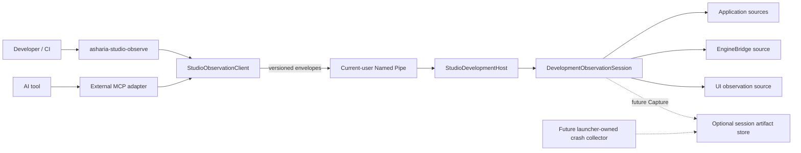
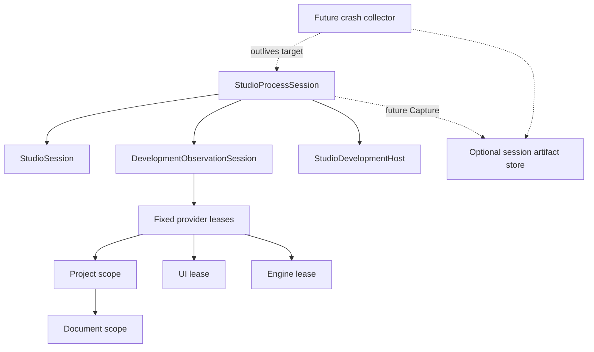

# Studio 开发态可观测性与诊断访问架构

状态：Current R0.5 Baseline + R2/R4 structured ingress / UI projection（protocol、shared-ring投影、Debug-only Host、current-user产品endpoint/discovery、typed CLI、壳 UI Probe及标准stdio只读 MCP adapter 的 Slice 1→8 与实现纠错格已关闭；#378把真实Project/Shell/viewport failure接入同一hub；#381建立同一hub上的Diagnostics面板；#383补齐双预算、stream-specific invalidation与active problem lifecycle）

更新日期：2026-08-13

本文定义 Asharia Studio 在开发构建中向开发者、CI 和 AI 工具暴露运行状态与诊断证据的目标合同。
它服从 [Studio 前端硬切架构](studio-frontend-hard-cut.md) 的 Document-first、单 owner、异步生命周期和
immutable snapshot 边界，并与仓库级
[Foundation Observability 目标](../../../../docs/architecture/foundation-framework.md#diagnostics-与本地-crash-baseline)
保持可收敛，但不把尚未实现的 Foundation 能力写成当前事实。

## 1. 结论与范围

Studio 需要一个 **Asharia 自有、开发态、本机、默认只读** 的观测面：

1. R0.5 Core v1 只读 snapshot、bounded window 与 descriptor；不修改 Document、World、Viewport、设置、Dock 或 UI property。
   job status 与 artifact 只属于后续 capability-specific v1，不是 Core 前置。
2. Windows v1 使用 current-user Named Pipe；transport 之外另有版本化、能力协商、typed error 和资源上限。
3. `asharia-studio-observe` CLI 是协议基准；MCP adapter 是同一 typed client 上的进程外薄适配。
   Studio 进程不依赖 MCP host、AI 产品或 prompt。
4. 不依赖 Avalonia Plus。仓库没有该许可证，官方 DevTools MCP 只作能力对照，不进入构建、运行或测试闭环。
5. logs、diagnostics、metrics、trace、memory、frame、tests、crash、UI 是不同成本和 owner 的 capability，
   不建立万能 `getState()`、反射 RPC、脚本控制台或裸内存入口。
6. 重型采集是后续 `Capture` 权限；业务写命令更晚，且必须经过业务 command、expected revision、transaction、
   undo 与审计。
7. Release/Shipping 闭包必须不存在 development host、发现清单和监听 endpoint；运行参数不能将其启用。

本文不设计 production telemetry、远程上传、公开 Editor SDK、跨机器调试、任意 shell/file/native access，
也不以观测面绕过 Application、EngineBridge、renderer 或 UI thread owner。

## 2. Current 与 Planned

| 领域 | Current（2026-08-13） | Planned |
| --- | --- | --- |
| UI diagnostics | [`App.axaml.cs`](../../App.axaml.cs) 创建process hub并安装自有[`StudioAvaloniaLogSink`](../../Shell/Diagnostics/StudioAvaloniaLogSink.cs)；adapter使用`Framework`/`avalonia`，最多单次投影16个BCL标量，未知对象只保留bounded type marker；`Program.cs`不调用`LogToTrace()` | 不依赖Plus，不保留framework object；新增值类型只有出现真实日志需求并证明producer-safe后才加入精确allowlist |
| Studio diagnostics | [`StudioDiagnosticHub`](../../src/Asharia.Studio.Application/Diagnostics/StudioDiagnosticHub.cs) 拥有diagnostic `2048 + 8 MiB`、log `8192 + 32 MiB`双预算ring，以及`1024 + 4 MiB`active problem index；sequence/cursor/drop和active incomplete均显式。#378接入真实Project/Shell/viewport producer，#381建立一个Diagnostics Dock，#383将Console/Problems硬切为同一hub上的stream-specific invalidation和active/history投影 | 后续producer仍只接入同一hub；过滤、折叠与详情只改变projection。persistent log、Profiler capture与problem report各自拥有独立生命周期，不建立第二业务truth |
| Operation provenance | [`StudioOperationDiagnosticWriter`](../../src/Asharia.Studio.Application/Diagnostics/StudioOperationDiagnosticWriter.cs)保留stable code/category/component、scope、operation/correlation/parent与ProjectEditId attribute；viewport projector保留session/epoch/transaction/generation/participant/outcome/failure | 扩充producer只能在真实operation boundary逐项接入；普通成功状态不写Problem，UI transient message不替代hub record |
| Native log/error | [`error.hpp`](../../../../engine/core/include/asharia/core/error.hpp) 只有 domain/code/message；[`log.cpp`](../../../../engine/core/src/log.cpp) 在 mutex 下写 stdout/stderr | 保留 bootstrap fallback；增加 structured router 和 typed sinks，不解析文本建立状态 |
| Native/renderer facts | viewport 已能复制 stats；[`render_view.hpp`](../../../../packages/renderer-basic/include/asharia/renderer_basic_vulkan/render_view.hpp) 有 RenderGraph snapshot/execution event | 复用 value-copy 和 renderer-owned event ID；不暴露 singleton、pointer、`Vk*` handle |
| Process acceptance | `Editor.Tests`作为目标外owner启动真实`Editor.exe`，覆盖clean exit、forced fatal、owner timeout、observer cancel与bounded reap | 这是R0门禁证据，不是`tests.*`产品capability；不接入Application hub、协议、artifact store或crash collector |
| Session/tool access | typed protocol、显式grant产品endpoint与`asharia-studio-observe list/describe/diagnostics/logs/ui-list-windows/ui-read-tree`已成立；真实`MainWindow`只读semantic projection经Host→Pipe→typed client/CLI闭环，且仅在provider存在时广告两项UI capability；同一可执行文件的精确`mcp`模式以Codex当前实际协商的标准stdio MCP `2025-06-18`只注册六个等价只读tools | R0.5当前面不再扩大；`state/readElement/find`、Capture/Mutate与任意method必须等待各自真实owner和新Slice |
| Foundation | 文档计划 bounded router、counter/trace 与 local crash evidence | 尚未实现；F3 落地后 Studio 消费同一 process truth，不保留第二套路由器 |

明确延期：#381只增加同一Diagnostics面板内的Console/Problems只读投影，不实现persistent log file、problem-report
bundle、crash collector、完整Task supervisor、命令输入/CVar，或在缺少typed target/source合同前猜测导航。Asharia保持
“bounded process truth / UI projection / persistent artifact”三个owner分开；打开、关闭或清空Diagnostics视图都不开始、
停止或删除持久采集。

### 2.1 R0.5 Slice 1 protocol/golden card（closed evidence）

| 字段 | 当前合同与证据 |
| --- | --- |
| Current evidence | R0关闭时仓库没有DevelopmentProtocol source/project/test，Host/Pipe/CLI/MCP与development endpoint均为0。本文已固定v1 envelope、version、method family、typed outcome/failure和hard limits，且最早门禁明确允许schema/offline golden先于in-process Host。 |
| I0 → I6 gate | I0是真实的接入风险：若先写Pipe/CLI，transport会反向定义未版本化的`object`/reflection消息与错误语义。此Slice只推进I1 Contract：独立dependency-free protocol assembly拥有typed value schema和canonical JSON codec，`session.describe` request/response形成offline golden闭环。尚无process/runtime owner或endpoint，故不宣称I2 Headless/Product；I3 reliability仅验证codec failure/bounds，Host/Pipe的并发、取消和teardown仍待后续格；I4-I6未进入。 |
| Engine precedent adopted | Unreal官方[Remote Control WebSocket Reference](https://dev.epicgames.com/documentation/unreal-engine/remote-control-api-websocket-reference-for-unreal-engine)使用显式`MessageName`与可关联deferred response的`Id`，[HTTP Reference](https://dev.epicgames.com/documentation/en-us/unreal-engine/remote-control-api-http-reference-for-unreal-engine)的batch以`RequestId`关联响应，且[Remote Control](https://dev.epicgames.com/documentation/unreal-engine/remote-control-for-unreal-engine)默认不进入packaged/game。Unity官方[`EditorConnection.Register`](https://docs.unity3d.com/cn/2019.3/ScriptReference/Networking.PlayerConnection.EditorConnection.Register.html)以稳定GUID message ID和player ID区分消息/连接。Godot官方[`EngineDebugger`](https://docs.godotengine.org/en/4.3/classes/class_enginedebugger.html)以固定name注册message capture。Asharia采用显式method/request/instance/generation和development-only closure。 |
| Rejected / Asharia rationale | 拒绝Unreal按`UObject path + function/property`反射调用/写入、HTTP/WebSocket远程面，拒绝Unity singleton/raw byte payload与blocking receive，也拒绝Godot`Callable + Array`通用message capture。Asharia只允许固定Observe method ID、typed generic envelope和immutable DTO；unknown method fail closed，unknown additive response outcome只投影`Unknown`，不变成generic RPC。 |
| Owner / lifetime | `Asharia.Studio.DevelopmentProtocol`只拥有compile-time schema与纯codec，没有static runtime session、thread、IO、subscription或dispose。test project是offline consumer，不注册假provider。下一格出现真实Host前，`StudioProcessSession`不引用该assembly，App owner与R0 teardown完全不变。 |
| Thread / data / error | DTO和codec无共享mutable state；canonical `JsonSerializerOptions`只读复用。request携protocol/request/instance/endpoint generation/method/timeout/typed parameters；response携typed outcome/value/failure/truncation。failure保留stable code/category/retry/remediation/capability/scope+generation/operation/correlation/safe attributes。 |
| Success / failure / timeout / cancel / shutdown | success由`session.describe` request/complete-response exact JSON golden与typed failure round-trip证明；same-major future minor/unknown additive fields可读，unknown outcome投影`Unknown`。incompatible major、unknown method、invalid identity/generation/timeout、oversize、invalid UTF-8/JSON/depth、malformed response与不一致local outcome均typed fail closed。timeout在本格只是hard contract校验；没有真实operation所以不伪造cancel/shutdown，Host Slice必须补齐。 |
| Bounds / complexity | request 1 MiB、response 8 MiB、JSON depth 32、page 1000、long-poll wait 1 s、request timeout 30 s、method ID 128 chars，所有检查O(1)；codec只使用BCL `System.Text.Json`与`ImmutableArray`，无dependency、dictionary/object bag、filesystem或网络。 |
| Earliest / latest gate | 紧随R0 4.39总门禁，正是文档允许的最早schema/golden格；早于shared-ring exposure、Host、current-user Pipe、typed CLI/UI Probe与MCP。下一Slice不得先建Pipe，必须先让Application diagnostic/log records获得无第二truth的typed protocol projection。 |
| Non-goals | runtime session/Host、discovery/manifest/token、Named Pipe/ACL、CLI/MCP、UI tree、diagnostic/log provider implementation、Capture/Mutate、generic RPC、metrics/trace/crash/artifact/test framework。 |
| Exit evidence | 新protocol/test projects加入canonical solution，当前精确为5 production+6 tests；Release solution build 0 warning/error。protocol golden/negative 11/11、architecture 25/25通过。distribution producer在任意深度显式拒绝DevelopmentProtocol与未来DevelopmentHost，fresh real publish absence及全量distribution 64/64通过。canonical 6个test projects为Application 16、EngineBridge 31、Architecture 25、Protocol 11、Headless 1、Editor 49，合计133/133；encoding 915 clean、doc-sync与diff-check通过。 |

### 2.2 R0.5 Slice 2 shared-ring exposure card（closed evidence）

| 字段 | 当前合同与证据 |
| --- | --- |
| Current evidence | R0唯一`StudioDiagnosticHub`已经拥有2048 diagnostic/8192 log固定ring、sequence/cursor/drop与structured context；Slice 1只有wire DTO/codec，尚不能把真实hub record投影为协议值。本Slice新增diagnostic/log cursor DTO与development-only projection，输入直接是同一个`IStudioDiagnosticHub` instance。 |
| I0 → I6 gate | I0风险是tool adapter复制ring、订阅producer或解析文本后形成第二truth。Slice 1的I1 typed protocol继续成立；本Slice推进到I2 Headless：无UI/GPU/transport即可创建真实Application hub、写入真实record、读取/失败并映射为protocol window。投影无资源、线程或outstanding work，因此没有伪造stop。尚无App runtime composition/真实endpoint consumer，故不宣称I3 Product；I4-I6未进入。 |
| Engine precedent adopted | Unreal官方[`FOutputDeviceRedirector::Serialize`](https://dev.epicgames.com/documentation/en-us/unreal-engine/API/Runtime/Core/Misc/FOutputDeviceRedirector/Serialize)把记录交给当前output devices，[`SerializeBacklog`](https://dev.epicgames.com/documentation/en-us/unreal-engine/API/Runtime/Core/Misc/FOutputDeviceRedirector/SerializeBacklog)也从同一redirector向目标设备回放；采用“单一router truth、多个读/输出adapter”。Unity官方[`Application.logMessageReceivedThreaded`](https://docs.unity3d.com/ScriptReference/Application-logMessageReceivedThreaded.html)明确回调可从不同线程并行发生，采用线程安全ingress与读侧snapshot。Godot官方[`EditorDebuggerSession`](https://docs.godotengine.org/en/stable/classes/class_editordebuggersession.html)允许plugin以message通道交换调试数据，只用于核对adapter边界。 |
| Rejected / Asharia rationale | 拒绝为CLI/Host新建第二ring，拒绝producer直接回调tool、阻塞log线程或让client数量放大采样；也拒绝Godot风格`StringName + Array`通用消息成为Asharia协议。Asharia只从Application owner的typed bounded hub snapshot-pull，再映射为固定diagnostics/log DTO；本格不增加任意message dispatch。 |
| Owner / lifetime | `StudioDiagnosticHub`仍是ring、sequence、drop与subscription slots的唯一owner。`StudioDiagnosticObservationSource`只持有hub引用和正数`ProviderGeneration`，不拥有store/thread/IO/subscription/CTS，不实现`IDisposable`；scope owner generation来自record，provider generation来自当前projection lease。 |
| Thread / data / error | projection只调用线程安全`ReadDiagnostics`/`ReadLogs`并复制最多一页immutable DTO；保留sequence/time/monotonic/thread、severity/level/channel/code/category、package/component、scope+owner/provider generation、operation/correlation/parent、sensitivity、template/rendered message、attributes/fingerprint/repeat/truncation。provider exception只越界为typed `observation.provider.faulted`和exception type，不泄露exception message。 |
| Success / failure / timeout / cancel / shutdown | 9个focused tests覆盖cursor expiry/drop、problem filter、完整structured mapping、log mapping、negative cursor/page/channel、provider fault isolation与无private ring/subscription。timeout/cancel/shutdown在本格没有异步operation或owned resource，因此明确不伪造；下一格真实in-process Host/session必须补成功、失败、timeout、cancel与shutdown receipt。 |
| Bounds / complexity | `MaxCount`必须为1..1000，cursor非负；hub read与projection至多O(page)，额外空间O(page)，没有随运行时间或client数增长的retention。diagnostic/log原ring容量、drop与cursor-expired语义保持R0唯一真值。 |
| Earliest / latest gate | 紧随Slice 1 protocol/golden，早于runtime Host、Named Pipe、CLI与MCP，符合“schema → shared-ring exposure → Host”的最早顺序。下一Slice最多只推进in-process observation session/Host dispatch；Pipe仍后置。 |
| Non-goals | runtime listener/session discovery/token/manifest、Named Pipe/ACL、CLI/MCP、UI tree、long-poll/server push、Capture/Mutate、generic RPC、metrics/trace/profiler/crash/artifact/test framework；也不把development assemblies加入Editor Release closure。 |
| Exit evidence | `Asharia.Studio.DevelopmentHost`及其test project加入canonical solution，当前精确为6 production+7 tests；Release build 0 warning/error。Host focused 9/9、architecture 26/26通过；canonical Application 16、EngineBridge 31、Architecture 26、Protocol 11、Host 9、Headless 1、Editor 49，合计143/143。fresh real publish及distribution 64/64继续证明DevelopmentProtocol/DevelopmentHost在任意深度都不进入Release image。 |

### 2.3 R0.5 Slice 3 in-process Host card（closed evidence）

| 字段 | 当前合同与证据 |
| --- | --- |
| Current evidence | Slice 2只有hub→DTO投影，没有runtime identity、capability descriptor、typed dispatch owner或stop。当前`DevelopmentObservationSession`绑定真实process/hub、instance/session/endpoint/provider generation与三项固定Observe capability；`StudioDevelopmentHost`提供三个typed overload。Debug `StudioCompositionSession`创建并拥有该Host，Release不编译引用边。 |
| I0 → I6 gate | I0风险是先写Pipe导致transport同时承担session、dispatch与teardown owner。I1合同、I2真实hub headless投影保持；本Slice推进I3 Product Slice：Debug产品composition以真实hub创建Host，`session.describe`及diagnostic/log从source→Application owner→projection→session→Host response→consumer形成纵向闭环，并由同一composition shutdown。尚无进程外adapter/transport，故I4-I6未进入。 |
| Engine precedent adopted | Unreal官方[Remote Control Quick Start](https://dev.epicgames.com/documentation/en-us/unreal-engine/remote-control-quick-start-for-unreal-engine)把server显式Start/Stop，[`FOutputDevice::TearDown`](https://dev.epicgames.com/documentation/en-us/unreal-engine/API/Runtime/Core/FOutputDevice/TearDown)明确清理不能依赖static/global析构；采用显式owner stop与deadline receipt。Unity官方[`EditorConnection`](https://docs.unity3d.com/ScriptReference/Networking.PlayerConnection.EditorConnection.html)区分`Initialize`与`DisconnectAll`。Godot官方[`EditorDebuggerSession`](https://docs.godotengine.org/en/4.5/classes/class_editordebuggersession.html)公开started/stopped与`is_active`生命周期。 |
| Rejected / Asharia rationale | 拒绝Unreal HTTP/WebSocket和`UObject` function/property写面，拒绝Unity `ScriptableSingleton`/raw message bus，也拒绝Godot `send_message(String, Array)`、breakpoint/profiler控制进入Core。Asharia Host不是singleton，只接受三个compile-time typed overload；没有任意dispatch、remote control、Capture或Mutate。 |
| Owner / lifetime | Debug `StudioProcessSession -> StudioCompositionSession -> StudioDevelopmentHost -> DevelopmentObservationSession -> projection`是唯一owner链；Host先stop，再释放Shell view model。Host拥有lifetime CTS、单dispatch gate和唯一stop task；重复stop返回同一immutable receipt。deadline命中后拒绝新请求、取消in-flight，后台只负责等待既有调用drain后置`Stopped`，不发布第二receipt。Release `Editor.csproj`仅以`Condition="'$(Configuration)' == 'Debug'"`引用Host。 |
| Thread / data / error | start在composition owner线程获取真实PID/process start/build MVID/configuration；dispatch gate序列化当前in-process read，hub本身仍线程安全。请求验证protocol、request/instance/endpoint/method/timeout/typed parameters；provider异常沿Slice 2投影为typed failure且不泄露exception message。response始终返回Host实际instance/generation。 |
| Success / failure / timeout / cancel / shutdown | Host 16/16覆盖descriptor及codec round-trip、真实hub complete/partial cursor、identity/provider failure、caller cancellation、排队request deadline、normal idempotent stop、owner stop timeout→in-flight cancellation→最终drain。Debug product test 1/1证明composition实际创建running Host并在dispose后得到`Stopped`；新dispatch在Stopping/Stopped均typed fail closed。 |
| Bounds / complexity | page仍为1..1000、request timeout最多30秒、dispose owner deadline 5秒；每次read最多O(page)/O(page) copy。当前无listener或外部caller，单gate不新增retention/store/thread；下一Pipe格必须在进入Host前固定最多4 clients、每client 16 in-flight、frame byte bounds与backpressure，不能把等待队列留成无界。 |
| Earliest / latest gate | 紧随shared-ring exposure，早于current-user Pipe，符合`protocol → projection → in-process Host → Pipe`。下一格只允许transport/framing/handshake/security/disconnect，不新增state/UI/Capture方法。 |
| Non-goals | Named Pipe/DACL/manifest/token/discovery、CLI/MCP、UI tree、state aggregation、server push、Capture/Mutate、generic RPC、remote control、metrics/trace/profiler/crash/artifact/test framework。 |
| Exit evidence | canonical solution仍为6 production+7 tests。Debug build 0 warning/error、151/151（Editor 50含product composition）；Release build 0 warning/error、150/150（Editor 49，Host unit 16），architecture 26/26。fresh real publish/distribution 64/64证明Debug条件边与两个development assemblies均未进入Release image。 |

### 2.4 R0.5 Slice 4 current-user Pipe adapter card（closed evidence）

| 字段 | 当前合同与证据 |
| --- | --- |
| Current evidence | Slice 3只有in-process typed overload，没有OS endpoint、framing、handshake或client disconnect。当前development Host assembly新增真实Windows `NamedPipeServerStream` adapter：4-byte little-endian length + UTF-8 JSON，连接首帧为独立typed handshake，随后只尝试三个已存在的typed request合同。它尚未接入App或写discovery manifest。 |
| I0 → I6 gate | I0风险是用TCP/HTTP/WebSocket或每连接`Task.Run`快速铺出远程/无界server，并让transport拥有业务truth。本Slice在既有Host I3之下只推进Pipe adapter的I2 Headless：真实Windows server/client完成connect→handshake→typed read→disconnect/stop，仍不宣称I3产品endpoint，因为App composition没有创建server，外部也没有discovery入口。I4 CLI parity及I5-I6未进入。 |
| Engine/platform precedent adopted | Unreal官方[Remote Control](https://dev.epicgames.com/documentation/unreal-engine/remote-control-for-unreal-engine)默认不进入packaged/game，[Quick Start](https://dev.epicgames.com/documentation/en-us/unreal-engine/remote-control-quick-start-for-unreal-engine)要求显式Start/Stop且默认只绑定localhost；采用development-only、显式owner、先stop accept。Microsoft官方[`PipeOptions.CurrentUserOnly`](https://learn.microsoft.com/en-us/dotnet/api/system.io.pipes.pipeoptions)提供同一用户边界，[`WaitForConnectionAsync(CancellationToken)`](https://learn.microsoft.com/en-us/dotnet/api/system.io.pipes.namedpipeserverstream.waitforconnectionasync?view=net-10.0)要求server以`Asynchronous`创建才能可靠取消；两项均直接采用。Unity官方`EditorConnection.DisconnectAll`继续支持显式断连边界。 |
| Rejected / Asharia rationale | 拒绝Unreal的HTTP/WebSocket/LAN/反射property/function面，拒绝Unity singleton/raw payload callback bus，也不新增Godot式string+array消息。拒绝thread-per-client、unbounded `Task.Run`、server push和transport内第二diagnostic store；Pipe只适配typed Host。 |
| Owner / lifetime | `StudioDevelopmentPipeServer`持有Host引用但不拥有Host；未来composition必须按`manifest撤销 → Pipe stop → Host stop`释放。server拥有32-byte attach-token bytes、一个lifetime CTS、固定4个accept worker与唯一stop task；正常/重复stop返回同一receipt。deadline后只等待既有worker drain并清零token，不创建第二receipt。 |
| Security / framing | server与test client均使用`PipeOptions.CurrentUserOnly|Asynchronous`；pipe name限128个ASCII字母/数字/点/横线/下划线。attach token必须是canonical base64编码的32 random bytes，以`CryptographicOperations.FixedTimeEquals`比较，失败只返回统一denied且不回显token。malformed handshake直接断连；oversize/partial frame只终止该client。 |
| Success / failure / timeout / cancel / shutdown | protocol 13/13含handshake golden、version/identity/token negative及secret不进入response；Host/Transport 21/21含真实current-user Pipe handshake、typed log round-trip、wrong-token、oversize client隔离后worker恢复、idle stop、stop deadline→blocked dispatch drain→Stopped。测试同时发现并修复default `ImmutableArray` failure attributes无法序列化的问题。 |
| Bounds / complexity | request 1 MiB、response 8 MiB、4个固定worker、每连接严格1 in-flight；frame先验证4-byte长度再分配，空间O(frame)，不保留历史。client量由OS server instances固定为4；没有accept task增长、client task集合、文件IO或网络socket。 |
| Earliest / latest gate | 紧随in-process Host，早于App activation/discovery与CLI，符合`Host → current-user Pipe primitive → discovery/product endpoint → typed CLI`。下一格必须把endpoint显式挂入Debug owner并提供可撤销、current-user保护的发现清单；不得直接写CLI猜pipe/token。 |
| Non-goals | App自动监听/运行参数、manifest/discovery目录/ACL/heartbeat、CLI/MCP、UI tree/state、long-poll/server push、Capture/Mutate、generic RPC、TCP/HTTP/WebSocket、remote control、metrics/trace/profiler/crash/artifact/test framework。 |
| Exit evidence | solution仍为6 production+7 tests。Debug build 0 warning/error、158/158；Release build 0 warning/error、157/157（Application 16、EngineBridge 31、Architecture 26、Protocol 13、Host 21、Headless 1、Editor 49）。fresh real publish/distribution 64/64继续证明Pipe代码与两个development assemblies不进入Release image。 |

### 2.5 R0.5 Slice 5 explicit product endpoint/discovery card（closed evidence）

| 字段 | 当前合同与证据 |
| --- | --- |
| Current evidence | Slice 4的Pipe只在Host测试中启动，App没有activation、manifest或外部attach入口。当前Debug产品组合只在命令行精确出现`--development-observation=readonly`时创建`StudioDevelopmentPipeEndpoint`；端点先启动Pipe，再将版本化`DevelopmentSessionManifest`发布到`%LOCALAPPDATA%/Asharia/Studio/development-sessions/<StudioInstanceId>.json`。无grant时仍只有in-process Host；Release条件引用不包含DevelopmentHost，因此相同参数不能启用endpoint。 |
| I0 → I6 gate | I0风险是默认监听、环境变量旁路、可猜token/路径、陈旧manifest或停止顺序使工具attach到半销毁Host。既有I1 typed schema与I2真实Pipe继续成立；本Slice推进I3 Product：真实composition owner从唯一Application hub建立Host→Pipe→manifest纵向闭环，并以同一owner执行manifest撤销→Pipe stop→Host stop。I4 CLI parity及I5-I6仍未进入。 |
| Engine/platform precedent adopted | Unreal官方[Remote Control Quick Start](https://dev.epicgames.com/documentation/unreal-engine/remote-control-quick-start-for-unreal-engine)要求显式Start/Stop且默认不运行server，[Remote Control](https://dev.epicgames.com/documentation/en-us/unreal-engine/remote-control-for-unreal-engine)在packaged/`-game`默认关闭；采用“显式开发grant + owner teardown”。Microsoft官方[`FileSystemAclExtensions`](https://learn.microsoft.com/en-us/dotnet/api/system.io.filesystemaclextensions?view=net-10.0)提供Windows ACL专用创建/读取/设置，[`CreateDirectory(DirectorySecurity, String)`](https://learn.microsoft.com/en-us/dotnet/api/system.io.filesystemaclextensions.createdirectory?view=net-10.0)与`Create(FileInfo,...,FileSecurity)`允许创建时附带安全描述符；[`File.Replace`](https://learn.microsoft.com/en-us/dotnet/api/system.io.file.replace?view=net-10.0)用于同目录临时文件替换。 |
| Rejected / Asharia rationale | 拒绝Unreal的HTTP/WebSocket/LAN与反射写面，拒绝默认启动、环境变量隐式激活、world-readable manifest、命令行直接携带secret、注册表/全局临时目录、TCP discovery或CLI猜测pipe/token。Asharia只允许一个精确只读grant；manifest是typed protocol值，只含attach所需bounded字段，不加入method路由、Capture/Mutate或第二truth。 |
| Owner / lifetime | Debug `StudioCompositionSession`依次拥有`StudioDevelopmentPipeEndpoint`与`StudioDevelopmentHost`；endpoint拥有`CurrentUserManifestStore`和Pipe server但不拥有Host。start为Pipe→manifest，任何manifest发布失败都会精确删除目标并停止Pipe；stop为manifest remove→剩余deadline内Pipe stop；composition随后stop Host、最后释放Shell。每层重复stop复用唯一task/receipt。 |
| Security / discovery | manifest根与文件均使用protected DACL、仅当前Windows SID `FullControl`，owner也是当前SID；根拒绝reparse point。文件名只由non-empty instance GUID生成；payload上限64 KiB，token为canonical 32-byte base64、capability digest为canonical uppercase SHA-256。写入使用同目录随机临时文件、创建时ACL、async write、`FlushAsync`+`Flush(flushToDisk:true)`、atomic move/replace并重施文件DACL。 |
| Success / failure / timeout / cancel / shutdown | Protocol 16/16覆盖manifest exact golden/round-trip、future major、oversize、null字段、token/digest非规范编码；Host/Transport 23/23覆盖真实Pipe attach、目录/文件owner与单SID protected ACL、停止后manifest/Pipe消失，以及manifest目录被文件占用时start失败后无discovery、无listener。Debug产品组合focused 7/7覆盖无grant无endpoint、精确grant正负矩阵、真实产品路径发布和manifest→Pipe→Host关闭。timeout/cancel继续由Host/Pipe既有deadline/drain tests覆盖。 |
| Bounds / complexity | discovery每Studio instance固定1个≤64 KiB manifest；发布只分配一个payload和一个临时文件，空间/IO为O(manifest)，不扫描目录、不轮询、不保留历史。Pipe仍为4 worker、每连接1 in-flight；capability digest对固定小capability集合排序，当前3项。没有watcher、heartbeat timer、background task或第二store。 |
| Earliest / latest gate | 紧随current-user Pipe primitive，早于CLI；完成`Host → Pipe → discovery/product endpoint`的最小真实闭环。下一格CLI只能读取该current-user manifest并使用现有handshake/三个typed方法，不得反向改变Host、添加任意RPC或先接MCP。 |
| Non-goals | CLI/MCP、UI tree/state、manifest watcher/heartbeat task、multi-user或remote discovery、TCP/HTTP/WebSocket、server push、Capture/Mutate、generic RPC、remote control/input、metrics/trace/profiler/crash/artifact/test framework。 |
| Exit evidence | Debug与Release canonical build均0 warning/error；Debug 170/170（Application 16、EngineBridge 31、Architecture 27、Protocol 16、Host 23、Headless 1、Editor 56），Release 163/163（Editor 49，不编译Debug-only产品端点tests）。fresh real publish/distribution 64/64继续证明两个development assemblies、manifest与endpoint closure不进入Release image。encoding 915 clean、doc-sync、diff-check通过；`TestResults`、相关进程与默认discovery manifest残留均为0。 |

### 2.6 R0.5 Slice 6a typed CLI discovery/describe card（closed evidence）

| 字段 | 当前合同与证据 |
| --- | --- |
| Current evidence | Slice 5已有真实产品manifest/Pipe，但没有外部client/project/command/exit-code；工具若猜pipe/token或直接反序列化任意文件就会绕过发现与协议门禁。当前新增独立`asharia-studio-observe`可执行目标及test project，生产目标只引用DevelopmentProtocol。首格只公开`list`与必须显式`--instance <D-guid>`的`describe`；尚未注册`state/diagnostics/logs/ui`命令。 |
| I0 → I6 gate | I0风险是CLI自行解释日志、默认选择任一session、输出secret、引入App/Host依赖或把命令表扩大成generic RPC。I1-I3 protocol/Host/endpoint保持不变；本Slice只推进I4 Adapter parity的一条纵向闭环：current-user discovery→typed manifest→process identity→Pipe handshake→Host `session.describe`→wire-semantic JSON/human output→typed exit。`diagnostics/logs` cursor parity与UI Probe仍未关闭，I5-I6及MCP未进入。 |
| Engine/platform precedent adopted | Unreal官方[Remote Control Quick Start](https://dev.epicgames.com/documentation/unreal-engine/remote-control-quick-start-for-unreal-engine)要求显式启动server；[HTTP Reference](https://dev.epicgames.com/documentation/unreal-engine/remote-control-api-http-reference-for-unreal-engine)以固定route/request ID关联请求响应，采用“显式target + 固定typed command + correlated response”。Unity官方[`EditorConnection.Register`](https://docs.unity3d.com/ScriptReference/Networking.PlayerConnection.EditorConnection.Register.html)继续支持稳定GUID message identity。Microsoft官方[`NamedPipeClientStream.ConnectAsync`](https://learn.microsoft.com/en-us/dotnet/api/system.io.pipes.namedpipeclientstream.connectasync?view=net-10.0)提供timeout与cancellation。 |
| Rejected / Asharia rationale | 拒绝Unreal HTTP/WebSocket、route discovery与`UObject`任意function/property读写；拒绝Godot官方`--remote-debug <uri>`的TCP/远程URI面，也拒绝Unity singleton/raw byte callback。Asharia CLI不接收host/port/path/token，不自动挑选“第一个”session，不shell进Studio，不读取进程内存，不注册无provider命令；`--format`、`--instance`与命令名均大小写精确。 |
| Owner / lifetime | 每次CLI invocation拥有一个命令deadline CTS；Ctrl+C是独立caller cancellation。`list`只拥有一次bounded scan；`describe`拥有一次manifest resolution和一个`NamedPipeClientStream` connection，输出完成即`DisposeAsync`。CLI退出不影响Studio；Studio先撤销manifest时后续attach得到stale，不存在static client、watcher、retry loop或background task。 |
| Security / identity | CLI同时验证根/文件不是reparse、protected ACL、owner/current SID与唯一当前SID FullControl rule；精确读取`<instance>.json`且先验64 KiB长度。manifest PID+process start必须匹配当前进程；handshake descriptor还必须匹配instance/session/PID/start/generation/build/config与capability SHA-256。attach token只在Client层首帧使用；CommandLine source不读取`AttachToken`或`PipeName`，stdout/stderr tests验证secret absence。 |
| Success / failure / timeout / cancel / shutdown | 19个CLI tests覆盖精确parser与未实现命令拒绝、missing instance→stale、真实endpoint list/describe、wrong token→authorization、不存在Pipe→deadline timeout、caller cancel→130、endpoint shutdown先撤销discovery→stale、继承ACL fail-closed、超过64 manifest typed partial，以及`CreateNoWindow/Hidden`真实CLI子进程attach。测试曾发现并修复`ImmutableArray.Builder.MoveToImmutable`容量前提与deadline/caller cancellation混淆。 |
| Bounds / complexity | 最多16个argv、64个manifest、每个64 KiB、Pipe request 1 MiB/response 8 MiB、timeout 1..30000 ms；enumeration在第65项立即停止且只保留65个path，排序/读取上限固定。每个describe只有1 connection、1 handshake、1 in-flight；没有目录watcher、unbounded retry、task collection或第二diagnostic ring。 |
| Earliest / latest gate | 紧随显式product endpoint/discovery，早于cursor CLI与MCP。下一格只能在同一typed connection上加入已广告的`diagnostics.read/logs.read`分页/cursor参数与partial/drop输出；不得借CLI新增Host方法、state/ui空壳、通用method参数或MCP。 |
| Non-goals | `diagnostics/logs/state/ui`命令、UI Probe、MCP/stdio server、Capture/Mutate、generic RPC、remote URI/TCP/HTTP/WebSocket、automatic session selection、watch/retry daemon、artifact/profiler/crash/test framework。 |
| Exit evidence | canonical solution扩为7 production+8 tests。Debug/Release build均0 warning/error；Debug 190/190、Release 183/183（Application 16、EngineBridge 31、Architecture 28、Protocol 16、Host 23、Observe 19、Headless 1、Editor Debug 56/Release 49）。fresh real publish/distribution 64/64继续证明CLI及DevelopmentProtocol/Host不进入Editor Release image。 |

### 2.7 R0.5 Slice 6b typed CLI diagnostic/log cursor card（closed evidence）

| 字段 | 当前合同与证据 |
| --- | --- |
| Current evidence | Slice 6a只能发现并describe，尚未为Host已经广告的`diagnostics.read/logs.read`提供CLI parity。当前CLI新增两个固定命令及`--after`、`--max`、diagnostic-only `--channel all|debug|problem`；仍没有generic `--method`、state/ui空壳或新Host route。 |
| I0 → I6 gate | I0风险是CLI通过一次性dump、文本解析或自有buffer丢失Hub的cursor/drop/partial真值，或让分页参数绕过Host bounds。I1-I3不变；本Slice完成当前三项Host capability的I4 Adapter parity：同一connection在handshake后发送一个typed cursor request，response identity、window ordering/bounds与partial语义再次由client验证，JSON使用同一protocol codec。I5-I6、UI Probe与MCP仍未进入。 |
| Engine precedent adopted | Unreal官方[`FOutputDeviceRedirector::SerializeBacklog`](https://dev.epicgames.com/documentation/en-us/unreal-engine/API/Runtime/Core/Misc/FOutputDeviceRedirector/SerializeBacklog)从同一redirector回放记录，继续采用“单一日志truth，多读adapter”。Unity官方[`Application.logMessageReceivedThreaded`](https://docs.unity3d.com/ScriptReference/Application-logMessageReceivedThreaded.html)明确日志可从任意线程进入，CLI只读取已有thread-safe bounded snapshot。Godot官方[`EditorDebuggerSession`](https://docs.godotengine.org/en/stable/classes/class_editordebuggersession.html)的通用message面仅作adapter边界对照。 |
| Rejected / Asharia rationale | 拒绝CLI tail文件、解析rendered text建状态、订阅producer、复制第二ring、server push、自动轮询、Godot式string+array method或把任意method name透传Pipe。Asharia只投影Host已有typed DTO；human输出也固定保留cursor summary，不能用“漂亮表格”隐藏drop/expired/truncated。 |
| Owner / lifetime | invocation仍只拥有一次discovery、一个Pipe connection与一个command deadline；handshake完成后恰好一个cursor request，输出后关闭。client不持有hub、subscription、watcher或history；blocked Host read时client timeout/cancel会停止等待并释放连接，Host/Pipe按既有owner继续有界drain。 |
| Data / error | request保留instance/generation/request correlation、after/max/channel；response必须匹配request ID、instance和endpoint generation。client拒绝default items、负cursor/drop、超过requested/1000 items、非严格递增sequence、`NextCursor`回退，以及Complete/Partial与expired/truncated不一致。server typed failure映射protocol/auth/stale/unavailable/failed/timeout/cancel exit；partial固定exit 3。 |
| Success / failure / timeout / cancel / shutdown | Observe tests增至27/27：真实hub problem filter、log ring wrap/drop、JSON typed response、human cursor summary、partial exit 3；真实无窗口CLI子进程执行`logs`；blocked real Hub分别证明request timeout=15与caller cancel=130；parser拒绝负cursor、page>1000、logs channel、unknown channel和未实现state。既有wrong token、stale与endpoint shutdown证据保持。 |
| Bounds / complexity | after为非负`long`、max为1..1000；每命令仍1 connection、1 handshake、1 cursor request、1 response≤8 MiB，client额外validation为O(page)/O(1) state。没有跨页自动循环、unbounded collection、long-poll、retry/backoff或第二retention。 |
| Earliest / latest gate | 紧随6a discovery/describe；当前Host已广告的三项能力现均有typed CLI method。依据本文总顺序，下一格先审计/闭合shell UI Probe最小只读边界，再允许只读MCP复用已经存在的client方法；MCP不得shell out到CLI或增加工具面。 |
| Non-goals | state/UI provider与命令、UI Probe、MCP/stdio、跨页自动tail、watch daemon、Capture/Mutate、generic RPC/method、TCP/HTTP/WebSocket、metrics/trace/profiler/crash/artifact/test framework。 |
| Exit evidence | Debug/Release canonical build均0 warning/error；Debug 198/198、Release 191/191（Observe 27，其余为Application 16、EngineBridge 31、Architecture 28、Protocol 16、Host 23、Headless 1、Editor Debug 56/Release 49）。fresh real publish/distribution 64/64继续证明独立CLI与development assemblies不进入Editor Release image。 |

### 2.8 R0.5 Slice 7a shell UI protocol/headless projection card（closed evidence）

| 字段 | 当前合同与证据 |
| --- | --- |
| Current evidence | Slice 6b之后协议虽预留`ui.listWindows/readTree/readElement/find` method ID，但没有任何UI parameters/result DTO、provider或真实壳投影；直接接MCP会让adapter反向发明UI合同。本Slice只实现前两项：dependency-free protocol拥有稳定window/element ID、project-owned role、effective visibility/enabled与扁平拓扑tree；Debug Editor从真实`MainWindow`的显式`AutomationProperties`复制immutable snapshot。Host/Pipe/CLI尚不广告或dispatch UI。 |
| I0 → I6 gate | I0风险是把Avalonia `Control`、ViewModel/DataContext、反射property、指针/路径或截图/input穿过wire，或在transport线程直接遍历UI。本Slice推进I1 Contract与I2 Headless：canonical golden先固定typed schema/bounds，Avalonia Headless随后在真实壳Starting→Ready状态上验证相同ID与可见性；尚未接产品Host，故不宣称I3，Adapter parity及MCP I4-I6也未进入。 |
| Engine/framework precedent adopted | Unreal官方[Widget Reflector](https://dev.epicgames.com/documentation/en-us/unreal-engine/using-the-slate-widget-reflector-in-unreal-engine)以widget hierarchy观察父子、可见性与focus；Unity官方[UI Toolkit Debugger](https://docs.unity3d.com/6000.0/Documentation/Manual/UIE-ui-debugger.html)提供运行中visual hierarchy；Godot官方[debugging tools overview](https://docs.godotengine.org/en/4.4/tutorials/scripting/debug/overview_of_debugging_tools.html)区分运行时Remote/Local scene tree；Avalonia官方[Accessibility](https://docs.avaloniaui.net/docs/app-development/accessibility)明确`AutomationId`是稳定、非本地化的自动化标识。Asharia采用“运行中只读层级 + stable semantic ID”，但只投影显式标注的壳节点。 |
| Rejected / Asharia rationale | 拒绝Unreal暴露source/address与snapshot image、Unity任意element property/style编辑、Godot通用scene/object inspector，以及Avalonia Plus DevTools MCP的screenshot/input/property面。Asharia不输出framework type、raw visual child、geometry、focus/input、DataContext或object引用；`readElement/find`继续无provider，避免预埋任意查询。 |
| Owner / lifetime / thread | `App`仍拥有唯一`MainWindow`；`StudioShellUiObservationProjection`只是Debug-only借用引用，无store/thread/subscription/CTS或dispose，不改变Window owner。所有读取先检查caller cancellation，再经`Dispatcher.UIThread.InvokeAsync`进入UI owner，一次性复制DTO；窗口关闭后list为空、read返回typed not-found。Editor与Headless只用Debug条件直接引用DevelopmentProtocol，Release closure不出现该assembly或projection type。 |
| Data / bounds | list最多16个window；tree请求最多512个semantic node、semantic depth 16、ID 128字符、name 256字符。底层visual traversal另有4096节点/64层硬预算，DFS只保留有显式AutomationId的节点，父节点必须先出现且ID唯一；node/depth/visual预算命中返回明确partial reason。复杂度O(min(visual budget, real tree))、空间O(max nodes + bounded traversal stack)。 |
| Success / failure / timeout / cancel / shutdown | Protocol 20/20包含两个method的exact request/response golden、partial envelope、非法ID/预算、非拓扑parent及partial不一致fail-closed。Headless 4/4覆盖真实Starting→Ready semantics、worker-thread dispatcher、depth/node truncation、wrong window/invalid budget typed failure、预取消、排队调用deadline cancellation与window close。当前同步capture本身由硬预算终止；typed Host timeout/stop receipt明确留到下一Host格，不用fixture伪造。 |
| Earliest / latest gate | 紧随typed CLI cursor parity，且早于MCP，符合`typed CLI + shell UI Probe → read-only MCP`。下一Slice只允许将这两个已闭合合同作为单一provider接入既有Host→Pipe→typed client/CLI；必须先有product success/failure/timeout/cancel/shutdown与capability digest证据，之后才允许MCP复用client。 |
| Non-goals | Host/Pipe/CLI UI route、`ui.readElement/find`、MCP/stdio、screen capture、input/focus control、任意property/style/object read、mutation、generic RPC、remote transport、Document/scene/viewport UI、metrics/trace/profiler/crash/artifact/test framework。 |
| Exit evidence | Debug canonical build 0 warning/error、206/206（Application 16、EngineBridge 31、Architecture 29、Protocol 20、Host 23、Observe 27、Headless 4、Editor 56）；Release build 0 warning/error、196/196（Headless 1、Editor 49，其余同上）。fresh real-SDK distribution 64/64继续证明Editor Release image不含DevelopmentProtocol/DevelopmentHost与UI projection closure；encoding、doc-sync、diff-check均通过。 |

### 2.9 R0.5 Slice 7b shell UI Host/Pipe/typed CLI parity card（closed evidence）

| 字段 | 当前合同与证据 |
| --- | --- |
| Current evidence | Slice 7a已有两个UI wire合同和真实Avalonia Headless projection，但Host只广告session/diagnostics/logs，产品composition没有把`MainWindow`交给development边界，Pipe/client/CLI也没有UI route。本Slice新增精确的`IStudioUiObservationSource`二方法port；Debug产品composition把真实window projection注入Host，Host仅在source存在时广告`ui.listWindows/readTree`，并沿既有Pipe、typed client与两个固定CLI verb闭环。 |
| I0 → I6 gate | I0风险是transport反向定义UI DTO、Pipe线程读取Control、无provider仍广告空能力，或MCP先于基准adapter。Slice 7a的I1 Contract/I2 Headless保持；本Slice推进I3 Product与I4 Adapter parity：真实产品owner提供source，Host完成typed dispatch和provider隔离，Pipe只路由两个既有method，client再验证identity/bounds/partial，CLI保留wire语义。MCP的I5/I6仍未进入。 |
| Engine/framework precedent adopted | Unreal官方[Widget Reflector](https://dev.epicgames.com/documentation/en-us/unreal-engine/using-the-slate-widget-reflector-in-unreal-engine)与Unity官方[UI Toolkit Debugger](https://docs.unity3d.com/6000.0/Documentation/Manual/UIE-ui-debugger.html)继续支持“运行中层级由UI owner读取、外部工具只观察”的边界；Avalonia官方[Threading](https://docs.avaloniaui.net/docs/app-development/threading)规定Control只能从UI线程访问，并提供`Dispatcher.UIThread.InvokeAsync`。Asharia在`Background` dispatcher priority下复制immutable DTO，transport与client只处理值。 |
| Rejected / Asharia rationale | 拒绝`Dispatcher.Post`/fire-and-forget、transport线程直接遍历视觉树、跨边界返回Control/ViewModel/DataContext、自动选择目标、任意selector/property/style/source/address、screenshot/input，以及用fixture provider冒充产品能力。CLI只有`ui-list-windows`与`ui-read-tree`；`readElement/find/state`不广告、不dispatch、不注册stub。 |
| Owner / lifetime / thread | `StudioProcessSession -> StudioCompositionSession -> StudioDevelopmentHost -> DevelopmentObservationSession -> IStudioUiObservationSource`仍是唯一Debug产品owner链；source借用App唯一`MainWindow`且无额外thread/store/subscription。UI读取经可等待的dispatcher调用完成后才返回immutable值；Host lifetime token、caller token和deadline token链接，stop关闭新dispatch并等待既有调用有界drain。Release composition不编译development边。 |
| Data / security / error | request/response沿用Slice 7a的window/node/depth/ID/name硬界；Pipe handshake继续绑定current-user ACL、token、instance/session/endpoint generation。client要求descriptor实际广告对应available capability，并再次校验window identity、tree拓扑、requested max depth/count与Complete/Partial一致性。provider异常只映射`observation.provider.faulted`且不泄露message；非法provider结果映射`observation.provider.invalid-result`。 |
| Success / failure / timeout / cancel / shutdown | Host 25/25覆盖provider存在/缺失的descriptor、真实路由、partial、invalid result、fault、deadline、caller cancel与stop；Observe 37/37覆盖两个CLI parser/human/JSON、真实Pipe complete/partial/secret-redaction、缺能力、client timeout/cancel；Headless Debug 5/5以真实`MainWindow`和显式grant证明产品Host广告与list/tree成功，并证明manifest撤销、Pipe停止、Host拒绝late dispatch。 |
| Bounds / complexity | list最多16 windows；tree最多512 semantic nodes/16 semantic depth，底层4096 visual nodes/64 visual depth；Pipe仍最多4 clients、每connection严格1 in-flight、request 1 MiB/response 8 MiB、deadline最多30秒。Host单dispatch gate和每次UI copy均有界，不保存tree history、不建立第二cache、watcher、server push或retry queue。 |
| Earliest / latest gate | 紧随Slice 7a真实Headless projection，且完成MCP之前要求的typed Host/Pipe/client/CLI parity。下一Slice只能建立进程外stdio只读MCP adapter，并复用当前六个typed client方法；不得shell out到CLI、引用App/Host实现或新增协议method/provider。 |
| Non-goals | `state/readElement/find`、Capture/Mutate、generic RPC、remote transport、screenshot/input/focus/property/style/object read、Document/scene/viewport UI、metrics/trace/profiler/crash/artifact/test framework。 |
| Exit evidence | Debug/Release canonical build均0 warning/error；Debug 219/219、Release 208/208（Application 16、EngineBridge 31、Architecture 29、Protocol 20、Host 25、Observe 37、Headless Debug 5/Release 1、Editor Debug 56/Release 49）。fresh real-SDK distribution 64/64继续证明Editor Release image不含DevelopmentProtocol/DevelopmentHost、UI projection或endpoint closure。encoding 915、doc-sync、package topology/contracts、diff/pre-PR cheap gates均通过；相关process、default discovery manifest与`TestResults`残留为0。 |

### 2.10 R0.5 Slice 8 standard read-only stdio MCP adapter card（由2.16互操作纠错后关闭）

| 字段 | 当前合同与证据 |
| --- | --- |
| Current evidence | Slice 7b后六个只读use case都已有typed client/CLI和真实Host/Pipe证据，但没有MCP runtime、tool schema、stdio framing或AI consumer。当前`asharia-studio-observe mcp`在同一独立Protocol-only executable内复用`StudioSessionDiscovery + StudioObservationClient`；它不shell out CLI、不引用App/Host/Avalonia，也不建立第二diagnostic/UI truth。 |
| I0 → I6 gate | I0是真实外部AI/agent需要结构化读取Studio evidence，风险是adapter发明generic RPC或复制状态。既有I1-I4合同/产品/CLI闭环不变；I5审计没有profile证据要求job/thread/cache/batching，因此不新增scale framework，只以1 MiB输入、8 MiB输出、8 in-flight、Busy与deadline stress证明bounded back-pressure；本Slice推进I6第二真实consumer，以版本/能力拒绝、取消、EOF teardown和固定tool removal/update门禁闭环。 |
| Official MCP precedent adopted | MCP官方[`2025-06-18` Lifecycle](https://modelcontextprotocol.io/specification/2025-06-18/basic/lifecycle)要求连接首帧为`initialize`，由server返回协商版本、tools capability与server info，client随后发送`notifications/initialized`；[stdio](https://modelcontextprotocol.io/specification/2025-06-18/basic/transports#stdio)规定newline-delimited UTF-8 JSON-RPC、stdout只能写协议消息且EOF关闭；[Tools](https://modelcontextprotocol.io/specification/2025-06-18/server/tools)固定`tools/list/tools/call`、schema、tool execution error与structured content。Codex 26.727宿主日志也实际报告`ProtocolVersion("2025-06-18")`，Asharia以真实consumer互操作为接入真值。 |
| Rejected / Asharia rationale | 拒绝未被当前Codex宿主支持、且官方已发布索引无法验证的`2026-07-28 server/discover`私有路径，也拒绝双era fallback、HTTP/SSE/remote transport、MCP resources/prompts/sampling/elicitation/tasks/subscription、server-to-client request、generic method/tool、state/readElement/find空壳、Capture/Mutate与CLI subprocess。tools-only协议继续用BCL明确有界实现，不为六个固定只读工具引入hosting/DI框架。 |
| Owner / lifetime / thread | MCP client process拥有stdio child；`Program`只在精确单参数`mcp`时进入server。server拥有一个输入reader、一个serialized stdout writer、最多8个tracked request CTS/task；completed request立即从map移除，不保留历史。每个tool invocation独立resolve manifest、connect、handshake、执行一次typed read并dispose；不从connection推断conversation/session。stdin EOF或owner cancel取消adapter requests并最多等待5秒后退出，不影响Studio owner。 |
| Data / security / error | 连接只在一次标准`initialize`中协商`2025-06-18`与client capabilities；server写回自己的唯一支持版本并在收到`notifications/initialized`前拒绝tool request。缺失/重复field、非法ID、重复ID、unknown method/tool、invalid args、invalid UTF-8/JSON/depth/size均fail closed。tools/list固定顺序且每项`readOnlyHint=true/destructiveHint=false/openWorldHint=false`。list只输出safe manifest摘要；tool result把typed protocol response放入structured content并保留partial/cursor/drop/truncation，attach token/pipe name不进入schema、prompt、result或stderr。 |
| Success / failure / timeout / cancel / shutdown | MCP focused 10/10覆盖标准initialize/version negotiation/initialized gate/tool-list exact golden、重复initialize/unknown/oversize/invalid argument、真实产品endpoint六tools与partial/drop/UI/secret、真实tool deadline typed timeout、duplicate request ID与第9个request Busy、cancel notification后无late response、stdin EOF下in-flight adapter取消并clean process exit。Pipe v1每connection严格1 in-flight且不会在provider await期间从断连即时传播取消；因此本Slice只声明adapter停止等待/释放连接，Host按既有deadline/owner stop有界drain，不伪称provider强取消。 |
| Bounds / complexity | MCP input 1 MiB、output 8 MiB、JSON depth 32、8 tracked in-flight、tool deadline 1..30000 ms；session枚举64、diagnostic/log page 1000、UI windows16/tree nodes512/depth16继续沿typed contract。line reader超限后只drain到下一newline；tracked map在completion删除，无task history、watcher、retry、cache、server push或artifact。复杂度O(message + bounded typed result)，空间O(8 × bounded request/result)。 |
| Earliest / latest gate | 它严格晚于R0全部门禁、Protocol/Host/current-user Pipe、六个typed client/CLI与真实UI product parity，是既定序列的最后一格。后续任何新MCP tool必须先有同等typed client/CLI、真实provider和独立owner card；R1不反向修改本Slice形成万能面。 |
| Non-goals | 双协议兼容、HTTP/remote MCP、state/readElement/find、resources/prompts/tasks/sampling/elicitation、generic RPC、automatic target selection、watch/tail daemon、screenshot/input/property/style/object read、Capture/Mutate、metrics/trace/profiler/crash/artifact/test framework。 |
| Exit evidence | Debug/Release canonical build均0 warning/error；Debug 226/226、Release 215/215（Application 16、EngineBridge 31、Architecture 29、Protocol 20、Host 25、Observe 44、Headless Debug 5/Release 1、Editor Debug 56/Release 49）。MCP focused 7/7与fresh real-SDK distribution 64/64通过；encoding 915、doc-sync、package topology/contracts、diff/pre-PR cheap gates均通过。相关process、default discovery manifest与`TestResults`残留为0；新工具的四个`bin/obj`生成目录已有精确ignore规则并已清理为0。 |

### 2.11 R0/R0.5 concurrency 与启动失败修正 card（closed evidence）

| 字段 | 当前合同与证据 |
| --- | --- |
| Current evidence | Slice 8关闭后的验证审查确定性复现三个合同缺口：并发publisher先reserve后commit时reader可跨洞推进cursor且`drop=0`；4个Pipe worker部分创建成功后某个worker fault时其余listener失去owner；MCP以JSON lexical text而不是string/integer语义标识in-flight request。修正不新增能力，只补回R0唯一truth与R0.5 failure/cancel/teardown门禁。 |
| I0 → I6 gate | I0仍是同一App owner与六项只读use case；I1 wire合同不变；I2以真实ring交错和真实Windows pipe instance exhaustion证明failure；I3产品owner链只把同步`Start`收窄为可等待的`StartAsync`；I4 CLI无变化；I5 hard bounds不变；I6 MCP第二consumer只修复标准ID identity。没有借修正扩展method、provider或远程面。 |
| Engine/platform precedent adopted | Unreal官方[`FOutputDeviceRedirector::Serialize`](https://dev.epicgames.com/documentation/en-us/unreal-engine/API/Runtime/Core/Misc/FOutputDeviceRedirector/Serialize)与Unity官方[`Application.logMessageReceivedThreaded`](https://docs.unity3d.com/ScriptReference/Application-logMessageReceivedThreaded.html)继续支持“同一thread-safe ingress与router truth”；Microsoft官方[`WaitForConnectionAsync(CancellationToken)`](https://learn.microsoft.com/en-us/dotnet/api/system.io.pipes.namedpipeserverstream.waitforconnectionasync?view=net-10.0)支持owner取消accept；MCP官方[`CancelledNotification`](https://modelcontextprotocol.io/specification/2025-06-18/schema#notificationscancelled)以原request ID关联取消。Asharia采用连续可读cursor、异步启动回滚和typed semantic ID。 |
| Rejected / Asharia rationale | 拒绝以全局lock阻塞Avalonia/native log ingress、以unbounded queue补洞、为CLI/MCP复制第二ring、在同步`Start`中wait async worker、保留泄漏listener后只清零token，或用`GetRawText()`把JSON转义形式当身份。成功publish仍只分配原record；tombstone仅在factory failure时出现。 |
| Owner / lifetime / thread / data | ring slot原子持有record或已计drop的failure tombstone；in-flight洞使read返回同一cursor与`truncated=true`，完成后按sequence恢复，不静默丢失。log notification比较完成版本而非reservation。Pipe部分启动失败先cancel并await/observe全部worker，确认所有instance释放后才清零token并抛原startup fault。MCP map key显式区分decoded string与`Int64`，原始`JsonElement`只负责原样response。 |
| Success / failure / timeout / cancel / shutdown | 新确定性tests覆盖seq1阻塞/seq2先完成/中途read/释放后1→2、factory throw→tombstone/drop/cursor继续、1个外部Pipe instance导致3成功+1失败后4/4名额全部恢复，以及`"alpha"` request由`"\\u0061lpha"`取消并可复用同一语义ID。既有success、timeout、owner cancel、EOF和normal shutdown矩阵保持。 |
| Bounds / complexity | publish仍为固定slot CAS且成功路径无额外entry allocation；read最多扫描capacity/page并在第一个in-flight洞停止。Pipe仍4 worker/每connection 1 in-flight；startup cleanup只等待已创建的固定4 tasks。MCP仍最多8 in-flight，typed key不新增history/cache。 |
| Earliest / latest gate | 这是R0/R0.5关闭证据的纠错格，必须早于任何R1 read capability；它不把R1提前接入，也不改变后续能力必须先有typed Host/CLI再进MCP的顺序。 |
| Non-goals | 第二diagnostic truth、blocking ingress、generic RPC、自动目标选择、Capture/Mutate、screenshot/input/property写、remote transport、metrics/trace/profiler/crash/artifact/test framework。 |
| Exit evidence | focused Application diagnostics 13/13、Host/Pipe 8/8、MCP 8/8通过。canonical Debug/Release build均0 warning/error；Debug 230/230、Release 219/219（Application 18、EngineBridge 31、Architecture 29、Protocol 20、Host 26、Observe 45、Headless Debug 5/Release 1、Editor Debug 56/Release 49）；fresh real-SDK distribution 64/64通过。encoding 915、doc-sync、tooling Python 525/525（6个条件skip）、package topology/contracts、pre-PR cheap gate、diff-check与touched-file trailing-whitespace均通过；production `StudioProcessSession` owner仍精确1、sync-over-async/旧Pipe同步Start/raw MCP ID key均为0。相关process、default discovery manifest与`TestResults`残留为0。本修正未改native source/build input，沿用4.39已关闭的双编译器/tidy/native smoke证据。 |

### 2.12 R0/R0.5 completed-window 与 monotonic cursor 修正 card（closed evidence）

| 字段 | 当前合同与证据 |
| --- | --- |
| Current evidence | 2.11关闭后的独立验证又确定性复现两个同一合同缺口：容量2的ring在seq1已commit而seq2/3只reserve时，会把reservation误当published watermark，导致seq1在尚未覆盖前被报告expired且`drop=0`；客户端请求future cursor 100而当前只到1时，server与typed client均允许`NextCursor`回退到1。修正不改变wire schema或能力集合，只恢复bounded truth与cursor连续性。 |
| I0 → I6 gate | 此修正格当时由App唯一hub owner服务Host与只读adapter，Console/Problems尚是未来consumer；#381后来直接复用该owner。I1既有`CursorWindow`合同不变；I2用真实固定ring交错和typed client负例冻结失败；I3只修正Application ring的完成窗口；I4让typed client拒绝server回退；I5保持容量、页长和单次扫描上限；I6 MCP继续复用同一client且不增加tool。没有提前接入R1 capability。 |
| Engine/tool precedent adopted | Unreal官方[`FOutputDeviceRedirector::Serialize`](https://dev.epicgames.com/documentation/en-us/unreal-engine/API/Runtime/Core/Misc/FOutputDeviceRedirector/Serialize)保留单一输出redirector边界；Unity官方[`Application.logMessageReceivedThreaded`](https://docs.unity3d.com/ScriptReference/Application-logMessageReceivedThreaded.html)明确callback可从不同thread并行进入；Godot官方[`Logger`/`CompositeLogger` source](https://github.com/godotengine/godot/blob/master/core/io/logger.h)保持统一logger接口并让具体sink负责有界文件轮换。Asharia采用任意线程进入同一process truth、固定retention和只读adapter复用，不复制第二日志源。 |
| Rejected / Asharia rationale | 当时拒绝为只按count固定slot的ring引入全局lock、unbounded pending map/queue、把reserved sequence当可见publication、让future cursor向后移动，或由CLI/MCP自行修补server窗口。#383增加payload budget后，当前实现改为每stream一个短临界区；本格的lock-free细节只保留为历史设计证据，owner/cursor/failure合同不变。 |
| Owner / lifetime / thread / data | `StudioDiagnosticHub`仍唯一拥有两个独立编号ring。当前每个publish先在临界区外规范化并创建record，再在对应ring的短临界区提交record或failure tombstone、推进completed watermark并执行count/byte淘汰；reservation本身不移动可读窗口。reader在同一stream gate内取得一致窗口，在pending洞前停止并保持cursor；`NextCursor >= requestedAfterSequence`始终成立。latest只观察completed窗口。typed client再次校验item严格晚于请求cursor及response cursor不回退。 |
| Success / failure / timeout / cancel / shutdown | 新确定性tests覆盖seq1已commit而seq2/3阻塞时seq1仍可读且drop=0、释放后只保留seq2/3并drop=1；seq1/2阻塞而seq3先完成时只淘汰固定recent window之外的位置；factory failure tombstone继续计drop；future cursor 100在本地read保持100，真实Host→Pipe→typed client/CLI遇到回退response则以`observation.client.invalid-cursor`失败。timeout/cancel/shutdown路径不变且继续由既有Host/Pipe门禁覆盖。 |
| Bounds / complexity | #383后的ingress没有IO、subscriber wait、queue或按publisher数量增长的状态；每个stream只有固定slot数组、byte-count数组与短commit/read gate，空间O(capacity)。byte eviction与read/latest/drop最多检查固定capacity，page仍受1000上限；future cursor分支不执行递增循环，避免`Int64.MaxValue`溢出。 |
| Earliest / latest gate | 这是2.11之后、任何R1 read capability之前的纠错格；只有该格的success/failure/cursor证据成立后，才能继续审查MCP cancellation，不改变`typed Host/CLI → MCP`的最迟接入顺序。 |
| Non-goals | 第二diagnostic/log truth、blocking ingress、watch/tail、server push、任意查询、Capture/Mutate、remote transport、metrics/trace/profiler/crash/artifact framework。 |
| Exit evidence | focused ring/log tests 5/5、Application diagnostics 16/16、Application 21/21、Host 26/26及真实typed CLI cursor回退负例1/1通过；完整Debug/Release、distribution与仓库门禁由下一纠错格统一复验。 |

### 2.13 R0.5 MCP writer-gate cancellation 修正 card（closed evidence）

| 字段 | 当前合同与证据 |
| --- | --- |
| Current evidence | 2.12后的确定性stdio交错证明：request 1占用唯一stdout writer gate时，request 2排队并收到`notifications/cancelled`，旧实现仍在gate开放后写出request 2的late response；request 3随后正常完成。问题只在adapter response commit边界，不改变Host、Pipe、typed client或tool结果。 |
| I0 → I6 gate | I0-I4的唯一App/Host truth、typed contract和CLI保持；I5继续固定8个tracked request与单writer；本格只在I6第二consumer修复取消仲裁。真实server、真实framing与可控stream时序形成failure→fix证据，没有新增method/tool、provider、transport或兼容分支。 |
| Official MCP precedent adopted | MCP官方[`CancelledNotification`](https://modelcontextprotocol.io/specification/2025-06-18/schema#notificationscancelled)要求receiver对仍在进行的request停止工作，且该notification表示后续结果将不再使用；异步通知允许取消与完成竞争。Asharia把“取得writer gate并完成最后一次request-cancel检查”定义为frame commit点：commit前取消抑制整帧，commit后使用process lifetime token写完newline-delimited JSON，避免半帧破坏stdio。 |
| Rejected / Asharia rationale | 拒绝取消后仍排队写response、用request token写到半帧而产生截断JSON、为每request建立独立writer或无界response queue，也拒绝将MCP取消反向宣称为Pipe provider强取消。untracked parse/duplicate/busy错误沿用owner token；只有tracked response区分gate cancellation与committed-frame lifetime。 |
| Owner / lifetime / thread / data | `StudioMcpServer`仍拥有唯一serialized stdout gate、最多8个request CTS/task和process lifetime token。tracked response以request token等待gate并在gate内做pre-frame cancel检查；通过后整帧只受server lifetime约束，写入、newline、flush结束才释放gate。request completion照旧移除map并dispose CTS，不保留历史。 |
| Success / failure / timeout / cancel / shutdown | 新测试不用sleep：channel-backed input明确等待server索取下一帧，blocking output让request 1持有gate，确认request 2取消已被处理后才排入request 3并释放writer；输出ID必须精确为`[1, 3]`。既有真实tool取消、escaped semantic ID取消、deadline、duplicate/busy、EOF与clean exit继续通过。 |
| Bounds / complexity | 单一writer semaphore、8个tracked request、1 MiB input与8 MiB output上限不变；未新增buffer、history、retry或background owner。一次response仍只等待一个gate并写一个有界frame。 |
| Earliest / latest gate | 严格晚于typed Host/Pipe/client/CLI与2.12 cursor修正，是R0.5关闭前最后一项adapter纠错；必须在完整门禁通过后关闭，任何R1 capability仍须重新走I0→I6。 |
| Non-goals | Pipe provider即时强取消、双协议兼容、HTTP/remote MCP、generic RPC、自动目标选择、Capture/Mutate、screenshot/input/property写、metrics/trace/profiler/crash/artifact/test framework。 |
| Exit evidence | deterministic writer-gate取消、真实tool取消与escaped semantic ID取消focused 3/3通过；client-timeout负例先确定性暴露25 ms总预算未触达provider，再改为与相邻cancel负例一致的1000 ms并连续5/5通过。canonical Debug/Release build均0 warning/error；Debug 235/235、Release 224/224（Application 21、EngineBridge 31、Architecture 29、Protocol 20、Host 26、Observe 47、Headless Debug 5/Release 1、Editor Debug 56/Release 49）；fresh real-SDK distribution 64/64通过。encoding 915、doc-sync、tooling Python 525/525（6个条件skip）、package topology/contracts、pre-PR cheap gate、Vulkan review 0 warning、configured target truth 28 manifests/76 targets/149 edges及diff-check均通过；production `StudioProcessSession` owner精确1，sync-over-async/旧Pipe同步Start/raw MCP ID key/Avalonia Plus依赖均为0。相关process、default discovery manifest与`TestResults`清理后复验为0。本轮纠错未改native source/build input，沿用4.39已关闭的双编译器/tidy及隐藏窗口native smoke证据。 |

### 2.14 R0.5 typed cursor retention consistency 修正 card（closed evidence）

| 字段 | 当前合同与证据 |
| --- | --- |
| Current evidence | 2.13后的验证审查发现typed client只检查非负、页长、item顺序、cursor不回退与Partial outcome，没有绑定`OldestAvailableSequence/TotalDropped/CursorExpired`。因此请求`after=0`时，`oldest=10/next=0/dropped=0/expired=false/items=[]/Complete`这类当前server不可能生成的响应会被CLI/MCP接受并静默隐藏retention loss。 |
| I0 → I6 gate | I0-I3的唯一App/hub/ring owner和wire schema不变；I4只在现有typed client增加request-aware跨字段校验；I5仍是固定page/response bounds且校验只扫描已返回items；I6 MCP复用相同client并映射同一typed failure。没有新增method、provider、store或兼容分支。 |
| Engine/tool precedent adopted | Kafka官方[`Protocol Errors`](https://kafka.apache.org/38/design/protocol/)以`OFFSET_OUT_OF_RANGE`显式报告请求offset越过retention window；systemd官方[`sd_journal_get_cursor`](https://www.freedesktop.org/software/systemd/man/latest/sd_journal_get_cursor.html)要求consumer检测是否精确命中cursor。Asharia不复制其API，而是采用“retention loss必须可观察”：继续使用既有`CursorExpired + TotalDropped + Partial`，并让typed client拒绝自相矛盾的server evidence。 |
| Rejected / Asharia rationale | 拒绝客户端自动reset到oldest、把矛盾response修补为Partial、让CLI/MCP各自重复校验，或为此改变server/ring状态。Asharia客户端fail closed并保留stable`observation.client.invalid-cursor`；future cursor仍合法且不回退。 |
| Owner / lifetime / thread / data | diagnostics/logs各自是1-based独立ring。typed response必须满足`oldest >= 1`、`expired == requestedAfter < oldest - 1`、`totalDropped >= oldest - 1`、item同时不早于oldest且严格晚于request、`next`不早于request/last item，以及`Partial == expired || truncated`。校验只使用immutable response和原request，不保留history。 |
| Success / failure / timeout / cancel / shutdown | 单元矩阵分别覆盖oldest零值、漏报expiry、drop不足、item早于oldest与伪expiry；正例覆盖真实expired retained data和future cursor 100。真实Host→Pipe→CLI对diagnostics/logs均把矛盾retention evidence映射为Protocol exit；隐藏窗口MCP子进程把同一问题映射为typed tool error。timeout/cancel/shutdown沿用既有client/Pipe/MCP门禁。 |
| Bounds / complexity | 没有allocation、queue、retry或第二cursor store；现有单次item scan增加两个标量比较，其他跨字段检查为O(1)，页长仍最多1000。 |
| Earliest / latest gate | 严格晚于R0唯一ring与R0.5 typed Host/Pipe/CLI，且必须早于继续声明R0.5 MCP adapter关闭或任何R1 read capability。 |
| Non-goals | server自愈、watch/tail/push、任意query/RPC、自动目标选择、Capture/Mutate、remote transport、metrics/trace/profiler/crash/artifact framework。 |
| Exit evidence | focused typed-client/CLI/MCP 6/6通过。canonical Debug/Release build均0 warning/error；Debug 244/244、Release 232/232（Application 21、EngineBridge 31、Architecture 29、Protocol 20、Host 27、Observe 52、Headless Debug 5/Release 1、Editor Debug 59/Release 51）。fresh real-SDK distribution 64/64通过。Conan lockfile bootstrap四个profile、ClangCL/MSVC全仓Debug build、全仓clang-tidy 199/199与最终sample-viewer单TU刷新均通过；sample-viewer双编译器60/60、editor双编译器12/12，Win32 sample-viewer MRT 411次采样visible/foreground均0。Vulkan review为0 error/0 warning、configured target truth为28 manifests/76 targets/149 edges；tooling Python 525/525（6个条件skip）、package topology/contracts、pre-PR cheap gates、encoding 915、doc-sync与diff-check均通过。相关process、default discovery manifest与`TestResults`残留复验为0。 |

### 2.15 R0/R0.5 unpublished owner 与 discovery revoke 竞态修正 card（closed evidence）

| 字段 | 当前合同与证据 |
| --- | --- |
| Current evidence | 提交前 owner 审查发现两个 teardown 边缘：Debug composition 在 `StudioDevelopmentHost.StartForCurrentProcess` 进入原有 `try` 之前失败时，尚未发布的 `StudioShellViewModel` 没有 owner 负责释放；CLI discovery 在 `File.Exists` 成功后、读取 `FileInfo.Attributes`/ACL/打开文件之前遇到 endpoint 撤销 manifest 时，可能让原始 IO 异常或误导性的 ACL failure 越过 typed discovery 边界。完整 Release 并行测试还证明 25 ms 总预算可能在请求触达 blocking provider 前耗尽，因此旧 timeout 负例依赖调度速度而不是合同。 |
| I0 → I6 gate | I0 的唯一 App/composition owner、I1 typed schema、I2 headless provider、I3 product endpoint、I4 CLI 与 I6 MCP 能力集合均不变；修正只把 Host 构造纳入既有 unpublished-owner cleanup domain，并把 manifest 元数据/ACL/open 的删除竞态归一为既有 `stale/not-found` 或 `unavailable`。I5 capacity、frame、request 与总 deadline 上限不变；没有新增 provider、method、transport、retry 或兼容分支。 |
| Engine/platform precedent adopted | 继续采用 Unreal 官方 [Remote Control Quick Start](https://dev.epicgames.com/documentation/en-us/unreal-engine/remote-control-quick-start-for-unreal-engine) 的显式 Start/Stop 与 [`FOutputDevice::TearDown`](https://dev.epicgames.com/documentation/en-us/unreal-engine/API/Runtime/Core/FOutputDevice/TearDown) 的 owner 显式清理边界；Unity 官方 [`EditorConnection`](https://docs.unity3d.com/ScriptReference/Networking.PlayerConnection.EditorConnection.html) 的 Initialize/DisconnectAll 交叉确认连接生命周期必须由同一 owner 收口。Microsoft 官方 [`FileInfo.Exists`](https://learn.microsoft.com/en-us/dotnet/api/system.io.fileinfo.exists?view=net-10.0)、[`FileSystemInfo.Attributes`](https://learn.microsoft.com/en-us/dotnet/api/system.io.filesysteminfo.attributes?view=net-10.0) 与 `FileSystemAclExtensions` 合同用于区分存在性快照、后续可失败元数据读取和 ACL 验证；Asharia 在每个真实失败点映射 stable typed failure。 |
| Rejected / Asharia rationale | 拒绝依赖 App 外层最终退出“顺便回收”未发布 shell、全局吞掉 IO 异常、为 discovery 增加 watcher/retry/cache、把正常 manifest revoke 报成 security breach，以及用极短 wall-clock 预算证明 provider timeout。修正停留在现有 owner 和 discovery adapter，测试以真实 Host/Pipe/provider 执行；没有 fixture/stub 冒充产品能力。 |
| Owner / lifetime / thread / data | `StudioCompositionSession.CreateDebugAsync` 从第一个可失败 Host 构造开始拥有局部 nullable Host；成功时把 shell/Host/endpoint 一次性交给 composition，任一点失败则先停已创建 Host、再释放 shell。endpoint 仍按 manifest revoke → Pipe stop → Host stop；discovery 每次只读取一个 bounded manifest snapshot，不保留文件句柄、watcher或第二 session truth。 |
| Success / failure / timeout / cancel / shutdown | 新 fault-injection test 在 Host identity 创建失败后以 `MarkReady` 的 `ObjectDisposedException` 证明未发布 shell 已释放；缺失 manifest 直接返回 `observation.discovery.not-found/stale`。真实 CLI blocked-provider timeout 预算与相邻 caller-cancel test 对齐为 1000 ms，连续 5/5 后随完整 Debug/Release 套件再次通过；既有 endpoint shutdown test 继续证明先撤销 discovery，再停止 Pipe/Host。 |
| Bounds / complexity | 只增加一个局部 nullable owner、两个 typed failure helper 与异常分类；无新 allocation history、background task、queue、lock、polling 或 retry。manifest/page/frame/worker/in-flight 上限均不变。 |
| Earliest / latest gate | 这是 R0/R0.5 owner/discovery 的提交前纠错格，严格晚于 2.14 的 typed client retention gate；必须在提交前完成，任何后续 R1 capability 仍需重新从 I0 → I6 进入。 |
| Non-goals | Capture/Mutate、任意 RPC、远程控制、自动目标选择、filesystem watch、session cache、profiler/trace/crash/artifact/test framework、Avalonia Plus、旧版兼容。 |
| Exit evidence | focused composition/Host 9/9、discovery 3/3、CLI timeout 连续 5/5通过。canonical Debug/Release build均0 warning/error；Debug 246/246、Release 233/233（Application 21、EngineBridge 31、Architecture 29、Protocol 20、Host 27、Observe 53、Headless Debug 5/Release 1、Editor Debug 60/Release 51），fresh real-SDK distribution 64/64通过。Conan lockfile bootstrap四个profile证据保持；ClangCL/MSVC Debug重新configure/build、全仓clang-tidy 199/199重新通过。Vulkan review为0 error/0 warning，configured target truth为28 manifests/76 targets/149 edges；tooling Python 525/525（6个条件skip）、package topology/contracts、asset boundary、pre-PR cheap gates、encoding 915、doc-sync与diff-check均通过。native smoke未受本格C#/test/doc修正影响，沿用2.14同一native tree的双编译器sample-viewer 60/60、editor 12/12及Win32 sample-viewer MRT 411次采样visible/foreground均0。 |

### 2.16 R0.5 Codex MCP lifecycle / project launch 互操作修正 card（closed evidence）

| 字段 | 当前合同与证据 |
| --- | --- |
| Current evidence | 第一次真实 Codex Desktop 接入时，宿主能识别 `asharia_studio_observe` 名称，却持续报告没有 ready client；先前 focused test 与手工 probe 只让 server/client 共用同一私有 `2026-07-28 server/discover` 假设，证明的是自洽而非互操作。协议硬切后，2026-08-03 18:18:58 的当前宿主日志明确进入 `mcp.runtime.refresh/start_server_task/initialize`，但项目配置的 `cwd=".."` 从实际 task/project root `C:/Users/C66/.codex/worktrees/4d04/VkEngine` 退到了 `.../4d04`；相对 `tools/...dll` 因而不存在，`dotnet` 诊断文本随后被 MCP reader 报为 JSON parse error，tool catalog 才报告 `without an exact ready client`。同一父目录下直接执行相同命令得到逐字相同失败，排除了协议 server、Release 产物和 base-checkout 错位；项目配置确实已被 Desktop 加载。当前配置省略stdio `cwd`，由Codex明确使用本thread/runtime的checkout/worktree root作为fallback，并由 architecture gate 冻结；这也避免显式`.`继续依赖宿主process cwd。OpenAI官方仓库公开的[#10499](https://github.com/openai/codex/issues/10499)与[#13025](https://github.com/openai/codex/issues/13025)描述了项目 MCP 未注入 Desktop task 的相似现象，但本次已有 `server_name`、启动 span 与错误路径证据，因此拒绝把外部注入缺陷当作当前根因。修正后由官方Codex 0.146.0在process cwd刻意设为系统临时目录时创建fresh thread，仍从thread runtime worktree启动server并完成六tool status与真实只读调用，host-load证据已关闭；原Desktop task继续显示旧catalog只是failed client缓存，须reload或新task刷新。 |
| I0 → I6 gate | I0 唯一 App/diagnostic/UI truth、I1 typed protocol、I2 Headless projection、I3 Host/Pipe、I4 typed CLI 与 I5 bounds 均不变；本格只修正 I6 adapter lifecycle：连接首个 request 为 `initialize`，server 返回协商版本/capability/serverInfo，收到 `notifications/initialized` 后才允许 `tools/list/tools/call`。没有新增 tool、provider、Host method 或 transport。 |
| Engine/tool precedent adopted | Unreal 官方 [Remote Control](https://dev.epicgames.com/documentation/en-us/unreal-engine/remote-control-for-unreal-engine) 与 [Quick Start](https://dev.epicgames.com/documentation/en-us/unreal-engine/remote-control-quick-start-for-unreal-engine)采用显式启停、默认本机开发边界；Unity 官方 [`EditorConnection`](https://docs.unity3d.com/ScriptReference/Networking.PlayerConnection.EditorConnection.html)以 `Initialize/DisconnectAll` 收口 owner 生命周期。wire 互操作以 MCP 官方 [`2025-06-18` Lifecycle](https://modelcontextprotocol.io/specification/2025-06-18/basic/lifecycle)、[Tools](https://modelcontextprotocol.io/specification/2025-06-18/server/tools)和 [stdio transport](https://modelcontextprotocol.io/specification/2025-06-18/basic/transports#stdio)为真值。OpenAI官方[Codex MCP文档](https://developers.openai.com/codex/mcp)明确Desktop/CLI/IDE共享配置；[Config basics](https://learn.chatgpt.com/docs/config-file/config-basic)明确项目层按root到current working directory加载且只对trusted project生效。Codex官方[`LocalStdioServerLauncher`](https://github.com/openai/codex/blob/main/codex-rs/rmcp-client/src/stdio_server_launcher.rs)把显式`cwd`原样交给child process的`current_dir`，只有配置省略`cwd`时才使用thread/runtime fallback；Asharia采用后者，把每个checkout/worktree的启动位置绑定到其实际task而非Desktop process cwd。官方[App Server文档](https://learn.chatgpt.com/docs/app-server)提供`config/mcpServer/reload`，用于从磁盘重载配置并在已加载task的下一active turn刷新。 |
| Rejected / Asharia rationale | 拒绝继续维护当前宿主不可协商的未来版本字符串、私有 `server/discover`、每 request `_meta` 版本字段或双协议 fallback；也拒绝为了六个固定只读 tool 引入新 SDK/framework、改写用户级全局 MCP 列表、把整个Codex worktrees父目录设为受信任、指向base checkout的绝对DLL，或让 CLI subprocess 成为第二层协议。Asharia只实现真实 consumer 与已发布标准共同验证的一条路径，并保持每个checkout/worktree自包含。 |
| Owner / lifetime / thread / data | Codex MCP client拥有 stdio child；server每进程只初始化一次，初始化完成通知是 tools gate。既有单 reader、serialized writer、最多8个 tracked request、每 tool 一次 typed client connection与 EOF/cancel/drain owner 均保持；退出不会改变 Studio App/Host 生命周期。repository只拥有project-local启动合同；每个checkout/worktree的用户信任决策与该checkout/worktree的Release构建产物是宿主装载前置条件，不由server扩大或跨树共享。 |
| Success / failure / timeout / cancel / shutdown | focused MCP 11/11覆盖标准初始化精确 golden、版本协商、初始化前 tool 拒绝、重复初始化、invalid/unknown/oversize、`_meta`必须为无重复成员的object、重复nested capability拒绝、六项真实 product tool、deadline、duplicate/busy、writer-gate cancel 与 EOF drain。省略配置`cwd`后，官方Codex fresh app-server thread以current checkout/worktree root启动本树Release child，`mcpServerStatus/list`得到精确六个read-only tools，`mcpServer/tool/call studio_list_sessions`返回typed `complete`、`isError=false`；反向从旧`cwd=".."`的父目录启动则确定性复现宿主的missing-DLL/parse-error因果链。当前Desktop task已经缓存失败client，仍须由官方reload后的下一active turn或fresh task刷新模型tool catalog。 |
| Bounds / complexity | 1 MiB input、8 MiB output、JSON depth 32、8 in-flight、1..30000 ms deadline及所有 typed page/tree bounds均不变；状态仅增加三个连接阶段，无 cache/retry/watcher/history、兼容分支或第二 truth。 |
| Earliest / latest gate | 这是声明 read-only MCP adapter 可被真实 Codex consumer 使用之前的必要纠错，晚于 typed Host/Pipe/CLI/UI parity且早于任何 R1 capability。受信任worktree构建本树Release tool后，官方Codex fresh thread已取得ready、精确六tool catalog与一次真实只读tool call，本格据此关闭；任何已缓存失败client的旧task仍必须经`config/mcpServer/reload`后的下一active turn或新task刷新，不能把旧catalog当成新配置验收。 |
| Non-goals | Capture/Mutate、任意 RPC、远程控制、HTTP/SSE、automatic target selection、resources/prompts/tasks/sampling/elicitation、Avalonia Plus、旧版或双协议兼容、profiler/trace/crash/artifact framework。 |
| Exit evidence | project launch architecture gate加入后，canonical Debug 247/247、Release 234/234均0 warning/error（Observe 54、Architecture 29），fresh real-SDK distribution 64/64、focused MCP 11/11、`cwd`省略与runtime worktree fallback断言及官方 MCP Inspector 2.0.0精确六tool列表均通过；官方Codex 0.146.0 fresh app-server又取得精确六tool status与一次真实只读tool call。architecture 29/29包含项目注册、checkout-local fallback、六tool allow-list与protocol-only边界。encoding 915、doc-sync、tooling Python 525/525（6个条件skip）、package topology/contracts、pre-PR cheap gate与diff-check均通过。native source/build input未改变，继续沿用2.15同一native tree的双编译器、tidy与隐藏窗口smoke证据。 |

## 3. 成熟引擎与官方工具证据

| 参考行为 | 采用 | 拒绝 / Asharia 调整 |
| --- | --- | --- |
| Unreal Output Log / Message Log | 以Output Log的category/verbosity时间序列作为Console主先例；以Message Log listing的filtered rich/tokenized messages作为Problems主先例；允许同一事实由明确policy镜像，但两个视图语义不同 | 不复制`FOutputDevice`、Slate、全局module或token API；Asharia用一个App-owned hub、一个Diagnostics panel和两个只读projection表达边界 |
| Unity PlayerConnection：message ID、byte payload、Editor/Player connection | 显式 attach、capability handshake、断线 | transport 不等于协议；拒绝 singleton/临时 ID/raw bytes，绑定 PID + process start + session/generation + token |
| Unity Console 与 threaded log callback | 线程安全、有序、有界、过滤、重复聚合；Clear只改变当前查看面 | producer 不直接通知 UI/tool；cursor window 明示 wrap/drop；不把UI Clear升级为hub erase |
| Godot Output / Debugger Errors | 在同一底部工作区区分常规输出与运行问题；两类surface均保留筛选和清理 | 不复制自动弹出、运行会话设置或Godot node/error对象；Asharia暂不因warning/error抢焦点 |
| O3DE Console / Trace与错误消息规范 | 时间序列保留system/category，Problem文案包含affected system、问题与恢复建议 | 拒绝把命令输入/CVar与日志读取绑在同一Slice，也不让passive Console替代可行动Problems |
| Unity `ProfilerRecorder`/modules | descriptor catalog、Capacity/Wrapped、独立启停 | 多 client 复用 owner 采样；不默认录制所有高成本数据 |
| Unity Memory Profiler snapshot | 重型数据是 job + artifact，可离线比较 | 不在 UI thread 聚合 managed/native/GPU；各 section 独立 time/status，可 partial |
| Unity Frame Debugger | frame capture 是显式、intrusive 操作 | v1 只读 summary；后续按 View/Frame/Epoch 捕获，renderer event ID authoritative |
| Unity TestRunner | run GUID、filter、status、cancel、结果文件 | 默认隔离 test host；panel close 不取消、主 Studio 不随意执行测试 |
| Unity crash evidence/forced crash | target 外 owner 收尾，本地 artifact，可测试 crash path | R0已只在disposable child执行forced fatal并由外部owner有界reap；不依赖崩溃进程正常teardown，artifact/crash collector仍后置 |
| Unity UI debugger 与 `SerializedObject` | tree inspection 独立；写入需 update/apply/Undo/dirty | v1 无 raw object/property write；未来仅语义 command + revision/receipt/transaction |
| Avalonia DevTools MCP | inspect/tree/screenshot/input 的能力分类可作对照 | 官方要求 Plus；不作为依赖，不复制任意 property mutation/remote input |

Unity 文档没有把开发连接描述为强认证边界；因此“可 attach”不等于“调用方可信”是本文的安全推论。

Unreal是#381的主参考：Output Log用于按category/verbosity阅读有序执行记录；Message Log listing则保存可筛选、
可执行token的结构化消息。Asharia采用“时间序列日志 / 可行动问题”语义分离，但把两个tab合并进一个Diagnostics
Dock面板以减少默认面板数量，并共享同一projection lifetime；panel分别持有log/diagnostic invalidation subscriptions，这不会合并两类record合同。

Unity、Godot与O3DE用于交叉检查。Unity Console官方合同区分查看、筛选、折叠、清除与独立Editor log file；Godot把
Output和Debugger Errors放在不同底部surface；O3DE同时证明Console命令/CVar是更宽的可变能力，而其错误写作规范强调
affected system与remediation。Asharia因此只采用有界过滤/折叠、被动错误呈现和可操作信息，不复制Unity内部store/API，
不在#381加入命令输入/CVar，也不解析文本制造Problem。persistent log、problem-report和crash artifact仍必须各自拥有
写入、flush、quota、redaction和shutdown合同。

## 4. 目标组件与依赖



现有 [生产 project graph](studio-frontend-hard-cut.md#3-目标项目与依赖) 的 Release 边界不变。Development/Debug 增加：

| Target | 拥有 | 禁止 |
| --- | --- | --- |
| `Asharia.Studio.DevelopmentProtocol` | wire envelope、capability/record DTO、schema/version、typed client contract | Application implementation、Avalonia、P/Invoke、filesystem、MCP SDK |
| `Asharia.Studio.DevelopmentHost` | handshake、bounds、Named Pipe accept、dispatch、serialization、redaction/audit | Presentation/Bridge concrete、Document mutation、AI protocol |
| `tools/asharia-studio-observe` | discovery、typed client、human/JSON CLI、stdio MCP adapter mode | 引用 Studio.App、复制业务 truth、shelling into Studio |

既有项目只提供 adapters：Application 拥有 semantic read model；EngineBridge 在 R1 起复制 native value snapshot；Presentation
在 UI thread 复制 semantic/layout tree；Infrastructure 只在首个 Capture 后提供 artifact/manifest IO；App 是唯一 composition root。

这些 targets 不是 Editor SDK。DevelopmentProtocol 只服务本机工具，可随仓库 major hard-cut；其类型不注册 panel/feature
或访问 Document object。Application/Bridge/Presentation 不依赖 transport、CLI 或 MCP；Native 不序列化 JSON。
Release dependency test 必须证明两个 development assemblies 不在 publish closure。

## 5. Owner、lifetime 与 thread



- `StudioProcessSession` 是 endpoint、discovery manifest、attach token 的唯一 owner；不是 static singleton。首个 Capture
  capability 成立后，它才增加 artifact root owner。
- Observation 与 process 同寿命；Project/Document/World/UI/Engine provider 是可撤销 lease。
- 每个 lease 带 `OwnerScopeId + OwnerGeneration + ProviderGeneration`；撤销后 gate 关闭，late completion 不发布。
- Project close 只使对应 section unavailable；device lost 只 fault Engine/Frame/GPU sections，host 继续服务。
- R5/F3 crash collector 由 launcher/process supervisor 拥有，在 Studio 前预建目录，在目标退出后 finalise bundle；
  R0.5 不实现该组件。

启动：

```text
early bootstrap log
-> Application serialized loop + stable StudioSessionId
-> bounded diagnostic router + DevelopmentObservationSession
-> fixed Application provider lease
-> bind Pipe; publish initial health; atomic discovery manifest
-> UI dispatcher ready 后注册 UI lease
-> R1 Project/Document/EngineBridge open 后再注册新 generation projection
```

关闭：

```text
remove manifest; stop accept/new capture
-> cancel long polls; drain bounded reads to deadline
-> revoke UI lease before Presentation teardown
-> revoke Project/Document providers with scopes
-> revoke Engine lease before EngineHost/native destruction
-> flush bounded diagnostic/log evidence；若 future artifact store 存在，再 flush 其 manifest
-> close Pipe and ObservationSession
```

| Thread/owner | 允许 | 禁止 |
| --- | --- | --- |
| Pipe async IO | frame/decode/handshake/limit/enqueue/encode | 调 Application/native/UI，遍历 tree，等 capture |
| Application loop | 校验 scope/revision，读 immutable sections | IO、P/Invoke、等待 UI/engine |
| log ingress | 任意线程在规范化后进入有count + payload预算的per-stream短临界区 | 直接通知 UI/tool、持锁格式化大对象、把高频Profiler marker灌入Console |
| engine dispatcher | safe point 复制 value snapshot、批准 capture | 返回 handle/pointer；Pipe thread 直接 native |
| UI dispatcher | 复制 tree/focus/allowlisted detail | 返回 Control/ViewModel/DataContext；property mutation |
| artifact worker | temp/flush/hash/atomic publish/quota | 修改 Application、访问任意 path |

每个 provider 有独立 deadline。超时/异常只 fault 该 section，其他 section 仍返回；不存在跨 UI/Application/engine 的
stop-the-world snapshot。高频事实由 owner 发布一次，多 client 复用。v1 用最长 1 秒的可取消 cursor long-poll，
不提供无限 server push。

## 6. Named Pipe、发现与安全

实例清单位于当前用户 local application data：

```text
Asharia/Studio/development-sessions/<StudioInstanceId>.json
```

manifest 用 temp + flush + atomic replace，ACL 限当前 logon session/user；至少保存：

```text
schema/protocol version; StudioInstanceId; PID; ProcessStartTimeUtc; StudioSessionId
EndpointGeneration; PipeName; BuildIdentity/Configuration; CapabilityDigest
AttachToken (256-bit random, sensitive); CreatedAt/Heartbeat
```

客户端同时验证 PID、process start、instance/session/generation。PID reuse、stale manifest 或 generation mismatch 均 fail closed。

Windows v1：

- `PipeOptions.CurrentUserOnly` 或等价 DACL，并限制 logon SID；拒绝 remote client，不监听 TCP/HTTP/WebSocket；
- pipe name 无 secret；token 只经受 ACL 保护的 manifest 分发，且不写 log/tool result；
- 每连接先 handshake；当前最多 4 client、每connection严格1 in-flight；更高并发必须有profile与协议multiplexing证据后另行评审；
- request frame 1 MiB、普通 JSON response 8 MiB、列表每页 1000；artifact 走 bounded chunks；
- 每个 request 有 deadline/cancel/rate limit；具体数值是 policy，不是 ABI，但“必须有 hard bound”是合同。

current-user ACL + token 不能防御已以同一用户运行的恶意进程。真实防线是 development-only closure、默认关闭、
只读 allowlist、redaction、quota、审计。host 还需显式 `--development-observation=readonly` 或 launcher grant；
Release 收到同名参数也不能启动。

协议采用 4-byte little-endian length + UTF-8 JSON request/response。Envelope 至少含 protocol major/minor、request ID、
instance/generation、stable method ID、timeout、typed parameters/outcome/failure/truncation。

- incompatible major 拒绝；minor 只 additive；method 不从 CLR reflection 生成；
- enum 使用稳定字符串 ID；unknown 值投影 `Unknown`；异常/native/framework object 不越界；
- response 区分 `Complete/Partial/Failed/Cancelled/TimedOut`；partial 不伪装 success；
- schema、golden JSON、CLI、host 同版本验证；不落入 `Dictionary<string,object>`。

字段分 `Public/ProjectPath/Sensitive/Secret`。默认不暴露 environment、command line、clipboard、document text、
DataContext、source/shader 内容和 memory bytes。artifact 只能用 ArtifactId 访问 session root；不接受任意 path。
不存在 shell、file read、reflection invoke、native memory/handle 或 generic RPC bridge。

## 7. 核心数据合同与结构

### 7.1 Session 与 section

```text
ToolSessionDescriptor
  Instance/Session/PID/ProcessStart/Build/EngineGeneration/Configuration
  Protocol/EndpointGeneration/State/StartedAt/Uptime/Capabilities

ObservationCapabilityDescriptor
  CapabilityId/SchemaVersion/Access/Cost/Availability
  OwnerScopeKind/ProviderGeneration/limits/required grant/unavailable reason

ObservationSection<T>
  Status/Revision/CapturedAtUtc/MonotonicTicks/FreshFor
  ProviderGeneration/Value?/Failure?
```

`StudioStateSnapshot` 只组合请求的 Lifecycle/Project/Documents/Selection/Tasks/Viewports/Engine/Renderer/
MemorySummary/UiSummary sections。每项独立 revision/time/status；不宣称绝对同时点。

### 7.2 Diagnostics、logs 与 cursor

```text
DiagnosticEvent
  Sequence/time/severity/stable code/category/package/component
  scope + owner/provider generation; operation/correlation/parent correlation
  message/remediation/typed attributes/fingerprint/repeat/source?/sensitivity
  optional ProblemId + Active/Resolved/Stale transition

LogEvent
  Sequence/time/thread/level/channel/package/component/scope
  operation/correlation/message template?/rendered message/attributes/sensitivity

CursorWindow<T>
  OldestAvailable/Next/DroppedBeforeOldest/CursorExpired/Items

BufferState
  CountCapacity/PayloadByteCapacity/ResidentCount/EstimatedResidentPayloadBytes/TotalDropped
```

diagnostic 是可行动事实；log 是高容量时间序列。客户端传 `after/max/wait`；落后于 ring 时必须看见 expired/drop。
每条diagnostic由stable code、scope、component与截断后的有序attributes生成fingerprint；hub中的canonical
`RepeatCount`仍恒为1。Console默认不折叠；启用Collapse时只合并时间流中相邻且完整语义key相同的run，不能把
`A1 → B2 → A3`重排成`A × 2 → B`。Problems的History可按稳定key聚合，Active则直接读取hub内同owner维护的
current-problem index。关闭collapse、切换filter或重新读取window都不会改写canonical record。

Current mapping：

- managed lifecycle/command使用`Managed`；teardown failure使用stable code；普通command success/status不冒充Problem；
- ProjectSession失败由`StudioOperationDiagnosticWriter`映射：IO/native/internal为Error，其余typed rejection为Warning；
  scope、operation/correlation/parent与可用的ProjectEditId保留；canonical record只使用按typed failure生成的安全message，
  escaped exception只记录exception type，不复制adapter exception message；
- viewport presentation required edge的Deferred/Rejected由真实transaction coordinator投影为Error Problem；记录
  endpoint/session/epoch/transaction/generation/participant/phase/outcome/failure，并对同一edge/endpoint/participant只发布一次；
- 每个真实viewport control只保留一个active degraded episode：首次degraded以稳定`ProblemId`发布`Active`，重复state不刷屏；
  首次Ready以相同Problem/operation/correlation发布`Resolved`，WaitingForDocument/Draining/Detached发布`Stale`；session替换
  先关闭旧scope再激活新Problem，旧session迟到Ready不能关闭当前Problem；
- 更底层native/GPU typed result仍需在各自真实owner边界逐项接入；不得解析stdout/stderr建立业务状态；
- Avalonia `ILogSink` 在 Presentation adapter 中映射为 `Framework` + package `avalonia`，Application contract 不引用 Avalonia；
- 子进程输出合同使用 `Subprocess` + `stdout`/`stderr` channel，并携 operation/correlation/sensitivity；当前待删除的
  ProjectCode control plane 不为证明该合同而重新接入 production；
- #381/#383的Diagnostics panel在一个实例中呈现Console与Problems两个tab，只读取同一个hub；diagnostic/log分别使用
  stream-specific subscription，互不唤醒无关读取。通知只作为invalidation；diagnostic即时post到dispatcher，log按75 ms窗口
  合并刷新，search使用150 ms debounce。投影可丢弃并从hub重建，不是私有store
  或第二event bus；panel采用`KeepAlive`，close/detach与floating host关闭不退订，隐藏期间仍有界推进cursor，reopen不重复
  subscribe；terminal workspace/Shell dispose才释放两条subscription，并让pending dispatcher refresh失效；
- 两个tab分别维护view-only clear sequence barrier。Clear隐藏barrier之前的当前view记录，不删除hub记录、不重置全局
  sequence，也不影响readonly observation/另一个tab。UI必须把cursor expired、dropped count、pagination/窗口截断和字段
  `WasTruncated`呈现为证据，不能将缺口伪装成空列表；
- Console的Pause冻结当前bounded可见窗口，筛选与collapse仍只重投影该冻结窗口；同时独立读取cursor继续推进并累计
  可观察到的unseen count，Resume再从暂停点读取hub当前保留窗口。`TotalDropped`只表示source ring覆盖累计，只有
  `CursorExpired`表示当前投影确实错过了所需sequence区间，两者不得合并成一个伪history gap；
- history ring同时受record count与规范化retained string UTF-8 payload预算约束；该byte数是精确的payload合计，不冒充CLR
  object graph或allocator resident bytes。active index饱和时保留既有active truth、累计loss并标记`IsIncomplete`，不能静默
  驱逐仍未Resolved/Stale的问题；
- Console/Problems行列表必须有界且虚拟化；search/severity/channel/collapse属于panel-local state。persistent log、problem
  report和crash artifact不属于#381，不能用hub snapshot冒充其耐久性。source/asset/object导航必须等待typed target/source
  identity和显式Action route；不得从message或attribute文本猜路径、对象或命令。

Runtime尚无production gameplay owner。未来Runtime默认接入的Console日志只允许稀疏milestone、状态迁移、失败/重试和阈值越界
摘要；frame/pass/job/resource逐项事件不得默认灌入此ring。完整Unity式Profiler是独立的有界Capture能力：开发构建可保留低成本
marker/descriptor，但recording默认关闭，由用户按target、category、duration、event/byte预算显式启动并生成可离线读取的artifact。
Console只记录capture started/completed/failed摘要与`CaptureId`；两者共享process/session identity、monotonic clock与correlation，
不共享store、retention或UI projection。

### 7.3 Metrics、jobs、artifacts、UI

```text
MetricDescriptor
  MetricId/name/unit/value kind/aggregation/sampling
  owner/availability/cost/default + minimum interval/dimensions
MetricWindow
  From/Next/CapturedAt/Samples/Wrapped/Dropped/EffectiveInterval

CaptureJobSnapshot
  JobId/kind/capability/state/owner+generation/requester
  create/start/heartbeat/end/progress/cost/budget/failure/artifact IDs
ArtifactDescriptor
  ArtifactId/kind/schema/relative name/media type/size/hash/time/build
  session/scope/job/completeness/sensitivity/retention

UiElementSnapshot
  UiElementId (UiGeneration-local); ParentIndex/Depth/FirstChild/ChildCount
  semantic role/AutomationId/name/visible/enabled/focused/hit-test
  bounds/clip/Z/layout+validation/style classes/redacted value?
```

UI 不暴露 `Control`、ViewModel、DataContext 或 CLR identity。`AutomationId` 是跨 snapshot 定位；label、row index、
type、坐标不是 stable identity。大树按 window/subtree/page，并带 node/depth/byte/time limit 与 continuation。

### 7.4 Owner 内部结构

| 领域 | 内部结构 | 发布 | 性质 |
| --- | --- | --- | --- |
| capabilities | fixed slots；必要时 composition-time frozen map | immutable descriptors | 无动态 Service Locator |
| scopes | ID dictionary + generation | immutable summaries | O(1) stale check，children-first revoke |
| diagnostics（Current） | per-stream short-gate ring + per-record fingerprint；`RepeatCount=1` | cursor window | `2048 + 8 MiB`双预算；active index另为`1024 + 4 MiB` |
| diagnostic dedup projection（Deferred） | 只在真实consumer出现后定义bounded index | consumer-owned immutable view | 不改写source-truth sequence/cursor/drop |
| logs | per-stream short-gate ring；record normalize在gate外 | cursor window | `8192 + 32 MiB`双预算；完整提交后异步合并notification |
| metrics | frozen descriptor map + per-series ring | metric window | 默认每 series 1024；明确 wrap/drop |
| state | owner-held latest immutable section | requested sections | 不积历史、不跨 owner 锁 |
| jobs | active dictionary + owner index + terminal ring | immutable page | 默认 128 terminal records |
| artifacts | ID map + chronological manifest | descriptor page/chunks | atomic publish、quota、no path access |
| UI | flat preorder array + ID/AutomationId index | paged immutable tree | 连续迭代、无 object ref |

默认容量是首个压力测试起点，不是 ABI；hard limits 与 saturation/drop counters 必须存在。artifact 使用 temp、flush、hash、
atomic rename 后才发布。每个 session 默认 quota 2 GiB；memory/full dump 需显式 profile override，不自动驱逐调查证据。

## 8. Capability 分层与接入阶段

下表是能力路线，不是要求 R0.5 一次实现全部 provider。协议只公布已落地 capability；未到阶段的能力必须
`unavailable`，不得用空数据、fixture 或 stub 假装存在。

| Capability | Owner | Observe surface | 最早阶段 | 关键边界 |
| --- | --- | --- | --- | --- |
| `session.*` | Process/App | describe/health/capabilities/scopes | R0.5 Core v1 | connection 不是 session identity |
| `state.*` | Application | lifecycle/project；R1 才有 document，R3 才有 selection | R0.5 Core v1 | per-section immutable snapshot |
| `diagnostics.*` | R0 唯一 diagnostic router | filter/cursor/drop；#381 UI projection可bounded collapse | R0.5 Core v1 | 复用 R0 ring，projection可重建，不建第二 truth |
| `logs.*` | log router | filter/tail/window | R0.5 Core v1 | 不解析 text 为 truth |
| `ui.*` | UI dispatcher | R0.5只实现壳 windows/tree；R1 关联 Document revision 后再逐Slice评审detail/find | R0.5 shell / R1 document | semantic tree，no object/write/input |
| `metrics.*` | owners + sampler | list/read bounded samples | F3；viewport 指标不早于 R4 | shared sampler、bounded cardinality |
| `frame.*` | Renderer/Viewport | frame/lease/event summary | R4 | event ID authoritative；不因查询冻结 frame |
| `trace.*` | profiler owners | categories/existing artifacts/status | R5/F3，有真实性能问题后 | bounded buffers，owner writes |
| `memory.*` | Memory + adapters | cheap per-domain summary/artifacts | F3/R5 | discrete/expensive/partial |
| `tests.*` | test orchestrator | catalog/run status/results | process acceptance coordinator Slice | 不进入 production Application owner |
| `crash.*` | launcher collector | health/bundle metadata | F3/R5 | sidecar outlives target |
| `jobs/artifacts.*` | supervisor/store | status/list/describe/read chunks | 首个 Capture API 前 | scope/heartbeat/hash/quota |

访问等级：`Observe` 默认；`Capture` 会启停 recorder、冻结 frame、运行 test 或产 artifact，Core v1 不提供；`Mutate`
修改业务状态，Core v1 禁止。

R0.5 Core Observe v1 固定方法族：

```text
session.describe; diagnostics.read; logs.read
ui.listWindows/readTree
```

`session.listScopes/state.read/ui.readElement/ui.find`只保留为后续候选，不属于当前R0.5 capability set；它们在拥有真实owner、typed client/CLI和独立门禁前不得广告或注册unavailable stub。

R4/R5/F3 只在各自行表门禁成立后，按 capability 独立追加 `metrics/trace/memory/frame/tests/crash/jobs/artifacts`
方法；不能因为方法名已在本文出现就提前建立 provider、sampler、worker 或 artifact store。

明确不存在 `invoke/eval/setProperty/sendInput/click(x,y)/readFile/callNative`。

后续 Capture 必须逐项评审，不用 generic capture：`trace.start/stop`、`memory.capture`、`frame.capture`、
`tests.run/cancel`、`ui.captureScreenshot/recordEvents`、`crash.runDisposableValidation`。每项声明 scope/generation、
成本、预算、deadline、intrusiveness、artifact、cancel，并由独立启动 grant + audit 授权。

能力细则：

- metrics 的 ID/unit/aggregation 固定；client attach 不改变 frame scheduling；dimension cardinality 有硬上限；
- trace 用预分配 bounded chunks，满时 wrap/drop，不阻塞 UI/render；worker 编码 artifact；
- memory summary 的 managed/native/GPU 各自有 time/status；Observation 不 free/trim/GC，snapshot 比较离线；
- frame currentness 使用 `ViewId + WorldSessionId + EngineEpoch + FrameSequence`，不只用 last frame；
- tests discovery 不加载任意 assembly；隔离 host 返回 machine-readable result、stdout/stderr、build、exit；
- crash bundle 含 build/package identity、fatal/thread/callstack（若可得）、bounded tails、scope generations、
  memory pressure、exit、dump descriptor；dump sensitive、本地、不自动上传；
- UI snapshot 在 dispatcher 复制小 value records，编码/过滤在线程外；future Action 优先于 raw input。

## 9. CLI、MCP 与未来写命令

R0.5 CLI 提供 `list/describe/diagnostics/logs/ui-list-windows/ui-read-tree`，并以 `--format json` 输出 wire-semantic 结果。后续命令只在对应
capability 已通过上表门禁并被 session advertise 后出现。
exit code 区分 protocol/auth/stale/unavailable/partial/failed/timeout。CLI 不解析日志推断状态，不读进程内存，不注入输入。

MCP adapter 由`asharia-studio-observe mcp`启动为本机stdio server，固定只读tools：

```text
studio_list_sessions; studio_describe_session
studio_read_diagnostics; studio_read_logs
studio_list_ui_windows; studio_read_ui_tree
```

当前只实现Codex宿主实际协商的标准MCP `2025-06-18`：连接首帧必须是`initialize`，server返回唯一支持版本、
`tools` capability与server info；client发送`notifications/initialized`后才可调用`tools/list/tools/call`。stdout只输出
newline-delimited UTF-8 JSON-RPC，stdin EOF为graceful shutdown。`server/discover`私有路径、双协议兼容、HTTP与remote transport不属于本目标。

`studio_list_metrics/read_metrics/list_artifacts/read_job` 等后续 tools 不属于 R0.5；每个 capability 单独通过门禁后再加入，
不能先注册一个总是返回 unavailable 的宽工具面。

- 每个 MCP tool 先有等价 typed client/CLI method、golden response、failure test；二者共享 client，不 shell out；
- 无 generic method；分页/cursor/truncation/partial/drop 必须保留；大结果返回 continuation/artifact reference；
- token 不进入 prompt/result/log；adapter 退出不影响 Studio，重启后重新验证 instance/session/generation；
- adapter 默认只有 Observe，不能在会话中自行升级 Capture/Mutate。

未来写命令至少晚于 R2 authoritative mutation 与 R3 semantic Action，并具 allowlist、显式 Mutate grant、
scope/generation、expected `DocumentRevision`、operation/idempotency、typed receipt、Undo、uncertain outcome、取消和 audit。
MCP 只是最后接入的外部 adapter：命令必须先成为 headless Application command/use-case，再由本机 Host 和 typed CLI 证明，
最后映射为窄 MCP tool；Studio、Application 与 native owner 不依赖 MCP。

允许的未来最小写面是有界业务意图，例如 create entity、set entity name/Transform 和 save document；它们必须复用 UI
使用的 revision/dirty/savepoint/transaction/lifecycle 路径，参数 schema 和结果不能降级为自由文本。明确禁止：

- raw native/GPU handle、Vulkan/RHI 调用、native runtime shutdown 或 Dock/Control/ViewModel object；
- 任意 filesystem path、shell/process、反射 method/property write，或绕过 ProjectSession/SceneDocument owner；
- 绕过 dirty/Undo/expected revision、自动扩大 capability、remote 默认开放，或把授权 token/secret 放入 prompt/result/log。

因此 #361 只保留现有六项 read-only MCP tools；Scene View 呈现和 MCP mutation 不在同一 Slice 中扩面。

## 10. Error 与 failure

typed failure 包含 stable code/category/message/retryable/remediation/capability/scope/provider generation/
operation/correlation/safe attributes/artifact。首批 code：

```text
observation.protocol.unsupported; observation.authentication.denied
observation.session.stale; observation.request.invalid/malformed/too-large/rate-limited
observation.capability.unavailable; observation.deadline.exceeded
observation.provider.faulted; observation.cursor.expired
observation.response.invalid/malformed/truncated; observation.capture.budget-exceeded
observation.artifact.incomplete
```

- provider/subscriber exception 被逐个隔离，不能退出 accept/Application loop或递归淹没 diagnostics；
- client disconnect 取消等待，不自动取消 supervisor 已接管的 job；
- stale scope/generation 返回 current identity/revision（若不敏感），不能自动重试未来写命令；
- ring overflow 明示 drops；disk/quota failure 不删除当前证据假装成功；late completion 被 request/generation gate 丢弃。

## 11. 设计模式

| 模式 | 参与者 / 理由 | 不扩成 |
| --- | --- | --- |
| Ports & Adapters | Application ports；Bridge/UI/Artifact/Pipe/CLI/MCP adapters | 每 record 一个 interface、通用 provider framework |
| Serialized State Machine | Application/session/scope/job；顺序与 stale rejection | actor framework、class-per-state |
| CQRS-lite Read Model | 业务 owner 写，observation snapshot 读 | 第二 truth、Redux/Event Sourcing |
| Capability Negotiation | descriptor + fixed slots；partial provider/version | Service Locator、method guessing |
| Ring + Cursor | logs/diagnostics/metrics；O(1)、有界、显式丢失 | event bus、无限 push |
| Supervisor + Job/Artifact | 长任务、cancel、budget、证据 | fire-and-forget、panel owner |
| Lease/Generation | provider/scope/connection teardown | global singleton、裸 callback |
| Bulkhead + Deadline | provider fault 不冻结整体 | stop-the-world aggregate |
| Sidecar | crash 后收尾 | cloud agent、自动上传 |

## 12. 最早/最迟接入门禁

schema、CLI offline/golden tests、ring 可立即开发；**in-process host 最早只能在 R0 以下事实成立后接入**：

1. `StudioProcessSession/StudioSession` 是唯一 composition/lifecycle owner；
2. 无 UI-thread sync-over-async，关闭是可等待异步序列；
3. legacy compatibility adapter 不在 production path；
4. diagnostics subscriber 隔离且 retention 为 bounded O(1)；
5. Release closure test 能完整排除 development targets。

截至`studio-frontend-hard-cut.md` 4.39，上述五项均已有自动化证据，R0总门禁已关闭。后续实现仍必须逐格遵守
`protocol/golden → shared ring exposure → Host → current-user Pipe → typed CLI + shell UI Probe → read-only MCP`
顺序；R0通过不授权跳过任一中间门禁。

R0 disposable-child证据同样已经成立，但它仍归test infrastructure；不能据此发布`tests.*`、process launcher、crash
artifact或远程控制capability。

推荐在 R1 前加入 R0.5：protocol/golden → 复用 R0 diagnostic ring 并增加 bounded log ring/cursor exposure →
session/state/diagnostics/logs host → Pipe security/limits → CLI + 壳 UI Probe → 最后只读 MCP adapter。R0 同时建立真实
Avalonia Headless 与最小 accessibility semantics；R1 才让 UI Probe
关联真实 `DocumentId + DocumentRevision`。这只是提前最小底座，不代表
[R5 可靠性](studio-frontend-hard-cut.md#r5可靠性) 已完成。

| 最迟点 | 必须先有 |
| --- | --- |
| Studio R1 real integration | session/state/diagnostics/logs Core v1、CLI、壳 UI Probe、只读 MCP adapter；前一 Native R1 Slice 已提供 scope/generation/native fault projection |
| R2 writable Document | revision/operation/correlation diagnostics、mutation receipt observation；remote Mutate 仍禁止 |
| R3 Action/accessibility | 在 R0 基础语义上扩展复杂 Inspector/Action/键盘/焦点/IME/UIA integration coverage |
| R4 Viewport/device-lost | viewport metrics、frame/lease summary、epoch/generation、device-lost evidence |
| 首个 Capture API | TaskSupervisor、job state、artifact atomic/quota、Capture grant/audit |
| 任意工具写命令 | R2 transaction + R3 Action、revision/Undo/audit、安全 ADR |
| Foundation F3 落地 | Studio 对接 Foundation router/metric/trace/crash，删除临时重复 truth |

不得把 host 挂在 global static、legacy module、MainWindow ViewModel constructor 或 native singleton 上。

## 13. 验证

- Architecture：Release 无 development closure/endpoint；Protocol 无 UI/PInvoke/mutable object；Application/Bridge/UI 无
  Pipe/CLI/MCP；UI snapshot 无 object；native snapshot 无 pointer/handle。
- Protocol/security：golden/version/unknown additive values；invalid length/UTF-8/JSON/depth/size；wrong user/token、stale
  PID/start/session/generation；client/in-flight/rate limit；path/method/property/native attacks；secret redaction。
- Concurrency/lifetime：multi-thread ingress、wrap/drop；Diagnostics两条stream-specific subscriptions、dispatcher coalescing、bounded collapse与dispose后零刷新；subscriber/provider fault isolation；UI/engine timeout + late result；
  Project/Window/device lost generations；1000 attach/detach；shutdown ordering、zero leaks、NativeSafeBarrier。
- Capability：cursor/truncation；multiple clients 不重复采样；per-section partial/freshness；Headless UI tree/IDs/limits；
  Windows automation/DPI/multi-window；native fault/device lost/frame exact release。
- Capture phase：job heartbeat/cancel/timeout/quota；artifact hash/atomic/incomplete cleanup；test hang/crash/result；
  disposable forced crash 无 normal teardown 仍产 bundle；CLI/MCP 语义等价。
- Performance：无 client 时不轮询 UI/native/high-rate metrics；attach 不改变 frame/GC；owner snapshot 超预算返回 partial；
  所有 ring/queue/job/artifact/client/response 有 hard limit 与 saturation/drop metric。

## 14. 明确拒绝

- 因无 Avalonia Plus 而复制其任意 property editor、remote input 或反射协议；
- 保留 `WithDeveloperTools()` 就宣称 AI 可诊断，或让付费工具成为 CI 前置；
- `getEverything()`、generic RPC/capture、global diagnostics singleton、public multicast data bus；
- transport thread 调 UI/native，`Task.Run` 冒充 engine owner；
- PID/path/label/index/object address 作为 stable identity；
- attached Studio 内 forced crash、任意测试、无预算 memory/frame capture；
- MCP 比 host/CLI policy 权限更高，或 token 进入 prompt；
- 为未出现的 remote/mobile 需求提前加 TCP/TLS/broker/cloud backend。
- 用Console文本解析出Problem、source或target；让view-only Clear删除hub或影响另一个observer；把命令输入/CVar混入#381只读面板。

## 15. 官方资料

Unity：

- [PlayerConnection](https://docs.unity3d.com/6000.0/Documentation/ScriptReference/Networking.PlayerConnection.PlayerConnection.html) / [EditorConnection](https://docs.unity3d.com/6000.0/Documentation/ScriptReference/Networking.PlayerConnection.EditorConnection.html)
- [Console](https://docs.unity3d.com/6000.0/Documentation/Manual/Console.html)、[log files](https://docs.unity3d.com/6000.0/Documentation/Manual/log-files.html)、[threaded log callback](https://docs.unity3d.com/6000.0/Documentation/ScriptReference/Application-logMessageReceivedThreaded.html)
- [`ProfilerRecorder`](https://docs.unity3d.com/6000.0/Documentation/ScriptReference/Unity.Profiling.ProfilerRecorder.html)、[`ProfilerMarker`](https://docs.unity3d.com/6000.0/Documentation/ScriptReference/Unity.Profiling.ProfilerMarker.html)、[Profiler modules](https://docs.unity3d.com/6000.0/Documentation/Manual/profiler-modules-activate.html)
- [Memory snapshot](https://docs.unity3d.com/Packages/com.unity.memoryprofiler@1.1/manual/snapshot-capture.html)、[Frame Debugger](https://docs.unity3d.com/6000.0/Documentation/Manual/FrameDebugger-debug.html)、[TestRunner API](https://docs.unity3d.com/Packages/com.unity.test-framework@1.6/api/UnityEditor.TestTools.TestRunner.Api.TestRunnerApi.html)
- [Crash folder](https://docs.unity3d.com/6000.0/Documentation/ScriptReference/Windows.CrashReporting-crashReportFolder.html)、[`ForceCrash`](https://docs.unity3d.com/6000.0/Documentation/ScriptReference/Diagnostics.Utils.ForceCrash.html)
- [UI Toolkit Debugger](https://docs.unity3d.com/6000.0/Documentation/Manual/UIE-ui-debugger.html)、[Event Debugger](https://docs.unity3d.com/6000.0/Documentation/Manual/ui-systems/event-debugger.html)、[`SerializedObject`](https://docs.unity3d.com/6000.0/Documentation/ScriptReference/SerializedObject.html)

Unreal / Godot / O3DE：

- Unreal [Logging](https://dev.epicgames.com/documentation/en-us/unreal-engine/logging-in-unreal-engine)、[`FMessageLog`](https://dev.epicgames.com/documentation/en-us/unreal-engine/API/Runtime/Core/FMessageLog)、[`IMessageLogListing`](https://dev.epicgames.com/documentation/en-us/unreal-engine/API/Developer/MessageLog/IMessageLogListing)
- Godot [Output panel](https://docs.godotengine.org/en/stable/tutorials/scripting/debug/output_panel.html)
- O3DE [Console](https://www.docs.o3de.org/docs/user-guide/editor/console/)、[Console log error messages](https://docs.o3de.org/docs/tools-ui/ux-patterns/error/components/console-log/)、[log files](https://www.docs.o3de.org/docs/user-guide/appendix/log-files/)

Avalonia / Windows：

- [Avalonia DevTools MCP](https://docs.avaloniaui.net/tools/developer-tools/mcp)（官方明确要求 Plus 或更高许可证；仅作对照）
- [Avalonia logging](https://docs.avaloniaui.net/docs/app-development/logging-errors-and-warnings)、[Headless](https://docs.avaloniaui.net/docs/testing/setting-up-the-headless-platform)、[Appium testing](https://docs.avaloniaui.net/docs/testing/ui-testing-with-appium)
- [Named Pipe security](https://learn.microsoft.com/en-us/windows/win32/ipc/named-pipe-security-and-access-rights)、[`.NET CurrentUserOnly`](https://learn.microsoft.com/en-us/dotnet/api/system.io.pipes.pipeoptions)、[local user-mode dumps](https://learn.microsoft.com/en-us/windows/win32/wer/collecting-user-mode-dumps)

这些资料用于验证 owner、成本和安全类别；Asharia 的项目符号、协议 identity、数据合同和错误码保持项目自有语义。
