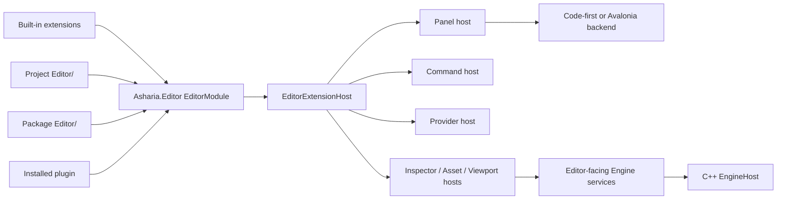

# Studio 统一扩展模型

状态：Target（当前 built-in host 为 Partial）

更新日期：2026-07-11

## 1. 决策

Studio 采用一个统一的 Editor Extension Framework：

- Studio 内置编辑器功能；
- 游戏项目根 `Editor/`；
- Package 的 `Editor/`；
- 用户安装并启用的 Plugin。

以上来源都实现 `Asharia.Editor.EditorModule`，都通过相同 contribution、服务、UI authoring 和生命周期接入。不得按照来源复制一套“内部 API”和一套“第三方 API”。

`ExtensionSourceKind` 只用于发现、诊断、启用策略、缓存位置和 reload policy。权限或能力要求必须显式声明，不能靠“BuiltIn”身份绕过公共 contract。

Shell、Dock、platform Window、EngineHost、renderer 和 native bridge 是宿主基础设施，不是扩展。它们可以使用内部实现 API，但不能被包装成拥有隐式特权的 built-in plugin。

## 2. 当前实现事实

当前已有：

- `IEditorExtensionModule.Declare()` 与 `ActivateAsync()`；
- `EditorExtensionHost` 的 ID/descriptor 校验、注册回滚和逆序 disposal；
- panel/action/provider typed registry；
- `PanelInstanceManager` 的 KeepAlive/RecreateOnOpen；
- panel attach/activate/deactivate/detach 和 frame callback v0；
- Code-first UI 的 node、state、event、validation 和 Avalonia adapter 垂直切片。

当前缺口：

- `WorkbenchFeatureModule` 仍聚合大多数 Feature；
- built-in Feature 尚未通过独立 `Asharia.Editor` assembly 编译约束；
- 项目 `Editor/`、`.asmdef`、Package discovery 和 build service 尚未实现；
- `PanelDescriptor.Func<object>` 仍是过渡 factory；
- Avalonia extension bridge、ALC load/unload 和 last-known-good reload 尚未实现；
- provider physical lifecycle、failure isolation 和 module leak diagnostics 不完整。

当前事实用于确定迁移顺序，不改变统一模型。

## 3. 上下文



三类对象必须分开：

1. Contribution：不可变、可验证的能力声明；
2. Runtime instance：Panel、provider、command executor、tool 的运行实例；
3. Physical resource：Window、native runtime、World、Vulkan device、GPU image、thread 和 process。

Extension host 拥有前两类的 scope/lease；物理资源由对应 Studio/Engine host 拥有。

## 4. 来源与能力

```csharp
public enum ExtensionSourceKind
{
    BuiltIn,
    Project,
    Package,
    Installed,
}
```

来源不改变 `EditorModuleBuilder` 或 `EditorModuleContext` 的类型。以下差异允许由 source policy 决定：

- 默认是否启用；
- source/cache/diagnostic 路径；
- 是否随 Studio、Project 或 Package 更新；
- managed reload、restart-required 或不可禁用；
- 用户是否需要确认 requested capabilities。

以下差异不允许由 source kind 隐式决定：

- 是否可以注册 Inspector、Command、Panel 或 Viewport Tool；
- 是否可以使用 Code-first 或 Avalonia/XAML；
- 是否可以绕过 Command/Transaction；
- 是否可以直接修改 Dock、创建 top-level Window 或持有 native resource。

Built-in Feature 如果需要公共 API 尚未提供的能力，应先扩展、版本化并测试公共 API；不能使用 internal service locator 开后门。

## 5. Source 与 scope 正交

`ExtensionSourceKind` 不决定 module lifetime。每个 `[EditorModule]` 显式声明：

```csharp
public enum EditorModuleScopeKind
{
    Application,
    Project,
}
```

- Application scope：每个 Studio process 一个 instance，不依赖隐式 current project；
- Project scope：每个 `ProjectSession` 一个 instance，在 Project/Engine close 前 quiesce/deactivate；
- 内置 Scene/Hierarchy/Inspector 是 BuiltIn source + Project scope；
- 全局 Package 管理器可以是 BuiltIn/Installed source + Application scope；
- Application catalog 中的 Package 可以包含不同 scope 的 module；仅由 Project graph 发现的 Package module 和项目根 `Editor/` 只允许 Project scope；

Scope 决定 context 可见服务、实例数量和关闭顺序。Source 只记录代码来自哪里。Panel/Document 自身的实例 scope 由 contribution host 管理，不等于 Module scope。

Load unit 的 owner 是 Package 级 `PackageGenerationHost`，不是某个 scope activation。它拥有 generation-wide definition；Application/Project activation、registry/factory、Panel/UI、task 和跨 Package dependency 都持有 generation lease；只有全部 lease 归零后才允许 retire。Managed-reload-eligible dynamic artifact 使用 `CollectiblePackageGenerationHost`；Tier-0/native/external-build 等 restart-required artifact 使用隔离、non-collectible `PinnedPackageGenerationHost`，Project close 后复用 exact generation；App 直接引用的 BuiltIn 使用 default ALC `StaticPackageGenerationHost`。因此 Application-catalog Package 同时包含两种 scope 时，Project close 只释放该 Project scope，不会卸载仍承载 Application module 的 generation。

## 6. Module 合同

目标合同：

```csharp
public abstract class EditorModule
{
    public abstract void Configure(EditorModuleBuilder editor);

    public virtual ValueTask<IEditorModuleActivation> ActivateAsync(
        EditorModuleContext context,
        CancellationToken cancellationToken) =>
        new(EditorModuleActivation.Empty);
}

public interface IEditorModuleActivation : IAsyncDisposable
{
    ValueTask<EditorModuleQuiesceResult> QuiesceAsync(
        EditorModuleStopReason reason,
        CancellationToken cancellationToken);

    ValueTask ResumeAsync(
        EditorModuleResumeContext context,
        CancellationToken cancellationToken);
}
```

`EditorModuleActivation.Empty` 是公共框架提供的幂等 no-op lease，保证只实现 `Configure()` 的 module 示例可以直接编译。

每个 `[EditorModule]` 必须声明稳定、命名空间化 `Id`；它形成 `ModuleLocalId`，而 CLR entry type 只记录在 module index：

```text
EditorModuleDefinitionId = (EditorAssemblyId, ModuleLocalId, ScopeKind)
EditorModuleInstanceId   = (EditorModuleDefinitionId, ScopeInstanceId)
```

Host 每个 Package generation 只创建一个 generation-wide definition object，并调用一次 `Configure()`。该 object 随后必须 immutable/thread-safe；不同 ProjectSession 可以并发调用同一 definition 的 `ActivateAsync()`。所有 per-scope mutable state、context、subscription、task 和 provider 必须进入对应 activation lease，descriptor/factory 只能捕获 immutable generation data。

状态机：

```text
Discovered
  -> Built
  -> Loaded
  -> Configuring
  -> Validated
  -> Staged
Staged -> Dormant
Staged -> WaitingForCapability
Staged -> Activating -> Active
Dormant -> Activating -> Active
WaitingForCapability -> Activating -> Active
Active -> Quiescing -> Deactivating -> Disposed
Active -> Blocked
Blocked -> Active | Activating | Deactivating
Dormant -> Disposed

Any transition -> Faulted -> rollback / last-known-good / disabled
```

`Configure()` 必须无副作用：不执行 IO、native call、event subscription、Control creation、provider connection 或 task start。它只产生 immutable descriptor 和 module-scoped service declaration。

`ActivateAsync()` 执行可能失败的副作用并返回 Host-owned activation lease。`QuiesceAsync()` 到达可切换安全点但不销毁 generation；commit 前失败或 capability recovery 时，`ResumeAsync(EditorModuleResumeContext, ...)` 显式接收 reason、ScopeInstanceId 与当前 capability Epoch snapshot；`DisposeAsync()` 才执行不可逆释放。Context 提供 capability-scoped editor services；模块不得从全局 static/service locator 获取 Application、Dock 或 EngineBridge implementation。

Module index 从 `[EditorModule]` 固定 `Activation = OnScopeReady | OnDemand` 与 handover policy；`OnDemand` 的 command/panel/inspector/asset/PlayMode/manual trigger 在 `Configure()` descriptor 中声明。Candidate descriptor 只存在于不可见 staging registry；generation commit 后，Dormant module descriptor 才可发现。Contribution host 在第一次 invocation/instance creation 前必须异步、并发去重地确保 owner module active。

Candidate staging 必须覆盖所有正在 lease 该 generation 的 scope instance：每个 active Application/Project scope 的 `OnScopeReady` `EditorModuleInstanceId`，以及旧 generation 中已经 Active 的 instance；后者即使原先由 lazy event 启动，也不能在 replacement 中悄悄退回 Dormant。尚未使用的 Dormant lazy instance 只完成 configure/validate，不为取得 LKG 身份而被强行激活。Commit 后第一次 lazy activation 失败只 fault/禁用该 module instance 及其 contribution，不回滚整个已经提交的 Package generation。

`Configure()` 还声明 required/optional module or capability edge 与 provided capability。Required edge 进入 activation/stop topology、failure closure 和 QTA propagation；optional edge 只供 context 查询。Project→Project 绑定同一 `ProjectSessionId`，Project→Application 允许，Application→Project 禁止；cross-Package edge 必须有 Package + assembly dependency。Engine-ready 等 Host capability 是带 Epoch 的显式 lifecycle graph node，不能靠 `ActivateAsync()` 内部隐式探测。

Provided capability descriptor 在 Configure 后可验证，但只有 owner activation Active 才发布 Ready；owner quiesce/fault/dispose 必须先撤销 availability，再处理 dependents。

已声明 capability 暂时 `Unavailable/Recovering` 不是 structural failure：module instance 进入 `WaitingForCapability`，descriptor 可以提交但由 Host 呈现 disabled/unavailable；Ready 后 single-flight activation。Extension 无权把普通 capability 声明为 hard Project-open gate。Capability lost 时 Active instance quiesce/Blocked，新 epoch Ready 后 Resume 或重建 activation；fault 只沿 required dependent chain 隔离。

## 7. 声明、验证与提交

每个 Module 使用隔离 builder：

1. Host 调用同一 Package generation 的全部 `Configure()` 收集 descriptor；
2. 校验 `EditorModuleDefinitionId`、contribution ID、owner、role、scope、backend、factory、dependency 和 compatibility；
3. 整个 Package generation 校验成功后才建立 staging registration；
4. 以所有受影响 `ScopeInstanceId` 的 `OnScopeReady` 与旧 generation 已 Active instance 形成 required graph；Dormant lazy instance 保持未激活，并按 handover dependency 分成 early/delayed set；
5. 对 dependency change，把该 Package 和所有直接/间接 dependent generation 组成一个 reload closure；
6. 按 dependencies-first 激活 early set，随后让旧 closure 按 dependents-first quiesce，再按 dependencies-first 激活 QTA 与 delayed dependent set；
7. required activation 得到有效 outcome（Active 或 soft-gate Waiting）后，才跨全部受影响 registry partition执行预校验的 registry/catalog closure commit；
8. commit 前任一 structural/configure/validation/真实 activation failure 都按 dependents-first 释放整个 candidate closure，并按 dependencies-first Resume 完整旧 graph，不让 partial Package/closure 可见。

Registry 记录：

```text
OwnerPackageName
OwnerAssemblyName
OwnerModuleDefinitionId
OwnerModuleInstanceId
OwnerPackageGenerationId
ScopeInstanceId
SourceKind
ContributionId
```

`EditorModuleDefinitionId` 是 definition identity；`EditorModuleInstanceId = (EditorModuleDefinitionId, ScopeInstanceId)`。Application scope 使用 process-stable application scope ID，Project scope 使用 `ProjectSessionId`。Registry 按 scope instance 分区：同一 module definition 在两个 ProjectSession 中可以贡献相同 logical ID，但 command/panel/provider resolution 必须携带目标 scope，不能依赖隐式 global current project。不同 owner definition 在同一可见 scope 中使用相同 contribution ID 仍然是冲突。

多个 ProjectSession 可以 lease 同一 exact Package generation，但每个 active catalog 都是 resolver 精确约束。任一 session 不能单独把共享 Package 更新到新 generation；Collectible generation 的普通更新必须等待其他 catalog lease 释放。Pinned generation 即使 scope/catalog lease 暂时归零也仍占用 process-resident generation/dependency closure，更新只能写 PendingRestart 并在 clean boot 生效。两者都不允许 side-by-side version 或隐式修改另一项目 lock。

所有注册返回 removal lease，由 `PackageGenerationHost` 计入 generation lifetime。普通模块只能释放自己的 scope；Host 才能完成 generation swap 或 dependency-ordered shutdown。

ID 冲突必须报告双方 owner、source path 和 version。不得使用 source precedence 静默覆盖 built-in 或第三方 contribution。

### 7.1 新 ProjectScope transaction

Application catalog 可以在无 Project 时提交 Project-scoped definition，但不能提前证明未来 Project scope。创建 `ProjectSessionId` 时，Host 必须执行独立、原子的 ProjectScope transaction：

1. 收集 BuiltIn、Application-catalog Installed、目标 Project catalog 与项目根 `Editor/` 的全部 committed Project-scoped descriptor；
2. 为目标 `ScopeInstanceId` 展开 `EditorModuleInstanceId`、factory/context 和 required module/capability graph；
3. 在不可见 partition 中验证 contribution ID、singleton role、scope edge、provider ambiguity、compatibility 和与可见 Application contribution 的冲突；
4. 请求 graph 要求的 Project/Engine capability；Ready 的 required chain 按 dependencies-first 激活，暂时 unavailable 的 instance 标记 `WaitingForCapability`，真实 activation fault 标记 Faulted 并阻塞其 required dependents；
5. structural validation 成功后一次发布完整 Project registry partition 及每个 descriptor 的 Active/Waiting/Faulted 状态。Structural failure 才丢弃整个 scope staging 并让 Project Degraded/Error；committed-catalog scope activation fault 不回滚 catalog/其他 Project，而是 error placeholder + module-instance isolation。

Project-catalog PendingRestart 的 clean-boot commit 与上述 ProjectScope transaction 是同一个可见性边界；不能先提交 Project lock，再逐 module 注册。

## 8. Contribution host

公共 contribution 至少包括：

```text
Panels and editor window content
Commands, menus, shortcuts and palette entries
Inspectors and property drawers
Asset editors, previews and importer frontends
Viewport tools, overlays and gizmos
Settings pages
Diagnostics and background tasks
Custom documents/editors
Providers
```

每种 contribution 分为 descriptor、factory/runtime instance 和 host。例如：

```text
PanelContributionDescriptor
  -> IPanelContentFactory
  -> PanelInstance
  -> PanelInstanceHost
```

`PanelDescriptor.Func<object>` 仅是当前迁移兼容形态，不是公共 ABI。

## 9. Panel 与 UI backend

Panel host 拥有 panel identity、Dock binding、lifecycle、state envelope 和 error placeholder。UI backend 只创建内容：

```text
Panel contribution
  -> Code-first content factory
     -> UI-neutral GuiNode tree
     -> Presentation reconciler

  -> Avalonia content factory
     -> extension Control/UserControl
     -> host-owned panel container
```

Code-first 扩展不能访问 Avalonia Control。使用 `Asharia.Editor.Avalonia` 的扩展可以创建 content Control 和 compiled XAML，但不能创建/管理 Studio top-level Window、修改 Dock tree 或注入全局 Application styles。

Panel factory 永远不返回“已经拥有生命周期的 Window”。需要独立或 floating Window 时，扩展贡献 window/panel descriptor 与 content factory，由 Window host 创建平台窗口并绑定相同 panel lifecycle。

Panel 生命周期：

```text
Created -> Attached -> Activated
Activated -> Deactivated
Deactivated -> Activated | Detached
Detached -> Attached | Disposed
Created | Attached | Deactivated -> Disposed
```

- `KeepAlive` close：Deactivate → Detach；同一 content lease 可再次 Attach/Activate，module reload/project shutdown 才 Dispose；
- `RecreateOnOpen` close：Deactivate → Detach → Dispose；
- Dock move/reorder/float 不等于 Detach/Dispose；
- callback exception 由 host 捕获并发布 diagnostics；
- frame callback 由统一 scheduler 驱动，不能由每个 Window 建 timer。

## 10. Command、事务与状态

Menu、shortcut、palette、toolbar、context menu 和 Code-first `CommandButton` 统一进入 `EditorCommandService`：

```text
Presentation intent
  -> CommandId + command context
  -> scope/enablement validation
  -> executor
  -> optional document transaction
  -> typed result + diagnostics
```

Scene、asset、project 或 Play Mode mutation 必须经过对应 command/use case。扩展不能把 UI event handler 当作数据写入入口。

状态按 owner 分类：

- 控件瞬时状态：UI backend；
- panel local state：Panel host 的 versioned state envelope；
- layout/window state：Dock/Window host；
- user preference：Editor preference service；
- project setting：Project setting service；
- document/asset state：document、transaction 和 Engine truth。

跨 reload 状态不得包含 extension object、delegate、Control、Assembly 或 native pointer。

## 11. Provider 和后台任务

Provider 数据合同只发布 immutable、revisioned snapshot。Start/stop/reconnect/health 和 task supervision 由 host 管理：

```text
Created -> Starting -> Ready <-> Degraded/Faulted -> Stopping -> Stopped -> Disposed
```

Singleton role（例如 active scene provider）只允许一个 active generation。Reload 必须先 quiesce 旧 provider，再切换新 generation。Faulted provider 可以保留最后 snapshot，但必须标记 stale 和 source generation。

Extension 创建的 thread、timer、watcher、process、subscription 和 async task 必须注册到 module scope。Host shutdown/reload 不依赖 GC 或 finalizer 清理。

## 12. Build、load 与 dependency graph

Project `Editor/`、`.asmdef`、Package 和构建缓存的 authoring 规则见 [Editor 扩展开发模型](editor-extension-authoring.md)。Host 内部流水线为：

```text
discover -> resolve graph -> fingerprint -> build -> stage load
         -> configure -> validate -> activate -> generation commit
```

默认 dynamic load/reload unit 是 Package generation，而不是单个 assembly。项目根 `Editor/` 视为 synthetic Package。Managed-reload-eligible Project/Package/Installed generation 使用 collectible ALC；已知 `restart-required` generation 从首次 load 就使用隔离、non-collectible pinned ALC，在 scope 关闭后保留 exact generation 供进程内重开，禁止反复创建注定不可卸载的 ALC。其更新只持久化 PendingRestart snapshot，下一次 clean boot 成功激活后才提交；失败/崩溃必须在新进程恢复 previous committed snapshot。BuiltIn assembly 由 App runtime reference 唯一加载到 default ALC。

依赖图必须无环。卸载顺序是 dependents-first，启动顺序是 dependencies-first。跨 extension CLR type reference 只能通过已声明 dependency 建立；不允许从任意目录探测 DLL 形成隐式依赖。

跨 Package request 由 Host assembly table 按完整 `EditorAssemblyId` 返回 dependency ALC 中已加载的精确 `Assembly` 实例，不能让 dependent ALC 再加载一份副本。Dependency generation 变化会重载全部直接/间接 dependents。具体算法见 [Editor 扩展构建、装载与重载](editor-extension-build-and-reload.md)。

`AssemblyLoadContext` 不是 security sandbox，collectible unload 也是 cooperative。只有 `CollectiblePackageGenerationHost` retire 路径要求 weak-reference/GC negative leak probe；失败时隔离整个 Package reload unit（以及需要同步 replacement 的 dependent closure），停止创建新 ALC 并要求重启，不能只禁用其中一个 Module。Pinned/Static host 只验证 scope/UI/lease terminal teardown，load context 预期驻留到进程退出。

## 13. Reload 与 last-known-good

Reload 是 Package generation replacement，不是在原对象上修改代码。没有 dependency generation 变化时，最小 commit/LKG unit 是一个 Package generation；dependency 变化时，commit unit 扩大为完整 dependent reload closure。Managed module 使用 `Coexist` 或可逆 `QuiesceThenActivate` handover；无法确定性 Resume 的 exclusive native/global side effect 必须 `restart-required`：

```text
new source
  -> build new artifact
  -> stage load/configure/validate
  -> activate early Coexist graph dependencies-first
  -> save neutral state
  -> quiesce old graph dependents-first
  -> activate QTA + delayed dependents dependencies-first
  -> commit registry generation
  -> dispose/unload old generation
```

`QuiesceThenActivate` 用于 singleton provider 等不能与旧实例并存的角色。它沿 required activation dependency graph 向 dependent 传播：任何依赖 QTA module 的 candidate 都进入 delayed set，即使自身可 Coexist。Commit 前失败时 Host 按 dependents-first dispose candidate，再按 dependencies-first Resume 完整旧 graph；candidate 不能引用旧 generation service/instance。

原子性覆盖 contribution registry 的 Package/closure generation 可见性，以及与依赖更新一起提交的 catalog snapshot；不宣称 arbitrary external side effect 自动事务化。不能实现 quiesce/resume、持有 exclusive native/global resource 或使用 Avalonia/XAML 默认路径的 module 使用 `restart-required`。

LKG 记录 Package generation 的 immutable artifact、dependency closure 与 catalog snapshot。它证明所有当时 active `ScopeInstanceId` 的 configure/validate、required candidate activation 和 registry commit 已成功，不证明未来 scope 或从未使用的 Dormant lazy module 一定能激活。第一次使用后的 lazy activation failure 按 module instance 隔离，不把 catalog 回滚到任意混合版本。

故障策略：

| 故障 | 行为 |
| --- | --- |
| 编译失败 | 继续运行 last-known-good，发布编译诊断 |
| Configure/validate 失败 | 不触碰旧 generation |
| required candidate activation 失败 | 清理整个 candidate Package/reload closure，旧 generation 未被触碰 |
| quiesce/commit 前失败 | `ResumeAsync()` 旧 activation，释放 candidate |
| rollback `ResumeAsync()` 失败 | registry/active pointer 保持旧值，但 session 进入 Degraded + restart-required；不得声称 rollback 成功 |
| PendingRestart clean-boot activation/crash | 标记 failed attempt，立即退出；下一进程加载完整 previous committed snapshot，不在污染进程 fallback |
| commit 后首次 lazy activation 失败 | fault/禁用该 owner module 及其 contribution；保留已提交 Package generation |
| Panel restore 失败 | 显示该 panel 的 error placeholder，其他 contribution 保持可用 |
| 旧 ALC 无法卸载 | 标记 restart-required，停止后续 reload 以避免泄漏 |
| dependency reload 失败 | 恢复完整旧 closure；不得提交或恢复成新旧混合 graph |

Native library、native thread 或 runtime module 变化默认 `restart-required`。若 EngineHost 最终支持独立 runtime restart，可以只重启 Engine runtime，不要求关闭 Studio；这不等于 managed ALC hot reload。

Avalonia/XAML module 默认 `restart-required`。只有 Avalonia backend 能清理旧 Control、style/resource、全局 property/type registration，并使用 generation-aware resource resolution 通过 negative unload test 后，才可以在明确 compatibility band 中开放 managed reload。

## 14. Native integration

C++ Engine 拥有 Runtime/World/Renderer truth。Editor extension 通过 `Asharia.Editor` 中的稳定 service、ID、snapshot 和 command contract访问能力：

```text
Editor tool intent
  -> public Editor service
  -> Studio Application port
  -> EngineBridge
  -> C++ Engine/runtime
```

扩展不能直接销毁 Vulkan device、native thread、World 或 Engine process，也不能持有 native pointer 跨帧/跨 reload。

Hybrid Package 可以同时包含 Runtime C++ Module 和 Editor C# Module。两者共享 Package identity 和 schema/type ID，但分别遵守 native ABI 与 managed Editor API 的版本合同。

## 15. Trust

所有进程内 extension 都是受信任代码。来源相同不代表部署信任相同；项目或用户仍可以禁用 Package、固定版本并审查 requested capabilities。

Capability declaration 当前用于：

- 安装/启用提示；
- 诊断和审计；
- 服务最小化；
- 未来决定哪些扩展必须进入 out-of-process host。

它不能阻止 managed code 直接调用 `System.IO`、network 或 process API。真正不可信代码需要 OS process/container boundary。

## 16. 故障隔离

| 故障 | 框架行为 |
| --- | --- |
| Module index/assembly 结构无效 | 拒绝整个 candidate Package/reload closure，报告 artifact/source，旧 closure 不变 |
| pre-commit `Configure()` 抛错 | 拒绝整个 candidate Package/reload closure，不提交任何 candidate contribution |
| Descriptor 冲突 | 报告双方 owner/ID，拒绝 staging commit |
| required candidate `ActivateAsync()` 抛错 | 拒绝整个 Package/reload closure commit，逆序释放新 scope，恢复完整 LKG closure |
| PendingRestart candidate callback 抛错/crash | 持久化 attempt diagnostic 并退出；防循环 relaunch previous committed snapshot |
| commit 后 lazy `ActivateAsync()` 抛错 | fault/禁用该 module instance 及 owner contribution；其他 instance 与 Package generation 继续运行 |
| 新 ProjectScope descriptor expansion/structural conflict 失败 | 丢弃整个目标 scope partition，Project Degraded/Error；Application catalog 与其他 ProjectSession 不回滚 |
| committed catalog 的 future Project `OnScopeReady` activation 失败 | 发布完整 partition但将 owner instance/dependent chain 标为 Faulted/Blocked并显示 error placeholder，不回滚 catalog |
| required Host capability 暂时 unavailable/device lost | instance Waiting/Blocked；descriptor disabled；Ready/new epoch 后 single-flight Activate/Resume |
| Panel factory 抛错/null | error placeholder；其他 panel 继续恢复 |
| Panel callback 抛错 | 隔离 panel，停止其 frame callback，发布 diagnostics |
| Provider fault | health 进入 Faulted，最后 snapshot 标记 stale |
| Dispose 抛错 | 聚合报告并继续 Host finally cleanup；module 标记 reload unsafe，NativeSafeBarrier 未满足则 Project Quarantined |
| Collectible ALC leak | 隔离整个 Package reload unit，输出已知 Host lease/root、generation telemetry 与 dump/SOS 分析指引 |

## 17. 验证

必须验证：

- built-in/project/Package/installed source 使用相同 module contract；
- Application/Project scope 实例数、service visibility 和关闭顺序不由 SourceKind 推导；
- `EditorModuleDefinitionId` 与 `EditorModuleInstanceId` runtime identity 分离，多 Project registry/command/panel/provider resolution 不串 scope；
- on-demand activation 在第一次 contribution invocation 前并发去重且恰好完成一次，commit 后失败只隔离 owner module/contribution；
- built-in extension assembly 不引用 Studio internal host implementation；
- duplicate ID/role 在 generation 可见前失败；
- partial registration 不可见；
- dependency start/stop、activation 和 disposal 顺序；
- Code-first/Avalonia panel 共享相同 lifecycle；
- Window/Dock/native ownership 不能被扩展取得；
- KeepAlive/RecreateOnOpen 和 move/float 语义；
- KeepAlive Detach 后可重挂载，reload/Project close 执行 terminal Dispose；
- Package candidate、Dormant lazy activation 与 dependency closure 各自的 failure/LKG 行为；
- mixed Application/Project scope Package 的 generation lease 与 ALC 释放条件；
- restart-required PendingRestart clean-boot commit/failed-attempt relaunch，不在污染进程混载 LKG；
- generation replacement 跨 Application 与全部 active ProjectSession registry partition 原子提交；
- 新 ProjectScope 合并 BuiltIn/Application/Project/root descriptors 后原子发布；structural failure 无 partial partition，runtime fault 以状态隔离；
- generation definition 只 Configure 一次且 immutable，多 scope activation state 只存在 per-instance lease；
- required/optional module-capability graph 的 scope、cycle、provider 与 Engine startup ordering；
- BuiltIn default-ALC static generation 不重复加载、不执行 collectible unload；
- reload closure、state migration 和 negative ALC leak；
- Windows/Linux/macOS 上一致的 discovery、build 和 compatibility validation。

相关文档：

- [Editor 扩展开发模型](editor-extension-authoring.md)
- [Editor 扩展构建、装载与重载](editor-extension-build-and-reload.md)
- [Avalonia/XAML Editor 扩展规范](editor-extension-avalonia.md)
- [Studio 代码框架设计](studio-code-framework.md)
- [Studio 生命周期](studio-lifecycle.md)
- [Viewport 渲染架构](viewport-rendering.md)
- [Code-first UI 设计](../Code-first%20UI%E8%AE%BE%E8%AE%A1.md)
- [ADR-0005：managed Editor module 构建与重载](../adr/0005-managed-editor-module-build-and-reload.md)
