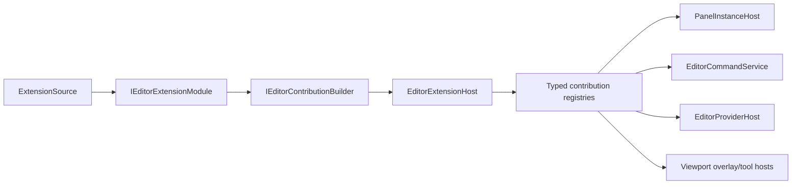

# Studio 扩展模型

状态：Target（当前 host 为 Partial）

更新日期：2026-07-11

## 1. 目的

本文定义内置 Feature、未来 project extension、packaged plugin、provider 和 native integration 如何接入 Studio，同时保持 contribution、runtime instance 和 physical resource ownership 分离。

## 2. 当前实现事实

当前已有：

- `IEditorExtensionModule.Declare()` 与 `ActivateAsync()`；
- `EditorExtensionHost` 的 ID/descriptor 校验、注册回滚和逆序 disposal；
- panel/action/provider typed registry；
- `PanelInstanceManager` 的 KeepAlive/RecreateOnOpen；
- panel attach/activate/deactivate/detach 和 frame callback v0。

当前缺口：

- `WorkbenchFeatureModule` 聚合大多数 Feature；
- `PanelDescriptor.Func<object>` 是不安全的长期 factory 合同；
- factory/null/callback failure 隔离不完整；
- provider physical lifecycle 与 snapshot contract 未完全落地；
- plugin load/unload、ALC 和 external contribution 尚未实现；
- Window、command scope 和 floating host 行为仍有 Shell 耦合。

## 3. 模型分层



Contribution 是不可变声明；panel/provider/command invocation 是运行实例；native runtime/device 是 physical resource。三者不能由同一个对象隐式拥有。

## 4. Module 生命周期

```text
Created
  -> Declaring
  -> Validated
  -> Registered
  -> Activating
  -> Active
  -> Deactivating
  -> Disposed

Any transition -> Faulted -> rollback/disable
```

`Declare()` 必须是无副作用阶段：不执行 IO、native call、event subscription、Control creation 或 provider connection。

`ActivateAsync()` 在 contribution 原子注册后启动 side effect，并返回由 host 拥有的 async lease。

## 5. 原子 contribution

注册流程：

1. 每个 module 向隔离 builder 声明 immutable descriptors。
2. Host 收集完整集合。
3. 校验 stable ID、owner、role、scope、shortcut、factory reference 和依赖。
4. 所有校验成功后提交 typed registries。
5. 逐个异步 activation。
6. 任一 activation 失败时逆序释放已启动 lease，并移除该 module contribution。

Registry 记录 `OwnerExtensionId`，注册返回 removal lease。普通 Feature 不直接删除其他 owner 的 contribution。

## 6. Feature modules

目标内置模块至少拆分为：

```text
SceneViewFeatureModule
GameViewFeatureModule
HierarchyFeatureModule
InspectorFeatureModule
FrameDebuggerFeatureModule
ConsoleFeatureModule
ProblemsFeatureModule
BuiltInEngineIntegrationModule
```

Feature module 可以声明：

- panel；
- command/action/menu/palette metadata；
- provider role；
- viewport overlay/tool；
- settings page；
- diagnostics source。

Feature 不创建顶层 Window、不修改 Dock tree、不调用 P/Invoke、不持有 EngineHost。

## 7. Panel 合同

`PanelDescriptor.Func<object>` 仅是迁移兼容形态。目标分为：

```text
PanelContributionDescriptor
  Id, title, kind, default area, cache policy, command metadata

IPanelFactory
  CreateAsync(PanelCreationContext, CancellationToken)
  -> PanelInstance

PanelInstance
  ViewModel/content lifetime
  lifecycle/frame/input capabilities

Presentation DataTemplate
  PanelInstance/ViewModel -> Avalonia View
```

Panel factory 不返回 `Window`，未来外部 plugin 不返回 arbitrary raw `Control`。Avalonia View mapping 由 Presentation 层拥有。

Factory 失败时显示可诊断 error placeholder 或禁用 contribution，不中止完整 workspace restore。

## 8. Panel 生命周期

```text
Created -> Attached -> Activated <-> Deactivated -> Detached -> Disposed
```

- `KeepAlive` close：Deactivate→Detach，extension/project shutdown 才 Dispose。
- `RecreateOnOpen` close：Deactivate→Detach→Dispose。
- move/reorder/float 不触发 Detach/Dispose。
- callback exception 由 panel host 捕获并发布 diagnostics。
- frame sink 由统一 scheduler 注册，Window timer 不直接调用 panel 内容。

## 9. Command contribution

Presentation metadata 与 execution contract 分离：

```text
CommandContribution
  CommandId, executor reference, scope, enablement

WorkbenchActionContribution
  title, menu, shortcut, palette metadata -> CommandId
```

Menu、shortcut、palette、toolbar 和 context menu 统一进入 `EditorCommandService`。Floating Window 与 Main Window 使用相同的 application command routing，只由 focus/scope 决定 target。

Scene mutation command 必须进入 SceneDocument transaction；普通 UI command 不应伪装成 transaction。

## 10. Provider contribution

Snapshot interface 只描述数据：

```text
GetCurrentSnapshot()
SnapshotChanged(revision)
```

Start/stop/reconnect/health 属于 `EditorProviderHost`：

```text
Created -> Starting -> Ready <-> Degraded/Faulted -> Stopping -> Stopped -> Disposed
```

Singleton role（例如 `scene.active`）只允许一个 active provider。Snapshot、index 和 revision 原子发布。Provider failure 不把 health API塞进每种 snapshot interface。

## 11. Native integration

Native bridge 通过 `BuiltInEngineIntegrationModule` 向 Application 提供 Engine/World/Viewport ports，但 native physical owner 是 `EngineHost`，不是 extension host。

Extension host 可以拥有 managed adapter/provider lease，不能直接销毁 Vulkan device、native thread 或 engine process。

## 12. External plugin gate

Packaged plugin 和 ALC hot reload 在满足以下条件前保持 Deferred：

- contribution owner 和 rollback 可观测；
- panel/provider/task 全部可追踪释放；
- ALC unload 有 negative leak smoke；
- plugin ABI/API version negotiation；
- permission/capability boundary；
- reload failure 保留 previous valid state 或明确 disable；
- plugin 无法返回 raw Window/Control/native pointer。

## 13. 故障隔离

| 故障 | 框架行为 |
| --- | --- |
| Declare 抛错 | 不提交该 module 的任何 contribution |
| Descriptor 冲突 | 报告双方 owner/ID，拒绝原子提交 |
| Activate 抛错 | 逆序释放 lease，移除该 module contribution |
| Panel factory 抛错/null | error placeholder/disable；其他 panel 继续恢复 |
| Panel callback 抛错 | 隔离 panel，停止其 frame callback，发布 diagnostics |
| Provider fault | health 进入 Faulted，保留最后 snapshot/stale 标记 |
| Dispose 抛错 | 聚合报告，继续释放其他 owner |

## 14. 验证

必须验证：

- duplicate ID/role 在 commit 前失败；
- partial registration 不可见；
- activation 和 disposal 逆序；
- factory/callback/provider fault isolation；
- KeepAlive/RecreateOnOpen；
- move/float 不错误 detach；
- module disable 移除其 command/panel/provider；
- command scope 在 Main/Floating Window 一致；
- future ALC unload 无 panel/task/event/native lease 残留。

相关文档：

- [Studio 架构总览](studio-overview.md)
- [Studio 生命周期](studio-lifecycle.md)
- [Viewport 渲染架构](viewport-rendering.md)
