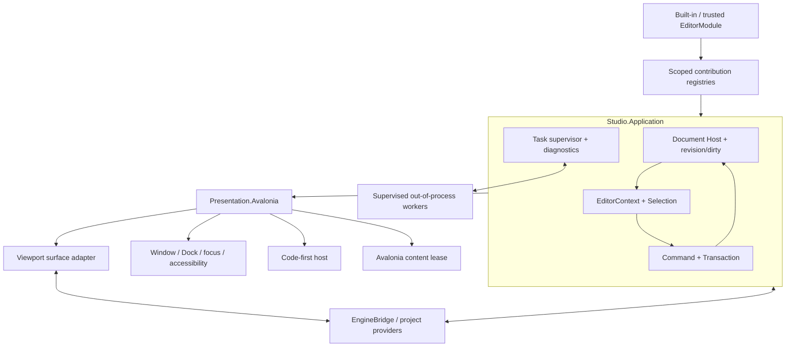

# Studio 前端框架

状态：Historical design evidence；current implementation facts见
[Studio 前端硬切架构 4.40](studio-frontend-hard-cut.md#440-r2r3-dirty-transitiondiagnostic-ingress-与-action-vertical-slice-cardcurrent)

> 本文保留 2026-07-31 代码审查证据和早期前端合同，不能再作为 production 迁移目标。
> 当前权威目标是 [Studio 前端硬切架构](studio-frontend-hard-cut.md)：Document-first、单一 Avalonia
> 路径、无 compatibility/Code-first/dynamic extension 前置。
> 其中描述的ProjectOpenSession parser/source、public snapshots与project-launch presentation也已在R0因
> production reachability为0删除；以下相关段落只保存历史设计。
> 2026-08-12，#377/#378/#379在真实ProjectSession、selection、Dock与viewport consumer上重建了窄
> Application Action/dirty transition/diagnostic ingress合同；这不恢复旧Workbench/public SDK或兼容路径。
> 2026-08-13，#381在当前production Dock中增加一个Diagnostics tool panel；#383随后让内部Console/Problems以
> 两条stream-specific subscriptions投影同一App-owned bounded hub，不恢复动态Feature/extension注册路径。

更新日期：2026-08-13

跟踪：GitHub Epic #119；设计 Slice #337；首个实现 Slice #338；当前 slices #377/#378/#379/#381

## 1. 目的

本文定义 Studio 前端的框架合同：Feature 如何声明 panel、action 和 tool，Host 如何组合 Dock、菜单、快捷键与内容生命周期，Code-first 和 Avalonia content 如何共存，以及 UI intent 如何安全地进入 command/transaction。

本文不定义具体视觉布局；默认工作台、状态呈现和用户任务路径见
[Studio 生产工作台体验规范](studio-workbench-experience.md)。

设计目标：

- 简单：先稳定已经有真实 consumer 的窄合同，不一次性造完整 UI toolkit；
- 可靠：稳定 identity、显式 context、显式 lifecycle、typed result 和 revisioned snapshot；
- 可扩展：built-in、项目 `Editor/` 和 Package 使用同一个 Editor Framework；
- 可测试：Application 合同无 Avalonia，ViewModel/authoring tree 可 headless 验证；
- 可替换 presentation：公共 Editor API 不依赖 Avalonia、Dock、Window、filesystem implementation 或 native handle。
- 单一控件运行时：XAML 与直接代码创建的是同一类 Avalonia object graph，不把 authoring syntax 误建模为不同 backend；
- 不造第二套 toolkit：Code-first 只覆盖稳定的标准工具 schema，不追求 Avalonia 控件、布局、样式或 binding 能力对等。

## 2. 不变量

1. `Asharia.Editor` 只表达 UI-neutral ID、snapshot、command、transaction、selection、panel/action/tool contribution 和 Code-first authoring。
2. Avalonia 是 Studio 当前 presentation backend，不是 Engine truth 或 public Application dependency。
3. Feature 声明内容和行为；Host 拥有 Window、Dock、focus、shortcut arbitration、theme、DPI、accessibility 和 content lifecycle。
4. View/ViewModel 不持有可变 Engine object、native pointer、Vulkan handle 或文件系统 owner。
5. scene、asset、project 和 setting mutation 必须走 command/transaction/dirty/validation。
6. panel local state、layout state、session state 和 document state 分开存储。
7. Action 在一个 registry 中定义，Menu、Toolbar、Command Palette、Context Menu 和 Shortcut 只是投影。
8. 未实现或当前上下文不可执行的操作不伪装成功；返回 typed result 并给出可理解原因。
9. UI 更新由 snapshot revision、event 或显式 frame request 驱动，不每帧重建整个工作台。
10. 同一功能只存在一条 production 路径；迁移 adapter 必须可删除，不能成为第二套框架。
11. XAML 与 code-only Avalonia 共用同一个 content backend、控件生命周期、样式和 binding 规则；二者只是 authoring syntax。
12. Code-first 是受限、UI-neutral 的标准工具 schema；它不是 Avalonia code-only UI 的别名，也不能成为通用控件抽象层。

## 3. 成熟引擎案例结论

### 3.1 证据等级

- O3DE、Godot 与 Avalonia 的公开源码和官方文档用于核对真实 ownership、registration 与控件运行时；
- Unreal 的源码在 EULA 下可访问，但不是 OSI 开源；本文只采用其公开文档/API 所能证明的边界，不复制实现；
- Unity 同样只作为公开 retained editor UI 文档证据，不把其产品名、类型名或内部实现带入公共 API；
- Bevy 只用于核对 plugin、reflection、scene 与 task 等底层原语；截至当前官方仍把 editor-ready UI
  作为建设目标，不能把它当作成熟 Editor Shell、Document、Undo 或 Dock 合同的依据；
- 外部案例先证明问题和边界，不能仅凭“成熟引擎也有”就新增 registry、DSL 或 abstraction。

### 3.2 主参考：模块化 retained editor UI

Unreal Editor 的公开文档和 API 展现出一组对 Studio 有直接价值的边界：

- Slate 使用代码中的声明式组合并维护 widget tree；它证明代码 authoring 与 retained UI 可以共存，
  但不证明 Studio 已有或必须复制 virtual-tree reconcile；
- `FUICommandList` 把 execute、can-execute、checked state 和输入绑定从具体按钮分离；
- `FTabManager`/tab spawner 使用稳定 tab identity 恢复布局和按需创建内容；
- `FDocumentTracker` 与 Asset Editor API 把 document identity、document view/tab 和 editor instance 分开；
- `IDetailsView` 与 `IPropertyHandle` 把 selection 展示、property access、transaction 和 change notification 从具体控件分离；
- `FScopedTransaction` 把一次用户意图包装成可撤销单元，而不是让按钮或字段自己维护历史；
- `USelection` 把选择作为编辑器服务，不把选中状态埋在某个 Outliner row；
- Interactive Tools Framework 把 input router、tool manager、gizmo manager、context store 以及 Accept/Cancel/Complete 生命周期放进独立 tool context。
- Play/Simulate 使用与编辑状态有明确边界的运行会话，支持 Studio 保持 Edit/Preview/Play world identity 分离。

采用：

- Code-first tree recording + retained Avalonia controls；当前实现为 subtree replacement，不误称已有 reconcile；
- action definition 与 surface placement 分离；
- panel descriptor + Host-owned spawn/restore；
- document host 与 tab/view 分离；
- property handle 作为后续可写 Inspector 的窄腰；
- mode 与 lightweight interactive tool 分离；
- document-scoped transaction 与 Edit/Preview/Play session 分离。

不采用：

- 复制 Slate macro、UObject reflection、全局 singleton 或具体模块结构；
- 把大型通用 Property Editor 作为 Scene Authoring 的前置条件；
- 把外部引擎类型名写进 Asharia public API。

### 3.3 同一控件运行时的多种 authoring

Unity UI Toolkit 允许 UXML、UI Builder 和 C# 创建同一 `VisualElement` tree；Avalonia 官方也明确说明 XAML
与 code-only UI 生成相同 runtime object graph，二者可混用，code-only binding 也可以编译检查。

采用：

- XAML 和直接代码都归入 Avalonia content backend，不建立 `XamlBackend` 与 `CodeOnlyBackend`；
- compiled XAML + ViewModel 是复杂长期 panel 的默认 authoring；
- algorithmic composition、专用绘制或不适合 markup 的局部视图可以直接代码创建 Avalonia control；
- 两种写法共享相同 `UserControl`/`TemplatedControl`/custom-drawn control 选择、Host lifecycle、主题和测试门禁。

不采用：

- 为了“统一语法”把 XAML 编译成自有 `GuiNode`，或把直接代码限制为自有 builder；
- 让 Code-first schema 追赶 DataTemplate、binding、virtualization、style selector、animation 或 accessibility API；
- 因为两个 authoring syntax 最终产生相同 object graph，就允许 extension 接管 Window、Dock 或全局 resource。

### 3.4 交叉参考：Action、插件与 Inspector

O3DE Action Manager 明确区分 action、context、context mode、menu/toolbar placement、hotkey 和 event-driven updater。其 toolbar 默认在 mode 内保持位置稳定，避免 selection 变化导致按钮抖动；menu 可以按上下文隐藏无关 action。

Godot EditorPlugin/EditorDock 展示了稳定 dock key、默认位置、布局恢复、bottom panel 和插件 teardown 的价值；Inspector 与 Scene/FileSystem selection 协同，property edit 有 revert/default 概念，EditorUndoRedoManager 按 scene/resource context 选择 history。

Blender Operator 模型把 stable operator id、`poll(context)`、invoke/execute、modal、cancel、report 和 undo metadata 集中起来；Panel 只引用 operator，不直接实现业务。其 selection 指南还区分 scene selection 与纯 UI selection 的 undo 语义。

O3DE 的 Editor/Runtime target 分离、Action Manager 与 viewport/tool 边界证明了构建期和运行期 owner 分离的价值。
AtomTools 的 DocumentSystem 是专用工具框架的文档先例，不代表整个 O3DE Editor 已有一个统一全局 Document 合同。

采用：

- action context、mode、enabled/checked/visibility 分离；
- toolbar 不因普通 selection 变化频繁增删项目；
- dock restore key 与显示标题分离；
- document/scene scoped undo history；
- interactive command 的 begin/update/commit/cancel；
- UI 只引用 command id，不直接调用 feature mutation method。

调整：

- Godot 插件可以直接提交/释放 `Control`；Studio 改为 Host-owned content lease，避免 Dock、popup、timer 和 generation cleanup 泄漏。
- O3DE 的 Document Property Editor 是有价值的 document-to-widget 案例，但当前仍不证明 Asharia 需要通用 UI document 格式；Code-first node tree 只服务小型工具，不扩成序列化 UI DSL。
- Blender 的全局 operator registry 在 Studio 中按 module/scope partition，Project close 或 generation retire 可精确撤销。
- 不复制 Unity 的全局静态 Selection，也不把 Blender workspace state 写入 project/scene 内容。
- 不把 Bevy 的底层 ECS/reflection/task primitives 描述为完整编辑器架构。

## 4. 总体结构

架构决策：Studio 采用**合同优先的模块化单体 + 选择性进程外 worker**。

- Shell、Document Host、Command/Transaction、Selection、Dock 与可信 UI extension 保持在一个 Avalonia
  进程中，以保留 focus、input、GPU surface 和调试的一致语义；
- `Asharia.Editor` 与 `Asharia.Studio.Application` 定义 UI-neutral 合同和状态机，
  `EngineBridge` 只做运行时/原生合同转换，Presentation 只做 Avalonia 投影；
- 资产导入、shader/外部工具调用、不可信脚本和高崩溃风险集成才进入受监督的进程外 worker；
- 不引入微前端、全局消息总线、Service Locator 或仅为替换手工 composition root 的 DI framework。
  当前变化点需要的是窄 owner 和可测试合同，不是更多运行时发现层。

模块/进程边界：



依赖只向内指向合同：Feature 可以依赖 Application snapshot/command contract；Presentation adapter
可以依赖 Avalonia；Application、public Editor API 和 EngineBridge 不能反向依赖 Shell View、Control、
Dock layout 或 Windows handle。Viewport 的 native surface 与 OS handle 留在 Presentation/platform adapter，
render session、picking、preview world 和 GPU lifetime 留在 Engine owner。

读取路径：

```text
Engine or project owner
  -> immutable revisioned snapshot
  -> Application projection/service
  -> Feature ViewModel or Code-first panel
  -> presentation backend
  -> Avalonia control tree
```

写入路径：

```text
pointer / keyboard / field intent
  -> focused action or interactive tool context
  -> command + expected revision
  -> transaction
  -> Application/Engine mutation
  -> typed result + new snapshot revision
  -> affected UI invalidation
```

UI 不直接“同步写模型再等待系统追认”。新 revision 是 mutation 成功的事实。

## 5. 当前事实与目标迁移

### 5.1 当前已有

- production `App -> StudioProcessSession -> StudioCompositionSession -> StudioShellViewModel -> ProjectSession`
  提供真实SceneDocument、selection、Inspector、Dock/viewport及process teardown；
- `ProjectDocumentTransitionCoordinator`统一guard create/open/close/application exit；dirty时使用Save/Discard/Cancel，
  save失败不继续transition；prompt后同一document的content identity变化会重新决策，session/project/scene scope变化则以typed `Stale` fail closed；
- diagnostics/log由唯一App-owned bounded hub拥有；Avalonia、Project/Shell operation failure与viewport required-edge
  rejection均写入同一truth；#381/#383的Diagnostics panel以一个instance、两条stream-specific subscriptions派生Console与Problems两个
  bounded projection；持久日志仍未实现；
- `Asharia.Studio.Application.Actions`为当前15个真实Shell action拥有definition、placement、shortcut、冻结context、
  state query与typed execute；File/Edit/Scene/Window菜单、现有命令按钮、Hierarchy context menu和main/floating shortcut共享该路由；
- legacy Workbench、Code-first、Feature、dynamic extension/provider registry与task framework仍保持删除；当前Dock、
  Project/Document/Scene/Viewport/selection/transaction是后续真实consumer Slice的重建实现，不是旧API兼容恢复；
- 最后public Extensions/Contributions/Panel declaration SCC、空`Asharia.Editor` project/test/solution edge与
  distribution identity/deps/image合同也已删除，不存在public extension SDK或空DLL；
- 独立C++ editor/runtime与managed EngineBridge tests是各自边界证据，不是Studio composition capability。

### 5.2 迁移目标

```text
legacy PanelDescriptor(Func<object>)
  -> public EditorPanelDescriptor + backend factory handle

legacy WorkbenchActionDescriptor
  -> public EditorActionDescriptor + surface placements

built-in-only XAML View creation
  -> Host-owned Avalonia content backend/lease

panel-specific direct mutation
  -> public command / property handle / interactive tool contract
```

迁移期间只允许 adapter 单向把 public descriptor 投影到 legacy Shell；禁止把 `Func<object>`、Avalonia `Control` 或 Shell service 反向加入 public Editor API。

### 5.3 2026-07-31 实现审查与收敛门禁

当前实现已经证明 package split、compiled binding、显式 composition root、stable panel id、列表虚拟化和
retained composition viewport 的方向可行；以下问题在关闭前，前端仍不能标记为成熟基线：

| 优先级 | 当前事实 | 违反的目标合同 | 关闭门禁 |
| --- | --- | --- | --- |
| P1 | Transaction 在 `Undo`/`Redo`/`Rollback` 完成前先移除 history/active entry，command 抛错会留下部分 mutation | transaction 原子性与可恢复 history | 为 apply/revert 记录进度，失败时补偿；补偿失败进入显式 document fault；覆盖中间 command 抛错测试 |
| P1 | composition/startup/shutdown 在 UI thread 用 `GetAwaiter().GetResult()` 同步等待 async extension | UI thread 不阻塞；lifecycle 可取消、可观察 | 建立 async session start/stop 状态机；close 先请求 stop，完成后再关闭；native shutdown 放在可靠 `finally` barrier |
| P1 | panel frame callback 没有逐 extension 隔离，单个 panel 抛错会短路同一帧其余 panel | extension fault domain 与 cleanup continuation | 每个 callback 独立捕获、诊断、退避/停用并继续健康 panel；加入 throwing + healthy panel 测试 |
| P1 | 默认 layout 中任一 panel factory/attach/show 失败会使 DockWorkspace 构造重抛并终止 Studio startup | contribution fault 不应摧毁整个 Shell | factory 返回 typed result；Host 保留 placement 并显示 error placeholder，支持 retry/disable；隔离 owner/dependent chain |
| P1 | Scene View attach/probe 存在 fire-and-forget Task，前序 detach fault 可成为未观察异常 | viewport operation 必须有 generation、owner 与 terminal observation | 交给 session task supervisor；整个 pipeline 使用 `try/catch/finally`、generation/cancellation，并在 detach/shutdown await |
| P1 | project create/open/restore 从 UI event/startup 同步调用 native descriptor/filesystem gateway | UI thread 只提交 intent 和投影 snapshot | 提供可取消 `Start/Open/Create/RestoreAsync`，task center 显示进度；用 operation generation 保证 latest-request-wins |
| P2 | window title 消费 `IProjectSessionService`，Project panel 仍硬编码 `No active project` | 同一概念只有一份 truth | Project panel 消费相同 immutable project snapshot；asset catalog 未实现时只显示明确的 unavailable/empty capability |
| P2 | Dock tab 和 Hierarchy 展开主要依赖 pointer/double-tap，缺少 Tab/TreeItem keyboard 与 automation 语义 | Host 拥有 keyboard、focus 与 accessibility | 实现标准键盘路由、focus-visible、AutomationProperties/peer，并用 Avalonia Headless 验证 |
| P2 | public event 由 caller thread 直接 multicast，subscriber 抛错会阻止后续 subscriber；部分 Presenter 未统一 marshal | event 只是 invalidation；subscriber/fault/thread owner 显式 | Host-owned per-subscriber 隔离；consumer 收到通知后重读 latest snapshot；Presenter 统一 dispatcher/coalescing |
| P2 | Hierarchy 的 `SelectedRow = null` 不清理共享 selection，UI 可无高亮而 Inspector 仍显示旧对象 | view selection 与 content selection 必须一致或明确隐藏 | 区分用户清空和 filter 隐藏；用户清空发布 empty selection，隐藏 selection 保留并给出 reveal state |
| P2 | KeepAlive panel attach 失败后可能保留已污染的 cached content | attach 失败必须原子回滚并释放 generation lease | factory/attach 失败时按 instance identity 驱逐并 dispose，不受 cache policy 影响；覆盖 KeepAlive retry |
| P2 | Dock layout 直接覆盖写、失败静默，且与 recent-project 使用不同 settings root | user settings 原子、版本化、可诊断 | 统一 Settings owner；temp + flush + replace；schema/migration/quarantine；shutdown 保存失败可见 |
| P3 | Code-first full-subtree replacement、无界 terminal task retention、反射 path binding 和 UI headless coverage 不足 | 性能/可测试性债务不能伪装成已完成能力 | 冻结 DSL；先补 task retention、typed binding 与 Headless 测试；只有 profile 和第二 consumer 证明后再做 keyed reconcile |

上述 P1/P2 是当前 correction slices，不授权同时扩建新 framework。每个 Slice 必须先在真实 owner 边界建立
负向测试，再修复最小闭环；相关 lifecycle 目标细节见
[Studio 生命周期](studio-lifecycle.md)，Document/World 目标见
[Editor Worlds 与 Play Mode](editor-worlds-and-play-mode.md)。

## 6. Contribution registry

### 6.1 只保留必要 registry

当前/近期只需要：

| Registry | Identity | 内容 | 当前状态 |
| --- | --- | --- | --- |
| Panel | internal stable panel id | kind、dock preference、runtime/view factory | Current internal Shell/Dock consumer；public contribution Deferred |
| Action | `StudioActionId` | definition、placement、shortcut、context、state query、execute route | Current internal Application/Shell vertical slice；legacy/public SDK仍删除 |
| UI Backend | future typed backend id | generation-scoped factory resolver | Deferred；Code-first已删除 |
| Diagnostic source | App-owned source/operation id | bounded immutable records | Current；不是contribution registry |

等有真实 consumer 后再增加：

| Registry | 进入条件 |
| --- | --- |
| Interactive Tool | Scene View 出现第二个可切换 input tool，且具备 accept/cancel transaction |
| Property customization | Transform property handle 完成，并出现第二种 property type/custom renderer |
| Status contribution | 至少两个 extension 需要向全局 Status Bar 提供持续状态 |

不建立通用 Window registry。需要浮动窗口的内容仍声明 panel/window-like contribution，由 Host 决定真实 `Window`。

### 6.2 Registration 顺序

一个 module generation 的注册过程固定为：

```text
declare
-> validate ids/capabilities/dependencies
-> freeze immutable definition
-> prepare invisible scope partition
-> activate owners
-> atomically publish registries
```

失败时旧 generation/last-known-good 保持可用。UI 不观察半注册菜单、孤立快捷键或没有 backend factory 的 panel。

上述generation流程仍是future public contribution目标；当前built-in Action registry没有module generation或hot reload，
只保证每次registration对action/placement/shortcut index原子fail closed，并在Shell composition结束后不再修改。

## 7. Panel 合同

当前存在Shell-internal `PanelDescriptor`消费真实Dock，但仍不存在public `EditorPanelDescriptor`。未来外部consumer
重新通过I0/I1时，目标public descriptor仍应保持小而稳定，且以下信息不塞入：

- Menu/Toolbar placement：由 Action placement 声明；
- layout split ratio、floating bounds：由 Host layout store 拥有；
- current title detail、dirty、status：由 panel instance snapshot 提供；
- selection、document、tool state：由相应 service/context 提供；
- raw `Control`、ViewModel、factory delegate：只存在 generation-scoped backend。

Panel kind 首版继续只区分：

- `Document`：可有多实例/active document 语义，中心区域优先；
- `Tool`：默认单实例工具表面，可 dock/float/restore。

出现真实多实例 asset editor 后，再增加显式 instance key/multiplicity contract；当前不预先扩 enum。

`RecreateOnOpen` 与 `KeepAlive` 只描述 content instance cache，不代表 module/generation lifetime。关闭 panel 必须先完成 deactivate/detach，再按 policy dispose 或保留。

#381的Diagnostics是一个`Tool` panel与一个stable panel id；Console/Problems只是该panel内部tab，不分别注册Dock item。
Shell通过`Window > Panels > Diagnostics`打开或聚焦同一`KeepAlive`实例。关闭/隐藏tab或关闭floating host只detach
presentation；同一bounded projection和两条stream-specific hub subscriptions继续随Dock workspace lifetime推进cursor，重开/再次float复用
原content与view-local filter，不重复subscribe。只有terminal workspace/Shell dispose结束两条subscriptions，并让pending dispatcher
refresh检查disposed后失效；任何阶段都不得把projection提升为process truth。

## 8. Action 与 placement

当前Application-owned Action合同是UI-neutral data；它不是public `EditorActionDescriptor`或extension SDK：

```text
StudioActionId
StudioActionDefinition(title / description / category)
StudioActionPlacement(Menu / Toolbar / ContextMenu / Shortcut + scope)
StudioActionContextSnapshot
StudioActionStateEvaluator + StudioActionHandler
```

运行态 state 是 snapshot，不写入 descriptor：

```text
enabled + disabled reason
checked / unchecked / not-checkable
visible policy per surface
running state when action starts a background operation
```

Action 与 placement 分离：

```text
Action
  -> Main Menu placement
  -> Workbench Bar placement
  -> context menu placement
  -> default shortcut
```

当前只投影真实存在的MainWindow menu/命令按钮、Hierarchy context menu与main/floating shortcut；command palette、
dynamic module contribution、mode与panel-local toolbar placement仍未实现。命名`ICommand`属性只是同一registry action的
Avalonia binding adapter，不拥有第二套CanExecute/Execute事实。

规则：

1. 同一 action id 在全部 surface 执行同一路由。
2. Toolbar 在同一 mode 内优先保留稳定位置；selection 暂不满足时 disabled 并说明原因。
3. Menu 可以隐藏与当前 context 完全无关的 action；如果用户有明确恢复路径，则保留 disabled 有助于发现。
4. checked state 投影 underlying setting/tool state，不能把按钮自身当 truth。
5. action state 由 selection/document/mode/task 等事件触发 updater，不由 UI 每帧轮询所有 action。
6. context menu按点击row的stable ID冻结显式target；菜单打开后不因selection变化改写target，执行前仍重新验证session/scene/revision与对象存活。
7. shortcut 在 focused action context 中解析，文本输入和 modal/tool capture 具有明确优先级。

每次执行都接收一个不可变、调用时冻结的 `StudioActionContextSnapshot`：

```text
invocation source + top-level/focused panel id
project session id
active scene id + document revision
selection ids
explicit stable target
operation/correlation/parent correlation id
```

当前shortcut router已先让TextBox/IME消费，再按focused top-level解析UI-neutral chord；主窗口与floating window
共享同一router。完整目标仲裁顺序仍固定为：

```text
modal
-> text/IME editing
-> interactive tool capture
-> focused view/panel
-> active document
-> workspace
-> global
```

Action 不读取全局“current editor context”，也不长期持有 snapshot。执行阶段用 expected project/document/session
identity 重新验证；对上下文无效、revision 过期或 capability 缺失返回 typed rejection。重复 shortcut 必须在
registration 或 context resolution 时产生诊断，不能依赖“第一个注册者获胜”。

## 9. Mode 与 interactive tool

三个概念不能混用：

| 概念 | 生命周期 | 作用 |
| --- | --- | --- |
| Session Mode | Project/Edit/Play/Preview session | 决定 world、mutation 与运行策略 |
| Editor Mode | Select、Terrain、Animation 等工作流集合 | 改变一组 action、panel 和可用 tool |
| Interactive Tool | Move、Rotate、Marquee、特定笔刷 | 临时拥有部分 input、overlay 和 transaction |

Interactive Tool 的目标生命周期：

```text
CanStart(context)
-> Start
-> Update(input/snapshot)
-> Accept | Cancel | Complete
-> Dispose
```

约束：

- Tool 通过 viewport/tool context 查询 selection、camera、snapping 和 capabilities；
- input router 决定 tool、viewport navigation、selection 和 global shortcut 的优先级；
- interactive edit 使用 begin/update/commit/cancel transaction，cancel 恢复初始 revision；
- document change、Project close、Play transition、device loss 等必须显式要求 tool accept/cancel，不能静默遗留 capture；
- tool overlay 由 Scene View presentation host 渲染，不让 tool 获取 native surface。

首个实现 Slice #338 只显示 Edit mode 与 disabled tool affordance，不提前实现此 registry。

## 10. 一个控件运行时、两个 backend、三种 authoring 路径

Studio 只有一个实际桌面控件运行时：Avalonia。Panel contribution 当前/目标只有两个 backend：

```text
Code-first backend
  -> UI-neutral standard tool schema
  -> Host builds Avalonia controls

Avalonia content backend
  -> compiled XAML + ViewModel
  -> code-only Avalonia control composition/custom drawing
```

因此是三个 authoring 路径、两个 backend，不是三套 framework。XAML 与直接代码可以在同一个 Avalonia content
内部按普通控件组合规则混用；Code-first panel 则保持 UI-neutral，不能嵌入 raw control。

### 10.1 Code-first Editor UI

适合：

- 调试工具；
- 小型/标准 Inspector；
- toolbar、filter、list、foldout、property rows；
- 项目与 Package 的常规工具面板。

合同：

- API 位于 UI-neutral `Asharia.Editor.UI.CodeFirst`；
- 类似 IMGUI 的顺序 `OnGui` authoring，但结果是 immutable node tree；
- stable key 生成 `GuiNodeId`；
- 显式建模的 text、selection、foldout、split 等 local state 由 Host/state store 恢复；
- `OnGui` 只消费 snapshot、生成 UI 和 action intent，不执行 IO/GPU/长查询；
- rebuild 由 input、lifecycle、snapshot invalidation 或显式 `FrameUpdateRequest` 触发。

当前实现边界：

- 每次有效 tree 更新会重新创建 content subtree，不是 keyed diff/reconcile；
- `GuiStateStore` 可以恢复部分显式状态，但不能等价证明 TextBox、focus、IME、scroll 或虚拟化容器 identity 被保留；
- 因而当前 Code-first 只用于低频更新、小规模、标准控件工具；文本编辑密集、高频刷新、大列表和复杂可访问性场景
  应使用 Avalonia content backend；
- 在有真实 profile、focus/IME regression 和第二个需要增量更新的 consumer 前，不实现通用 reconciler；
- 现有 node kind 集合冻结；新增 primitive 必须证明两个 consumer，或证明无法用 Avalonia content 更简单地完成。

不允许：

- arbitrary Avalonia `Control`、style selector、margin/color/font；
- top-level Window/Dock ownership；
- 每帧无条件 rebuild；
- 直接写 scene/asset/project。

### 10.2 Avalonia content backend

这里的“Avalonia backend”不等于“只能写 XAML”。它允许：

- compiled XAML + ViewModel；
- code-only Avalonia `UserControl`/control composition；
- 专用 `Control`、`TemplatedControl` 或 custom drawing。

选择原则：

| 需求 | 首选 |
| --- | --- |
| 复杂长期 panel、模板、深度 binding、design preview | compiled XAML + ViewModel |
| algorithmic composition，但仍需 typed binding/retained identity | code-only Avalonia control composition |
| 行为与外观可复用的通用控件 | `TemplatedControl` + scoped `ControlTheme` |
| graph/timeline/curve/viewport chrome 的高频专用绘制 | code-only/custom-drawn `Control` |
| 低频、小规模、标准表单或调试工具 | Code-first |

Avalonia content backend 内的 XAML 与 code-only 路径都由 `IAvaloniaContentLease` 目标合同承载。
extension 只提供 content；Host 分别管理 attach/detach、shown/hidden、active/inactive、post-layout
和 dispose，并拥有 popup、timer、focus、Dock 和 Window cleanup。
Code-first 使用自身的 panel host lifecycle，不经过该 content lease。

compiled binding 是默认门禁。动态/无法编译的 binding 必须有局部理由和测试，不能全局退回 reflection binding。

### 10.3 单 panel 单 backend

同一 extension 可以贡献多个 backend 的 panel，但一个 panel 只选一个 backend。Code-first node 内不嵌 raw Avalonia control；复杂区域升级为完整 Avalonia content panel 或公共专用 surface contract。

这避免：

- 两套互相嵌套的 lifecycle；
- focus/shortcut ownership 不明；
- generation unload 时 raw control 泄漏；
- Code-first schema/host 无法拥有外部 visual subtree。

## 11. UI state 与 truth

| 状态 | Owner | Persistence | 示例 |
| --- | --- | --- | --- |
| Engine/document data | Engine/Application document | project/scene | entity、transform、asset reference |
| Document session | Application | session + explicit save | active document、dirty、revision |
| Selection/mode/tool | Application service/context | session | selected ids、Edit mode、active tool |
| Panel instance | panel ViewModel/Code-first state store | instance，可选 user setting | filter、expanded row、pin |
| Layout | Presentation layout store | user/workspace | split、dock、float、active tab |
| Control transient | Avalonia/Host | visual lifetime | hover、pointer capture、temporary validation |

### 11.1 Document Host

Document 是 Application-owned session，不是 Tab、ViewModel 或 filesystem path。最小 snapshot：

```text
DocumentId + document type + project/session scope
load/access state
revision + saved revision + dirty
display identity + optional canonical location
capabilities: save/save-as/reload/close/undo/redo
fault/validation summary
```

规则：

- 一个 document 可以有零到多个 view；关闭一个 tab/view 不自动关闭 document；
- restore layout 只恢复 view placement，不凭布局文件创造 document truth；document 不可用时显示可恢复 placeholder；
- close document 必须走 save/discard/cancel 协议，Save 失败保持 document 与 dirty state；
- undo/redo history 显式归属 `DocumentId`；跨 document 操作要么由更高层 transaction owner 原子协调，
  要么明确拒绝，不能按“第一个 touched object”猜 history；
- focus、selection、filter、tree expansion、viewport camera 和 layout 默认不增加内容 revision/dirty；
- 第一阶段只实现 `SceneDocumentSession` 的完整垂直切片。出现第二个真实 document type 前，
  不建立通用 document-factory/asset-editor registry。

### 11.2 Selection 与 view-local state

当前R0没有Application selection service或产品consumer；旧string id/context内存岛已删除。未来R1/R2只有在
Document/World或asset owner能签发typed scoped identity、existence/revision与close invalidation后，才发布primary
selection和去掉“已选祖先之下重复子项”的top-level selection。Hover、文本caret、当前filter row、dock active tab
等UI-local selection仍由Presentation/panel instance拥有，不进入undo/dirty。

View 只能持有 document/session handle 与 immutable snapshot，不能持有可变 Engine object。Selection changed
是 invalidation，不是把控件引用或对象指针广播给 extension 的数据通道。

禁止：

- 把 Dock split 写入 scene；
- 把 selected row 当 asset identity；
- 把 ViewModel field 当 mutation 完成事实；
- 把 loading/failed state压成 `null`；
- 把 filesystem path 当 asset/document identity。

## 12. Invalidation、线程与性能

### 12.1 统一规则

- Engine/provider 在 owner thread 生成 immutable snapshot；
- Application 按 revision 发布事件；
- ViewModel 在 dispatcher 上替换 snapshot projection；
- XAML 通过 observable property/collection 更新；
- code-only Avalonia 通过同一 property/binding/observable 机制更新，不重建整个 content；
- Code-first host 聚合 `GuiRebuildReason`，每个 dispatcher turn 至多 rebuild 一次；
- action updater 只刷新受 invalidation key 影响的 action；
- viewport frame 与普通 panel rebuild 分离。

### 12.2 UI thread

Avalonia control 创建、binding、layout、input 和 visual tree 操作只发生在其 dispatcher。后台任务只返回 data-only result/snapshot，不捕获 Control、ViewModel 或 dispatcher callback 作为长期 owner。

### 12.3 大数据

- Hierarchy、Project、Console、Problems 和 property list 使用虚拟化/增量 snapshot；
- stable item id 驱动 selection 和 diff；
- sort/filter 在后台或 UI-neutral projection 处理时可取消、可 supersede；
- 不为不可见 item 创建 control；
- 高速日志有界并聚合重复项；
- layout/build-replace/command execution 分别有 diagnostics，避免只看“界面卡了”。

### 12.4 Snapshot 一致性与异步提交

Event 只表示“某个 owner 的 revision 可能变化”，subscriber 必须重新读取 latest immutable snapshot；
event payload 不携带 live ViewModel、Control、Engine object 或可变 collection。Host 对每个 subscriber
独立调用和诊断，单个 extension 抛错不能改变已完成业务操作的 typed result，也不能阻止健康 subscriber。

异步 operation/result 至少携带：

```text
operation id
project session id
document id + expected revision
provider/module generation
engine/runtime epoch
cancellation/supersession generation
```

结果回到 owner thread 后先验证全部 identity/revision，再原子发布 snapshot。过期结果安静丢弃并记录可聚合
diagnostic，不覆盖新会话。Dispatcher update 使用 latest-wins/coalescing；callback 期间不得重入同一 mutable
owner。这个局部 invalidation 模型已覆盖当前需求，因此不增加通用全局 event bus 或 Redux-like store。

Diagnostics把该规则具体化为：panel instance分别订阅diagnostic/log invalidation；Hub在完整提交后通过ThreadPool有界合并
subscriber notification，callback只置stream-specific invalidation。Problems立即post到UI dispatcher，logs以75 ms窗口合并；刷新时分别读取bounded log/diagnostic cursor window，再原子替换可见projection。projection可随时丢弃并
从hub重建；Console的sequence/time顺序与Problems的structured diagnostic语义不因filter/collapse变化。Clear只推进当前
tab的view-only sequence barrier；cursor expired、drop、分页/窗口截断与字段截断是必须显示的snapshot metadata。

## 13. Inspector 与 property handle

可写 Inspector 不直接把反射对象交给 UI。目标 `EditorPropertyHandle` 表达：

```text
property id/path + owner ids
value type and editor hint
snapshot revision
access: editable / read-only / locked / unavailable
value state: single / mixed / loading / invalid
current value + optional default value
validation messages
capabilities: reset, copy, paste, keyframe-like extension
begin/edit/commit/cancel command route
```

它负责把 read/write、expected revision、transaction、dirty、validation 和 change notification 收在一处；具体 XAML 或 Code-first row 只负责 presentation。

实施顺序：

1. 用 Transform 一个真实字段验证 typed handle；
2. 覆盖 no selection、read-only、dirty、invalid、stale revision 和 undo/redo；
3. 再支持 vector group、resource reference 和 multi-selection mixed value；
4. 出现第二个稳定 property family 后再抽 customization registry；
5. 不先构建全反射 property-grid ABI。

## 14. File、Dialog、Task 与 diagnostics

- Avalonia `IStorageProvider` 只负责用户参与的 open/save/folder picker；
- Application storage/asset/project service 负责路径规范化、原子写、权限、recent document 和 typed error；
- Feature/ViewModel/extension 不直接用 picker token 或 BCL 文件 API修改项目；
- 长操作创建 background task，支持 cancellation、progress 和 bounded diagnostics；
- command failure 默认进入 inline/status/Problems，不弹 modal；
- modal 只用于 destructive confirmation 或必须立即决策的问题；
- 同一 diagnostic id 可被多个 surface 引用，但只有一个 primary feedback。

这使前端框架不拥有文件 IO；它只发出用户 intent 并显示 Application service 的结果。

Diagnostics v1不提供命令输入、CVar、report/export、crash收集或持久file sink。source/asset/object导航需要typed
target/source identity和已注册Action route；在合同出现前，View不得从message、attribute或路径样式文本猜测导航。

### 14.1 Settings 与恢复

Dock layout、recent project、theme、shortcut override 和 panel preference 统一由一个 versioned Settings owner
管理，但按独立 key/record 保存，避免一个损坏文件拖垮全部设置。写入使用同目录 temp、flush、atomic replace；
读取失败保留损坏文件到 quarantine 并恢复 safe default，同时发布可操作 diagnostic。

Layout 只保存 stable panel/document-view id、placement 与 schema version。缺失 extension 使用 placeholder
保留原 placement；用户可以 reset/migrate/remove placeholder。保存失败不能静默，clean shutdown 与显式
Save Layout 都必须观察结果。

### 14.2 Task supervisor

Task handle 同时拥有真实 cancellation source，而不是只改变 UI 状态。Snapshot 包括 queued/running/
completed/failed/cancelled、progress phase、开始/结束时间、owner scope、generation/revision 和有界日志摘要。
terminal task 采用数量/时间双重 retention，顺序确定；Project close、module retire 与 shutdown 会 cancel 并
await owner-scope task，超时进入明确 fault policy。UI 不直接保存裸 `Task`。

### 14.3 Fault domain

panel、module generation、provider、worker process 和 engine/runtime session 是独立 fault domain。Host 在每个
extension callback 边界捕获并附加 owner/context，继续必要 cleanup；重复失败按 policy 退避、禁用或要求
restart。进程内 extension 只属于 trusted tier，`AssemblyLoadContext` 解决 unload/versioning，不提供安全隔离。

## 15. 生命周期与 reload

Host 统一观察以下逻辑阶段：

```text
Registered
-> Created
-> Attached
-> Shown | Hidden
-> Active | Inactive
-> Detached
-> Disposed
```

Open/Close 是 Shell command：Open 产生 Attach，Close 在清理可见性与 activation 后产生 Detach，不再增加一组
重复的 `OnOpen`/`OnClose` callback。Attached 表示 content lease 已绑定到 logical host；Shown 表示 tab 是
所在 Dock window 当前选择；Active 表示 workspace command/focus target。一个非活动 Dock window 的当前 tab
可以 Shown 但 Inactive，Hidden tab 不得 Active。

布局通知与 lifetime 正交。Presentation host 不在 arrange 调用栈内同步进入 panel，而是把 arrange、DPI 与
tab 切换合并为 layout/render 之后的一次 UI dispatcher 通知，并在执行时读取最新 logical width、logical
height 与 render scale；不使用 timer/debounce。detach 会使旧回调失效，同一 panel 对完全相同的三元组只
通知一次。切换到新 tab 时即使 host 尺寸不变，也会安排一次通知，使新 panel 得到自己的当前几何。该合同不
替代 Scene View 等专用 surface 对子控件几何的直接观察。

Code-first 当前把 `OnCreate/OnEnable/OnShown/OnActivated/OnGui/OnLayoutChanged/OnFrame/OnDeactivated/OnHidden/OnDisable/OnDestroy`
映射到这些状态和通知；Avalonia content 使用对应的 Host lease/sink。

规则：

- 每次成功 attach/activate/show 恰好对应一次 detach/deactivate/hide；
- KeepAlive close 不销毁 persistent panel local state，但必须停止 active input/task/timer；
- `Visible` frame request 只在 Shown 时调度；`Active` frame request 同时要求 Shown 与 Active；
- terminal dispose 释放 content-owned subscription、popup、task、dispatcher callback 和 generation lease；
- 每个 extension callback 是独立 fault boundary；失败不短路同阶段其他 owner 或 Host `finally` cleanup；
- startup、project switch、reload 与 shutdown 是可取消 async operation；UI thread 禁止 `.Result`、`.Wait()`、
  `GetAwaiter().GetResult()`，window close 使用 request-stop/await/close-complete 协议；
- native/render shutdown 位于受监督 task 和 presentation detach 之后的可靠 `finally` barrier；
- Avalonia/XAML/custom control 默认 restart-required Tier 0，直到 resource/type/static registry cleanup 有重复 canary 证明；
- Code-first 没有 extension-owned Avalonia type/resource，但仍需通过 scope、task、subscription 和 ALC leak gate；
- `AssemblyLoadContext` 不是安全沙箱；不可信扩展需要进程边界。

## 16. 测试与诊断

### 16.1 合同测试

- duplicate/invalid contribution id；
- missing backend/factory/capability；
- registration failure 不发布半成品；
- action context、mode、enabled、checked、visibility 和 shortcut arbitration；
- panel lifecycle exact pairing、KeepAlive、RecreateOnOpen 和 repeated close；
- Code-first stable key、duplicate key、state restore、batched rebuild 和当前 full-subtree replacement；
- keyed reconcile、control identity/focus/IME preservation 属于未实现 target，只有进入独立实现 Slice 后才列为通过能力；
- Avalonia compiled binding、content lease cleanup 和 scoped resource；
- property handle revision mismatch、validation、undo/redo 和 cancel；
- multi-command undo/redo/rollback 在任意 apply/revert 位置抛错时保持原子，补偿失败进入显式 fault；
- interactive tool input capture、accept/cancel、document transition；
- 一个 panel callback 抛错时健康 panel 继续运行，Host cleanup exact-once；
- 默认 panel factory/attach/show 抛错时 Shell 仍启动并显示可恢复 placeholder；
- KeepAlive/RecreateOnOpen 在 factory/attach 失败后都驱逐并释放失败 instance；
- stale project/document/provider/runtime generation 的异步结果不会覆盖 latest snapshot；
- project open/create/restore 可取消、single-flight，并且慢请求不会覆盖较新的成功会话；
- layout 缺失 panel、schema migration、损坏文件 quarantine 和 atomic-save failure；
- task cancellation 真实传递到 operation，terminal retention 有界；
- Diagnostics只有一条diagnostic和一条log subscription；producer burst按stream合并刷新，log刷新受75 ms窗口约束；Console sequence/time与Problems
  channel过滤正确；collapse只改projection，Clear只推进当前tab barrier；cursor expired/drop/pagination/field truncation可见；
- Diagnostics close/floating close/reopen复用同一KeepAlive content且不重复订阅；terminal workspace dispose
  释放两条subscriptions且不执行late dispatcher update；大window使用虚拟化，realized control数量不随hub capacity线性增长；
- Project close/reload 后 registry、task、subscription、Control 和 generation lease 归零。

使用 Avalonia Headless 覆盖真实 control tree，而不是只做 XAML source-string 断言：

- Dock tab 选择/关闭与 Hierarchy expand/collapse 的键盘路径；
- focus-visible、text/IME shortcut arbitration 和 automation name/role/state；
- compiled binding error、light/dark ThemeVariant 与 layout restore；
- virtualized list 在大 snapshot 下的 realized control 上限。

native composition、Windows child surface、DPI/resize/device-loss 继续作为独立 Windows integration smoke，
不能用 Headless 假装已经覆盖。

### 16.2 体验 smoke

```text
open project
-> restore layout by stable panel ids
-> select scene object
-> observe Hierarchy/Inspector/action state update
-> execute same action from menu, shortcut and palette
-> begin interactive edit
-> cancel and verify initial revision
-> repeat and commit
-> undo/redo
-> close/reopen panel
-> close project with no leaked active content/task
```

## 17. 实施顺序

### F0：冻结 authoring 边界

- 不新增 Code-first node kind、layout DSL 或 style API；
- 文档和诊断明确当前 full-subtree rebuild，不把 target reconcile 写成已有能力；
- 新 panel 先按“低频标准 schema / XAML / code-only Avalonia”决策表选择 authoring；
- 只有真实 consumer 与 profile 证明 full rebuild 不可接受时，才建立窄 keyed update Slice。

### F1：Shell context（#338，已实现）

- Workbench Bar 与 title 投影现有 selection/task/diagnostic snapshot 和明确的 project/document 占位；
- Shell-owned `Default` / `Compact` preset 编排默认 panel composition，保存布局继续优先；
- 历史 F1 曾让 UI Style、Frame Debugger 与折叠 Diagnostics 保持注册；ADR-0007 的 R0 后续已将
  UI Style 改为 compiled Avalonia，并在接通真实 render lane 前移除 Frame Debugger 入口；
- disabled action/tool state 通过 tooltip/accessibility reason 可解释；
- Shell project launch surface 使用 compiled XAML 显示 project-open lifecycle；Project 面板只显示真实 asset 空状态，
  两者都不伪造 project/asset IO；
- 未新增 public registry，也未把 layout/open state 放进 panel descriptor。

### F2：Application Action contract（#379，已实现）

- 在`Asharia.Studio.Application.Actions`建立全新的UI-neutral definition/placement/context/state/result合同；
  它不收敛或兼容legacy `WorkbenchActionDescriptor`，也不承诺public extension SDK；
- 当前File/Edit/Scene/Window menu、现有命令按钮、Hierarchy context menu、main/floating shortcut与named `ICommand`
  projection共享同一registry/executor；command palette未实现；
- execution前重新求值state并校验ProjectSession/scene/revision/explicit target；shortcut先保留TextBox/IME输入；
- duplicate action/placement/shortcut registration、disabled/stale/conflict/cancel/failure与handler exception均typed fail closed。

Project-open session contract（#341）已作为 F1 与后续真实 Project UI 之间的独立前置 Slice 完成：
Presentation 只消费 Application 提供的 snapshot，不读取报告文件、不运行 bootstrap，也不自行归约状态。

Project-open workbench consumer（#343、#345）在该边界上只保留一条单向状态路径：

```text
Application publication source
  -> IProjectOpenSessionSnapshotSource
  -> Shell-owned ProjectLaunchViewModel
  -> compiled Avalonia binding
```

Ready 只在 project launch surface 显示 canonical candidate name 与“project check completed”，不进入 active-project
window title/context，也不提升为 `ProjectReady`。没有真实 application service 时，next action 只显示为非交互文本。
session diagnostic 在有界滚动 surface 就地显示首项，manifest path 与 JSON pointer 分开；当前 Problems service 是
append-only，尚无 replace-by-source 语义，因此本阶段不复制，避免同一 project-open 状态产生过期或重复问题记录。
Project panel 不消费 project-open source；正式 `IProjectSessionService` 已存在，但当前 panel 尚未投影它并仍显示
固定空状态。修复时先消费同一 active-project snapshot；asset/product catalog 未落地前继续显示明确的 unavailable/empty
capability，不伪造 asset 数据。

### F3：Scene Document session + scoped transaction baseline

- Application-owned SceneDocument identity、revision/content state、dirty、load/access/fault state与scoped undo已落地；
- #377以`ProjectDocumentTransitionCoordinator`覆盖create/open/close/application exit的Save/Discard/Cancel guard；
  single-flight、prompt snapshot revalidation、save failure与save期间新编辑均有明确结果；
- Hierarchy、Inspector、Scene View、title与Action context投影同一ProjectSession snapshot；
- restore/recovery与完整Document Host多view合同仍需独立Slice。

### F4：第一个 writable property

- 建立最小 typed property handle；
- Transform 单字段 transaction、dirty、validation、undo/redo；
- XAML Inspector 先消费，不做通用 customization registry。

### F5：Interactive tool baseline

- Select/Move 之一验证 per-viewport input context；
- begin/update/accept/cancel transaction；
- viewport overlay 与 focus/shortcut arbitration。

### F6：公开 Avalonia content backend

- `Asharia.Editor.Avalonia` registration 与 content lease；
- built-in sample + Package fixture；
- scoped resource、compiled binding、restart-required policy 和 teardown smoke。

### Diagnostics projection（#381，已实现）

- 一个Shell-internal `Diagnostics` tool panel通过`Window > Panels > Diagnostics`打开或聚焦，内部只有Console与Problems两个tab；
- Console读取有序log window；Problems读取`Problem` channel的structured diagnostics；两者共享一个panel lifetime，并分别订阅log/diagnostic invalidation；
- Hub在完整提交后异步合并notification，Problems立即post、logs以75 ms窗口合并到dispatcher；row window与collapse projection有界且可重建；view-only Clear不修改hub；
- drop/cursor expired、window/field truncation显式呈现；持久日志、report/crash、命令/CVar和无typed target时的导航保持延后。

每个阶段独立 Issue/PR。任何阶段都不得以“以后会用”为由同时实现下一个阶段的空框架。

## 18. 参考资料

成熟引擎官方文档/API：

- [Unreal Slate Overview](https://dev.epicgames.com/documentation/en-us/unreal-engine/slate-overview-for-unreal-engine)
- [Unreal FUICommandList::CanExecuteAction](https://dev.epicgames.com/documentation/en-us/unreal-engine/API/Runtime/Slate/Framework/Commands/FUICommandList/CanExecuteAction)
- [Unreal FTabManager](https://dev.epicgames.com/documentation/en-us/unreal-engine/API/Runtime/Slate/FTabManager)
- [Unreal FDocumentTracker](https://dev.epicgames.com/documentation/en-us/unreal-engine/API/Editor/UnrealEd/WorkflowOrientedApp/FDocumentTracker?application_version=5.5)
- [Unreal FScopedTransaction](https://dev.epicgames.com/documentation/en-us/unreal-engine/API/Editor/UnrealEd/FScopedTransaction)
- [Unreal USelection](https://dev.epicgames.com/documentation/en-us/unreal-engine/API/Editor/UnrealEd/USelection)
- [Unreal IDetailsView](https://dev.epicgames.com/documentation/en-us/unreal-engine/API/Editor/PropertyEditor/IDetailsView)
- [Unreal IPropertyHandle](https://dev.epicgames.com/documentation/en-us/unreal-engine/API/Editor/PropertyEditor/IPropertyHandle)
- [Unreal UInteractiveToolsContext](https://dev.epicgames.com/documentation/en-us/unreal-engine/API/Runtime/InteractiveToolsFramework/UInteractiveToolsContext)
- [Unreal Play 与 Simulate](https://dev.epicgames.com/documentation/en-us/unreal-engine/ineditor-testing-play-and-simulate-in-unreal-engine)
- [Unity UI Toolkit retained-mode architecture](https://docs.unity3d.com/6000.0/Documentation/Manual/ui-systems/introduction-ui-toolkit.html)
- [Unity EditorWindow lifecycle API](https://docs.unity3d.com/6000.0/Documentation/ScriptReference/EditorWindow.html)
- [Unity UI Toolkit layout events](https://docs.unity3d.com/2022.3/Documentation/Manual/UIE-Layout-Events.html)
- [Unity VisualElement：UI Builder、UXML 与 C# 共用控件树](https://docs.unity3d.com/6000.0/Documentation/Manual/UIE-uxml-element-VisualElement.html)
- [O3DE Action Manager](https://www.docs.o3de.org/docs/user-guide/action-manager/)
- [O3DE Actions and Context Modes](https://www.docs.o3de.org/docs/user-guide/action-manager/fundamentals/concepts/actions/)
- [O3DE Action Visibility](https://www.docs.o3de.org/docs/user-guide/action-manager/fundamentals/architecture/visibility/)
- [Godot EditorDock](https://docs.godotengine.org/en/stable/classes/class_editordock.html)
- [Godot EditorPlugin](https://docs.godotengine.org/en/stable/classes/class_editorplugin.html)
- [Godot EditorSelection](https://docs.godotengine.org/en/stable/classes/class_editorselection.html)
- [Godot Inspector Dock](https://docs.godotengine.org/en/stable/tutorials/editor/inspector_dock.html)
- [Godot EditorUndoRedoManager](https://docs.godotengine.org/en/stable/classes/class_editorundoredomanager.html)
- [Blender Operator API](https://docs.blender.org/api/current/bpy.types.Operator.html)
- [Blender HIG：Selection](https://developer.blender.org/docs/features/interface/human_interface_guidelines/selection/)

开源实现：

- [O3DE Action Manager source](https://github.com/o3de/o3de/tree/development/Code/Framework/AzToolsFramework/AzToolsFramework/ActionManager)
- [O3DE Document Property Editor source](https://github.com/o3de/o3de/tree/development/Code/Framework/AzFramework/AzFramework/DocumentPropertyEditor)
- [O3DE AtomTools DocumentSystem source](https://github.com/o3de/o3de/blob/development/Gems/Atom/Tools/AtomToolsFramework/Code/Include/AtomToolsFramework/Document/AtomToolsDocumentSystem.h)
- [Godot editor source](https://github.com/godotengine/godot/tree/master/editor)
- [Avalonia source](https://github.com/AvaloniaUI/Avalonia/tree/12.0.4)
- [Bevy 官方 editor-ready UI tracking issue](https://github.com/bevyengine/bevy/issues/254)

Presentation backend：

- [Avalonia Code-only UI](https://docs.avaloniaui.net/docs/fundamentals/coded-ui)
- [Avalonia compiled bindings](https://docs.avaloniaui.net/docs/data-binding/compiled-bindings)
- [Avalonia custom control choices](https://docs.avaloniaui.net/docs/custom-controls/choosing-a-custom-control-type)
- [Avalonia threading model](https://docs.avaloniaui.net/docs/app-development/threading)
- [Avalonia accessibility](https://docs.avaloniaui.net/docs/app-development/accessibility)
- [Avalonia Headless testing](https://docs.avaloniaui.net/docs/testing/setting-up-the-headless-platform)
- [Avalonia ThemeVariant](https://docs.avaloniaui.net/docs/styling/theme-variants)
