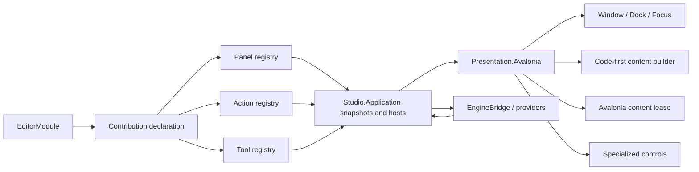

# Studio 前端框架

状态：Target（authoring 分层已校准；Code-first v1 当前使用整棵 content subtree 重建，
keyed reconcile 尚未实现；统一 Action、Avalonia extension backend 与工具合同仍在迁移）

更新日期：2026-07-30

跟踪：GitHub Epic #119；设计 Slice #337；首个实现 Slice #338

## 1. 目的

本文定义 Studio 前端的框架合同：Feature 如何声明 panel、action 和 tool，Host 如何组合 Dock、菜单、快捷键与内容生命周期，Code-first 和 Avalonia content 如何共存，以及 UI intent 如何安全地进入 command/transaction。

本文不定义具体视觉布局；默认工作台、状态呈现和用户任务路径见
[Studio 生产工作台体验规范](studio-workbench-experience.md)。

设计目标：

- 简单：先稳定已经有真实 consumer 的窄合同，不一次性造完整 UI toolkit；
- 可靠：稳定 identity、显式 context、显式 lifecycle、typed result 和 revisioned snapshot；
- 可扩展：built-in、项目 `Editor/` 和 Package 使用同一个 Editor Framework；
- 可测试：Application 合同无 Avalonia，ViewModel/authoring tree 可 headless 验证；
- 可替换 presentation：公共 Editor API 不依赖 Avalonia、Dock、Window、filesystem implementation 或 native handle。
- 单一控件运行时：XAML 与直接代码创建的是同一类 Avalonia object graph，不把 authoring syntax 误建模为不同 backend；
- 不造第二套 toolkit：Code-first 只覆盖稳定的标准工具 schema，不追求 Avalonia 控件、布局、样式或 binding 能力对等。

## 2. 不变量

1. `Asharia.Editor` 只表达 UI-neutral ID、snapshot、command、transaction、selection、panel/action/tool contribution 和 Code-first authoring。
2. Avalonia 是 Studio 当前 presentation backend，不是 Engine truth 或 public Application dependency。
3. Feature 声明内容和行为；Host 拥有 Window、Dock、focus、shortcut arbitration、theme、DPI、accessibility 和 content lifecycle。
4. View/ViewModel 不持有可变 Engine object、native pointer、Vulkan handle 或文件系统 owner。
5. scene、asset、project 和 setting mutation 必须走 command/transaction/dirty/validation。
6. panel local state、layout state、session state 和 document state 分开存储。
7. Action 在一个 registry 中定义，Menu、Toolbar、Command Palette、Context Menu 和 Shortcut 只是投影。
8. 未实现或当前上下文不可执行的操作不伪装成功；返回 typed result 并给出可理解原因。
9. UI 更新由 snapshot revision、event 或显式 frame request 驱动，不每帧重建整个工作台。
10. 同一功能只存在一条 production 路径；迁移 adapter 必须可删除，不能成为第二套框架。
11. XAML 与 code-only Avalonia 共用同一个 content backend、控件生命周期、样式和 binding 规则；二者只是 authoring syntax。
12. Code-first 是受限、UI-neutral 的标准工具 schema；它不是 Avalonia code-only UI 的别名，也不能成为通用控件抽象层。

## 3. 成熟引擎案例结论

### 3.1 证据等级

- O3DE、Godot 与 Avalonia 的公开源码和官方文档用于核对真实 ownership、registration 与控件运行时；
- Unreal 的源码在 EULA 下可访问，但不是 OSI 开源；本文只采用其公开文档/API 所能证明的边界，不复制实现；
- Unity 同样只作为公开 retained editor UI 文档证据，不把其产品名、类型名或内部实现带入公共 API；
- 外部案例先证明问题和边界，不能仅凭“成熟引擎也有”就新增 registry、DSL 或 abstraction。

### 3.2 主参考：模块化 retained editor UI

Unreal Editor 的公开文档和 API 展现出五个对 Studio 有直接价值的边界：

- Slate 使用代码中的声明式组合并维护 widget tree；它证明代码 authoring 与 retained UI 可以共存，
  但不证明 Studio 已有或必须复制 virtual-tree reconcile；
- `FUICommandList` 把 execute、can-execute、checked state 和输入绑定从具体按钮分离；
- `FTabManager`/tab spawner 使用稳定 tab identity 恢复布局和按需创建内容；
- `IDetailsView` 与 `IPropertyHandle` 把 selection 展示、property access、transaction 和 change notification 从具体控件分离；
- Interactive Tools Framework 把 input router、tool manager、gizmo manager、context store 以及 Accept/Cancel/Complete 生命周期放进独立 tool context。

采用：

- Code-first tree recording + retained Avalonia controls；当前实现为 subtree replacement，不误称已有 reconcile；
- action definition 与 surface placement 分离；
- panel descriptor + Host-owned spawn/restore；
- property handle 作为后续可写 Inspector 的窄腰；
- mode 与 lightweight interactive tool 分离。

不采用：

- 复制 Slate macro、UObject reflection、全局 singleton 或具体模块结构；
- 把大型通用 Property Editor 作为 Scene Authoring 的前置条件；
- 把外部引擎类型名写进 Asharia public API。

### 3.3 同一控件运行时的多种 authoring

Unity UI Toolkit 允许 UXML、UI Builder 和 C# 创建同一 `VisualElement` tree；Avalonia 官方也明确说明 XAML
与 code-only UI 生成相同 runtime object graph，二者可混用，code-only binding 也可以编译检查。

采用：

- XAML 和直接代码都归入 Avalonia content backend，不建立 `XamlBackend` 与 `CodeOnlyBackend`；
- compiled XAML + ViewModel 是复杂长期 panel 的默认 authoring；
- algorithmic composition、专用绘制或不适合 markup 的局部视图可以直接代码创建 Avalonia control；
- 两种写法共享相同 `UserControl`/`TemplatedControl`/custom-drawn control 选择、Host lifecycle、主题和测试门禁。

不采用：

- 为了“统一语法”把 XAML 编译成自有 `GuiNode`，或把直接代码限制为自有 builder；
- 让 Code-first schema 追赶 DataTemplate、binding、virtualization、style selector、animation 或 accessibility API；
- 因为两个 authoring syntax 最终产生相同 object graph，就允许 extension 接管 Window、Dock 或全局 resource。

### 3.4 交叉参考：Action、插件与 Inspector

O3DE Action Manager 明确区分 action、context、context mode、menu/toolbar placement、hotkey 和 event-driven updater。其 toolbar 默认在 mode 内保持位置稳定，避免 selection 变化导致按钮抖动；menu 可以按上下文隐藏无关 action。

Godot EditorPlugin/EditorDock 展示了稳定 dock key、默认位置、布局恢复、bottom panel 和插件 teardown 的价值；Inspector 与 Scene/FileSystem selection 协同，property edit 有 revert/default 概念，EditorUndoRedoManager 按 scene/resource context 选择 history。

Blender Operator 模型把 stable operator id、`poll(context)`、invoke/execute、modal、cancel、report 和 undo metadata 集中起来；Panel 只引用 operator，不直接实现业务。其 selection 指南还区分 scene selection 与纯 UI selection 的 undo 语义。

采用：

- action context、mode、enabled/checked/visibility 分离；
- toolbar 不因普通 selection 变化频繁增删项目；
- dock restore key 与显示标题分离；
- document/scene scoped undo history；
- interactive command 的 begin/update/commit/cancel；
- UI 只引用 command id，不直接调用 feature mutation method。

调整：

- Godot 插件可以直接提交/释放 `Control`；Studio 改为 Host-owned content lease，避免 Dock、popup、timer 和 generation cleanup 泄漏。
- O3DE 的 Document Property Editor 是有价值的 document-to-widget 案例，但当前仍不证明 Asharia 需要通用 UI document 格式；Code-first node tree 只服务小型工具，不扩成序列化 UI DSL。
- Blender 的全局 operator registry 在 Studio 中按 module/scope partition，Project close 或 generation retire 可精确撤销。

## 4. 总体结构



读取路径：

```text
Engine or project owner
  -> immutable revisioned snapshot
  -> Application projection/service
  -> Feature ViewModel or Code-first panel
  -> presentation backend
  -> Avalonia control tree
```

写入路径：

```text
pointer / keyboard / field intent
  -> focused action or interactive tool context
  -> command + expected revision
  -> transaction
  -> Application/Engine mutation
  -> typed result + new snapshot revision
  -> affected UI invalidation
```

UI 不直接“同步写模型再等待系统追认”。新 revision 是 mutation 成功的事实。

## 5. 当前事实与目标迁移

### 5.1 当前已有

- `Asharia.Editor.Panels.EditorPanelDescriptor` 已定义 stable contribution id、title、kind、default dock、cache policy、backend 和 factory-local id；
- `UiBackendId.CodeFirst`、`CodeFirstEditorPanel`、稳定 `GuiNodeId`、`GuiFrameBuilder`、event queue 和 local state store 已存在；
- 当前 `CodeFirstPanelHostView` 在 tree 更新时通过 `GuiAvaloniaControlFactory` 重新创建整棵 content subtree；
  尚无 keyed control reconcile，也不保证重建时保留 control identity、focus、IME composition 或 scroll；
- `WorkbenchActionDescriptor`、menu、shortcut、Command Palette 与 command result 路径存在，但仍是 legacy app-local contract；
- selection、transaction、dirty、diagnostic、background task、panel scheduler 和 lifecycle snapshot 已有公共或迁移中合同；
- `Asharia.Editor.Projects` 已有 UI-neutral project-open session snapshot，`Asharia.Studio.Application` 已有
  canonical bootstrap report 的严格 parser；两者都不拥有文件 IO、进程启动或 UI；
- `IProjectOpenSessionSnapshotSource` 只向 Presentation 暴露当前不可变 snapshot 与变更通知；
  `ProjectOpenSessionSnapshotSource` 在 Application 内负责内存发布，composition root 把实例交给 Shell-owned project launch surface；
- Project-open event callback 通过现有 UI dispatcher 更新 launch ViewModel，window dispose 时退订；source 不依赖 Avalonia，
  ViewModel 也不读取报告文件或执行 project-open 动作；
- `IProjectSessionService` 与 bootstrap source 分离，只发布 `NoProject | Ready` 活动项目 identity 和
  typed create/open result；Application service 通过 native descriptor gateway 成功后才切换 current，
  失败时保持上一成功会话；
- recent-project 是 Application-owned Studio preference；写入使用同目录临时文件加替换，启动恢复必须重新
  调用 descriptor gateway，不能把缓存路径或 bootstrap-ready candidate 直接解释为活动 `ProjectSession`；
- production composition 将活动项目投影为共享的最小 `SceneSnapshot`，Hierarchy、Inspector 与 Scene View
  读取同一 provider；无活动项目时 provider 为 Empty，不显示 demo object。该 snapshot 是 Editor projection，
  不是持久化 scene 或 runtime World；
- Scene View 只把 `hasScene + revision` 送入 native viewport request v2；View/code-behind 不传
  SceneObject、GPU resource 或 native pointer，renderer 以自己的默认编辑相机与 overlay contract 绘制 grid/axes；
- built-in XAML View 已使用 Avalonia + MVVM，但公开 `Asharia.Editor.Avalonia` content backend 尚未落地。

### 5.2 迁移目标

```text
legacy PanelDescriptor(Func<object>)
  -> public EditorPanelDescriptor + backend factory handle

legacy WorkbenchActionDescriptor
  -> public EditorActionDescriptor + surface placements

built-in-only XAML View creation
  -> Host-owned Avalonia content backend/lease

panel-specific direct mutation
  -> public command / property handle / interactive tool contract
```

迁移期间只允许 adapter 单向把 public descriptor 投影到 legacy Shell；禁止把 `Func<object>`、Avalonia `Control` 或 Shell service 反向加入 public Editor API。

## 6. Contribution registry

### 6.1 只保留必要 registry

当前/近期只需要：

| Registry | Identity | 内容 | 当前状态 |
| --- | --- | --- | --- |
| Panel | `EditorContributionId` | kind、dock preference、cache、backend、factory | public baseline 已有 |
| Action | stable action id | metadata、context、state query、execute route | legacy 已有，待 public 化 |
| UI Backend | `UiBackendId` | generation-scoped factory resolver | Code-first 已有；Avalonia target |
| Diagnostic/Task provider | stable source/operation id | immutable snapshot | baseline 已有 |

等有真实 consumer 后再增加：

| Registry | 进入条件 |
| --- | --- |
| Interactive Tool | Scene View 出现第二个可切换 input tool，且具备 accept/cancel transaction |
| Property customization | Transform property handle 完成，并出现第二种 property type/custom renderer |
| Status contribution | 至少两个 extension 需要向全局 Status Bar 提供持续状态 |

不建立通用 Window registry。需要浮动窗口的内容仍声明 panel/window-like contribution，由 Host 决定真实 `Window`。

### 6.2 Registration 顺序

一个 module generation 的注册过程固定为：

```text
declare
-> validate ids/capabilities/dependencies
-> freeze immutable definition
-> prepare invisible scope partition
-> activate owners
-> atomically publish registries
```

失败时旧 generation/last-known-good 保持可用。UI 不观察半注册菜单、孤立快捷键或没有 backend factory 的 panel。

## 7. Panel 合同

现有 `EditorPanelDescriptor` 保持小而稳定。以下信息不塞进 panel descriptor：

- Menu/Toolbar placement：由 Action placement 声明；
- layout split ratio、floating bounds：由 Host layout store 拥有；
- current title detail、dirty、status：由 panel instance snapshot 提供；
- selection、document、tool state：由相应 service/context 提供；
- raw `Control`、ViewModel、factory delegate：只存在 generation-scoped backend。

Panel kind 首版继续只区分：

- `Document`：可有多实例/active document 语义，中心区域优先；
- `Tool`：默认单实例工具表面，可 dock/float/restore。

出现真实多实例 asset editor 后，再增加显式 instance key/multiplicity contract；当前不预先扩 enum。

`RecreateOnOpen` 与 `KeepAlive` 只描述 content instance cache，不代表 module/generation lifetime。关闭 panel 必须先完成 deactivate/detach，再按 policy dispose 或保留。

## 8. Action 与 placement

目标 `EditorActionDescriptor` 是 UI-neutral data：

```text
action id
owner scope
title / description / category / icon key
action context id
optional mode ids
execution route
state invalidation keys
```

运行态 state 是 snapshot，不写入 descriptor：

```text
enabled + disabled reason
checked / unchecked / not-checkable
visible policy per surface
running state when action starts a background operation
```

Action 与 placement 分离：

```text
Action
  -> Main Menu placement
  -> Workbench Bar placement
  -> panel toolbar placement
  -> context menu placement
  -> Command Palette category
  -> default shortcut
```

规则：

1. 同一 action id 在全部 surface 执行同一路由。
2. Toolbar 在同一 mode 内优先保留稳定位置；selection 暂不满足时 disabled 并说明原因。
3. Menu 可以隐藏与当前 context 完全无关的 action；如果用户有明确恢复路径，则保留 disabled 有助于发现。
4. checked state 投影 underlying setting/tool state，不能把按钮自身当 truth。
5. action state 由 selection/document/mode/task 等事件触发 updater，不由 UI 每帧轮询所有 action。
6. context menu 先按当前 selection/focus 计算 snapshot，再显示；菜单打开后不因后台小变化持续重排。
7. shortcut 在 focused action context 中解析，文本输入和 modal/tool capture 具有明确优先级。

## 9. Mode 与 interactive tool

三个概念不能混用：

| 概念 | 生命周期 | 作用 |
| --- | --- | --- |
| Session Mode | Project/Edit/Play/Preview session | 决定 world、mutation 与运行策略 |
| Editor Mode | Select、Terrain、Animation 等工作流集合 | 改变一组 action、panel 和可用 tool |
| Interactive Tool | Move、Rotate、Marquee、特定笔刷 | 临时拥有部分 input、overlay 和 transaction |

Interactive Tool 的目标生命周期：

```text
CanStart(context)
-> Start
-> Update(input/snapshot)
-> Accept | Cancel | Complete
-> Dispose
```

约束：

- Tool 通过 viewport/tool context 查询 selection、camera、snapping 和 capabilities；
- input router 决定 tool、viewport navigation、selection 和 global shortcut 的优先级；
- interactive edit 使用 begin/update/commit/cancel transaction，cancel 恢复初始 revision；
- document change、Project close、Play transition、device loss 等必须显式要求 tool accept/cancel，不能静默遗留 capture；
- tool overlay 由 Scene View presentation host 渲染，不让 tool 获取 native surface。

首个实现 Slice #338 只显示 Edit mode 与 disabled tool affordance，不提前实现此 registry。

## 10. 一个控件运行时、两个 backend、三种 authoring 路径

Studio 只有一个实际桌面控件运行时：Avalonia。Panel contribution 当前/目标只有两个 backend：

```text
Code-first backend
  -> UI-neutral standard tool schema
  -> Host builds Avalonia controls

Avalonia content backend
  -> compiled XAML + ViewModel
  -> code-only Avalonia control composition/custom drawing
```

因此是三个 authoring 路径、两个 backend，不是三套 framework。XAML 与直接代码可以在同一个 Avalonia content
内部按普通控件组合规则混用；Code-first panel 则保持 UI-neutral，不能嵌入 raw control。

### 10.1 Code-first Editor UI

适合：

- 调试工具；
- 小型/标准 Inspector；
- toolbar、filter、list、foldout、property rows；
- 项目与 Package 的常规工具面板。

合同：

- API 位于 UI-neutral `Asharia.Editor.UI.CodeFirst`；
- 类似 IMGUI 的顺序 `OnGui` authoring，但结果是 immutable node tree；
- stable key 生成 `GuiNodeId`；
- 显式建模的 text、selection、foldout、split 等 local state 由 Host/state store 恢复；
- `OnGui` 只消费 snapshot、生成 UI 和 action intent，不执行 IO/GPU/长查询；
- rebuild 由 input、lifecycle、snapshot invalidation 或显式 `FrameUpdateRequest` 触发。

当前实现边界：

- 每次有效 tree 更新会重新创建 content subtree，不是 keyed diff/reconcile；
- `GuiStateStore` 可以恢复部分显式状态，但不能等价证明 TextBox、focus、IME、scroll 或虚拟化容器 identity 被保留；
- 因而当前 Code-first 只用于低频更新、小规模、标准控件工具；文本编辑密集、高频刷新、大列表和复杂可访问性场景
  应使用 Avalonia content backend；
- 在有真实 profile、focus/IME regression 和第二个需要增量更新的 consumer 前，不实现通用 reconciler；
- 现有 node kind 集合冻结；新增 primitive 必须证明两个 consumer，或证明无法用 Avalonia content 更简单地完成。

不允许：

- arbitrary Avalonia `Control`、style selector、margin/color/font；
- top-level Window/Dock ownership；
- 每帧无条件 rebuild；
- 直接写 scene/asset/project。

### 10.2 Avalonia content backend

这里的“Avalonia backend”不等于“只能写 XAML”。它允许：

- compiled XAML + ViewModel；
- code-only Avalonia `UserControl`/control composition；
- 专用 `Control`、`TemplatedControl` 或 custom drawing。

选择原则：

| 需求 | 首选 |
| --- | --- |
| 复杂长期 panel、模板、深度 binding、design preview | compiled XAML + ViewModel |
| algorithmic composition，但仍需 typed binding/retained identity | code-only Avalonia control composition |
| 行为与外观可复用的通用控件 | `TemplatedControl` + scoped `ControlTheme` |
| graph/timeline/curve/viewport chrome 的高频专用绘制 | code-only/custom-drawn `Control` |
| 低频、小规模、标准表单或调试工具 | Code-first |

Avalonia content backend 内的 XAML 与 code-only 路径都由 `IAvaloniaContentLease` 目标合同承载。
extension 只提供 content；Host 分别管理 attach/detach、shown/hidden、active/inactive、post-layout
和 dispose，并拥有 popup、timer、focus、Dock 和 Window cleanup。
Code-first 使用自身的 panel host lifecycle，不经过该 content lease。

compiled binding 是默认门禁。动态/无法编译的 binding 必须有局部理由和测试，不能全局退回 reflection binding。

### 10.3 单 panel 单 backend

同一 extension 可以贡献多个 backend 的 panel，但一个 panel 只选一个 backend。Code-first node 内不嵌 raw Avalonia control；复杂区域升级为完整 Avalonia content panel 或公共专用 surface contract。

这避免：

- 两套互相嵌套的 lifecycle；
- focus/shortcut ownership 不明；
- generation unload 时 raw control 泄漏；
- Code-first schema/host 无法拥有外部 visual subtree。

## 11. UI state 与 truth

| 状态 | Owner | Persistence | 示例 |
| --- | --- | --- | --- |
| Engine/document data | Engine/Application document | project/scene | entity、transform、asset reference |
| Document session | Application | session + explicit save | active document、dirty、revision |
| Selection/mode/tool | Application service/context | session | selected ids、Edit mode、active tool |
| Panel instance | panel ViewModel/Code-first state store | instance，可选 user setting | filter、expanded row、pin |
| Layout | Presentation layout store | user/workspace | split、dock、float、active tab |
| Control transient | Avalonia/Host | visual lifetime | hover、pointer capture、temporary validation |

禁止：

- 把 Dock split 写入 scene；
- 把 selected row 当 asset identity；
- 把 ViewModel field 当 mutation 完成事实；
- 把 loading/failed state压成 `null`；
- 把 filesystem path 当 asset/document identity。

## 12. Invalidation、线程与性能

### 12.1 统一规则

- Engine/provider 在 owner thread 生成 immutable snapshot；
- Application 按 revision 发布事件；
- ViewModel 在 dispatcher 上替换 snapshot projection；
- XAML 通过 observable property/collection 更新；
- code-only Avalonia 通过同一 property/binding/observable 机制更新，不重建整个 content；
- Code-first host 聚合 `GuiRebuildReason`，每个 dispatcher turn 至多 rebuild 一次；
- action updater 只刷新受 invalidation key 影响的 action；
- viewport frame 与普通 panel rebuild 分离。

### 12.2 UI thread

Avalonia control 创建、binding、layout、input 和 visual tree 操作只发生在其 dispatcher。后台任务只返回 data-only result/snapshot，不捕获 Control、ViewModel 或 dispatcher callback 作为长期 owner。

### 12.3 大数据

- Hierarchy、Project、Console、Problems 和 property list 使用虚拟化/增量 snapshot；
- stable item id 驱动 selection 和 diff；
- sort/filter 在后台或 UI-neutral projection 处理时可取消、可 supersede；
- 不为不可见 item 创建 control；
- 高速日志有界并聚合重复项；
- layout/build-replace/command execution 分别有 diagnostics，避免只看“界面卡了”。

## 13. Inspector 与 property handle

可写 Inspector 不直接把反射对象交给 UI。目标 `EditorPropertyHandle` 表达：

```text
property id/path + owner ids
value type and editor hint
snapshot revision
access: editable / read-only / locked / unavailable
value state: single / mixed / loading / invalid
current value + optional default value
validation messages
capabilities: reset, copy, paste, keyframe-like extension
begin/edit/commit/cancel command route
```

它负责把 read/write、expected revision、transaction、dirty、validation 和 change notification 收在一处；具体 XAML 或 Code-first row 只负责 presentation。

实施顺序：

1. 用 Transform 一个真实字段验证 typed handle；
2. 覆盖 no selection、read-only、dirty、invalid、stale revision 和 undo/redo；
3. 再支持 vector group、resource reference 和 multi-selection mixed value；
4. 出现第二个稳定 property family 后再抽 customization registry；
5. 不先构建全反射 property-grid ABI。

## 14. File、Dialog、Task 与 diagnostics

- Avalonia `IStorageProvider` 只负责用户参与的 open/save/folder picker；
- Application storage/asset/project service 负责路径规范化、原子写、权限、recent document 和 typed error；
- Feature/ViewModel/extension 不直接用 picker token 或 BCL 文件 API修改项目；
- 长操作创建 background task，支持 cancellation、progress 和 bounded diagnostics；
- command failure 默认进入 inline/status/Problems，不弹 modal；
- modal 只用于 destructive confirmation 或必须立即决策的问题；
- 同一 diagnostic id 可被多个 surface 引用，但只有一个 primary feedback。

这使前端框架不拥有文件 IO；它只发出用户 intent 并显示 Application service 的结果。

## 15. 生命周期与 reload

Host 统一观察以下逻辑阶段：

```text
Registered
-> Created
-> Attached
-> Shown | Hidden
-> Active | Inactive
-> Detached
-> Disposed
```

Open/Close 是 Shell command：Open 产生 Attach，Close 在清理可见性与 activation 后产生 Detach，不再增加一组
重复的 `OnOpen`/`OnClose` callback。Attached 表示 content lease 已绑定到 logical host；Shown 表示 tab 是
所在 Dock window 当前选择；Active 表示 workspace command/focus target。一个非活动 Dock window 的当前 tab
可以 Shown 但 Inactive，Hidden tab 不得 Active。

布局通知与 lifetime 正交。Presentation host 不在 arrange 调用栈内同步进入 panel，而是把 arrange、DPI 与
tab 切换合并为 layout/render 之后的一次 UI dispatcher 通知，并在执行时读取最新 logical width、logical
height 与 render scale；不使用 timer/debounce。detach 会使旧回调失效，同一 panel 对完全相同的三元组只
通知一次。切换到新 tab 时即使 host 尺寸不变，也会安排一次通知，使新 panel 得到自己的当前几何。该合同不
替代 Scene View 等专用 surface 对子控件几何的直接观察。

Code-first 当前把 `OnCreate/OnEnable/OnShown/OnActivated/OnGui/OnLayoutChanged/OnFrame/OnDeactivated/OnHidden/OnDisable/OnDestroy`
映射到这些状态和通知；Avalonia content 使用对应的 Host lease/sink。

规则：

- 每次成功 attach/activate/show 恰好对应一次 detach/deactivate/hide；
- KeepAlive close 不销毁 persistent panel local state，但必须停止 active input/task/timer；
- `Visible` frame request 只在 Shown 时调度；`Active` frame request 同时要求 Shown 与 Active；
- terminal dispose 释放 content-owned subscription、popup、task、dispatcher callback 和 generation lease；
- callback 失败不短路 Host `finally` cleanup；
- Avalonia/XAML/custom control 默认 restart-required Tier 0，直到 resource/type/static registry cleanup 有重复 canary 证明；
- Code-first 没有 extension-owned Avalonia type/resource，但仍需通过 scope、task、subscription 和 ALC leak gate；
- `AssemblyLoadContext` 不是安全沙箱；不可信扩展需要进程边界。

## 16. 测试与诊断

### 16.1 合同测试

- duplicate/invalid contribution id；
- missing backend/factory/capability；
- registration failure 不发布半成品；
- action context、mode、enabled、checked、visibility 和 shortcut arbitration；
- panel lifecycle exact pairing、KeepAlive、RecreateOnOpen 和 repeated close；
- Code-first stable key、duplicate key、state restore、batched rebuild 和当前 full-subtree replacement；
- keyed reconcile、control identity/focus/IME preservation 属于未实现 target，只有进入独立实现 Slice 后才列为通过能力；
- Avalonia compiled binding、content lease cleanup 和 scoped resource；
- property handle revision mismatch、validation、undo/redo 和 cancel；
- interactive tool input capture、accept/cancel、document transition；
- Project close/reload 后 registry、task、subscription、Control 和 generation lease 归零。

### 16.2 体验 smoke

```text
open project
-> restore layout by stable panel ids
-> select scene object
-> observe Hierarchy/Inspector/action state update
-> execute same action from menu, shortcut and palette
-> begin interactive edit
-> cancel and verify initial revision
-> repeat and commit
-> undo/redo
-> close/reopen panel
-> close project with no leaked active content/task
```

## 17. 实施顺序

### F0：冻结 authoring 边界

- 不新增 Code-first node kind、layout DSL 或 style API；
- 文档和诊断明确当前 full-subtree rebuild，不把 target reconcile 写成已有能力；
- 新 panel 先按“低频标准 schema / XAML / code-only Avalonia”决策表选择 authoring；
- 只有真实 consumer 与 profile 证明 full rebuild 不可接受时，才建立窄 keyed update Slice。

### F1：Shell context（#338，已实现）

- Workbench Bar 与 title 投影现有 selection/task/diagnostic snapshot 和明确的 project/document 占位；
- Shell-owned `Default` / `Compact` preset 编排默认 panel composition，保存布局继续优先；
- UI Style、Frame Debugger 与折叠 Diagnostics 保持注册和可恢复，但不默认实例化；
- disabled action/tool state 通过 tooltip/accessibility reason 可解释；
- Shell project launch surface 使用 compiled XAML 显示 project-open lifecycle；Project 面板只显示真实 asset 空状态，
  两者都不伪造 project/asset IO；
- 未新增 public registry，也未把 layout/open state 放进 panel descriptor。

### F2：Action public contract

- 把 legacy `WorkbenchActionDescriptor` 收敛为 UI-neutral action + placement；
- menu、toolbar、palette、shortcut 共享执行和 state；
- event-driven updater 和 focus context smoke。

Project-open session contract（#341）已作为 F1 与后续真实 Project UI 之间的独立前置 Slice 完成：
Presentation 只消费 Application 提供的 snapshot，不读取报告文件、不运行 bootstrap，也不自行归约状态。

Project-open workbench consumer（#343、#345）在该边界上只保留一条单向状态路径：

```text
Application publication source
  -> IProjectOpenSessionSnapshotSource
  -> Shell-owned ProjectLaunchViewModel
  -> compiled Avalonia binding
```

Ready 只在 project launch surface 显示 canonical candidate name 与“project check completed”，不进入 active-project
window title/context，也不提升为 `ProjectReady`。没有真实 application service 时，next action 只显示为非交互文本。
session diagnostic 在有界滚动 surface 就地显示首项，manifest path 与 JSON pointer 分开；当前 Problems service 是
append-only，尚无 replace-by-source 语义，因此本阶段不复制，避免同一 project-open 状态产生过期或重复问题记录。
Project panel 不再消费 project-open source，只等待未来正式 ProjectSession 提供 asset/product snapshot。

### F3：第一个 writable property

- 建立最小 typed property handle；
- Transform 单字段 transaction、dirty、validation、undo/redo；
- XAML Inspector 先消费，不做通用 customization registry。

### F4：Interactive tool baseline

- Select/Move 之一验证 per-viewport input context；
- begin/update/accept/cancel transaction；
- viewport overlay 与 focus/shortcut arbitration。

### F5：公开 Avalonia content backend

- `Asharia.Editor.Avalonia` registration 与 content lease；
- built-in sample + Package fixture；
- scoped resource、compiled binding、restart-required policy 和 teardown smoke。

每个阶段独立 Issue/PR。任何阶段都不得以“以后会用”为由同时实现下一个阶段的空框架。

## 18. 参考资料

成熟引擎官方文档/API：

- [Unreal Slate Overview](https://dev.epicgames.com/documentation/en-us/unreal-engine/slate-overview-for-unreal-engine)
- [Unreal FUICommandList::CanExecuteAction](https://dev.epicgames.com/documentation/en-us/unreal-engine/API/Runtime/Slate/Framework/Commands/FUICommandList/CanExecuteAction)
- [Unreal FTabManager](https://dev.epicgames.com/documentation/en-us/unreal-engine/API/Runtime/Slate/FTabManager)
- [Unreal IDetailsView](https://dev.epicgames.com/documentation/en-us/unreal-engine/API/Editor/PropertyEditor/IDetailsView)
- [Unreal IPropertyHandle](https://dev.epicgames.com/documentation/en-us/unreal-engine/API/Editor/PropertyEditor/IPropertyHandle)
- [Unreal UInteractiveToolsContext](https://dev.epicgames.com/documentation/en-us/unreal-engine/API/Runtime/InteractiveToolsFramework/UInteractiveToolsContext)
- [Unity UI Toolkit retained-mode architecture](https://docs.unity3d.com/6000.0/Documentation/Manual/ui-systems/introduction-ui-toolkit.html)
- [Unity EditorWindow lifecycle API](https://docs.unity3d.com/6000.0/Documentation/ScriptReference/EditorWindow.html)
- [Unity UI Toolkit layout events](https://docs.unity3d.com/2022.3/Documentation/Manual/UIE-Layout-Events.html)
- [Unity VisualElement：UI Builder、UXML 与 C# 共用控件树](https://docs.unity3d.com/6000.0/Documentation/Manual/UIE-uxml-element-VisualElement.html)
- [O3DE Action Manager](https://www.docs.o3de.org/docs/user-guide/action-manager/)
- [O3DE Actions and Context Modes](https://www.docs.o3de.org/docs/user-guide/action-manager/fundamentals/concepts/actions/)
- [O3DE Action Visibility](https://www.docs.o3de.org/docs/user-guide/action-manager/fundamentals/architecture/visibility/)
- [Godot EditorDock](https://docs.godotengine.org/en/stable/classes/class_editordock.html)
- [Godot Inspector Dock](https://docs.godotengine.org/en/stable/tutorials/editor/inspector_dock.html)
- [Godot EditorUndoRedoManager](https://docs.godotengine.org/en/stable/classes/class_editorundoredomanager.html)
- [Blender Operator API](https://docs.blender.org/api/current/bpy.types.Operator.html)
- [Blender HIG：Selection](https://developer.blender.org/docs/features/interface/human_interface_guidelines/selection/)

开源实现：

- [O3DE Action Manager source](https://github.com/o3de/o3de/tree/development/Code/Framework/AzToolsFramework/AzToolsFramework/ActionManager)
- [O3DE Document Property Editor source](https://github.com/o3de/o3de/tree/development/Code/Framework/AzFramework/AzFramework/DocumentPropertyEditor)
- [Godot editor source](https://github.com/godotengine/godot/tree/master/editor)
- [Avalonia source](https://github.com/AvaloniaUI/Avalonia/tree/12.0.4)

Presentation backend：

- [Avalonia Code-only UI](https://docs.avaloniaui.net/docs/fundamentals/coded-ui)
- [Avalonia compiled bindings](https://docs.avaloniaui.net/docs/data-binding/compiled-bindings)
- [Avalonia custom control choices](https://docs.avaloniaui.net/docs/custom-controls/choosing-a-custom-control-type)
- [Avalonia threading model](https://docs.avaloniaui.net/docs/app-development/threading)
