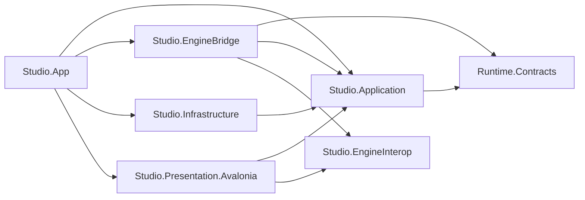
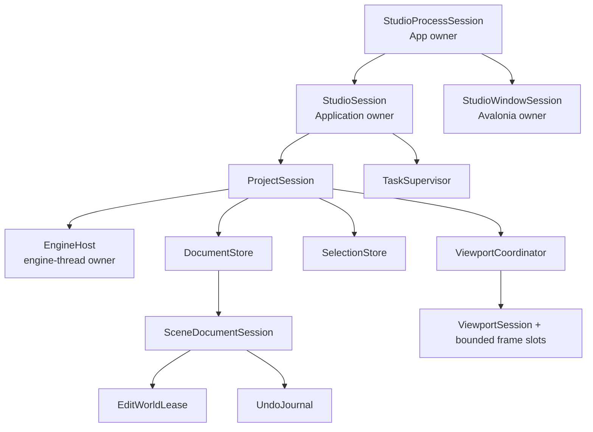

# Studio 前端硬切架构

状态：Current R0 Baseline（R0 hard cut 已由 [4.39 总门禁](#439-r0-total-gate-closure-cardcurrent)关闭；
R0.5 只读开发态观测面已由[对应 Slice 1→8](studio-development-observability.md#210-r05-slice-8-modern-read-only-stdio-mcp-adapter-cardclosed-evidence)关闭；后续 R1 仍受
[ADR-0007](../adr/0007-studio-frontend-hard-cut.md)约束）

更新日期：2026-08-13

> 2026-08-04 进展：R1 首个 writable vertical Slice 已由
> [ADR-0009](../adr/0009-authoritative-scene-document.md) 关闭。下文 R0 审计表保留当时证据；凡写“SceneDocument
> 尚未开始/待 R1”的历史行，当前状态均以 ADR-0009 为准，不得反向解释为现状。2026-08-05，#361 又以真实
> SceneDocument consumer 重新建立 `ViewportSession -> EngineBridge -> editor_native -> Avalonia composition` 最小闭环；
> 下文关于“无可见 viewport / 无 native deployment”的 R0 删除卡同样只保留历史证据，当前状态以
> [Viewport 渲染架构](viewport-rendering.md) 与 [ADR-0002](../adr/0002-cross-platform-viewport-presentation.md) 为准。
>
> 2026-08-12，#377、#378、#379 又以当前真实 `ProjectSession`、SceneDocument/selection、Dock panel 与
> viewport presentation consumer 完成 dirty transition guard、structured failure ingress 及最小 Action/menu/context/shortcut
> 纵向闭环。4.8 仍只记录旧 Workbench runtime 被删除的历史事实；新 `Asharia.Studio.Application.Actions`
> 不兼容旧 Workbench contract、adapter 或 public SDK。
>
> 2026-08-13，#381又在同一App-owned bounded hub上建立一个Diagnostics Dock panel：Console读取时序日志，
> Problems读取可行动structured diagnostics。两个内部tab共享一次subscription与有界可重建projection；这不恢复
> 旧Console/Problems Feature岛，也不引入持久日志、命令/CVar或第二truth。

## 1. 结论与范围

Studio 当前存在整体架构问题，适合无兼容硬切；但不需要推倒 Avalonia、Vulkan bridge 或所有 Dock 算法。

应保留：

- 模块化单体和 project-reference 编译期边界；
- UI-neutral Application、Avalonia Presentation、native EngineBridge 的单向依赖；
- immutable revisioned snapshot 与 intent/result 数据流；
- Document 与 Tab/View 分离；
- Edit、Preview、Play World 分离；
- retained Avalonia、compiled binding、virtualization 和 Headless 测试；
- 已验证的 Dock layout、viewport scheduling、frame retirement 等纯算法。

应重写：

- Studio/Project/Document/World 的 owner 和异步生命周期；
- Document mutation、transaction、undo/redo、savepoint 与 dirty；
- Action/context、selection、task、settings 和 diagnostics owner；
- Shell composition、MainWindow/Dock coordinator 与 ViewModel 输入；
- native scene/viewport 的 session、thread、handle、revision 和 shutdown contract。

应删除或后置：

- legacy compatibility adapter 和双 production path；
- production fake Scene/Frame Debug 数据；
- Code-first virtual tree/host/第二套 UI authoring；
- 当前未被真实垂直切片证明的 `Asharia.Editor` public SDK；
- dynamic ALC、generation handover、last-known-good 与 ProjectCode production wiring；
- built-in 必须通过未来第三方 SDK dogfood 的规则。

本文件是 Studio v1 前端重构的目标合同。旧的统一扩展、Code-first、generation reload 和兼容迁移文档只保留
历史证据，不得再作为新代码的目标依据。

### 1.1 当前切换进度

2026-07-31 已完成第一批可独立验证的 R0 hard-cut：

- 删除 `ProjectSceneSessionProjection`；Project Ready 不再生成虚构的 `Untitled Scene/Main Camera`；
- Workbench 的两套无文档 Scene fixture 已随 legacy composition 删除；后续 tests-only public/Application/Core
  scene snapshot/provider 岛也已整体删除，R0 不声明只读 Scene 能力；
- 未接真实 render lane 的 Frame Debugger 不再注册 panel/action，也不再提供 fixture capture；
- Code-first `FrameDebuggerPanel` 与 `UiStylePanel` consumer 已删除；UI Style 已以 typed ViewModel +
  compiled Avalonia View 重建，Frame Debugger 则在接通真实 render lane 前不注册；
- Code-first 通用 DSL/Host、`UiBackendId.CodeFirst` 与专属测试已删除；随后确认无真实 consumer 的
  Workbench command/action/status runtime 与公共合同也已整体删除；
- native compatibility query 不再把 `VulkanContext*` 带出锁，而是复制 immutable device snapshot。
- `WithDeveloperTools()` 与 `AvaloniaUI.DiagnosticsSupport` 已从构建闭包删除；后续诊断路径采用
  [项目自有的开发态只读观测合同](studio-development-observability.md)，不依赖 Avalonia Plus。
- 无 production consumer 的 28-file/13,324-line ProjectCode build→inspect→publish→index→load→activate
  control plane 与 3 个 friend-test harness 已整体删除；此前 dirty tree 中已完成的 read-guard 内存修补经审查后
  随能力撤销而不再适用，不把修补后的 test-only pipeline继续冒充产品能力。
- ProjectCode删除后仅由两份专属测试引用的Editor Image inventory/managed build-environment projection前置面
  也已删除；Application不再拥有distribution/build filesystem扫描合同。
- ProjectCode/legacy adapter删除后只由3份专属测试实例化的Application module registry/scope transaction/
  static generation host也已删除；R0不声明extension activation能力。
- root `Features/**` 的Console/Problems/Hierarchy/Inspector/Project/SceneView/UiStyle均无模板、panel host或构造入口，
  已连同18份专属tests删除；唯一diagnostic hub保留。该R0门禁后来由#381以新的Diagnostics panel只读适配器满足，
  没有恢复旧Feature类型。
- Dialog host、design-time ViewModel与About request没有App/MainWindow/template/command producer，已连同专属tests删除；
  旧public data-only Dialog contracts留待public SDK closure独立审计，不把它们解释为R0可用弹窗能力。
- Project launch View/ViewModel没有App/MainWindow/project-selection intent入边，已连同专属text projection、零复用
  UI dispatcher及tests删除；Application parser/session、Core gateway与public/native Project contracts留待后续依赖格审计。
- 其后成为test-only尾链的managed `ProjectOpenSession` parser/source/public records也已删除；canonical
  bootstrap-session producer与fixture转由`tools/**`继续拥有，不删除真实headless control plane。
- active `ProjectSession`、recent store、Application descriptor port与Core gateway同样只有专属tests构造，
  已作为独立managed尾链删除；EngineBridge/native Project边界与`packages/project-core`继续分格审计。
- Core gateway删除后成为test-only叶面的managed EngineBridge Project P/Invoke/DTO也已删除；C++ project ABI/smoke
  仍保留到独立native Slice，真实`project-core` package consumer不受影响。
- 随后C++ `editor_project_*` export/self-smoke也因managed caller归零删除，`editor-native`不再链接project-core；
  `asharia-editor`资产目录与package-owned project-core IO/smoke继续保留为真实consumer。
- 最小Shell只消费旧全局token中的三个颜色；其余icon/tree/base-control/native-style/font registry均无第二consumer，
  24个`UI/**` production文件、3份自证tests、16.5 MB SourceHan字体和ColorPicker/CommunityToolkit/Lucide包已删除。
  App现在只拥有Avalonia Fluent基础主题，三个颜色归唯一MainWindow；此前dirty tree中已完成的icon/Dock token/test
  sentinel清理经审查后随整个断连能力删除而不再适用，不回退成未来registry占位。
- `App` 现在唯一持有 `StudioProcessSession`，使用 Avalonia `OnExplicitShutdown` 截获首次 Window/OS close；
  `StudioProcessSession` 只负责当前真实 managed composition 的 start、lifetime cancellation 与 deadline-bounded
  dispose，并发布 typed `StudioTeardownReceipt`；product factory 的同一 token 已贯穿 composition、development
  endpoint、Pipe startup 与 manifest publication，取消会释放尚未转交完成的 Shell/Host/Pipe；当前 Studio没有
  native child，不生成 phantom drain/fallback 事实；
- production composition 不再创建 built-in Workbench：`App` 只创建最小 Shell session；断开的
  `StudioCompositionRoot`、aggregate Workbench module、`EditorExtensionComposition`、`MainWindowViewModel` 与
  legacy session branch 已删除；早一 Slice 的 compatibility adapter/contracts/catalog 也保持删除；
- production Studio C# source 已无 `.Result`、`.Wait()` 或 `GetAwaiter().GetResult()`；MainWindow 只停止自己的
  UI frame pump 和发布 closing fact，不再拥有 process teardown。
- `App` 创建唯一 `StudioDiagnosticHub` 并把同一 process identity 注入 composition；diagnostic/log 分别使用
  2048/8192 固定数组 ring，写入为 O(1)，cursor 明示 wrap/drop；subscriber 为 64 个固定 slot、逐个隔离；
  Avalonia 使用自有 `ILogSink`，不再走 `Trace`；旧Console/Problems Feature岛保持删除，#381只以当前真实
  Diagnostics panel重读同一hub，不能拥有第二store。
- 断开的自研 Dock graph/hit-test/tab/floating-window runtime、panel registry/cache、View/ViewModel、全局
  `ViewLocator`、专属样式令牌与测试已删除；`App` 不再注册全局反射 DataTemplate。

生产 `App` 已不再创建旧 `StudioCompositionRoot/MainWindowViewModel`，而是在 process start 前实例化最小
`StudioShellViewModel` 与 retained `MainWindow`；真实 Headless backend 已验证 Starting → No Project / No Document
binding 与稳定 AutomationId/name/role。独立 Headless test project 使用 Avalonia 12 所需的 xUnit v3 dispatcher，
不污染仍由 xUnit v2 承载的 legacy tests。

这不是完整 cutover。旧 generation/extension public surface 与完整 transaction/undo 模型仍未进入 production；
R1 SceneDocument 的最小 create/edit/save/reopen 闭环已由 ADR-0009 完成，但后续不得把这一 owner Slice 解释为完整
Workbench、Dock、Asset、Viewport 或 Play 架构已经完成。

ProjectCode 删除后，原先由 2,093-file executable-distribution fixture主导并曾在124秒 deadline超时的
Application suite已缩短为197/197、约1秒；solution全量6个test assembly均在显式120秒预算内通过。
这证明旧长路径来自断开的测试控制面，而不是可以保留到 production 的能力证据。

## 2. 为什么是根架构问题

### 2.1 实现证据

| 证据 | 当前事实 | 架构含义 |
| --- | --- | --- |
| 建设优先级 | `Asharia.Editor` 75 个 C# source file；Application 12 个；production Document owner 为 0 | ProjectCode/distribution/Application Extensions/ProjectOpenSession/active ProjectSession、Frame Debugger与孤立public Diagnostics已删除；旧public SDK与其他断开 surface仍待切除 |
| composition owner（R0 hard-cut） | `App -> StudioProcessSession -> StudioCompositionSession(StudioShellViewModel)` 是唯一图；旧 root、aggregate Workbench 与 MainWindow god VM 已删除 | production 与 compiled legacy owner 图均不再存在；旧 public/editor 项目 surface 仍待后续 Slice 删除 |
| 假 truth（R0 已切除） | 原 `ProjectSceneSessionProjection` 根据 active project 生成 `Untitled Scene` 与 `Main Camera` | 旧 fixture 保持删除；ADR-0009 只投影真实 SceneDocument snapshot |
| 错误写模型 | `IEditorEditCommand.Apply/Revert` 同步修改 editor-side state；descriptor 的 target/field/old/new 全是 string | 无法表达 native authority、revision、atomic batch 和 uncertain commit |
| 全局 transaction | 一个 active transaction、两个 process-level `List` stack；undo/redo 先 pop 再执行 | 无 Document scope，失败可丢 history 并留下部分 mutation |
| Shell god owner（R0 source hard-cut 已完成） | 原 MainWindow ViewModel 789 行、Dock workspace 1955 行、compatibility adapter 488 行；ViewModel constructor 创建 service、Dock、router、dialog、menu 和 layout | 三个 source owner 与断开的 Dock runtime 均已删除；R0 Shell 保持一个 O(1) 状态 owner |
| 第二套 UI（R0 source hard-cut 已完成） | 原两个 Code-first consumer、公共 DSL、Host、state、event、backend 常量和专属测试均已删除；UI Style 使用 compiled Avalonia | 架构门禁断言 public/Shell 两个 Code-first source root 与 ViewLocator 映射均不存在 |
| native 全局状态 | 独立C++ viewport仍是process singleton + raw pointer token + 永久shutdown flag；R0 managed static drain已删除 | C++ target自身的multi-session、restart与stale handle仍不可证明，但不是当前Studio产品能力 |
| scene ABI 缺口（#353 已关闭最小面） | 旧 World ABI 仍只有逐实体操作；新增 Document ABI 提供 stable ID、bulk snapshot、expected revision、save 与 generation-safe handle | managed compensation 仍被禁止；未来 undo/batch 必须扩展同一 authoritative boundary |
| 部署断裂（#353 已关闭） | root App 真实消费 EngineBridge，Editor Image 精确复制并验证 `asharia_scene_native.dll` 与 Document exports | Scene native 已是受验证产品依赖，不再是 phantom closure |

### 2.2 Managed 代码审查定位

| 优先级 | 位置 | 触发与影响 | hard-cut 处理 |
| --- | --- | --- | --- |
| P1（R0 已修复） | 原 `src/Asharia.Studio.Application/Transactions/EditorTransactionService.cs` | Undo/Redo 先移除history再执行；任一closure Apply/Revert抛错会丢entry或留下部分mutation | public Editing/Transactions、Application service与self-tests已整体删除；未来只接受authoritative mutation receipt + `List<UndoEntry> + cursor` |
| P1（R0 已修复） | 原 `Shell/Composition/ProjectSceneSessionProjection.cs` | 只要 Project ready 就发布虚构 Scene/Camera，用户会把 fixture 当成项目内容 | production projection 已删除；R1 只接受 real SceneDocument snapshot |
| P1（R0 owner 已修复） | `Shell/Composition/StudioProcessSession.cs`、`App.axaml.cs` 与 `StudioCompositionSession.cs` | 原product factory只在进入composition前检查一次token，development endpoint/manifest publication可能在close后继续startup并消耗teardown deadline | 同一token现已贯穿composition/endpoint/Pipe/manifest；取消释放Shell且不留下manifest/listener，不新增lifecycle bus |
| R0 owner 子 Slice 已修复 | production composition 与删除门禁 | legacy module 被包成 public definition、再投影回 registry 的双 truth 已删除 | 不恢复 adapter/type forwarding；后续删除剩余旧 SDK surface |
| P1（R0 ProjectCode source 已删除） | 原 `src/Asharia.Studio.Application/ProjectCode` | 28 个 internal file由SDK wildcard编译，但App/Shell/Application目录外无production调用；真实build mega-test仍只是friend harness | 整岛与3个专属tests删除；此前read-guard修补随能力撤销而终止，不保留stub/null compiler |
| P2（R0 owner source 已删除） | 原 `Shell/ViewModels/Windowing/MainWindowViewModel.cs` | ViewModel constructor 创建 service、Dock、action router、dialog、menu 与 layout | source 与专属测试已删除；最小 `StudioShellViewModel` 只接受 process start/stop 事实 |
| P2（R0 aggregate owner 已删除） | 原 `Features/Workbench/WorkbenchFeatureModule.cs` | aggregate module 创建全部 panel 与 dispatcher；原 production fixture 已先删除 | module/contribution set 与专属 tests 已删除；未来 built-in 只能随真实 vertical feature 放回 Application/Presentation |
| P2（R0 Workbench runtime 已删除） | 原 `Shell/Commands`、command palette、menu VM、legacy contribution validator 与公共 command/status contract | 无 production action/panel/document consumer却保留 registry、shortcut parsing与另一组 public descriptors | runtime/source/专属 tests 全删；不保留 stub action/fixture panel |
| P2（R0 Dock source 已删除） | 原 `Shell/Docking`、Dock View/ViewModel、panel registry/cache 与 `ViewLocator.cs` | 无 Project/Document/panel consumer却保留完整 layout、drag/drop、floating window 与全局反射 view switch | runtime/source/专属 tests、全局 DataTemplate 和 Dock-only token 全删；未来随真实 document/panel use case重新定义 |
| P2（R0 Dialog presentation 已删除） | 原 `Shell/ViewModels/Dialogs` 与 `Shell/Views/Dialogs` | App、MainWindow与composition没有request producer或host绑定；唯一构造者是design-time XAML与两份tests | 6个source/XAML与2份tests删除；public data contracts不是production capability，留待public SDK closure审计 |
| P2（R0 Project presentation 已删除） | 原 `Shell/ViewModels/Projects`、`Shell/Views/Projects`、`UI/Presentation/ProjectOpenSessionText.cs`与专属dispatcher | App/MainWindow没有ProjectLaunch引用、select/open intent或owner；只有三份tests构造该面 | 7个production source/XAML与3份tests删除；Application/Core/public/native Project链留待下一依赖格 |
| P3（R0 已删除） | 原 `Shell/CodeFirstUI` 与 `Asharia.Editor/UI/CodeFirst` | 原两个 consumer 产生第二套 tree/state/event/lifecycle，且更新重建 subtree | consumer、DSL、Host、backend 常量和专属测试已删除；不恢复 alias、stub 或 fixture |

### 2.3 根因

```text
外部扩展兼容面
        ↓ 先冻结
module/generation/build/Code-first framework
        ↓ 先进入 production
legacy adapter + Shell god objects
        ↓ 被迫承载
尚不存在的 Document/Mutation/Save truth
```

正常顺序应反向：

```text
authoritative SceneDocument vertical slice
        ↓ 稳定 use case 与错误语义
Application/Bridge/Presentation compiler boundaries
        ↓ 第二个真实 consumer
窄 public Editor facade
        ↓ 重复 reload 需求与 teardown 证据
可选 dynamic extension runtime
```

因此只修补当前 transaction、ViewModel 或 adapter 会继续围绕错误的中心扩建。

## 3. 目标项目与依赖

### 3.1 Production projects

```text
Asharia.Runtime.Contracts
Asharia.Studio.Application
Asharia.Studio.EngineInterop
Asharia.Studio.EngineBridge
Asharia.Studio.Infrastructure
Asharia.Studio.Presentation.Avalonia
Asharia.Studio.App
```

`Asharia.Runtime.Contracts` 是 engine-owned 的 blittable/runtime value contract，不计入六个 Studio project。



### 3.2 每个项目的唯一职责

| Project | 拥有 | 可以引用 | 禁止 |
| --- | --- | --- | --- |
| Runtime.Contracts | engine/runtime ABI-neutral value types | BCL | Avalonia、Studio service、P/Invoke |
| Studio.Application | session/document state machine、ID、snapshot、intent/result、ports、Action、Selection、Undo、Task、Diagnostics | Runtime.Contracts、BCL | Avalonia、filesystem implementation、process、P/Invoke、OS/GPU handle |
| Studio.EngineInterop | viewport external resource descriptor、frame/surface lease 的窄合同 | BCL | Application policy、P/Invoke implementation、Avalonia |
| Studio.EngineBridge | P/Invoke、engine thread、Scene/World/Viewport adapter、native result mapping | Application、Runtime.Contracts、EngineInterop | Avalonia、Dock、ViewModel、filesystem |
| Studio.Infrastructure | project descriptor、filesystem、settings、build/import worker/process adapter | Application、BCL | editor state owner、Avalonia、native render |
| Studio.Presentation.Avalonia | Window、Dock、focus、input、accessibility、compiled XAML、built-in panel、ViewModel | Application、EngineInterop、Avalonia | P/Invoke、EngineBridge concrete、business truth |
| Studio.App | bootstrap、manual composition、process session、async start/stop、native deployment | 全部 adapter | feature/domain behavior、第二个 composition root |

`Infrastructure` 不是杂物箱。只有实现 Application output port 的 filesystem/process/settings adapter 才能进入；
出现独立部署、独立安全域或第二个 consumer 后再拆 ProjectSystem/WorkerHost。

### 3.3 暂不建立 Editor SDK

Studio v1 的 built-in 是产品实现，不假装第三方插件。它可以分别在 Application 与 Presentation 中按 vertical
feature folder 组织，而不必通过一个尚未稳定的二进制 SDK。

满足以下全部条件后才可以新建 `Asharia.Editor`：

1. 至少一个 built-in 以外的真实 consumer；
2. SceneDocument/Action/Selection/Undo contract 已在 production 稳定；
3. 能列出 public/support 生命周期和版本策略；
4. compiler gate 证明 facade 不泄漏 Application implementation、Avalonia Shell 或 native handle；
5. restart-required extension 已有安装、失败、卸载和恢复 smoke。

dynamic ALC/reload 还需要重复 unload canary 和明确收益；它不是 SDK 的默认组成。

## 4. Owner、lifetime 与线程



### 4.1 Thread owners

- Avalonia UI thread 只修改 `Control`、focus、Dock presentation、binding collection 和 compositor import。
- Application 使用单 reader 的串行 state loop。推荐实现是 bounded
  `Channel<ApplicationMessage>`；loop 只做快速校验与原子 state transition，绝不等待 IO/native/build。
- EngineBridge 使用专用 engine dispatcher/thread。World 在该线程 create/use/destroy；禁止以 `Task.Run`
  代替 owner thread。
- filesystem/build/import 在 thread pool 或 supervised process 运行，只返回 data-only completion。
- 每个 completion 携带
  `OperationId + ProjectSessionId + owner ID + expected revision + engine epoch + supersession generation`。
- 高频 progress 使用 latest-wins/coalescing slot，不用无限堆积 message。

### 4.2 Shutdown

```text
request close
-> resolve dirty documents: save / discard / cancel
-> stop accepting new user intents
-> cancel active interactive edit
-> detach Presentation and stop panel/input/frame producers
-> drain/ack every viewport FrameLease
-> cancel and await Project/Document task scopes
-> close documents and destroy Edit/Preview/Play worlds on engine thread
-> cross NativeSafeBarrier
-> stop EngineHost
-> atomically persist layout/settings
-> dispose windows
-> complete process shutdown
```

timeout 是 typed fault/quarantine，不授权越过 native barrier。UI thread 不允许 `.Result`、`.Wait()` 或
`GetAwaiter().GetResult()`。

### 4.3 R0 process owner card（current）

| 字段 | 当前合同与证据 |
| --- | --- |
| Current evidence | `App` 是唯一 `StudioProcessSession` owner；production composition只有`StudioCompositionSession(StudioShellViewModel)`。factory token是`CreateAsync`必填参数，并继续传入readonly endpoint、Pipe startup和manifest publication；取消前置产品创建会dispose Shell，endpoint focused test证明不发布manifest且不留下pipe listener。既有owner tests继续覆盖cooperative/ignoring factory、failure、deadline、late-fault、单waiter取消与重复stop exact-once。 |
| Problem / trigger | 旧路径由App同步`Exit`、MainWindow与static native drain分割teardown；随后审查发现product factory只做一次pre-check，没有把token传入endpoint。当前首次Window/OS close是统一stop trigger，同一协作式token贯穿全部真实startup边界。 |
| Owner / scope | Avalonia `App` 拥有一个process-scoped `StudioProcessSession`；process session唯一收纳factory返回的`IAsyncDisposable`，`StartAsync`不把dispose capability泄露给caller。Window只借用DataContext。 |
| Create → active → quiesce → destroy | `Created` → `StartAsync` → `Running` → 首次stop先单调进入`Stopping`并发出lifetime cancellation → token中止尚未完成的endpoint/Pipe/manifest startup并由composition回滚Shell/Host → 在同一monotonic deadline内取得lifecycle gate并dispose已创建composition → clean时`Stopped`。没有managed/native viewport、frame debugger、Vulkan或Slang child。 |
| Engine precedent adopted | Unreal [`FEngineLoop`](https://dev.epicgames.com/documentation/unreal-engine/API/Runtime/Launch/FEngineLoop)集中PreInit/AppPreExit/AppExit；Unity [`EditorApplication.wantsToQuit`](https://docs.unity3d.com/6000.0/Documentation/ScriptReference/EditorApplication-wantsToQuit.html)与[`quitting`](https://docs.unity3d.com/6000.0/Documentation/ScriptReference/EditorApplication-quitting.html)区分可否决请求与最终退出；Godot [`MainLoop`](https://docs.godotengine.org/en/stable/classes/class_mainloop.html)集中initialize/process/finalize。采用单一App/process owner、协作式取消与显式最终shutdown。 |
| Rejected / Asharia rationale | 拒绝global cancellation singleton、强杀thread、第二lifecycle bus或在UI close同步等待。Asharia现有owner边界已经正确；只把同一token传过composition/endpoint/manifest，并由既有deadline receipt证明shutdown。 |
| Owner thread / safe points | App start、managed dispose与explicit shutdown在UI owner path；`Stopwatch.GetTimestamp/GetElapsedTime`为`CancelAsync` callbacks、gate和dispose提供同一剩余预算。`DisposeAsync`调用本身的同步前段必须快速返回异步句柄，不能靠timeout抢占任意同步阻塞。当前真实`StudioCompositionSession.DisposeAsync()`为O(1)同步释放。 |
| Input / output | 输入是start cancellation、一个owner stop deadline与caller wait cancellation；输出是immutable `StudioTeardownReceipt`，只包含session、时间、`Completed/TimedOut/Faulted`、`NotCreated/LifetimeCancellationTimedOut/Disposed/LifecycleGateTimedOut/DisposeTimedOut/DisposeFaulted`与stable failures。 |
| Identity / generation | 每个 process session 有唯一 `StudioProcessSessionId`。R0 尚未伪造 Project/Document/Engine generation；这些 identity 必须由后续真实 owner Slice 引入。 |
| Error / cancel / timeout / recovery | owner层的start exception、lifetime callback failure/timeout、late fault、caller wait cancel与重复stop语义已有自动化；product composition与endpoint另有真实取消证据，manifest publication failure继续stop Pipe并清理discovery。timeout保持`Stopping`且不声称资源已释放；App不在timeout后再次无界等待startup task。 |
| Bounds / complexity | 至多一次 start、一个缓存 stop task、一个 receipt；production stop deadline 为 5 秒；本 Slice 不引入 queue、artifact 或无界 history。 |
| Diagnostics | teardown receipt读取无副作用；App只把同一`status/compositionStatus/failures`投影到唯一bounded hub，不保留重复fallback布尔值或第二truth。 |
| Add / remove / update | R0只静态创建一个managed composition child；没有registration/generation/native lease，不支持dynamic reload、双registry或legacy forwarding。 |
| Foundation relation | 这是现有 App/Studio boundary repair，不假定未完成的 F3/F4 capability，也不扩张 Host Runtime schema。 |
| Earliest / latest gate | 最早是 R0；最迟必须早于 R0.5 in-process Host、任何新 panel/extension 与 R1 Document owner。 |
| Non-goals | Document、Capture/Mutate、任意 RPC、pipe/CLI/MCP、native session-handle 重构、profiler 与 crash framework。 |
| Exit evidence | Debug product composition/App focused 9/9、endpoint success/failure/cancel 3/3、真实Headless endpoint/provider 1/1与architecture token source gate通过；取消释放Shell且manifest/listener均不存在。既有真实`Editor.exe` acceptance继续覆盖clean/fatal/owner-timeout/observer-cancel/OS exit/reap。编码、完整build与R0总门禁仍在本轮末重跑。 |

### 4.4 R0 diagnostics/log owner card（current）

| 字段 | 当前合同与证据 |
| --- | --- |
| Current evidence | `App.axaml.cs` 是 production 唯一 `new StudioDiagnosticHub()`；Application tests覆盖8 producers × 2000 records、wrap/drop/cursor、subscriber fault/capacity/dispose与blocked log subscriber。Avalonia adapter先把最多16个raw values单次投影为bounded strings：精确BCL标量使用invariant格式，未知对象只保留type marker，不调用其代码。此R0格关闭时旧Console/Problems已删除；#381后来以新Diagnostics projection重建。Native/Subprocess目前只有typed origin合同和synthetic record投影测试，没有production producer。 |
| Problem / trigger | 旧service的无界/shift与`Trace`双truth已切除；后续审查又发现Avalonia adapter曾在producer线程对任意property执行两次`ToString()`，catch不能约束阻塞、锁、IO或副作用，现已改为单次安全投影。此R0格关闭时Diagnostic invalidation仍同步调用且无production subscriber；#381首个panel consumer在callback边只合并dispatcher refresh并重读hub，没有在producer thread更新UI。 |
| Engine/framework precedent adopted | Unreal [`FOutputDeviceRedirector`](https://dev.epicgames.com/documentation/unreal-engine/API/Runtime/Core/Misc/FOutputDeviceRedirector)集中多线程输出与backlog；Unity [`Application.logMessageReceivedThreaded`](https://docs.unity3d.com/6000.0/Documentation/ScriptReference/Application-logMessageReceivedThreaded.html)和Godot [`Logger`](https://docs.godotengine.org/en/stable/classes/class_logger.html)要求sink/callback承受并发producer。采用单一process truth、固定retention和不执行任意用户代码的adapter投影。 |
| Rejected / Asharia rationale | 拒绝把任意`object.ToString()`包装在catch后称为non-blocking，也拒绝per-log `Task.Run`、unbounded queue、raw object retention或为已删除panel复制第二store。未知framework value只保留bounded type marker；真实consumer出现后才设计其dispatcher projection。 |
| Owner / scope | `App` 拥有 process-scoped hub；hub只拥有value records、两个固定ring和64个subscription slots。此R0 card关闭时只有Host/CLI/MCP读适配；#381随后增加Diagnostics UI projection，owner不变。 |
| Create → active → quiesce → destroy | App constructor创建hub并安装framework sink → composition与只读Host注入同一instance → #381 KeepAlive Diagnostics content取得一次subscription → teardown tail写入仍可读ring → terminal workspace/Shell dispose退订 → process exit回收纯managed storage。 |
| Owner thread / safe points | 多producer可从任意线程发布；framework adapter不等待、不做IO/lock、不调用任意对象代码，只同步生成有界值；ring使用sequence-stamped固定slot。log invalidation最多一个queued work item；diagnostic subscriber仍会在publisher thread收到callback，因此#381 callback只做O(1) interlocked coalescing并post dispatcher，不读取window、不触摸ViewModel/Control。 |
| Input / output | 输入是 typed diagnostic/log write；输出是 immutable record 或 `StudioCursorWindow<T>`，包含 oldest、next、total dropped、cursor-expired、truncated 与 items。 |
| Identity / generation | hub 与 `StudioProcessSession` 共享一个 `StudioProcessIdentity`；当前真实 scope 只有 process generation 1。Project/Document/Engine scope 必须等对应 owner 创建后注册，不生成 fixture identity。 |
| Mapping | 当前managed lifecycle/command → `Managed`，framework adapter → Application-neutral `Framework`、package=`avalonia`。`Native` stable status与`Subprocess` stream/operation/correlation只是后续producer必须采用的typed合同；当前不把synthetic mapping test冒充production ingress。 |
| Error / cancel / timeout / recovery | invalid input fail fast；framework string/标量截断，未知对象降级为type marker，超过16个property不进入attributes或render；sink exception不改变framework控制流。subscriber exception计数且不递归写诊断；subscription dispose等价取消；阻塞subscriber不阻塞log producer；ring饱和只覆盖旧slot并增加drop。 |
| Bounds / complexity | diagnostic 2048、log 8192、subscriber 64、默认 read 200、attributes 16、message 4096；publish/overwrite O(1)，read O(requested window/capacity)，无无界 queue/history。 |
| Foundation relation | 这是 R0 本地 truth 与未来 Foundation router 的窄接缝；F3 接入时替换 adapter，不并存第二 ring，也不提前建立 metric/trace/crash。 |
| Earliest / latest gate | R0 立即接入；它是 R0.5 Host 的前置，R0.5 只能暴露现有 cursor window，不能另建 protocol cache。 |
| Non-goals | Pipe、CLI、MCP、remote access、Capture/Mutate、metric/trace/profiler、crash artifact、通用 logging framework。 |
| Exit evidence | Avalonia focused 4/4覆盖普通映射、未知/抛异常对象零次调用、blocking对象不延迟publish、17项输入只保留16项并复用相同normalized values；architecture gate冻结`NormalizeValues`/type-marker且禁止`SafeValue`/`IFormattable`。bounded hub、唯一creator与无Trace/List-shift证据继续成立。此R0格当时未包含Console/Problems与Native/Subprocess production capability；#381 UI projection见4.41，Native/Subprocess状态不变。 |

### 4.5 R0 Shell/Headless/accessibility owner card（current）

| 字段 | 当前合同与证据 |
| --- | --- |
| Current evidence | production `App` 已无 `new StudioCompositionRoot`/`MainWindowViewModel`；`MainWindow.axaml` 只绑定 `StudioShellViewModel`。`Asharia.Studio.Headless.Tests` 通过官方 Avalonia Headless xUnit v3 integration 加载 production `App`、Show production Window，并从运行时读取 binding 与 automation metadata。 |
| Problem / trigger | 旧 Window 在同步 composition 完成后才创建，Starting 从未成为真实 UI state；无 Project/Document 时仍装配 Dock/panel/fixture-era service graph；旧 view tests 只做 source/measure，不能证明真实 control tree、dispatcher 或 accessibility semantics。 |
| Owner / scope | `App` 创建 process-scoped Shell VM 与唯一 Window；`StudioProcessSession` 接管包含该 VM 的 managed composition session。Window 只借用 DataContext，不创建 service、不持有 native/process teardown。 |
| Create → active → quiesce → destroy | VM 初始 `Starting` → Window 绑定并成为 desktop MainWindow → process start 完成后单向 `Ready`，只显示 `No Project`/`No Document` → close 时 `Stopping`、清空 DataContext → managed session dispose VM。当前没有native child。 |
| Owner thread / safe points | Window、VM transition、binding 与 automation property 只在 Avalonia UI dispatcher；Headless test 使用 `[AvaloniaFact]`。start factory/teardown 继续由 process owner 串行；无 background Control access。 |
| Input / output | 输入只有 process start/stop 事实；输出是 compiled-binding Shell state与标准 Avalonia automation metadata。没有 Project/Document snapshot 时明确显示 absence，不生成 fixture identity/content。 |
| Identity / generation | R0 只稳定四个 UI identity：`StudioShellWindow`、`StudioShellStartingState`、`StudioShellNoProjectState`、`StudioShellNoDocumentState`。Project/Document identity 等真实 owner 到 R1 再引入。 |
| Error / cancel / timeout / recovery | Window construction failure直接dispose VM并fatal shutdown；start failure/cancel由process session清理managed session；late Ready在dispose/Stopping后被拒绝；stop timeout保留typed `TimedOut` receipt并退出进程，不声称child已释放。 |
| Bounds / complexity | 一个 Window、一个 Shell VM、三个小状态，无 collection、timer、Dock、panel、scene、layout restore 或第二 UI tree；状态转换 O(1)。 |
| Accessibility | Starting 为标准 StatusBar role与 polite live region；Project/Document empty state为 Group role；Name 是语义文本，AutomationId 稳定且非本地化定位键。R0 不把 Headless metadata test 冒充 Windows UIA/Appium 端到端。 |
| Test isolation | Avalonia 12 Headless integration需要 xUnit v3；独立 test project 是由 xUnit v2 suite 的 dispatcher/cursor 冲突证明的隔离边界。它引用相同 production WinExe/XAML，不复制 App、View 或 VM fixture。 |
| Earliest / latest gate | R0 立即接入；它是 R0.5 read-only UI Probe 的前置。R0.5 读取 Application/process state，不得暴露 Control/ViewModel/DataContext。 |
| Non-goals | 打开 Project/Document、Dock/panel、input injection、Appium/platform UIA、visual regression、Capture/Mutate、pipe/CLI/MCP、远程控制。 |
| Exit evidence | Headless 1/1、Editor 非 native-copy 319/319、architecture 39/39 与 11-project managed build（0 warning/error）通过；Code-first、legacy composition与 Workbench专属测试已随实现删除。随后4.23已补disposable-child；native-linked solution、编码、双编译器与tidy仍须随R0总门禁重跑。 |

### 4.6 R0 Code-first source hard-cut owner card（current）

| 字段 | 当前合同与证据 |
| --- | --- |
| Current evidence | `Asharia.Editor/UI/CodeFirst`、`Shell/CodeFirstUI` 与两处专属 test root 已删除；共 47 个 tracked files、9,305 行旧实现/测试从 diff 消失。`ViewLocator` 无 Code-first mapping，`UiBackendId.CodeFirst` 不再存在。 |
| Problem / trigger | 两个 production consumer 已先行删除，但公共 DSL、retained-tree copy、event/state store、Avalonia subtree factory 与 9 个专属测试仍让无 consumer 的第二 UI runtime 继续编译和演化；共享 command contract 又错误地归属于该 DSL。 |
| Owner / lifetime | 被删除 runtime 不再有 owner、create/active/teardown 或 compatibility alias。唯一真实共享合同是同步 command execution，现由 `Asharia.Editor.Commands.IEditorCommandExecutor` 拥有；legacy router 与 Application status projector只是当前 consumer，不拥有 UI tree。 |
| Engine precedent adopted | [Unreal `FUICommandList`](https://dev.epicgames.com/documentation/unreal-engine/API/Runtime/Slate/FUICommandList) 把 command/action mapping 与 keyboard/pointer binding作为独立 command boundary；[Godot `EditorPlugin`](https://docs.godotengine.org/en/stable/classes/class_editorplugin.html) 把普通 `Control` 加入/移出 dock并由 plugin teardown；[O3DE Action Manager](https://www.docs.o3de.org/docs/user-guide/action-manager/)独立拥有 action/menu/toolbar/shortcut，而 reflected property editor 是专用控件。Asharia 采用“共享 command contract + 唯一 Avalonia retained UI path”，不把 action execution 绑到自有 UI DSL。 |
| Rejected / Asharia rationale | 不复制 Unreal/Qt/Godot API，也不保留 O3DE DPE 式通用文档 UI：Asharia 当前没有第二个真实 authoring consumer，Avalonia compiled XAML 已覆盖现有 UI Style，保留 schema/virtual tree只会制造第二状态与生命周期真相。 |
| Input / output / failure | `IEditorCommandExecutor.Execute(commandId)` 保留原 `EditorCommandExecutionResult`；空 dependency fail-fast，inner success按同一实例发布，inner exception原样传播且不发布伪结果。删除操作本身不引入 async、timeout、cancel 或 shutdown owner。 |
| Bounds / complexity | 删除固定 tree/state/event/control factory 后不再有额外 node/event/state 容量或 rebuild complexity；command contract 是一次调用/一次 typed result。不得用 stub/fixture 恢复 backend。 |
| Earliest / latest gate | consumer 切除后立即 source hard-cut，早于随后已完成的 Dock/Workbench/ProjectCode 删除；它不解锁 R0.5，必须等待全部 R0 teardown、build、native 和 encoding gates。 |
| Exit evidence | 11-project Release managed build 0 warning/error；`Asharia.Editor` 190/190、command router 4/4、architecture 39/39、Editor managed 484/484 通过。未准备 native runtime 的完整 Editor suite按预期仅 native-copy test 失败（其余 484 通过）；Application 长 suite在 124 秒 deadline超时，留到 R0 总门禁用有界长预算重跑。 |

### 4.7 R0 legacy composition owner source hard-cut card（current）

| 字段 | 当前合同与证据 |
| --- | --- |
| Current evidence | `StudioCompositionRoot`、`EditorExtensionComposition`、aggregate `WorkbenchFeatureModule/WorkbenchContributionSet`、789 行 `MainWindowViewModel` 与三组专属测试已删除。`StudioCompositionSession` 只有一个 non-null `StudioShellViewModel` 字段和一条幂等 dispose path。 |
| Problem / trigger | `App` 已停止调用旧 root，但这些类型仍编译出第二 owner 图，测试还能实例化完整 Dock/panel/provider/service composition；legacy session又同时接受新 Shell或旧 MainWindow/composition，使 teardown receipt无法证明唯一 managed child。 |
| Owner / lifetime | `App` 创建 Window/Shell VM，`StudioProcessSession`唯一持有 `StudioCompositionSession`；session只拥有 Shell VM并 exactly-once dispose。Dock/Workbench无 production composition owner；保留的 Dock layout test以显式 test registry验证纯算法，不声称产品 panel 可用。 |
| Engine precedent adopted | [Unreal `FUnrealEdMisc`](https://dev.epicgames.com/documentation/unreal-engine/API/Editor/UnrealEd/FUnrealEdMisc)集中 `OnInit`、`OnExit` 与 fatal-error cleanup；Unreal Editor Subsystem由模块生命周期自动 Initialize/Deinitialize。[Godot `EditorNode`](https://github.com/godotengine/godot/blob/master/editor/editor_node.cpp)和 [O3DE `MainWindow.cpp`](https://github.com/o3de/o3de/blob/development/Code/Editor/MainWindow.cpp)也保留明确主编辑器/Window owner，而不是让 Window ViewModel再次组装应用服务。Asharia采用 App/process session的单 owner与反向 teardown。 |
| Rejected / Asharia rationale | 不复制 Unreal singleton、Godot `EditorNode` 或 O3DE Qt MainWindow API；Asharia的 Avalonia App boundary与 headless要求更适合显式 session。拒绝保留 legacy constructor/adapter做兼容，也拒绝用 test fixture继续装配断开的 Workbench。 |
| Success / failure / timeout / cancel / shutdown | process session 现有 6 个 focused cases覆盖正常 start/stop、start cancel、start failure、native drain timeout、native shutdown failure与单 waiter cancel不取消 owned teardown；删除 legacy branch后全部通过，同一 receipt语义不变。 |
| Bounds / complexity | managed composition为一个 session + 一个 Shell VM，无 registry/list/provider/Dock owner；create/dispose O(1)。Dock layout test registry只有当前测试显式的 7 个 descriptor，生命周期止于测试。 |
| Earliest / latest gate | 在进一步删除 Dock/Workbench类型前先删除能实例化它们的 root；仍不解锁 R0.5，后续disconnected source与4.23 disposable-child已按序完成，native/R0总门禁仍独立。 |
| Exit evidence | 11-project Release managed build 0 warning/error；process 6/6、Dock layout 3/3、architecture 39/39、Editor managed 422/422、Headless 1/1。先前 timeout遗留的四个 Application test/vstest进程经命令行确认属于本工作树后终止，随后 clean rebuild通过。 |

### 4.8 R0 Workbench/action runtime source hard-cut card（current）

| 字段 | 当前合同与证据 |
| --- | --- |
| Current evidence | `Shell/Commands`、Workbench action models/registry/router/handlers/shortcuts、command palette、menu VM/View、legacy contribution adapter/validator/model、Application command projector与 `Asharia.Editor.Commands` 已删除；相关专属 tests 同时删除。 |
| Problem / trigger | legacy root删除后，这些类型只互相引用并由测试实例化；R0 Shell没有 Project、Document、panel、menu、shortcut或 command palette consumer，却继续编译完整 action runtime和 public SDK promise。 |
| Engine precedent adopted | [Unreal `FUICommandList`](https://dev.epicgames.com/documentation/unreal-engine/API/Runtime/Slate/FUICommandList)把已注册 command 映射到真实 action/context/input；[O3DE Action Manager](https://www.docs.o3de.org/docs/user-guide/action-manager/)要求 action context、action、menu/toolbar/shortcut在明确初始化时注册；[Godot `EditorPlugin`](https://docs.godotengine.org/en/stable/classes/class_editorplugin.html)要求 plugin移除并释放自己加入的 control。共同前提都是真实 feature与owner先存在。 |
| Rejected / Asharia rationale | 不把这些成熟引擎的 action框架机械缩小成无 consumer registry，也不保留 stub action/fixture panel证明“能力”。Asharia等 R3出现真实 Document/selection/action use case后再定义 typed intent/state/placement。 |
| Owner / lifetime | R0 没有 Workbench/action runtime owner；因此没有 registry、handler、shortcut或 menu lease。 |
| Success / failure / cancel / shutdown | 删除项没有异步 owner，不伪造 timeout/cancel/shutdown测试。现存 process session 6-case teardown和 Headless壳证据继续通过；未来 action runtime必须随真实 vertical slice重新提供 success/disabled/failure与 owner teardown。 |
| Bounds / complexity | action/command dictionaries、registration lists与 command-palette rows均归零。 |
| Earliest / latest gate | legacy composition root删除后立即删除其 Workbench叶图；早于 Dock type和旧 public SDK继续清理，不解锁 R0.5。 |
| Exit evidence | 11-project Release managed build 0 warning/error；`Asharia.Editor` 178/178、architecture 39/39、Editor managed 319/319、Dock layout 3/3、Headless 1/1。 |

### 4.9 R0 disconnected Dock source hard-cut card（current）

| 字段 | 当前合同与证据 |
| --- | --- |
| Current evidence | `Shell/Docking`、`Shell/ViewModels/Docking`、`Shell/Views/Docking`、legacy panel contract/registry/cache、floating-window adapter、全局 `ViewLocator`、Dock-only token与专属 tests 已删除；`App.axaml` 无全局 DataTemplate。 |
| Problem / trigger | legacy composition/Workbench删除后，Dock graph、hit-test、tab reorder、layout store、floating window和panel cache只被彼此及测试引用；R0 Shell没有 Project、Document或panel consumer，继续编译会把历史算法伪装成当前产品能力。 |
| Engine precedent adopted | [Unreal `FTabManager::RegisterTabSpawner`](https://dev.epicgames.com/documentation/en-us/unreal-engine/API/Runtime/Slate/FTabManager/RegisterTabSpawner)把稳定 TabId、spawn callback与可生成条件绑定到真实 tab consumer；[Unreal `FDocumentTracker`](https://dev.epicgames.com/documentation/en-us/unreal-engine/API/Editor/UnrealEd/WorkflowOrientedApp/FDocumentTracker?application_version=5.5)由真实 document factory/open payload驱动 live tab；[Godot `EditorDock`](https://docs.godotengine.org/en/stable/classes/class_editordock.html)由 `EditorPlugin.add_dock` 加入并在 plugin退出时移除、释放。采用“真实 document/panel owner先存在，Dock registration与teardown后接入”的顺序。 |
| Rejected / Asharia rationale | 不保留无 consumer的“纯算法”编译面，也不保留反射 `ViewLocator`、fixture descriptor或空 Dock host。Git history已足以保存实现；R3若出现真实 document/panel use case，只能在新 owner、stable identity与compiled template合同下选择性重建。 |
| Owner / lifetime | R0 没有 Dock owner、registry、layout store、floating Window或panel lease；唯一 Avalonia Window仍由 `App`/`StudioProcessSession`拥有。 |
| Success / failure / timeout / cancel / shutdown | 删除项没有异步 capability，不伪造 timeout/cancel。现有 process session failure/cancel/deadline/shutdown receipt与Headless真实 control tree继续作为产品证据；未来 Dock必须随真实 consumer补齐 registration failure、restore reject与reverse teardown。 |
| Bounds / complexity | Dock tree、runtime dictionary、tab list、drag/drop hit-test、content cache与全局 view switch均归零；R0 Shell状态转换仍为 O(1)。 |
| Earliest / latest gate | 在 legacy composition与Workbench runtime删除后立即切除；早于随后已完成的ProjectCode及仍待完成的旧public SDK清理，不解锁R0.5。 |
| Exit evidence | Conan bootstrap后 `msvc-debug` native build通过；Studio build 0 warning/error；Editor 210/210、architecture 39/39、Headless 1/1。 |

### 4.10 R0 disconnected ProjectCode control-plane hard-cut card（current）

| 字段 | 当前合同与证据 |
| --- | --- |
| Current evidence | `src/Asharia.Studio.Application/ProjectCode` 的28个internal文件、13,324行build/credential/workspace/artifact/index/stage/pinned-load/scope-activation控制面，3个friend tests及15个source-shape架构断言已删除；架构门禁只允许absence。 |
| Problem / trigger | 全部类型只靠SDK wildcard进入assembly；App/Program/Shell/Features与ProjectCode目录外没有production调用。真实SDK mega-test执行完整链仍只是fixture owner，不能替代产品Project、toolchain、script consumer或teardown owner。 |
| Engine precedent adopted | [Unreal `FModuleDescriptor`](https://dev.epicgames.com/documentation/en-us/unreal-engine/API/Runtime/Projects/FModuleDescriptor)按target/platform/configuration决定真实module是否编译/加载；[Unreal `FModuleManager`](https://dev.epicgames.com/documentation/en-us/unreal-engine/API/Runtime/Core/FModuleManager)统一拥有known/loaded module与shutdown unload；[Godot C# workflow](https://docs.godotengine.org/en/stable/tutorials/scripting/c_sharp/c_sharp_basics.html)要求.NET editor、SDK与真实C# project；[O3DE Script-only project](https://www.docs.o3de.org/docs/user-guide/build/script-only-projects/)允许项目完全没有自定义binary build。采用“真实consumer与条件先成立，再创建单一session-scoped build/module owner”。 |
| Rejected / Asharia rationale | 拒绝为零consumer保留build→validate→load→activate框架、null compiler成功、fixture capability或in-process hot reload。Git history保存算法；未来首个Scripting Slice必须由真实源码与use case驱动，先做restart-required build→validate→activate。 |
| Owner / lifetime | R0没有ProjectCode owner、child process、artifact candidate、generation或scope activation；删除前所有类型均internal且production reachability为0。未来owner必须独占operation、process tree、artifact/generation、subscription与reverse teardown。 |
| Success / failure / timeout / cancel / shutdown | 被删能力不伪造这些证据。未来真实build owner必须异步cancel、宽限后kill tree、drain stdout/stderr、await exit并发布typed receipt；当前R0继续由真实StudioProcessSession覆盖failure/cancel/deadline/shutdown。 |
| Bounds / complexity | Application从59减至31个C#文件；ProjectCode retained buffers、filesystem scan、process、artifact列表与generation owner全部归零。 |
| Earliest / latest gate | 在composition/Workbench/Dock断开后删除该叶岛；早于随后删除的Bootstrap/Distribution与Application Extensions以及仍待删除的旧public SDK，不解锁R0.5。 |
| Exit evidence | 11-project Studio solution build 0 warning/error；full solution tests：Editor 210/210、Application 197/197、public Editor 178/178、EngineBridge 38/38、architecture 24/24、Headless 1/1。 |

### 4.11 R0 disconnected distribution-build bootstrap hard-cut card（current）

| 字段 | 当前合同与证据 |
| --- | --- |
| Current evidence | ProjectCode删除后，`Bootstrap/Distribution` 的 `VerifiedEditorImageInventory` 与 `VerifiedManagedBuildEnvironmentProjection` 及两份专属tests是完整孤岛；四个文件与空source/test目录已删除，ProjectCode absence gate同时断言Bootstrap不存在。 |
| Problem / trigger | 两份internal实现没有App/Bridge/Shell/Application consumer，却复验distribution manifest、约束managed SDK/runtime tree并签发lease；在没有真实build consumer时，它们制造未被产品owner持有的第二套distribution truth。 |
| Engine precedent adopted | [Unreal Installed Build](https://dev.epicgames.com/documentation/en-us/unreal-engine/installed-build-reference-guide-for-unreal-engine)由BuildGraph显式构建、测试、部署为独立产品；[Unreal `FTargetReceipt`](https://dev.epicgames.com/documentation/en-us/unreal-engine/API/Developer/DesktopPlatform/FTargetReceipt)描述已经编译target的build products；[O3DE distributable engine](https://docs.o3de.org/docs/user-guide/build/distributable-engine/)同样把pre-built SDK engine作为明确团队分发产物。采用“distribution/build owner先产出并拥有receipt，consumer按需读取”。 |
| Rejected / Asharia rationale | 拒绝在runtime Application中为未来ProjectCode保留无owner inventory scanner/lease，或以两份fixture tests证明installed distribution能力。未来真实Scripting/packaging Slice应从受版本控制的build artifact/receipt边界重新定义。 |
| Owner / lifetime | R0没有distribution-build owner、inventory lease或managed build projection；Studio executable仍只按`Editor.csproj`部署门禁消费当前native DLL产物。 |
| Success / failure / timeout / cancel / shutdown | 删除项没有真实异步owner，不伪造证据。未来distribution producer必须在独立build workflow提供success/failure/hash/retention；runtime consumer只验证明确receipt，不搜索全局SDK。 |
| Bounds / complexity | Application从31减至29个C#文件；manifest/tree scan、hash list与revocable projection lease归零。 |
| Earliest / latest gate | 紧随ProjectCode叶岛删除；早于随后删除的Application Extensions与仍待清理的public generation SDK，不解锁R0.5。 |
| Exit evidence | Release Studio solution build 0 warning/error；full solution tests：Editor 210/210、Application 139/139、public Editor 178/178、EngineBridge 38/38、architecture 24/24、Headless 1/1；encoding 920/920。 |

### 4.12 R0 disconnected Application extension-host hard-cut card（current）

| 字段 | 当前合同与证据 |
| --- | --- |
| Current evidence | `Asharia.Studio.Application/Extensions` 的10个module definition/registry/scope transaction/activation/static generation实现及3份专属tests已删除；App、Shell、Features、Application其他目录均无调用，统一absence gate断言source/test root不存在。 |
| Problem / trigger | ProjectCode与legacy compatibility adapter删除后，这些类型只有tests实例化；`public`可见性并未形成project-level production consumer。保留它们会把static generation、capability validation与activation lease误报为R0产品能力。 |
| Engine precedent adopted | [Unreal `FModuleManager`](https://dev.epicgames.com/documentation/en-us/unreal-engine/API/Runtime/Core/FModuleManager)管理实际known/loaded module并显式unload/shutdown；[Godot plugin lifecycle](https://docs.godotengine.org/en/stable/tutorials/plugins/editor/making_plugins.html)要求真实plugin在enter时注册、exit时反向移除；[O3DE Code Gem](https://docs.o3de.org/docs/user-guide/programming/gems/code-gems/)把真实Gem module/SystemComponent/EditorModule注册与build绑定。采用“已注册真实consumer + 单一host + 对称teardown”。 |
| Rejected / Asharia rationale | 拒绝以test-only registry/static host保留未来框架、恢复legacy adapter或把fixture activation解释为extension capability。未来只有出现第二个真实extension consumer并重立support/version合同后才能重建。 |
| Owner / lifetime | R0没有module registry、scope partition、generation host或activation lease owner；删除项不进入StudioProcessSession。 |
| Success / failure / timeout / cancel / shutdown | 删除项不伪造生命周期测试。未来host必须提供registration failure、activation failure/cancel与dependents-first reverse teardown；当前真实process-session receipt继续覆盖R0 shutdown。 |
| Bounds / complexity | Application从29减至19个C#文件；scope maps、candidate lists、activation task与lease全部归零。 |
| Earliest / latest gate | 紧随ProjectCode/distribution叶岛删除；早于provider/panel/contribution等public SDK consumer清理，不解锁R0.5。 |
| Exit evidence | Release Studio solution build 0 warning/error；full solution tests：Editor 210/210、Application 118/118、public Editor 178/178、EngineBridge 38/38、architecture 24/24、Headless 1/1；encoding 920/920。 |

### 4.13 R0 disconnected built-in Feature surface hard-cut card（current）

| 字段 | 当前合同与证据 |
| --- | --- |
| Current evidence | root `Features/**` 的35个source/XAML与`Editor.Tests/Features`的18个tests已删除，`Editor.csproj`不再保留phantom Feature folder；架构门禁断言source/test root不存在。 |
| Problem / trigger | legacy composition、Workbench、Dock和`ViewLocator`删除后，7组built-in Feature没有DataTemplate、panel host、factory或手工构造入口；Scene/Hierarchy/Inspector仍投影旧fixture-era状态，Console/Problems/UiStyle虽局部正确也只是test-owned adapter。 |
| Engine precedent adopted | [Unreal `FDocumentTracker`](https://dev.epicgames.com/documentation/en-us/unreal-engine/API/Editor/UnrealEd/WorkflowOrientedApp/FDocumentTracker?application_version=5.5)由真实document factory/payload驱动tab；[Unreal `FTabManager::RegisterTabSpawner`](https://dev.epicgames.com/documentation/en-us/unreal-engine/API/Runtime/Slate/FTabManager/RegisterTabSpawner)要求真实spawner；[Godot `EditorDock`](https://docs.godotengine.org/en/stable/classes/class_editordock.html)由真实EditorPlugin注册并在退出时移除。采用“vertical feature truth与owner先成立，再注册presentation”。 |
| Rejected / Asharia rationale | 拒绝保留未接线panel/ViewModel来宣称built-in能力，也拒绝用source/XAML tests冒充production tree。Git history保存UI；R1以后按真实Document/use case逐个重建。 |
| Owner / lifetime | R0没有Feature/panel owner或content lease；唯一Window/Shell owner当时不持有这些类型。删除适配器没有创建第二hub；#381后来仍以同一`StudioDiagnosticHub`作为Console/Problems唯一truth。 |
| Success / failure / timeout / cancel / shutdown | Feature岛没有异步production owner，不伪造证据。未来每个真实Feature需按其operation补success/failure/cancel与owner teardown；当前Headless/process-session证据保持。 |
| Bounds / complexity | 7组built-in Feature、31个声明类型、SceneView resource/quarantine/presentation状态与所有Feature collections归零；R0最小control tree不变。 |
| Earliest / latest gate | 在Workbench/Dock删除后切除；早于Dialog/Project Shell、UI resource closure与旧public SDK清理，不解锁R0.5。 |
| Exit evidence | Release solution build 0 warning/error；full solution tests：Editor 128/128、Application 118/118、public Editor 178/178、EngineBridge 38/38、architecture 24/24、Headless 1/1；encoding 920/920。 |

### 4.14 R0 disconnected Dialog presentation hard-cut card（current）

| 字段 | 当前合同与证据 |
| --- | --- |
| Current evidence | `Shell/ViewModels/Dialogs`与`Shell/Views/Dialogs`的5个C#、1个XAML，以及两份专属tests已删除；absence gate断言四个source/test目录不存在。`App`、`MainWindow`、composition与其余production source均无`EditorDialog`引用。 |
| Problem / trigger | legacy Workbench command/menu与ViewLocator删除后，Dialog island只由自身design-time ViewModel/XAML和tests构造；旧文档声称的`Help > About` route已没有producer。保留编译面会把data contract和fixture host误报为用户可调用能力。 |
| Engine precedent adopted | [Unreal `FMessageDialog::Open`](https://dev.epicgames.com/documentation/en-us/unreal-engine/API/Runtime/Core/FMessageDialog/Open)由真实caller打开modal，并为unattended执行定义显式default return；[Godot `AcceptDialog`](https://docs.godotengine.org/en/stable/classes/class_acceptdialog.html)只有真实popup/visible lifecycle才发出confirmed/canceled。采用“真实request producer + owner Window + typed completion先成立，再物化Dialog presentation”。 |
| Rejected / Asharia rationale | 拒绝保留test-owned host、design-time VM或恢复虚构About command来证明R0弹窗能力；也不把尚未独立审计的public request/result records当成presentation入口。Git history保存旧UI。 |
| Owner / lifetime | R0没有Dialog owner、active request、modal layer或completion task；`StudioProcessSession`与唯一Window不持有Dialog对象，因而teardown无需等待phantom modal。 |
| Success / failure / timeout / cancel / shutdown | 删除项没有production operation，不伪造success/failure/cancel。未来真实Dialog必须覆盖action、system dismiss、owner close与重复request policy；当前Headless/process-session shutdown证据保持。 |
| Bounds / complexity | 6个production source/XAML、2份tests、active request/TCS/button projection与focus hook全部归零；最小control tree不变。 |
| Earliest / latest gate | 在Workbench、Dock与built-in Feature hard-cut后立即切除；早于Project presentation、UI resource closure及public Dialog/SDK清理，不解锁R0.5。 |
| Exit evidence | Release solution build 0 warning/error；full solution tests：Editor 116/116、Application 118/118、public Editor 178/178、EngineBridge 38/38、architecture 24/24、Headless 1/1；四目录absence与production `EditorDialog`零引用检查通过。 |

### 4.15 R0 disconnected Project presentation hard-cut card（current）

| 字段 | 当前合同与证据 |
| --- | --- |
| Current evidence | `ProjectLaunchView/ViewModel`、`ProjectOpenSessionText`、`IEditorUiDispatcher`及其Immediate/Avalonia implementations共7个production source/XAML和3份专属tests已删除；absence gate覆盖source/test目录与两个Core文件。App、MainWindow、Shell、Core、UI中不再引用这些symbols。 |
| Problem / trigger | 当前唯一Shell明确显示No Project，但没有project picker、recent-project list、select/open intent、command route或Project owner。旧launch page只投影未来`PendingBuild/Restart/Repair/SafeMode`状态，且这些状态的ProjectCode/distribution producer已先删除。 |
| Engine precedent adopted | [Unreal `FGameProjectGenerationModule::OpenProject`](https://dev.epicgames.com/documentation/unreal-engine/API/Editor/GameProjectGeneration/FGameProjectGenerationModule/OpenProject)由真实caller提交已存在project并返回失败原因，[Unreal Project Browser](https://dev.epicgames.com/documentation/en-us/unreal-engine/opening-an-existing-unreal-engine-project)是实际选择入口；[Godot Project Manager](https://docs.godotengine.org/en/stable/tutorials/editor/project_manager.html)与[O3DE Project Manager](https://docs.o3de.org/docs/user-guide/project-config/project-manager/)同样由独立、用户可达的manager拥有create/import/open流程。采用“真实selection owner与typed intent先成立，再物化project presentation”。 |
| Rejected / Asharia rationale | 拒绝保留无宿主launch page、以test subscription冒充project-open flow，或为了一个已删除consumer保留generic dispatcher abstraction。也拒绝在本格顺带删除Application parser、native descriptor bridge或public records；它们需按自己的production reachability逐格审计。 |
| Owner / lifetime | R0没有Project launch/list/selection owner、subscription或operation；删除后唯一Window不持有project presentation。残留Project contract链尚未接入App，不在本格宣称能力。 |
| Success / failure / timeout / cancel / shutdown | 删除项没有production operation，不伪造open success/failure/cancel。首次Release build以缺失type失败并定位遗漏的dispatcher test；纳入闭包后build/tests通过，证明SDK glob不再隐藏该叶面。未来真实open flow必须覆盖invalid project、cancel、version mismatch与owner-close teardown。 |
| Bounds / complexity | 7个production source/XAML、3份tests、一个event subscription、两个dispatcher implementations与所有future-state text mappings归零；最小control tree不变。 |
| Earliest / latest gate | 在Dialog/Features hard-cut后删除最外层consumer；早于Application Project services、Core gateway、public Project contracts与native project ABI的分层审计，不解锁R0.5。 |
| Exit evidence | Release solution build 0 warning/error；full solution tests：Editor 102/102、Application 118/118、public Editor 178/178、EngineBridge 38/38、architecture 24/24、Headless 1/1；六目录及三个文件absence、production symbol零引用、encoding/diff gate通过。 |

### 4.16 R0 disconnected managed ProjectOpenSession checkpoint hard-cut card（current）

| 字段 | 当前合同与证据 |
| --- | --- |
| Current evidence | Application的`ProjectOpenSessionReportParser/SnapshotSource`与public Editor的6个state/action/summary/diagnostic/snapshot/source files，以及3份managed tests已删除；精确absence gate覆盖全部文件。production中相关symbol零引用。 |
| Problem / trigger | Project launch presentation删除后，该checkpoint仅由tests自引用；没有App ingress、report transport、selection owner或activation consumer，却公开已删除ProjectCode/distribution的Build/Restart/Repair/SafeMode动作语义，形成headless report之外的第二真值。 |
| Engine precedent adopted | [Unreal运行入口](https://dev.epicgames.com/documentation/en-us/unreal-engine/running-unreal-engine)以显式`.uproject`启动Editor、否则进入Project Browser，[`FProjectDescriptor`](https://dev.epicgames.com/documentation/en-us/unreal-engine/API/Runtime/Projects/FProjectDescriptor)与[`IProjectManager`](https://dev.epicgames.com/documentation/unreal-engine/API/Runtime/Projects/Interfaces/IProjectManager)让真实project path/descriptor边界拥有current project；[Godot command line](https://docs.godotengine.org/en/stable/tutorials/editor/command_line_tutorial.html)同样在解析到project path后进入Editor；[O3DE Project Manager](https://docs.o3de.org/docs/user-guide/project-config/project-manager/)可由project shortcut直接绕过。采用“明确path/request owner先成立，再建立窄Studio adapter”。 |
| Rejected / Asharia rationale | 拒绝保留无consumer public state machine、复制全局singleton或把fixture/parser当成ProjectSession。保留真实`tools/bootstrap_session.py` headless producer；fixture从Studio managed tests迁至`tools/tests/fixtures`，由同owner的Python test验证。 |
| Owner / lifetime | R0 Studio没有managed ProjectOpen owner、subscription或report lease；headless schema/renderer仍由tools边界独立拥有。未来adapter必须归真实ProjectSession request owner，并只投影同一immutable truth。 |
| Success / failure / timeout / cancel / shutdown | 删除项没有production lifecycle，不伪造timeout/cancel/shutdown。Python renderer parity 7/7证明fixture迁移不损失真实producer；未来adapter需覆盖invalid report、cancel、owner close与stale generation。 |
| Bounds / complexity | 8个production C#、3个managed test files与一条test-onlyevent/source链归零；Application从19减至17、public Editor从100减至94个C#文件。fixture内容保留且所有权迁移。 |
| Earliest / latest gate | Project presentation删除后立即切除；早于active ProjectSession/Core gateway、managed EngineBridge Project与native ABI独立Slices，不解锁R0.5。 |
| Exit evidence | Python bootstrap-session tests 7/7；Release solution build 0 warning/error；full solution tests：Editor 103/103、Application 83/83、public Editor 173/173、EngineBridge 38/38、architecture 24/24、Headless 1/1；managed production零引用与旧fixture目录absence通过。 |

### 4.17 R0 disconnected active ProjectSession managed tail hard-cut card（current）

| 字段 | 当前合同与证据 |
| --- | --- |
| Current evidence | public Editor的5个active-project/session records/service contracts、Application的descriptor port/snapshot/recent store/session service 5文件、Core gateway 1文件及3份专属tests已删除；source/test Projects目录均不存在并由architecture absence gate固定。 |
| Problem / trigger | 没有App/composition/project-selection consumer构造`ProjectSessionService`或Core gateway；create/open/restore recent只在stub tests中运行。把recent path、managed snapshot和native descriptor test adapter保留为“active project”会掩盖R0唯一真实状态仍为No Project。 |
| Engine precedent adopted | Unreal [`IProjectManager`](https://dev.epicgames.com/documentation/unreal-engine/API/Runtime/Projects/Interfaces/IProjectManager)与[`FProjectDescriptor`](https://dev.epicgames.com/documentation/en-us/unreal-engine/API/Runtime/Projects/FProjectDescriptor)围绕真实current project descriptor工作；[Godot Project Manager](https://docs.godotengine.org/en/stable/tutorials/editor/project_manager.html)只有用户选择/导入有效project后才启动Editor；[O3DE Project Manager](https://docs.o3de.org/docs/user-guide/project-config/project-manager/)注册并打开真实project。采用“显式descriptor path + 唯一runtime session owner + 成功后才发布current”。 |
| Rejected / Asharia rationale | 拒绝用stub gateway tests、recent-file cache或public records宣称active session，也拒绝在本格删除真实headless bootstrap/project-core package或尚待独立审计的EngineBridge/native adapter。未来R1 ProjectSession必须从真实Project-dependent use case重建。 |
| Owner / lifetime | R0没有active ProjectSession、recent preference或descriptor gateway owner；删除后不存在managed Project subscription/operation。唯一App/StudioProcessSession继续只拥有最小Shell与teardown。 |
| Success / failure / timeout / cancel / shutdown | 被删service虽有stub success/failure tests但没有production ingress，不能冒充产品证据；本删除Slice以production零引用、directory absence、build与全套tests证明闭包。未来真实session需覆盖invalid descriptor、cancel、stale completion、owner close与reverse teardown。 |
| Bounds / complexity | 11个production C#、3份tests、recent-file IO、current snapshot、gateway mapping与stub operation全部归零；Application从17减至12、public Editor从94减至89个C#文件。 |
| Earliest / latest gate | managed ProjectOpenSession删除后立即切除；早于managed EngineBridge Project与native project ABI尾链，不解锁R0.5。`packages/project-core`及其真实tools/editor consumer不在本Slice。 |
| Exit evidence | Release solution build 0 warning/error；full solution tests：Editor 104/104、Application 73/73、public Editor 167/167、EngineBridge 38/38、architecture 24/24、Headless 1/1；五个Projects source/test目录absence与production symbol零引用通过。 |

### 4.18 R0 disconnected managed EngineBridge Project adapter hard-cut card（current）

| 字段 | 当前合同与证据 |
| --- | --- |
| Current evidence | `Asharia.Studio.EngineBridge/Project`的bridge/snapshot/status/exception与3个ABI/import files共7个production C#，以及唯一`ProjectDescriptorBridgeTests`已删除；source/test Project目录absence与managed symbol零引用由自动化固定。 |
| Problem / trigger | Core descriptor gateway删除后，managed adapter没有任何App/Application/Core consumer；唯一测试使用stub `IProjectNativeApi`验证布局与映射，未调用真实C++ export，不能继续被解释为project create/open能力或native ABI smoke。 |
| Engine precedent adopted | Unreal [`FProjectDescriptor`](https://dev.epicgames.com/documentation/en-us/unreal-engine/API/Runtime/Projects/FProjectDescriptor)由真实project manager/path consumer读取，[Unreal `FGameProjectGenerationModule::OpenProject`](https://dev.epicgames.com/documentation/unreal-engine/API/Editor/GameProjectGeneration/FGameProjectGenerationModule/OpenProject)在实际open request返回typed failure；[Godot command line](https://docs.godotengine.org/en/stable/tutorials/editor/command_line_tutorial.html)和[O3DE Project Manager](https://docs.o3de.org/docs/user-guide/project-config/project-manager/)都在显式project启动边界后才进入Editor。采用“真实managed caller + owned native lease先成立，再引入窄ABI adapter”。 |
| Rejected / Asharia rationale | 拒绝保留stub-tested P/Invoke facade、用public DTO冒充ProjectSession，或在本格跳过native构建门禁直接删除C++ export。`packages/project-core`与其他真实tools/editor consumer继续保留。 |
| Owner / lifetime | R0没有managed Project bridge owner、native result buffer lease或operation；删除后EngineBridge Project assembly surface归零。C++ export尚待下一native Slice审计，不被App调用。 |
| Success / failure / timeout / cancel / shutdown | 被删tests覆盖stub success/failure/ABI guard但没有真实library/process owner，因此不计产品证据。本Slice用零引用、目录absence、managed build/tests闭环；下一C++ Slice必须提供双编译器和真实native smoke/absence证据。 |
| Bounds / complexity | 7个production C#、1份355行test、P/Invoke marshalling/result-buffer映射与status exception全部归零；managed native Project边界不再占用公开assembly surface。 |
| Earliest / latest gate | active ProjectSession/Core gateway删除后立即切除；早于C++ project ABI/smoke与Studio native deployment closure，不解锁R0.5。 |
| Exit evidence | Release solution build 0 warning/error；full solution tests：Editor 105/105、Application 73/73、public Editor 167/167、EngineBridge 31/31、architecture 24/24、Headless 1/1；managed Project source/test directory absence与production symbol零引用通过。 |

### 4.19 R0 disconnected native Project bridge/self-smoke hard-cut card（current）

| 字段 | 当前合同与证据 |
| --- | --- |
| Current evidence | `project_native_api.{cpp,hpp}`与`project_native_smoke.{cpp,hpp}`、`main.cpp` CLI dispatch/help、CMake source entries、review smoke和`editor-native -> asharia-project-core-io` manifest/CMake edge已删除；architecture gate同时断言4文件/CLI/CMake/review absence、`asharia-editor`仍有而`editor-native`没有Project IO dependency。 |
| Problem / trigger | managed EngineBridge Project删除后，C++ exports没有production caller；唯一native smoke在同一executable内自调用create/open/release，只能证明孤立adapter自身，且迫使renderer/Vulkan DLL携带纯Project IO依赖。 |
| Engine precedent adopted | Unreal [`FProjectDescriptor`](https://dev.epicgames.com/documentation/en-us/unreal-engine/API/Runtime/Projects/FProjectDescriptor)与[`IProjectManager`](https://dev.epicgames.com/documentation/unreal-engine/API/Runtime/Projects/Interfaces/IProjectManager)把descriptor读取绑定真实project manager；[Godot Project Manager](https://docs.godotengine.org/en/stable/tutorials/editor/project_manager.html)和[O3DE Project Manager](https://docs.o3de.org/docs/user-guide/project-config/project-manager/)同样在真实选择/注册入口使用Project IO。采用“真实caller决定最窄adapter与deployment closure”，不为零caller保留C ABI。 |
| Rejected / Asharia rationale | 拒绝保留self-smoke证明product能力、把Project IO继续绑进viewport renderer DLL、或因删除adapter顺带删除`packages/project-core`。`asharia-editor`资产目录仍真实读取descriptor，package-owned smoke继续验证IO合同。 |
| Owner / lifetime | R0没有native Project bridge owner、buffer/result lease或operation；exports与CLI入口归零。`project-core`仍由其package及真实editor/tool consumers拥有，不属于Studio lifecycle。 |
| Success / failure / timeout / cancel / shutdown | 删除项没有production lifecycle，不伪造cancel/shutdown。首次把package smoke跑在standard presets得到“No tests found”并未计通过；review修正为`*-debug-tests`后MSVC/ClangCL各1/1通过，证明真实package合同。 |
| Bounds / complexity | 4个C++ source/header、3个C exports、CLI smoke、result-buffer ABI与`editor-native`一条direct dependency归零；renderer DLL不再携Project IO。 |
| Earliest / latest gate | managed Project adapter删除后立即切除；早于Studio native deployment/viewport phantom lifecycle closure，不解锁R0.5。未来只有真实ProjectSession consumer且managed IO不足时才重建窄adapter。 |
| Exit evidence | configured target truth：76/76 targets、149/149 edges；MSVC与ClangCL全仓Debug build通过；两test presets project-core smoke各1/1；changed clang-tidy因build inputs扩展199/202 TUs并exit 0；Release managed build 0/0，tests：Editor 106/106、Application 73/73、public Editor 167/167、EngineBridge 31/31、architecture 24/24、Headless 1/1；encoding 916/916。 |

### 4.20 R0 disconnected App UI resource closure hard-cut card（current）

| 字段 | 当前合同与证据 |
| --- | --- |
| Current evidence | production `App.axaml`仅安装`FluentTheme DensityStyle="Compact"`并固定Dark variant；唯一`MainWindow`直接拥有当前三种surface颜色，production XAML没有`ResourceInclude`/`StyleInclude`或dynamic/static resource引用。architecture gate断言`UI/**`、UI tests与`Assets/Fonts`目录不存在，并禁止三个退役包和`avares://Editor/UI`回流。 |
| Problem / trigger | 24个`UI/**`文件只被App全局注册和3份专属tests引用；最小Shell实际只读`EditorBrushBase00/Surface01/Divider`。icon registry、tree/control styles、SourceHan字体与三方包没有View、template、DataTemplate、reflection或runtime consumer，保留它们会把断连资源闭包冒充可用UI平台。 |
| Engine precedent adopted | Unreal [`FAppStyle`](https://dev.epicgames.com/documentation/unreal-engine/API/Runtime/SlateCore/FAppStyle)与[`FSlateStyleRegistry`](https://dev.epicgames.com/documentation/unreal-engine/API/Runtime/SlateCore/FSlateStyleRegistry)服务真实Slate核心控件并有显式register/unregister owner；[Godot Theme](https://docs.godotengine.org/en/stable/classes/class_theme.html)允许默认基线、共享subtree theme与局部override；[O3DE StyleManager](https://github.com/o3de/o3de/blob/development/Code/Framework/AzQtComponents/AzQtComponents/Components/StyleManager.h)安装应用级style且已弃用独立全局按名取色。采用“App拥有当前framework基线；单一view拥有view-local颜色；真实第二consumer才提取共享style”。 |
| Rejected / Asharia rationale | 拒绝为已删除的panel/icon/tree/control预建全局token、字体或registry，也拒绝依赖style fallback掩盖悬空owner。成熟引擎的应用级registry都有广泛真实consumer；当前Studio只有一个最小Window，不具备相同前提。此前dirty icon/Dock-token/test-sentinel修补已审查，但整个能力删除后不再适用，不以保留修补文件替代硬切。 |
| Owner / lifetime | `App`拥有一个Avalonia Fluent基础主题；`MainWindow`拥有三个固定surface颜色并随Window销毁。不存在Asharia custom-style、icon、font或control registry owner，也没有额外teardown。`Program.WithInterFont()`继续拥有真实默认字体接入。 |
| Success / failure / timeout / cancel / shutdown | resource closure没有异步工作，timeout/cancel不适用且不伪造fixture。compile负责XAML/package closure，真实Avalonia Headless负责production App/Window加载与Starting→Ready；资源缺失会在build或realization失败。Window关闭仍由既有App-owned process teardown证明。 |
| Bounds / complexity | 24个production UI文件（65,925 bytes）、3份test文件、16,529,832-byte字体与license、7个App resource/style include、3个NuGet package及2个csproj control metadata item归零；当前view只有4个literal color occurrences，无registry/lookup/cache。 |
| Earliest / latest gate | Dock/Feature/Dialog/Project presentation删除并收敛到唯一MainWindow后立即切除；早于phantom native closure与R0总门禁，不解锁R0.5。共享style最早门禁是真实第二consumer及显式startup/teardown owner。 |
| Exit evidence | clean Release solution build 0 warning/error；solution tests：Editor 93/93、Application 73/73、public Editor 167/167、EngineBridge 31/31、architecture 24/24、Headless 1/1；clean build的`Editor.deps.json`与production source/package closure absence、encoding和diff gate共同完成本Slice。 |

### 4.21 R0 phantom native lifecycle/deployment hard-cut card（current）

| 字段 | 当前合同与证据 |
| --- | --- |
| Current evidence | root App只引用`Asharia.Editor`与`Asharia.Studio.Application`；`Program`使用默认platform detection，不声明Vulkan/ANGLE/software viewport backend；managed viewport/native deployment source与tests已删除。fresh `dotnet publish`只产生当前managed App闭包；Editor Image Producer在每个normalized publish path拒绝4个retired artifact stem及sidecar，并拒绝`managed/metadata/sdk/packs`目录、`dotnet.exe`与旧managed-build metadata。 |
| Problem / trigger | App没有任何native viewport/frame-debug consumer，却曾复制两个DLL、声明Win32/Vulkan backend并生成native drain/shutdown receipt；distribution fixture又手写PE exports使假runtime通过。ProjectCode删除后，`dotnet.exe`、SDK、reference pack和`managed-build-environment.json`也没有reader。 |
| Engine precedent adopted | Unreal [`RuntimeDependencies`](https://dev.epicgames.com/documentation/en-us/unreal-engine/integrating-third-party-libraries-into-unreal-engine)只把模块声明的真实runtime file加入staging，Packaging流程会排除未引用内容；[O3DE Asset Bundler](https://docs.o3de.org/docs/user-guide/packaging/asset-bundler/)按当前product dependency收敛bundle。Microsoft [`AppHostDotNetSearch`](https://learn.microsoft.com/en-us/dotnet/core/project-sdk/msbuild-props#apphostdotnetsearch)与dotnet/runtime host源码确认AppRelative root只从`host/fxr`解析hostfxr，再从`shared/<framework>`解析runtime。Asharia采用“当前可达App bytes + 完整选定hostfxr/runtime树”，SDK template仅作为build-time apphost资格输入。 |
| Rejected / Asharia rationale | 拒绝把fixture PE、无consumer DLL、`dotnet.exe`/SDK/reference pack或无reader metadata当成发行能力，也拒绝为当前不存在的native session保留fallback/drain字段。Asharia保留独立C++ editor viewport target/smoke供其真实owner验证；它不再伪装成Studio child。 |
| Owner / lifetime | `App -> StudioProcessSession -> StudioCompositionSession`只拥有managed child。Editor Image Producer拥有一次build-time template读取与closed staging；产品runtime owner是AppRelative apphost + selected `host/fxr/<v>` + `shared/Microsoft.NETCore.App/<v>`。不存在Studio native teardown owner。 |
| Success / failure / timeout / cancel / shutdown | managed owner语义由4.3 receipt覆盖。Producer对缺失/漂移/错误identity、任意深度/大小写的forbidden product artifact与output collision fail closed；template在staging后复验fingerprint。synthetic apphost closure probe在`DOTNET_ROOT`与`DOTNET_ROOT_X64`无效、multilevel关闭且缺少`dotnet.exe/sdk/packs`时输出固定managed-Main marker；它只证明AppRelative runtime解析，不冒充production Studio runtime health。probe/CLI超时后的process-tree kill也有第二个5秒deadline。 |
| Bounds / complexity | 产品树不再携完整SDK/reference pack、ProjectCode metadata或4个retired DLL；Producer只复制fresh publish、一个hostfxr version tree与一个Core runtime version tree，receipt逐文件绑定size/SHA-256并保持closed/no-overwrite。 |
| Earliest / latest gate | UI resource closure后立即切除，早于随后已完成的4.23 disposable-child与R0总门禁；未来只有真实native viewport/Engine consumer通过独立owner/ABI/smoke Slice后才能重新声明runtime dependency。 |
| Exit evidence | `StudioProcessSession` focused 12/12、Studio Release build、6个Studio test assembly 368/368、distribution 63/63（含real publish→CLI→closed image与managed-Main marker）、encoding、doc-sync与diff-check通过；fresh publish absence及nested/case/sidecar forbidden-artifact negative tests均为自动化证据。4.23已补disposable-child；双编译器、tidy与native smoke仍随R0总门禁统一复验。 |

### 4.22 R0 managed/public Frame Debugger phantom-island deletion card（current）

| 字段 | 当前合同与证据 |
| --- | --- |
| Current evidence | 删除前，`Editor.dll`默认编译`Core`下的native bridge/JSON/provider，`Asharia.Editor.dll`导出12个FrameDebug public类型；它们只有stub/fixture tests与自身互引，App/Application/Shell/View均无构造入口。默认P/Invoke固定指向已被Editor Image拒绝的`editor_native`，因此所谓能力只因从未调用才不失败。当前managed/public FrameDebug namespace、P/Invoke、provider/model及专属scheduler枚举/分支均已删除。 |
| I0 → I6 gate | 真正问题是“检查实际呈现frame”；当前Studio没有viewport/document/native session或render-lane workflow，因此I0仍deferred。旧合同无owner/generation/thread/stop/typed error/correlation/bound且只有stub headless证据，I1不成立；I2/I3无real-frame闭环，I4无Studio adapter，I5无profile且JSON/object graph近2 GiB，I6无第二consumer。删除是boundary repair，不推进能力Gate。 |
| Engine precedent adopted | Unreal [RenderDoc integration](https://dev.epicgames.com/documentation/en-us/unreal-engine/using-renderdoc-with-unreal-engine)从真实project/Level Viewport捕获实际frame，`IRenderDocPlugin`由可tick developer plugin持有；[O3DE `RenderDocSystemComponent`](https://github.com/o3de/o3de/blob/development/Gems/Atom/RHI/Code/Source/RHI.Profiler/RenderDoc/RenderDocSystemComponent.cpp)只在真实API可用时连接profiler bus并随`Activate/Deactivate`装卸；Unity [Frame Debugger](https://docs.unity3d.com/Manual/FrameDebugger.html)附着真实Editor/Player并逐事件观察实际render state。采用“真实render owner + 同一frame lane + explicit lifetime”，不复制其API。 |
| Rejected / Asharia rationale | 拒绝因独立C++ target/smoke存在就保留无consumer managed SDK/P/Invoke；拒绝把JSON fixture、stub native API或静态`CaptureRequested`状态冒充capture；也拒绝修补旧`bool + JSON + process-static` ABI或保留兼容adapter。R0发行物没有DLL和native child owner，保留这些类型只会扩大假产品承诺。 |
| Owner / lifetime | 当前Studio没有Frame Debugger owner、child、subscription或teardown。独立`asharia-editor`仍由`EditorAppServices::frameDebugger`持有真实capture flow；独立C ABI function-static与其smoke也保持原样，但都不是Studio owner evidence。未来只有显式native session、真实Studio viewport与同一render lane先通过I3后，Frame Debugger才可最后重新进入I0/I1。 |
| Data / bounds | 删除旧JSON/native buffer与managed immutable object graph，以及`FrameDebugStep/CaptureRequested` scheduler优先级；不为不存在的snapshot设虚假容量。未来合同必须绑定session/device/document/viewport/frame identity、bounded snapshot与typed failure。 |
| Success / failure / timeout / cancel / shutdown | 此删除对象没有真实async owner，timeout/cancel不适用且不造假测试。success由Studio build/Headless/real publish保持通过；failure由`editor_native` forbidden-artifact负测及production source/public-reflection absence gate证明；重跑4.3的12项矩阵证明唯一teardown owner未变化。 |
| Earliest / latest gate | 当前R0紧随deployment closure删除；最迟必须早于任何Frame Debugger UI/public API或`editor_native` runtime dependency回流。C++ session/ABI hard-cut仍按native audit独立排序，不能被本删除Slice提前实现。 |
| Non-goals | Capture/Resume/Select重建、任意RPC、viewport/native session、RenderDoc集成、GPU preview、profiler/crash framework、删除或修改C++ Frame Debugger及其smoke。 |
| Exit evidence | production C# source gate中`Diagnostics.FrameDebug`、`INativeFrameDebuggerBridge`、`editor_frame_debugger_`、`ViewportKind/UpdatePolicy.FrameDebug`、`FrameDebugStep`与`CaptureRequested`均为0，Core/public目录与导出类型absence gate通过；`StudioProcessSession` isolation-safe focused 12/12，canonical solution六个assembly为EngineBridge 31、Application 72、public Editor 166、Editor 53、architecture 24、Headless 1，合计347/347；distribution real publish 63/63。Conan bootstrap后MSVC/ClangCL全仓Debug build通过，两套`--smoke-editor-frame-debugger`与`--smoke-editor-native-bridge`均通过；本机SDK manifest未注册时先得到明确VkResult失败，随后只以进程级`VK_LAYER_PATH=<VULKAN_SDK>/Bin`使用现有validation layer复验，不改产品逻辑。encoding、doc-sync、diff-check与无`TestResults`副产物门禁通过。 |

### 4.23 R0 real disposable-child process-exit card（current）

| 字段 | 当前合同与证据 |
| --- | --- |
| Current evidence | owner/session unit tests已有immutable teardown receipt，但此前没有真实OS process exit证据；`Program.Main`又声明为`void`而未直接返回Avalonia lifetime的`int`。现由既有`Editor.Tests`外部owner启动ProjectReference复制的真实`Editor.exe`，无需新test project或production seam。 |
| I0 → I6 gate | I0问题是把既有App teardown贯通到OS exit并证明外部owner绝不遗留目标；I1复用4.3已冻结的owner/receipt/deadline；I2由现有session矩阵与Headless壳完成；本Slice只推进I3真实process boundary。I4不接protocol/CLI/CI adapter，I5无profile需求，I6无第二consumer，因此不建立通用process framework。 |
| Engine precedent adopted | Unreal [Gauntlet](https://dev.epicgames.com/documentation/en-us/unreal-engine/gauntlet-automation-framework-overview-in-unreal-engine)由外部TestExecutor驱动真实target，[`FMonitoredProcess`](https://dev.epicgames.com/documentation/en-us/unreal-engine/API/Runtime/Core/FMonitoredProcess)集中launch/cancel/output/completion/return-code；[O3DE Runtime Frontend](https://docs.o3de.org/docs/engine-dev/tools/tiaf/architectural-overview/runtime-frontend/)由ProcessScheduler跟踪、timeout并回传结果；Unity官方[`Program`](https://github.com/Unity-Technologies/UnityCsReference/blob/master/Editor/Mono/Utils/Program.cs)执行Kill→WaitForExit→dispose，但其无界wait与无界output list不采用。Asharia采用“外部单owner + normal close优先 + monotonic observation deadline + kill tree后独立reap deadline”。 |
| Avalonia / platform contract | Avalonia 12.0.4 [`StartWithClassicDesktopLifetime`](https://github.com/AvaloniaUI/Avalonia/blob/12.0.4/src/Avalonia.Controls/ApplicationLifetimes/ClassicDesktopStyleApplicationLifetime.cs)返回最终exit code；[`AppBuilder`](https://github.com/AvaloniaUI/Avalonia/blob/12.0.4/src/Avalonia.Controls/AppBuilder.cs)在main loop前完成Application lifetime装配。`.NET` [`WaitForExitAsync`](https://learn.microsoft.com/en-us/dotnet/api/system.diagnostics.process.waitforexitasync?view=net-10.0)取消只停止等待，[`Kill(true)`](https://learn.microsoft.com/en-us/dotnet/api/system.diagnostics.process.kill?view=net-10.0)后仍需再次等待。 |
| Rejected / Asharia rationale | 拒绝向`App`注入fake composition child、fault CLI mode、reflection hook或stdout receipt来伪造产品fault/timeout；拒绝新增Studio-owned subprocess、test service、crash bundle或第二diagnostics truth。真实composition当前O(1)且不可自然fault/timeout，所以只诚实宣称clean normal teardown与外部fatal/timeout/cancel recovery。 |
| Owner / lifetime | target内仍只有`App -> StudioProcessSession -> StudioCompositionSession(StudioShellViewModel)`；target外只有单条test case持有一个`Process`。create→观察真实Ready Window title→normal `CloseMainWindow`或异常deadline/cancel→等待exit；异常才`Kill(entireProcessTree:true)`→独立5秒reap→并发output drain完成→dispose Process。production source absence gate禁止process-launch/wait/kill token。 |
| Thread / safe points | test worker只通过OS Process API观察PID/window/exit，不访问Control、ViewModel或dispatcher。normal close进入真实Avalonia `Closing`，由App取消首次close并异步stop；forced path不声称执行normal teardown。 |
| Identity / data / bounds | 每case最多一个真实target；身份由本次Process handle、PID与start instance隐含绑定，不发布持久identity。Ready与normal-exit各15秒，timeout case100毫秒，kill/reap与output drain各5秒；stdout/stderr从启动即并发流向`Stream.Null`，不积累string/list/artifact。 |
| Success / failure / timeout / cancel / shutdown | clean：Ready后OS close，真实App stop并exit `0`；fatal：Ready后强杀，OS exit非0并确认reap；timeout：目标越过外部deadline后kill/reap且状态保持TimedOut；cancel：取消observer不会终止target，因此外部owner仍kill/reap且状态保持Canceled。App内部dispose fault/timeout→exit `1`仍由controlled owner tests验证，不误报为process e2e。 |
| Diagnostics / truth | R0外部真值只有OS exit code与test result；不写入`IStudioDiagnosticHub`，不序列化receipt，不建立artifact、discovery或`tests.*` capability。`Program.Main`直接返回classic-desktop lifetime的`int`。 |
| Earliest / latest gate | 在唯一owner、bounded diagnostics、Headless与phantom native closure之后立即接入，早于R0总门禁与任何R0.5 Host/Named Pipe/CLI/MCP。 |
| Non-goals | Studio subprocess capability、Capture/Mutate、任意RPC、remote input/control、fault injection product mode、process artifact store、profiler/crash framework、R0.5任何实现。 |
| Exit evidence | Release canonical build 0 warning/error；focused owner/source/layering/process矩阵37/37，canonical六个test assembly为EngineBridge 31、Application 72、public Editor 166、Editor 59、architecture 24、Headless 1，合计353/353；distribution real publish 63/63。四个真实process cases后无`Editor.exe`残留；blame创建的6棵空`TestResults`已验证无文件后删除。encoding 915 clean、doc-sync与diff-check通过；R0双编译器/tidy/native总门禁仍单独后置。 |

### 4.24 R0 orphan public diagnostic-severity deletion card（current）

| 字段 | 当前合同与证据 |
| --- | --- |
| Current evidence | `Asharia.Editor.Diagnostics`在Frame Debugger/diagnostic service删除后只剩`EditorDiagnosticSeverity`一个enum；全仓production App/Application/Shell/Core/Bridge引用为0，只有`PublicPrerequisiteContractTests`自证其数值并借它定位assembly，以及已退役Code-first文档示例。真实R0 hub使用独立`StudioDiagnosticSeverity`且从未映射旧type。 |
| I0 → I6 gate | 当前真实问题是bounded structured diagnostic/log而非“共享一个severity enum”；该能力已由4.4的record/hub/cursor/drop/scope纵向闭环满足I0-I3。孤立enum没有owner/input/output/error/bounds或consumer，I1不成立；I4-I6也无adapter/profile/第二consumer，因此本Slice只修复public boundary，不推进新能力Gate。 |
| Engine precedent adopted | Unreal [`FMessageLog`](https://dev.epicgames.com/documentation/unreal-engine/API/Runtime/Core/FMessageLog)把`EMessageSeverity`与真实tokenized message、buffer/flush/filter共同使用，[`FTokenizedMessage::GetSeverity`](https://dev.epicgames.com/documentation/en-us/unreal-engine/API/Runtime/Core/Logging/FTokenizedMessage/GetSeverity)从具体record读取severity；Unity官方[`Application` log callback源码](https://github.com/Unity-Technologies/UnityCsReference/blob/master/Runtime/Export/Application/Application.cs)把`LogType`与message/stack一起传入真实threaded ingress。Asharia采用“severity属于完整owner record/hub合同”，不保留无record consumer的同名平行enum。 |
| Rejected / Asharia rationale | 拒绝保留enum作为未来兼容层、在两个severity间增加mapping，或仅因测试固定数值就宣称public diagnostics capability。没有旧版兼容要求，Git history足以恢复历史；未来真实SDK consumer必须从问题与owner重新进入I0/I1。 |
| Owner / truth | `App`仍唯一拥有`StudioDiagnosticHub`；`Asharia.Studio.Application.Diagnostics`拥有diagnostic/log severity、record、context、cursor与bounds。`Asharia.Editor`不再声明Diagnostics namespace、owner或第二truth。 |
| Success / failure / timeout / cancel / shutdown | 删除项无operation，timeout/cancel不适用且不伪造。success是现有hub/build保持；failure由public reflection断言所有`Asharia.Editor.Diagnostics*`导出类型为0；process shutdown与hub teardown证据不变。 |
| Bounds / complexity | 删除1个production enum和1个仅自证test；不新增adapter、allocation、state或dependency。既有2048/8192 rings、64 subscribers与O(1) publish保持唯一有效预算。 |
| Earliest / latest gate | 紧随Frame Debugger与disposable-child闭环删除最浅public叶；早于public Dialog及更深Extensions/Panel/Provider closure，不解锁R0.5。 |
| Non-goals | 新diagnostics API、severity mapping、Console/Problems重写、protocol/Host/Pipe/CLI/MCP、Capture/Mutate、metric/trace/crash framework。 |
| Exit evidence | Release solution build 0 warning/error；public API 165/165、source-directory absence focused 1/1；canonical六个test assembly为EngineBridge 31、Application 72、public Editor 165、Editor 60、architecture 24、Headless 1，合计353/353；distribution real publish 63/63。encoding 915 clean、doc-sync与diff-check通过，无`TestResults`或`Editor.exe`残留；R0双编译器/tidy/native总门禁仍后置。 |

### 4.25 R0 orphan root-App extension identity deletion card（current）

| 字段 | 当前合同与证据 |
| --- | --- |
| Current evidence | `Core/Models/Extensions/EditorExtensionId.cs`在extension host、contribution registries与legacy composition删除后，全仓production引用与同项目引用均为0；唯一非声明引用是`StudioLayeringTests.Extension_core_models_live_in_extension_model_folder`，它反而强制孤立record继续编译。旧Dock指南仍误称已删除host会持有它。 |
| I0 → I6 gate | 真正extension问题需要可发现module、version/capability、scope、activation、lease与反向teardown；R0没有真实consumer，故I0仍deferred，单独identity record无法满足I1。无headless/product闭环、adapter、profile或第二consumer，I2-I6均不成立；删除只修复边界，不推进extension能力。 |
| Engine precedent adopted | Unreal [`FModuleManager`](https://dev.epicgames.com/documentation/en-us/unreal-engine/API/Runtime/Core/FModuleManager)只管理实际known/loaded module并显式unload；[Godot editor plugin lifecycle](https://docs.godotengine.org/en/stable/tutorials/plugins/editor/making_plugins.html)要求真实plugin在enter/exit对称注册移除；[O3DE Code Gem](https://docs.o3de.org/docs/user-guide/programming/gems/code-gems/)把module/SystemComponent/EditorModule与真实Gem/build绑定。Asharia采用“真实注册owner先存在，identity随完整lifecycle合同进入”。 |
| Rejected / Asharia rationale | 拒绝把无owner字符串record保留为未来兼容、恢复test-only host，或把另一个尚待审计的public extension SDK当成当前consumer。无旧版兼容要求；未来真实module必须重新通过I0/I1，不从Core孤立type反推框架。 |
| Owner / lifetime | R0没有extension registry、host、activation、lease或generation owner；`StudioProcessSession`仍只持有最小managed composition。删除项从未进入create/active/quiesce/destroy序列。 |
| Success / failure / timeout / cancel / shutdown | 删除对象没有operation，timeout/cancel不适用且不造fixture。failure gate是Core Extensions source directory与旧root位置均不存在；既有process shutdown矩阵证明唯一owner未改变。 |
| Bounds / complexity | 删除1个production record与一条反向存在性断言；不增加map、list、string adapter、state或dependency。 |
| Earliest / latest gate | 紧随orphan public severity删除最浅Core叶；早于public Dialog和更深extension/panel/provider closure，不解锁R0.5。 |
| Non-goals | 新extension identity/module/host、compatibility forwarding、plugin discovery/load/reload、ALC、generation、panel registry、R0.5 protocol/Host/Pipe/CLI/MCP。 |
| Exit evidence | Release solution build 0 warning/error；focused source absence 1/1；canonical六个test assembly为EngineBridge 31、Application 72、public Editor 165、Editor 60、architecture 24、Headless 1，合计353/353；distribution real publish 63/63。encoding 915 clean、doc-sync与diff-check通过，无`TestResults`或`Editor.exe`残留；R0双编译器/tidy/native总门禁仍后置。 |

### 4.26 R0 orphan callback-exception batch deletion card（current）

| 字段 | 当前合同与证据 |
| --- | --- |
| Current evidence | `Shell/Lifecycle/CallbackExceptionBatch.cs`在legacy panel/window callback host删除后只剩类内自调用；全仓App/Application/Shell/Core/Bridge、测试与文档consumer均为0。当前唯一teardown owner `StudioProcessSession`直接累积typed `StudioTeardownFailure`并产出immutable receipt，从未经过该类。 |
| I0 → I6 gate | 真实callback问题必须先有订阅owner、具体callback边界、解绑/撤销顺序和失败归属；R0当前没有该consumer，故I0 deferred且孤立异常容器不满足I1。它没有headless/product闭环、adapter/profile或第二consumer，I2-I6均不成立；本Slice只删除旧owner残留，不新增生命周期能力。 |
| Engine precedent adopted | Unreal [`FDelegateHandle`](https://dev.epicgames.com/documentation/en-us/unreal-engine/API/Runtime/Core/FDelegateHandle)表示特定object/function绑定且有效性仍由owning delegate确认；[O3DE EBus](https://docs.o3de.org/docs/api/frameworks/azcore/class_a_z_1_1_e_bus)要求component在`Activate`连接、`Deactivate`断开，非component在构造/析构对称连接。Asharia采用“异常处理随真实subscription owner与teardown边界存在”，不保留脱离owner的通用batch。 |
| Rejected / Asharia rationale | 拒绝把零consumer `List<Exception>`保留作未来兼容、把旧panel callback聚合语义塞进process owner，或为了证明failure路径恢复test-only callback host。未来出现真实callback consumer时必须从I0/I1定义owner、解绑和typed failure mapping。 |
| Owner / lifetime | `App -> StudioProcessSession -> StudioCompositionSession`仍是唯一production owner链；process session只记录自己实际观察到的managed/lifetime/gate teardown failure。删除项没有create、subscription、quiesce、disconnect或destroy位置。 |
| Success / failure / timeout / cancel / shutdown | 删除项无operation，timeout/cancel不适用且不造fixture。source gate扫描production C#并拒绝旧类型复生；现有process owner矩阵继续覆盖success/failure/timeout/cancel/repeated shutdown和真实child exit/reap。 |
| Bounds / complexity | 删除1个production class及其无界`List<Exception>`；不增加adapter、state、allocation或dependency。当前teardown receipt仍受固定阶段数量约束，diagnostic hub预算不变。 |
| Earliest / latest gate | 紧随root-App extension identity删除最浅Shell叶；早于public Dialog与其余SDK/generation closure，不解锁R0.5。 |
| Non-goals | 新callback/event bus、panel/window lifecycle、通用AggregateException policy、extension host、protocol/Host/Pipe/CLI/MCP、Capture/Mutate或crash framework。 |
| Exit evidence | Release solution build 0 warning/error；focused source absence 1/1；canonical六个test assembly为EngineBridge 31、Application 72、public Editor 165、Editor 61、architecture 24、Headless 1，合计354/354；distribution real publish 63/63。encoding 915 clean、doc-sync与diff-check通过，无`TestResults`或`Editor.exe`残留；R0双编译器/tidy/native总门禁仍后置。 |

### 4.27 R0 orphan Core scene-provider declaration deletion card（current）

| 字段 | 当前合同与证据 |
| --- | --- |
| Current evidence | `Core/Models/Scene/EditorProviderRoles.cs`与`SceneProviderDescriptor.cs`全仓production/test引用均为0；只有两份旧UI/Dock文档声称不存在的compatibility adapter会把descriptor转入Application host。真实App/composition从未注册或查询provider；当时保留的`InMemorySceneSnapshotProvider`及Application/public provider岛随后已在4.33完成独立审计与删除。 |
| I0 → I6 gate | 真实scene provider问题需要App/Document/World consumer、authoritative snapshot来源、provider owner、registration lease与反向teardown；当前I0 deferred，两个Core declaration没有consumer所以I1失败。无headless/product闭环、adapter/profile或第二consumer，I2-I6均不成立；删除只修复虚假接入边。 |
| Engine precedent adopted | Unreal [`IModularFeatures`](https://dev.epicgames.com/documentation/en-us/unreal-engine/API/Runtime/Core/IModularFeatures)查询实际registered implementation并要求对先前实例显式`UnregisterModularFeature`；[O3DE `AZ::Interface`](https://docs.o3de.org/docs/api/frameworks/azcore/class_a_z_1_1_interface.html)要求system初始化时注册、shutdown时用同一实例在同一module注销。Asharia采用“真实implementation、owner、consumer与对称lease一起接入”，不保留无adapter的descriptor/role常量。 |
| Rejected / Asharia rationale | 拒绝保留未来兼容descriptor、把tests-only Application host或`InMemorySceneSnapshotProvider`当成App consumer，也不新建adapter把两座孤岛接回production。未来scene provider必须从真实只读Document/World需求重新通过I0/I1。 |
| Owner / lifetime | 当前唯一production owner链仍是`App -> StudioProcessSession -> StudioCompositionSession`，其中没有provider registry、role lookup或factory lease。删除项没有create/register/query/quiesce/unregister/destroy位置。 |
| Success / failure / timeout / cancel / shutdown | 删除项无operation，timeout/cancel不适用且不造fixture。source gate固定两个旧type/file均不可复生；既有process矩阵继续证明唯一owner的success/failure/timeout/cancel/shutdown。后续provider岛若删除或接入，必须在自己的Slice提供factory fault、lease release与teardown证据。 |
| Bounds / complexity | 删除2个production declaration、1个`Func<ISceneSnapshotProvider>`持有边和1个全局role常量；不新增map、factory、adapter、state或dependency。 |
| Earliest / latest gate | 紧随orphan callback batch删除最浅Core provider declaration岛；早于public Dialog以及Application/public provider closure，不解锁R0.5。 |
| Non-goals | 删除`InMemorySceneSnapshotProvider`、修改Application `EditorProviderHost`、新增provider adapter/registry、Scene mutation、Document/World接线、protocol/Host/Pipe/CLI/MCP或Capture/Mutate。 |
| Exit evidence | Release solution build 0 warning/error；focused source absence 1/1；canonical六个test assembly为EngineBridge 31、Application 72、public Editor 165、Editor 62、architecture 24、Headless 1，合计355/355；distribution real publish 63/63。encoding 915 clean、doc-sync与diff-check通过，无`TestResults`或`Editor.exe`残留；R0双编译器/tidy/native总门禁仍后置。 |

### 4.28 R0 disconnected public Dialog contract deletion card（current）

| 字段 | 当前合同与证据 |
| --- | --- |
| Current evidence | `Asharia.Editor.Dialogs`的7个exported types在4.14删除Dialog presentation后没有App/Application/Shell/Core/Bridge consumer；3个test文件只自证DTO invariant，`ProjectReferenceGraphTests`则强制精确导出库存。旧UI/code/extension文档仍错误声称compatibility host和`Help > About` route存在。 |
| I0 → I6 gate | 真实modal问题需要request producer、owner Window、single-active/queue policy、focus、typed completion与owner-close行为；当前I0 deferred，data-only namespace没有consumer所以I1失败。无headless/product闭环、adapter/profile或第二consumer，I2-I6均不成立；本Slice删除完整public closure，不推进Dialog能力。 |
| Engine precedent adopted | 4.14已核对Unreal [`FMessageDialog::Open`](https://dev.epicgames.com/documentation/en-us/unreal-engine/API/Runtime/Core/FMessageDialog/Open)：真实caller打开modal并为unattended路径定义返回；[Godot `AcceptDialog`](https://docs.godotengine.org/en/stable/classes/class_acceptdialog.html)在真实popup/visible lifecycle中发出confirmed/canceled。Asharia继续采用“真实producer + owner Window + typed completion先成立，再定义公开合同”。 |
| Rejected / Asharia rationale | 拒绝保留7个DTO作未来兼容、恢复test-owned host/About fixture，或仅凭结构验证把namespace称为SDK能力。无旧版兼容要求；未来Dialog必须从真实Document/Project destructive decision重新进入I0/I1。 |
| Owner / lifetime | R0没有Dialog service、active request、modal layer、completion task或owner-close清理；`App -> StudioProcessSession -> StudioCompositionSession`不持有Dialog对象。删除类型从未进入create/show/complete/dismiss/destroy序列。 |
| Success / failure / timeout / cancel / shutdown | 删除项无production operation，timeout/cancel不适用且不造fixture。source/test directory与exported namespace absence固定failure gate；既有process矩阵保持shutdown证据。未来真实Dialog需覆盖action、system dismiss、owner close、重复request与headless default。 |
| Bounds / complexity | 删除7个production types、3个self-test文件与1个精确存在性库存；不新增queue、TCS、adapter、mapping、state或dependency。`Asharia.Editor`从75降到68个source文件。 |
| Earliest / latest gate | 在presentation、root leaves与Core provider declaration删除后切除首个完整public namespace；早于Lifecycle/Tasks/Viewports及Extensions/Panel SCC，不解锁R0.5。 |
| Non-goals | 新Dialog service/DTO、owner-window routing、file picker、notification/toast、platform ordering、localization、protocol/Host/Pipe/CLI/MCP、Capture/Mutate。 |
| Exit evidence | Release solution build 0 warning/error；focused source/test/exported namespace absence 1/1；canonical六个test assembly为EngineBridge 31、Application 72、public Editor 142、Editor 62、architecture 24、Headless 1，合计332/332；distribution real publish 63/63。public source从75降至68；encoding 915 clean、doc-sync与diff-check通过，无`TestResults`或`Editor.exe`残留；R0双编译器/tidy/native总门禁仍后置。 |

### 4.29 R0 disconnected lifecycle-event island deletion card（current）

| 字段 | 当前合同与证据 |
| --- | --- |
| Current evidence | `Asharia.Editor.Lifecycle`的kind/snapshot/service 3个public types只被`Asharia.Studio.Application.Lifecycle.EditorLifecycleEventService`消费；该100项recent-event实现又只有4个unit tests与1条架构存在性断言，App/MainWindow/composition没有publish、read或subscription。public contract另有2个self-tests；旧UI/Dock/code文档仍误称Window/Dock hook在共享该stream。 |
| I0 → I6 gate | 真实lifecycle event问题必须有明确process/window/world owner、真实transition producer、订阅scope与对称disconnect；当前唯一App/process lifecycle已由`StudioProcessSession`直接拥有，不需要第二个事件历史。旧岛没有consumer所以I1失败，无headless/product闭环、adapter/profile或第二consumer，I2-I6均不成立。 |
| Engine precedent adopted | Unreal [`FEditorDelegates`](https://dev.epicgames.com/documentation/en-us/unreal-engine/API/Editor/UnrealEd/FEditorDelegates)按真实editor boot、PIE、map/mode transition暴露具名delegate；[O3DE component lifecycle](https://docs.o3de.org/docs/user-guide/programming/components/overview/)让event-bus连接跟随owner `Activate`，并在反向`Deactivate`释放资源、断开bus。Asharia采用“真实owner transition与订阅lifetime先存在，再发布事件”，不保留无producer历史。 |
| Rejected / Asharia rationale | 拒绝保留public enum/snapshot/service作未来兼容、把tests-only bounded list接入App，或将它并入diagnostic hub混淆lifecycle truth与observability record。未来出现真实第二consumer时须从I0/I1定义typed transition与owner。 |
| Owner / lifetime | `App -> StudioProcessSession -> StudioCompositionSession`仍是唯一production lifecycle owner链；它直接执行start/stop/gate/dispose并产出typed teardown receipt。删除岛从未进入create/subscribe/publish/quiesce/unsubscribe/destroy。 |
| Success / failure / timeout / cancel / shutdown | 删除项无production operation，timeout/cancel不适用且不造fixture。public/Application source、两侧test目录与exported namespace absence固定failure gate；既有process矩阵继续覆盖真实success/failure/timeout/cancel/repeated shutdown。 |
| Bounds / complexity | 删除4个production source、2个test文件、100项`List<T>`历史、event delegate与一条存在性库存；不增加第二ring、adapter、mapping、state或dependency。public source从68降至65。 |
| Earliest / latest gate | 紧随public Dialog闭包删除下一完整public/Application island；早于Tasks/Viewports/Transactions/provider及Extensions/Panel SCC，不解锁R0.5。 |
| Non-goals | 修改`StudioProcessSession`、新增lifecycle bus/history/UI projection、合并diagnostics、Window/Dock恢复、protocol/Host/Pipe/CLI/MCP或Capture/Mutate。 |
| Exit evidence | Release solution build 0 warning/error；focused public/Application source、两侧test与exported namespace absence 1/1；canonical六个test assembly为EngineBridge 31、Application 68、public Editor 140、Editor 62、architecture 24、Headless 1，合计326/326；distribution real publish 63/63。public source 68→65、Application source 12→11；encoding 915 clean、doc-sync与diff-check通过，无`TestResults`或`Editor.exe`残留；R0双编译器/tidy/native总门禁仍后置。 |

### 4.30 R0 disconnected background-task state island deletion card（current）

| 字段 | 当前合同与证据 |
| --- | --- |
| Current evidence | `Asharia.Editor.Tasks`的ID/state/snapshot/service 4个public types只被Application `EditorBackgroundTaskService`消费；该实现没有`Task`、worker、CTS、cancel signal或join，只在无界dictionary中改变状态且terminal entry永不移除。App/MainWindow/composition producer为0；5个Application tests、3个public self-tests与架构存在性断言是全部consumer。 |
| I0 → I6 gate | 真实background task问题需要operation owner、实际async work、cancellation source、progress、terminal result、bounded retention与shutdown join；旧岛连I0 problem producer都没有，I1 owner/consumer不成立。无headless/product闭环、adapter/profile或第二consumer，I2-I6均失败；本Slice删除状态假能力。 |
| Engine precedent adopted | Unreal [Tasks System](https://dev.epicgames.com/documentation/en-us/unreal-engine/tasks-systems-in-unreal-engine)用真实task handle、prerequisite/nested completion与`Wait`表达运行和完成；[O3DE `JobCancelGroup`](https://docs.o3de.org/docs/api/frameworks/azcore/class_a_z_1_1_job_cancel_group)要求cancel group由用户管理且必须活到关联jobs完成。Asharia采用“owner持有真实work + cancel/join + bounded terminal evidence”，不保留与work脱节的状态字典。 |
| Rejected / Asharia rationale | 拒绝保留public DTO作未来兼容、把tests-only状态机接入App、或用它替代`StudioProcessSession`的真实async teardown。也不提前实现通用TaskSupervisor；未来第一个真实background operation必须按I0/I1形成纵向闭环。 |
| Owner / lifetime | 当前唯一真实async owner仍是`StudioProcessSession`，它持有实际stop/dispose tasks、monotonic deadline与late-fault observation。删除岛没有launch/run/cancel/join/destroy阶段，也不参与shutdown。 |
| Success / failure / timeout / cancel / shutdown | 旧`Complete/Fail/Cancel`只是手工改enum，不构成operation证据；timeout从未存在。删除后以public/Application source、两侧test与exported namespace absence固定failure gate；既有process矩阵继续覆盖真实success/failure/timeout/cancel/shutdown。 |
| Bounds / complexity | 删除5个production source、2个test文件、event delegate与无界terminal dictionary；不新增worker、queue、ring、adapter、state或dependency。public source 65→61，Application source 11→10。 |
| Earliest / latest gate | 紧随lifecycle-event岛删除下一完整public/Application island；早于Viewports/Transactions/provider及Extensions/Panel SCC，不解锁R0.5。 |
| Non-goals | 新TaskSupervisor/background panel、asset import/shader compile、修改process teardown、protocol/Host/Pipe/CLI/MCP、Capture/Mutate或profiler。 |
| Exit evidence | Release solution build 0 warning/error；focused public/Application source、两侧test与exported namespace absence 1/1；canonical六个test assembly为EngineBridge 31、Application 63、public Editor 137、Editor 62、architecture 24、Headless 1，合计318/318；distribution real publish 63/63。public source 65→61、Application source 11→10；encoding 915 clean、doc-sync与diff-check通过，无`TestResults`或`Editor.exe`残留；R0双编译器/tidy/native总门禁仍后置。 |

### 4.31 R0 disconnected managed viewport-scheduler island deletion card（current）

| 字段 | 当前合同与证据 |
| --- | --- |
| Current evidence | `Asharia.Editor.Viewports`的12个DTO/options/state/request/result types只被Application纯`ViewportScheduler`及4个test文件消费；App、minimal Shell、managed native bridge与presentation入口均为0，governing viewport doc已明确scheduler没有production caller。此前managed/native viewport bridge、Scene View与deployment closure已删除；C++ editor/native smokes使用独立native contracts，不引用这些managed types。 |
| I0 → I6 gate | 真实viewport scheduling需要ViewportSession owner、world/camera、surface generation、visible presentation、renderer request、frame lease/ack与bounded backpressure；当前Studio没有这些对象，故I0 deferred且I1 consumer/owner失败。纯planner tests不能满足headless/product闭环、adapter/profile或第二consumer，I2-I6均不成立。 |
| Engine precedent adopted | Unreal [`FViewport`](https://dev.epicgames.com/documentation/en-us/unreal-engine/API/Runtime/Engine/FViewport)封装真实viewport I/O并通过所属client执行`Draw`，[`FEditorViewportClient::SetRealtime`](https://dev.epicgames.com/documentation/en-us/unreal-engine/API/Editor/UnrealEd/FEditorViewportClient/SetRealtime)改变实际viewport更新；[Godot `SubViewport`](https://docs.godotengine.org/en/stable/classes/class_subviewport.html)把Disabled/Once/WhenVisible/Always update mode绑定到真实render target与visibility。Asharia采用“real session/presentation/renderer owner先成立，再设计scheduler”。 |
| Rejected / Asharia rationale | 拒绝保留12个managed DTO或tests-only planner作未来兼容、把C++ smoke冒充Studio consumer，或恢复已删native bridge来证明scheduler。未来viewport slice须从真实surface generation与exact-once frame lease闭环重新进入I0/I1。 |
| Owner / lifetime | R0 Studio没有ViewportSession/Presentation/native frame owner；唯一process owner不持有viewport对象。删除岛从未进入create/attach/schedule/request/present/ack/drain/destroy序列。C++ native runtime ownership不因本Slice改变。 |
| Success / failure / timeout / cancel / shutdown | 纯planner只有同步selection结果，没有真实frame operation，timeout/cancel/shutdown不适用且不造fixture。public/Application source、两侧test与exported namespace absence固定failure gate；既有native smoke与process shutdown证据保持分离。 |
| Bounds / complexity | 删除13个production source、4个test文件及planner临时list/sort；不新增frame queue、timer、adapter、state或dependency。public source 61→49，Application source 10→9。 |
| Earliest / latest gate | 紧随task-state岛删除下一完整public/Application island；早于Transactions/provider/Selection及Extensions/Panel SCC，不解锁R0.5。 |
| Non-goals | 删除或修改C++ editor/native runtime、恢复managed bridge/Scene View、实现ViewportSession/presentation/render loop、Capture/Mutate、protocol/Host/Pipe/CLI/MCP。 |
| Exit evidence | Release solution build 0 warning/error；focused public/Application source、两侧test与exported namespace absence 1/1；canonical六个test assembly为EngineBridge 31、Application 54、public Editor 96、Editor 62、architecture 24、Headless 1，合计268/268；distribution real publish 63/63。public source 61→49、Application source 10→9；encoding 915 clean、doc-sync与diff-check通过，无`TestResults`或`Editor.exe`残留；R0双编译器/tidy/native总门禁仍后置。 |

### 4.32 R0 disconnected editor transaction island deletion card（current）

| 字段 | 当前合同与证据 |
| --- | --- |
| Current evidence | `Asharia.Editor.Editing` 4个与`Asharia.Editor.Transactions` 3个public types只被Application `EditorTransactionService`消费；App/Shell/Document/native mutation producer为0，3个test文件与架构存在性断言是全部consumer。descriptor把target/field/old/new都建模为string，command携带closure `Apply/Revert`；实现的Undo/Redo先移动history再执行，异常可丢entry或留下部分mutation。 |
| I0 → I6 gate | 真实mutation/undo需要Document/World owner、typed intent、expected revision、authoritative commit receipt/change set/inverse、uncertain outcome与savepoint；当前没有真实write use case，I0 deferred且I1 consumer/owner失败。self-tests不能满足headless/product闭环、adapter/profile或第二consumer，I2-I6均不成立。 |
| Engine precedent adopted | Unreal [`UTransactor`](https://dev.epicgames.com/documentation/en-us/unreal-engine/API/Editor/UnrealEd/UTransactor)把Begin/Cancel/Undo/Redo与真实transaction buffer、session context和undo queue绑定；[Godot `EditorUndoRedoManager`](https://docs.godotengine.org/en/4.4/classes/class_editorundoredomanager.html)把action history归属到具体edited scene/object并在commit执行do operations。Asharia采用“authoritative owner mutation成功后才提交journal cursor”。 |
| Rejected / Asharia rationale | 拒绝修补无consumer closure stack、保留string descriptor/public DTO作未来兼容，或以managed compensation冒充native atomicity。未来第一个写Slice必须返回typed authoritative receipt；无法判定commit时Document进入requires-reload，而不是移动history。 |
| Owner / lifetime | R0没有Document/EditWorld mutation owner或undo journal；`StudioProcessSession`不持有transaction service。删除岛从未进入open/begin/commit/undo/redo/savepoint/close序列。 |
| Success / failure / timeout / cancel / shutdown | 旧tests只覆盖内存closure success/failure，不证明native commit；timeout/cancel/shutdown不适用。public Editing/Transactions、Application source、三侧test与两个exported namespace absence固定failure gate。未来operation必须覆盖success/failure/timeout/cancel/uncertain/shutdown。 |
| Bounds / complexity | 删除8个production source、3个test文件、closure持有、undo/redo lists与diagnostic string list；不新增journal、adapter、state或dependency。public source 49→42，Application source 9→8。 |
| Earliest / latest gate | 紧随managed viewport岛删除完整transaction closure；早于provider/Selection及Extensions/Panel SCC，不解锁R0.5。 |
| Non-goals | 实现Document/Scene mutation、Undo/Redo/savepoint、修改native World/ABI、恢复command framework、protocol/Host/Pipe/CLI/MCP或Capture/Mutate。 |
| Exit evidence | 8个production source、3个test文件与存在性库存已删除；focused反向source/test/exported namespace absence 1/1；canonical六个test assembly为EngineBridge 31、Application 41、public Editor 90、Editor 62、architecture 24、Headless 1，合计249/249；distribution real publish 63/63。public source 49→42、Application source 9→8；Release solution build 0 warning/error，production引用为0；encoding 915 clean、doc-sync与diff-check通过，无`TestResults`或`Editor.exe`残留；R0双编译器/tidy/native总门禁仍后置。 |

### 4.33 R0 disconnected scene snapshot/provider island deletion card（current）

| 字段 | 当前合同与证据 |
| --- | --- |
| Current evidence | `Asharia.Editor.Worlds.Snapshots` 5个public DTO/interface、Application `Providers` 3个host/registration/status类型与Core `InMemorySceneSnapshotProvider`只形成内部依赖环。App/Shell/Document/native consumer与registration/query入口均为0；两组library self-test、一组fixture provider test和一条架构存在性库存是全部外部consumer。旧snapshot使用string scene/object/property identity与任意string value，`Empty`/`ReplaceSnapshot`测试数据没有authoritative World revision或session/generation。 |
| I0 → I6 gate | 真实只读Scene问题需要Project/Document open、EditWorld owner、authoritative revisioned read、consumer projection和close teardown；当前I0 deferred且I1没有owner/consumer。self-tests不构成headless/product闭环、真实adapter、profile或第二consumer，I2-I6均不成立。删除只修复假能力边，不推进R1 read capability。 |
| Engine precedent adopted | Unreal [`UUnrealEditorSubsystem::GetEditorWorld`](https://dev.epicgames.com/documentation/unreal-engine/API/Editor/UnrealEd/UUnrealEditorSubsystem/GetEditorWorld)与[`UEditorEngine::GetEditorWorldContext`](https://dev.epicgames.com/documentation/unreal-engine/API/Editor/UnrealEd/UEditorEngine/GetEditorWorldContext)从真实world editor owner取得`UWorld`/`FWorldContext`；[Godot `EditorInterface.get_edited_scene_root`](https://docs.godotengine.org/en/stable/classes/class_editorinterface.html#class-editorinterface-method-get-edited-scene-root)返回真实当前编辑场景根，SceneTree中的节点随enter/exit取得或失去活动能力。Asharia采用“先有Document/EditWorld owner，再从同一authoritative revision发布只读projection”。 |
| Rejected / Asharia rationale | 拒绝保留tests-only `SceneSnapshot.Empty`、string object/property DTO、lazy provider factory和全局role map作未来兼容；也拒绝新建adapter把内存fixture接回最小Shell。R1第一个真实read Slice必须从open receipt、session/world identity、revision与close evidence重新定义最小合同。 |
| Owner / lifetime | `App -> StudioProcessSession -> StudioCompositionSession`不持有Document、World、provider registry、factory lease或snapshot subscription。删除岛从未进入open/create/publish/read/quiesce/unsubscribe/destroy序列；独立C++ Scene/runtime smoke不是Studio owner evidence。 |
| Success / failure / timeout / cancel / shutdown | 旧tests只证明DTO复制、dictionary lookup、duplicate id和factory/dispose行为，不证明project/world open或authoritative read；timeout/cancel不适用。反向source/test/exported namespace absence固定failure gate，既有process teardown矩阵继续证明唯一owner未改变。 |
| Bounds / complexity | 删除9个production source、3个test文件、2个provider dictionary、1个registration list、lazy factory/status/event与fixture object index；不新增adapter、snapshot、state或dependency。public source 42→37，Application source 8→5。 |
| Earliest / latest gate | 紧随transaction岛删除完整provider/snapshot SCC；早于Selection叶和Extensions/Contributions/Panel SCC，不解锁R0.5。 |
| Non-goals | 实现Project/Document/EditWorld、Hierarchy/Inspector/Scene View、native Scene bridge、mutation/undo、provider/plugin reload、protocol/Host/Pipe/CLI/MCP或Capture/Mutate。 |
| Exit evidence | 9个production source、3个test文件与存在性库存已删除；focused反向source/test/exported namespace absence 1/1；canonical六个test assembly为EngineBridge 31、Application 32、public Editor 88、Editor 49、architecture 24、Headless 1，合计225/225；distribution real publish 63/63。public source 42→37、Application source 8→5；Release solution build 0 warning/error，production引用与错误current-doc claim均为0；encoding 915 clean、doc-sync与diff-check通过，无`TestResults`或`Editor.exe`残留；R0双编译器/tidy/native总门禁仍后置。 |

### 4.34 R0 disconnected Selection island and synthetic distribution anchor deletion card（current）

| 字段 | 当前合同与证据 |
| --- | --- |
| Current evidence | `Asharia.Editor.Selection` 4个public types只被Application内存`EditorSelectionService`、两组self-tests和架构存在性库存消费；App/Shell/Document/Scene/panel producer与reader均为0。分发fixture另用`typeof(IEditorSelectionService)`人工迫使generated `Program.cs`引用public assembly，两处producer tests也只借该类型定位DLL；这不是产品selection consumer。 |
| I0 → I6 gate | 真实selection问题需要Document/World或asset source、stable scoped identity、authoritative existence/revision、focused consumer与project/document close失效；当前I0 deferred且I1没有owner/consumer。self-tests及distribution type marker不构成headless/product闭环、adapter/profile或第二consumer，I2-I6均不成立。 |
| Engine precedent adopted | Unreal [`USelection`](https://dev.epicgames.com/documentation/unreal-engine/API/Editor/UnrealEd/USelection)管理真实editor object/typed-element selection并发出selection changed事件，[`UEditorActorSubsystem::GetSelectedLevelActors`](https://dev.epicgames.com/documentation/unreal-engine/API/Editor/UnrealEd/UEditorActorSubsystem/GetSelectedLevelActors)读取world editor中真实已选Actor；[Godot `EditorSelection`](https://docs.godotengine.org/en/stable/classes/class_editorselection.html)是由`EditorInterface.get_selection()`提供、直接管理SceneTree Node的editor singleton。Asharia采用“selection从真实Document/World/asset owner取得typed scoped identity”。 |
| Rejected / Asharia rationale | 拒绝保留任意string `activeContextId/item.Id/kind`、无scope/revision的process-wide event service，或把distribution fixture的`typeof`锚点解释为第二consumer。fixture不换绑另一个public type；测试从其已发布输入复制真实`Asharia.Editor.dll`字节。剩余Editor contract image要求待最终public project Slice按真实依赖闭包处理。 |
| Owner / lifetime | `App -> StudioProcessSession -> StudioCompositionSession`没有selection owner、producer、subscription或close invalidation。删除岛从未进入project/document open、select、invalidate、unsubscribe、close序列。distribution test fixture只拥有临时publish目录，不拥有editor selection state。 |
| Success / failure / timeout / cancel / shutdown | 旧tests只证明内存replace/clear/equality/event，不证明object存在、stale identity或owner close；timeout/cancel不适用。反向source/test/exported namespace与distribution synthetic-anchor absence固定failure gate；既有process teardown证据不变。 |
| Bounds / complexity | 删除5个production source、2个test文件、selection event/list snapshot与Application state；移除distribution test工程对public Editor的直接ProjectReference及3处synthetic type references，不增加替代marker。public source 37→33，Application source 5→4。 |
| Earliest / latest gate | 紧随Scene provider/snapshot删除其最后consumer叶；早于Extensions/Contributions/Panel SCC与最终public project closure，不解锁R0.5。 |
| Non-goals | 实现Hierarchy/Inspector/Scene/asset selection、focus、typed element bridge、mutation/undo、删除整个`Asharia.Editor`/EditorContract image、protocol/Host/Pipe/CLI/MCP或Capture/Mutate。 |
| Exit evidence | 5个production source、2个test文件与synthetic distribution type anchor已删除；focused反向source/test/exported namespace/project-reference/text absence 1/1；canonical六个test assembly为EngineBridge 31、Application 26、public Editor 86、Editor 49、architecture 24、Headless 1，合计217/217；无Selection类型引用的distribution real publish 63/63。public source 37→33、Application source 5→4；Release solution build 0 warning/error，production synthetic-anchor引用为0（仅反向架构断言保留字面量）；encoding 915 clean、doc-sync与diff-check通过，无`TestResults`或`Editor.exe`残留；R0双编译器/tidy/native总门禁仍后置。 |

### 4.35 R0 disconnected Panel runtime/scheduler island deletion card（current）

| 字段 | 当前合同与证据 |
| --- | --- |
| Current evidence | 9个public panel runtime callback/context类型与Application `EditorPanelFrameScheduler`只被两份专属test文件、`PublicPrerequisiteContractTests`中3个自证case和两条架构存在性库存消费；App/Shell/Window/Dock/Control/panel instance producer为0。旧文档声称的`DispatcherTimer`与Presentation调用链已随legacy UI删除。剩余6个panel descriptor/declaration类型仍与Extensions/Contributions形成下一格SCC。 |
| I0 → I6 gate | 真实panel lifecycle/tick问题需要已实例化panel content、Window/Dock owner、dispatcher、attach/show/active状态、callback fault isolation与detach/dispose；当前I0 deferred且I1没有owner/consumer。self-tests不构成headless/product闭环、adapter/profile或第二consumer，I2-I6均不成立。 |
| Engine precedent adopted | Unreal [`FTickableEditorObject`](https://dev.epicgames.com/documentation/unreal-engine/API/Editor/UnrealEd/FTickableEditorObject)在真实tickable object构造时注册、析构时注销，并要求`IsTickable`/`Tick`；[`FEditorViewportClient`](https://dev.epicgames.com/documentation/unreal-engine/API/Editor/UnrealEd/FEditorViewportClient)把realtime、invalidate与draw绑定实际viewport client。[Godot editor plugin lifecycle](https://docs.godotengine.org/en/stable/tutorials/plugins/editor/making_plugins.html)要求在`_enter_tree`添加真实dock，在`_exit_tree`反向remove/free。Asharia采用“实例owner先存在，callback/tick与对称detach同寿命”。 |
| Rejected / Asharia rationale | 拒绝保留无panel instance的string lifecycle context、独立shown/active dictionary与wall-clock FPS planner，也拒绝恢复Presentation timer或用fixture sink冒充产品callback。未来第一个真实panel必须由同一Window/Dock owner直接持有content、dispatcher与dispose receipt；出现真实第二consumer前不抽象通用scheduler。 |
| Owner / lifetime | 当前`StudioCompositionSession`只持有最小Shell，Application不持有panel map、sink、timer或subscription。删除岛从未进入create/attach/show/activate/tick/deactivate/hide/detach/dispose序列。Application diagnostics是独立App-owned真值，不依赖public Editor。 |
| Success / failure / timeout / cancel / shutdown | 旧tests只覆盖内存visible/active/manual/FPS与callback调用，不证明Window close、subscriber failure或dispatcher teardown；timeout/cancel不适用。反向source/test/exported type与Application project-edge absence固定failure gate，既有process shutdown矩阵继续证明唯一owner。 |
| Bounds / complexity | 删除10个production source、2个完整test文件与3个孤立public self-test，移除Application及其test工程对`Asharia.Editor`的最后ProjectReference；dictionary、snapshot allocation、wall-clock throttle与callback surface归零。public source 33→24，Application source 4→3。 |
| Earliest / latest gate | 紧随Selection删除独立runtime叶；早于Extensions/Contributions/Panel declaration SCC与最终public project/distribution closure，不解锁R0.5。 |
| Non-goals | 删除panel descriptor/declaration SCC、实现Dock/Window/panel content、Avalonia timer、viewport/render loop、extension/plugin host、protocol/Host/Pipe/CLI/MCP或Capture/Mutate。 |
| Exit evidence | 10个production source、2个test文件、3个孤立self-test与Application project edges已删除；两侧focused反向source/test/exported type/project-reference absence 2/2；canonical六个test assembly为EngineBridge 31、Application 16、public Editor 74、Editor 49、architecture 24、Headless 1，合计195/195；distribution real publish 63/63。public source 33→24、Application source 4→3；Release solution build 0 warning/error，production旧runtime引用与Application→public Editor边均为0；全量架构门禁曾捕获旧正向依赖库存，反转后24/24通过；encoding 915 clean、doc-sync与diff-check通过，无`TestResults`或`Editor.exe`残留；R0双编译器/tidy/native总门禁仍后置。 |

### 4.36 R0 disconnected Extensions/Contributions/Panel declaration SCC deletion card（current）

| 字段 | 当前合同与证据 |
| --- | --- |
| Current evidence | `Asharia.Editor`剩余24个source只分布在Extensions 15、Contributions 3、Panels 6：module builder/declaration持有panel descriptors，panel contribution builder反向持有module builder，contribution IDs又复用extension validator，构成不可再拆SCC。App/Application/Shell/Document/Window/Host/loader/registry consumer为0；9个public self-test文件、架构正向库存和顶层项目/image引用是全部外部边。 |
| I0 → I6 gate | 真实extension/panel declaration问题需要第二个真实外部consumer、discovery/build/load owner、module generation、validated registry、实际panel factory/content与反向shutdown；当前I0 deferred且I1没有owner/consumer。self-tests不构成headless/product闭环、真实adapter/profile或第二consumer，I2-I6均不成立。 |
| Engine precedent adopted | Unreal [`FModuleManager`](https://dev.epicgames.com/documentation/en-us/unreal-engine/API/Runtime/Core/FModuleManager)管理实际known/loaded module，`IModuleInterface`在load后`StartupModule`并在卸载/销毁前按反向顺序`ShutdownModule`；[`FTabManager::RegisterTabSpawner`](https://dev.epicgames.com/documentation/unreal-engine/API/Runtime/Slate/FTabManager/RegisterTabSpawner)把真实spawn callback注册到实际tab manager。[Godot editor plugin lifecycle](https://docs.godotengine.org/en/stable/tutorials/plugins/editor/making_plugins.html)在`_enter_tree`添加真实dock并在`_exit_tree`remove/free。Asharia采用“真实loader/registry/content owner与对称retire同时存在”。 |
| Rejected / Asharia rationale | 拒绝保留identity/policy/attribute/builder/empty activation与panel descriptor作未来兼容，或把防御性DTO测试冒充extension SDK。也拒绝恢复test-only generation host把SCC接回production。出现真实第二consumer时从最小模块/贡献纵向闭环重新立ADR，不继承这些未发布语义。 |
| Owner / lifetime | `StudioProcessSession`/`StudioCompositionSession`没有module loader、generation、registry、factory、panel或activation child。删除SCC从未进入discover/load/configure/register/activate/quiesce/unregister/dispose/unload序列。Application现为dependency-free diagnostics库。 |
| Success / failure / timeout / cancel / shutdown | 旧tests只证明string validator、DTO freeze、duplicate/self-dependency拒绝与Empty activation，不证明assembly load、partial activation rollback、callback fault或unload。timeout/cancel/shutdown没有真实operation。反向source/test/exported type absence固定failure gate；process teardown证据不变。 |
| Bounds / complexity | 删除24个production source与9个public self-test文件，移除lists/builders/attributes/empty activation与声明枚举；不新增兼容层、marker、registry或dependency。public source 24→0；本Slice保留空`Asharia.Editor`项目/测试项目及现有image合同，交给下一格按真实项目图整体删除。 |
| Earliest / latest gate | 紧随Panel runtime删除最后public SDK SCC；早于空public project/test/solution/top-level reference/distribution EditorContract closure，不解锁R0.5。 |
| Non-goals | 删除`Asharia.Editor.csproj`/test project、修改solution或distribution image schema、实现module/plugin/panel/Dock/Avalonia backend、protocol/Host/Pipe/CLI/MCP或Capture/Mutate。 |
| Exit evidence | 24个production source与9个self-test文件及7个空目录已删除；受控public production/test source均为0（`bin/obj` generated output不计），production旧namespace/type consumer为0。两侧focused反向absence gate 2/2；Release solution build 0 warning/error；canonical六个test project为EngineBridge 31、Application 16、public Editor 0（真实空test project，不造marker/fixture）、Editor 49、architecture 24、Headless 1，合计121/121；distribution real publish 63/63。encoding 915 clean、doc-sync与diff-check通过，无`TestResults`或`Editor.exe`残留；空public project/test/solution/image合同留给下一格整体闭合，R0双编译器/tidy/native总门禁仍后置。 |

### 4.37 R0 empty public project and Editor Image contract closure card（current）

| 字段 | 当前合同与证据 |
| --- | --- |
| Current evidence | `Asharia.Editor`与`Asharia.Editor.Tests`受控source均为0，项目分别只剩一个`.csproj`；空父目录和`bin/obj`只是路径/生成产物。真实外部边为App与Architecture Tests project reference、solution两项，以及distribution的`EditorContract` CLI/request、identity/deps/receipt/README与tests。App没有类型引用，production consumer、module entry point、loader、registry、content与第二consumer均为0。 |
| I0 → I6 gate | 空assembly没有要解决的用户问题或调用点；I0 deferred。没有owner/consumer/entry point意味着I1不成立，且不存在可证明的discover/load/activate/quiesce/unload闭环，I2-I6均不成立。发布一个空identity只会把不存在的能力伪装成image合同。 |
| Engine precedent adopted | Unreal [Modules](https://dev.epicgames.com/documentation/unreal-engine/unreal-engine-modules?lang=en-US)只编译目标dependency chain中的module；[Plugins](https://dev.epicgames.com/documentation/unreal-engine/plugins-in-unreal-engine?lang=en-US)要求code plugin descriptor列出module且runtime期待同名binary。Godot [Making plugins](https://docs.godotengine.org/en/stable/tutorials/plugins/editor/making_plugins.html)要求`plugin.cfg`与实际tool script并以enter/exit形成生命周期。O3DE [Gem Module System](https://docs.o3de.org/docs/user-guide/programming/gems/overview/)把code Gem module定义为带`AZ::Module` entry points并由ModuleManager实际load的编译库。Asharia采用“只有真实代码入口、owner和consumer存在才发布module identity”。 |
| Rejected / Asharia rationale | 拒绝保留空`.csproj`/DLL/test project、marker type或fixture来维持旧image shape；拒绝把`Asharia.Editor.dll`作为未来兼容或synthetic distribution anchor。未来extension SDK出现真实第二consumer时重新通过I0-I6并定义新的package/image合同，不继承当前空identity。 |
| Owner / lifetime | `StudioProcessSession`/`StudioCompositionSession`只拥有App、Shell与bounded diagnostics；不load或dispose `Asharia.Editor`。distribution producer只验证和stage真实App managed entry、Application diagnostics dependency与选定.NET host/runtime，不拥有模块生命周期。 |
| Success / failure / timeout / cancel / shutdown | success要求publish/deps/receipt/CLI均不含`Asharia.Editor`且real image仍可验证；failure继续覆盖路径、identity、deps、runtime/host与closed-output错误。删去的contract-specific failure不是产品行为。timeout/cancel/shutdown沿用producer bounded process/cleanup与Studio teardown证据，不新增operation。 |
| Bounds / complexity | 删除2个空project、2条App/Architecture reference、2个solution item及configuration、`EditorContract` request/CLI/producer/identity/image字段与只服务它的tests；不新增替代assembly、schema version、compatibility flag、loader或SDK。 |
| Earliest / latest gate | 紧随4.36 public source归零；早于managed R0总门禁与Conan→CMake双编译器/tidy/native证据，不解锁R0.5。 |
| Non-goals | extension/module/plugin/panel能力、任意新public SDK、Capture/Mutate、RPC、Pipe、CLI/MCP development protocol、profiler/crash framework。 |
| Exit evidence | 2个空project及其生成目录、App/Architecture project edges、2个solution item与configuration、distribution `EditorContract` request/CLI/producer/identity/deps/receipt/README及2个contract-only tests已删除；publisher新增旧`Asharia.Editor` artifact fail-closed negative。project roots/solution 9-project inventory/controlled contract scan/`Editor.deps.json`反向absence均通过。focused architecture 5/5、closed-image与real Release publish 2/2；Release solution build 0 warning/error；canonical 5个test project为EngineBridge 31、Application 16、Editor 49、architecture 24、Headless 1，合计121/121；canonical solution gate同为121/121。distribution全量62/62。encoding 915 clean、doc-sync与diff-check通过，Blame产生的5棵无文件`TestResults`已验证后删除，无`Editor.exe`残留；R0双编译器/tidy/native总门禁仍后置。 |

### 4.38 R0 unattended native smoke card（closed evidence）

| 字段 | 当前合同与证据 |
| --- | --- |
| Current evidence | 第一轮审查确认所有图形editor smoke虽由`runEditor`识别为`smokeMode`，创建`WindowDesc`时却沿用`visible=true`默认值；修正后最终门禁又发现sample-viewer的17个真实windowed smoke创建点仍沿用同一可见默认值。`WindowDesc.visible`与`GlfwWindow::create`中的`GLFW_VISIBLE`映射始终存在，缺口是两个app owner没有在创建前完整传入smoke事实。 |
| I0 → I6 gate | I0是可复现的本地门禁干扰：图形smoke显示顶层窗口并可能抢占前台。I1分别由`runEditor`和sample-viewer smoke入口持有各自window→Vulkan context→frame loop→render生命周期并可在创建前决定visibility；本Slice只闭合test-operation入口，不新增Studio产品能力，也不改变R0.5的I0-I6状态。I2-I6不适用于此门禁硬化，不以隐藏窗口宣称headless/product/adapter/profile能力。 |
| Engine precedent adopted | Unreal官方[Command-Line Arguments Reference](https://dev.epicgames.com/documentation/en-us/unreal-engine/unreal-engine-command-line-arguments-reference)把`-unattended`定义为不能接收用户输入并禁用UI弹窗，并提供`-RenderOffScreen`避免桌面窗口干扰。GLFW官方[Window guide](https://www.glfw.org/docs/latest/window.html)明确要求在创建前用`GLFW_VISIBLE=false`得到完全不可见窗口，并提醒强制前台focus会打扰用户。Godot官方[Command line tutorial](https://docs.godotengine.org/en/latest/tutorials/editor/command_line_tutorial.html)提供`--headless`作为无人值守边界。Asharia采纳“automation不得占用交互桌面”，但使用现有hidden GLFW window继续验证真实Vulkan surface。 |
| Rejected / Asharia rationale | 拒绝继续显示窗口、依赖调用脚本的`Start-Process -WindowStyle Hidden`（它不拥有GLFW child）、或新增Win32特例；也拒绝照搬NullRHI/Godot headless display、offscreen fixture或stub，因为viewport/resize/frame-debugger门禁必须穿过production Vulkan surface、swapchain、render与teardown。 |
| Owner / lifetime | Editor的`runEditor`在创建唯一`GlfwWindow`前读取不可变`smokeMode`，仅图形smoke传`visible=false`。sample-viewer的所有windowed smoke统一通过局部`smokeWindowDesc()`取得隐藏描述；`runInteractiveViewer()`仍直接使用默认`visible=true`。两应用其余create、poll、framebuffer、render、resize、shutdown顺序不变，visibility没有运行期切换。 |
| Success / failure / timeout / cancel / shutdown | success要求双编译器全部editor smoke退出0且Win32轮询看不到该PID的visible/foreground顶层窗口；Vulkan/window/render创建失败仍沿typed log返回非零，既有smoke attempt deadline继续覆盖不可渲染窗口，cancel不适用于短生命周期CLI smoke，shutdown仍由原有RAII逆序teardown证明。 |
| Bounds / complexity | 复用一个已有`bool visible`字段与现有O(1)创建期分支；Editor修改唯一初始化点，sample-viewer用一个返回值helper收口17个windowed smoke调用点。不新增平台adapter、thread、状态、dependency或compatibility flag。 |
| Earliest / latest gate | 紧随4.37进入R0总门禁后发现并修复；必须在复跑双编译器editor smoke前完成，不解锁R0.5，最终仍以全部R0门禁为准。 |
| Non-goals | 改变interactive editor可见性、把smoke改成无渲染headless模式、远程桌面控制、Capture/Mutate、RPC、Pipe、CLI/MCP protocol、profiler/crash framework。 |
| Exit evidence | ClangCL与MSVC受影响target均重建通过；sample-viewer每套30/30、editor每套6/6，总计72/72退出0。Win32运行时探针对MSVC editor shell既有71次采样和本轮sample-viewer MRT 411次采样均为可见顶层窗口0、前台窗口0、进程退出0；MRT仍报告真实RTX 4060 Vulkan device并渲染120帧。全仓clang-tidy 199/199及新增`editor_app.cpp`、`sample-viewer/main.cpp`单TU刷新均exit 0；validation layer只通过验证进程继承的`VULKAN_SDK/Bin`提供，不改变production。encoding 915 clean、doc-sync与diff-check通过。 |

### 4.39 R0 total-gate closure card（current）

| 字段 | 当前合同与证据 |
| --- | --- |
| Current evidence | 4.1→4.38已完成唯一App/process owner、legacy production closure、sync-over-async删除、bounded structured diagnostic/log truth、真实Headless/accessibility、disposable-child teardown以及全部断开public/Application/native/image岛删除。最终production C#库存为21个文件：sync-over-async、legacy owner和R0.5 endpoint命中均为0，`new StudioProcessSession(...)`精确1处且只在`App`。 |
| I0 → I6 gate | R0的I0是竞争owner、假能力岛与不可等待关闭造成的真实开发/发布风险；I1由`App -> StudioProcessSession -> StudioCompositionSession(StudioShellViewModel)`唯一链闭合；I2由production XAML Headless、真实Windows process acceptance和fresh Release image闭合；I3由start failure/cancel、dispose/lifetime fault/timeout/late fault、shared deadline、repeated stop、forced fatal/owner timeout/observer cancel与bounded reap闭合。I4开始的只读protocol/Host/Pipe/CLI/MCP属于R0.5，I5 profile与I6第二consumer均未提前实现。 |
| Engine precedent adopted | 本card不引入新设计；采用此前Owner/diagnostics/hard-cut各card已经逐Slice核对的Unreal Application/Slate lifecycle、`FOutputDeviceRedirector`/module owner边界，以及Godot/O3DE lifecycle/module teardown交叉证据。R0总门禁只汇总已实现事实，不用新的抽象改写已通过的owner。 |
| Rejected / Asharia rationale | 拒绝以单个focused test、fixture/stub、编译成功或文档声明代替总闭环；拒绝为进入R0.5保留空SDK、legacy adapter、第二diagnostics truth或development endpoint。只有managed、distribution、tooling、双编译器、tidy与真实native smoke同时通过才关闭R0。 |
| Owner / lifetime | `App`构造且唯一持有process session；start后安装Window/lifetime callback，stop按gate→cancel→managed child→lifetime callback→composition逆序等待并发布immutable receipt，最终dispose hub/sink。测试target外owner只持有disposable OS process，不进入production或diagnostics truth。 |
| Success / failure / timeout / cancel / shutdown | success由真实App/Headless/distribution/native render闭环证明；managed start/dispose/lifetime/gate failure、timeout、caller cancel、late fault、repeated stop与subscriber isolation均有自动化测试；fatal/owner timeout/observer cancel由外部process owner有界kill/reap；native窗口/render/resize失败返回非零，正常shutdown由RAII与process absence证明。 |
| Bounds / complexity | diagnostic/log ring固定2048/8192、subscription slots 64，append/read/cursor/drop为O(1) bounded；teardown阶段和failure数受固定owner阶段约束。R0不新增通用task host、artifact store、RPC、extension registry或兼容层。 |
| Earliest / latest gate | 本card是R0最后一格，位于全部硬切Slice和全量验证之后、任何R0.5 in-process Host之前。只有此证据保持成立，下一Slice才可按`protocol/golden → shared ring exposure → Host → current-user Pipe → typed CLI + shell UI Probe → read-only MCP`顺序推进。 |
| Non-goals | R1 Document/World、Capture/Mutate、任意RPC/远程控制、native viewport接回Studio、profiler/crash framework、metrics/trace/artifact store、extension/plugin/Dock恢复或旧版兼容。 |
| Exit evidence | Conan lockfile bootstrap四个profile通过；configured target truth为76/76 targets、149/149 edges、0 missing。ClangCL与MSVC全仓Debug build通过；全仓clang-tidy 199/199及最终变化单TU刷新均exit 0。sample-viewer 30项×2编译器=60/60、editor 6项×2编译器=12/12通过，图形smoke隐藏窗口Win32探针71次visible/foreground均0；validation layer只用进程级现有`VULKAN_SDK/Bin`路径，不改production。tooling Python 525/525（6个条件skip）、package topology/contracts、pre-PR cheap gates通过。Studio Release build 0 warning/error、canonical 5 test projects 121/121、distribution fresh real publish 62/62通过。encoding 915 clean、doc-sync、diff-check通过；相关process与`TestResults`残留均为0。 |

### 4.40 R2/R3 dirty transition、diagnostic ingress 与 Action vertical slice card（current）

| 字段 | 当前合同与证据 |
| --- | --- |
| Current evidence | #377 的 `ProjectDocumentTransitionCoordinator` 已统一 guard create/open/close/application exit；dirty 文档先显示 Save/Discard/Cancel，coordinator产出的完整scope/content expectation在`ProjectSession`同一个operation gate内验证，save 必须发布同一文档的clean authoritative content state，失败或并发新编辑不得继续transition；exit success还在该gate内封住后续mutation。#378 的 `StudioOperationDiagnosticWriter` 将ProjectSession typed failure/意外异常写入唯一App-owned hub；viewport transaction coordinator把required edge的Deferred/Rejected投影为structured Problem，每个viewport control又将一次degraded episode与一次Ready recovery以相同correlation写入该hub。#379 的Application Action registry/executor与Shell adapter已驱动当前File/Edit/Scene/Window菜单、现有命令按钮、Hierarchy context menu、主窗口与floating window shortcut。 |
| I0 → I6 gate | I0 是按钮、菜单、右键和快捷键各自直接调用导致 context/disabled/stale 语义漂移，以及关闭时绕过dirty事实、失败只留临时文字。I1由UI-neutral action/placement/context/state/result与transition contracts建立；I2由真实Shell、Hierarchy、floating window、ProjectSession和viewport coordinator接入；I3由执行前重新求值、stable identity/revision revalidation、single-flight transition、typed failure与同一bounded hub闭合。I4-I6的外部写命令、profile和第二外部consumer仍未进入。 |
| Engine precedent adopted | Unreal公开[`FUICommandList`](https://dev.epicgames.com/documentation/en-us/unreal-engine/API/Runtime/Slate/Framework/Commands/FUICommandList)采用command mapping、can-execute与input binding分离；[ToolMenus](https://dev.epicgames.com/documentation/en-us/unreal-engine/API/Developer/ToolMenus)把菜单投影与业务command分开。O3DE [Action Manager](https://www.docs.o3de.org/docs/user-guide/action-manager/)区分action、context、menu/toolbar placement与hotkey。Unity公开[`MenuItem`](https://docs.unity3d.com/6000.0/Documentation/ScriptReference/MenuItem.html)、[`ShortcutManager`](https://docs.unity3d.com/6000.0/Documentation/ScriptReference/ShortcutManagement.ShortcutManager.html)与[`CommandEvent`](https://docs.unity3d.com/6000.0/Documentation/ScriptReference/CommandEvent.html)也证明菜单、快捷键和targeted command是同一意图的不同入口。Asharia采用共享执行路由和冻结context，不复制全局singleton或string command bus。 |
| Rejected / Asharia rationale | 4.8 删除的旧 Workbench action runtime仍保持删除；本Slice不恢复legacy namespace、adapter、command palette、dynamic contribution/public SDK或兼容constructor。新`Asharia.Studio.Application.Actions`只因真实ProjectSession、selection、Dock panel、Hierarchy row与floating-window consumer存在而建立；MainWindow/Menu/ContextMenu/ICommand只是同一registry/executor的Avalonia投影。Console/Problems、持久日志、problem report、crash evidence与完整Task supervisor明确后置。 |
| Owner / lifetime | `App`仍唯一拥有process hub与process session；Application registry在composition期原子注册action definition/placement/shortcut index，executor每次接收不可变context。Shell只注册当前15个内建action并提供ICommand投影；context menu冻结stable row target，执行前按当前session/scene/revision重新验证。`ProjectDocumentTransitionCoordinator`独占一个create/open/close/exit decision，`App`只在exit guard允许后启动既有process teardown。 |
| Thread / data / error | context携source、top-level/focused panel、ProjectSessionId、scene/revision、selection、显式target及operation/correlation/parent；结果区分Succeeded/Unknown/Disabled/Stale/Conflict/Cancelled/Failed。文本输入/IME先消费快捷键，再由UI-neutral chord解析；重复action/placement/shortcut registration fail closed。Project/Shell failure与viewport required-edge rejection保留stable code、scope/generation、operation/correlation和bounded attributes；UI文字不是第二diagnostics truth。 |
| Success / failure / cancel / shutdown | Save保存被提示的content state后才继续；Discard只授权当前匹配的dirty snapshot；expectation在ProjectSession operation gate内与session/project/scene/revision/current+saved content state逐项比较，消除最终检查到destructive commit之间的竞态。Cancel、save failure、transition failure与并发新编辑都保持窗口/文档可继续使用。application close首次被取消并single-flight等待同一guard；允许后在gate内进入exit-prepared seal，Cancel允许下一次close重新提示。action state在执行前重新求值，stale target/revision和冲突typed reject；handler exception经diagnostic boundary转为Failed。viewport required edge非Applied时先发一次structured Problem再fail fast；重复degraded不刷屏且Ready只恢复一次。 |
| Bounds / complexity | action/placement/shortcut集合只在composition期注册，随后Shell不再修改，lookup为O(1)；context与selection为调用时bounded immutable copy，不持有Control、row ViewModel或native handle。transition同时最多1个；dirty snapshot比较为O(1)。diagnostic仍写入既有2048 ring，未新增store、queue、subscriber或retention policy。 |
| Earliest / latest gate | 此纵向Slice晚于真实SceneDocument write/undo/selection/Dock/viewport consumer，因而满足4.8规定的“真实use case后重建”；它只关闭到command/menu/context/shortcut。其后#381按本格门禁只读同一hub并定义bounded invalidation/dedup projection；持久日志、problem report与crash collector各需独立owner Slice。 |
| Non-goals | 本#377–#379 Slice不包含legacy Workbench/API兼容、dynamic action contribution、command palette、remote/MCP Mutate、Console/Problems panel、persistent logs、problem report bundle、crash collector、generic task framework或全局service locator；#381只关闭其中的只读panel projection。 |

### 4.41 R5 Diagnostics Console/Problems projection card（current）

| 字段 | 当前合同与证据 |
| --- | --- |
| Current evidence | #381注册一个stable `diagnostics` tool panel并加入默认底部Dock及`Window > Panels > Diagnostics` action。面板内部Console按sequence/time显示log，Problems只显示`Problem` channel的structured diagnostic；两者共享一个panel lifetime、一次hub subscription和bounded rebuildable projection。 |
| Engine precedent adopted | Unreal公开Output Log作为category/verbosity时序记录，Message Log listing作为可筛选、可行动的structured message surface；Unity Console、Godot Output/Debugger Errors与O3DE Console/error guidance交叉证明filter/collapse/clear属于view，并且持久log、错误恢复与命令/CVar是不同owner。Asharia采用两种语义、一个Dock panel；不复制外部UI/API。 |
| Rejected / Asharia rationale | 不恢复旧Feature/Workbench adapter，不增加第二store/event bus；不让Clear删除hub或影响observer；不解析log文本生成Problem/source/target。persistent log、report/crash、command/CVar与无typed target时的导航明确后置。 |
| Owner / lifetime / thread | `App`仍唯一拥有`IStudioDiagnosticHub`。`StudioDiagnosticsPanelViewModel`一次订阅只接收invalidation并在Avalonia dispatcher合并刷新；panel采用`KeepAlive`，关闭/floating close只detach presentation并继续有界推进cursor，reopen复用同一content且不重复subscribe；terminal workspace/Shell dispose才释放subscription并使pending refresh失效。Console/Problems的filter、collapse、selection与clear barrier只是view-local state。 |
| Data / bounds / failure | panel读取hub的bounded cursor windows；projection可丢弃并重建。repeat只在projection按稳定key折叠；cursor expired、drop、仍有分页/窗口截断和record字段截断必须可见。列表虚拟化，不能按2048/8192 capacity创建control；subscriber或UI refresh failure不改写hub record。 |
| Earliest / latest gate | 此Slice晚于#378真实producer与#379真实Dock action；只关闭只读panel projection。任何持久artifact、typed navigation、命令输入/CVar或新producer仍需独立owner Slice与负向测试。 |
| Non-goals | legacy compatibility/public SDK、persistent Editor log、problem report、crash collector/uploader、command line/CVar、remote control、text-inferred navigation、generic notification/task framework。 |

## 5. Document 是中心聚合

### 5.1 Identity 与状态

```csharp
public readonly record struct ProjectSessionId(Guid Value);
public readonly record struct DocumentId(Guid Value);
public readonly record struct WorldSessionId(Guid Value);
public readonly record struct SceneObjectId(Guid Value);
public readonly record struct OperationId(Guid Value);
public readonly record struct DocumentRevision(ulong Value);
public readonly record struct ContentStateId(ulong Value);
```

- path、display name、CLR `Type`、native pointer 不是 identity；
- native `EntityId(index, generation)` 只在一个 World session 内有效；
- 持久化 `SceneObjectId` 与 runtime `EntityId` 分离，EditWorld owner 维护映射；
- `DocumentRevision` 每次成功 mutation/undo/redo 单调增加，用于 stale-write 检测；
- `ContentStateId` 表示逻辑内容状态，Undo 回到保存内容时可以恢复旧 state ID；
- dirty 的正确判断是 `CurrentContentStateId != SavedContentStateId`，不能只比较 revision。

异步 save 捕获一个 `ContentStateId`。save 完成后把 `SavedContentStateId` 更新为被保存的 state；若期间又有编辑，
current state 不变并继续 dirty。

### 5.2 Document store

Application owner 内部使用：

```text
Dictionary<DocumentId, DocumentRecord>   O(1) identity lookup
List<DocumentId>                         deterministic open/MRU order
```

只有单 reader owner 修改，默认不用 `ConcurrentDictionary`。对外发布 `sealed record` 与
`ImmutableArray<DocumentSnapshot>`；不得用 `IReadOnlyList<T>` 包装仍可变的 backing list。

`DocumentRecord` 至少包含：

```text
DocumentId / ProjectSessionId / type
canonical location + display identity
OpenState / AccessState / FaultState
DocumentRevision
CurrentContentStateId / SavedContentStateId
EditWorldLease
current SceneSnapshot
UndoJournal
one in-flight mutation + bounded pending queue
active operation/task scope
```

一个 Document 可以有零到多个 View；Tab close 只关闭 view。Document close 必须经过
save/discard/cancel，save 失败保持 Document 与 dirty state。

## 6. 核心数据结构与迭代方式

### 6.1 总表

| 领域 | Owner 内部结构 | 对外结构 | 选择原因 |
| --- | --- | --- | --- |
| Document | `Dictionary<DocumentId, DocumentRecord>` + ordered `List<DocumentId>` | immutable snapshot array | lookup 与确定顺序兼得 |
| Hierarchy | flat preorder row array + `Dictionary<SceneObjectId,int>` | `ImmutableArray<HierarchyRow>` | 连续迭代、virtualization、无每节点订阅 |
| Selection | ordered `List<SelectionKey>` + membership `HashSet<SelectionKey>` | immutable array + explicit primary | 保序、去重、top-level selection |
| Action（Current） | composition-time `StudioActionRegistry`，每次registration原子加入definition/placement/shortcut index | immutable catalog/context/state/result | 当前15个Shell action静态注册、O(1) lookup、无运行期隐式 mutation |
| Undo | `List<UndoEntry>` + cursor | counts/labels/capability snapshot | history 不需两个提前 pop 的 stack |
| Mutation | per-document bounded `Queue<MutationEnvelope>`，最多一个 in-flight | typed request/result records | 串行 native authority、可背压 |
| Task | active dictionary + owner index + bounded terminal ring | immutable task window | scoped cancel/await，避免无界历史 |
| Settings | typed record + serialized writer generation | versioned envelope | 原子写、迁移、quarantine |
| Diagnostics | bounded circular buffer + dedup index | immutable visible window | 高频有界、重复聚合 |
| Dock layout | immutable tagged tree + runtime instance dictionary | versioned layout record | stable restore 与 runtime lease 分离 |
| Viewport | fixed 2/3 slot array或 bounded ring | small status snapshot；frame 为 lease | 不在 60 FPS 分配大 object graph |

### 6.2 Hierarchy

目标 row 是扁平、preorder、数据导向的 snapshot：

```text
SceneObjectId
ParentIndex
Depth
FirstChildIndex / ChildCount
display name
kind/capability flags
```

filter/expand 生成 visible-index array 或 bitset；不要重建 nested ViewModel tree。Avalonia 使用 virtualized
items control，只为可见行创建 control。Selection、rename 和 drag intent 都携 stable ID，不携 row object。

### 6.3 Selection

`SelectionKey` 至少包含：

```text
DocumentId + WorldSessionId + SceneObjectId + target kind + optional sub-id
```

Selection snapshot 有 ordered items、`Primary` 和基于 hierarchy parent index 推导的 top-level items。
filter 隐藏只修改 view-local visible mask，不清 content selection；World/Document close 原子清理对应 scope。

### 6.4 Action

当前 `Asharia.Studio.Application.Actions` 的最小合同分为：

- `StudioActionDefinition`：stable ID、标题、类别、描述；
- `StudioActionPlacement`：Menu/Toolbar/ContextMenu/Shortcut、排序、scope；
- `ActionStateSnapshot`：visible/enabled/checked/reason；
- `StudioActionHandler`：接收调用时冻结的 `StudioActionContextSnapshot`，异步返回 typed result。

当前只注册Shell真实使用的project create/open/close/save、undo/redo、entity create/mesh、Inspector name/transform
apply及五个Window panel reopen action（含Diagnostics）。Menu、现有命令按钮、Hierarchy context menu、主窗口/floating window shortcut与命名
`ICommand`属性都投影同一个registry/executor；面板按钮在attach时从真实TopLevel与承载Dock tab捕获context，拖入floating
window后不沿用main-window attribution；command palette与dynamic contribution没有实现。Hierarchy context menu
冻结stable scene/object target，handler执行前仍以当前ProjectSession/scene/revision重新验证，不能把row object当长期target。

shortcut index 使用 UI-neutral
shortcut index 使用UI-neutral chord；Avalonia key/modifier只在Presentation edge转换。重复action、placement或shortcut
registration原子fail closed，不能依赖“第一个获胜”。当前已实现的解析顺序为文本输入/IME优先，再由focused top-level
解析action；modal与interactive tool capture仍待真实owner Slice。目标完整顺序仍为：

```text
modal -> text/IME -> interactive tool -> focused view -> document -> workspace -> global
```

### 6.5 Mutation 与 Undo

首个 Slice 只支持经过真实需求验证的 typed operation，例如：

```text
RenameSceneObject(SceneObjectId, Utf8Name)
SetLocalTransform(SceneObjectId, TransformValue)
```

禁止 `Dictionary<string, object>`、string property bag、reflection mutation 和携带 delegate/Engine object 的
undo command。

request：

```text
DocumentId
WorldSessionId
ExpectedDocumentRevision
ImmutableArray<SceneEditOperation>
OperationId / EngineEpoch
```

authoritative receipt：

```text
NewEngineRevision
ForwardChangeSet
InverseChangeSet
TouchedSceneObjectIds
CommitOutcome
```

Undo journal 使用：

```text
List<UndoEntry> entries
int cursor
```

`UndoEntry` 含 before/after `ContentStateId`、forward/inverse change set、label、merge key 和 estimated bytes。
新 commit 删除 cursor 之后的 redo tail；只有 Engine 成功后移动 cursor。若 native 无原子 batch，v1 只允许单
operation，不用 managed compensation 冒充 atomic。commit outcome 不确定时查询 authoritative revision；
仍不确定则 Document 进入 `Faulted/RequiresReload`。

### 6.6 Task 与 structured concurrency

Task supervisor 内部：

```text
Dictionary<TaskId, TaskRecord>
Dictionary<OwnerId, HashSet<TaskId>>
bounded terminal ring/queue
```

`TaskRecord` 真正持有 task、linked `CancellationTokenSource`、owner scope、operation/generation、progress 和
terminal result。Cancel 只进入 `CancelRequested`；operation 真正退出后才是 `Canceled`。owner close 先停止
接收，再 cancel + await；timeout 保留 pending ID 并阻止相关 native teardown。

### 6.7 Settings

用户偏好使用 typed immutable record 和独立 key：

```text
SettingsEnvelope(schemaVersion, revision, payload)
```

写入为同目录 temp、`Flush(true)`、atomic replace/backup；损坏输入移入 quarantine，恢复 safe default 并产生
diagnostic。theme/layout/recent-project 不进入 Document undo。需要版本控制与 undo 的 project configuration
必须建模为 Document，不能混入用户偏好。

### 6.8 Viewport

每个 request/frame/lease 携带：

```text
ProjectSessionId
ViewportId
SurfaceGeneration
EngineEpoch
FrameSequence
```

Presentation 只在 tuple 仍 current 时 import/present；stale frame 也必须 exact-once release/ack。
device lost 使 epoch 失效，进入 Suspended，drain 旧 lease 后再重建。frame payload 使用固定 slot 或 bounded
ring；状态栏等低频信息才使用 immutable managed snapshot。

## 7. 核心数据流与错误路径

### 7.1 Open Document

```text
OpenDocumentIntent
-> validate ProjectSession
-> TaskScope.Run
-> ISceneDocumentPort.OpenAsync
-> completion(session/operation/engine epoch)
-> Application owner validates currentness
-> atomically install DocumentRecord + EditWorldLease + first SceneSnapshot
-> publish revision invalidation
-> UI rereads
```

失败保持旧 Document table 不变；partial world/stream 在 operation `finally` 释放；取消返回 typed
`Canceled`，不是未处理异常。

### 7.2 Action

```text
Avalonia key/pointer
-> frozen FocusContextSnapshot
-> context chain resolution
-> ActionStateEvaluator
-> ActionHandler.ExecuteAsync(EditorContextSnapshot)
-> typed result
```

结果至少区分 `Unknown/Disabled/Stale/Conflict/Cancelled/Failed/Succeeded`。handler exception 在 action fault
boundary 转为 diagnostic；subscriber 失败不能改写业务结果。

### 7.3 Selection

```text
pick/hierarchy intent(frame + document + world + epoch)
-> owner validates
-> prune dead IDs + derive primary/top-level
-> replace SelectionStore
-> revision invalidation
-> Hierarchy/Inspector/Viewport reread same snapshot
```

stale pick 安静丢弃并聚合诊断。

### 7.4 Mutation、Undo、Redo

```text
typed edit intent
-> per-document queue
-> engine-thread ApplyEditBatch(validate-all/commit-all)
-> MutationReceipt
-> atomically update snapshot + ContentStateId + Undo cursor
-> revision invalidation
```

Stale/Validation/确定未提交的 native failure 不改任何 state/history。Undo/Redo 走同一 port，只在成功后移动 cursor。

### 7.5 Task

```text
TaskScope.Run
-> TaskRecord + linked CTS
-> worker/engine work
-> coalesced progress
-> terminal completion
-> bounded history + invalidation
```

### 7.6 Settings

```text
preference intent
-> typed validation
-> in-memory revision / Pending
-> serialized temp + flush + replace
-> completion(captured revision)
-> mark Saved only if still current
```

写失败保留旧磁盘文件和当前内存偏好，状态为 `Failed/Retryable`。

### 7.7 Viewport

```text
SurfaceObservation(extent/dpi/visible/focus/generation)
-> latest-wins ViewportCoordinator
-> scheduler
-> IViewportRenderPort(engine epoch/world)
-> bounded FrameLease
-> currentness check + import
-> compositor completion
-> exact-once release/ack
```

import failure 仍 release 并降级；drain timeout 阻止 EngineHost destroy。

## 8. 采用的设计模式

| 模式 | 参与者 | 使用理由 | 不扩成 |
| --- | --- | --- | --- |
| Ports & Adapters | Application ports；EngineBridge/Infrastructure output adapters；Avalonia inbound adapter；App composition | 隔离 native、IO、UI | 每个类一个 interface |
| Modular Monolith | 六个 Studio project | compiler 强制稳定技术边界 | 微服务/微前端 |
| CQRS-lite | typed intent/mutation 写；immutable snapshot 读 | 读写频率和错误语义不同 | command bus、Event Sourcing、全局 Redux |
| Serialized State Machine | Application state loop；Session/Document/Viewport enum + transition function | 一个 owner、可重放测试、拒绝 stale completion | class-per-state hierarchy、actor framework |
| Command + Unit of Work | typed edit operation；Document coordinator；Engine mutation batch；receipt | 一次用户意图与 authoritative commit 对齐 | closure command、managed 假补偿 |
| Strategy | Action handler/state evaluator、真实第二种平台 policy | 有实际可替换行为 | 为未来可能性先建 provider 层 |
| Chain of Responsibility | modal→IME→tool→view→document→workspace→global | 明确 input/context 优先级 | 全局 event bus |
| Observer as invalidation | private subscription table + revision token | consumer 重读 latest snapshot，逐 subscriber 隔离 | public multicast 数据通道 |
| Supervisor | TaskSupervisor + scope/CTS hierarchy | structured concurrency 与可证明 teardown | fire-and-forget |
| Lease/RAII | EditWorld、panel content、FrameLease、native handle | exact-once ownership | 裸 pointer/全局 static drain |
| MVVM | Presentation View/ViewModel | binding、testability、UI projection | ViewModel 作为 domain truth |
| Factory | failable native/IO/control lease creation | constructor 保持轻量，返回 typed failure | abstract factory 层级 |

## 9. 明确拒绝

- legacy wrapper、type forwarding、双 registry、双 production path；
- built-in/private API 与未来 public SDK 同步设计；
- Code-first virtual tree、第二套通用 UI toolkit；
- dynamic ALC/LKG/reload 作为 v1 前置；
- Service Locator、global singleton、global event bus、Redux、Event Sourcing；
- `Dictionary<string, object>`、reflection property grid、string/path identity；
- 带闭包和 mutable object reference 的 undo command；
- `ObservableCollection`、ViewModel 或 Control 作为 Engine truth；
- View/ViewModel 直接 P/Invoke；
- `Task.Run` 冒充 engine owner thread；
- sync-over-async 和无 owner 的 fire-and-forget；
- 每 panel 一个 service/project、repository-for-everything、class-per-state；
- 仅为了替代手工 composition root 引入 DI framework。

## 10. Native 问题账本

这些问题先记录，分别实施；不能在 managed 层假装已经解决。
完整代码级证据、触发条件、新 C ABI 和 stress 门禁见
[Studio native boundary 审查](studio-native-boundary-audit.md)。

| ID | 当前证据 | 风险 | 所需合同 | 阻断 |
| --- | --- | --- | --- | --- |
| N1（#353 已关闭） | EngineBridge 已由 root App 真实消费，Editor Image 精确部署并验证 `asharia_scene_native.dll` Document exports | Scene native 是受验证产品依赖；缺失/错位/export 不完整 fail closed | 继续由 ADR-0009 的 owner lane、typed availability 与 distribution gates 约束 | real Document read/write/save |
| N2 | World 由创建线程拥有；managed API 是逐调用同步方法 | UI thread 调用/销毁顺序不可靠 | dedicated engine dispatcher、create/use/destroy 同线程 | Document/World lifetime |
| N3 | native `EntityId` 只在 World 内有效 | reload/undo/save 后 identity 漂移 | persistent `SceneObjectId` + WorldSession/EngineEpoch 映射 | Selection/Document |
| N4 | ABI v1 无 hierarchy、component enumeration、bulk snapshot/delta | N 次 P/Invoke、无法建立一致 snapshot | revisioned packed rows + UTF-8 string table | Hierarchy/Inspector |
| N5 | mutation 无 expected revision、validate-all/commit-all、change set | stale write、managed 假原子性 | `ApplyEditBatch(expectedRevision)` + typed receipt/inverse | Undo/Save |
| N6 | viewport native process singleton、raw `void*` packet/slot、永久 shutdown flag | stale release、不可重启、多 session 冲突 | explicit runtime/session/slot handle + generation + typed result | Viewport recovery |
| N7 | R0 managed static drain已删除；独立C++ viewport仍由process singleton拥有 | 未来接回Studio前仍没有可重启session与typed stop barrier | 真实consumer Slice建立显式session、structured drain、SafeHandle/lease | native viewport接入 |
| N8 | scene load/save 与 authoritative content revision 未定义 | dirty/save/reload 无事实来源 | document serialization port + saved content identity | writable Document |

Native C ABI 数据布局要求：

- 固定宽度 POD、显式 `size/version/tag`；
- opaque handle 使用 index + generation 或等价 typed token，不暴露 object address；
- variable data 使用 caller buffer 或显式 owned buffer + release function；
- 每个 `VkResult`/native status 转 project typed error并保留 operation/context；
- bulk hierarchy snapshot 使用连续 row buffer 与 UTF-8 string table，避免逐 entity crossing；
- frame packet/slot 固定容量、exact-once release，shutdown 前必须观察全部 terminal state。

## 11. Hard-cut 删除与迁移

### 11.1 直接删除

- legacy `Editor.sln` 已删除；root `Editor.csproj` 和引用整个 WinExe 的 legacy test project 在新 `Studio.App` 接管后同 Slice 删除；
- `Core/Abstractions/IEditorExtensionModule.cs`、`IEditorFeatureModule.cs` 和 legacy contribution contracts；
- `Shell/Compatibility/LegacyEditorModuleCompatibilityAdapter.cs` 及其 bridge/adapter/composition types；
- `Features/Workbench/WorkbenchFeatureModule.cs` 的 aggregate registration 与 production fixtures；
- `Shell/Composition/ProjectSceneSessionProjection.cs`；
- `ViewLocator.cs` 的全局 concrete type switch；
- `Asharia.Editor.UI.CodeFirst`、Shell CodeFirst host、两个 production consumer 的旧实现和专属测试；
- 未进入 v1 use case 的 module generation/ALC/ProjectCode production wiring；
- `Editor.Core.*`、`Editor.Shell.*`、`Editor.Features.*` namespace；不保留 alias。

Git history 是唯一旧实现备份，不创建 `Legacy/` archive。

### 11.2 可搬用但不承诺 API 兼容

- Git history中的 Dock layout/hit-test/tab/floating-window算法只可在真实 consumer出现后，以新 owner/合同选择性重建；
- compiled XAML、theme token、基础 control 和 icon assets；
- Viewport scheduler pure policy、GPU slot retirement、ABI header/status guard；
- project descriptor parser、atomic settings helper、diagnostic formatter；
- 已证明行为正确且不依赖旧 owner 的测试 fixture。

搬用前必须先换成新输入/输出合同，禁止把旧 namespace/owner 一起迁入。

2026-08-04 恢复记录：#353 已建立真实 SceneDocument、Hierarchy、Inspector 与 Project panel consumer，因此
Dock layout、hit-test、tab reorder/scroll、split 与 floating-window 算法按本节门禁选择性恢复到当前 Shell；未恢复旧
`Asharia.Editor` public panel facade、Application frame scheduler、extension composition 或 ViewLocator。恢复后的
panel content 仍只消费当前 `StudioShellViewModel` 对 Application SceneDocument snapshot/intent 的投影。

## 12. 实施阶段

### R0：冻结与新骨架

- R0已完成并由4.39总门禁关闭：process owner、legacy production call path删除、UI-thread sync wait清除、bounded
  structured diagnostics/log ingress、最小Shell production cutover、真实Headless/accessibility baseline，以及旧public SDK、
  native viewport/Core/UI等全部断开surface删除；
- Code-first、Workbench、Dock、ProjectCode、distribution bootstrap、Application Extensions、built-in Features、
  Dialog/Project presentation、managed ProjectOpenSession、active ProjectSession、managed EngineBridge Project、native
  Project bridge、最终public SDK SCC与空project/image合同均已hard-cut；
- ADR-0007 成为唯一目标；旧扩展/Code-first/generation roadmap 标记 Superseded；
- 建立六项目 dependency graph、manual App composition 和 architecture tests；
- 删除 compatibility、Code-first、fake scene、dynamic extension production wiring；
- 新 Shell 只显示 Starting / No Project / No Document 的真实状态；
- 建立 bounded diagnostics、真实 Avalonia Headless、稳定 AutomationId/name/role 和最小 accessibility semantics。

已通过门禁：唯一 WinExe；无 legacy namespace；无 Presentation P/Invoke；无 UI-thread sync wait；Release 无
development diagnostics closure；三种壳状态可在 Headless 中真实实例化并验证语义；双编译器/tidy/native smoke、
canonical managed tests与fresh distribution closure全绿。

### R0.5：开发态只读观测底座

- versioned protocol/golden tests、复用 R0 diagnostic ring、增加 bounded log ring/cursor exposure 与 process/session identity；
- current-user Named Pipe、只读 CLI、scope/generation 与 typed partial failure；
- UI Probe 只读取真实壳状态，不写 property、不注入输入、不暴露 Control/ViewModel/DataContext；
- MCP adapter 最后接入，且与 CLI 共享 typed client，不提升权限。

门禁与预算以 [Studio 开发态可观测性与诊断访问](studio-development-observability.md) 为准。R0 owner 未成立前
不得启动 in-process host；R1 前必须有 session/state/diagnostics/logs、CLI、真实壳 UI Probe 与只读 MCP adapter 的闭环。

### R1：真实 SceneDocument 读路径

- native runtime manifest 包含 `asharia_scene_native`；
- ProjectSession -> SceneDocument -> EditWorld；
- real revisioned bulk snapshot；
- Hierarchy/Inspector 只读投影同一 snapshot；
- UI Probe 只读投影同一 `DocumentId + DocumentRevision`，旧 UI generation 在 Document 重开后失效；
- production 无 fixture/fake provider。

### R2：最小 authoritative 写闭环

- typed Rename/Transform、expected-revision native mutation、receipt/change set与Undo/Redo journal已落地；
- savepoint/save与create/open/close/exit的dirty Save/Discard/Cancel guard已由#377闭合；save失败与并发新编辑不允许继续transition；
- reload/recovery与更完整的native failure injection仍需独立Slice。

门禁：失败不改变 state/history；Undo 回 savepoint 时 dirty=false；uncertain commit 进入 recovery。

### R3：Selection、Action 与 Inspector

- Document/World scoped selection与first writable Inspector已落地；
- #379已建立统一action definition/state/placement/shortcut，并让当前menu、toolbar、Hierarchy context menu、
  main/floating shortcut共享同一executor；
- 文本输入/IME优先级已接入；完整modal/tool capture、focus-visible与UIA矩阵仍需后续Slice。

### R4：Viewport

- App-owned coordinator、explicit native runtime/session handle；
- bounded frame lease、resize/DPI/dock/undock；
- device lost、late frame、import failure、shutdown timeout；
- stale frame exact-once release。

### R5：可靠性

- settings migration/quarantine/atomic save；
- #378已把真实Project/Shell operation failure与viewport required-edge rejection接入唯一bounded hub；
- #381已在一个Diagnostics panel内实现Console时序日志与Problems结构化诊断的bounded projection；
- Task supervisor、持久日志、problem report/crash evidence、typed target导航与process级retention/dedup policy仍未实现；
- layout missing panel placeholder；
- 扩展 Headless/Windows UIA/视觉回归矩阵、native integration smoke、压力与 memory/handle leak canary。

### R6：重新评估扩展 SDK

只有出现第二个真实外部 consumer 后重新设计窄 `Asharia.Editor` facade。默认 restart-required；动态 reload
需要新的 ADR 和重复 unload evidence。

每个 R 阶段必须是独立可构建、可测试、可运行的垂直 Slice。硬切表示不保留旧 public/production 路径，
不表示一次提交同时重写所有层。

## 13. 测试与验收

### 13.1 Architecture gates

- project-reference graph 与 forbidden package/reference；
- Application public API 不含 Avalonia、P/Invoke、`IntPtr`、delegate factory、mutable collection；
- Presentation 不引用 EngineBridge concrete/native entry point；
- Infrastructure 不拥有 Application state；
- 只有 App 是 executable/composition root；
- production source 无 legacy namespace、Code-first、fake scene/provider；
- public snapshots 是 immutable data，ID 是强类型。

### 13.2 Behavior tests

- session/document state transition table，含 invalid transition；
- stale operation/revision/epoch/generation completion 不覆盖 current；
- mutation/undo/redo/save 的 success、validation、conflict、cancel、failure、uncertain outcome；
- subscriber/panel/action handler 抛错不短路健康 consumer 与 cleanup；
- task cancel/timeout/owner close 与 bounded retention；
- settings corruption/quarantine/atomic replace failure；
- Document/View 多对多、dirty close、save failure；
- selection filter hiding、dead ID pruning、World close；
- viewport stale frame/device lost/drain timeout/exact release。

### 13.3 UI 与 native

- Avalonia Headless：open/close document、Dock restore、keyboard、focus、IME、automation、compiled binding、
  theme variant、virtualized realized-control 上限；
- Windows integration：native child/composition surface、DPI、interactive resize、dock/undock、device lost；
- MSVC + ClangCL native build/smoke；
- clean shutdown 后 task、subscription、World、Control、frame/native handle 数量归零。

## 14. 新代码必须附带的设计说明

新增 owner、service、data structure 或 pattern 时，PR/设计文档至少回答：

1. 当前哪个真实 use case 需要它，已有结构为什么不能满足；
2. owner、lifetime、thread/dispatcher 和 teardown 顺序；
3. identity、revision/generation、mutable state 与 published snapshot；
4. 选择的数据结构、预期规模、lookup/iteration complexity 和容量上限；
5. 输入、输出、typed error、cancellation、stale completion 与 partial failure；
6. 是否持久化，schema/migration/atomic write/recovery 如何处理；
7. 采用的模式及参与者；为什么不是 Service Locator/event bus/额外 registry；
8. success、failure、cancellation、shutdown 和 leak 的验证证据；
9. 对 Unreal 的对应 owner boundary，以及 Godot/O3DE/其他开源引擎的交叉检查；
10. 采用、拒绝和 Asharia-specific 调整。

不能回答这些问题的 abstraction 不进入 production。

## 15. 参考资料

主参考：

- [Unreal FDocumentTracker](https://dev.epicgames.com/documentation/en-us/unreal-engine/API/Editor/UnrealEd/WorkflowOrientedApp/FDocumentTracker?application_version=5.5)
- [Unreal FTrackingTransaction](https://dev.epicgames.com/documentation/en-us/unreal-engine/API/Editor/UnrealEd/FTrackingTransaction)
- [Unreal FUICommandList](https://dev.epicgames.com/documentation/en-us/unreal-engine/API/Runtime/Slate/Framework/Commands/FUICommandList)
- [Unreal Programming Subsystems](https://dev.epicgames.com/documentation/en-us/unreal-engine/programming-subsystems-in-unreal-engine)
- [Unreal FOutputDeviceRedirector](https://dev.epicgames.com/documentation/en-us/unreal-engine/API/Runtime/Core/Misc/FOutputDeviceRedirector?application_version=5.5)

开源引擎交叉检查：

- [O3DE Action Manager](https://www.docs.o3de.org/docs/user-guide/action-manager/)
- [O3DE Editor Components](https://www.docs.o3de.org/docs/user-guide/programming/components/editor-components/)
- [O3DE System Components](https://www.docs.o3de.org/docs/user-guide/programming/components/system-components/)
- [O3DE Component lifecycle](https://www.docs.o3de.org/docs/user-guide/programming/components/overview/)
- [Godot EditorPlugin](https://docs.godotengine.org/en/stable/classes/class_editorplugin.html)
- [Godot EditorUndoRedoManager](https://docs.godotengine.org/en/stable/classes/class_editorundoredomanager.html)
- [Godot EditorSelection](https://docs.godotengine.org/en/stable/classes/class_editorselection.html)
- [Godot architecture overview](https://docs.godotengine.org/en/stable/engine_details/architecture/godot_architecture_diagram.html)

Presentation：

- [Avalonia compiled bindings](https://docs.avaloniaui.net/docs/data-binding/compiled-bindings)
- [Avalonia threading model](https://docs.avaloniaui.net/docs/app-development/threading)
- [Avalonia accessibility](https://docs.avaloniaui.net/docs/app-development/accessibility)
- [Avalonia Headless testing](https://docs.avaloniaui.net/docs/testing/setting-up-the-headless-platform)
- [Avalonia classic desktop lifetime](https://api-docs.avaloniaui.net/docs/T_Avalonia_Controls_ApplicationLifetimes_IClassicDesktopStyleApplicationLifetime)
- [Avalonia ShutdownRequested](https://api-docs.avaloniaui.net/docs/E_Avalonia_Controls_ApplicationLifetimes_ClassicDesktopStyleApplicationLifetime_ShutdownRequested)
