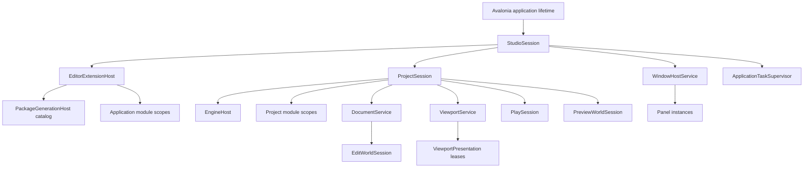
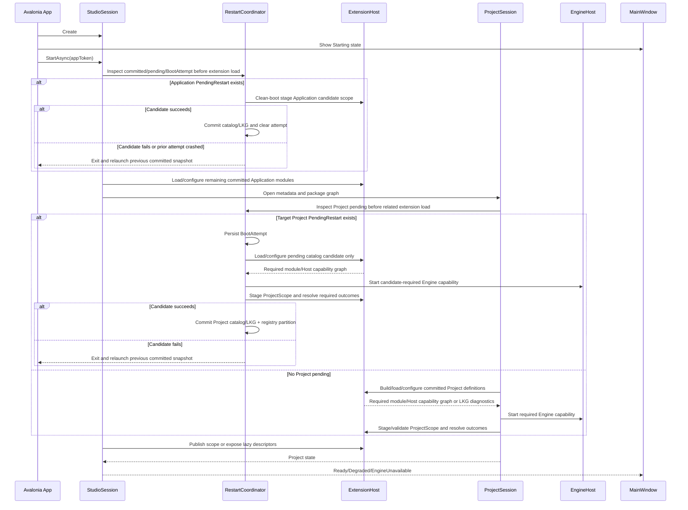
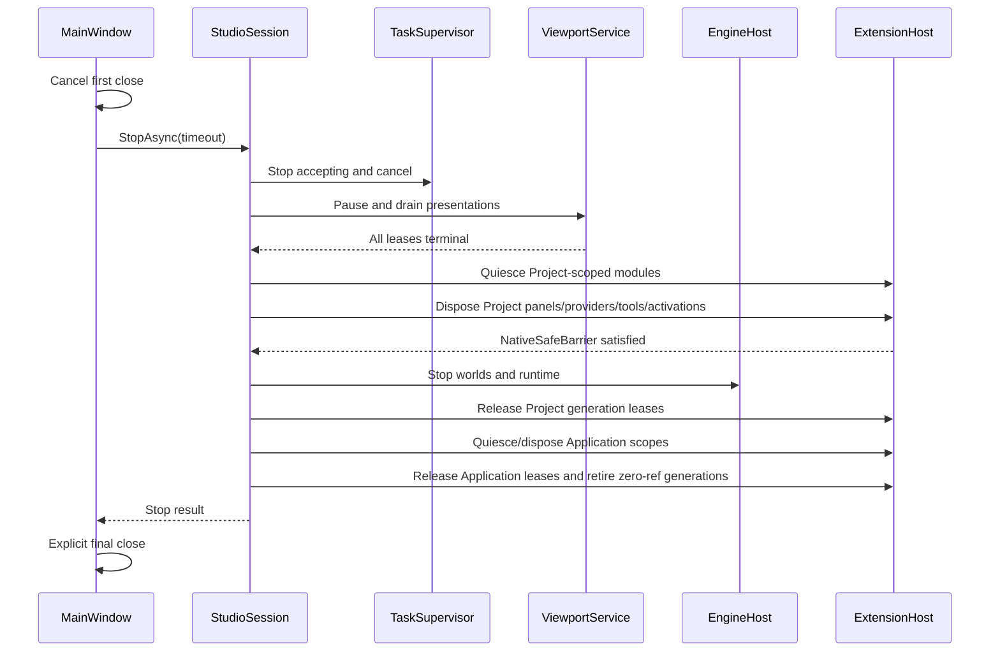

# Studio 生命周期

状态：Target（迁移中）

更新日期：2026-07-11

## 1. 目的

本文定义 Studio 应用、Project、Engine、World、Viewport、Window、Panel、extension 和异步任务的创建、运行、失败恢复与关闭顺序。

核心规则：长期资源必须有唯一 owner；停止接收新工作、取消、排空和释放是不同阶段。

## 2. 当前实现事实

当前 `StudioCompositionRoot` 同步等待 extension activation，`App.OnDesktopExit` 同步等待 session disposal，并直接调用静态 native shutdown。Scene View 自己创建 `ViewportNativeBridge`，Window 自己驱动 panel timer。

这些路径可以支撑 v0，但无法证明：

- 多 Window/Viewport 的统一关闭；
- pending present 与 compositor 使用完成；
- device lost 后重建；
- extension/provider/panel 失败隔离；
- shutdown timeout 后仍被使用的 native 资源安全。

## 3. 生命周期层级



上层 owner 可以停止下层；下层不得自行关闭上层或进程级资源。

## 4. 应用启动

应用启动采用异步状态机，Shell 可以先显示 Starting/EngineUnavailable UI。



要求：

- 构造函数只建立内存状态，不执行 native、IO 或可失败工作。
- 所有异步工作由 owner 记录 Task 和 CancellationToken。
- 普通启动失败返回结构化状态；可恢复失败不直接终止 Studio。
- `PendingRestart` candidate 已开始执行后是例外：activation failure 或未完成 BootAttempt 表示当前进程可能污染，必须记录诊断、退出并在新进程加载完整 previous committed snapshot，禁止同进程 LKG fallback。
- 启动操作可取消，并按已完成阶段逆序清理。
- 不使用 `.Result`、`.Wait()` 或 `GetAwaiter().GetResult()` 阻塞 UI thread。
- extension build 在独立 `dotnet` process 中运行；Problems/Console 接收结构化诊断，UI thread 不执行 restore/build。
- 普通 project extension 构建超时或 managed candidate 失败时使用 last-known-good；缺失 contribution 的布局位置显示 loading/error placeholder，不阻塞非相关 Shell。PendingRestart boot attempt failure 使用上述退出/relaunch 协议，不适用同进程 fallback。
- 已声明 Engine/Host capability 暂时 Unavailable 不等于 ProjectScope structural failure；依赖 module 以 Waiting/Blocked descriptor 发布，Studio 进入 EngineUnavailable/Degraded，capability 新 Epoch Ready 后再 Activate/Resume。
- 普通 committed catalog 的 ProjectScope activation fault 隔离 owner/dependent chain 并发布 error placeholder；ID/role/cycle/scope 等 structural failure 才拒绝整个 Project registry partition。PendingRestart candidate activation fault 仍使用退出/relaunch协议。

## 5. 显式关闭

Avalonia desktop lifetime 使用显式关闭策略。第一次 main-window close request 被取消，Studio 完成异步 stop 后再调用最终 shutdown。

### 5.1 Project close

Project close 必须在 native capability 仍可用时完成 managed Project scope 的终止清理：

1. `ProjectSession` 进入 `Stopping`，拒绝新的 command、provider change、panel open 和 viewport frame request。
2. `ViewportService` 停止调度新 frame，Panel/Window host detach presentation，并排空或放弃 in-flight frame lease。
3. 所有 Project-scoped module（包括 BuiltIn、Project、Package source）进入 quiesce，不再接受新工作。
4. 在 `EngineHost` 仍为 Ready/Degraded 时，逆序 deactivate 并 dispose Project-scoped Panel、provider、tool、task、subscription、factory 和 activation lease；需要 native capability 的正常清理必须在此阶段完成。
5. 撤销该 scope 的 Engine capability gate，停止 Play、Preview、Edit World 和 project providers，排空 native callback，并等待 `NativeSafeBarrier`。
6. 只有 barrier 成功后，`EngineHost` 才停止 native runtime/device。
7. 释放该 `ProjectSessionId` 持有的 Package generation scope lease。只有 `PackageGenerationHost` 的 Application/Project scope、registry/factory、Panel/UI、task 和 dependency lease 全部归零，managed-reload-eligible collectible host 才进入 ALC unload。Restart-required pinned host 回到 `InactivePinned` 并保留 exact generation 供进程内重开；BuiltIn static host 只 retire registration，不卸载 default ALC。

同一个 Application-catalog Package 可以同时包含 Application-scoped 与 Project-scoped module。关闭 Project 只销毁该 Project 的 module instance 并释放 Project scope lease；Application module 或其他 Project 仍持有 lease 时，Package ALC 必须继续存活。仅由 Project catalog 发现的 Package 不允许声明 Application scope，因此在其最后一个 Project lease 与全部 contribution lease 归零后才可整体 retire。

`NativeSafeBarrier` 至少证明：scope Engine port 已 fail-closed、不会再创建 native request；全部 extension→Engine call、native→managed callback、frame/presentation lease 已归零；仍 pending 的 task 不再持有可调用 native capability。Deactivate/Dispose 抛错或 timeout 时，Host 继续做自己的 `finally` cleanup，但不能凭 timeout 跨过 barrier。

Barrier 未满足时，Project 进入 `StopFailed/Quarantined`，保留 EngineHost，不继续执行部分 native teardown；关闭操作可以取消或重试。显式 force-exit 只能终止整个进程并写入未安全关闭诊断/恢复标记，不能在同一进程继续销毁 Engine 后声称安全。

### 5.2 Application close

Application close 先执行所有已打开 Project 的上述关闭协议，再关闭 Application scope：

若任一 Project 未通过 `NativeSafeBarrier`，Application close 停在第 7 步，不得继续 dispose Application scope或关闭 Window；只能 retry/cancel，或执行明确的 whole-process force-exit。

1. `StudioSession` 进入 `Stopping`，拒绝新 command、provider change、panel open 和 viewport frame request。
2. `ApplicationTaskSupervisor` 取消任务，并等待有 owner 的异步操作。
3. `ViewportService` 停止调度新 frame。
4. Window/Panel host detach 所有 `ViewportPresentation`。
5. Presentation adapter 完成或放弃 in-flight `ViewportFrameLease`。
6. `ViewportService` 销毁 logical viewport sessions。
7. 按 Project close 协议 quiesce、detach/deactivate/dispose Project scope，再停止 World 和 `EngineHost`，最后释放 Project generation lease。
8. 逆序 quiesce、deactivate 并 dispose Application-scoped module，不按 BuiltIn/Installed source 特判。
9. 释放 Application catalog generation lease；对 lease 已归零的 PackageGenerationHost 执行 dependents-first retire。只有 collectible host unload；Pinned/Static host 保留到进程退出。
10. 验证并保存 Dock layout。
11. 关闭 Window，执行 Avalonia explicit shutdown。



## 6. 状态机

### StudioSession

```text
Created -> Starting -> Ready
Starting -> Degraded | Faulted
Ready <-> Degraded
Ready | Degraded | Faulted -> Stopping -> Stopped
```

### ProjectSession

```text
Created -> Opening -> Ready | Degraded | EngineUnavailable
Ready | Degraded | EngineUnavailable -> Stopping
Stopping -> Stopped | StopFailed/Quarantined
StopFailed/Quarantined -> Stopping | ProcessExit
```

`StopFailed/Quarantined` 保留 EngineHost 和诊断，只允许 retry/cancel/force whole-process exit，不允许重新开放正常编辑命令。

### EngineHost

```text
Created -> Starting -> Ready
Starting -> Unavailable
Ready <-> Degraded
Ready -> DeviceLost -> Recovering -> Ready | Unavailable
Ready | Degraded | Unavailable -> Stopping -> Stopped
```

Engine/renderer capability publish 单调 Epoch。DeviceLost 先撤销旧 epoch gate，让 dependent module 按 dependents-first quiesce/Blocked并排空 callback/frame lease；新 epoch Ready 后按 dependencies-first Resume，不能 Resume 的 instance terminal dispose 后重新 Activate。该过程不重建无关 ProjectScope registry partition。

### Panel instance

```text
Created -> Attached -> Activated
Activated -> Deactivated
Deactivated -> Activated | Detached
Detached -> Attached | Disposed
Created | Attached | Deactivated -> Disposed
```

`KeepAlive` 的 Detach 是可逆状态；重新打开时，同一 content lease 可以再次 Attached/Activated。`RecreateOnOpen`、module reload、Project close 和 Application close 才进入 terminal Dispose。Dock move、float 和 reorder 不等价于 Detach。只有 logical host 关系结束时才 detach。

### Module generation

```text
Discovered -> Built -> Loaded -> Configured -> Validated
Validated -> Dormant | Activating
Dormant -> Activating -> Active
Activating -> Active
Active -> Quiescing -> Deactivating -> Disposed
Dormant -> Disposed
Any state -> Faulted -> rollback / last-known-good / disabled
```

Reload 创建新 generation，不修改旧 module object。旧 generation 必须在其全部 Panel/Control/task/provider 被 detach/dispose 后才请求 ALC unload。

`PackageGenerationHost` 是 load context、resolver、assembly table、generation-wide module definition、scope activation 和 generation lease 的唯一 owner。Module scope 并不直接拥有 load context；Application/Project scope 通过 `EditorModuleInstanceId` 和引用计数 lease 保持 generation 存活，避免一个 Project close 销毁仍承载 Application module 或其他 Project scope 的 Package。Dynamic host 按 policy 使用 collectible 或 process-lifetime pinned ALC；BuiltIn static host 的 load context 是 default ALC。

Package host terminal behavior：

```text
Collectible: Active -> Retiring -> Unloading -> Unloaded | Leaked
Pinned:      Active -> InactivePinned -> Active ... -> ProcessExit
Static:      Active -> InactiveStatic -> Active ... -> ProcessExit
```

### Viewport presentation

```text
Detached -> Attaching -> Ready <-> Suspended
Ready -> Presenting -> Ready
Ready | Suspended | Failed -> Draining -> Detached
```

## 7. 异步任务所有权

禁止丢弃影响状态或资源的 Task。`ApplicationTaskSupervisor` 至少记录：

- task id、owner id、operation name；
- cancellation source；
- started/completed time；
- terminal result 或 exception；
- shutdown 是否等待；
- timeout 后的诊断信息。

允许 fire-and-forget 的工作必须同时满足：无状态副作用、失败可忽略、无需 shutdown 等待，并通过统一 helper 观察异常。GPU present、provider refresh、layout save、document save 和 extension activation 不满足这些条件。

## 8. UI thread 与 dispatcher

- Control、visual、bound collection 和 Avalonia property 只在所属 dispatcher 上访问。
- 后台 provider 先形成 immutable snapshot，再通过 dispatcher 合并更新。
- 高频 diagnostics/progress 必须 batch/coalesce，不能每条记录独立 Post。
- Timer 只是触发器，不拥有 application、engine 或 viewport state。
- Avalonia 12 的 timer/dispatcher 必须在正确 UI thread 创建，或显式传入目标 dispatcher。

## 9. 超时与错误

Timeout 是可观察的失败，不是强制销毁的许可证。

Stop result 至少包含：

```text
Status: Completed | TimedOut | Faulted
PendingTaskIds
PendingViewportIds
PendingFrameLeaseIds
PendingExtensionIds
Diagnostics
```

处理原则：

- panel callback 抛错只隔离该 panel，不终止共享 timer；
- contribution factory 抛错禁用/隔离 contribution，不中止完整 startup；
- provider fault 不改变 snapshot 合同，health 由 provider host 管理；
- device lost 先停止新 frame，再排空旧 epoch，最后重建；
- native ABI mismatch 进入 EngineUnavailable，非渲染 UI 保持可用。

## 10. 验证

需要自动化覆盖：

- startup cancellation 每个阶段的逆序释放；
- extension/provider/panel factory fault isolation；
- Window close、Dock reset、project close 的 stop 顺序；
- pending task/lease timeout 报告；
- extension Dispose/timeout 未满足 NativeSafeBarrier 时不停止 Engine；retry 可继续，force-exit 不执行伪安全 partial teardown；
- device lost epoch 切换；
- 多 floating window 同时关闭；
- repeated stop/dispose 幂等性。
- project module 在 EngineHost 停止前完成 quiesce/deactivate；
- Project-scoped Panel/provider/tool/activation 在 EngineHost 停止前完成 terminal dispose；
- 同一 Package 同时承载 Application/Project module 时，Project close 不卸载仍被 Application scope 引用的 ALC；
- 最后一个 generation scope/factory/registry/dependency lease 释放前不会调用 ALC unload；
- restart-required Package close/reopen 复用同一 pinned generation，不重复创建 ALC；
- reload generation replacement、last-known-good rollback 和 ALC leak detection；
- extension build 不阻塞 UI thread，过期 build 结果不会激活。
- Application PendingRestart 在任何相关 extension load 前处理；Project PendingRestart 在目标 ProjectSession/Engine context 中、普通 Project activation 前处理；
- PendingRestart failure/crash 不在污染进程回退 LKG，而是退出并防 crash-loop relaunch previous snapshot；

相关文档：

- [Studio 架构总览](studio-overview.md)
- [Viewport 渲染架构](viewport-rendering.md)
- [Studio 扩展模型](studio-extension-model.md)
- [Editor 扩展构建、装载与重载](editor-extension-build-and-reload.md)
