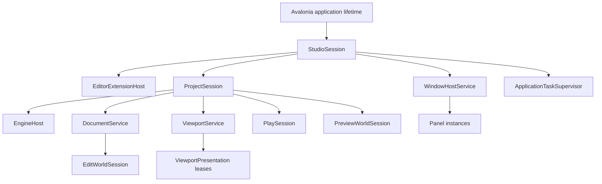
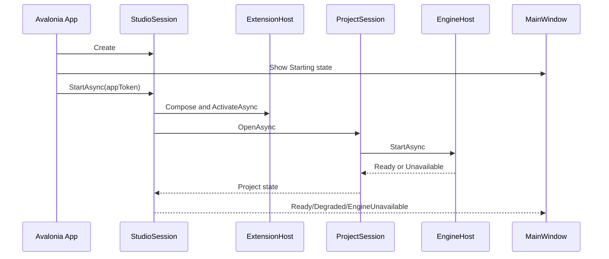
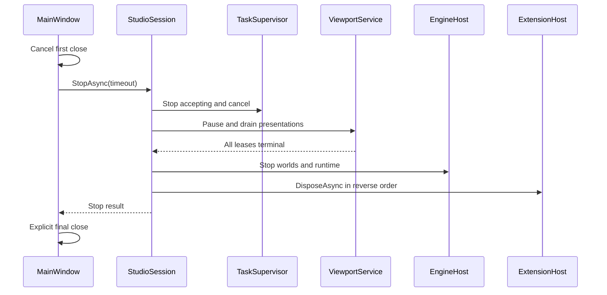

# Studio 生命周期

状态：Target（迁移中）

更新日期：2026-07-11

## 1. 目的

本文定义 Studio 应用、Project、Engine、World、Viewport、Window、Panel、extension 和异步任务的创建、运行、失败恢复与关闭顺序。

核心规则：长期资源必须有唯一 owner；停止接收新工作、取消、排空和释放是不同阶段。

## 2. 当前实现事实

当前 `StudioCompositionRoot` 同步等待 extension activation，`App.OnDesktopExit` 同步等待 session disposal，并直接调用静态 native shutdown。Scene View 自己创建 `ViewportNativeBridge`，Window 自己驱动 panel timer。

这些路径可以支撑 v0，但无法证明：

- 多 Window/Viewport 的统一关闭；
- pending present 与 compositor 使用完成；
- device lost 后重建；
- extension/provider/panel 失败隔离；
- shutdown timeout 后仍被使用的 native 资源安全。

## 3. 生命周期层级



上层 owner 可以停止下层；下层不得自行关闭上层或进程级资源。

## 4. 应用启动

应用启动采用异步状态机，Shell 可以先显示 Starting/EngineUnavailable UI。



要求：

- 构造函数只建立内存状态，不执行 native、IO 或可失败工作。
- 所有异步工作由 owner 记录 Task 和 CancellationToken。
- 启动失败返回结构化状态；可恢复失败不直接终止 Studio。
- 启动操作可取消，并按已完成阶段逆序清理。
- 不使用 `.Result`、`.Wait()` 或 `GetAwaiter().GetResult()` 阻塞 UI thread。

## 5. 显式关闭

Avalonia desktop lifetime 使用显式关闭策略。第一次 main-window close request 被取消，Studio 完成异步 stop 后再调用最终 shutdown。

关闭顺序：

1. `StudioSession` 进入 `Stopping`，拒绝新 command、provider change、panel open 和 viewport frame request。
2. `ApplicationTaskSupervisor` 取消任务，并等待有 owner 的异步操作。
3. `ViewportService` 停止调度新 frame。
4. Window/Panel host detach 所有 `ViewportPresentation`。
5. Presentation adapter 完成或放弃 in-flight `ViewportFrameLease`。
6. `ViewportService` 销毁 logical viewport sessions。
7. 停止 Play、Preview、Edit World 和 project providers。
8. `EngineHost` 停止 native runtime/device。
9. `EditorExtensionHost` 逆序释放 activation/registration leases。
10. 验证并保存 Dock layout。
11. 关闭 Window，执行 Avalonia explicit shutdown。



## 6. 状态机

### StudioSession

```text
Created -> Starting -> Ready
Starting -> Degraded | Faulted
Ready <-> Degraded
Ready | Degraded | Faulted -> Stopping -> Stopped
```

### EngineHost

```text
Created -> Starting -> Ready
Starting -> Unavailable
Ready <-> Degraded
Ready -> DeviceLost -> Recovering -> Ready | Unavailable
Ready | Degraded | Unavailable -> Stopping -> Stopped
```

### Panel instance

```text
Created -> Attached -> Activated <-> Deactivated -> Detached -> Disposed
```

Dock move、float 和 reorder 不等价于 Detach。只有 logical host 关系结束时才 detach。

### Viewport presentation

```text
Detached -> Attaching -> Ready <-> Suspended
Ready -> Presenting -> Ready
Ready | Suspended | Failed -> Draining -> Detached
```

## 7. 异步任务所有权

禁止丢弃影响状态或资源的 Task。`ApplicationTaskSupervisor` 至少记录：

- task id、owner id、operation name；
- cancellation source；
- started/completed time；
- terminal result 或 exception；
- shutdown 是否等待；
- timeout 后的诊断信息。

允许 fire-and-forget 的工作必须同时满足：无状态副作用、失败可忽略、无需 shutdown 等待，并通过统一 helper 观察异常。GPU present、provider refresh、layout save、document save 和 extension activation 不满足这些条件。

## 8. UI thread 与 dispatcher

- Control、visual、bound collection 和 Avalonia property 只在所属 dispatcher 上访问。
- 后台 provider 先形成 immutable snapshot，再通过 dispatcher 合并更新。
- 高频 diagnostics/progress 必须 batch/coalesce，不能每条记录独立 Post。
- Timer 只是触发器，不拥有 application、engine 或 viewport state。
- Avalonia 12 的 timer/dispatcher 必须在正确 UI thread 创建，或显式传入目标 dispatcher。

## 9. 超时与错误

Timeout 是可观察的失败，不是强制销毁的许可证。

Stop result 至少包含：

```text
Status: Completed | TimedOut | Faulted
PendingTaskIds
PendingViewportIds
PendingFrameLeaseIds
PendingExtensionIds
Diagnostics
```

处理原则：

- panel callback 抛错只隔离该 panel，不终止共享 timer；
- contribution factory 抛错禁用/隔离 contribution，不中止完整 startup；
- provider fault 不改变 snapshot 合同，health 由 provider host 管理；
- device lost 先停止新 frame，再排空旧 epoch，最后重建；
- native ABI mismatch 进入 EngineUnavailable，非渲染 UI 保持可用。

## 10. 验证

需要自动化覆盖：

- startup cancellation 每个阶段的逆序释放；
- extension/provider/panel factory fault isolation；
- Window close、Dock reset、project close 的 stop 顺序；
- pending task/lease timeout 报告；
- device lost epoch 切换；
- 多 floating window 同时关闭；
- repeated stop/dispose 幂等性。

相关文档：

- [Studio 架构总览](studio-overview.md)
- [Viewport 渲染架构](viewport-rendering.md)
- [Studio 扩展模型](studio-extension-model.md)
