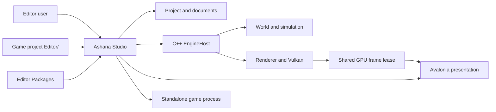
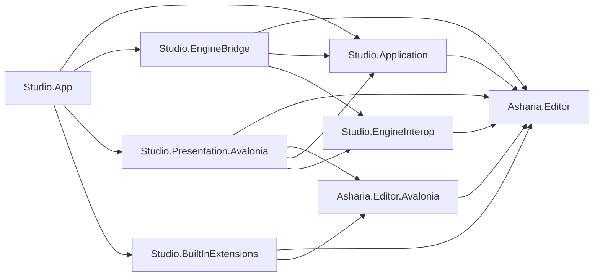

# Studio 架构总览

状态：Target（迁移中）

更新日期：2026-07-11

## 1. 目的

Studio 是 Asharia 游戏引擎的跨平台编辑器应用。它承担：

- 项目、文档、选择、命令、事务和工具工作流；
- Edit World、Play World 和 Preview World 的编辑器编排；
- 多窗口、多 Viewport、Dock 和 Avalonia presentation；
- 项目 `Editor/`、Package 和 built-in extension 的开发与宿主；
- native engine/runtime/renderer 的受控宿主与诊断入口。

Studio 不拥有 Engine truth。World、simulation、renderer、Vulkan device、GPU resource 和 native thread 由 C++ Engine 拥有；Studio 通过稳定 contract 发送 authoring intent 并投影 revisioned snapshot。

## 2. 当前实现

当前 `apps/studio` 是一个 `Editor.csproj` Avalonia 应用，目录分为 `Core`、`Shell`、`UI`、`Features` 和 `Tests`。已有 Dock、command、diagnostics、selection、transaction、built-in extension host、Code-first UI、Scene snapshot、panel scheduler 和 Windows Scene View GPU interop 的 v0 路径。

当前仍为 Partial：

- `Core` 混合 UI-neutral model、service、P/Invoke、native adapter 和部分 Avalonia vocabulary；
- App、View、Shell 和静态 native API 分散拥有启动与关闭；
- `WorkbenchFeatureModule` 聚合大多数 Feature 和 fixture provider；
- 尚无公共 `Asharia.Editor` assembly、项目 `Editor/` build 或 Package loader；
- `ViewportScheduler` 未接入 production frame loop；
- Scene View bridge 固定使用 Windows NT handle；
- 尚无正式 Project/Edit/Play/Preview session、Game View 和 Linux/macOS backend。

这些事实只约束迁移顺序，不是目标边界。

## 3. 核心原则

### 3.1 一套 Editor API，多种来源

Built-in Feature、项目根 `Editor/`、Package `Editor/` 和 installed plugin 使用相同 `Asharia.Editor.EditorModule`。来源只影响发现、启用、缓存和 reload policy，不影响 contribution 能力。

Shell、Dock、Window、EngineHost 和 platform backend 是 Host infrastructure，不伪装成拥有特权的插件。Built-in Feature 只引用公共 Editor API，持续验证项目开发者得到的能力。

Module scope 与来源正交：Application scope 每 Studio process 一个 instance，Project scope 每 `ProjectSession` 一个 instance。内置 Scene/Hierarchy/Inspector 是 BuiltIn source + Project scope；不能从 BuiltIn source 推导全局 lifetime。

### 3.2 Editor 拥有 authoring，Engine 拥有 runtime truth

```text
UI/extension intent
  -> public Editor command/service
  -> Application command/transaction
  -> EngineHost port
  -> native world mutation
  -> immutable revisioned snapshot
  -> Editor UI projection
```

ViewModel 和 extension 不保存 native pointer、Vulkan object 或可变 Engine object。Snapshot 是读取投影，不是写入入口。

### 3.3 同进程不等于无边界

近期 EngineHost、extension 和 Avalonia 运行在同一进程，以保持低延迟和 GPU resource sharing。上层 contract 不依赖 P/Invoke 或同进程假设；不可信 extension 仍需要未来独立进程，`AssemblyLoadContext` 不是安全沙箱。

### 3.4 Viewport 是会话资源，不是控件

逻辑 `ViewportSession` 独立于 Dock tab、Window、Avalonia Control 和 composition surface。Dock/float/resize 只改变 presentation binding，不转移 renderer ownership。

### 3.5 生命周期必须有唯一 owner

每个长期对象必须回答：谁创建、谁停止接收工作、谁取消/等待任务、谁释放、超时如何报告。禁止用 static shutdown、View 析构、GC/finalizer 或插件 unload 隐式承担 Engine/GPU 生命周期。

### 3.6 当前事实与目标合同分开

Architecture/ADR 定义目标；源码和测试定义当前实现。历史 spec/plan 不覆盖正式架构。未实现目标必须标记 Target/Partial。

## 4. 系统上下文



## 5. 目标项目边界



### Public Editor Framework

- `Asharia.Editor`：stable ID、snapshot、command、transaction、selection、module/contribution、service port 和 Code-first UI-neutral API；
- `Asharia.Editor.Avalonia`：可选复杂 UI bridge，允许 panel content Control/XAML，但不暴露 Window/Dock/native ownership。

### Studio Host

- `Asharia.Studio.Application`：session、document、extension build/load/host、command、transaction 和 scheduling；
- `Asharia.Studio.EngineInterop`：GPU frame lease、external resource descriptor 与 ownership narrow waist；
- `Asharia.Studio.EngineBridge`：native loading、ABI、Engine/World/Viewport adapter；
- `Asharia.Studio.Presentation.Avalonia`：Window、Dock、Code-first reconciler、Avalonia extension host 和 GPU import；
- `Asharia.Studio.App`：唯一 composition root 和 platform startup。

### Built-in dogfooding

- `Asharia.Studio.BuiltInExtensions`：Hierarchy、Inspector、Scene/Game View、Console、Problems、Frame Debugger 等 Feature；
- 只引用 `Asharia.Editor`/`Asharia.Editor.Avalonia`；
- 不引用 Application、EngineBridge 或 Presentation implementation。

详细 project、目录和迁移规则见 [Studio 代码框架设计](studio-code-framework.md)。

## 6. 所有权矩阵

| 资源 | Owner | 消费者 | 禁止拥有者 |
| --- | --- | --- | --- |
| Application lifetime | `StudioSession` | App/Shell | Feature View/extension |
| Project lifetime | `ProjectSession` | documents/extensions | Window |
| Package/module generation | `PackageGenerationHost`（由 `EditorExtensionHost` catalog/编排） | contribution hosts | Panel instance |
| Build artifact/cache | extension build service | loader/diagnostics | Extension code |
| Contribution registration | extension host | typed registries | Extension runtime instance |
| Panel instance | panel instance host | Dock/Window host | Registry |
| Window/Dock layout | Presentation host | Panel content | Extension |
| Native runtime/device | `EngineHost` | Application ports | App static/ViewModel/Control |
| Edit World | engine world session | Scene View/Hierarchy/Inspector | Dock tab |
| Play World | `PlaySession` | Game View/debug tools | Edit document |
| Preview World | preview session | Asset preview | Asset View |
| Viewport logical state | Viewport service | Scene/Game/Preview panel | Window |
| Avalonia surface | presentation host | compositor adapter | Native renderer/extension |
| Frame GPU resource | native frame lease | Avalonia importer | GC/finalizer/extension |

## 7. 依赖红线

- `Asharia.Editor` 不依赖 Avalonia、Studio Host、P/Invoke、filesystem implementation 或 native handle；
- BuiltInExtensions 不依赖 Application/Bridge/Presentation internal implementation；
- Application 不依赖 Avalonia、P/Invoke、renderer backend 或 Feature View；
- EngineBridge 不依赖 Avalonia、Dock 或 Feature；
- Presentation 不调用 P/Invoke、不创建 Engine/World、不记录 Vulkan command；
- Extension 不创建 top-level Window、不修改 Dock tree、不注入全局 style、不持有 native pointer；
- Scene/Inspector/Asset mutation 必须经过 command/transaction/revision contract；
- Platform GPU handle 只能通过 EngineInterop lease 跨边界；
- Code-first extension 不访问 Avalonia；Avalonia extension只提供 Host content。

## 8. 核心数据流

读取：

```text
native engine state
  -> EngineBridge adapter
  -> immutable revisioned snapshot
  -> Application provider/projection
  -> public Editor service
  -> extension panel/ViewModel
  -> Code-first or Avalonia View
```

写入：

```text
UI intent
  -> EditorCommandService
  -> document transaction
  -> EditWorld mutation(expected revision)
  -> typed result/change set
  -> undo + dirty state commit
  -> publish new snapshot
```

Extension 构建/加载：

```text
Editor/ or Package
  -> optional asmdef + package metadata
  -> fingerprint + dotnet build
  -> staged AssemblyLoadContext
  -> module configure/validate/activate
  -> registry generation
  -> last-known-good rollback on failure
```

## 9. 跨平台基线

Studio 架构同时支持 Windows、Linux 和 macOS：

- managed extension 统一使用 `.asmdef`、Package schema、SDK project 和 `dotnet build`；
- 路径使用 `Path` API，不序列化平台 separator；
- filesystem watcher 只作触发，fingerprint 是 build truth；
- native library 和 GPU interop 通过 platform backend/capability negotiation；
- RID 至少覆盖 `win-x64`、`linux-x64`、`osx-x64`、`osx-arm64`；
- extension 不直接选择 Win32/X11/Wayland/Cocoa handle；
- Play/Game View 的嵌入式/独立窗口策略由 session/presentation contract 控制。

## 10. 迁移顺序

不执行一次性重写：

1. 建立本文档、统一扩展 ADR 和 authoring contract；
2. 提取最小 `Asharia.Editor` 与现有 adapter，保持行为不变；
3. 提取 `Asharia.Editor.Avalonia` 和 Code-first/Avalonia backend boundary；
4. 建立 BuiltInExtensions project reference gate，逐个迁移 Feature module；
5. 拆 Application、EngineInterop、EngineBridge、Presentation 和唯一 App root；
6. 实现项目 `Editor/`、`.asmdef`、Package resolver、build diagnostics 和 last-known-good；
7. 完成 panel/provider/task release tracking 后启用 collectible ALC reload；
8. 完成 Project/Edit/Play/Preview domain、Game View 和三平台 Viewport backend。

每一步必须保持可构建、可测试，并为旧 API 提供短期 compatibility adapter；不得让过渡 adapter 成为新的 public contract。

## 11. 验证

当前阶段：

```powershell
dotnet test apps\studio\Editor.sln -c Release
powershell -ExecutionPolicy Bypass -File tools\check-text-encoding.ps1 -Root apps\studio
git diff --check
```

项目拆分后增加：

- project reference matrix；
- public API compatibility baseline；
- BuiltInExtensions public-only dependency test；
- project/Package extension build/load/reload integration fixture；
- Windows/Linux/macOS RID and path matrix；
- viewport/play native platform smoke。

## 12. 已知缺口

- 八项目边界尚未落地；
- 现有 Code-first contract 仍在 `Core`，built-in Feature 仍可访问 Shell implementation；
- 项目 `Editor/`、`.asmdef`、Package 和 ALC pipeline 未实现；
- App shutdown 仍有 sync-over-async；
- Game View、PlaySession 和 standalone orchestration 未完成；
- Linux/macOS GPU presentation 尚未验证；
- 部分 architecture test 仍按源码路径/字符串断言。

已知缺口是迁移输入，不能通过放宽目标边界消除。

## 13. 相关文档

- [Studio 代码框架设计](studio-code-framework.md)
- [Editor 扩展开发模型](editor-extension-authoring.md)
- [Editor 扩展构建、装载与重载](editor-extension-build-and-reload.md)
- [Avalonia/XAML Editor 扩展规范](editor-extension-avalonia.md)
- [Studio 统一扩展模型](studio-extension-model.md)
- [Studio 生命周期](studio-lifecycle.md)
- [编辑世界与 Play Mode](editor-worlds-and-play-mode.md)
- [Viewport 渲染架构](viewport-rendering.md)
- [ADR-0004：统一 Editor Extension Framework](../adr/0004-unified-editor-extension-framework.md)
- [ADR-0005：managed Editor module 构建与重载](../adr/0005-managed-editor-module-build-and-reload.md)
