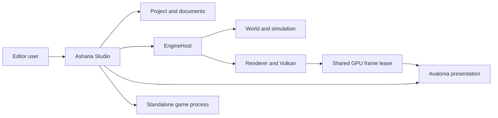
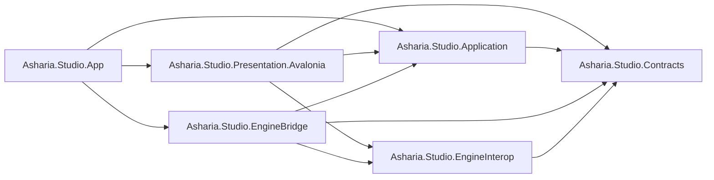

# Studio 架构总览

状态：Target（迁移中）

更新日期：2026-07-11

## 1. 目的

Studio 是 Asharia 游戏引擎的编辑器应用。它同时承担：

- 项目、文档、选择、命令、事务和工具工作流；
- Edit World、Play World 和 Preview World 的编辑器编排；
- 多窗口、多 Viewport、Dock 和 Avalonia presentation；
- native engine/runtime/renderer 的受控宿主与诊断入口。

Studio 不是 engine truth 的拥有者。World、simulation、renderer、Vulkan device、GPU resource 和 native thread 由 native engine 拥有；Studio 通过稳定合同组织 authoring 行为并投影状态。

## 2. 当前实现状态

当前 `apps/studio` 是一个 `Editor.csproj` Avalonia 应用，目录分为 `Core`、`Shell`、`UI`、`Features` 和 `Tests`。已有 Dock、command、diagnostics、selection、transaction、extension host、Scene snapshot、panel scheduler 和 Windows Scene View GPU interop 的 v0 路径。

当前实现仍是 Partial：

- `Core` 同时放置 UI-neutral model、service、P/Invoke 和 native adapter；
- `App`、View、Shell 和静态 native API 分散拥有启动与关闭；
- `WorkbenchFeatureModule` 聚合大多数内置 Feature 和 fixture provider；
- `ViewportScheduler` 未接入生产 frame loop；
- Scene View bridge 固定使用 Windows NT handle；
- 尚无正式 `ProjectSession`、`EditWorldSession`、`PlaySession`、Game View 和跨平台 backend。

这些事实用于约束迁移顺序，不代表目标架构应继续保留这些边界。

## 3. 核心原则

### 3.1 编辑器拥有 authoring，Engine 拥有 runtime truth

```text
Studio intent
  -> Application command/transaction
  -> EngineHost port
  -> native world mutation
  -> immutable revisioned snapshot
  -> Studio ViewModel projection
```

ViewModel 不保存 native pointer、Vulkan object 或可变 engine object。Snapshot 是 UI 投影，不是写入入口。

### 3.2 同进程不等于无边界

近期 `EngineHost` 与 Avalonia 运行在同一进程，以保持低延迟和 GPU 资源共享。上层合同不依赖 P/Invoke 或同进程假设，未来可以增加 IPC transport。

### 3.3 Viewport 是会话资源，不是控件

逻辑 `ViewportSession` 独立于 Dock tab、Window 和 `CompositionDrawingSurface`。Dock/float/resize 只改变 presentation binding，不转移或隐式销毁 renderer ownership。

### 3.4 生命周期必须有唯一 owner

每个长期对象都必须回答：谁创建、谁停止接收工作、谁等待进行中任务、谁释放、超时如何报告。禁止用静态 shutdown 或 View 析构隐式承担 engine/GPU 生命周期。

### 3.5 当前事实和目标合同分开记录

目标文档使用 Target；实现落地后才改为 Current。过时 spec 不得继续充当架构总纲。

## 4. 目标上下文



## 5. 目标项目边界

迁移完成后使用六个项目建立编译期约束：



### `Asharia.Studio.Contracts`

拥有 stable ID、immutable snapshot、command/result、贡献元数据和 UI-neutral model。禁止依赖 Avalonia、P/Invoke、文件系统和具体 engine 实现。

### `Asharia.Studio.Application`

拥有 `StudioSession`、`ProjectSession`、documents、transactions、selection、diagnostics、调度策略和 engine/world/asset/viewport ports。禁止创建 Control 或调用 P/Invoke。

### `Asharia.Studio.EngineInterop`

拥有 native/IPC adapter 与 presentation adapter 共享的窄协议：`ViewportFrameLease`、外部 GPU resource descriptor、ownership/transference、capability 和 completion result。它可以表达 opaque native-sized handle，但不导入 handle、不调用 P/Invoke、不引用 Avalonia。

### `Asharia.Studio.EngineBridge`

拥有 native library loading、ABI negotiation、C ABI packet、opaque native session handle，以及 Application port 的 native 实现。它把 ABI packet 转换成 `EngineInterop` lease，不引用 Avalonia。

### `Asharia.Studio.Presentation.Avalonia`

拥有 Window、Dock、View、ViewModel、DataTemplate、dispatcher、input adapter、composition surface 和 GPU resource import。它不拥有 engine/world/GPU allocation。

### `Asharia.Studio.App`

拥有唯一 composition root、平台启动、模块装配、native runtime 定位和异步应用生命周期。它不承载 Feature 业务。

## 6. 所有权矩阵

| 资源 | Owner | 观察者/消费者 | 禁止拥有者 |
| --- | --- | --- | --- |
| Application lifetime | `StudioSession` | App/Shell | Feature View |
| Project lifetime | `ProjectSession` | documents/features | Window |
| Native runtime/device | `EngineHost` | Application ports | App static、ViewModel、Control |
| Edit World | `SceneDocument` 对应的 engine session | Scene View/Hierarchy/Inspector | Dock tab |
| Play World | `PlaySession` | Game View/debug tools | Edit document |
| Preview World | preview service/session | asset preview viewport | Asset View |
| Viewport logical state | `ViewportService` | Scene/Game/Preview panels | Window |
| Avalonia surface | presentation host | compositor adapter | native renderer |
| Frame GPU resources | native frame lease protocol | Avalonia importer | GC/finalizer |
| Panel instance | panel instance host | Dock | extension registry |
| Contribution registration | extension host | typed registries | panel instance |

## 7. 依赖红线

- Contracts 不依赖 Avalonia、Shell、Feature、native implementation 或文件系统。
- Application 不依赖 Avalonia、P/Invoke、renderer backend 或具体 Feature View。
- EngineBridge 不依赖 Avalonia、Dock 或 Feature。
- Presentation 不调用 P/Invoke，不创建 engine/world，不记录 Vulkan command。
- Feature 不创建顶层 Window，不修改 Dock tree，不持有 native pointer。
- Engine/runtime 不依赖 editor panel、Avalonia 或 authoring-only ViewModel。
- Scene/Inspector mutation 必须经过 command/transaction/revision 合同。
- Platform GPU handle 只能通过 EngineInterop lease 跨边界。

## 8. 运行数据流

读取路径：

```text
native engine state
  -> EngineBridge adapter
  -> immutable revisioned snapshot
  -> Application provider/projection
  -> Feature ViewModel
  -> Avalonia View
```

写入路径：

```text
UI intent
  -> EditorCommandService
  -> SceneDocument transaction
  -> EditWorldSession mutation(expected revision)
  -> mutation result/change set
  -> commit undo and dirty state
  -> publish new snapshot
```

渲染路径见 [Viewport 渲染架构](viewport-rendering.md)，世界和 Play Mode 见 [编辑世界与 Play Mode](editor-worlds-and-play-mode.md)。

## 9. 迁移策略

不执行一次性重写。迁移顺序为：

1. 建立本文档和 ADR 的权威性。
2. 拆出 Contracts、Application、EngineInterop。
3. 建立异步 `StudioSession` 和唯一 `EngineHost` owner。
4. 统一 panel/viewport frame scheduling 与 presentation lifecycle。
5. 重做生产 native viewport contract 和三平台 backend。
6. 建立 Project/Edit/Play/Preview domain 和 transaction write path。
7. 拆分内置 Feature module，完成 Dock、多窗口和 accessibility。

每一步必须保持应用可构建、可测试，并提供兼容 adapter 迁移旧代码。

## 10. 验证

从仓库根目录执行，架构变化至少验证：

```powershell
dotnet test apps\studio\Editor.sln -c Release
powershell -ExecutionPolicy Bypass -File tools\check-text-encoding.ps1 -Root apps\studio
git diff --check
```

项目拆分后增加 project-reference 约束测试。Viewport、Play Mode 和 native bridge 的平台验证见各专题文档。

## 11. 已知迁移缺口

- 六项目边界尚未落地。
- 当前 `Core/Interop` 仍混合 native/Avalonia vocabulary。
- App 启动和关闭仍有 sync-over-async。
- Game View、PlaySession 和 standalone orchestration 尚未实现。
- Linux/macOS GPU presentation 尚未验证。
- 当前 architecture tests 中仍有按源码路径和字符串断言的规则。

这些缺口是迁移输入，不应通过放宽目标边界来消除。
