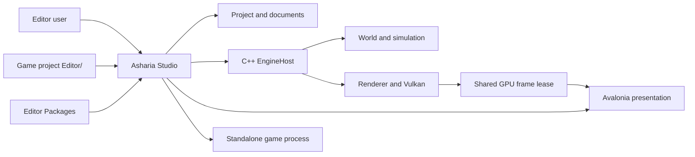
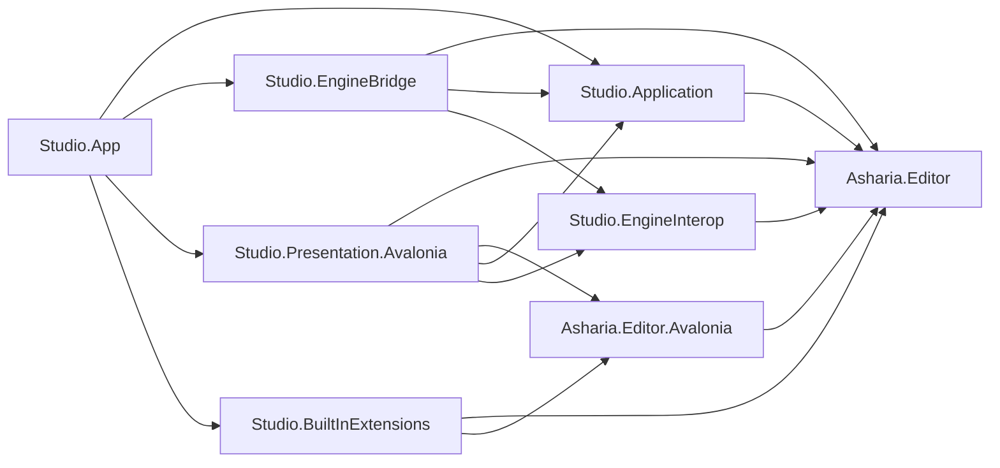

# Studio 架构总览

状态：Target（迁移中）

更新日期：2026-07-26

## 1. 目的

Studio 是 Asharia 游戏引擎的跨平台编辑器应用。它承担：

- 项目、文档、选择、命令、事务和工具工作流；
- Edit World、Play World 和 Preview World 的编辑器编排；
- 多窗口、多 Viewport、Dock 和 Avalonia presentation；
- 项目 `Editor/`、Package 和 built-in extension 的开发与宿主；
- native engine/runtime/renderer 的受控宿主与诊断入口。

Studio 不拥有 Engine truth。World、simulation、renderer、Vulkan device、GPU resource 和 native thread 由 C++ Engine 拥有；Studio 通过稳定 contract 发送 authoring intent 并投影 revisioned snapshot。

## 2. 当前实现

当前 production `apps/studio` 仍由 `Editor.csproj` Avalonia host 与迁移中的 managed projects 共同组成，目录分为
`Core`、`Shell`、`UI`、`Features`、`src` 和 `Tests`。已有 Dock、command、diagnostics、selection、transaction、
built-in extension host、Code-first UI、Scene snapshot、panel scheduler 和 Windows Scene View GPU interop 的 v0 路径。
`Asharia.Studio.sln` 已包含独立 `Asharia.Editor`、`Asharia.Runtime.Contracts` 与
`Asharia.Studio.Application`；Application 已拥有 static module host 基线和只读 Editor Image inventory
verifier，并可从 current inventory lease 投影 Distribution-bound managed build environment inventory；
Project Code 还能把该 projection 复验为 semantic build credential，并为 caller 已规范化的项目根
`Editor/**/*.cs` 原子生成 implicit SDK workspace，再使用 credential-bound dotnet closure 执行隔离
restore/build 并发布四类 raw build output；current raw-output lease 现在还能经过无执行 artifact metadata
inspection，并原子复制成带 deterministic `artifact.json` 的 closed immutable publication，再对
implementation/reference metadata 建立 path-free module index，并把 non-empty current index 签发为 staging
candidate receipt，随后在任何 load 前固定选择 `Pinned + RestartRequired` host policy；actual loader/ALC
尚未落地。

当前仍为 Partial：

- `Core` 混合 UI-neutral model、service、P/Invoke、native adapter 和部分 Avalonia vocabulary；
- App、View、Shell 和静态 native API 分散拥有启动与关闭；
- `WorkbenchFeatureModule` 聚合大多数 Feature 和 fixture provider；
- `Asharia.Editor` 与 `Asharia.Studio.Application` 已有独立合同和 static host 基线，但项目 `Editor/` build、
  Package loader 与 dynamic generation 尚未形成闭环；
- `ViewportScheduler` 未接入 production frame loop；
- Scene View bridge 固定使用 Windows NT handle；
- 尚无正式 Project/Edit/Play/Preview session、Game View 和 Linux/macOS backend。

这些事实只约束迁移顺序，不是目标边界。

### 2.1 当前 Editor Image inventory handoff

`Asharia.Studio.Application.Bootstrap.Distribution` 当前接受外部 owner 已选择的 canonical
`EngineGenerationId` 和对应 generation root。它严格复验 Distribution manifest identity、Editor Image
清单与每个声明文件的 size/SHA-256，拒绝 reparse escape 和产品 Python payload，成功后只签发进程内、
可撤销的 exact Editor Image lease。

该 lease 不是完整 `VerifiedInstalledDistribution` 或 `DistributionHealthReport`：它不复验 bundled
package、package artifact 或 Host Profile bytes，也不拥有 current selection、repair、install、update 或
restart。后继 Project Code 服务只能从 current lease 查询声明文件，不能重新扫描任意目录。

`EngineDistributionManagedBuildEnvironmentLoader` 进一步只读取 inventory 中固定的
`metadata/managed-build-environment.json`，把 `managed/dotnet` 下的 host、exact SDK、hostfxr、host runtime、
reference pack 和 `bin/` 下两份 Runtime/Editor contract 绑定成可撤销 projection lease。dotnet root 必须对
这些选择保持 closed；loader 只把调用方提供的 process context 与 lease 交叉核对，projection identity 同时
绑定 Engine generation、context、声明与 selected file evidence。该 projection 仍不是 build execution
credential：它不解析 SDK XML/runtimeconfig 或 assembly identity，不运行 `dotnet`，也不扫描 PATH、global
SDK 或 inventory 外目录。

`ProjectCodeBuildEnvironmentCredentialResolver` 只接受 current projection lease。它重新 hash 每个 selected
file，枚举且只枚举 exact `managed/dotnet` root 以证明实际目录没有未登记增删，再用 `PEReader`/CLR metadata、
禁用外部 import 的 SDK XML 和拒绝 duplicate/roll-forward drift 的 runtimeconfig 交叉验证 Windows x64
dotnet/hostfxr、SDK entry、Host runtime、`Microsoft.NETCore.App.Ref/ref/net10.0` 全集与两份 Host contract。
credential identity 绑定 Engine generation、projection 和 semantic identities；source/derived revoke、byte
drift 或 dotnet-root closure drift 后都不能继续作为 execution selection。该 credential 仍不启动 `dotnet`、
不生成 workspace、不加载 assembly，也不代表 build result 或 generation candidate。Linux/macOS semantic
binary policy 等对应 producer 落地后另行扩展，当前不从 Windows PE 合同推测。

`ProjectCodeImplicitSdkWorkspaceBuilder` 再只接受 current credential lease、caller 已规范化的 project root/
`projectId` 和全新 cache output path。它只快照 exact project-root `Editor/**/*.cs`，拒绝 `.asmdef`、reparse、
非 canonical/MSBuild-unrepresentable source path 与预算越界，把 source 和两份 Host contract 的 exact bytes
复制到 builder-owned staging，并生成固定 `global.json`、NuGet/MSBuild barrier、SDK-style library project 和
stable output handoff 后以 directory move 原子发布。assembly identity 只由 canonical UUID 派生；workspace
identity 绑定 credential、source/contract/generated bytes，不包含 checkout/cache 绝对路径。source、credential
或 workspace closure 漂移后 build-input current check 失败。

`ProjectCodeSdkBuildController` 只接受 current immutable workspace lease 与全新 raw-output path。每次调用把
workspace 复制到 controller-owned 短临时根，从 semantic credential 的 exact dotnet closure 物化并封住 execution
mirror，清空 ambient environment 后只放入受控的 CLI/NuGet/MSBuild/TEMP 路径。它依次执行 exact SDK probe、
explicit restore 与 `build --no-restore`；进程不经过 shell，stdout/stderr 有界，timeout/cancel 会终止整个进程树，
同一 project 的新调用 supersede 旧调用。每个外部步骤后重新验证 workspace 与 SDK mirror，最后只复制并 hash
implementation DLL、reference DLL、portable PDB 和 `.deps.json`，在确认输入仍 current 后原子发布 immutable raw
output lease。raw output identity 绑定 workspace identity 与四个文件 envelope，不绑定 checkout、cache 或临时路径。
该 controller 不解析 CLR metadata、不生成 module index、不加载 candidate。

`ProjectCodeArtifactInspector` 只接受 current raw-output lease。它在检查前后复验 source/credential/workspace 与
四文件 envelope，只用 BCL `PEReader`/`MetadataReader` 读取 implementation/reference identity、module/MVID、
IL-only flags、exact `ReferenceAssemblyAttribute` 和 credential reference closure；portable PDB 必须由 PE
CodeView/content ID 关联且只含 canonical `PathMap` document，`.deps.json` 必须精确匹配当前 net10.0
single-project shape。成功报告只含相对路径、hash 和 path-free metadata，report identity 跨等价 physical
output root 稳定。该步骤不调用 `Assembly.Load`/`MetadataLoadContext`、不创建 ALC，也不发布 generation
candidate。

`ProjectCodeArtifactPublisher` 只接受 current raw-output lease 与 caller 提供的全新 publication root，并在内部
重新运行 inspector，不接受 caller 拼装 report 或任意 artifact root。它使用 bounded BCL async stream 把
implementation DLL、reference DLL、portable PDB 和 `.deps.json` 复制到同父 staging，复制时 hash、复制后再
独立复验，生成 path-free deterministic `artifact.json`，确认 exact 五文件 closed tree 与 raw lease 仍 current
后只用一次 directory rename 提交。失败、取消、source/staging drift 或 existing/overlap/reparse path 不覆盖 final
root，并清理 publisher-owned staging。receipt 的 absolute root 只负责当前进程寻址；publication 本身不生成
module index，不创建 `current`/`latest`、generation、active/LKG 或 ALC。

`ProjectCodeModuleIndexer` 只接受 `ProjectCodeArtifactPublicationReceipt`，扫描前后都通过 publisher 复验
receipt、deterministic manifest 与 exact closed tree。inspector report 显式携带 credential 选定的 exact
`Asharia.Editor` identity，因此 moduleless assembly 即使没有 Editor assembly reference 也能产生合法空索引。
indexer 只使用 BCL `PEReader`/`MetadataReader`/`CustomAttribute.DecodeValue` 同时读取 implementation 与
reference assembly；声明必须来自 exact contract 的 `EditorModuleAttribute`，type 必须是 public top-level sealed、
non-abstract、non-generic、direct `EditorModule` subtype 并有 public parameterless constructor。双 assembly
module surface、definition/type uniqueness 和 enum payload 必须完全一致。成功 index 只含 path-free declaration
facts，identity 对等 publication root 稳定；空 index 不表示 load eligibility。它不写文件、不加载或执行 assembly，
也不创建 ALC。

`ProjectCodeStagingCandidateAdmitter` 同样只接受 publication receipt，并在内部重新调用 indexer，不接受
caller-supplied index/entry/type/host policy。empty index fail closed；non-empty index 与 publication identity
形成 path-free、content-addressed candidate identity，签发前 publication 必须再次 current。receipt 持有的
publication absolute root 仍只是当前进程 locator，不参与 candidate identity；后继 consumer 可通过
`IsCandidateCurrentAsync` 重新索引并对证完整 surface。candidate 仅允许后继 loader 开始预执行验证，不证明
Collectible/Pinned/Static host、managed reload eligibility 或 activation 安全性。`.asmdef`、Package/Avalonia
resources、NuGet lock、aggregate host、actual loader 与 ALC generation 仍是后继边界。

`ProjectCodeHostPolicySelector` 只接受 current staging candidate，不接受 caller-supplied host kind、
replacement policy 或 reason。当前 v1 使用 external `dotnet build`，虽然 inspector 已把 closure 收紧为
单 project assembly 与固定 Host/Framework references，但没有 resource/native/global-side-effect、线程/
静态订阅或 cooperative-unload evidence；selector 因而对全部 activation/handover 组合 fail closed 到
`Pinned + RestartRequired`。policy identity 只绑定 candidate id 与稳定 policy facts，继承的 publication root
仍只是 locator。`IsPolicyCurrentAsync` 会重算 identity 并复验 candidate；该步骤不创建 ALC、不加载/实例化/
Configure/Activate module，也不写文件。后继 exact pinned loader 必须消费并再次复验该 receipt，不能临时升级
为 Collectible。

这些是 Application 层的产品策略，直接使用 .NET BCL 文件 API。Avalonia `IStorageProvider` 只负责用户文件
选择、bookmark 和平台权限 UI；native Core File IO 服务于 C++ engine/runtime 的低层 IO 与事务，不反向成为
Studio managed bootstrap 的依赖。

## 3. 核心原则

### 3.1 一套 Editor API，多种来源

Built-in Feature、项目根 `Editor/`、Package `Editor/` 和 installed plugin 使用相同 `Asharia.Editor.EditorModule`。来源只影响发现、启用、缓存和 reload policy，不影响 contribution 能力。

Shell、Dock、Window、EngineHost 和 platform backend 是 Host infrastructure，不伪装成拥有特权的插件。Built-in Feature 只引用公共 Editor API，持续验证项目开发者得到的能力。

Module scope 与来源正交：Application scope 每 Studio process 一个 instance，Project scope 每 `ProjectSession` 一个 instance。内置 Scene/Hierarchy/Inspector 是 BuiltIn source + Project scope；不能从 BuiltIn source 推导全局 lifetime。

### 3.2 Editor 拥有 authoring，Engine 拥有 runtime truth

```text
UI/extension intent
  -> public Editor command/service
  -> Application command/transaction
  -> EngineHost port
  -> native world mutation
  -> immutable revisioned snapshot
  -> Editor UI projection
```

ViewModel 和 extension 不保存 native pointer、Vulkan object 或可变 Engine object。Snapshot 是读取投影，不是写入入口。

### 3.3 同进程不等于无边界

近期 EngineHost、extension 和 Avalonia 运行在同一进程，以保持低延迟和 GPU resource sharing。上层 contract 不依赖 P/Invoke 或同进程假设；不可信 extension 仍需要未来独立进程，`AssemblyLoadContext` 不是安全沙箱。

### 3.4 Viewport 是会话资源，不是控件

逻辑 `ViewportSession` 独立于 Dock tab、Window、Avalonia Control 和 composition surface。Dock/float/resize 只改变 presentation binding，不转移 renderer ownership。

### 3.5 生命周期必须有唯一 owner

每个长期对象必须回答：谁创建、谁停止接收工作、谁取消/等待任务、谁释放、超时如何报告。禁止用 static shutdown、View 析构、GC/finalizer 或插件 unload 隐式承担 Engine/GPU 生命周期。

### 3.6 当前事实与目标合同分开

Architecture/ADR 定义目标；源码和测试定义当前实现。历史 spec/plan 不覆盖正式架构。未实现目标必须标记 Target/Partial。

## 4. 系统上下文


```mermaid
flowchart LR
    User["Editor user"] --> Studio["Asharia Studio"]
    Project["Game project Editor/"] --> Studio
    Packages["Editor Packages"] --> Studio
    Studio --> Documents["Project and documents"]
    Studio --> Engine["C++ EngineHost"]
    Engine --> Runtime["World and simulation"]
    Engine --> Renderer["Renderer and Vulkan"]
    Studio --> Avalonia["Avalonia presentation"]
    Renderer --> Interop["Shared GPU frame lease"]
    Interop --> Avalonia
    Studio --> Standalone["Standalone game process"]
```

## 5. 目标项目边界


```mermaid
flowchart LR
    Editor["Asharia.Editor"]
    EditorAvalonia["Asharia.Editor.Avalonia"]
    Application["Studio.Application"]
    Interop["Studio.EngineInterop"]
    Bridge["Studio.EngineBridge"]
    Presentation["Studio.Presentation.Avalonia"]
    BuiltIn["Studio.BuiltInExtensions"]
    App["Studio.App"]

    EditorAvalonia --> Editor
    Application --> Editor
    Interop --> Editor
    Bridge --> Editor
    Bridge --> Application
    Bridge --> Interop
    Presentation --> Editor
    Presentation --> EditorAvalonia
    Presentation --> Application
    Presentation --> Interop
    BuiltIn --> Editor
    BuiltIn --> EditorAvalonia
    App --> Application
    App --> Bridge
    App --> Presentation
    App --> BuiltIn
```

### Public Editor Framework

- `Asharia.Editor`：stable ID、snapshot、command、transaction、selection、module/contribution、service port 和 Code-first UI-neutral API；
- `Asharia.Editor.Avalonia`：可选复杂 UI bridge，允许 panel content Control/XAML，但不暴露 Window/Dock/native ownership。

### Studio Host

- `Asharia.Studio.Application`：session、document、extension build/load/host、command、transaction 和 scheduling；
- `Asharia.Studio.EngineInterop`：GPU frame lease、external resource descriptor 与 ownership narrow waist；
- `Asharia.Studio.EngineBridge`：native loading、ABI、Engine/World/Viewport adapter；
- `Asharia.Studio.Presentation.Avalonia`：Window、Dock、Code-first reconciler、Avalonia extension host 和 GPU import；
- `Asharia.Studio.App`：唯一 composition root 和 platform startup。

### Built-in dogfooding

- `Asharia.Studio.BuiltInExtensions`：Hierarchy、Inspector、Scene/Game View、Console、Problems、Frame Debugger 等 Feature；
- 只引用 `Asharia.Editor`/`Asharia.Editor.Avalonia`；
- 不引用 Application、EngineBridge 或 Presentation implementation。

详细 project、目录和迁移规则见 [Studio 代码框架设计](studio-code-framework.md)。

## 6. 所有权矩阵

| 资源 | Owner | 消费者 | 禁止拥有者 |
| --- | --- | --- | --- |
| Application lifetime | `StudioSession` | App/Shell | Feature View/extension |
| Project lifetime | `ProjectSession` | documents/extensions | Window |
| Package/module generation | `PackageGenerationHost`（由 `EditorExtensionHost` catalog/编排） | contribution hosts | Panel instance |
| Build artifact/cache | extension build service | loader/diagnostics | Extension code |
| Contribution registration | extension host | typed registries | Extension runtime instance |
| Panel instance | panel instance host | Dock/Window host | Registry |
| Window/Dock layout | Presentation host | Panel content | Extension |
| Native runtime/device | `EngineHost` | Application ports | App static/ViewModel/Control |
| Edit World | engine world session | Scene View/Hierarchy/Inspector | Dock tab |
| Play World | `PlaySession` | Game View/debug tools | Edit document |
| Preview World | preview session | Asset preview | Asset View |
| Viewport logical state | Viewport service | Scene/Game/Preview panel | Window |
| Avalonia surface | presentation host | compositor adapter | Native renderer/extension |
| Frame GPU resource | native frame lease | Avalonia importer | GC/finalizer/extension |

## 7. 依赖红线

- `Asharia.Editor` 不依赖 Avalonia、Studio Host、P/Invoke、filesystem implementation 或 native handle；
- BuiltInExtensions 不依赖 Application/Bridge/Presentation internal implementation；
- Application 不依赖 Avalonia、P/Invoke、renderer backend 或 Feature View；
- EngineBridge 不依赖 Avalonia、Dock 或 Feature；
- Presentation 不调用 P/Invoke、不创建 Engine/World、不记录 Vulkan command；
- Extension 不创建 top-level Window、不修改 Dock tree、不注入全局 style、不持有 native pointer；
- Scene/Inspector/Asset mutation 必须经过 command/transaction/revision contract；
- Platform GPU handle 只能通过 EngineInterop lease 跨边界；
- Code-first extension 不访问 Avalonia；Avalonia extension只提供 Host content。

## 8. 核心数据流

读取：

```text
native engine state
  -> EngineBridge adapter
  -> immutable revisioned snapshot
  -> Application provider/projection
  -> public Editor service
  -> extension panel/ViewModel
  -> Code-first or Avalonia View
```

写入：

```text
UI intent
  -> EditorCommandService
  -> document transaction
  -> EditWorld mutation(expected revision)
  -> typed result/change set
  -> undo + dirty state commit
  -> publish new snapshot
```

Extension 构建/加载：

```text
externally selected EngineGenerationId + generation root
  -> exact, revocable Editor Image inventory lease
  -> exact, revocable managed build environment inventory lease
  -> exact, revocable semantic build credential
Editor/ or Package + credential
  -> optional asmdef + package metadata
  -> fingerprint + dotnet build
  -> staged AssemblyLoadContext
  -> module configure/validate/activate
  -> registry generation
  -> last-known-good rollback on failure
```

## 9. 跨平台基线

Studio 架构同时支持 Windows、Linux 和 macOS：

- managed extension 统一使用 `.asmdef`、Package schema、SDK project 和 `dotnet build`；
- 路径使用 `Path` API，不序列化平台 separator；
- filesystem watcher 只作触发，fingerprint 是 build truth；
- native library 和 GPU interop 通过 platform backend/capability negotiation；
- RID 至少覆盖 `win-x64`、`linux-x64`、`osx-x64`、`osx-arm64`；
- extension 不直接选择 Win32/X11/Wayland/Cocoa handle；
- Play/Game View 的嵌入式/独立窗口策略由 session/presentation contract 控制。

## 10. 迁移顺序

不执行一次性重写：

1. 建立本文档、统一扩展 ADR 和 authoring contract；
2. 提取最小 `Asharia.Editor` 与现有 adapter，保持行为不变；
3. 提取 `Asharia.Editor.Avalonia` 和 Code-first/Avalonia backend boundary；
4. 建立 BuiltInExtensions project reference gate，逐个迁移 Feature module；
5. 拆 Application、EngineInterop、EngineBridge、Presentation 和唯一 App root；
6. 实现项目 `Editor/`、`.asmdef`、Package resolver、build diagnostics 和 last-known-good；
7. 完成 panel/provider/task release tracking 后启用 collectible ALC reload；
8. 完成 Project/Edit/Play/Preview domain、Game View 和三平台 Viewport backend。

每一步必须保持可构建、可测试，并为旧 API 提供短期 compatibility adapter；不得让过渡 adapter 成为新的 public contract。

## 11. 验证

当前阶段：

```powershell
dotnet test apps\studio\Editor.sln -c Release
powershell -ExecutionPolicy Bypass -File tools\check-text-encoding.ps1 -Root apps\studio
git diff --check
```

项目拆分后增加：

- project reference matrix；
- public API compatibility baseline；
- BuiltInExtensions public-only dependency test；
- project/Package extension build/load/reload integration fixture；
- Windows/Linux/macOS RID and path matrix；
- viewport/play native platform smoke。

## 12. 已知缺口

- 八项目边界尚未落地；
- 现有 Code-first contract 仍在 `Core`，built-in Feature 仍可访问 Shell implementation；
- Project Code 当前已落地 exact Editor Image、managed build environment inventory lease 与 Windows x64
  semantic build credential、caller-bound 项目根 `Editor/**/*.cs` implicit SDK workspace，以及 credential-bound
  isolated restore/build、immutable raw output、no-execute artifact metadata report 和 closed inspected artifact
  publication、no-load dual-assembly module index、non-empty staging candidate admission 与 pre-load
  `Pinned + RestartRequired` policy selection；正式 ProjectSession/manifest handoff、`.asmdef`、Package、
  actual loader 和 ALC pipeline 尚未实现；
- App shutdown 仍有 sync-over-async；
- Game View、PlaySession 和 standalone orchestration 未完成；
- Linux/macOS GPU presentation 尚未验证；
- 部分 architecture test 仍按源码路径/字符串断言。

已知缺口是迁移输入，不能通过放宽目标边界消除。

## 13. 相关文档

- [Studio 代码框架设计](studio-code-framework.md)
- [Editor 扩展开发模型](editor-extension-authoring.md)
- [Editor 扩展构建、装载与重载](editor-extension-build-and-reload.md)
- [Avalonia/XAML Editor 扩展规范](editor-extension-avalonia.md)
- [Studio 统一扩展模型](studio-extension-model.md)
- [Studio 生命周期](studio-lifecycle.md)
- [编辑世界与 Play Mode](editor-worlds-and-play-mode.md)
- [Viewport 渲染架构](viewport-rendering.md)
- [ADR-0004：统一 Editor Extension Framework](../adr/0004-unified-editor-extension-framework.md)
- [ADR-0005：managed Editor module 构建与重载](../adr/0005-managed-editor-module-build-and-reload.md)
