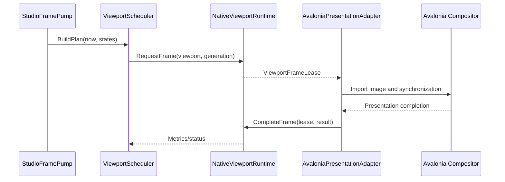

# Viewport 渲染架构

状态：Target（Windows 当前为 Experimental/Partial）

更新日期：2026-07-11

## 1. 目的

本文定义 Studio 的 Scene、Game、Asset Preview、Thumbnail 和 Debug Viewport，覆盖多 Viewport 调度、Avalonia presentation、跨平台 GPU 共享、frame lease、resize、device lost、输入和关闭。

## 2. 当前实现事实

当前 Scene View 已能在 Windows 路径中：

- 创建 Avalonia `CompositionDrawingSurface`；
- 查询 compositor GPU capability；
- 从 native bridge 获取 Vulkan image/semaphore packet；
- 使用 `UpdateWithSemaphoresAsync` 更新 surface。

当前实现仍是 Experimental/Partial：

- handle 类型固定为 `VulkanOpaqueNtHandle`；
- View 自己创建 bridge；
- packet/managed import/native release 的完成边界不完整；
- `ViewportScheduler` 没有生产调用者；
- 多 floating window scheduler 驱动不一致；
- Linux/macOS 未验证；
- Game View 和 Preview View 未接入。

## 3. 三种不同对象

必须区分：

### ViewportSession

逻辑编辑器 viewport，拥有 ID、world target、camera、render mode、overlay、input mode 和 scheduling policy。它不拥有 Window 或 Avalonia Control。

### ViewportPresentation

ViewportSession 与一个 Avalonia composition surface 的临时绑定。Dock move/float/reattach 只替换 presentation。

### Native render target/frame

Native renderer 拥有的 offscreen image、memory、semaphore 和 GPU work。Managed presentation 只持有明确生命周期的 frame lease。

## 4. Viewport identity

```text
ViewportId
ViewportRole: Scene | Game | AssetPreview | Thumbnail | Debug
WorldSessionId
CameraState
RenderMode
EditorOverlaySet
InputRoutingMode
RenderPolicy
SurfaceGeneration
```

多个 Viewport 可以共享 World 和 Vulkan device，但 camera、render target、presentation、generation 和 in-flight state 独立。

## 5. Frame 与时钟分离

| 时钟 | Owner | 作用 |
| --- | --- | --- |
| UI dispatcher | Avalonia | input/layout/binding/visual |
| Editor update | Studio Application | tools/commands/selection/diagnostics |
| Simulation tick | Native Engine | gameplay/physics/scripts/world |
| Render scheduling | ViewportService/Renderer | extraction/GPU/presentation |

`StudioFramePump` 是 UI 侧唯一全局节拍源，但不推进 gameplay simulation。它调用：

- `PanelUpdateScheduler`：普通面板的低成本编辑器更新；
- `ViewportScheduler`：Viewport priority、fairness、budget 和 backpressure；
- native renderer：执行 render plan。

## 6. 调度策略

建议优先级：

1. 正在接收输入的可见 Viewport；
2. active window 中的可见 Viewport；
3. 其他可见 Viewport；
4. background preview/thumbnail；
5. hidden/minimized Viewport，通常 suspended。

同一优先级使用 round-robin 或 aging，禁止按稳定 ID 永久排序后截断。调度器必须记录上次服务时刻和 in-flight frame，避免饿死与无界排队。

Render policy 至少表达：

```text
Continuous(target FPS)
OnDemand(dirty/repaint)
Paused
Hidden
FrameDebug(single-step)
```

## 7. Presentation generation

每次 attach、resize、render-scale change、backend recovery 和 device recovery 增加 `SurfaceGeneration`。

异步结果只有同时匹配以下字段才允许更新当前状态：

```text
EngineEpoch
ViewportId
SurfaceGeneration
FrameSequence
```

旧 generation 的 probe、frame 和 completion 只完成资源释放，不更新 ViewModel 或 surface。

## 8. 跨平台 backend

公共合同不包含 Avalonia handle-name 字符串或 Windows-specific packet。

| 平台 | Image | Synchronization |
| --- | --- | --- |
| Windows | Vulkan opaque Win32/NT handle | opaque Win32 semaphore 或 capability 支持的 timeline path |
| Linux | Vulkan opaque FD 或 DMA-BUF | semaphore FD 或 capability 支持路径 |
| macOS | MoltenVK 导出的 IOSurface/Metal texture | `MTLSharedEvent`/timeline synchronization |

具体 runtime 必须同时查询：

- Avalonia compositor 支持的 image/semaphore types；
- compositor device LUID/UUID 或平台 device identity；
- native Vulkan physical device capability；
- format/color-space/extent 限制；
- automatic、binary semaphore 或 timeline semaphore 同步能力。

存在 enum/extension 不等于目标设备支持；不匹配时进入明确的 Unsupported/DeviceMismatch 状态。

## 9. EngineInterop frame lease

`ViewportFrameLease` 是平台 GPU 资源跨 native/presentation 边界的唯一容器。

最小字段：

```text
LeaseId
EngineEpoch
ViewportId
SurfaceGeneration
FrameSequence
Extent
Format
ColorSpace
ImageDescriptor
WaitSynchronizationDescriptor
SignalSynchronizationDescriptor
OwnershipPolicy
```

每个 descriptor 明确：

- resource kind；
- handle value 或 transport token；
- borrowed、duplicated、transferred 或 reference-counted；
- import success/failure 后谁 close/release；
- duplicate import 是否允许；
- terminal completion 后 native 何时可以 reuse。

Lease 必须恰好完成一次：

```text
Presented
Abandoned
ImportFailed
StaleGeneration
ShutdownCancelled
```

重复 completion 是 contract error。GC/finalizer 只能作为泄漏诊断，不能保证 GPU 正确性。

## 10. Frame flow



UI thread 不等待 Vulkan fence。没有可证明的同步路径时，该 backend 必须拒绝 presentation，而不是猜测资源已经可读。

## 11. Embedded 与 standalone

Scene View、Embedded Game View、Editor Window Game View 使用 shared-image composition。

Standalone Game 使用 native Window、`VkSurfaceKHR` 和 swapchain。它不经过 Avalonia compositor，是 fullscreen/HDR/VR/raw input/present latency 的验证路径。

两条路径共享 renderer/world 语义，但 presentation backend、input、性能指标和故障边界不同。

## 12. Input routing

Scene View input 先进入 editor tool/router，再形成 camera、selection、gizmo 或 transaction command。Game View input 经 `GameViewInputAdapter` 形成 normalized engine input packet。

必须明确：

- focus 与 keyboard shortcut 优先级；
- pointer capture 和 emergency release；
- relative mouse 与 confinement；
- IME/text input；
- gamepad target；
- Play pause/stop 快捷键不被 gameplay 永久吞掉。

## 13. Resize、隐藏和 detach

- DIP bounds 与 render scale 转换成 pixel extent；
- extent 改变创建新 generation，不原地复用不兼容 image；
- hidden/minimized presentation 停止 continuous render request；
- Dock move 不销毁 ViewportSession；
- visual detach 进入 Draining，完成当前 lease 后释放 imported wrapper；
- native resource 在 compositor/native GPU 双方完成前不得回收。

## 14. Device lost

处理顺序：

1. `EngineHost` 标记 DeviceLost，拒绝新 frame。
2. `ViewportService` suspend 所有 presentation。
3. 提升 `EngineEpoch`，使旧结果自动失效。
4. 排空/放弃旧 lease 和 imported resource。
5. native engine 重建设备与 renderer resource。
6. surviving ViewportSession 重新创建 render target。
7. presentation 以新 generation reattach。

重建失败进入 EngineUnavailable，Studio 非渲染功能继续运行。

## 15. 验证矩阵

每个平台至少验证：

- 两个以上同时渲染的 Viewport；
- Scene 与 Game View target 不同 World；
- Dock→float→Dock；
- resize、DPI change、minimize、restore、hide、close、reopen；
- import failure、stale generation、device mismatch、device lost；
- scheduler fairness、backpressure 和 dropped frame；
- 无 validation error、handle leak、pending lease 和无界队列；
- deterministic shutdown。

记录硬件、驱动、Avalonia backend、Vulkan device、分辨率、Viewport 数量和 build configuration。测量 input latency、render-to-compositor latency、CPU/GPU time、GPU memory 和 drain time。

## 16. 外部合同依据

- Avalonia custom rendering：<https://docs.avaloniaui.net/docs/graphics-animation/custom-rendering>
- Avalonia `ICompositionGpuInterop`：<https://docs.avaloniaui.net/api/avalonia/rendering/composition/icompositiongpuinterop>
- Vulkan external synchronization：<https://docs.vulkan.org/spec/latest/chapters/synchronization.html>
- Vulkan external memory guide：<https://docs.vulkan.org/guide/latest/extensions/external.html>
- Vulkan Metal objects：<https://docs.vulkan.org/refpages/latest/refpages/source/VK_EXT_metal_objects.html>
- MoltenVK：<https://github.com/KhronosGroup/MoltenVK>
