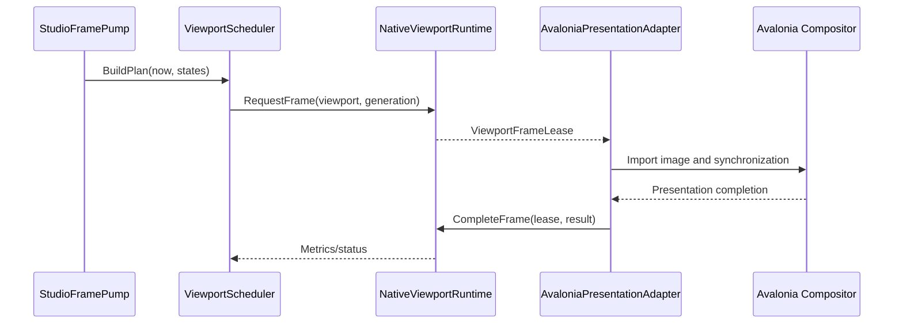

# Viewport 渲染架构

状态：Target（Windows 当前为 Experimental/Partial）

更新日期：2026-07-30

## 1. 目的

本文定义 Studio 的 Scene、Game、Asset Preview、Thumbnail 和 Debug Viewport，覆盖多 Viewport 调度、Avalonia presentation、跨平台 GPU 共享、frame lease、resize、device lost、输入和关闭。

## 2. 当前实现事实

当前 Scene View 已能在 Windows 路径中：

- 创建 Avalonia `CompositionDrawingSurface`；
- 查询 compositor GPU capability；
- 通过单一 `SceneViewPresentationSession` 保存 latest request、generation、sequence、
  双槽、backpressure 和 drain 状态；
- 在串行后台 producer 上创建或重录 native present slot；
- Scene View 默认按需渲染；初始 attach、Bounds/DPI、scene revision 和显式交互
  invalidation 先合并到单一 queued composition update，再采样最新状态触发帧请求；
  静止且场景不变时不加入固定帧率 panel tick；
- 每个 slot 只导入一次 image 和两枚 semaphore，并使用
  `UpdateWithSemaphoresAsync` 的完成任务作为 compositor 使用期边界；
- resize 时保持最后成功帧的原始 DIP 尺寸，在最新 Bounds 中居中裁剪，不缩放旧帧；
- 关闭、detach 和 reattach 时先排空 frame/slot，再在 UI dispatcher 释放
  composition surface；
- shared viewport runtime 不把单独安装的 Vulkan SDK validation layer 作为 Studio
  运行时前提；它保留 optional debug labels。严格 validation 仍由显式加载 SDK layer
  的 native editor / renderer smoke 门禁承担。

当前实现仍是 Experimental/Partial：

- handle 类型固定为 `VulkanOpaqueNtHandle`；
- View 自己创建 bridge；
- `ViewportScheduler` 没有生产调用者；
- 多 floating window scheduler 驱动不一致；
- Linux/macOS 未验证；
- Game View 和 Preview View 未接入。

## 3. 三种不同对象

必须区分：

### ViewportSession

逻辑编辑器 viewport，拥有 ID、world target、camera、render mode、overlay、input mode 和 scheduling policy。它不拥有 Window 或 Avalonia Control。

### ViewportPresentation

ViewportSession 与一个 Avalonia composition surface 的临时绑定。Dock move/float/reattach 只替换 presentation。

### Native render target/frame

Native renderer 拥有的 offscreen image、memory、semaphore 和 GPU work。Managed
presentation 持有明确生命周期的 present slot；slot 的 compositor completion 完成后才能
再次提交，detach/resize retirement 完成后才能释放 native resource。

## 4. Viewport identity

```text
ViewportId
ViewportRole: Scene | Game | AssetPreview | Thumbnail | Debug
WorldSessionId
CameraState
RenderMode
EditorOverlaySet
InputRoutingMode
RenderPolicy
SurfaceGeneration
```

多个 Viewport 可以共享 World 和 Vulkan device，但 camera、render target、presentation、generation 和 in-flight state 独立。

## 5. Frame 与时钟分离

| 时钟 | Owner | 作用 |
| --- | --- | --- |
| UI dispatcher | Avalonia | input/layout/binding/visual |
| Editor update | Studio Application | tools/commands/selection/diagnostics |
| Simulation tick | Native Engine | gameplay/physics/scripts/world |
| Render scheduling | ViewportService/Renderer | extraction/GPU/presentation |

`StudioFramePump` 是 UI 侧唯一全局节拍源，但不推进 gameplay simulation。它调用：

- `PanelUpdateScheduler`：普通面板的低成本编辑器更新；
- `ViewportScheduler`：Viewport priority、fairness、budget 和 backpressure；
- native renderer：执行 render plan。

## 6. 调度策略

建议优先级：

1. 正在接收输入的可见 Viewport；
2. active window 中的可见 Viewport；
3. 其他可见 Viewport；
4. background preview/thumbnail；
5. hidden/minimized Viewport，通常 suspended。

同一优先级使用 round-robin 或 aging，禁止按稳定 ID 永久排序后截断。调度器必须记录上次服务时刻和 in-flight frame，避免饿死与无界排队。

Render policy 至少表达：

```text
Continuous(target FPS)
OnDemand(dirty/repaint)
Paused
Hidden
FrameDebug(single-step)
```

Scene View 默认选择 `OnDemand`。只有相机/工具交互、场景或渲染设置变化、resize/DPI、
初始帧缺失时才置 dirty 并请求一帧；静止且没有动画内容时复用最后成功帧。需要动画材质、
粒子、实时预览或 Play Session 时，调用方必须显式选择 `Continuous(target FPS)`，并在
动画结束后恢复 `OnDemand`。这与 Unity Scene View 的公开行为一致：默认只在必要时重绘，
固定间隔刷新由单独的 `alwaysRefresh` 状态启用。

`InteractiveBurst` 只覆盖仍在进行的输入交互；burst 结束后直接回到 dirty-only。调度器
不伪造 5 FPS idle repaint，`VisibleExposed` 只能由真实 expose/resize 事件写入。

## 7. Presentation generation

每次 attach、resize、render-scale change、backend recovery 和 device recovery 增加 `SurfaceGeneration`。

异步结果只有同时匹配以下字段才允许更新当前状态：

```text
EngineEpoch
ViewportId
SurfaceGeneration
FrameSequence
```

旧 generation 的 probe、frame 和 completion 只完成资源释放，不更新 ViewModel 或 surface。
当前 generation 的 active chain 与旧 generation 的 retirement backlog 分开计数；backlog
可以短暂包含多个历史 extent，但 active、retiring、reservation 和 quarantine 总量有界，
不能因连续 resize 建立无界资源队列。

## 8. 跨平台 backend

公共合同不包含 Avalonia handle-name 字符串或 Windows-specific packet。

| 平台 | Image | Synchronization |
| --- | --- | --- |
| Windows | Vulkan opaque Win32/NT handle | opaque Win32 semaphore 或 capability 支持的 timeline path |
| Linux | Vulkan opaque FD 或 DMA-BUF | semaphore FD 或 capability 支持路径 |
| macOS | MoltenVK 导出的 IOSurface/Metal texture | `MTLSharedEvent`/timeline synchronization |

具体 runtime 必须同时查询：

- Avalonia compositor 支持的 image/semaphore types；
- compositor device LUID/UUID 或平台 device identity；
- native Vulkan physical device capability；
- format/color-space/extent 限制；
- automatic、binary semaphore 或 timeline semaphore 同步能力。

存在 enum/extension 不等于目标设备支持；不匹配时进入明确的 Unsupported/DeviceMismatch 状态。

## 9. EngineInterop frame lease

`ViewportFrameLease` 是平台 GPU 资源跨 native/presentation 边界的唯一容器。

最小字段：

```text
LeaseId
EngineEpoch
ViewportId
SurfaceGeneration
FrameSequence
Extent
Format
ColorSpace
ImageDescriptor
WaitSynchronizationDescriptor
SignalSynchronizationDescriptor
OwnershipPolicy
```

每个 descriptor 明确：

- resource kind；
- handle value 或 transport token；
- borrowed、duplicated、transferred 或 reference-counted；
- import success/failure 后谁 close/release；
- duplicate import 是否允许；
- terminal completion 后 native 何时可以 reuse。

Lease 必须恰好完成一次：

```text
Presented
Abandoned
ImportFailed
StaleGeneration
ShutdownCancelled
```

重复 completion 是 contract error。GC/finalizer 只能作为泄漏诊断，不能保证 GPU 正确性。

## 10. Frame flow


```mermaid
sequenceDiagram
    participant Pump as StudioFramePump
    participant Scheduler as ViewportScheduler
    participant Native as NativeViewportRuntime
    participant Adapter as AvaloniaPresentationAdapter
    participant Compositor as Avalonia Compositor

    Pump->>Scheduler: BuildPlan(now, states)
    Scheduler->>Native: RequestFrame(viewport, generation)
    Native-->>Adapter: ViewportFrameLease
    Adapter->>Compositor: Import image and synchronization
    Compositor-->>Adapter: Presentation completion
    Adapter->>Native: CompleteFrame(lease, result)
    Native-->>Scheduler: Metrics/status
```

UI thread 不等待 Vulkan fence。没有可证明的同步路径时，该 backend 必须拒绝 presentation，而不是猜测资源已经可读。

## 11. Embedded 与 standalone

Scene View、Embedded Game View、Editor Window Game View 使用 shared-image composition。

Standalone Game 使用 native Window、`VkSurfaceKHR` 和 swapchain。它不经过 Avalonia compositor，是 fullscreen/HDR/VR/raw input/present latency 的验证路径。

两条路径共享 renderer/world 语义，但 presentation backend、input、性能指标和故障边界不同。

## 12. Input routing

Scene View input 先进入 editor tool/router，再形成 camera、selection、gizmo 或 transaction command。Game View input 经 `GameViewInputAdapter` 形成 normalized engine input packet。

必须明确：

- focus 与 keyboard shortcut 优先级；
- pointer capture 和 emergency release；
- relative mouse 与 confinement；
- IME/text input；
- gamepad target；
- Play pause/stop 快捷键不被 gameplay 永久吞掉。

## 13. Resize、隐藏和 detach

详细决策见
[ADR-0006：视口交互 Resize 采用最新请求合并与代际提交](../adr/0006-viewport-interactive-resize.md)。

- 同一次 Bounds/DPI 观察同时捕获原始 DIP size、render scale、pixel extent、generation
  和 frame sequence；禁止从 pixel extent 反推 DIP size；
- extent、render scale、attach 或 device epoch 改变时创建新 generation，不原地复用
  不兼容 image；
- presentation 始终只保存一个 latest pending request；连续 resize 覆盖旧 pending，
  不为历史 Bounds 建立队列；
- Bounds/DPI/scene invalidation 先合并到一个 queued composition update；每个合成周期
  至多捕获一次最新观察并启动一次 producer，Bounds 回调不直接创建 native work；
- 与当前 pending/in-flight request 完全相同的观察不会创建新 sequence，避免固定
  invalidation 在首帧较慢时持续使自身过期；当前工作完成后才允许同内容的下一帧；
- native create/render/submit 在串行 producer worker 执行；composition import、commit
  和 dispose 只在 compositor dispatcher 执行；
- 新 generation 会取消仍停留在 producer gate 前、尚未开始 native 的旧 generation
  工作；已经进入 native/GPU/compositor 的工作不可取消，只能完成并按代际退役；
- 单个 composition surface 的更新串行提交；只有成功 completion 能推进“最后成功帧”
  状态，失败始终恢复到最后成功帧，不能把尝试尺寸当成已呈现尺寸；
- completion 只有匹配当前 engine epoch、viewport、generation 和 sequence 才能更新
  surface 或 ViewModel；stale completion 只退役资源；
- 旧 generation 保持最后成功帧的原始尺寸，在当前 Bounds 中居中并由 host clip；
  不缩放、不变形。新 extent 首帧与精确 visual geometry 在同一个 composition update
  中提交；
- 不使用“两次相同尺寸”或固定 debounce 作为正确性条件；两个 active slot 都忙或总
  native lane 已满时保留 latest request；active/retirement completion 直接唤醒，
  native `Unavailable` 只请求下一次 compositor cadence，不运行固定 retry timer；
- 当前 extent 的首个成功帧会自动 warm 第二个持久 slot，之后静止；过期 slot 移交独立
  retirement backlog 后不再占 active-chain 配额；
- active chain 最多两个当前-generation slot；active、retiring、create reservation 与
  quarantine 合计仍受四个 native frame-resource lane 的硬上限约束；
- capability probe 不属于 resize 热路径；
- attach 时若 capability probe 早于布局、尚无有效 Bounds，则缓存成功 capability；
  Bounds 首次有效时只重试 extent-dependent presentation 配置，不重新读取 capability；
  Unsupported/失败状态不会因后续 resize 重复 probe；
- presentation 配置完成后，后续 Bounds 变化只提交 latest frame request；
- UI dispatcher 不等待 Vulkan fence、queue idle 或 device idle；
- hidden/minimized presentation 停止 continuous render request；
- Dock move 不销毁 ViewportSession；
- visual detach 进入 Draining，完成当前 lease 后释放 imported wrapper；
- imported wrapper 的异步释放没有确认完成时，slot 进入进程期 quarantine；
  wrapper 与 native packet 都保持存活，native runtime 延迟 shutdown，不能假定
  `DisposeAsync` 可重试或提前销毁共享 Vulkan resource；
- 应用关闭先同步通知所有已注册 presentation 进入 Draining，再等待这些任务，不能只
  统计当时恰好运行中的 frame task；
- 关闭等待超过诊断阈值进入显式 process-exit fallback：停止提交、保留仍在途的
  managed/native resource、不调用 native runtime teardown，再由进程终止统一回收；
  该路径单独标记，不能伪装为正常 drain 成功；
- native viewport runtime owner 使用 process-lifetime storage；正常路径仍由显式
  `shutdown()` 释放 producer/context，fallback 路径则避免 CRT 在 quarantine packet
  尚存时隐式析构 Vulkan device；
- composition surface 在 presentation drain 完成后才由 UI dispatcher 销毁；
- native resource 在 compositor/native GPU 双方完成前不得回收。

## 14. Device lost

处理顺序：

1. `EngineHost` 标记 DeviceLost，拒绝新 frame。
2. `ViewportService` suspend 所有 presentation。
3. 提升 `EngineEpoch`，使旧结果自动失效。
4. 排空/放弃旧 lease 和 imported resource。
5. native engine 重建设备与 renderer resource。
6. surviving ViewportSession 重新创建 render target。
7. presentation 以新 generation reattach。

重建失败进入 EngineUnavailable，Studio 非渲染功能继续运行。

## 15. 验证矩阵

每个平台至少验证：

- 两个以上同时渲染的 Viewport；
- Scene 与 Game View target 不同 World；
- Dock→float→Dock；
- resize、DPI change、minimize、restore、hide、close、reopen；
- import failure、stale generation、device mismatch、device lost；
- scheduler fairness、backpressure 和 dropped frame；
- 无 validation error、handle leak、pending lease 和无界队列；
- deterministic shutdown。

记录硬件、驱动、Avalonia backend、Vulkan device、分辨率、Viewport 数量和 build configuration。测量 input latency、render-to-compositor latency、CPU/GPU time、GPU memory 和 drain time。

## 16. 外部合同依据

- Avalonia custom rendering：<https://docs.avaloniaui.net/docs/graphics-animation/custom-rendering>
- Avalonia `ICompositionGpuInterop`：<https://docs.avaloniaui.net/api/avalonia/rendering/composition/icompositiongpuinterop>
- Avalonia `SwapchainBase`（同尺寸多 image，避免 UI lockup）：
  <https://github.com/AvaloniaUI/Avalonia/blob/12.0.4/src/Avalonia.Base/Rendering/SwapchainBase.cs>
- Avalonia GPU interop sample（composition update、持久导入与 slot 轮换）：
  <https://github.com/AvaloniaUI/Avalonia/tree/12.0.4/samples/GpuInterop>
- Unreal Engine `FSceneViewport`（buffered frames 与 resize/resource 更新边界）：
  <https://dev.epicgames.com/documentation/en-us/unreal-engine/API/Runtime/Engine/FSceneViewport>
- Godot `SubViewportContainer`（容器尺寸驱动 viewport 尺寸）：
  <https://github.com/godotengine/godot/blob/master/scene/gui/subviewport_container.cpp>
- Unity Scene View（默认只在必要时重绘，显式 `RepaintAll` 触发更新）：
  <https://issuetracker.unity3d.com/issues/mesh-disappears-when-drawmesh-is-called-from-the-editorwindow>
- Unity `SceneViewState.alwaysRefresh`（固定间隔刷新是显式选项）：
  <https://docs.unity3d.com/6000.0/Documentation/ScriptReference/SceneView.SceneViewState.html>
- Unity C# reference `SceneView.UpdateAnimatedMaterials`（显式 always-refresh 路径约 30 FPS）：
  <https://github.com/Unity-Technologies/UnityCsReference/blob/master/Editor/Mono/SceneView/SceneView.cs>
- Vulkan external synchronization：<https://docs.vulkan.org/spec/latest/chapters/synchronization.html>
- Vulkan external memory guide：<https://docs.vulkan.org/guide/latest/extensions/external.html>
- Vulkan Metal objects：<https://docs.vulkan.org/refpages/latest/refpages/source/VK_EXT_metal_objects.html>
- MoltenVK：<https://github.com/KhronosGroup/MoltenVK>
