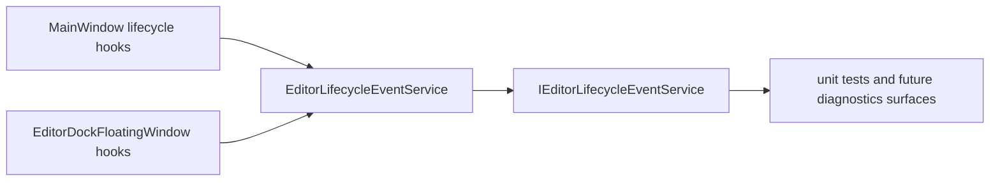

# Studio Editor Lifecycle Events Design

## Intent

建立 Studio 编辑器框架自己的生命周期事件面，用于记录和广播 Shell 级别的窗口、焦点和 workspace 恢复事件。第一片只服务编辑器外壳和 Dock 框架诊断，不连接 native runtime、真实 provider、Play Session、managed plugin reload 或底层引擎生命周期。

## Current Context

当前 Studio 已经有若干分散生命周期触点：

- `Shell/Views/MainWindow.axaml.cs` 监听主窗口 `Activated`、`Deactivated`、`OnOpened` 和 `OnClosed`，并在打开时恢复 floating windows。
- `Shell/Views/EditorDockFloatingWindow.axaml.cs` 监听 floating window 的 `Activated`、`Deactivated`、`OnOpened` 和 `OnClosed`，并注册或注销 `EditorDockFloatingWindowRegistry`。
- `Shell/Services/EditorBackgroundTaskService.cs` 通过 `TasksChanged` 发布后台任务状态变化。
- `Shell/Services/EditorTransactionService.cs` 通过 `StateChanged` 发布事务状态变化。
- `Core/Abstractions/IEditorFeatureModule.cs` 只提供 panel/action 注册入口，没有 enable、disable、unload 或 reload 生命周期。

这些触点说明生命周期数据已经存在，但缺少一个 UI-neutral、可测试、可诊断的统一事件合同。第一片应先把 Shell 真实拥有的生命周期事实收拢起来，而不是提前扩展为插件系统或 runtime bridge。

## External References

- Unity `EditorApplication` 是 editor-only API，提供当前 editor session 的工具、属性和事件，并与 project runtime 的 `Application` 分开。它还公开 `focusChanged`、`playModeStateChanged`、`quitting`、`wantsToQuit` 和 periodic `update` 等 editor 事件。
- Godot `EditorPlugin` 把 editor extension 生命周期拆成 `_enable_plugin()`、`_disable_plugin()`、`_clear()`、`_apply_changes()` 和 state/layout 保存恢复方法；其中 `_clear()` 明确用于释放正在编辑的对象状态，避免插件继续引用错误场景对象。
- Unreal `FEditorDelegates` 提供 editor boot/initialized、mode transition、map change、PIE begin/end、pre-exit 和 editor UI 操作相关 delegates，说明成熟编辑器会把 editor-only 生命周期作为独立事件面暴露，而不是混在 runtime 模块里。

这些案例给 Studio 的结论是：生命周期事件应先保持 editor-only、显式、可观察；Play、插件 reload、provider 和 native bridge 必须作为后续门槛，而不是第一片的隐式依赖。

## Decision

采用最小生命周期事件面。

第一片增加：

- `Core/Models/EditorLifecycleEventKind.cs`
- `Core/Models/EditorLifecycleEventSnapshot.cs`
- `Core/Abstractions/IEditorLifecycleEventService.cs`
- `Shell/Services/EditorLifecycleEventService.cs`

第一片接入：

- 主窗口 opened、closing、closed、activated、deactivated。
- 主窗口首次恢复 floating windows 后发布 workspace restored。
- Floating window opened、closed、activated、deactivated。

第一片不接入：

- `IEditorFeatureModule` enable/disable/unload。
- `IEditorBackgroundTaskService` task 状态桥接。
- `IEditorTransactionService` transaction 状态桥接。
- `ISceneSnapshotProvider` snapshot refresh 桥接。
- Play Session、runtime scene、native ABI、managed plugin reload。

## Contract Shape

`EditorLifecycleEventKind` 使用稳定枚举表达框架事件：

```text
ApplicationOpened
ApplicationClosing
ApplicationClosed
HostActivated
HostDeactivated
WorkspaceRestored
FloatingWindowOpened
FloatingWindowClosed
FloatingWindowActivated
FloatingWindowDeactivated
```

`EditorLifecycleEventSnapshot` 保存轻量、不可变数据：

```text
Sequence
Kind
Source
Message
OccurredAtUtc
```

`Source` 用稳定字符串表达来源。第一片只使用 `main-window` 和 `floating-window`。后续如果 floating workspace 获得稳定 host id，再单独扩展 source 命名规则。第一片不引入复杂 payload 字典，避免生命周期事件变成任意数据总线。

`IEditorLifecycleEventService` 提供：

```text
event EventHandler? EventsChanged
EditorLifecycleEventSnapshot Publish(EditorLifecycleEventKind kind, string source, string? message = null)
IReadOnlyList<EditorLifecycleEventSnapshot> GetRecentEvents()
```

服务实现保存有界 recent list，默认容量固定为 100 条。它不是持久化日志，不写 Dock layout snapshot，不参与 runtime state。

## Data Flow



事件从 Avalonia view hooks 进入 Shell service，再通过 Core abstraction 暴露给测试和后续诊断 UI。Core 不依赖 Avalonia，Shell 负责把具体窗口事件翻译成 UI-neutral lifecycle snapshots。

## Error Handling

- `Publish` 对空白 `source` 抛出参数异常，因为 source 是诊断定位的必要字段。
- `message` 可以为空；没有 message 时消费者只依赖 `Kind`、`Source` 和 `Sequence`。
- 事件发布失败不吞异常。第一片没有外部 IO、native 调用或后台线程，失败应暴露为测试或开发期错误。
- `ApplicationClosing` 与 `ApplicationClosed` 都允许发布；前者表示 Shell 开始关闭，后者表示 Avalonia window 已完成关闭回调。

## Testing

第一片验证重点：

- `EditorLifecycleEventService.Publish` 递增 sequence，触发 `EventsChanged`，返回 immutable snapshot。
- recent list 有界，超过容量后保留最新事件。
- `MainWindowViewModel` 能持有或暴露 lifecycle service，便于 view hook 发布事件并便于测试构造。
- `MainWindow` 与 `EditorDockFloatingWindow` 的具体 Avalonia hook 不做重型 UI 自动化；如果需要，只通过现有 headless-friendly tests 验证服务接入路径。
- 全量验证继续使用 `dotnet test Editor.sln -c Release`、encoding check 和 `git diff --check`。

## Documentation Updates

实现后同步更新 `docs/Dock系统指南.md` 的当前实现事实：

- Studio lifecycle events v0 是 Shell/Core 框架事件面。
- 它只记录主窗口和 floating window 生命周期。
- 它不代表 feature unload、provider reload、Play Session 或 native runtime lifecycle。

## Alternatives

### Broader Observation Stream

同时把 transaction、background task 和 snapshot refresh 桥接进生命周期流。优点是可观测性更强；缺点是事件数量和语义会快速膨胀，容易把普通服务状态变化误读成 editor lifecycle。当前不采用。

### Documentation Only

只写生命周期设计，不落代码。优点是风险最低；缺点是无法形成可测试的框架能力，也不能支撑后续 diagnostics surface。当前不采用。

### Plugin Lifecycle First

先扩展 `IEditorFeatureModule`，加入 enable、disable、unload、reload hooks。这个方向最终需要，但当前 Feature 模块只有 panel/action 注册，没有独立加载、卸载或贡献 diff 机制。提前加入会伪造插件生命周期，不采用。

## Non-Goals

- 不连接 C++ runtime、renderer、scene world 或 native ABI。
- 不创建真实 asset、scene 或 diagnostics provider。
- 不实现 Play Session 状态机。
- 不实现 managed plugin reload、ALC unload smoke 或 contribution diff。
- 不把 lifecycle event 持久化到 layout、settings 或 project 文件。
- 不新增用户可见 panel；诊断 UI 留到后续切片。

## Follow-Up Gates

后续可以在以下条件满足后分片扩展：

- Transaction bridge：`IEditorTransactionService` 的 begin/commit/rollback/undo/redo 事件需要独立命名，不能复用窗口 lifecycle kind。
- Background task bridge：需要 Problems/Console 或状态日志消费者，避免只为了记录而记录。
- Feature lifecycle：需要稳定 contribution id、注册 diff、释放订阅规范和失败诊断。
- Play Session lifecycle：需要 Edit World / Play World copy 或 load 语义，以及退出 Play 不污染 edit scene 的证据。
- Managed plugin reload：需要 ALC clean unload 和 negative unload smoke 设计。

## Acceptance Criteria

- 设计保持 editor-framework only，不引入底层或 provider 依赖。
- Core 只包含抽象和不可变模型，不依赖 Avalonia。
- Shell 实现只消费现有窗口 lifecycle hooks。
- 文档和测试能说明事件顺序、source、recent list 和非目标范围。
- 后续 plan 可以从本 spec 直接生成 TDD 任务。

## References

- Unity `EditorApplication`: https://docs.unity3d.com/ScriptReference/EditorApplication.html
- Unity `EditorApplication.playModeStateChanged`: https://docs.unity3d.com/6000.2/Documentation/ScriptReference/EditorApplication-playModeStateChanged.html
- Godot `EditorPlugin`: https://docs.godotengine.org/en/stable/classes/class_editorplugin.html
- Unreal `FEditorDelegates`: https://dev.epicgames.com/documentation/unreal-engine/API/Editor/UnrealEd/FEditorDelegates
