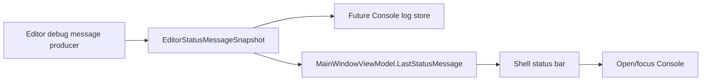

# Studio Status Debug Message Design

## Intent

Refocus the current Studio status feedback surface from command-specific feedback to a Unity-like latest debug/status message surface. The status bar should eventually show the newest editor debug message, and selecting that message should route the user to Console when the message has a Console target.

This remains an editor framework slice. It does not connect native runtime logs, renderer diagnostics, asset import logs, shell commands, terminals, or lower-level engine systems.

## Context

The previous command-result feedback slice added a useful but narrow path:

```text
WorkbenchCommandExecutionResult
  -> EditorCommandFeedbackSnapshot
  -> MainWindowViewModel.LastCommandFeedback
  -> status bar command feedback text
```

The user direction has changed:

- The status bar text should be named and shaped as latest feedback/debug message, not only command feedback.
- Later, this should behave like Unity: the status bar shows the newest Console/debug message.
- Console and Problems should not be prematurely merged unless Studio commits to a shell command-line surface.
- If shell command-line behavior becomes necessary later, Console and Problems can be revisited as modes or split views inside a shared bottom diagnostics surface.
- For the current editor framework, do not build shell command input. Keep Console as a debug log display.

Current docs already point in this direction:

- `docs/编辑器UI组件.md` describes a `Debug Log` single-line summary and clicking it to open Console.
- `docs/编辑器UI平台规范.md` asks for UI-level diagnostic/status records before real native log ingestion.
- `docs/Dock系统指南.md` currently records command-result feedback as v0; that should be revised after implementation to describe the broader status/debug message surface.

## External Patterns

- Unity Status Bar: displays the most recent message logged to Console, and clicking that message opens Console. This is the closest match for the requested behavior.
- Unity Console: groups messages, warnings, and errors from the editor and user `Debug` calls. Studio should copy the role, not Unity's runtime API surface.
- Godot Output panel: separates log, warning, and error categories. This supports a simple severity model without forcing a full Problems implementation.
- Unreal Output Log: combines log observation with command entry in some editor workflows. This is a useful future reference only if Studio later needs shell command-line behavior; it is not the current slice.

## Decision

Introduce a generic status message contract and migrate the status bar from command-specific naming to latest status/debug message naming.

The current implementation can still use command execution results as the first producer, but the public Shell/ViewModel surface should no longer be command-specific. This avoids locking the status bar to command router semantics before Console/debug ingestion exists.

## Goals

- Add a UI-neutral latest status message model in Core.
- Preserve deterministic mapping from `WorkbenchCommandExecutionResult` into the new message model.
- Expose latest status/debug message state through `MainWindowViewModel`.
- Render the latest status/debug message in the existing status bar location.
- Support optional target routing so a status message can open or focus Console.
- Keep Console as the debug log display surface for this slice.
- Keep Problems as a separate future diagnostics/validation surface.
- Keep ordinary status/debug messages compact, non-modal, and non-blocking.

## Non-Goals

- No shell command line, terminal, process runner, REPL, or command prompt.
- No native engine log ingestion.
- No renderer/runtime, scene world, asset pipeline, plugin hot reload, or native bridge integration.
- No complete Console log history implementation.
- No complete Problems implementation.
- No combined Console/Problems bottom panel.
- No notification center, toast history, modal failure dialog, or background task panel.
- No new lower-level engine dependency.

## Contract Shape

Add a small Core model:

```text
EditorStatusMessageSnapshot
  Severity: EditorStatusMessageSeverity
  Source: EditorStatusMessageSource
  Message: string
  TargetPanelId: string?
```

Severity:

```text
Debug
Info
Success
Warning
Error
```

Source:

```text
Command
Console
Diagnostics
BackgroundTask
```

Only `Command` needs to be implemented immediately as a producer because it already exists. `Console`, `Diagnostics`, and `BackgroundTask` are reserved UI-level sources so the model does not need to be renamed when those framework surfaces arrive.

The snapshot should stay immutable and UI-neutral. It should not store Avalonia controls, icons, brushes, dock objects, native log handles, exception objects, or mutable payload dictionaries.

## Command Result Mapping

The existing `WorkbenchCommandExecutionResult` mapping becomes:

| Result status | Status severity | Source | Message rule | Target |
| --- | --- | --- | --- | --- |
| `Succeeded` | `Success` | `Command` | `Command '<id>' completed.` | none |
| `Disabled` | `Warning` | `Command` | result message, or `Command '<id>' is disabled.` | none |
| `NotFound` | `Error` | `Command` | result message, or `Command '<id>' is not registered.` | none |
| `Failed` | `Error` | `Command` | result message, or `Command '<id>' did not complete.` | none |

Command results remain a transitional producer. They are useful status messages, but they are not automatically Console records until a Console log store exists.

Console/debug messages added later should use:

```text
Source = Console
TargetPanelId = "console"
```

This keeps the status bar click behavior honest: it opens Console only when the current message actually targets Console.

## Shell ViewModel Surface

Rename the public status binding surface away from command-specific terms:

```text
LastStatusMessage
HasStatusMessage
StatusMessageText
IsStatusMessageDebug
IsStatusMessageInfo
IsStatusMessageSuccess
IsStatusMessageWarning
IsStatusMessageError
OpenStatusMessageTargetCommand
```

`MainWindowViewModel` should publish property notifications for the snapshot, text, visibility, severity flags, and target command availability.

The existing command feedback router can either be renamed or replaced by a small status message publisher wrapper:

```text
Menu / shortcut / command palette
  -> status message command wrapper
  -> WorkbenchCommandRouter.Execute(commandId)
  -> WorkbenchCommandExecutionResult
  -> EditorStatusMessageSnapshot.FromCommandResult(result)
  -> MainWindowViewModel.LastStatusMessage
```

Command execution semantics must remain unchanged. The wrapper only observes the result and publishes a status message.

## Status Bar Behavior

The status bar should show a compact latest message next to the existing activity/status region. Visual styling is selected from severity booleans; XAML should not interpret command result statuses.

Interaction:

- If `LastStatusMessage.TargetPanelId` is empty, the text is passive status feedback.
- If `TargetPanelId` is present, clicking the text opens or focuses that panel through the existing panel command path.
- The first real Console/debug producer should set `TargetPanelId = "console"` so the behavior matches Unity's status bar.

The UI should avoid implying a full log history before Console has one. For command-result messages, passive status text is acceptable.

## Console And Problems Boundary

Current decision:

- `Console` is the Unity-like debug log display.
- `Problems` is for structured diagnostics, validation, and actionable project issues.
- They remain separate framework concepts in this slice.

Deferred shell-command decision:

- If Studio later needs a shell command-line surface, design a shared bottom diagnostics surface with Console/Problems as display modes or split panes.
- That future design should include command input focus, command execution ownership, output provenance, history, and error routing.
- This slice deliberately does not add those responsibilities.

## Data Flow

```mermaid
flowchart LR
    CommandEntry["Menu / shortcut / command palette"] --> Wrapper["Status message command wrapper"]
    Wrapper --> Router["WorkbenchCommandRouter"]
    Router --> Result["WorkbenchCommandExecutionResult"]
    Result --> Snapshot["EditorStatusMessageSnapshot"]
    Snapshot --> ViewModel["MainWindowViewModel.LastStatusMessage"]
    ViewModel --> StatusBar["Shell status bar"]
    StatusBar --> PanelTarget["Optional Console target"]
```



Future Console/debug producer:



## Implementation Notes

- Existing tests for `EditorCommandFeedbackSnapshot` should migrate to `EditorStatusMessageSnapshot`.
- Existing XAML class names such as `command-feedback-status` should migrate to status-message naming.
- Existing ViewModel properties should be renamed rather than duplicated, unless a short compatibility bridge is required inside one commit.
- No user-facing copy should describe shell command capability.
- Do not create a Console history store in this slice. Only prepare the status message target hook.

## Testing

Focused tests should cover:

- command result to status message mapping for success, disabled, not-found, failed, and blank failure messages
- `MainWindowViewModel` latest status message properties and severity flags
- property notifications when latest status message changes
- passive command status messages do not try to open a panel when `TargetPanelId` is empty
- a synthetic Console-targeted status message enables the open/focus Console command
- XAML binds to status-message names, not command-feedback names

Full UI automation is not required for this framework-only slice. Existing ViewModel and XAML structure tests are sufficient.

## Documentation Updates After Implementation

Update `docs/Dock系统指南.md`:

- Replace command-result feedback v0 wording with status/debug message surface wording.
- Record that command execution results are the first producer, not the whole model.
- Record that Console and Problems are not merged in this slice.
- Record that shell command-line behavior is explicitly deferred.

Update `docs/编辑器UI平台规范.md`:

- Change the planning sequence from `Command result feedback` to `Status debug message surface`.
- Clarify that the status bar latest message is a UI-level record, not native log ingestion.

## Acceptance Criteria

- The design stays editor-framework only.
- Public Shell/ViewModel naming no longer says command feedback.
- Command result behavior remains visible through the new generic status message model.
- Console-target click behavior is modeled without implementing a shell command line.
- Problems remains a separate future diagnostics surface.
- Follow-up implementation can be planned with TDD from this spec.

## References

- Unity Status Bar: https://docs.unity3d.com/Manual/StatusBar.html
- Unity Console: https://docs.unity3d.com/Manual/Console.html
- Unity Debug class: https://docs.unity3d.com/Manual/class-Debug.html
- Godot Output panel: https://docs.godotengine.org/en/latest/tutorials/scripting/debug/output_panel.html
- Unreal Logging and Output Log: https://dev.epicgames.com/documentation/unreal-engine/logging-in-unreal-engine
