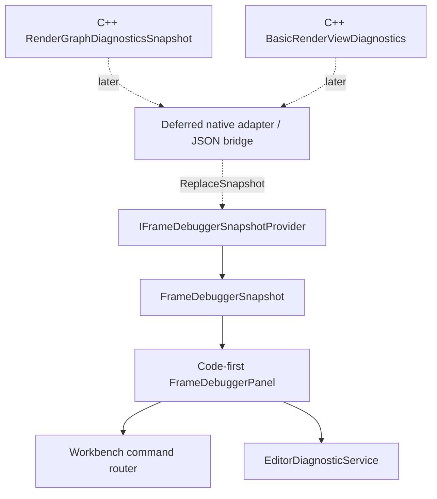

# Studio Frame Debugger Snapshot v0 Design

## Intent

Build the first Studio Frame Debugger surface as a read-only snapshot viewer. The goal is to make renderer and RenderGraph diagnostics visible through the Studio Code-first UI without binding Avalonia view models to native renderer objects, Vulkan handles, ImGui panels, or a premature C ABI.

This design follows a snapshot-first path:

```text
native renderer diagnostics
  -> later adapter
  -> Studio Core snapshot provider
  -> Code-first Frame Debugger panel
```

The v0 implementation stops at the Studio-managed snapshot provider and fixture-backed panel. Native adapter and ABI work remain deferred until the managed contract is stable and tested.

## Current Context

Studio now has the editor framework needed for a read-only diagnostic panel:

- `CodeFirstEditorPanel`, `GuiFrameBuilder`, validation, event queue, state store, and Avalonia control creation are in place.
- `Features/UiStyle/UiStylePanel.cs` proves a Code-first panel can be registered through Workbench and hosted in Dock.
- `ISceneSnapshotProvider` and `InMemorySceneSnapshotProvider` provide an existing pattern for UI-neutral read-only snapshots, lookup helpers, replacement seams, and `SnapshotChanged`.
- `IEditorDiagnosticService` and Shell status feedback provide a non-modal route for unavailable backend state and command feedback.
- `docs/Studio框架设计.md` and `docs/Code-first UI设计.md` state that runtime data must enter Studio as Core snapshots, diagnostics, provider status, or command results before a panel consumes it.

The native engine side already has useful diagnostic facts:

- `RenderGraphDiagnosticsSnapshot` contains pass, command, resource, access edge, dependency edge, transition, culled pass, and transient allocation data.
- `BasicRenderViewDiagnostics` contains `renderGraph` plus renderer execution events.
- The native editor has existing Frame Debugger capture, preview, replay, and smoke coverage.

The missing piece is not another renderer diagnostic primitive. The missing piece is the Studio-owned managed contract that can safely receive and display those facts.

## External Patterns

Mature engine tooling converges on the same boundary:

- Unity Frame Debugger exposes a frozen frame event list and selected event details inside the editor. It is an editor-facing event viewer, not a direct exposure of GPU object ownership.
- Unreal keeps many render diagnostics as editor snapshots or viewers, while deep frame inspection commonly goes through RenderDoc integration.
- RenderDoc owns deep graphics API capture, replay, pipeline state, and resource inspection as a specialized tool with its own capture API.
- Godot's debugger and profiler APIs route data through editor/debugger interfaces rather than making UI panels own runtime internals.

For Studio this means the v0 panel should act like a Unity-style read-only event viewer. RenderDoc-style replay and GPU texture inspection can be integrated later through a narrow adapter, not through the first panel contract.

## Decision

Adopt a Snapshot-first / Adapter-later architecture.



v0 implements the solid managed path:

```text
IFrameDebuggerSnapshotProvider
  -> FrameDebuggerSnapshot
  -> FrameDebuggerPanel
```

The native path is intentionally deferred:

```text
C++ diagnostics
  -> NativeFrameDebuggerSnapshotAdapter
  -> provider.ReplaceSnapshot(snapshot)
```

## Goals

- Define a Studio Core read-only Frame Debugger snapshot contract.
- Provide an in-memory provider with snapshot replacement, lookup helpers, and `SnapshotChanged`.
- Add a Code-first Frame Debugger panel that can render unavailable, empty, and populated snapshots.
- Keep panel state local and transient: filter text, selected pass, selected event, and expanded sections.
- Register the panel through Workbench with command entries for capture and resume.
- Route capture and resume through command handling or diagnostics feedback, not direct native calls.
- Make future native adapter work a consumer of the provider contract rather than a dependency of the UI.

## Non-Goals

- No C ABI in v0.
- No P/Invoke, native library loading, or JSON bridge implementation in v0.
- No Vulkan handles, native pointers, `std::string`, `std::vector`, or C++ struct layout in managed models.
- No texture preview, render target display, replay recording, GPU readback, or pipeline state inspection.
- No writable renderer state or runtime mutation.
- No migration of the native ImGui Frame Debugger panel into Avalonia.
- No attempt to replace RenderDoc.

## Core Model

Add `Core/Models/FrameDebug/`.

The main snapshot is a single immutable frame-debug state:

```text
FrameDebuggerSnapshot
  Version: int
  State: FrameDebuggerState
  Capture: FrameDebugCaptureSnapshot?
  Passes: IReadOnlyList<FrameDebugPassSnapshot>
  Commands: IReadOnlyList<FrameDebugCommandSnapshot>
  Resources: IReadOnlyList<FrameDebugResourceSnapshot>
  AccessEdges: IReadOnlyList<FrameDebugAccessEdgeSnapshot>
  DependencyEdges: IReadOnlyList<FrameDebugDependencyEdgeSnapshot>
  Transitions: IReadOnlyList<FrameDebugTransitionSnapshot>
  ExecutionEvents: IReadOnlyList<FrameDebugExecutionEventSnapshot>
  Preview: FrameDebugPreviewSnapshot
  Message: string
```

Use managed, display-safe values:

- ids are strings stable within one snapshot, such as `pass:2`, `event:17`, and `image:0`.
- native enum values are projected as strings, such as `DrawFullscreenTriangle`, `ColorWrite`, and `Final`.
- counters and indices use C# numeric primitives.
- timestamps use `DateTimeOffset` only for Studio capture/receipt time, not native GPU timing.
- collections are exposed as read-only lists.

The model intentionally favors explicit projected records over nested native-shaped structs. That keeps Studio independent of native header churn.

### State Model

```text
Unavailable
Running
CaptureRequested
CapturingFrame
PausedFrameDebug
ResumeRequested
Faulted
```

`Unavailable` means no backend/provider data is connected or no frame has been captured. `Faulted` means the provider or future adapter has a concrete error message.

### Capture Snapshot

```text
FrameDebugCaptureSnapshot
  CaptureId: string
  FrameIndex: long
  SubmittedFrameEpoch: ulong
  ViewKind: string
  RequestedWidth: int
  RequestedHeight: int
  CapturedAtUtc: DateTimeOffset
```

### Pass Snapshot

```text
FrameDebugPassSnapshot
  Id: string
  PassIndex: int
  DeclarationIndex: int
  Name: string
  Type: string
  ParamsType: string
  AllowCulling: bool
  HasSideEffects: bool
  CommandCount: int
  ImageTransitionCount: int
  BufferTransitionCount: int
```

### Execution Event Snapshot

```text
FrameDebugExecutionEventSnapshot
  Id: string
  EventIndex: int
  Kind: string
  PassId: string
  PassName: string
  CommandId: string?
  Label: string
  SourceResourceId: string?
  TargetResourceId: string?
  VertexCount: uint
  IndexCount: uint
  InstanceCount: uint
  GroupCountX: uint
  GroupCountY: uint
  GroupCountZ: uint
```

Draw and dispatch fields stay on the same snapshot for v0 to avoid a type hierarchy in panel code. The panel only displays fields relevant to the event kind.

## Provider Contract

Add `Core/Abstractions/IFrameDebuggerSnapshotProvider.cs`:

```csharp
public interface IFrameDebuggerSnapshotProvider
{
    event EventHandler? SnapshotChanged;

    FrameDebuggerSnapshot GetCurrentSnapshot();

    bool TryGetPass(string passId, out FrameDebugPassSnapshot? pass);

    bool TryGetExecutionEvent(
        string eventId,
        out FrameDebugExecutionEventSnapshot? executionEvent);
}
```

Add `Core/Services/InMemoryFrameDebuggerSnapshotProvider.cs`:

- stores the current snapshot
- builds pass and event lookup dictionaries
- validates duplicate pass and event ids
- exposes `ReplaceSnapshot(FrameDebuggerSnapshot snapshot)`
- raises `SnapshotChanged` after a successful replacement

This mirrors `InMemorySceneSnapshotProvider` and gives future native adapters one safe publication method.

## Panel Design

Add `Features/FrameDebugger/FrameDebuggerPanel.cs` as a Code-first panel.

The panel consumes only `IFrameDebuggerSnapshotProvider`, `IEditorDiagnosticService`, and a command execution route. It never owns native objects.

Panel-local state:

```text
filterText
selectedPassId
selectedExecutionEventId
expandedSectionKeys
```

Screen structure:

```text
Toolbar
  Capture
  Resume
  State
  Frame
  Epoch

Main split
  Pass list
  Selected pass details

Details sections
  Commands
  Execution events
  Resources
  Access edges
  Dependencies
  Transitions
```

Unavailable behavior:

- `Unavailable` snapshot shows a compact diagnostic message and disabled capture/resume state if command routing is unavailable.
- capture/resume can still publish feedback, such as "Frame Debugger native adapter is not connected."

Selection behavior:

- pass selection is by `FrameDebugPassSnapshot.Id`
- event selection is by `FrameDebugExecutionEventSnapshot.Id`
- when a replacement snapshot does not contain the selected id, the panel clears the invalid selection
- filter text is local and does not mutate the provider snapshot

## Command Boundary

Register two command ids:

```text
frameDebugger.capture
frameDebugger.resume
```

v0 handlers should not call native code. They should publish a clear diagnostic/status result when no adapter is connected.

Later adapter work can replace the handlers so the panel does not change:

```text
FrameDebuggerPanel button
  -> command router
  -> native adapter capture/resume request
  -> provider.ReplaceSnapshot(...)
```

## Workbench Registration

`WorkbenchFeatureModule` should receive or create an `IFrameDebuggerSnapshotProvider` and register:

- `frame-debugger` panel
- Window command for opening the panel
- capture/resume commands if the command framework supports non-panel actions in this slice

The fixture provider should contain one representative paused capture with:

- at least two passes
- at least one resource
- at least one command
- at least one execution event
- at least one transition

This provides immediate UI validation without native runtime connectivity.

## Native Adapter Deferred Design

Native adapter work should be a later slice after v0 tests prove the managed contract.

The preferred bridge is a narrow C API that returns an owned UTF-8 snapshot blob:

```c
asharia_studio_request_frame_debug_capture(...)
asharia_studio_request_frame_debug_resume(...)
asharia_studio_get_frame_debug_snapshot_json(..., out ptr, out len)
asharia_studio_release_buffer(ptr)
```

The C# side deserializes JSON into `FrameDebuggerSnapshot` and calls `ReplaceSnapshot()`.

Rules for the adapter:

- no managed code marshals C++ STL types
- no managed model contains a native pointer or Vulkan handle
- no UI thread waits for GPU completion
- adapter callbacks publish snapshots through a dispatcher boundary
- ABI version is explicit before any non-fixture bridge ships

JSON is acceptable for the first adapter because the data is diagnostic, small enough for initial UI validation, and easier to inspect. Binary formats can be considered after profiling shows JSON is the bottleneck.

## Error Handling

Provider errors become `FrameDebuggerSnapshot` with `State = Faulted` and a message, or `EditorDiagnosticService` records when the provider cannot publish a valid snapshot.

Panel `OnGui()` must degrade gracefully:

- null provider is not allowed by construction
- unavailable snapshot shows an empty state
- invalid selection is cleared
- missing pass/event lookup displays no details instead of throwing
- command failure is non-modal and routed through existing status/diagnostics behavior

## Testing

Unit tests:

- snapshot constructors reject blank required ids
- snapshot collections are read-only
- provider exposes current snapshot and lookup helpers
- provider raises `SnapshotChanged` once after replacement
- provider rebuilds lookup dictionaries after replacement
- provider rejects duplicate pass and event ids
- panel renders unavailable state
- panel renders fixture pass list and details
- panel clears stale selected pass after provider replacement
- capture/resume buttons publish command feedback or diagnostics when no adapter is connected
- Workbench registers the Frame Debugger panel

Focused verification:

```powershell
dotnet test Tests\Editor.Tests\Editor.Tests.csproj -c Release --filter "FrameDebugger|WorkbenchFeatureModule|CodeFirstPanelHost"
dotnet test Editor.sln
powershell -ExecutionPolicy Bypass -File ..\..\tools\check-text-encoding.ps1
git diff --check
```

Manual checks after implementation:

- open default Studio window
- open Frame Debugger from the Window menu
- verify unavailable/fixture state does not overflow in a narrow docked panel
- close, reopen, dock, and float the panel
- verify capture/resume feedback appears and does not block the UI

## Alternatives Rejected

### Direct native ABI first

This would make early UI work depend on native library loading, thread lifetime, GPU capture timing, and ABI ownership. It also risks leaking C++ layout choices into C# models. It is rejected for v0.

### Port the native ImGui panel

The native panel has useful behavior and smoke coverage, but porting it directly would bypass Studio's Code-first UI architecture and duplicate native editor assumptions. v0 should reuse the data shape, not the UI implementation.

### Use RenderDoc as the first integration

RenderDoc is the right reference for deep capture/replay, but it is too heavy for the first Studio panel. The first slice needs editor-shell wiring, snapshot contracts, and list/details UX. RenderDoc-style inspection can be a later capability.

## Implementation Slices

### Slice 1: managed read-only snapshot v0

- Core model records
- provider abstraction and in-memory provider
- fixture snapshot
- Code-first Frame Debugger panel
- Workbench registration
- tests and docs

### Slice 2: native JSON adapter spike

- narrow native export for snapshot blob
- C# adapter deserialization
- provider replacement from adapter output
- adapter fault diagnostics

### Slice 3: live capture/resume

- connect capture/resume commands to adapter
- async snapshot refresh
- command status and diagnostics

### Slice 4: preview/replay

- selected pass/event preview request
- debug texture lifetime model
- viewport/texture display integration
- deeper smoke and manual GPU validation

## Acceptance Criteria For Slice 1

- Frame Debugger panel is available through Workbench.
- Empty/unavailable state is clear and non-fatal.
- Fixture snapshot displays pass, resource, command, execution event, dependency, and transition data.
- Selected pass details update from panel-local state.
- Provider replacement refreshes the panel through `SnapshotChanged`.
- Capture/resume are routed through command or diagnostics feedback without native calls.
- No implementation file references P/Invoke, native handles, Vulkan handles, or C++ interop for this slice.
- Validation commands pass.
