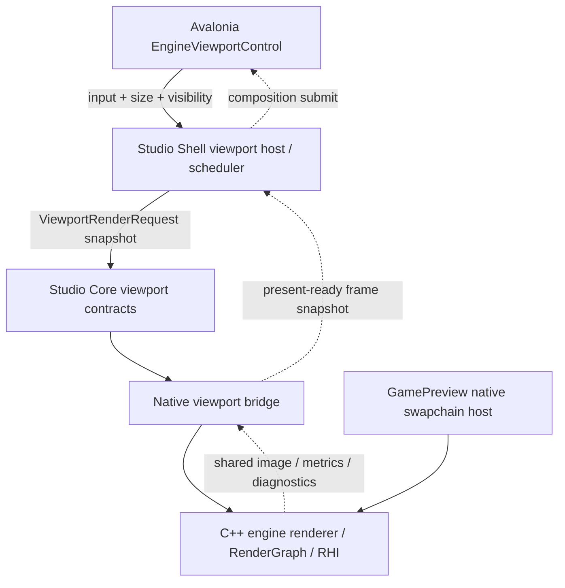

# Studio Native Viewport Alignment Design

## Intent

Align the proposed Avalonia multi-viewport architecture with the repository's current package-first C++ engine and `apps/studio` Avalonia shell.

The target direction is:

```text
Studio/Avalonia
  owns editor presentation, dock, panels, input capture, command surfaces

C++ engine/native editor bridge
  owns scene, renderer, RenderGraph, RHI, Vulkan resources, profiling truth

GamePreview
  owns native swapchain performance validation and external GPU capture path
```

This spec is a design alignment document. It is not an implementation plan and does not claim that GPU composition interop is already connected in `apps/studio`.

## Current Repository Facts

The root engine already follows package-first boundaries:

- `docs/architecture/overview.md` states that `packages/rendergraph` is backend-agnostic and must not expose Vulkan layout, stage, access, command buffer, or descriptor concepts.
- `asharia::rhi_vulkan` is the base Vulkan backend target; `asharia::rhi_vulkan_rendergraph` is the RenderGraph-to-Vulkan adapter target.
- `asharia::renderer_basic` is backend-agnostic; Vulkan command recording and resource binding live in `asharia::renderer_basic_vulkan`.
- `apps/editor` is the current C++ Dear ImGui editor host and smoke harness. It owns editor-only viewport coordination and texture publication, while panels submit backend-neutral viewport requests.

The native C++ editor already has a useful viewport contract shape:

```text
EditorViewportRequest
  panelId
  kind
  extent
  camera
  overlayFlags
  worldGrid
  refresh

EditorViewportResult
  panelId
  kind
  requestedExtent
  texture
  overlayFlags
```

`EditorViewportCoordinator` is the current Vulkan bridge. It owns keyed viewport slots by `panelId + EditorViewportKind`, pending/presented render targets, diagnostics snapshots, and deferred texture retirement. Panels do not create Vulkan objects, descriptors, or command buffers.

The Avalonia Studio app is a separate managed shell:

- `apps/studio/Editor.csproj` targets `net10.0` and uses Avalonia `12.0.4`.
- `apps/studio` is currently a single `.csproj` application where directory boundaries express architecture.
- `Core` is UI-neutral contracts and models.
- `Shell` owns Avalonia host, dock, command, lifecycle, and adapter code.
- `Features` own vertical panel/tool slices.
- `Features/SceneView` currently displays "Viewport backend deferred".
- `Core/Models/FrameDebug` and `Core/Interop/FrameDebugger` already establish a snapshot-first native bridge pattern for diagnostics.

The local Studio docs already constrain this work:

- `docs/项目规范.md` says Scene View rendering must not be implemented by swapping a normal Avalonia `Image` every frame.
- `docs/Studio代码分类.md` says bottom-layer data must enter UI as `Core` snapshots or provider contracts, and views must not query runtime/native/renderer objects.
- `docs/Code-first UI设计.md` says backend/native/runtime integration is outside Code-first UI v1 and must first enter Studio as snapshots, diagnostics, provider status, or command results.
- Current replacement `docs/architecture/studio-extension-model.md` says Avalonia owns presentation, not Vulkan/RHI/RenderGraph lifetime, and C++ owns the engine truth.

## External API Evidence

Avalonia's native interop documentation confirms that `NativeControlHost` embeds native views but native views sit above the Avalonia rendering surface, cannot be transparent, are not affected by Avalonia render transforms, and cannot have Avalonia controls placed over them. This supports treating native embedding as an optional performance mode, not the default multi-viewport path.

Avalonia's threading documentation confirms that controls must be created and accessed on the UI thread. Background render or native callbacks must marshal UI changes through the dispatcher.

Avalonia's composition API reference exposes `ICompositionGpuInterop` with compositor device LUID/UUID, supported external image handle types, supported semaphore types, image import, and semaphore import. `CompositionDrawingSurface` exposes `UpdateAsync`, keyed mutex update, binary semaphore update, and timeline semaphore update methods. This supports a future GPU shared-image spike, but exact platform behavior must still be proven against the project package version and target devices.

Vulkan documentation confirms timestamp queries are written from command buffers and read back later, so GPU profiler data belongs in the native renderer/RHI/profiling path and should be bridged as metrics snapshots, not polled from Avalonia UI controls.

References:

- Avalonia native interop: https://docs.avaloniaui.net/docs/app-development/native-interop
- Avalonia threading model: https://docs.avaloniaui.net/docs/app-development/threading
- `ICompositionGpuInterop`: https://api-docs.avaloniaui.net/docs/T_Avalonia_Rendering_Composition_ICompositionGpuInterop
- `CompositionDrawingSurface`: https://api-docs.avaloniaui.net/docs/T_Avalonia_Rendering_Composition_CompositionDrawingSurface
- Vulkan timestamp queries: https://docs.vulkan.org/samples/latest/samples/api/timestamp_queries/README.html

## Decision

Adopt a staged Studio-native viewport architecture with a UI-neutral managed contract first, a native adapter second, and GPU shared-image composition only after a focused spike validates the platform path.



The key boundary:

```text
Studio Core contracts can describe viewport intent, timing, policy, stats, and snapshots.
Studio Core contracts must not contain Avalonia Control, VkImage, VkSemaphore, VkDevice, HWND, ImTextureID, or native pointer ownership.
```

## Layer Ownership

### Studio Core

Owns UI-neutral managed contracts:

- viewport id and kind
- viewport extent and render scale
- viewport clock state
- viewport update policy
- viewport render reasons
- viewport stats snapshots
- provider/service interfaces consumed by Features and Shell

Does not own:

- Avalonia controls
- composition surfaces
- platform handles
- native library loading policy
- Vulkan handles
- render target lifetime
- engine world lifetime

### Studio Shell

Owns Avalonia-facing orchestration:

- `EngineViewportControl` or equivalent view/control
- attached/detached visual tree lifecycle
- viewport focus, visibility, DPI, and bounds observation
- UI-thread dispatcher use
- dock and panel lifecycle integration
- scheduler service instance
- safe publication of frame-ready state to views

Does not own:

- renderer command recording
- GPU synchronization primitives
- render target allocation
- scene extraction
- native renderer resource lifetime

### Studio Features

Own panel-specific behavior:

- Scene View toolbar/view model state
- Game View panel state
- Shader/Material Preview panel state
- Frame Debugger panel state

Features may request viewport rendering through Core/Shell contracts. They must not reference P/Invoke entry points, Vulkan handles, native renderer objects, or Avalonia composition internals.

### Native Bridge

Owns managed/native crossing:

- P/Invoke or process IPC boundary
- ABI version checks
- conversion between managed viewport requests and native request packets
- conversion from native metrics/diagnostics into Studio snapshots
- fault reporting

The bridge must publish immutable managed snapshots. It must not let Studio view models hold native object lifetime.

### Native Engine And Renderer

Own:

- scene/runtime truth
- renderer-facing snapshots and draw packets
- RenderGraph declaration and diagnostics
- Vulkan context/device/RHI resources
- GPU timestamp queries and debug labels
- render target allocation and retirement

Native renderer state may be observed by Studio through snapshots or explicit handles whose ownership remains native.

### GamePreview

Owns native swapchain validation:

- native window
- raw input path
- `VkSurfaceKHR` / `VkSwapchainKHR`
- frame pacing and present metrics
- external capture-friendly path

GamePreview is the authoritative performance path. Studio embedded viewports are for editing, debugging, and preview, not final runtime performance conclusions.

## Viewport Contract Shape

The first Studio-managed viewport contract should mirror the C++ editor request/result idea but use managed, UI-neutral types.

```text
ViewportId
  string or Guid stable within one Studio session

ViewportKind
  Scene
  Game
  ShaderPreview
  MaterialPreview
  CameraPreview
  FrameDebug
  Thumbnail

ViewportExtent
  WidthPixels
  HeightPixels
  RenderScale

ViewportRenderReason
  InitialFrameMissing
  VisibleExposed
  Resized
  CameraChanged
  InputActive
  TimeAdvanced
  AssetChanged
  ShaderChanged
  FrameDebugStep
  RuntimePlaying
  CaptureRequested

ViewportUpdatePolicy
  DirtyOnly
  InteractiveBurst
  TimePlayback
  RuntimePlay
  FrameDebug
  PerformancePreview
```

`PixelSize` can be used inside Avalonia control code, but the Core contract should use a Studio-owned extent record. This keeps the contract usable from tests, future native bridge code, and non-Avalonia hosts.

## Present Backend Model

The proposed two-backend model is accepted with adjusted ownership:

```text
AvaloniaComposition
  host: apps/studio Shell/Avalonia interop
  use: default embedded editing and debug viewport
  goal: multi-viewport, dock-friendly, overlay-friendly editor experience

NativeSwapchain
  host: GamePreview and optional single performance viewport
  use: performance validation, frame pacing, raw input, external GPU capture
  goal: runtime-like behavior
```

`AvaloniaCompositionPresentTarget` is an adapter around Avalonia composition and native shared-image import. It is not engine core, renderer core, or runtime core.

`NativeSwapchainPresentTarget` belongs to native host/platform/RHI integration. It must not depend on Avalonia.

`NativeControlHost + NativeSwapchainPresentTarget` remains optional because native views have airspace and z-order constraints. It can be a single performance viewport mode, not the default dockable multi-viewport solution.

## Viewport Scheduler

Studio needs an explicit scheduler before it needs full GPU composition.

The scheduler owns the answer to:

```text
Which viewport should render?
Why should it render?
At what target rate?
Can it be skipped this tick?
What metrics should explain that decision?
```

Default policy:

```text
Focused Scene View
  InteractiveBurst while camera/input is active
  DirtyOnly or low idle rate when inactive

Game View
  RuntimePlay when Play Mode is active
  throttled or stopped when hidden

Shader Preview
  TimePlayback only when dynamic preview is enabled
  DirtyOnly for static materials/shaders

Frame Debug
  ManualStep / CapturedFrame time
  no continuous render unless the user scrubs or requests playback

Hidden tabs
  no render requests
```

The scheduler must emit stats that the UI can show:

- rendered frames
- skipped frames
- dropped composition frames
- last render reason
- target FPS
- actual render FPS
- backend
- visible/focused state

These stats should enter panels as snapshots, not through direct calls into render loop state.

## Viewport Clock

Time must be independent from render frequency.

Accepted clock modes:

```text
EditorPreviewTime
GameTime
FixedStepTime
ManualStepTime
FrozenTime
ScrubTime
CapturedFrameTime
```

The native renderer already has `BasicRenderViewFrameParams` with `frameIndex`, `timeSeconds`, `deltaSeconds`, and `renderScale`. Studio viewport clocks should map to that kind of frame parameter packet rather than letting shader time come from wall-clock time inside the renderer.

Examples:

```text
Scene View
  can freeze while Game View plays

Shader Preview
  can run fixed-step or slow playback independent of editor UI refresh

Frame Debug
  can stay on captured time until the user manually steps or scrubs
```

## Input Flow

Avalonia controls collect input, but they do not mutate engine state directly.

```text
Avalonia pointer/key event
  -> ViewportInputAdapter
  -> Core viewport input event
  -> Shell/InputRouter or native bridge
  -> editor camera / tool / selection / runtime input path
```

Input events must include both DIP and pixel coordinates:

```text
PositionDip
PositionPixel
DeltaDip
DeltaPixel
RenderScale
ViewportId
Timestamp
Modifiers
```

This preserves DPI correctness and keeps picking/ray logic native or backend-neutral.

## Frame Debug And Profiler Alignment

Frame Debugger should continue the existing snapshot-first direction:

```text
native RenderGraph / RenderView diagnostics
  -> native projection / JSON bridge
  -> Studio Core FrameDebug snapshots
  -> Studio panel
```

The viewport architecture should not bypass `FrameDebuggerSnapshot` by letting a panel inspect renderer internals.

Profiler should follow the same pattern:

```text
native profiler hub / frame profiler
  -> ring buffer or batch snapshot
  -> Studio provider
  -> Profiler panel at 10-20 Hz
```

Metrics must distinguish:

- engine update cost
- renderer CPU cost
- GPU timestamp cost
- present cost
- Avalonia composition submit cost
- Studio UI cost
- scheduler skip count
- dropped composition frame count

## Device Loss, Resize, And DPI

Studio Shell owns Avalonia resize/DPI observation. Native renderer/interop owns GPU resource recreation.

Required rules:

- UI thread records pending logical size and render scale.
- render/native bridge receives pixel extent snapshots.
- image pool recreation happens at native/interop safe points.
- old GPU images are retired only after native and compositor ownership is complete.
- device-lost state becomes provider/status snapshot and disables present for the affected viewport until recovered.
- no UI thread waits on a Vulkan fence.
- render/native threads do not access Avalonia controls.

## Implementation Phases

### Phase 0: alignment only

Deliver this spec and keep implementation unchanged.

Acceptance:

- The design is explicit about current facts vs planned architecture.
- No code or global architecture doc is changed.
- The next implementation slice can be planned without re-opening layer ownership.

### Phase 1: managed contract and scheduler skeleton

Add Studio Core viewport models and a pure managed scheduler:

- viewport id/kind/extent
- clock state and clock modes
- render reasons and update policies
- render request/result snapshots
- scheduler unit tests

No Vulkan, no native bridge, no Avalonia composition interop.

Acceptance:

- hidden viewport produces no request
- dirty-only viewport renders only when dirty/reasoned
- interactive viewport bursts then throttles
- time playback advances clock independently from render decision
- tests run without Avalonia or native engine

### Phase 2: Scene View control shell

Add an Avalonia viewport control that reports:

- attached/detached lifecycle
- bounds and render scale
- focus/visibility
- pointer input events

The control can still show a non-GPU status surface. It should wire to scheduler contracts but not create GPU resources.

Acceptance:

- no UI thread blocking
- input conversion preserves DIP and pixel coordinates
- control attach/detach detaches provider subscriptions
- tests cover view model/control adapter behavior where feasible

### Phase 3: native bridge request/result spike

Bridge managed viewport requests to native without GPU shared-image composition first.

Possible outputs:

- diagnostics-only response
- CPU metadata response
- native-rendered frame counter/status snapshot

Acceptance:

- ABI/version check exists
- no managed model contains native pointer or Vulkan handle ownership
- failures surface as diagnostics/status snapshots
- Studio remains usable if native bridge is absent

### Phase 4: Avalonia composition present spike

Validate `ICompositionGpuInterop` and `CompositionDrawingSurface` for the target platform and Avalonia package version.

Spike questions:

- Can Studio get the compositor device LUID/UUID and supported handle/semaphore types?
- Can native Vulkan choose a compatible device?
- Can native create/import a shared image pool once and reuse it?
- Can semaphore synchronization complete without UI thread fence waits?
- What happens on resize, device lost, monitor/DPI changes, and minimized/hidden tabs?

Acceptance:

- single embedded viewport displays a native-rendered frame
- resize does not crash
- UI thread does not wait for Vulkan fences
- render thread does not wait for Avalonia composition
- old frames can be dropped when composition is slow
- failures degrade to diagnostics/status snapshots

### Phase 5: multi-viewport and clocks

Connect multiple viewport kinds to scheduler and clock state.

Acceptance:

- hidden tabs do not render
- only hot viewport(s) render at high rate
- Shader Preview time can pause/step/scrub
- Frame Debug time remains captured/manual
- stats explain rendered vs skipped frames

### Phase 6: GamePreview native swapchain host

Create a separate native preview host for authoritative performance:

- native window
- native swapchain present
- command/telemetry channel
- profiler data return
- external capture-friendly setup

Acceptance:

- Studio can launch/stop GamePreview
- telemetry appears in Studio without blocking UI
- GamePreview metrics are labeled separately from embedded viewport metrics
- RenderDoc/Nsight/RGP guidance points to GamePreview as default capture target

## Rejected Alternatives

### Put Avalonia composition interop in engine core

Rejected because engine core and runtime must not depend on editor presentation or Avalonia. It would also make runtime/game hosts inherit editor-only UI constraints.

### Use `NativeControlHost` as the default viewport path

Rejected for default multi-viewport editing because native views sit above Avalonia content, cannot be transparent, do not participate in Avalonia transforms, and block overlays/tooltips/floating chrome.

### Port the existing ImGui editor viewport directly into Studio

Rejected because it would create a second UI/input/dock model inside the Avalonia shell. The correct reuse point is the request/result/snapshot contract and native renderer capabilities, not the ImGui UI implementation.

### Implement GamePreview before embedded Studio contracts

Rejected for this alignment slice. GamePreview is important, but Studio first needs clear contracts for viewport identity, timing, scheduler decisions, input packets, and metrics snapshots.

### Let panels own native handles

Rejected because panel lifecycle is Dock/UI lifecycle. Native GPU lifetime must remain with native renderer/RHI owners and be observed through contracts.

## Validation Gates

Documentation-only alignment:

```powershell
git diff --check
```

Managed contract/scheduler slice:

```powershell
dotnet test Tests\Editor.Tests\Editor.Tests.csproj -c Release --filter "Viewport|SceneView|Architecture"
dotnet test Editor.sln
git diff --check
```

Native/C++ bridge or renderer slice:

```powershell
powershell -ExecutionPolicy Bypass -File ..\..\tools\check-text-encoding.ps1
git diff --check
cmd /c "..\..\build\conan\clangcl-debug\Debug\generators\conanbuild.bat && cmake --preset clangcl-debug && cmake --build --preset clangcl-debug"
cmd /c "..\..\build\conan\msvc-debug\Debug\generators\conanbuild.bat && cmake --preset msvc-debug && cmake --build --preset msvc-debug"
```

Frame-loop, swapchain, render graph, or present backend changes must also run the relevant smoke commands documented in `docs/workflow/review.md`.

## Documentation Sync Policy

This spec should be treated as a planning/design source until implementation begins.

Do not immediately rewrite root architecture docs to imply this is current runtime truth.

Update related docs only when the corresponding implementation slice lands:

- `apps/studio/docs/Studio代码分类.md` when new viewport contract folders/classes exist.
- `apps/studio/docs/项目规范.md` only if a durable rule changes.
- `docs/architecture/flow.md` when real native/studio data flow changes.
- `docs/architecture/overview.md` when package or ownership boundaries change.
- `docs/workflow/review.md` when new validation commands become required.

## Open Questions

- Whether the first native bridge for viewport requests should live in `apps/editor` beside the existing editor-native Frame Debugger bridge, or in a later dedicated native library.
- Whether `ViewportId` should be `Guid`, string, or a stable compound id with `panelId + kind`.
- Whether embedded Studio composition will target Windows-only first or require a cross-platform abstraction immediately.
- Whether GamePreview should be created as a new `apps/game-preview` CMake target or evolve from `apps/sample-viewer` once runtime session contracts exist.
- Which profiler packet format should be used for Studio: JSON snapshot, binary batch, or a shared schema generated from native contracts.

These questions should be resolved during Phase 1/2 planning, not in this alignment document.
