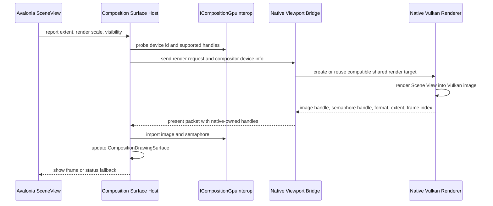

# Studio Composition Vulkan Viewport Spike Design

## Intent

Make the next Studio viewport goal concrete: prove that one docked Scene View can display a native-rendered Vulkan frame through Avalonia Composition GPU interop, without using `NativeControlHost` and without moving renderer ownership into managed UI code.

This supersedes the current Scene View control shell plan as the top-level implementation target. The control shell remains useful, but it becomes an input layer for the composition spike instead of the final milestone.

## Current Progress

Completed:

- Studio Phase 1 viewport contracts and scheduler are merged to `main`.
- `apps/studio/Core/Models/Viewports` owns UI-neutral viewport identity, extent, clock, render reason, update policy, render request, and render result contracts.
- `apps/studio/Core/Services/ViewportScheduler.cs` can decide whether visible, dirty, focused, frame-debug, runtime, and preview viewports should render.
- Native C++ already has `EditorViewportRequest`, `EditorViewportResult`, `EditorViewportCoordinator`, offscreen render targets, sampled texture publication for ImGui, keyed viewport slots, render-view diagnostics, and editor viewport smoke tests.
- Avalonia `12.0.4` is the resolved Studio UI package version.
- Local Avalonia `12.0.4` reference metadata exposes `Compositor.TryGetCompositionGpuInterop`, `ICompositionGpuInterop`, `SupportedImageHandleTypes`, `SupportedSemaphoreTypes`, `ImportImage`, `ImportSemaphore`, `CompositionDrawingSurface.UpdateAsync`, `UpdateWithSemaphoresAsync`, and `UpdateWithTimelineSemaphoresAsync`.

Not completed:

- Studio Scene View has no real viewport surface.
- Studio does not probe Avalonia composition GPU interop at runtime.
- Studio has no native viewport request/result bridge.
- Native Vulkan does not export shared images or semaphores for Avalonia.
- No code currently proves Avalonia and native Vulkan are on the same physical device.

## Target Decision

Adopt `Avalonia Composition + Vulkan shared image` as the default embedded Studio viewport direction.

Rejected as the default path:

- `NativeControlHost`, because native child windows have airspace and overlay limitations that conflict with docked editor UX.
- CPU readback into an Avalonia bitmap, because it validates pixels but not the intended GPU composition architecture.
- A native swapchain inside Studio, because the GamePreview/performance path should remain separate from docked editing viewports.

The target is a spike, not the full viewport framework. It must render one Scene View frame through the real composition path and produce diagnostics for every failure mode.

## Target Flow



## Architecture

### Studio Core

Studio Core remains UI-neutral. It may add status and metadata snapshots for composition capability and native viewport results, but it must not own platform handles, Avalonia objects, Vulkan objects, native pointers, or renderer lifetime.

Allowed Core concepts:

- viewport id, kind, extent, clock, render reason, scheduler decision
- composition availability status
- native render result metadata such as frame index, requested extent, format name, backend status, and error message

Disallowed Core concepts:

- `VkImage`, `VkSemaphore`, `VkDevice`, `HWND`, `HANDLE`, `IntPtr`, `nint`
- `ICompositionGpuInterop`
- `CompositionDrawingSurface`
- Avalonia controls or visuals

### Studio Avalonia Layer

The Avalonia layer owns UI thread state and composition objects:

- Scene View visual tree attachment and detachment
- DIP bounds, pixel extent, render scale, focus, visibility
- compositor lookup through `TopLevel` and the element compositor
- `ICompositionGpuInterop` capability probing
- imported Avalonia image/semaphore wrappers
- `CompositionDrawingSurface` updates
- fallback status surface

It does not render Vulkan commands and does not wait for native GPU fences.

### Native Bridge

The native bridge owns ABI conversion:

- ABI version negotiation
- compositor device identity packet from managed to native
- viewport request packet from managed to native
- native present packet from native to managed
- status codes and error strings

The bridge may pass opaque OS handles to the Avalonia layer as short-lived interop packets, but ownership stays native unless the ABI explicitly transfers close responsibility. The first spike should keep close responsibility native to avoid managed code duplicating Vulkan resource lifetime.

### Native Renderer

Native C++ owns:

- Vulkan physical device and device selection
- external memory and external semaphore capability checks
- shared image pool
- image layout transitions and render graph integration
- semaphore signaling
- deferred destruction after GPU completion and compositor release policy
- render-view diagnostics

The native path should reuse the existing editor viewport and `renderer_basic_vulkan` RenderView code where possible. New Vulkan commands belong in RHI/backend/editor-native adapter code, not Studio managed code.

## Scope

Implement a Windows-first spike for one Scene View.

The spike proves:

- Avalonia exposes composition GPU interop on the running machine.
- Avalonia supports a Vulkan image handle type and semaphore synchronization path usable by this project.
- Native Vulkan can select or verify a device compatible with Avalonia composition.
- Native can render a Scene View frame into an externally shareable image.
- Studio can import that image and present it in a docked Scene View.
- Resize and hidden state do not crash and do not block the UI thread.
- Failure states remain usable and diagnosable.

## Non-Goals

- Multi-viewport scheduling beyond one Scene View.
- Camera navigation, picking, gizmos, selection mutation, or tool routing.
- Persistent scene editing transaction flow.
- GamePreview swapchain host.
- Cross-platform composition abstraction.
- Production frame pacing.
- Perfect performance.
- RenderDoc/Nsight capture guidance for the embedded viewport.

## Phases

### B0: Composition Capability Probe

Goal: make Studio able to explain whether scheme B is possible on this machine.

Work:

- Create a Studio-side capability service in the Avalonia/Shell or SceneView layer.
- Query `ICompositionGpuInterop`.
- Record `DeviceLuid`, `DeviceUuid`, `SupportedImageHandleTypes`, `SupportedSemaphoreTypes`, and `IsLost`.
- Publish a UI-neutral status snapshot.
- Show status in Scene View.

Acceptance:

- Unsupported interop does not crash.
- Capability status is visible in the Scene View surface.
- Tests cover status projection and failure fallback.
- No native Vulkan code is required in this phase.

### B1: Native Compatible Device Handshake

Goal: prove that Avalonia composition and native Vulkan can target the same GPU.

Work:

- Extend or add a native viewport bridge ABI beside the existing frame debugger bridge.
- Pass Avalonia device LUID/UUID and supported handle types to native.
- Native reports whether the current Vulkan physical device is compatible.
- Native reports the image and semaphore handle types it can produce.

Acceptance:

- Device match, mismatch, unsupported handle type, and native bridge unavailable are separate statuses.
- Studio remains usable when native bridge is missing.
- C++ smoke covers compatible-device packet validation without requiring an Avalonia process.

### B2: Native Shared Image Producer

Goal: render one native Scene View frame into a shareable image.

Work:

- Add a native shared render target path for one Scene View.
- Use external memory image creation only inside Vulkan backend/editor-native code.
- Render via existing RenderView path.
- Signal a synchronization primitive supported by Avalonia.
- Return a present packet with frame index, extent, format, color space, image handle descriptor, semaphore handle descriptor, and status.

Acceptance:

- Native smoke creates, renders, and retires a shared viewport image.
- Existing `--smoke-editor-viewport` and `--smoke-editor-viewport-resize` continue to pass.
- No generic renderer or render graph public API exposes Vulkan handle ownership.

### B3: Avalonia Composition Consumer

Goal: import the native image and show it in Scene View.

Work:

- Create a Scene View composition host control or view-owned adapter.
- Import the native image with `ICompositionGpuInterop.ImportImage`.
- Import synchronization with `ImportSemaphore` when supported.
- Update `CompositionDrawingSurface` through semaphore or timeline semaphore update.
- Drop late frames instead of blocking the UI thread.

Acceptance:

- Single embedded Scene View displays a native-rendered frame.
- UI thread does not wait for a Vulkan fence.
- Missing or failed import falls back to status UI.
- Detach releases managed imported wrappers without destroying native-owned Vulkan resources early.

### B4: Resize, Hidden State, And Recovery

Goal: keep the spike stable under editor UI lifecycle changes.

Work:

- Recreate shared images on extent or render scale changes.
- Stop render requests for hidden or detached Scene View.
- Keep old images alive until native and compositor ownership is complete.
- Surface device lost and import-lost states as status snapshots.

Acceptance:

- Resize does not crash.
- Hidden Scene View does not request renders.
- Device-lost or interop-lost state disables present and shows a status message.
- Validation runs both Studio managed tests and native editor viewport smokes.

## Result Model

The native present packet should be separate from Core viewport scheduling contracts. A practical shape:

```text
NativeViewportPresentStatus
  Success
  NativeBridgeUnavailable
  UnsupportedAbi
  UnsupportedCompositionInterop
  DeviceMismatch
  UnsupportedHandleType
  RenderFailed
  ImportFailed
  DeviceLost

NativeViewportPresentSnapshot
  ViewportId
  RequestedWidthPixels
  RequestedHeightPixels
  ActualWidthPixels
  ActualHeightPixels
  FormatName
  ColorSpace
  FrameIndex
  PresentedAtUtc
  Status
  Message
```

Any platform handle packet must live outside Core, in an interop-specific namespace, and must be short-lived.

## Synchronization Rules

- Native signals when rendering to the shared image is complete.
- Avalonia waits through `CompositionDrawingSurface` update methods, not through UI-thread fence waits.
- If semaphore import is unavailable, the spike may use `UpdateAsync` only when Avalonia reports automatic synchronization for the imported image.
- If neither semaphore nor automatic synchronization is available, the present path is unsupported.
- Native must not recycle a shared image until both GPU work and the managed composition path have released or superseded it.
- Shutdown may wait for GPU idle only as a final cleanup path, with a comment explaining the boundary.

## Error Handling

Every failure path returns a status snapshot:

- no compositor
- no GPU interop
- interop device lost
- no Vulkan external image support
- no compatible semaphore support
- device id mismatch
- native bridge unavailable
- unsupported ABI
- image creation failure
- render failure
- image import failure
- semaphore import failure
- resize race or stale frame

The Scene View should prefer a clear status surface over partial presentation. A stale valid frame can remain visible only if the status text says the latest frame failed.

## Validation

Managed checks:

```powershell
dotnet test apps\studio\Tests\Editor.Tests\Editor.Tests.csproj -c Release --filter "SceneView|Viewport|Composition"
dotnet test apps\studio\Editor.sln -c Release
```

Repository hygiene:

```powershell
powershell -ExecutionPolicy Bypass -File tools\check-text-encoding.ps1
powershell -ExecutionPolicy Bypass -File tools\check-doc-sync.ps1
git diff --check
```

C++ build checks:

```powershell
cmd /c "build\conan\clangcl-debug\Debug\generators\conanbuild.bat && cmake --preset clangcl-debug && cmake --build --preset clangcl-debug"
cmd /c "build\conan\msvc-debug\Debug\generators\conanbuild.bat && cmake --preset msvc-debug && cmake --build --preset msvc-debug"
```

Renderer/editor smokes for implementation phases B1 and later:

```powershell
build\cmake\clangcl-debug\apps\editor\asharia-editor.exe --smoke-editor-viewport
build\cmake\clangcl-debug\apps\editor\asharia-editor.exe --smoke-editor-viewport-resize
build\cmake\msvc-debug\apps\editor\asharia-editor.exe --smoke-editor-viewport
build\cmake\msvc-debug\apps\editor\asharia-editor.exe --smoke-editor-viewport-resize
```

Manual visual validation for B3 and later:

- Launch Studio.
- Open Scene View.
- Confirm the status surface changes from capability probing to presented frame.
- Resize the docked panel.
- Hide and show the panel.
- Confirm no UI freeze occurs while frames are dropped or imported.

## Relationship To Existing Plan

`docs/superpowers/plans/2026-07-06-studio-scene-view-control-shell.md` remains valid as the managed input shell plan. Its work should be folded into B0/B3/B4 where needed:

- bounds and render scale feed B0/B3
- focus and visibility feed scheduler request gating
- pointer input is deferred until the first visible composition frame works
- scheduler preview becomes the request source for native rendering after B3

## Risks

- Avalonia may run on a backend that does not support Vulkan external image import on the current machine.
- Avalonia and native Vulkan may select different physical devices.
- Windows Vulkan external memory and semaphore handle creation may require feature and extension plumbing not currently present in `rhi-vulkan`.
- Imported image lifetime may need explicit release acknowledgements from managed to native.
- Timeline semaphore support may differ from binary semaphore support.
- The first implementation may need a native smoke harness that simulates Avalonia capability packets.
- Composition visuals may require a custom Avalonia control shape beyond the current Scene View status surface.

## Decision

Accept the request, narrowed to a Windows-first single Scene View composition spike. The next artifact should be an implementation plan for B0 through B3, with B4 either included if small or split into a follow-up slice after the first visible frame works.
