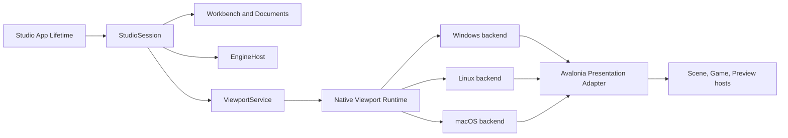
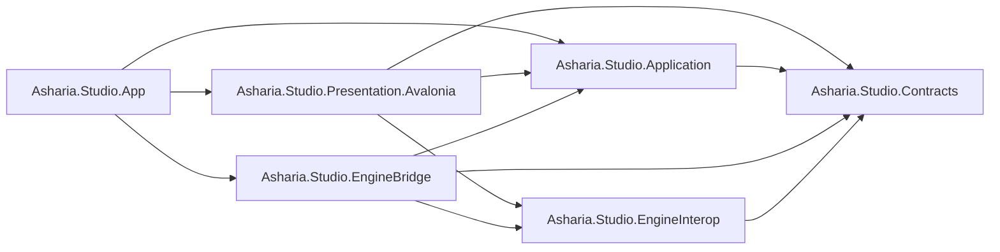
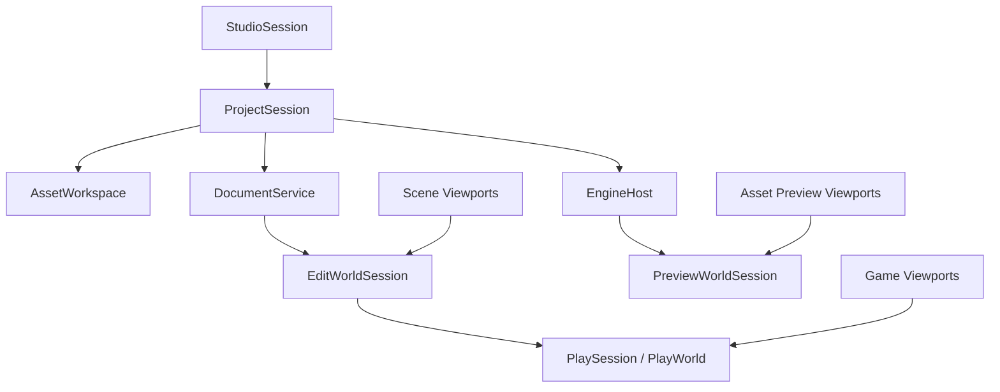
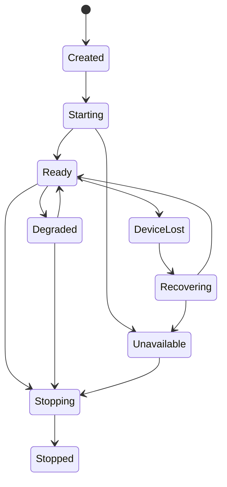
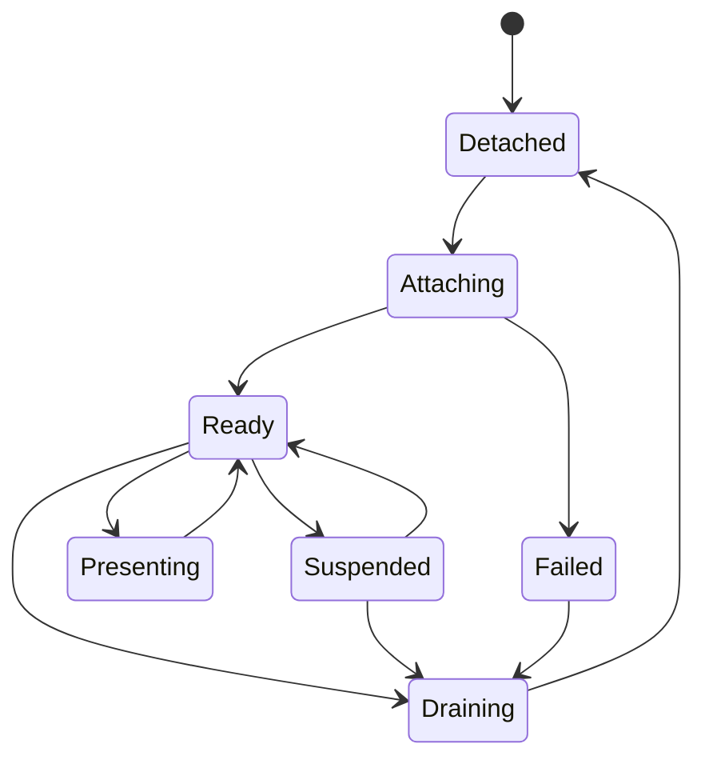
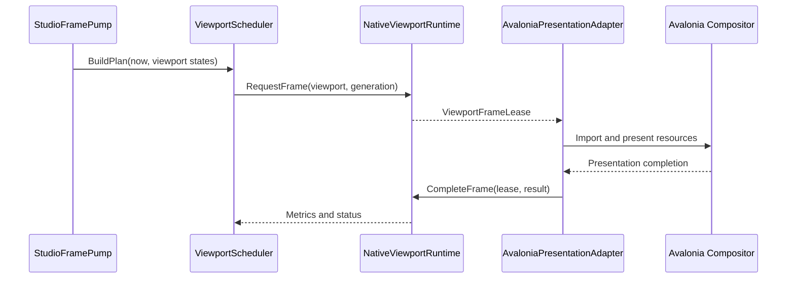
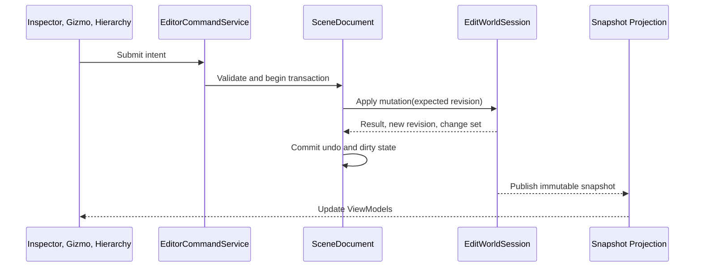

# Studio Framework vNext Design

Status: Historical / Superseded as governing baseline

Date: 2026-07-11

Scope: `apps/studio` only

## Purpose

Define the production architecture for Asharia Studio as a cross-platform game-engine editor. The design corrects framework ownership, lifecycle, rendering, Play Mode, extension, and project-boundary problems found in the current implementation and documentation.

This specification records the first framework-correction decision. It is no longer the governing design because ADR-0004 and ADR-0005 subsequently approved the unified public Editor Framework, project `Editor/`, `.asmdef`, Avalonia extension bridge, and managed module build/reload model. Current target authority starts at `docs/architecture/README.md`; this dated specification remains historical evidence and does not claim that its target is implemented.

## User Requirements

The approved requirements are:

- Native Vulkan viewport rendering is a production capability, not a temporary spike.
- The architecture must support Windows, Linux, and macOS.
- Multiple Scene, Game, Preview, and debug viewports may be visible and rendering at the same time.
- Viewports may be docked, moved, floated, hidden, minimized, and restored without transferring renderer ownership to windows or controls.
- Studio is a game-engine editor. It must model projects, editable worlds, Play Mode, asset previews, transactions, engine frames, and renderer frames explicitly.
- Play Mode supports an embedded Game View, a Studio-owned secondary window, and a standalone game process.
- The near-term runtime remains in-process, but the managed application contract must not depend on the in-process transport.

## Current Repository Facts

The current framework has useful v0 foundations:

- `Shell/Composition/EditorExtensionHost.cs` validates and commits built-in contributions.
- `Shell/Docking/Panels/PanelInstanceManager.cs` owns basic panel instance caching and logical panel lifecycle callbacks.
- `Shell/Services/EditorPanelFrameScheduler.cs` provides a testable editor-panel update policy.
- `Core/Services/ViewportScheduler.cs` models viewport render decisions.
- `Features/SceneView` can import a native Vulkan image and semaphores into an Avalonia `CompositionDrawingSurface` on the current Windows path.
- Scene, Frame Debugger, diagnostics, selection, command, and transaction snapshot contracts exist as v0 implementations.

The current system is not the target production framework:

- `Core` is documented as UI-neutral but contains P/Invoke/native adapter code and an Avalonia `PlatformHandle` dependency.
- `App`, views, composition services, and static native APIs split ownership of startup and shutdown.
- A Scene View creates its native bridge directly.
- `EditorPanelFrameScheduler` drives production UI behavior while `ViewportScheduler` is not connected to a production caller.
- Floating workspaces create scheduler instances that are not consistently driven by the main timer.
- The native present path hard-codes Windows opaque NT image and semaphore handles.
- There is no production Game View, `PlaySession`, `EditWorldSession`, or `PreviewWorldSession`.
- `WorkbenchFeatureModule` aggregates most built-in features and fixture providers, so feature independence is mostly declarative.
- Existing documents mix current behavior, desired architecture, temporary spike constraints, and deferred roadmap decisions.

Consequently, `docs/Studio框架设计.md`, `docs/编辑器UI平台规范.md`, and the 2026-07-05/06 viewport spike specifications are evidence of prior decisions but are not authoritative for the vNext target where they conflict with this document.

## Architectural Decision

Use an in-process, modular engine host with strict managed/native ownership and a transport-neutral application boundary.



The native engine owns Vulkan instances, devices, queues, worlds, renderer resources, shared images, native synchronization objects, and GPU lifetime. Managed Studio owns authoring workflows, documents, commands, windowing, Dock, diagnostics, presentation bindings, and application lifetime.

Avalonia controls never own the engine or Vulkan objects. The embedded viewport remains native engine rendering; Avalonia only imports and composites the native-rendered image.

### Alternatives

#### Current direct in-process bridge

Rejected. View-owned bridge creation, static shutdown, platform-specific packets, and split lifetime ownership cannot safely support several windows and viewports.

#### Renderer-first independent process

Deferred. A separate process improves crash isolation but adds IPC framing, protocol versioning, cross-process GPU handle transfer, process restart, project-state synchronization, and platform-specific deployment before the editor has stable session contracts.

#### Recommended modular in-process host

Accepted. It preserves low-latency authoring and direct GPU sharing while allowing an `InProcessEngineTransport` to be replaced by a future `IpcEngineTransport` without changing Studio application use cases.

## Target Project Boundaries

The current single application assembly should migrate incrementally to six projects. The sixth project is a deliberately narrow interop boundary; without it, platform GPU descriptors would either pollute general application contracts or make Avalonia presentation depend on a concrete native bridge implementation.



### `Asharia.Studio.Contracts`

Owns UI-neutral stable identifiers, immutable snapshots, command/result records, viewport descriptors, and contribution metadata. It must not reference Avalonia, P/Invoke, filesystems, or concrete engine implementations.

### `Asharia.Studio.Application`

Owns `StudioSession`, `ProjectSession`, documents, transactions, selection, diagnostics, scheduling policies, and ports for engine, world, asset, and viewport capabilities. It coordinates use cases but does not create controls or call P/Invoke.

### `Asharia.Studio.EngineInterop`

Owns the narrow transport-neutral protocol shared by native/IPC adapters and presentation adapters: `ViewportFrameLease`, external GPU resource descriptor kinds, ownership/transference metadata, completion results, and capability records. It may represent an opaque native-sized handle value, but it does not import that handle, call P/Invoke, or reference Avalonia. General editor features do not reference this project.

### `Asharia.Studio.EngineBridge`

Owns native library loading, ABI negotiation, native session handles, conversion from C ABI packets into `EngineInterop` leases, and implementations of Application engine ports. It does not reference Avalonia.

### `Asharia.Studio.Presentation.Avalonia`

Owns App shell presentation, Window, Dock, View, ViewModel, DataTemplate, dispatcher integration, composition surfaces, input adapters, and GPU-resource import. It does not own the engine, world, or native GPU allocation.

### `Asharia.Studio.App`

Owns the single composition root, platform startup, module assembly, runtime discovery, publishing configuration, and asynchronous application start/stop orchestration. It does not contain feature behavior.

Feature code remains vertically organized initially. Individual feature assemblies are deferred until independent packaging, loading, or compilation provides a measured benefit.

## Game-Editor Domain Model

Studio is an authoring host and embedded engine client, not only a presentation host.



### `StudioSession`

Owns application-level Shell services, extensions, windows, commands, diagnostics, task supervision, and the current project session.

### `ProjectSession`

Owns project configuration, engine connection, asset workspace, document service, and project-scoped lifetime.

### `SceneDocument`

Owns the editable scene identity, revision, dirty state, validation, save boundary, and undo/redo history. It refers to an engine-owned `EditWorldSession` but does not expose native object pointers.

### World sessions

- `EditWorldSession` is the engine-owned mutable authoring world for a scene document.
- `PlaySession` owns one or more Play Worlds created from a specific edit revision.
- `PreviewWorldSession` owns isolated asset-preview state, lighting, camera, and environment.
- A `ViewportSession` refers to a world session but does not own that world.

### Edit and Play isolation

Entering Play must not turn the Edit World into a simulation world.

```text
SceneDocument revision N
  -> validate and freeze an input revision
  -> create PlaySession
  -> clone or load PlayWorld from revision N
  -> simulate
  -> stop and destroy PlayWorld
  -> return to unchanged EditWorld
```

Applying Play changes back to Edit World is a future explicit, validated editor transaction. Stopping Play does not dirty the edit document by default.

## Application And Engine Lifetime

The application uses explicit asynchronous shutdown. It does not block the UI thread on `ValueTask` or `Task` completion.

```text
Application start
  -> create StudioSession
  -> show Shell in Starting state
  -> await StudioSession.StartAsync
  -> Ready or EngineUnavailable

Close requested
  -> cancel the first close request
  -> await StudioSession.StopAsync within a configured timeout
  -> report incomplete cleanup
  -> perform explicit application shutdown
```

Required stop order:

1. Stop accepting commands, provider changes, and viewport requests.
2. Cancel and await supervised background tasks.
3. Pause viewport scheduling.
4. Detach all Avalonia presentations.
5. Drain compositor/GPU frame leases.
6. Destroy viewport sessions.
7. Stop Play, Preview, and Edit World sessions.
8. Stop `EngineHost`.
9. Dispose extension activation leases in reverse order.
10. Save a validated layout snapshot.
11. Exit the Avalonia application lifetime.

Shutdown timeout is a reported fault, not permission to silently destroy GPU resources still owned by the compositor.

### Engine state



Non-rendering Studio surfaces remain available in `EngineUnavailable` state. Engine health and application lifetime are related but not identical state machines.

## Viewport Model

A viewport is an application-level session resource, not a Window, Control, or render target.

Minimum identity and policy:

```text
ViewportId
ViewportRole: Scene | Game | AssetPreview | Thumbnail | Debug
WorldSessionId
CameraState
RenderMode
EditorOverlaySet
InputRoutingMode
RenderPolicy
SurfaceGeneration
```

Multiple viewport sessions may share one world and one engine device. Each owns independent camera, render target state, presentation lease, and scheduling state.

Dock moves and floating-window changes rebind presentation only. Closing a host window drains and detaches its presentation. The logical viewport session is destroyed only when the owning editor panel/document is closed or its project session stops.

### Presentation state



Every attach, resize, backend recovery, and engine-device recovery increments a generation. An asynchronous result may update visible state only when all of these still match:

```text
EngineEpoch
ViewportId
SurfaceGeneration
FrameSequence
```

Stale results release their resources without mutating the current ViewModel.

## Cross-Platform GPU Presentation

The common protocol describes resource semantics, not Avalonia handle names or a universal pointer packet.

Platform mappings:

| Platform | Image path | Synchronization path |
| --- | --- | --- |
| Windows | Vulkan opaque Win32/NT handle | Vulkan opaque Win32/NT semaphore or supported timeline path |
| Linux | Vulkan opaque FD or DMA-BUF, selected by capabilities | Vulkan semaphore FD or another capability-reported path |
| macOS | MoltenVK-exported IOSurface/Metal texture | `MTLSharedEvent`/timeline synchronization |

Exact support must be queried on the active Avalonia compositor and Vulkan device. No platform mapping is assumed available merely because an enum value exists.

### `ViewportFrameLease`

Only an `EngineInterop` frame lease may carry platform GPU resources across the native/presentation boundary. It includes:

- viewport, engine epoch, surface generation, and frame sequence;
- extent, format, color space, and resource descriptor kind;
- image and synchronization descriptors;
- ownership/transference rules for each descriptor;
- one terminal operation: presented, abandoned, import-failed, or shutdown-cancelled.

The lease cannot depend on GC or a finalizer for correctness. Native image reuse is forbidden until GPU rendering and the managed composition consumer have both completed the negotiated release protocol.

Avalonia import failure does not imply that the imported OS handle was consumed. Each backend implements the documented close/release semantics for NT handles, FDs, IOSurface references, and Metal objects.

### Frame flow



The UI thread never waits on a Vulkan fence.

## Frame And Clock Separation

Four clocks have different owners:

| Clock | Owner | Responsibility |
| --- | --- | --- |
| UI dispatcher | Avalonia | Input, layout, bindings, visual updates |
| Editor update | Studio Application | Commands, selection, diagnostics, tools |
| Simulation tick | Native Engine | Gameplay, physics, scripts, world update |
| Render scheduling | ViewportService and renderer | Extraction, GPU work, frame presentation |

`StudioFramePump` is the application-level UI tick source. It may request editor updates and viewport render planning, but it never advances gameplay simulation directly.

`PanelUpdateScheduler` handles ordinary editor panels. `ViewportScheduler` handles render priority, fairness, budget, and backpressure. The native renderer executes the plan. These roles replace the current disconnected production/test scheduler behavior.

The viewport scheduler is stateful. It uses round-robin or aging within a priority class so continuously due viewports cannot permanently starve by ID ordering. It limits in-flight work per surface and does not queue unbounded frames behind an incomplete compositor presentation.

Suggested priority order:

1. Visible viewport currently receiving interaction.
2. Visible viewport in the active window.
3. Other visible viewports.
4. Background preview or thumbnail work.
5. Hidden or minimized viewports, normally suspended.

## Play Mode Presentation

Simulation ownership and display location are independent. A `PlaySession` may have zero, one, or several presentations.

### Embedded Game View

The default iteration mode renders the Play World to an offscreen native image and imports it into a docked Avalonia Game View.

This is native engine rendering. Avalonia composites the completed image; it does not reproduce the renderer.

### New Editor Window

A Studio-owned Avalonia top-level window hosts the same Game View presentation contract. It is useful for multiple displays and fixed preview sizes but is still an editor-composited presentation, not a game WSI swapchain.

### Standalone Game

A separate game process owns a native OS window, `VkSurfaceKHR`, swapchain, input, and platform runtime. Studio launches and observes it through a debug/telemetry/command connection.

Standalone mode is the authoritative path for fullscreen, HDR, VR, present-mode latency, raw input, crash isolation, multiplayer clients, and release-like performance.

```text
PlayPresentationMode
  EmbeddedGameView
  EditorWindowGameView
  StandaloneProcess
```

Embedded and Editor Window presentations use the shared-image composition backend. Standalone uses the game's native WSI backend. Their performance numbers are not interchangeable.

### Viewport/world targets

- Scene View targets `EditWorldSession` by default.
- Game View targets `PlaySession`.
- Simulate mode may explicitly retarget a Scene View to Play World.
- Asset Preview targets `PreviewWorldSession`.
- Debug viewport targets an explicitly selected renderer resource/pass.

### Game input

Embedded input flows through a `GameViewInputAdapter` into normalized engine input packets. Game View focus and capture control whether global Studio shortcuts or gameplay receive keyboard and pointer events. Relative mouse, pointer confinement, IME, gamepad focus, and emergency cursor release require explicit policies and tests.

## Editor Mutation And Snapshot Flow

Snapshots remain immutable UI projections. They are not the write path or the engine truth.



Mutation requirements:

- Stable entity, component, property, asset, document, and world identifiers.
- Expected revision on every authoring mutation.
- No undo entry or dirty-state change until the engine mutation succeeds.
- Undo and Redo use the same engine command boundary as the original edit.
- Failed operations preserve transaction stacks and document state.
- No ViewModel stores native pointers or mutable engine objects.

Provider publication must be atomic. A snapshot, its lookup indexes, and its revision become visible as one immutable publication. Older revisions cannot overwrite newer state.

## Asset Boundary

`AssetWorkspace` owns source assets, metadata, importer settings, dependencies, and cooked artifacts. `SceneDocument` refers to stable asset IDs. Avalonia views do not import source files or allocate renderer resources.

Runtime resources loaded for viewports are owned by the native engine/resource system. Studio consumes asset status and diagnostics through Application contracts.

## Extension And Panel Model

`EditorExtensionHost` remains a lifecycle coordinator, not a Dock, command, or renderer executor.

The built-in `WorkbenchFeatureModule` should be decomposed into real modules such as:

- `SceneViewFeatureModule`
- `GameViewFeatureModule`
- `HierarchyFeatureModule`
- `InspectorFeatureModule`
- `FrameDebuggerFeatureModule`
- `ConsoleFeatureModule`
- `ProblemsFeatureModule`
- `BuiltInEngineIntegrationModule`

Feature modules declare immutable panel, command, provider, overlay, and adapter contributions. Shell/Application domain executors own their runtime behavior.

`PanelDescriptor.Func<object>` is a compatibility shape, not a durable plugin ABI. The target uses a typed panel factory that produces a panel/ViewModel lifetime object. Presentation maps it to a View through explicit DataTemplates. Feature modules do not return `Window` instances or arbitrary raw controls.

Contribution activation remains transactional:

1. Declare into an isolated builder.
2. Validate the entire set.
3. Commit typed registry entries atomically.
4. Activate side effects asynchronously.
5. Roll back registration and activation leases on failure.
6. Dispose activation leases in reverse order.

## Error Handling And Recovery

Exceptions do not cross the native ABI. Results contain a stable status code, operation context, and diagnostic message. Managed exceptions are isolated at panel, command, provider, presentation, and application task-supervisor boundaries.

Required recovery behavior:

- Single-frame render failure: terminate the lease, retain the session, publish diagnostics.
- Surface import failure: drain/detach that presentation and permit a later reattach.
- Resize race: reject stale generations without updating visible state.
- Device lost: suspend all viewports, increment engine epoch, drain old presentation resources, recreate the native device, and rebind surviving sessions.
- ABI mismatch or missing native runtime: enter `EngineUnavailable`; keep Shell, documents, and non-rendering tools usable where possible.
- Extension or panel factory failure: disable/isolate the failing contribution instead of aborting the complete Studio startup.
- Background event flood: batch/coalesce diagnostics and progress before dispatcher projection.
- Shutdown timeout: publish a structured failure and identify remaining sessions/tasks/leases.

## Migration Strategy

The framework is migrated in independently reviewable stages. A broad rewrite is rejected.

### Phase 0: Documentation authority

- Adopt this specification as the vNext design baseline.
- Add stable architecture documents and ADRs.
- Mark older documents as Current, Partial, Superseded, or Historical.
- Add a document map so a developer can identify the authoritative source for each subsystem.

### Phase 1: Contracts and Application boundaries

- Create `Asharia.Studio.Contracts`, `Asharia.Studio.Application`, and the narrow `Asharia.Studio.EngineInterop` protocol boundary.
- Move only pure contracts and use-case state first.
- Replace source-path architecture assertions with project-reference checks.
- Preserve current visible behavior.

### Phase 2: Asynchronous application session

- Introduce `StudioSession` and task supervision.
- Remove sync-over-async startup/shutdown.
- Remove static native shutdown and View-owned native bridge construction.
- Define application, project, engine, and extension stop order.

### Phase 3: Unified frame and viewport lifetime

- Establish `StudioFramePump`, `PanelUpdateScheduler`, and production `ViewportScheduler` wiring.
- Add fair scheduling, surface generations, in-flight limits, attach/detach, and drain semantics.
- Repair floating-window command, scheduling, and ownership behavior.

### Phase 4: Production native viewport contract

- Add `EngineHost`, opaque world/viewport handles, frame leases, ABI version negotiation, and structured status codes.
- Move native interop out of Contracts/Core and keep it Avalonia-independent.
- Implement Windows, Linux, and macOS presentation backends behind one capability-driven contract.
- Platform implementations may land sequentially, but the shared contract cannot encode the first platform's handle model.

### Phase 5: Game-editor domain

- Add Project, SceneDocument, EditWorld, PlaySession, PreviewWorld, and stable revision semantics.
- Connect read projections and the transaction-backed write path.
- Add embedded Game View and Studio-owned Game View window.

### Phase 6: Standalone Play and engine integration

- Add standalone game launch, debugging/telemetry connection, and lifecycle reporting.
- Validate native WSI, input, fullscreen, HDR/VR where supported, and release-like performance separately from embedded presentation.

### Phase 7: Feature and Dock migration

- Split the built-in workbench aggregator into explicit modules.
- Replace untyped panel factories.
- Complete multi-window command routing, accessibility, persistence failure handling, and presentation reattachment.

## Documentation Set

After approval of this design specification, the stable documentation set should be:

```text
docs/architecture/studio-overview.md
docs/architecture/studio-lifecycle.md
docs/architecture/editor-worlds-and-play-mode.md
docs/architecture/viewport-rendering.md
docs/architecture/studio-extension-model.md

docs/adr/
  0001-in-process-engine-host.md
  0002-cross-platform-viewport-presentation.md
  0003-studio-project-boundaries.md
```

Architecture documents describe stable contracts and current migration status. ADRs preserve durable tradeoffs. Feature specs and implementation plans remain dated execution artifacts and must not silently redefine the architecture baseline.

## Validation Strategy

### Managed architecture and unit tests

- Project references prohibit reverse dependencies.
- Session state machines cover normal, cancellation, failure, and timeout paths.
- Transaction tests prove failure atomicity and revision checks.
- Snapshot publication tests prove atomic snapshot/index/revision visibility.
- Scheduler tests prove fairness, backpressure, generations, and no hidden-viewport work.

### Avalonia tests

- Headless tests cover bindings, commands, focus, input routing, Dock moves, and multi-window behavior.
- Integration tests cover presentation attach/detach, resize generations, stale async results, and dispatcher batching.
- Critical accessibility and keyboard flows are tested rather than asserted by XAML source strings.

### Native ABI and GPU tests

- ABI size/version/status and invalid-packet contract tests.
- Frame-lease tests for success, abandon, import failure, duplicate completion, and shutdown.
- Fault injection for missing capability, incompatible device, device loss, and release timeout.

### Cross-platform smoke matrix

Each supported backend validates on Windows, Linux, and macOS:

- two or more simultaneously active viewports;
- Scene and Game Views targeting different worlds;
- Dock-to-float-to-Dock movement;
- resize, minimize, restore, hide, close, and reopen;
- Play start/pause/step/stop;
- presentation import failure and device recovery;
- no validation errors, unbounded queue growth, leaked handles, or pending frame leases;
- deterministic shutdown.

### Performance evidence

Record representative hardware, resolution, viewport count, renderer configuration, and build configuration. Measure:

- UI input latency;
- render-to-compositor latency;
- frame throughput and dropped frames;
- CPU and GPU time;
- GPU memory per viewport;
- Play start/stop time;
- shutdown drain time.

Embedded Game View measurements are not presented as standalone-game performance.

## Non-Goals

- No immediate move of the embedded engine to an independent process.
- No external managed plugin hot reload in this framework correction.
- No arbitrary runtime-loaded XAML or plugin-created raw Window.
- No automatic application of Play World changes to Edit World.
- No claim that one GPU sharing mechanism works identically across all platforms.
- No all-at-once rewrite or premature per-feature assembly split.
- No renderer or simulation ownership in Avalonia ViewModels or controls.

## Risks

- Avalonia compositor capabilities may differ by OS, graphics backend, driver, and selected device.
- MoltenVK/Metal object export and Avalonia IOSurface/Metal event import require target-hardware validation.
- Renderer and compositor device mismatch may make embedded zero-copy presentation unavailable on some systems.
- Device-loss recovery may expose missing engine-wide resource reconstruction contracts.
- Project splitting can reveal existing hidden upward dependencies and temporarily increase migration cost.
- Maintaining embedded and standalone presentation requires separate performance and input validation.
- A same-process native crash still terminates Studio; a future IPC transport remains the isolation path.

## Acceptance Criteria

This design baseline is accepted when:

- Current facts and target contracts are explicitly separated.
- Studio is modeled as a game-engine authoring host with Edit, Play, and Preview worlds.
- Native Vulkan rendering is production scope for Windows, Linux, and macOS.
- Multi-viewport and floating-window ownership do not belong to individual controls.
- Embedded Game View, Studio-owned Game Window, and standalone process have distinct contracts and validation roles.
- Engine, viewport, frame lease, project, document, and application lifetimes have explicit owners and stop order.
- Compile-time project boundaries replace documentation-only layering over time.
- Migration phases are independently testable and avoid an all-at-once rewrite.

## Authoritative References

- Avalonia application lifetimes: <https://docs.avaloniaui.net/docs/fundamentals/application-lifetimes>
- Avalonia threading model: <https://docs.avaloniaui.net/docs/app-development/threading>
- Avalonia custom rendering and external GPU resources: <https://docs.avaloniaui.net/docs/graphics-animation/custom-rendering>
- Avalonia `ICompositionGpuInterop`: <https://docs.avaloniaui.net/api/avalonia/rendering/composition/icompositiongpuinterop>
- Vulkan external synchronization: <https://docs.vulkan.org/spec/latest/chapters/synchronization.html>
- Vulkan external memory and synchronization guide: <https://docs.vulkan.org/guide/latest/extensions/external.html>
- Vulkan Metal object interop: <https://docs.vulkan.org/refpages/latest/refpages/source/VK_EXT_metal_objects.html>
- Vulkan external memory Metal extension: <https://docs.vulkan.org/refpages/latest/refpages/source/VK_EXT_external_memory_metal.html>
- MoltenVK: <https://github.com/KhronosGroup/MoltenVK>
- Unreal In-Editor Testing: <https://dev.epicgames.com/documentation/en-us/unreal-engine/ineditor-testing-play-and-simulate-in-unreal-engine>
- Unreal multi-world PIE: <https://dev.epicgames.com/documentation/unreal-engine/play-in-editor-multiplayer-options-in-unreal-engine>
