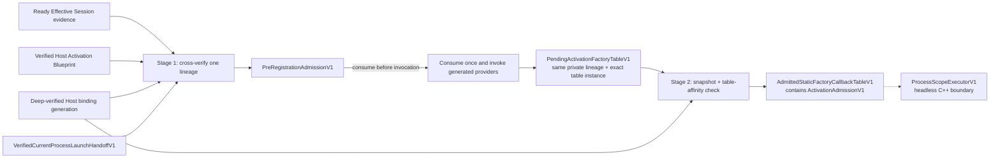

# ADR：Activation Eligibility v1

## 状态

Accepted for #292；C++ contracts、validator、linear wrappers、focused tests 与最终门禁已由 #292 Done evidence 记录，生产启动接入尚未完成。

后继 [ProcessScope Lifecycle v1](adr-process-scope-lifecycle-v1.md) 已在 `engine/host-runtime` 增加只消费 admitted owner 的
headless C++ executor、factory contexts、token ownership、startup rollback 与 explicit stop 实现，并已通过 #293 门禁。
production issuer、normal Host 与 Bootstrap/Session adapter 依然未实现。

本 ADR 冻结两阶段、current-process-only 的授权边界：长生命周期 Host 必须先取得
`PreRegistrationAdmissionV1`，才能通过 admitted path 调用 generated providers；同一次 recording 形成的
`StaticFactoryCallbackTableV1` 再与 deep-verified binding evidence 对证成功后，才产生绑定该 table instance 的
`ActivationAdmissionV1`。

当前 #295 已实现路径唯一接受 Windows Development Host Template renderer 2 + Static Composition renderer 5 +
`asharia-static-factory-provider-v4` + RegistrationSnapshot v2。Receipt v1 保持 artifact binding envelope；这不是旧版兼容政策，
其他 tuple 一律拒绝，也不保留旧 generated Host reader 或 adapter。typed contribution 证据的后继边界见
[Static Typed Contribution Contract Bindings v1](adr-static-typed-contribution-contract-bindings-v1.md) 与
[Static Contribution Payload Accessors v1](adr-static-contribution-payload-accessors-v1.md)。

当前 renderer 2 executable 仍只有 disposable registration-verification `main()`，仓库也尚无生产
current-image/launch adapter。public API 没有 production minting constructor；只有 PRIVATE focused-test issuer 能构造输入 handoff。
因此本 ADR 不宣称现有 Editor、sample 或 generated Host 已能完成端到端 activation；在生产 issuer 落地前，正常启动路径保持
fail closed，不能伪造 admission 或报告项目已激活。

## 问题

现有边界分别证明了不同事实：

- Ready `EffectiveSessionPlan` 证明 Distribution、Project/Lock、candidates 与 Host Profile 已对证；
- `HostActivationBlueprint` 证明同一 Ready Session 派生出的 logical factory closure、scope 与 dependency order；
- deep-verified `HostExecutableBindingReceiptV1` 证明 generated inputs、staged executable bytes 与 observed registration
  snapshot 属于同一个 immutable binding generation；
- `StaticFactoryCallbackTableV1` 证明当前进程的一次 provider recording 交付了完整 typed callback descriptors。

它们都不能单独回答“当前长生命周期进程现在是否允许执行项目 native providers 或读取 callbacks”。尤其不能把以下词汇混为一谈：

| 词汇 | 只表示什么 | 不表示什么 |
| --- | --- | --- |
| Effective Session `Ready` | 项目 graph/profile 可继续生成与构建 | provider、callback 或 lifecycle 可执行 |
| `PreRegistrationAdmissionV1` | 同一进程可进行一次 provider recording attempt | table 已正确、instance 已创建或项目已 Ready |
| `ActivationAdmissionV1` | 同一 lineage、同一 table instance 可交给后续 executor | 任一 lifecycle callback 已成功 |
| future `ProjectReady` | ProcessScope start 成功后由未来 Bootstrap adapter 发布的运行状态 | 本 ADR 的输出；当前也没有该 production path |

还存在两个容易产生错误承诺的缺口：

1. raw receipt JSON、generation directory name、PID、executable path 或对该 path 当前文件的 hash，都不能单独证明当前已加载进程就是 receipt
   对应的 exact artifact；
2. 两个 callback table 可以拥有完全相同的 identity snapshot，却持有不同 callback addresses。Stage 2 只比较 snapshot 后再把
   admission 用到另一张 table，会形成同身份、不同实现的 accidental substitution。

## 决策摘要



Eligibility 是 pure, fail-closed Host Runtime policy。它消费已经验证并投影到内存的 owning facts；不解析 JSON、不读 filesystem、
不 resolve package、不 hash executable、不 spawn process，也不调用五个 lifecycle callbacks。

## 1. Authority 与依赖方向

| 输入或输出 | 权威 owner | Eligibility 的使用方式 |
| --- | --- | --- |
| Ready Session evidence | `package-runtime` / Effective Session verifier | session fingerprint、Engine generation、Host kind、platform |
| Blueprint evidence | Host Activation Blueprint validator | session binding、Blueprint SHA-256 与 Host identity |
| binding evidence | #288 deep verifier 的 constructor-restricted projection | composition/template generation、current tuple、artifact identity、expected snapshot |
| current-process evidence | fixed Bootstrap/launcher/platform adapter | 把 exact verified artifact launch、live process instance 与 exact generated recording driver pair 绑定 |
| two admissions | `engine/host-runtime` eligibility | 控制一次 recording 与同一 table 的 descriptor access |
| lifecycle outcome | #293 `ProcessScopeExecutorV1` | 消费 admitted table；不反向构造 admission 或发布 Bootstrap state |

依赖方向固定为：

```text
package-runtime / #288 deep verifier
                  ↓ verified owning projections
fixed Bootstrap + launcher/platform process adapter
                  ↓ eligibility facts + sealed current-process evidence
engine/host-runtime eligibility
                  ↓ admissions
generated composition recording / ProcessScope executor
```

`engine/host-runtime` 不依赖 Python tools、Package Runtime、Editor、filesystem 或 platform API。provider packages 继续只看窄 callback /
registrar contract，不看到 Session、receipt 或 admissions。

## 2. Eligibility handoff 不是新的 manifest

Host Runtime 使用 source-specific、owning C++ projections，而不是接收任意 JSON dictionary 或借用 `string_view`：

```text
ReadySessionHandoffV1
  host = Engine generation + Host kind + target platform
  sessionFingerprint

VerifiedHostActivationBlueprintHandoffV1
  same host
  effectiveSessionIntegrity
  blueprintIntegrity

DeepVerifiedHostBindingHandoffV1
  same host
  binding generation
  composition generation + manifest integrity + renderer revision
  template generation + manifest integrity + renderer revision
  provider API
  blueprint integrity
  artifact size + SHA-256
  deep-verified expected RegistrationSnapshot

VerifiedCurrentProcessLaunchHandoffV1
  same binding/artifact lineage
  opaque process-instance anchor
  sealed registration-capacity function + recording function
  optional adapter-owned OS handle/file lease
```

前三组 facts 本身不是 capability。它们只能由对应 verifier 的窄 adapter 从仍然有效的 owning result 投影；raw receipt、raw
snapshot、目录名或调用方自报字符串不能使用 `Verified*` constructor。

`VerifiedCurrentProcessLaunchHandoffV1` 是 move-only、不可默认构造、不可复制、不可序列化的 sealed object。名称刻意只承诺
“已验证 launch handoff”，不声称事后重新读取 path 就能证明全部 loaded-image pages。它的 production issuer 必须：

1. 从 deep-verified immutable binding generation 开始；
2. 关联 launcher 实际创建的 process object，而不是只保存 PID；
3. 把 receipt 中 exact artifact identity 与该 launch handoff 绑定；
4. 在目标进程中附加不可跨进程序列化的 process-instance anchor；
5. 私有绑定该 exact generated Host 的 capacity function 与 recording function；
6. 在 Stage 1 消费完成前持有证明所需的 OS object/file lease。

具体 Windows issuer、handle inheritance/IPC 与 restart policy 属于后续 Bootstrap/launcher adapter。#292 的 Host Runtime validator
只消费 sealed object；当前没有 production issuer，测试使用 PRIVATE test issuer，不能把 `fromStrings()`、`fromPath()` 或等价 bypass
放进 public headers。缺少 launcher adapter 时，生产代码无法 mint 这些 constructor-restricted handoff，因而自然 fail closed。

capacity function 与 recording function 作为同一 launch handoff 的私有 pair 一起封存。它们不序列化、不进入 diagnostics，也不在
normal recording call site 再次作为参数出现；这避免调用点用相同签名的任意函数替换已验证的 generated provider driver。

Windows 文档说明 `CreateProcessW` 返回实际 process/thread handles，而 PID 只在进程存活期间标识该进程；
`GetModuleFileNameW` 只返回 loaded module 的路径，并且保留加载时的路径格式。由此推断，PID/path 适合 diagnostics，却不能替代
artifact bytes 与 live process object 的关联证据。

## 3. Stage 1：Pre-registration admission

Stage 1 public entry 按值接收四个 handoff：

```text
admitPreRegistration(
    ReadySessionHandoffV1,
    VerifiedHostActivationBlueprintHandoffV1,
    DeepVerifiedHostBindingHandoffV1,
    VerifiedCurrentProcessLaunchHandoffV1
) -> PreRegistrationAdmissionV1 | complete error
```

这些类型不可复制，因此调用方必须显式移动 authority；函数返回后，成功或失败都不存在仍可复用的输入副本。Stage 1 原子交叉验证：

| 检查 | 必须成立 |
| --- | --- |
| Session → Blueprint | `sessionFingerprint == blueprint.effectiveSessionIntegrity` |
| Host identity | Session、Blueprint、binding、current process 的 Engine generation / Host kind / platform 完全一致 |
| Blueprint | Blueprint self-integrity、composition input、receipt input、expected snapshot attribution 与 current process lineage 一致 |
| generated inputs | receipt 所指 composition/template generation 与 deep-verified projections 完全一致 |
| generation tuple | exact Template 2 / Composition 5 / provider v4 / RegistrationSnapshot v2；没有 fallback |
| artifact | receipt artifact size/SHA-256 与 sealed launch evidence 完全一致 |
| process instance | opaque anchor 属于当前 process epoch，未失效且未被消费 |

任一输入无效、缺失、stale、tampered 或 mixed 时，返回一个完整 error 且不产生 partial admission；provider invocation count 必须为零。
sealed launch handoff 的 process anchor 在确认属于当前 control-thread/process epoch 后，先通过共享 anchor 内的 atomic compare-and-set
永久 claim，再验证其余 lineage。当前 process epoch 由进程级 atomic shared binding 持有，不是 thread-local PID 替代物；这样任一线程上的
epoch rebind 都会使旧 admission 失效。即使内部错误预先复制了同一个 anchor，一次失败的 Stage 1 attempt 也不能用修正后的 facts 重放。

成功结果 `PreRegistrationAdmissionV1`：

- 无 public/default constructor；
- move-only，move 后 source 明确无效；
- privately owns exact lineage、expected snapshot 与 process anchor；
- privately owns launch handoff 已封存的 capacity/recording function pair；
- 只授权一次 recording attempt，不可转换为 detached `bool`；
- 绑定创建它的 bootstrap control thread epoch，而不是缓存 `std::thread::id`；每次绑定创建新的 shared epoch，thread-local weak
  reference 只在同一活动 epoch 上匹配，从而不依赖可能复用的 thread ID；wrong-thread attempt 在执行 provider 前失败，diagnostic
  不输出 thread ID 或 epoch address；
- attempt 开始前先不可逆消费，之后 allocation、recorder 或 provider registration 失败也不能重用。

## 4. Admitted provider recording

为了不修改 Host Template renderer 2 generated bytes，normal long-lived path 使用 Host Runtime wrapper 接入 current Composition renderer 5
generated function；#295 对 provider type check 的修改由 Composition renderer revision 自身诚实记录：

```text
recordAdmittedStaticFactoryProviders(
    PreRegistrationAdmissionV1
) -> PendingActivationFactoryTableV1 | complete error
```

API 按值消费 move-only admission。capacity function 与 recording function 已由 sealed launch handoff 私有带入 lineage；normal 调用点
不能提供、替换或只替换其中一个函数。

wrapper 的顺序固定为：

1. 先消费 admission 并切换为 `Recording`；
2. 调用 lineage-bound capacity function，并据此创建 recorder；
3. 恰好一次调用 lineage-bound generated `recordStaticFactoryProviders(recorder)`；
4. finish frozen callback table；
5. 将物理 table 本身、其创建后记录的 private address、独立 immutable storage anchor、`AdmittedRegistration` origin 与 Stage 1
   lineage 一同放入 stable heap-owned `PendingActivationFactoryTableV1` state；Pending 强持有原 storage anchor，防止同地址重建时
   allocator 复用旧 identity。

validator 本身不调用 provider；该 wrapper 是 admission 被消费后的唯一 normal Host invocation path。任何失败都不返回 table、lineage 或
可重试 token。recording order 仍不成为 Blueprint lifecycle order。

现有 renderer 2 registration-only executable 是明确、有限的取证例外：它可继续直接调用 generated recording function，为 #288
收集 receipt snapshot，但它没有 verified launch handoff、Pre-registration lineage 或 descriptor access，输出后立即退出。它不能把成功
registration 解释为 long-lived activation。

raw generated function 当前仍在 verification generation 内可引用，因此本 ADR 的 capability 是 Host API/ownership 防误用边界，不是
阻止同进程任意 native code 调用自身 symbols 的 sandbox。future long-lived Host source 必须只使用 admitted wrapper；topology/source
gate 应把 direct call allowlist 限于 registration-only template 与 focused tests。

## 5. Stage 2：table-bound activation admission

Stage 2 按值消费 `PendingActivationFactoryTableV1`：

```text
admitStaticFactoryActivation(
    PendingActivationFactoryTableV1
) -> AdmittedStaticFactoryCallbackTableV1 | complete error
```

Pending state 在 heap 上原位拥有物理 `StaticFactoryCallbackTableV1`，并在构造完成时保存该成员的 private address 与 table build 时
独立创建的 immutable storage anchor。Stage 2 同时验证：

1. object 来自同一次成功、未消费、同一 control thread 的 admitted recording；
2. private process/registration lineage 与 Stage 1 完全相同；
3. `table.registrationSnapshot()` 与 deep-verifier-owned expected snapshot 完全相等；
4. table private instance identity 与 pending object 记录的 identity 相同。

snapshot equality 已覆盖 composition generation、Blueprint SHA-256、package/version/module/factory 与 provider entry point。它不比较、
序列化或记录 callback address。

第四项不可省略。#291 允许不同 callback addresses 产生相同 identity snapshot，因此从另一张等价 table 取得 snapshot 后替换原 table
必须 fail closed。

registration-only path 产生的 raw table 视为 `EvidenceOnly` origin。它没有构造
`PendingActivationFactoryTableV1` 的 authority，因此即使 snapshot byte-identical，也不能进入 Stage 2。

成功返回 move-only `AdmittedStaticFactoryCallbackTableV1`。Admitted state 直接拥有完整 Pending state，而不是把 table 移出、复制或重建；
因此 exact table 的物理 address、origin 与 lineage 在 Stage 2 后继续保持同一所有权链。它同时拥有 constructor-restricted
`ActivationAdmissionV1`，不把 token 单独暴露为可与其他 table 重组的值。descriptor access 只通过 PRIVATE Host Runtime access bridge
提供给 `ProcessScopeExecutorV1`；普通 consumer 与原始 `StaticFactoryCallbackTableV1` 仍只能读取 identity snapshot。

PRIVATE bridge 返回 `optional<span<const callbacks>>`：`nullopt` 表示 admission/thread/process/origin/address/anchor/snapshot 任一复验失败，
engaged empty span 表示合法的 zero-factory table。span 只供 admitted owner 存活期间的同步即时调用，不得缓存、跨线程传递或跨 epoch
保留；#293 的 executor 已按此约束把 lifecycle 执行封装在持有 admitted owner 的同步 operation 内，只缓存 preparation 冻结的
descriptor indices，不把 borrowed view 升级为长期公共 API。

## 6. Lifetime 与失效

```text
Verified inputs
  -> PreRegistrationAdmissionV1
  -> Recording
  -> PendingActivationFactoryTableV1
  -> AdmittedStaticFactoryCallbackTableV1
  -> ProcessScopeExecutorV1 preparation/start/stop
```

以下事件使对应 object 永久无效：

- move-from、重复使用或错误 stage；
- provider attempt 开始，无论后续成功或失败；
- table 被替换、销毁或与另一 lineage 混用；
- process-instance anchor/required lease 失效；
- wrong control thread；
- Session、Blueprint、binding generation 或 expected snapshot 改变。

发生最后一类变化时必须创建新的 evidence/admissions；不就地“刷新”旧 token。Admission 不写入 receipt、lock、cache、diagnostic report
或 restart argv，也不跨进程传递。

## 7. Diagnostics 与 failure matrix

`ActivationEligibilityErrorV1` 当前只携带 stable stage/code/field 与可选 registration error code，不携带自由文本或 borrowed data。
它不得包含：

- callback/function address；
- table/process pointer、OS handle 或 private instance cookie；
- admission token bytes 或 process anchor；
- partial descriptor/table access。

最低 negative matrix：

| Stage | 示例 | 失败保证 |
| --- | --- | --- |
| Pre | missing/non-Ready source projection | no admission；provider count 0 |
| Pre | Session/Blueprint/Engine/Host/platform mismatch | no admission；provider count 0 |
| Pre | stale/tampered receipt or expected snapshot | no admission；provider count 0 |
| Pre | wrong T/C/provider tuple | no fallback；provider count 0 |
| Pre | artifact/current-process mismatch、stale anchor 或缺失 sealed driver pair | no admission；provider count 0 |
| Recording | moved/reused admission、wrong thread、recorder/provider failure | token permanently consumed；no pending table |
| Activation | table snapshot mismatch | no activation admission；descriptor count 0 |
| Activation | equal snapshot from a different table instance | no activation admission；descriptor count 0 |
| Activation | `EvidenceOnly` table requests admission | no activation admission；descriptor count 0 |
| Activation | moved/reused/wrong-stage pending object | no activation admission；descriptor count 0 |

结构化诊断区分 binding core invalid 与 expected snapshot invalid：前者使用 `BindingInvalid/Binding`，后者使用
`ExpectedSnapshotInvalid/ExpectedSnapshot`，避免 Bootstrap repair UI 把 artifact、generation 或 Host identity 问题误报为 snapshot 问题。

所有 #292 tests 使用 abort/counter lifecycle callbacks；create/activate/quiesce/deactivate/destroy 的调用次数必须保持零。

## 8. Renderer 与编译效率边界

#292 当时采用 wrapper 而不修改 generated composition/header/template bytes；#294 曾硬切到 T2/C4/provider-v3/Snapshot-v2，#295
目标再硬切为 T2/C5/provider-v4/Snapshot-v2。若后续实现发现必须修改
任一 generated source、signature 或 Template `main()`，必须提升对应 renderer revision 并硬切 compatibility tuple；不能在相同 revision
下静默生成不同 bytes。

新增实现应保持小文件分层：

- public eligibility facts/admission contracts；
- private lineage/table-affinity state；
- pure validator；
- admitted recording bridge；
- focused tests。

不把所有逻辑集中进现有 `static_factory_registration.cpp`。本 Slice 不调整全局 PCH、unity、clang-tidy、module scan 或 cache policy；
新增 Host Runtime TU 保持窄 include，并继续使用现有 Conan-before-CMake 双编译器门禁。

## 9. Threat model

Admissions 防止 fixed Host 与 ProcessScope executor 因错误调用顺序、stale evidence 或 table substitution 而继续执行。它们不是 hostile
native package sandbox：同进程 C++ code 能调用自己的 functions、读写本进程 memory，稳定 C++ ABI 与代码签名也不在 v1 范围。

Receipt 仍只是本地 exact-byte binding evidence，不是 signed SLSA provenance。若未来引入 trusted builder、signing 或 hostile plugin
隔离，应新增独立 attestation/process boundary，不扩大本 admission 的安全承诺。

## 10. 拒绝的方案

### Session `Ready` 直接返回 callback access

拒绝。Session 不知道最终 executable、当前 process 或 table。

### receipt verification 后先调用 providers，再检查 current process

拒绝。provider 本身就是项目 native code；会破坏 Safe Mode 的“验证前不执行项目代码”边界。

### 用 PID、executable path 或 path 上文件的当前 hash 作为 admission

拒绝。PID 可复用，path 是名称而非 loaded-image bytes；path target 还能在进程运行期间变化。它们可做 diagnostics，不能替代 sealed
launch handoff 与 live process object。

### Stage 2 只比较 snapshot

拒绝。相同 identity 不证明是同一 callback table instance。

### 返回 `bool eligible`

拒绝。boolean 可脱离 lineage、table 与 process lifetime，被缓存或错误复用。

### 把 admissions 写进 receipt 或 Session Plan

拒绝。它们是 current-process ephemeral authority，不是持久化依赖或 artifact evidence。

### 为了严格隐藏 verification escape 立即改 generated signatures

本 Slice不采用。它会修改 current generated bytes 并要求 renderer hard cut，而当前仓库尚无 long-lived generated Host。v1 先以 admitted
wrapper + direct-call allowlist 建立正常路径；未来首次生成 long-lived Host 时若需要更强的 target-level隔离，应在新 renderer revision 中
把 verification authority 放入 PRIVATE target，不保留旧 adapter。

## 11. 不做事项

- 不执行 create/activate/quiesce/deactivate/destroy；
- 不实现 ProcessScope、factory context、instance ownership、rollback、shutdown、registry、contribution handle 或 `ActivationLease`；
- 不解析 Project/Lock/manifest/receipt JSON，不 resolve package，不读取 filesystem；
- 不 hash/collect/publish artifact，不运行 Conan/CMake，不 spawn/restart Host；
- 不实现 production Bootstrap/launcher issuer 或 Ready/PendingBuild/PendingRestart/SafeMode UI 映射；
- 不实现 DLL、stable ABI、hot reload/unload 或 hostile-native sandbox；
- 不保留 ProviderV1、Binding Plan v1、pre-current renderer tuple 或任何 legacy reader/adapter。

## 官方依据

- [Microsoft Process Handles and Identifiers](https://learn.microsoft.com/en-us/windows/win32/procthread/process-handles-and-identifiers)：
  `CreateProcess` 返回的 handle 表示实际 process object；PID 只在进程存活期间有效。
- [Microsoft CreateProcessW](https://learn.microsoft.com/en-us/windows/win32/api/processthreadsapi/nf-processthreadsapi-createprocessw)：
  caller 获得 process/thread handles；显式 application path 与受控 inherited handles 是 launch adapter 的基础。
- [Microsoft GetModuleFileNameW](https://learn.microsoft.com/en-us/windows/win32/api/libloaderapi/nf-libloaderapi-getmodulefilenamew)：
  API 返回 loaded module path，并保留加载时的路径格式；它没有提供 artifact bytes identity。
- [SLSA v1.2 Verifying Artifacts](https://slsa.dev/spec/v1.2/verifying-artifacts)：artifact verification 需要 subject digest 与可信
  provenance policy；当前 local receipt 未声明 signed builder trust。

上述 Windows 资料支持“live process object 与 path/PID 分离”的判断；具体 Asharia handoff/lease 设计仍是本 ADR 的架构选择，不是对
Win32 自动提供 end-to-end artifact admission 的宣称。

## 验证要求

- focused C++ Stage 1 positives 与每个 lineage/current-process/tuple mismatch negative；
- provider invocation counter 证明所有 pre-admission failure 均为零调用；
- move-only、moved-from、reuse、wrong-stage 与 failure-consumes-token tests；
- admitted recording success/failure、allocation/recorder/provider error tests；
- Stage 2 expected snapshot、generation/Blueprint、same-snapshot-different-table 与 stale process anchor negatives；
- compile/API test 证明 raw table 无 descriptor lookup，只有 admitted table 能进入 PRIVATE access bridge；
- #288 disposable registration-only path 与 #291 callback-table tests 保持绿色，五个 lifecycle abort probes 始终未调用；
- current tuple 与 pre-current rejection 的 focused Python binding/deep-verifier regressions；
- full Python/contracts/topology/encoding/doc-sync/diff、Conan-before-CMake ClangCL/MSVC tests/builds。

## 后续

1. Bootstrap/launcher adapter：实现 production `VerifiedCurrentProcessLaunchHandoffV1` issuer、轻量 launch handoff 与 runtime state
   mapping。
2. 首个 long-lived generated Host：若修改 generated bytes/signatures，提升 renderer revision 并硬切 current tuple，不保留 T2 adapter。
