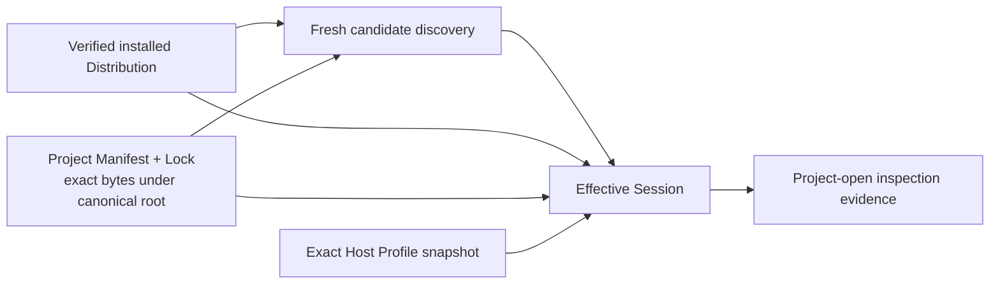

# ADR：Bootstrap Project-Open Session v1

## 状态

Accepted for #298。

本 ADR 冻结固定 Editor Image 打开一个项目时的第一条 headless 控制面垂直链。#298 实现的是该控制面的读取、验证、状态归约与固定 Project Bootstrap Host 执行合同；它不表示完整 Editor UI、项目构建器或完整 Project Domain 已经存在。

本决策建立在以下已实现合同上：

- [Editor Image、Engine Distribution 与原生组合边界](adr-editor-engine-distribution-and-native-composition.md)；
- [Installed Distribution Repair Verifier v1](adr-installed-distribution-repair-verifier-v1.md)；
- [Effective Session v1](adr-effective-session-v1.md)；
- [Host Executable Binding Receipt v1](adr-host-executable-binding-receipt-v1.md)；
- [Generated Current-Image Host 与 Project Bootstrap v1](adr-generated-current-image-project-bootstrap-host-v1.md)。

## 问题

固定 Editor Image 必须在项目 package graph 损坏、项目 native Host 缺失或 Project Bootstrap 拒绝项目时仍能运行控制面。此前各层已经分别能够验证安装的 Distribution、派生 Effective Session、生成 C6 Static Composition Root、发布 Host binding 并运行固定 Project Bootstrap，但还没有一个边界把这些事实归约为一次项目打开结果。

该边界不能通过以下方式补齐：

- 让项目 graph 决定 Editor Bootstrap 是否存在；
- 打开项目时重新 resolve 或更新 Project Lock；
- 直接执行可变 build tree 中碰巧存在的 Host；
- 每次正常打开都重新 hash executable；
- 把 filesystem/process 操作混进状态机，使状态结果依赖隐藏副作用；
- 把 Project Bootstrap 成功误称为完整项目已经激活。

## 决策

### 1. 固定 Editor Image 拥有控制面

Bootstrap Project-Open Session 属于固定 Editor Image，不属于当前项目 graph。它以已经深度验证的 `VerifiedInstalledDistribution` 为发行事实，以项目自己的 Manifest/Lock 为项目事实，以 Distribution 拥有的 exact `HostProfileSnapshot` 为 Host policy。

`host-runtime` 与固定 `project-bootstrap` provider 仍随当前 Host image 静态组合。项目 package 不能替换它们，也不能在进入 `Ready` 前执行项目 contribution。

#298 的实现保持 headless。未来的 ImGui 或 Avalonia 前端只能消费状态、诊断与动作，不得成为 package inspection、Effective Session 或 Host lifecycle 的新 owner。

### 2. 一个 canonical project root 锚定项目打开

每个请求只接受一个 project root。适配器先将它规范化为现存目录；该目录同时锚定：

- `asharia.project.json`，由固定 Project Bootstrap Host 读取；
- `asharia.packages.json`，由只读 package inspection 读取；
- `asharia.packages.lock.json`，由只读 package inspection 读取。

适配器不会从 Manifest、Lock、工作目录或 executable 路径推导另一个项目根。绝对路径与 `projectId` 是本次会话和 UI 的短期身份，不进入 C6 composition identity 或 Effective Session fingerprint。

### 3. inspection 只做读取、发现与组合

项目打开的 package/session 数据流固定为：



具体规则为：

1. 读取并验证 Project Manifest/Lock 的 exact UTF-8 JSON bytes；
2. 只从有效 Lock 派生 candidate locations；
3. `engine-distribution` candidate 必须来自 verified Distribution inventory；
4. `project-embedded` candidate 必须位于 canonical project root 下；
5. `local` candidate 只能通过请求中显式的 source-ID mapping 获得；
6. 对这些位置执行 fresh candidate discovery；
7. 将 verified Distribution、Project Manifest/Lock、selected candidates 与 exact Host Profile 交给 `plan_effective_session()`；
8. 派生完成后复读 Project Manifest/Lock，并拒绝收集证据期间发生的 bytes 漂移。

inspection 不调用 resolver，不选择替代版本，不修改 Manifest/Lock，不下载 package，也不执行 CMake、Conan、native loading 或项目 contribution。

### 4. 状态归约器保持纯函数

filesystem 和 process adapter 只收集 typed evidence。`derive_bootstrap_session()` 不做 IO、不启动进程、不修复文件，也不猜测尚未收集的证据；它只把阶段性 evidence 归约为一个状态、一个 next action、可选 Ready plan、可选 Project Bootstrap summary 与稳定 diagnostics。

状态与动作词汇固定为：

| 状态 | next action | v1 含义 |
| --- | --- | --- |
| `NoProject` | `SelectProject` | 尚无打开请求 |
| `Opening` | `InspectProject` | 请求存在，但仍缺少下一阶段 evidence |
| `Ready` | `ActivateProjectProfile` | 固定 Project Bootstrap 已成功完成；可以进入后续完整 profile activation |
| `PendingBuild` | `BuildProjectHost` | Effective Session 已 Ready，但匹配的 published Host/C6 不可用 |
| `PendingRestart` | `RestartEditor` | 保留词汇，v1 不产生 |
| `RepairRequired` | `RepairDistribution` | Distribution-owned evidence 损坏或缺失 |
| `UpgradeRequired` | `UpgradeEngine` | 项目与当前 Engine generation/API 不兼容 |
| `SafeMode` | `OpenSafeMode` | 项目 graph、project-owned source 或项目描述被拒绝 |
| `FatalDistributionError` | `RepairEditorImage` | 固定控制面、Host 启动/lifecycle 或协议自身无法可靠继续 |

归约 gate 顺序是公开合同：

1. 无请求 -> `NoProject`；
2. 有请求但无 inspection -> `Opening`；
3. control-plane 输入或内部 handoff 错误 -> `FatalDistributionError`；
4. Distribution-owned discovery/session 错误 -> `RepairRequired`；
5. Effective Session 报告 Engine/API 不兼容 -> `UpgradeRequired`；
6. Project Manifest/Lock、embedded/local candidate 或项目图错误 -> `SafeMode`；
7. Ready Effective Session 与缺失、过期或无效的 C6/binding -> `PendingBuild`；
8. current Host image 有效但尚无 Host run result -> `Opening`；
9. Project Bootstrap 以项目拒绝退出码 `65` 返回 -> `SafeMode`；
10. spawn、timeout、output overflow、current-image admission、Host start/stop 或 summary protocol 失败 -> `FatalDistributionError`；
11. Host 退出 `0`、stderr 为空且 summary 有效 -> `Ready`。

一次 evidence 可以保留多个 diagnostics，但 gate 顺序只决定控制面入口，不隐藏次要诊断。状态报告使用 `com.asharia.bootstrap-session` schema v1 的确定性、无绝对路径 JSON，便于后续 UI/CLI 消费；它不是新的 lock 或 activation ticket。

### 5. current Host 必须匹配本次 Effective Session

只有以下 identity 同时匹配，published Host 才被视为本次项目打开的 current image：

- Effective Session fingerprint；
- exact `EngineGenerationId`；
- host kind；
- target platform；
- build configuration；
- C6 Static Composition generation 与 verified Host binding receipt 中的 composition reference；
- binding artifact 位于已验证的 immutable publication generation 下。

正常打开执行 published binding 指向的 Host artifact，不执行 mutable build target，也不从目录中选择“最新”文件。binding receipt 只帮助控制面定位和对证 artifact；它不会作为命令行 activation ticket 传给 Host。Host 仍通过 generated C6 source 内封存的 current-image facts 完成 admission、provider recording、ProcessScope start/run/stop。

normal-open 快速路径只复验 receipt 约束、artifact 是 expected path 上的 regular file，并且当前 size 等于 receipt size。它不重新计算 executable hash。exact bytes 的深度验证继续属于 build/publication、installation/cache restore 与 explicit Verify/Repair 边界；如果轻量检查发现 missing、stale 或 invalid image，v1 fail closed 为 `PendingBuild`，不声称 artifact 当前可执行。

### 6. Project Bootstrap 执行是 bounded protocol

控制面使用参数数组启动 published Host：

```text
<published-host> --asharia-project-root <canonical-project-root>
```

它使用受控环境、有限 timeout、有限 stdout/stderr，并且不从项目文本拼接 shell command。进程成功必须同时满足：

- exit code 为 `0`；
- stderr 为空；
- stdout 恰好是一份可解析的 Project Bootstrap Summary v1；
- Host 已完成 current-image admission、固定 `ProcessApplicationV1` 调用与显式 clean stop。

summary 合同固定为：

```json
{
  "schema": "com.asharia.project-bootstrap-summary",
  "schemaVersion": 1,
  "projectName": "Example",
  "projectId": "9f7a31a0-0b63-4d4c-9f18-bd9a0d2e9c21",
  "assetSourceRootCount": 1
}
```

字段集合、类型与 schema/version 必须精确匹配；`projectId` 必须是 canonical UUID，count 必须是非负整数。project descriptor 缺失或无效由固定 Project Bootstrap 返回项目拒绝，进入 `SafeMode`。协议损坏、异常 stderr、超限输出、Host admission/lifecycle 或 stop 失败属于固定控制面失败，进入 `FatalDistributionError`。

### 7. `Ready` 只表示 bootstrap-ready

v1 的 `Ready` 证明：

- 项目 package/session graph 对当前 Distribution 与 Host Profile 有效；
- published Host/C6 对本次 Effective Session 是 current；
- 固定 Project Bootstrap 能读取同一 canonical root 下的项目描述；
- Host 完成一次受控的 activation、application run 与 clean stop。

它不证明 ProjectScope、EditorScope、asset database、World、Renderer、项目 importer/panel/command 或 Play In Editor 已创建。`ActivateProjectProfile` 只是交给后继 Slice 的动作；未来完整 profile activation 成功后才能使用 `ProjectReady` 一类更强语义。

## 被拒绝的方案

### 由项目 package graph 组装 Bootstrap

拒绝。项目图损坏会同时移除解释和修复该错误的控制面。

### 直接运行 build tree 中的 Host

拒绝。build target 不是已发布 generation，无法把本次 C6/session identity 与执行文件稳定绑定。

### 每次正常打开深度 hash executable

拒绝。它重复 build/install/repair boundary 的工作，也不能单独证明已加载 image pages。正常路径使用 receipt identity 与 path/size 快速检查，信号异常时再进入 build 或显式深度验证。

### inspection 顺带 resolve 或更新 Lock

拒绝。打开项目是只读事实复验；改变依赖意图必须是用户可见的 Package Manager/update transaction。

### 保留旧启动 handoff 或双入口

拒绝。仓库尚无用户兼容负担。v1 对 Host process runner、summary schema、current-image admission 与 project-open request 采用硬切，不提供旧名称、外部 launch ticket、compatibility adapter 或 silent fallback。

### 在 v1 动态加载项目 native module

拒绝。当前方案使用构建期静态原生组合和启动期注册；稳定 ABI、hot unload 与跨 generation plugin compatibility 均没有证据基础。

## 后果

- 固定 Editor Image 可以在项目失败时保留一条不执行项目代码的诊断路径；
- Project、Distribution、Effective Session、C6 与 published Host binding 的 owner 不再混合；
- reducer 可以用纯数据穷举测试，filesystem/process failure 则由窄 adapter 测试；
- 正常打开不引入全量 artifact hashing，构建与发布的深度证据仍保留；
- `PendingBuild` 现在有明确 current-image evidence，`PendingRestart` 则不会在没有 current-process generation tracker 时被猜测；
- 项目成功检查与完整 Editor 功能激活保持两个独立可验证阶段。

## v1 非目标

本 ADR 不实现：

- Editor、Safe Mode、Package Manager、ImGui 或 Avalonia UI；
- resolver、Manifest/Lock 编辑、rollback 或 registry/marketplace；
- CMake/Conan 构建、artifact 获取、Repair Executor 或 Editor restart；
- `PendingRestart` 的 current-process generation evidence；
- ProjectScope、EditorScope、asset database、World、Renderer 或项目 contribution activation；
- dynamic library loading、stable native ABI、hot reload/unload；
- 旧 project-open、Host runner、summary 或 launch-handoff compatibility path。

## 验证要求

- pure reducer 对全部状态、next action、gate priority、diagnostic ordering 与 reserved `PendingRestart` unemitted 的测试；
- canonical project root、Manifest/Lock exact bytes、fresh discovery、explicit local mapping 与 mutation detection 测试；
- Ready/Repair/Upgrade/SafeMode 的 Effective Session 分类测试；
- C6/session/binding/configuration identity 独立 mismatch 与 missing/stale/invalid -> `PendingBuild` 测试；
- normal-open 不 hash executable、只执行 published artifact 的测试；
- Host spawn/timeout/overflow/exit/stderr/summary schema-version/protocol 测试；
- Project Bootstrap valid/invalid descriptor、exit `65`、clean stop 与同根目录端到端测试；
- ClangCL/MSVC 单次 generated Host build、publication/deep verification 后的真实执行链；
- package contracts、encoding、docs、topology、diff 与双编译器门禁。

## 后续

以下属于未来 Slice，不是 v1 的当前事实：

1. `PendingBuild` 的 Build/Publish controller，以及成功后的 Editor restart orchestration；
2. current-process generation tracker 与可证明的 `PendingRestart`；
3. 消费本状态合同的最小 Editor UI、Safe Mode 与修复入口；
4. 完整 Editor Host Profile activation 与更强的 `ProjectReady` 状态；
5. Repair Executor、active generation selection、rollback 与外部 Launcher/Installer；
6. 只有真实重链接瓶颈和 ABI 需求出现后，才重新评估 exact-build native dynamic module。
