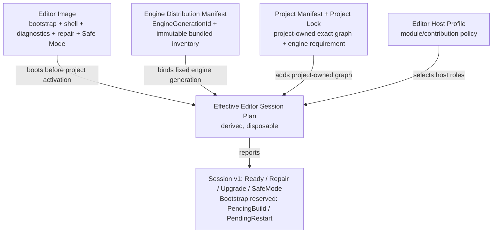

# ADR：Editor Image、Engine Distribution 与原生组合边界

## 状态

Accepted architecture baseline。Engine Distribution Manifest v1、Project Manifest / Package Lock v2 与
[Effective Session v1](adr-effective-session-v1.md) 已实现；Activation/Factory、Editor Safe Mode runtime 与完整 installer 尚未实现。

Project Lock v2 已移除 `bundled` path/hash 所有权，发行 node 只引用 `engine-distribution`，并精确绑定
`EngineGenerationId`。Effective Session 现在组合 verified Distribution、Project Lock、selected candidates 与
Distribution-owned exact Host Profile snapshot；Host Composition 只接受 Ready session，不再接收独立 raw Project/Profile。

## 问题

Package Product Declaration、Source Build Plan 与 verified Package Artifact Manifest 能回答某次构建产生了哪些
精确 bytes，却不能单独回答：

- Editor 在项目图损坏、未构建或不兼容时怎样保持可启动；
- 哪些核心能力属于某个已安装 Engine/Editor 发行版，而不是项目可替换依赖；
- 项目可编辑 package 与不可变 artifact generation 怎样共存；
- Host 怎样从发行事实、项目事实与 Host policy 派生本次会话，而不保存第三套依赖真相；
- native C++ module 应怎样进入进程，而不把“package”错误等同于“DLL”。

如果把项目 lock 和全部 verified artifact bytes 当作 Editor 启动的唯一依据，项目错误就可能阻止诊断与修复它的
工具启动；如果反过来把所有系统静态写死进 Editor，Package Manager、Host Profile 与项目产品裁剪又失去意义。

## 外部行为依据

本文只从公开行为校准边界，不断言 Unity 或 Unreal 未公开的内部实现：

- Unity Core packages 与特定 Editor 版本一起发布，不能由用户通过 Package Manager 任意切换版本；Built-in
  packages 也随 Editor 分发，项目可以控制部分功能是否参与，但不因此改写 Editor 安装库存：
  <https://docs.unity3d.com/6000.0/Documentation/Manual/pack-core.html>、
  <https://docs.unity3d.com/6000.0/Documentation/Manual/pack-build.html>。
- Unity 项目使用 `Packages/manifest.json` 表达直接依赖，并用 `packages-lock.json` 固定解析结果；两者属于项目，
  不是 Editor 发行清单：<https://docs.unity3d.com/6000.0/Documentation/Manual/upm-manifestPrj.html>、
  <https://docs.unity3d.com/6000.0/Documentation/Manual/upm-conflicts-auto.html>。
- Unity Safe Mode 在项目或 package 脚本编译失败时仍保留 Console、Inspector、Project 与 Package Manager 等修复
  能力；embedded package 则允许项目拥有可编辑源码，不要求每次修改先成为不可变缓存包：
  <https://docs.unity3d.com/6000.0/Documentation/Manual/SafeMode.html>、
  <https://docs.unity3d.com/ja/2023.2/Manual/upm-embed.html>。
- Unreal 将 C++ 组织为由 target/build dependency 选择的 Runtime、Editor 等 modules；插件可以包含源码并随
  项目构建。Unity native plug-in 同样先产出原生库，再由 Host 使用，而不是由 Package Manager 直接加载 C++
  源文件：<https://dev.epicgames.com/documentation/en-us/unreal-engine/unreal-engine-modules>、
  <https://dev.epicgames.com/documentation/en-us/unreal-engine/plugins-in-unreal-engine>、
  <https://docs.unity3d.com/cn/2023.2/Manual/NativePlugins.html>。

由这些外部行为得到的 Asharia 结论是：Editor 可以与引擎深度集成，但它的最低启动和修复能力不能依赖当前
项目 package graph 成功激活。

## 决策

### 1. 采用三层所有权和一层派生计划

| 层 | 拥有 | 不拥有 |
| --- | --- | --- |
| Editor Image | L0 Kernel、固定 Package/Host Runtime、窄 Project Bootstrap Reader、Editor executable、最小窗口/UI Shell、bootstrap logging/diagnostics、Package Manager 与 Build/Repair 控制入口、Safe Mode | 当前项目 graph、可选项目 contribution、可替换的 Engine 核心 generation |
| Engine Distribution | `EngineGenerationId`、Editor/核心引擎 artifact 库存、随版本分发的 system packages、Host Profiles 与兼容范围 | 项目 direct intent、本地可编辑 package、会话临时状态 |
| Project Package Graph | 项目 manifest/lock、第三方/embedded/local packages、项目对 Engine generation/capability 的要求 | Editor Bootstrap 是否存在、发行库存的 artifact bytes、核心 package 的替代实现 |
| Effective Session Plan | 三层输入合成后的 Host module 选择、状态与后继 build/activation handoff | 新的持久依赖真相、版本求解、发行或项目事实的副本 |



`Effective Session Plan` 可以为 diagnostics、缓存或可复现测试进行 canonical serialization，但只能由输入 fingerprint
重新派生；它不是需要人工维护或提交的第三个 lockfile。现有 `Host Composition Plan`、`Source Build Plan` 和未来
`Activation Plan` 是该派生过程中的职责明确的子计划，不合并成一个万能文档。

### 2. Editor Image 必须先于项目激活可用

Editor Image 至少固定包含：

- Editor 进程、L0 Kernel、基础窗口系统和最小 UI Shell；
- headless `engine/package-runtime`：读取/验证 Distribution 与项目 package graph、绑定 exact Host Profile、派生 session；
- `engine/host-runtime` 的固定执行骨架：拥有 Process/Editor scope、factory context、activation lease、typed contribution registry、
  dependencies-first activation、reverse shutdown 与 rollback；Safe Mode 只管理固定 Image components；
- 窄 Project Bootstrap Reader：定位/读取 `asharia.project.json` 与 package 文件路径，但不打开 asset database、World 或项目插件；
- Package Manager、Build/Repair/Restart 控制入口；
- Safe Mode 和本地 recovery 状态；
- UI 图形 backend 失败时仍可用的 OS-native fatal dialog 或 console/log 降级路径。

`host-runtime` 固定进入 Editor Image，但它是 L1 Host Foundation，不进入 L0 Kernel。Project Bootstrap Reader 的最终 owner
仍需独立冻结：可以是固定链接的 `project-core` 子集，也可以是独立 `project-bootstrap`；它不得并入 `package-runtime`。

项目打开状态机至少保留 `NoProject`、`Opening`、`Ready`、`PendingBuild`、`PendingRestart`、`RepairRequired`、
`UpgradeRequired`、`SafeMode` 与 `FatalDistributionError`。Effective Session v1 只产生 Ready/Repair/Upgrade/SafeMode；
PendingBuild/Restart 分别等待 artifact freshness 与 current-process generation evidence。

这些组件可以静态链接并与引擎深度集成。“可独立启动”只表示它不依赖当前项目 graph 先成功 build/activate，
不表示 Editor 不使用引擎。若 Editor Image 本身损坏，由外部 launcher/installer 修复；项目内 Package Manager 不负责
修复承载自己的 executable。

### 3. Engine Distribution Manifest 是发行库存，不是第二个 lock

构建或安装 Engine/Editor 时生成只读的 `Engine Distribution Manifest`，至少记录：

- `EngineGenerationId`；
- Editor 与核心引擎 artifacts 的 path、size、hash、platform 和 configuration；
- 随发行版交付的 system packages 及 exact versions；
- `required`、`default`、`optional` 分类；
- 可用 Host Profiles、Engine API/build compatibility 与工具链约束。

它描述“这个安装的 Engine generation 包含什么”，不参与项目依赖求解，也不由项目 Package Manager 重写。
项目可以引用或按规则启用发行版提供的能力，但不能用同 identity 的项目 package 覆盖 Bootstrap 或强绑定核心。
需要替换时必须切换整个 Engine generation，或进入明确的 engine-development mode。

`EngineGenerationId` 与单个 package artifact publication ID 不同：前者标识一个 Engine/Editor 发行组合，后者只标识
某组已验证 package artifact manifests 与 bytes。两者不得共用模糊的 `generationId` 字段。

### 4. Project Manifest/Lock 只拥有项目图

Project Manifest 记录直接 package intent、Feature Sets 与允许范围；Project Lock 固定项目解析得到的 exact versions、
sources、dependency closure 与 artifact generation references。项目对 bundled capability 的声明只能引用
Engine Distribution 中的事实，不能复制或覆盖其 artifact 库存。

Project Lock v2 中的发行 node 只保存 exact graph 和 `source.kind = engine-distribution`。root、manifest hash 与 payload hash
只由 Engine Distribution Manifest 保存；项目/local source 不得用同 identity 覆盖发行 package。v1 不作为兼容输入。

`project-embedded` / `local` package 明确处于 source mode：源码目录是开发真相；只有 Build/Run、CI、安装、缓存发布或
Activation 边界才产生并验证不可变 artifact generation。每次保存源码不生成完整 package artifact，也不全量重算 hash。

### 5. Effective Session Plan 只组合，不重新求解

Editor 启动后，以固定 Distribution、已锁定 Project Graph 和 Editor Host Profile 派生本次会话：

```text
Engine Distribution Manifest
+ Project Package Lock
+ Editor Host Profile
-> Effective Editor Session Plan
-> Host Composition / optional Source Build / Activation handoff
```

结果至少表达：

| 状态 | 语义 |
| --- | --- |
| `Ready` | 所需 native generation 已验证且可由本次进程使用 |
| `PendingBuild` | source/native outputs 缺失或已过期；基础 Editor 仍可运行构建与诊断 |
| `PendingRestart` | 新 generation 已发布，但当前进程仍绑定旧 native composition |
| `RepairRequired` | Distribution 中非 Bootstrap artifact 缺失或损坏；由固定修复入口处理 |
| `UpgradeRequired` | 项目的 Engine generation/API 要求与当前 Distribution 不兼容 |
| `SafeMode` | 项目图、项目代码或 contribution 失败；不执行项目代码，但保留基础 Editor 修复能力 |

日常启动允许使用由 installer/build receipt、文件 identity/mtime/size 与已验证 generation ID 构成的轻量状态检查。
只有边界信号变化、显式 Verify/Repair、缓存恢复、安装、CI 或激活新 generation 时才重新读取并 hash payload。

### 6. v1 原生组合采用静态库和薄 composition root

概念映射固定为：

```text
Installable Package
-> Logical Runtime / Editor / Tool / Backend modules
-> independent CMake targets (normally static libraries or tools)
-> generated thin Host composition root
-> startup registration and system factories
```

- 用户安装、升级和移除完整 package，不单独管理内部 targets；
- Host Profile 选择 modules，Source Build Plan 映射真实 CMake roots；
- C++ modules 默认编译为独立静态库，保持增量编译和链接闭包边界；
- 项目专属 Editor/Runtime/Server/Tool target 链接生成的薄 composition root；
- artifact manifest 证明构建 generation，Activation Plan 绑定 factory/contribution/lifecycle；
- native graph 变化采用 `PendingBuild -> PendingRestart`，v1 不承诺 hot unload。

未来若 Editor 重链接成为实际瓶颈，可以增加与精确 `EngineGenerationId`、工具链、runtime library、platform 和
configuration 绑定的 `ProjectEditorModules` 动态构建模块。它只在进程启动时加载，修改后重启，不承诺跨 Engine
generation ABI、任意热卸载或跨边界 C++ allocator/exception ownership。

### 7. Artifact collector 只拥有不可变发布边界

Package Artifact collector 可以：

- 从调用方声明的 quiescent、隔离 source roots 流式收集 exact files；
- 计算并复验 size/SHA-256；
- 原子发布 content-addressed package artifact generation；
- 在安装、CI、缓存、Distribution 组装、Player/Game build 与 Activation 前提供证据。

它不得：

- 决定 Editor Image 或 Safe Mode 的组成；
- 解析或修改 Project Manifest/Lock；
- 选择 Host modules、生成 factory 或执行 Activation；
- 扫描源码猜测产品、执行 CMake/Conan、直接加载 native module；
- 成为每次 Editor 启动或每次源码编辑的强制全量 hash gate。

## 被拒绝的方案

### 由项目 lock 从零组装 Editor

拒绝。损坏或未构建的项目会同时移除诊断和修复入口，形成 bootstrap cycle。

### 把 Engine Distribution Manifest 称为 Editor Distribution Lock

拒绝。它是 installer/build 生成的只读库存，不是 resolver 维护的第二份依赖求解结果；使用 `lock` 会模糊所有权。

### 所有 package 都构建为 DLL

拒绝。package、logical module、CMake target 与 runtime load boundary 是不同概念。v1 没有稳定 native ABI、热卸载与
跨 allocator/exception 边界的必要证据。

### 开发态只允许 immutable artifacts

拒绝。它会把每次源码修改变成发布事务。source mode 保留可编辑真相，只有 build/activation/installation 等边界生成
不可变 generation。

### 每次 Editor 启动全量 hash 全部 artifacts

拒绝。hash 是关键边界证据，不是文件状态监控器。正常启动使用轻量 receipt/state，异常或边界变化时再 fail closed 验证。

## 后果与迁移

- Editor/Engine 可以继续静态链接和深度集成，同时项目错误不再决定基础 Editor 是否存在。
- 项目图裁剪、可复现 build 与 immutable activation evidence 保留，但 Distribution 与 Project 不再复制事实。
- Engine Distribution Manifest、`EngineGenerationId`、Engine compatibility 与 Effective Session v1 状态合同已经落地。
- Host Composition 已迁入 Effective Session 派生边界；后继 Activation/Factory 仍不得绕开 Distribution/Project/Profile
  三方验证与 Ready session evidence。
- #278 的 collector/publication 只实现 package artifact generation 证据，不能顺带确定 Editor 引导架构。
- #282 的 Distribution Assembler 只创建新的不可变 generation；它不进入 Editor Image，也不诊断或修复 installed generation。

## 后续 Slice 顺序

1. #278 artifact publication、#279 Engine Distribution Manifest、#280 Project Lock v2 硬切、#281 Effective Session 与
   #282 Distribution Assembler 已完成。
2. 实现独立的 installed Distribution Repair Verifier 与轻量启动检查，或先冻结静态薄 composition root 的生成边界。
3. 再设计 factory reference、Activation Plan 与 Host Runtime lifecycle。
4. 只有真实链接耗时和 ABI 需求出现后，再评估 exact-build `ProjectEditorModules` 动态模块。
