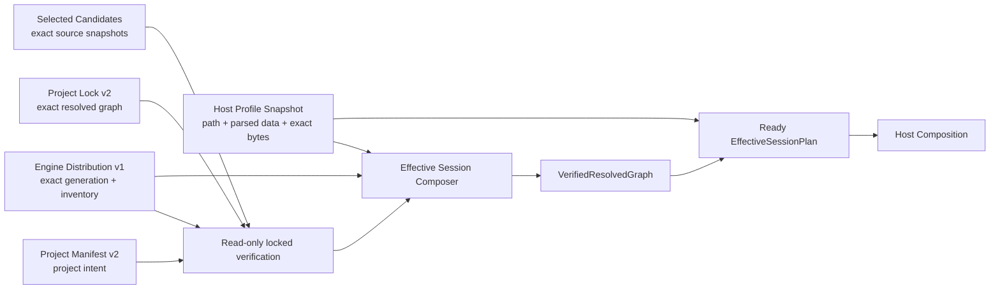

# ADR：Effective Session v1 与 verified resolved graph

## 状态

Accepted（2026-07-14）。本 ADR 对应 #281，基于 #279 的 Engine Distribution Manifest v1 与 #280 的
Project Manifest / Package Lock v2 硬切。

## 上下文

Engine Distribution、Project Manifest/Lock 与 Host Profile 已经分别拥有明确事实，但 Host Composition 仍直接接收：

- 一个 `LockedGraphVerificationResult`；
- 一份调用方另外传入的 Project Manifest；
- 一份调用方另外传入的 Host Profile。

这允许 Host Composition 在同一次调用中看到互不绑定的 project/profile snapshot。它也没有证明 Host Profile 是当前
Engine Distribution 实际库存中的 exact bytes，不能把失败稳定地交给 Upgrade、Repair 或 Safe Mode 入口。

Effective Session 必须补上这个边界，但不能成为第三份 lock。它只组合并验证已有事实，不重新求解 package graph，
不写文件，也不执行 build、native loading 或 activation。

## 决策

新增内存态 `Effective Session v1`：



composer 可以调用现有 `verify_locked_package_graph()`，但不得调用 resolver。成功结果深拷贝并规范化所有可变输入；
调用方后续修改原始字典、列表或 candidate，不得改变已经派生的 session。

### Host Profile snapshot

`HostProfileSnapshot` 包含：

- Distribution-relative `path`；
- 调用方解析后的 `manifest`；
- 文件的 exact UTF-8 `bytes`。

composer 必须同时证明：

1. bytes 是无 BOM 的有效 UTF-8 JSON object；
2. 从 bytes 解析出的对象与 snapshot manifest 相同；
3. Host Profile contract 和语义验证成功；
4. Distribution `hostProfiles[]` 存在唯一的相同 path、host kind 与 target platform 引用；
5. exact bytes 的 SHA-256 与 Distribution reference 完全一致；
6. profile target platform 与 Distribution context 一致。

仅提供一份“形状相同”的 JSON 不形成信任。Profile 的 exact byte integrity 是 Engine generation inventory 的一部分。

### VerifiedResolvedGraph

`VerifiedResolvedGraph` 是一次成功 locked verification 的不可变意图 snapshot，携带：

- normalized Engine Distribution；
- normalized Project Manifest v2；
- normalized Project Lock v2；
- 按 package identity 排序并深拷贝的 selected candidates；
- `EngineGenerationId`；
- Distribution canonical manifest、Project manifest、Lock graph 与 candidate bindings 的独立 SHA-256 fingerprints。

Candidate binding fingerprint 包含 identity、version、kind、origin、source、manifest/payload evidence、author manifest、可选
build/product descriptor snapshot 与本地 payload location。它不是 artifact freshness 证据；其作用是让下游拒绝 session 内存
snapshot 被替换或修改。

### Ready plan 与 canonical fingerprint

`EffectiveSessionPlan` 只代表 `Ready`。它携带 verified graph、normalized Host Profile、profile path/exact bytes evidence，
以及由以下字段派生的 session fingerprint：

- Distribution family、Engine API 与 exact generation；
- Distribution/Project/Lock/candidate fingerprints；
- Host Profile path、kind、platform 与 exact bytes integrity。

这里的 `Ready` 只是 [Activation Eligibility v1](adr-activation-eligibility-v1.md) Stage 1 的一个输入。它不授权调用
generated providers、读取 callback descriptors、执行 lifecycle 或发布 future `ProjectReady`。

canonical plan data 可用于日志、测试与缓存 key，但不得作为项目文件提交，也不得被当作新的依赖事实。任何时候都可以从
Distribution、Project/Lock、candidates 与 Host Profile snapshot 重新派生。

### Host Composition 输入硬切

`plan_host_package_composition()` 只接受 `EffectiveSessionPlan` 与 validators。旧的
`(verified_graph, project, host_profile, validators)` 入口被删除，不保留 adapter 或双入口。

Host Composition 在使用 plan 前重新计算 session fingerprints，并复验 normalized graph、candidate bindings 与 profile reference。
session graph/profile 被修改后必须原子失败，不生成 partial composition。

Source Build 与 artifact evidence/publication 的 verified graph 输入同步硬切为 `VerifiedResolvedGraph`。它们仍负责自己的
descriptor、codemodel 与 artifact evidence 对证；Effective Session 不替代这些阶段。

## 状态模型

`EffectiveSessionState` 固定以下词汇：

| 状态 | v1 是否产生 | 证据与含义 |
|---|---:|---|
| `Ready` | 是 | Distribution、Project/Lock、candidates 与 Host Profile 全部对证成功 |
| `UpgradeRequired` | 是 | Project 的 Distribution family/API 不兼容，或 Lock exact engine generation/input 已过期 |
| `RepairRequired` | 是 | Distribution/Profile evidence 缺失或损坏，或 distributed package bytes 漂移 |
| `SafeMode` | 是 | Project Manifest/Lock、project-owned candidate、author graph 或 project payload 无效 |
| `PendingBuild` | 否，reserved | 需要 artifact freshness/build output 证据，本 Slice 没有这些输入 |
| `PendingRestart` | 否，reserved | 需要 current-process generation 证据，本 Slice 没有这些输入 |

一次失败可以包含多个 diagnostics，但只能产生一个行动状态。归类优先级固定为：

```text
RepairRequired > UpgradeRequired > SafeMode
```

原因是损坏的当前发行镜像不能作为升级或项目诊断的可信执行基础；发行镜像有效后，Engine generation 不兼容又先于项目代码
激活。所有诊断仍完整保留，优先级只决定入口状态，不隐藏次要失败。

典型映射：

- Distribution schema/generation/Profile reference/Profile bytes/distributed payload failure -> `RepairRequired`；
- `distribution-mismatch`、`api-incompatible`、stale lock engine distribution/API/generation -> `UpgradeRequired`；
- Project/Lock schema、project digest、project/local source、author dependency/options/payload failure -> `SafeMode`；
- project/local source shadow bundled identity 是项目图错误 -> `SafeMode`，不是发行库存损坏。

## 失败原子性

- 非 `Ready` 结果的 `plan` 必须为 `None`；
- diagnostics 使用稳定的 manifest path、JSON pointer、code、message 排序；
- unsupported/forged session、fingerprint mismatch 或 nested snapshot mutation 在 consumer 处 fail closed；
- composer 不静默 resolve、更新 lock、修复文件、选择别的 Profile 或回退到默认 Profile；
- 同义的字典/list 输入顺序与 candidate 顺序在规范化后产生相同 canonical plan；Profile exact bytes 本身不是可重排语义。

## 后果

- Editor Bootstrap 可以根据 owner 明确进入 full session、Upgrade、Repair 或 Safe Mode；本 Slice 不实现这些 UI/进程。
- Host Composition 不再存在未绑定 raw Project/Profile 入口。
- Distribution-owned Profile 与 exact Engine generation 形成可复验证据链。
- 下游仍然获得完整 candidate snapshots，但必须接受 `VerifiedResolvedGraph`，不再把裸 verifier result 当成会话能力。
- 每次源码编辑不要求生成 immutable artifact；project/local payload 漂移只会令当前 lock/session 失效并进入 Safe Mode。

## 非目标

本 ADR 不实现：

- resolver/update/apply 或 lock 写入；
- Distribution assembler、installer、repair IO；
- artifact freshness、native build/relink、current-process generation tracking；
- Safe Mode UI/进程；
- Factory/Activation、Scope/Lifecycle、Host Runtime；
- 静态 composition root、DLL、动态加载、hot unload 或跨版本 C++ ABI。

## 验证要求

- Ready、UpgradeRequired、RepairRequired、SafeMode 正负路径；
- Profile path/kind/platform/reference/integrity/bytes/parsed data 独立篡改；
- project/lock/generation 与 distributed/project-owned payload failure 分类；
- canonical byte stability、reserved states unemitted、no resolver/no write/no mutation；
- session graph/profile mutation 后 Host Composition fail closed；
- discover -> resolve -> session -> Host Composition -> Source Build -> artifact evidence/publication synthetic chain；
- package contracts、encoding、docs、topology、asset boundaries 与双编译器门禁。

## 后续

Distribution Assembler v1 已由 #282 完成，并保持在 build/release-tool 边界；
[Installed Distribution Repair Verifier v1](adr-installed-distribution-repair-verifier-v1.md) 已由 #283 提供外部 expected
generation trust anchor、只读深度复验、`DistributionHealthReport` 与 verified handoff，但本 Slice 尚未把它接入
Effective Session 或 Editor 启动状态机。下一步优先冻结静态薄 composition root 或 Bootstrap/Session adapter。
Factory/Activation、dynamic native module 与 `PendingBuild/PendingRestart` evidence 继续作为独立 Slice 设计。
