# ADR：Immutable Engine Distribution Assembly v1

## 状态

Accepted for #282。实现目标是从显式、已隔离的输入生成一个完整、可复验、不可变的 Engine Distribution generation。

本 ADR 建立在以下已实现合同上：

- #278 `PackageArtifactPublicationReceipt` 与不可变 package artifact generation；
- #279 `Engine Distribution Manifest v1` 与内容派生 `EngineGenerationId`；
- #280 Project Manifest / Package Lock v2 的发行库存所有权硬切；
- #281 Effective Session v1 对 verified Distribution 的消费边界。

本 ADR 不定义 installed Distribution Repair Verifier、Launcher/Installer、CMake install adapter、Project build、
Factory/Activation 或动态加载。

## 问题

Engine Distribution Manifest v1 已经定义一个 generation 必须声明哪些事实，但当前只有 synthetic fixture 和 pure writer，尚无生产
owner 能回答：

- Editor executable、bootstrap resources 与 Host Profiles 从哪些 exact bytes 进入发行镜像；
- bundled author package payload 与已发布 package artifact generation 如何合并，而不复制两份 artifact file inventory；
- manifest 应在复制前根据 caller descriptor 生成，还是在 staging 中根据实际 bytes 生成；
- source/staging 漂移、半写 manifest、rename failure 或同名 generation 已存在时怎样 fail closed；
- 消费者怎样保证只能看到完整 generation，而不是逐文件复制产生的半成品目录。

直接扫描 CMake build tree 无法证明 package/file ownership。直接把 #278 generation 当作 Engine Distribution 又缺少 Editor Image、
author package payload、Host Profiles 与完整 `EngineGenerationId`。因此需要一个更外层、但仍保持纯 build/release-tool 边界的
Distribution Assembler。

## 依据与适用限制

| 依据 | 可确认的事实 | v1 约束 |
| --- | --- | --- |
| [CMake 3.28 `install()`](https://cmake.org/cmake/help/v3.28/command/install.html) | install rules 以 relative destination、artifact kind、configuration 与 component 形成显式安装树 | 后继 adapter 可以生成隔离输入；assembler 本身不执行 CMake，也不猜 build-tree outputs |
| [Python `os.rename()`](https://docs.python.org/3/library/os.html#os.rename) | 成功 rename 是单个 namespace operation；Windows 目标已存在时失败，跨 filesystem 不提供所需语义 | staging/final 必须同 filesystem；不使用 copy fallback 或 replace-existing |
| [Windows `MoveFileExW`](https://learn.microsoft.com/windows/win32/api/winbase/nf-winbase-movefileexw) | directory move 必须同 drive；existing directory 不能通过 replace policy 覆盖 | final generation 是 no-overwrite directory；已有 generation 只能复验复用 |

与 #278 相同，Python/Windows v1 不是 hostile concurrent writer sandbox。调用方必须拥有并 quiesce source roots；assembler 仍通过
root/link 检查、file identity、复制后 source 复扫、staged rehash 与 closed layout 尽可能检测合作式 pipeline 中的漂移。

## 所有权

| Owner | 拥有 | 不拥有 |
| --- | --- | --- |
| 上游 build/install adapter | 生成隔离 Editor Image root、package candidates、artifact publications 与 Host Profile exact bytes | `EngineGenerationId`、final generation namespace |
| Distribution Assembler | typed request、owned staging、staged evidence、canonical Distribution Manifest、generation commit | 编译、依赖求解、修复、active generation selection |
| Engine Distribution Manifest | 一个已提交 generation 的 canonical inventory | source roots、命令、时间戳、mutable `current/latest` |
| 后继 Repair Verifier | 读取已安装 generation 并生成 Repair Report | 本 Slice不实现 |

Assembler 位于 build/release tool boundary，不进入 L0 Kernel，不被 Project Package Manager 调用，也不成为 Editor Image 启动依赖。

## 决策

### 1. Assembly request 是 typed 临时 handoff

`DistributionAssemblyRequest` 只在进程内存在，包含：

```text
distribution identity + Engine/API versions
target platform + configuration + normalized toolchain facts
EditorImageAssembly
  isolated root + entry point + explicit file bindings
BundledPackageAssembly[]
  PackageCandidate + availability + destination root
PackageArtifactPublicationReceipt[]
HostProfileAssembly[]
  destination path + exact UTF-8 bytes
```

Request 不保存 source root 的 hash 声明，不持久化为新的 assembly plan，也不把绝对路径、命令、环境或时间写进 Distribution。

Editor Image root 必须只包含绑定文件及其 parent directories。Bundled package candidate root 以
`asharia-package-tree-v1` domain 形成 closed payload；top-level `.git/.hg/.svn/build/generated` 不属于 payload，也不复制。
Package artifact receipt 必须引用 #278 已提交的 generation root。Host Profile 直接以 immutable exact bytes 输入，避免把 profile
policy 复制到 request 的另一份结构中。

### 2. Preflight 先于 publication namespace mutation

在创建 staging/generations parents 前，assembler 必须完成：

1. request/dataclass/tuple/enum/字符串类型与空值检查；
2. Distribution context、Editor entry point、Host Profile schema/kind/platform/path、bundled identity/root/availability 检查；
3. source/publication roots 必须是 explicit `Path`，无 symlink/junction/reparse，互不重叠；
4. Editor root closed-tree、bundled candidate author manifest/payload evidence 与 source stability 检查；
5. package artifact receipt ID、manifest-set、canonical manifests、closed layout 与全部 artifact hashes 深度复验；
6. artifact package 必须属于当前 bundled `installable-capability`，且 version/platform/configuration 完全匹配；
7. 使用 source evidence 构造 provisional Distribution Manifest，并运行 v1 schema/semantic validation。

任何 preflight 失败返回空 receipt，且不创建 publication staging/generation namespace。

### 3. Staged bytes 是最终 manifest 的唯一证据

Source evidence 只决定是否允许开始复制。最终 manifest 必须从 staging 中重新读取的 bytes 生成：

- Editor Image：distribution path、role、media type、实际 size/SHA-256；
- bundled package：staged author manifest exact bytes integrity 与完整 staged package tree integrity；
- package artifact：staged per-package Artifact Manifest exact bytes integrity、receipt generation ID 与 manifest context；
- Host Profile：staged exact bytes integrity，以及从这些 bytes 解析出的 host kind/platform。

Assembler 不接受 caller-supplied Editor/Profile size/hash，也不把 package Artifact Manifest 的 `files[]` 复制进 Distribution Manifest。
Distribution 只保存 exact manifest path/integrity，artifact file evidence 继续由 package Artifact Manifest 单独拥有。

### 4. 复制与复验顺序固定

```mermaid
flowchart LR
    Request["Typed assembly request\nexplicit isolated inputs"]
    Preflight["Read-only preflight\ncontracts + roots + source evidence"]
    Stage["Owned staging\nstream copy + SHA-256"]
    Reverify["Staged re-verification\nclosed layout + exact bytes"]
    Manifest["Generate canonical\nEngine Distribution Manifest"]
    FinalVerify["Whole-generation verify\nmanifest + all evidence"]
    Commit["Single no-overwrite rename\ngenerations/EngineGenerationId"]

    Request -->|validates| Preflight
    Preflight -->|permits IO| Stage
    Stage -->|rehashes| Reverify
    Reverify -->|produces evidence| Manifest
    Manifest -->|binds EngineGenerationId| FinalVerify
    FinalVerify -->|commits namespace| Commit
```



具体顺序：

1. 在 `<publication-root>/.asharia-distribution-staging/generation-*` 创建 owned temp directory；
2. 以 bounded chunks exclusive-copy Editor files、bundled package payload 与 package artifact generation；
3. 每个 source file 对证 `lstat/fstat` before/open/after evidence，复制后重新扫描 source tree；
4. 从 staging 独立重算 file size/SHA-256、package tree integrity 与 artifact generation evidence；
5. exclusive 写入 Host Profile exact bytes；
6. 从 staged evidence 构造、normalize、验证并 exclusive 写入 `asharia.engine-distribution.json`；
7. 读取刚写入的 exact manifest bytes，确认无 BOM/LF/canonical data，并完整复验 staged closed tree；
8. 以 canonical inventory 得到 `EngineGenerationId`，final path 为 `generations/<EngineGenerationId>`；
9. final 不存在时使用一次 `os.rename()` 提交；已存在或并发 winner 出现时，完整复验 existing generation 后才返回复用。

输出布局：

```text
<publication-root>/
  generations/
    sha256-<engine-generation-digest>/
      asharia.engine-distribution.json
      bin/...
      resources/...
      packages/...
      profiles/...
      artifacts/
        sha256-<package-artifact-generation>/
          packages/<package-id>/asharia.package.artifacts.json
          packages/<package-id>/<artifact files...>
```

### 5. Package artifact receipt 必须在消费边界重新验证

#278 的 receipt 表示 publication 当时成功，不证明之后本地 bytes 未损坏。assembler 在复制前和 staging 复制后都必须验证：

- receipt 类型、manifest tuple 与 `artifact_generation_id`；
- 每个 Package Artifact Manifest 的 schema、self-integrity 与 canonical bytes；
- manifest-set integrity 与 generation ID；
- root basename、closed files/directories、每个 artifact size/SHA-256；
- package/context 与本次 Distribution 的 bundled inventory/platform/configuration。

因此 #278 增加一个 read-only public receipt verifier；它不修改、清理或发布 generation。

### 6. 原子性与复用承诺

成功 receipt 只在 final directory 已通过单次 rename 出现，或同 ID existing generation 全量复验成功后返回。失败时：

- `receipt` 必须为空；
- best-effort 删除本次 owned staging directory；
- 不能覆盖、修复或删除 existing final generation；
- cleanup 失败追加 diagnostic 并保留 owned staging path；
- 不创建 `current/latest` 或修改任何 Project Manifest/Lock。

v1 不调用 `fsync`/`FlushFileBuffers`，不承诺断电或 OS crash 后的 durable transaction。crash orphan staging 由后继 maintenance
policy 清理；任何 final generation 在复用前仍需重新验证。

## 失败合同

diagnostics 使用 `distribution.assembly.*` code、`asharia.engine-distribution.json` manifest path 与稳定 JSON pointer 排序。主要类别：

- request/context/profile/package/artifact coverage 不合法；
- path collision、root invalid/link/overlap、closed-tree missing/extra/special entry；
- candidate/receipt evidence stale、source drift、copy/hash/write/staging drift；
- provisional/final manifest contract failure；
- cross-filesystem、rename 或 cleanup failure；
- existing generation layout/evidence 损坏。

错误不降级成 partial Distribution，也不自动跳过 optional package。`availability=optional` 表示项目是否默认选择该能力，不表示
assembler 可以忽略其损坏输入。

## 被拒绝的方案

### 让 assembler 执行 CMake/Conan

拒绝。编译/install adapter 负责产生隔离 inputs；assembly 只验证与发布。两者分开后，CI、本地 build、缓存恢复和 installer 可以复用
同一 assembler，而无需让它解释 toolchain 命令。

### 直接复制任意 CMake build tree

拒绝。build tree 中的 import library、PDB、utility output 与 configuration path 没有稳定 package ownership。v1 只消费 explicit
Editor root、candidate roots 与 artifact publication receipts。

### 把 package artifact generation 直接当作 Engine Distribution

拒绝。它缺少 Editor Image、author package payload、Host Profiles 和完整 Distribution context，且它的 content ID 所有权不同。

### 根据 source descriptor 先写 manifest，再复制文件

拒绝。caller descriptor 不是最终 bytes。manifest 只从 staged evidence 生成，并在 commit 前再次验证。

### 已存在同 ID 时直接 cache hit

拒绝。content-addressed 名字不能证明本地 bytes 未损坏；existing generation 必须完整复验，损坏时保留现场并失败。

### 顺便实现 Repair

拒绝。assembler 拥有新 generation 的制造；Repair Verifier 拥有 installed generation 的诊断，Launcher/Installer 才拥有恢复动作。
三者的授权、输入和失败处理不同。

## 后果

- Engine Distribution Manifest 首次由真实 staged bytes 生产，而不是 synthetic caller dictionary；
- #278 package artifact publication 与 #279 Distribution inventory 形成可执行、但仍分层的证据链；
- publication 成功后消费者不会观察到半成品 generation；
- assembler 需要两次或多次读取 payload，换取 source/staging drift detection 与 existing-generation integrity；
- CMake install adapter、Repair Verifier、active generation pointer 与 crash-durable installer transaction 仍是独立工作。

## 验证

- valid assembly、canonical permutation、input immutability、large bounded streaming；
- provisional/final manifest schema 与 full staged layout；
- Editor/Profile/package/artifact evidence 和 context 独立篡改；
- root link/overlap、missing/extra/special entry、source/staging drift；
- write/rehash/rename/cleanup failure injection 与空 receipt；
- existing valid generation idempotent reuse，existing corrupt/extra/missing generation no-overwrite failure；
- Engine Distribution、artifact publication、Effective Session 与全量 package-runtime tests；
- encoding、docs、topology、asset boundary、Vulkan review 与双编译器 repository gates。

## 后续

1. Installed Distribution Repair Verifier + structured Repair Report；
2. CMake install adapter，为 Editor Image/package inputs 生成显式隔离 roots；
3. 外部 Launcher/Installer repair executor 与 active generation selection；
4. 静态薄 composition root；
5. Factory/Activation、Scope/Lifecycle 与 Host Runtime。
