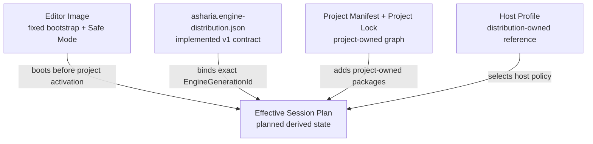

# ADR：Engine Distribution Manifest v1 与 EngineGenerationId

## 状态

Accepted and implemented for #279。

本 ADR 已落地以下合同层能力：

- `schemas/package-runtime/engine-distribution-manifest-v1.schema.json` 的 closed schema；
- `tools/check_package_contracts.py` 中的 schema dispatcher、semantic validator、discovery 与 canonical writer；
- 内容派生的 `EngineGenerationId`；
- synthetic fixture 与正反向 tests。

Effective Session v1 与 Host Composition 输入迁移已由 #281 实现。当前尚未实现 Distribution assembler、
installer/repair service、Factory/Activation 或 Host Runtime。
[Project Manifest 与 Package Lock v2 硬切](adr-project-manifest-lock-v2-hard-cut.md) 已完成发行库存所有权迁移；v1
reader/adapter/双写与 `bundled` lock source 已删除。

## 问题

Project Package Lock 回答“某个项目解析到了哪些 exact packages”，Package Artifact Manifest 回答“某次 source build 为
一个 exact package 产生了哪些 bytes”。两者都不能单独回答：

- 当前安装的 Engine/Editor generation 究竟包含哪些固定 bytes；
- 哪些 package 随 Engine 发行，项目只能引用而不能覆盖；
- 哪些 Host Profiles 属于该发行版本；
- 项目 graph 损坏时，Editor Bootstrap 依靠什么继续启动、诊断与修复；
- 一个项目 native artifact 应绑定哪个 exact Engine/Editor generation。

如果继续把 Editor Image、bundled inventory 和项目 graph 写进同一个 project lock，就会让项目错误同时破坏修复入口，
并使 resolver lock 变成 installer inventory。反过来，如果只保留安装目录而没有确定性证据，Repair、CI 和 exact native
composition 又无法证明自己消费的是同一个发行版本。

## 外部行为依据

本决策只从公开行为确定边界，不推断 Unity 未公开的 Editor 内部实现：

- Unity Core packages 随特定 Editor 版本分发，不能通过 Package Manager 任意选择其他版本；
- Unity Built-in packages 随 Editor 分发，项目可以控制部分能力是否进入最终 Player；
- Unity Project Manifest 与 lock 分别记录项目直接 intent 和 dependency resolution result；
- Unity Safe Mode 在项目或 package 代码编译失败时仍保留最小 Editor 修复环境。

这些行为支持的 Asharia 结论是：Editor 可以和 Engine 深度、静态集成，但其最低启动能力不能由当前项目 lock 从零组装。

## 决策

### 1. 发行库存与项目依赖分开拥有

采用三层持久事实和一层派生状态：

| 层 | 所有者 | 持久事实 |
| --- | --- | --- |
| Editor Image | Engine/Editor build 与 installer | Editor executable、最小 UI Shell、diagnostics、Package Manager、Build/Repair/Safe Mode 所需 bytes |
| Engine Distribution Manifest | Engine/Editor build 与 installer | exact Engine generation、Editor Image evidence、bundled package inventory、package artifact references、Host Profiles |
| Project Manifest / Project Lock | 项目与 package resolver | 项目 direct intent、exact project graph、project-embedded/local sources 与对 Engine 的要求 |
| Effective Session Plan | Editor/Host session composer | Distribution + Project Lock + Host Profile 的派生组合；可重建，不是第三个 lock |



Engine Distribution Manifest 是 build/installer 生成并只读安装的 inventory，不是 resolver 求解结果，不接受项目 Package
Manager 原地重写。

### 2. v1 文件与 discriminator

canonical 文件名：

```text
asharia.engine-distribution.json
```

discriminator：

```json
{
  "schema": "com.asharia.engine-distribution",
  "schemaVersion": 1
}
```

Schema 使用 JSON Schema Draft 2020-12，并对每一层 object 设置 `additionalProperties: false`。Unknown fields、自由字符串
generation ID、absolute path、时间戳和命令行不会成为模糊的扩展槽；需要增加语义时升级 versioned contract。

### 3. v1 inventory shape

| 字段 | 语义 | 不包含 |
| --- | --- | --- |
| `engineGenerationId` | 整个 canonical distribution inventory 的 content identity | 单 package publication identity、随机 UUID、安装目录绝对路径 |
| `distribution` | distribution id、Engine version、Engine API version | 项目 package intent |
| `context` | target platform、configuration、native toolchain compatibility facts | compiler absolute path、环境变量、构建命令 |
| `editorImage` | 唯一 entry point 和 exact direct file path/role/media type/size/SHA-256 | 项目代码、项目 package graph |
| `bundledPackages` | exact id/version/kind、required/default/optional、distribution-relative root、author manifest/payload integrity | package 内部 target 选择、项目 enable state |
| `packageArtifacts` | exact package/context 对 package artifact generation 与 per-package Artifact Manifest 的引用 | Artifact Manifest 中已有的完整 file list |
| `hostProfiles` | exact host kind/platform 对 profile path/integrity 的引用 | Host Profile policy 的副本 |

`context.toolchain` 只保存 native compatibility 所需的 normalized facts：compiler id/version、target system/architecture 与
runtime library。它不声称已经定义通用 C++ ABI；未来 exact-build native module 仍必须绑定整个 `EngineGenerationId`。

### 4. EngineGenerationId 是无环 content identity

`engineGenerationId` 格式固定为：

```text
sha256-<64 lowercase hexadecimal digits>
```

计算过程固定为：

1. schema/semantic producer 输入被规范化为固定 object field order；
2. `editorImage.files` 按 path 排序；`bundledPackages` 按 package id 排序；package artifacts 与 Host Profiles 按
   exact semantic key 排序；
3. 从 canonical object 中省略 `engineGenerationId` 字段，得到 generation payload；
4. 使用 UTF-8 without BOM、LF、两空格缩进和末尾换行渲染 payload；
5. 对这些 exact bytes 计算 SHA-256，并添加 `sha256-` 前缀；
6. canonical writer 将计算结果写回完整 manifest；validator 对外部输入重新计算并拒绝 stale/forged ID。

ID 不 hash 自己，因此没有 fixed-point/self-hash cycle。任何被纳入 inventory 的 package、profile、toolchain、path、size 或 digest
变化都会产生新的 Engine generation。字段排列或 semantically unordered array 的输入顺序不会改变 ID。

`EngineGenerationId` 与 #278 package artifact publication receipt 中的 `artifact_generation_id` 不同：

- `EngineGenerationId` 标识一个完整 Engine/Editor 发行组合；
- `artifact_generation_id` 标识一组 package artifact manifests/bytes；
- Distribution 的 `packageArtifacts[].artifactGenerationId` 只是对后者的显式引用；
- 不允许使用无所有权前缀的模糊 `generationId` 字段。

### 5. Distribution path 是可移植相对路径

所有持久 path 均相对 Distribution root，并满足：

- Unicode NFC、UTF-8 可编码；
- 使用 `/`，不得是 absolute path、drive path、`.`、`..` 或空 segment；
- 拒绝控制字符、Windows reserved characters、reserved device names、trailing dot/space；
- exact duplicate、Unicode case-fold collision 与 file/directory ancestor collision fail closed。

Editor entry point 必须引用 `editorImage.files` 中 role 为 `executable` 的 exact file。Bundled package roots 不能重叠；Editor
Image、Host Profile 与 package Artifact Manifest file evidence 不能占用 package root namespace。

### 6. Package evidence 只引用，不复制

`bundledPackages` 记录发行时的 author manifest/payload identity；`packageArtifacts` 记录 immutable artifact generation 与
per-package Artifact Manifest reference。Distribution 不复制 Artifact Manifest 的 module/product/file arrays。

这样形成传递证据：

```text
EngineGenerationId
  -> packageArtifacts[].manifestIntegrity
  -> Package Artifact Manifest
  -> exact package-relative files / size / SHA-256
```

Editor executable、bootstrap resources 等不一定属于可安装 package，因此由 `editorImage.files` 直接记录 exact evidence。静态链接进
Editor executable 的 package machine code 可以由 Editor executable bytes 证明最终发行结果，同时保留 package artifact references
用于 build/install provenance；Distribution contract 不把 package 边界误作 DLL 边界。

### 7. Schema 与 semantic validation 分工

Schema 负责字段、类型、closed enums、digest/generation 格式和局部 shape。Semantic validator 负责：

- Editor entry point 存在且 role 为 executable；
- bundled package id 唯一，同一 id 不允许多个 versions；
- package artifact 引用一个已声明的 installable package，并精确匹配 version/platform/configuration；
- 同一 package + host + platform + configuration 只有一份 artifact reference；
- Host Profile 的 host/platform key 唯一，并匹配 Distribution target platform；
- 全局 path portability、duplicate/case-fold/ancestor collision；
- declared `engineGenerationId` 与 canonical inventory 一致。

Diagnostics 使用稳定的 `distribution.*` code 和 JSON pointer；等价输入排列得到相同 canonical bytes 和有序 diagnostics。

### 8. Hash 验证发生在边界，不发生在每次编辑

Manifest 与 hashes 是 immutable generation 激活的证据，不是 source file watcher。后继 assembler/installer/repair service 应在以下
边界完整验证：

- Engine/Editor build 与 Distribution assembly；
- install、cache restore、CI、显式 Verify/Repair；
- 激活新的 Engine generation；
- 生成与该 generation 绑定的 Player/Game 或 project native composition。

日常 Editor 启动可以消费 installer/build receipt 与轻量 file identity/mtime/size state；只有边界信号变化或显式验证时才重新读取并
hash 全部 bytes。项目 source mode 的每次保存不产生新的完整 Distribution 或 package artifact generation。

本 Slice只实现 inventory contract 与 pure validation，不实现上述 filesystem verifier 或轻量 receipt。

## Project Lock v2 绑定边界

#280 已采用早期硬切完成所有权迁移：

1. Project Manifest v2 声明 Distribution ID 与 Engine API requirement，不固定 generation；
2. Project Lock v2 的 `inputs.engine` 固定 exact Distribution ID、Engine API version 与 `EngineGenerationId`；
3. 发行 node 只保存 `source.kind = engine-distribution` 和 exact graph，不复制 root/hash；
4. resolver/verifier 以 Distribution `bundledPackages` 的 path/integrity 为唯一权威，并拒绝同 identity
   project-embedded/local shadow；
5. v1 schema、reader、adapter 和双写均不存在，旧项目必须重新解析生成 v2 lock。

具体 wire contract 和失败语义见
[Project Manifest 与 Package Lock v2 硬切](adr-project-manifest-lock-v2-hard-cut.md)。

### 后继 Effective Session（已实现）

Effective Session v1 已分别验证：

```text
Engine Distribution Manifest
+ Project Lock
+ selected Host Profile
-> derived Effective Session Plan
```

它只组合，不重新求解 packages，不写回 Distribution/Project Lock，也不成为第三套提交到项目的依赖真相。v1 实际产生
`Ready`、`RepairRequired`、`UpgradeRequired` 与 `SafeMode`；`PendingBuild` / `PendingRestart` 保留为词汇但在缺少
artifact freshness / current-process generation evidence 时不得产生。完整合同见
[Effective Session v1](adr-effective-session-v1.md)。

## 被拒绝的方案

### 把 Distribution 称为第二个 lock

拒绝。它是 build/installer inventory，不是 dependency solver result。`lock` 会暗示项目 Package Manager 可以重算或重写它。

### 只用随机 build UUID

拒绝。随机 ID 不能证明两个 manifest 表达同一 inventory，也无法由 Repair/CI 独立重算。内容派生 ID 可以检测 stale/forged
inventory，并保持 semantic permutation stability。

### 让 ID hash 包含自身

拒绝。这会产生没有必要的 self-hash cycle。v1 明确 hash 省略 ID 的 canonical payload。

### 在 Distribution 中复制所有 Package Artifact files

拒绝。它会产生两份 file inventory 和 drift 风险。Distribution 引用 exact manifest integrity，Package Artifact Manifest 继续拥有
package-relative file evidence。

### 由项目 lock 从零组装 Editor Bootstrap

拒绝。损坏、未构建或不兼容的项目会同时移除诊断/Repair/Safe Mode 入口。

### 把 package 等同于 DLL

拒绝。package 是安装、依赖和交付边界；logical module、CMake target、artifact generation 与 runtime load boundary 是不同概念。
v1 继续采用独立静态 targets + 薄 composition root + 启动期注册。

## 后果

- Engine/Editor 发行组合首次拥有独立、closed、可重算的 content identity；
- Project graph 不再需要继续吸收 Editor Image 和 installer inventory；
- package artifact evidence 与完整 Engine generation 通过显式引用连接，但保持各自所有权；
- 每个 Distribution manifest 只描述一个 target platform/configuration/toolchain context；多配置发行生成多个 exact manifests/generations；
- 修改任一 inventory evidence 会产生新的 Engine generation，即使 Engine semantic version 未变化；
- 当前 resolver/lock/composition 路径仍处于迁移期，不能直接用于最终 Activation。

## 验证证据

`tools/tests/test_engine_distribution_contracts.py` 覆盖：

- valid schema/discriminator/discovery；
- unknown fields 与 malformed generation ID；
- semantic change 改变 ID、stale ID fail closed、self-id omission；
- permutation-independent canonical writer、round-trip、UTF-8 no BOM/LF；
- entry point、package identity、artifact reference/context、Host Profile invariants；
- reserved/case-fold/duplicate/ancestor path failures。

通用 package contract tests 继续证明已有 Project Manifest、Package Lock、Host Profile、Composition、Source Build 与 Artifact Manifest
合同无回归。

## 后续顺序

1. Effective Session v1 与 Host Composition verified graph handoff 已完成；
2. 实现 Distribution assembler/installer verification boundary 与轻量启动状态检查；
3. 生成静态薄 composition root；
4. 再定义 Factory reference、Activation Plan、Scope/Lifecycle 与 Host Runtime；
5. 只有出现真实重链接瓶颈和 ABI 需求后，再评估 exact-build native dynamic module。

## 参考资料

- [Unity Core packages](https://docs.unity3d.com/6000.0/Documentation/Manual/pack-core.html)
- [Unity Built-in packages](https://docs.unity3d.com/6000.0/Documentation/Manual/pack-build.html)
- [Unity Project manifest](https://docs.unity3d.com/6000.0/Documentation/Manual/upm-manifestPrj.html)
- [Unity Lock files](https://docs.unity3d.com/6000.0/Documentation/Manual/upm-conflicts-auto.html)
- [Unity Safe Mode](https://docs.unity3d.com/6000.0/Documentation/Manual/SafeMode.html)
- [CMake `install()`](https://cmake.org/cmake/help/latest/command/install.html)
- [Package Candidate 与 Lockfile v1](adr-package-candidate-lockfile-v1.md)
- [Editor/Engine Distribution 与原生组合](adr-editor-engine-distribution-and-native-composition.md)
- [Effective Session v1](adr-effective-session-v1.md)
- [Host Composition Plan v1](adr-host-composition-plan-v1.md)
- [Source Build Plan v1](adr-source-build-plan-v1.md)
- [Package Product & Artifact Evidence v1](adr-package-product-artifact-evidence-v1.md)
