# ADR：Engine Distribution Package Catalog Snapshot v1

## 状态

Accepted for #301。

本 ADR 建立在以下已经实现的边界上：

- [Engine Distribution Manifest v1](adr-engine-distribution-manifest-v1.md) 拥有一个 exact generation 的只读 bundled package inventory；
- [Installed Distribution Repair Verifier v1](adr-installed-distribution-repair-verifier-v1.md) 只有在完整 installed generation 深度复验成功后才产生 `VerifiedInstalledDistribution`；
- [显式来源 Package Candidate Discovery v1](adr-package-candidate-discovery-v1.md) 从调用方给出的 exact roots 收集 fresh manifest/payload evidence；
- [Deterministic in-memory Package Resolver v1](adr-package-resolver-v1.md) 消费 candidates 并产生 canonical exact graph；
- [Locked Package Graph Verification & Reuse v1](adr-package-lock-verification-v1.md) 在使用 existing Lock 前重新对证 project、Distribution 与 selected payload。

#301 只补齐受信调用图传入的 nominal verified Distribution 到首次求解候选集的结构化 handoff。它不定义 Project/local source
index、registry/acquisition、Lock update/apply 事务、Package Manager UI、Launcher、Installer 或 Repair Executor。

## 背景

Strict Candidate Loader 已经能证明“这个明确位置当前是否是一个可信 candidate”，但它不拥有“应该给它哪些位置”。现有
Project Bootstrap 从 existing Lock 中反推需要加载的 Distribution/project/local roots，适合 locked reuse，却不能服务尚无 Lock 的首次
求解：此时调用方仍需要从当前已安装 Engine generation 获得完整、确定且可信的 bundled candidate 集合。

直接扫描 generation、把 inventory 字段当作 candidate，或者先伪造一份 Lock 都会破坏现有边界：

- 目录扫描会把布局、枚举顺序、extra directories 与平台路径行为变成隐式 catalog 协议；
- inventory 是持久发行事实，但不是 freshly loaded author manifest/payload snapshot；
- Lock 是 resolver 的 exact selected graph，不是候选位置提供器；
- UI 只能观察或请求 control-plane 操作，不能成为 bundled inventory 的事实来源。

因此需要一个窄 adapter：接受受信调用图传入的 nominal `VerifiedInstalledDistribution` shape，从其 bundled inventory 派生 strict
loader locations，重新检查可观察的 handoff 结构并读取 payload evidence，逐项对证后发布一个不可持久化的内存 catalog snapshot。

## 决策

### 1. 持久事实只有 Engine Distribution Manifest

`asharia.engine-distribution.json` 的 `bundledPackages` 继续是 installed generation 中 bundled package 的唯一持久库存事实。
`EngineDistributionPackageCatalogSnapshot` 是可丢弃的 process-local projection，不保存为 JSON，不生成新的 catalog ID，不复制成
项目文件，也不修改 Distribution Manifest。

| Owner | 拥有 | 不拥有 |
| --- | --- | --- |
| Launcher / installer selection | expected `EngineGenerationId` 与 generation root | bundled candidate evidence、resolver 选择 |
| Installed Distribution Repair Verifier | installed bytes 深度复验与 `VerifiedInstalledDistribution` handoff | catalog、求解、修复或 active generation 切换 |
| Engine Distribution Manifest | exact generation 与 bundled inventory 的唯一持久事实 | fresh candidate snapshot、项目 direct intent |
| Engine Distribution Package Catalog adapter | inventory 到 exact locations 的投影、fresh evidence 对证、原子内存 snapshot | persistent index、source precedence、版本选择、Lock 写入 |
| Strict Candidate Loader | 一个显式 root 的 manifest/payload evidence 与 filesystem safety | 哪些 inventory entries 应进入 catalog |
| Resolver | 从完整 candidate set 选择 exact graph | source discovery、磁盘扫描、apply 事务 |
| 后继 Lock update/apply owner | 更新政策、impact preview、Project Manifest/Lock 原子写入与 rollback | 修改 Engine Distribution |

当前 `tools/engine_distribution_package_catalog.py` 是仓库内 reference oracle 和 CI 验证实现。正式 Editor、Launcher、Installer 或
Repair 产品路径不得启动或携带 Python；产品接入必须由 C#/.NET 或 native 实现共享同一所有权、失败与确定性合同。

### 2. 唯一入口必须消费 verified handoff

公共入口是：

```text
derive_engine_distribution_package_catalog(
  verifiedDistribution: VerifiedInstalledDistribution,
  validators
)
  -> success(EngineDistributionPackageCatalogSnapshot)
   | failure(diagnostics)
```

调用方不能传 raw generation root、raw Distribution Manifest dictionary、目录中的“最新”generation 或自行填充的 bundled entries。
生产调用图必须把 installed deep verification 成功返回的 `VerifiedInstalledDistribution` 原样交给 adapter。仓库内 Python dataclass
是可公开构造的 nominal handoff shape，并不是认证 token 或不可伪造 capability；本 reference oracle 假定调用方代码受信任。Adapter
仍会重新检查 generation root 的完整 component/link 合同与 basename、generation ID、manifest bytes、manifest integrity 和 manifest
projection 的可观察内部一致性，以拒绝 stale、mutated 或 malformed handoff，但不能向敌对的同进程 Python 调用方证明对象来源。
未来 C#/.NET 或 native 产品实现若向不受信任插件暴露此入口，必须由产品边界封装 verified capability，而不能照搬公开 dataclass
作为授权机制。

Snapshot 绑定 exact `EngineGenerationId`、不可变且确定排序的 `id/version/packageKind/availability/logicalRoot` entries、captured
canonical Distribution Manifest bytes 与 exact candidates；读取 manifest/candidates 时返回隔离副本。它只在内存存在；其中为后继
locked verification/planning 保留的 adapter-local payload location 不得被序列化为 Lock 字段、diagnostic 或公共 catalog 数据。

### 3. 每个 bundled inventory entry 恰好投影一次

Adapter 先验证并冻结 `bundledPackages` projection，再为每个 entry 构造一个
`EngineDistributedCandidateLocation(generationRoot, inventory.root)`。它不递归枚举 generation 下的父目录，不观察 sibling packages，
不根据 mtime、semantic version 或目录名选择“最新”版本。

在任何 payload load 前必须拒绝：

- 重复 `identity + exact version`；
- 重复 logical root，或不同 logical roots 指向同一 physical root；
- invalid/non-portable root、missing/unavailable root、root escape；
- symlink、junction/reparse point 或 non-directory root；
- 无效 handoff、无效 inventory shape 或 generation context mismatch。

输入 inventory 的排列不能影响输出。Projection、loader locations 与 snapshot entries 按
`(identity UTF-8 bytes, exact SemVer text, logical-root UTF-8 bytes)` 排序；diagnostics 按 generation、logical root、identity、location、
code 与 message 的稳定 key 排序。任何结果都不得依赖 dictionary insertion order、filesystem enumeration order 或 caller order。

### 4. Inventory 只选位置，fresh bytes 才建立 candidate

每个投影位置必须通过既有 `load_package_candidates(...)` strict loader。Loader 重新读取 exact `asharia.package.json`、调用现有
schema/semantic validators，计算 manifest exact-byte integrity 和完整 `asharia-package-tree-v1` payload integrity，并生成不可变
`PackageCandidate`。

Catalog adapter 随后把 loaded candidate 与对应 inventory entry 逐项对证：

- `id`、exact `version` 与 `packageKind`；
- `engine-distribution:<logical-root>` source 与 stable logical root；
- author manifest exact-byte integrity；
-完整 payload tree integrity；
-一个 inventory entry 恰好对应一个 loaded candidate，且反向不存在额外 candidate。

任何 mismatch 都表明 verified handoff 描述的 point-in-time inventory 与当前读取的 package bytes 已经分离。Adapter 必须 fail closed，
不能把 inventory value 覆盖到 loaded candidate，也不能接受 loader 观察到的“新版本”继续求解。

### 5. 数据流保持单向且无 Lock 前置

```mermaid
flowchart LR
    Selection["Launcher / installer selection<br/>expected generation"]
    Verify["Installed Distribution<br/>Repair Verifier"]
    Handoff["VerifiedInstalledDistribution<br/>process-local"]
    Inventory["bundledPackages<br/>persistent inventory truth"]
    Loader["Strict Candidate Loader<br/>fresh exact bytes"]
    Snapshot["EngineDistributionPackageCatalogSnapshot<br/>immutable + in-memory"]
    Resolver["Deterministic Resolver"]
    Lock["Canonical Project Lock v2"]
    Reuse["Locked verify / reuse"]

    Selection -->|"anchors"| Verify
    Verify -->|"produces only when Healthy"| Handoff
    Handoff -->|"exposes exact inventory"| Inventory
    Inventory -->|"projects explicit roots"| Loader
    Loader -->|"returns exact candidates"| Snapshot
    Snapshot -->|"offers complete bundled set"| Resolver
    Resolver -->|"selects exact graph"| Lock
    Lock -->|"rehashes before use"| Reuse
```



Catalog adapter 不需要 existing Project Lock。首次求解可以把 snapshot candidates 与未来独立 Project/local source providers 的
candidates 组合后交给 resolver；本 ADR 不定义两类 providers、source precedence 或冲突解决政策。Resolver 的选择算法和
canonical Lock v2 writer 不因本 Slice 改变。

### 6. 成功或失败都是原子的

结果合同只有两种有效形状：

- 成功：一个完整 `EngineDistributionPackageCatalogSnapshot`，无 diagnostics；
- 失败：无 snapshot，至少一个稳定 diagnostic。

任一 handoff、inventory、root、manifest、payload、loader 或 exact evidence failure 都禁止返回 partial catalog。否则损坏的一个
bundled package 会静默缩小可解集合，使相同 Project intent 产生不同 Lock。

Catalog 自己发现的 handoff/inventory mismatch 使用稳定的 `catalog.*` codes；Strict Candidate Loader 的 `discovery.*` code 继续保留，
但必须被映射成 catalog-owned generation/package/logical-root context 和固定摘要，不能原样泄漏底层消息或本机 root。Diagnostics
按 generation、logical root、identity、location、code 与 message 确定排序，可以包含 `EngineGenerationId`、package identity/version、
logical root、manifest-relative location 和稳定错误类别；不得包含 adapter-local 绝对路径、平台异常原文、object address、时间戳、
命令或枚举序号。

### 7. Snapshot 是一次观察，不延长磁盘信任

当 `VerifiedInstalledDistribution` 确由 verifier 返回时，它证明 verifier 完成时的 installed bytes；strict loader 又证明 catalog
derivation 期间观察到的 package bytes。普通 filesystem 不能提供跨整个 generation 的敌对并发事务快照，因此 adapter 必须复用
loader 的 manifest-before/after、regular-file 和 source-mutation 检查，任何 loader 可观察到的 drift 都 fail closed。

成功后 adapter 不保留 file handle、watcher 或 cache，也不写 marker。Snapshot 交给 resolver 后若 payload 再变化，后继 locked
verification/reuse 仍必须依据 canonical Lock 与 Distribution inventory 重新 hash；catalog snapshot 不能充当 activation admission、
artifact receipt 或长期 health certificate。

## 失败模型

失败按 owner 分类，而不是退化成一个自由文本异常：

| 失败族 | 示例 | 结果 |
| --- | --- | --- |
| request/handoff | 非 `VerifiedInstalledDistribution`、generation/manifest/integrity 内部不一致 | 无 snapshot；caller/control-plane diagnostic |
| inventory | invalid entry、duplicate identity/version、duplicate logical root、context 不一致 | 无 snapshot；Distribution-owned diagnostic |
| source/root | missing、unavailable、escape、link/junction、physical alias | 无 snapshot；Distribution-owned diagnostic |
| manifest/payload | UTF-8/JSON/schema/semantic、non-regular entry、hash、source mutation | 无 snapshot；package + logical-root diagnostic |
| exact evidence | loaded id/version/kind/source/manifest/payload 与 inventory 不一致 | 无 snapshot；Distribution-owned mismatch diagnostic |

Adapter 不把 failure 转换为 `RepairRequired`、`SafeMode` 或 `FatalDistributionError`。这些用户可见状态由更外层 Bootstrap/Launcher
根据 failure owner 和当前可用控制面归约。本 Slice 也不执行 repair、删除、隔离、重新下载或 generation fallback。

## 拒绝的替代方案

### 持久化第二份 bundled catalog

拒绝。它会复制 Distribution inventory，引入 generation/catalog 双写、漂移与新的恢复政策。可重建的 snapshot 应保持内存态。

### 扫描 `packages/` 或 generation root

拒绝。目录布局、extra files、权限和枚举顺序会成为隐式 API；只有 manifest inventory 有权决定 bundled entries。

### 直接把 inventory entry 转成 `PackageCandidate`

拒绝。Inventory 证明发行时的 exact evidence，不能代替当前 manifest/payload bytes。Strict loader 是 fresh filesystem evidence 的唯一
入口。

### 复用 existing Lock 来选择 Distribution roots

拒绝作为 catalog provider。它只覆盖 Lock 已选择的子集，无法服务首次求解，也无法证明 inventory 每项恰好一次。

### 同时加入 Project/local candidates

拒绝。Project-embedded index、local workspace mapping、source precedence 与 machine-local configuration 有不同 owner 和持久化
政策，必须由后继 Slice 单独定义。

### 在 adapter 内更新或写入 Lock

拒绝。Candidate completeness、version selection、impact preview、atomic manifest/Lock apply 与 rollback 是不同失败/授权边界。

## 非目标

- Project-embedded index 或 local workspace mapping 的持久格式与 provider；
- registry、download、credential、signature、publisher trust、license 或 acquisition；
- source precedence、resolver 算法、minimal-change update 或 version policy；
- Project Manifest/Lock update、impact preview、atomic apply、journal、rollback 或 recovery；
- Package Manager/Bootstrap UI、Build/Publish、Repair、Restart、Launcher 或 Installer；
- production System/Feature/Integration/Content/Template package declaration 迁移；
- source-boundary manifest、CMake topology 或 product artifact contract 修改。

## 实现与验证

#301 保持为一个独立、可回退 Slice：

- `tools/engine_distribution_package_catalog.py` 拥有 verified Distribution 到内存 catalog 的 adapter、snapshot 与 diagnostics；
- focused tests 覆盖完整成功、inventory permutation、diagnostic byte determinism、duplicate identity/root、candidate
  missing/duplicate/unexpected、malformed/mutated handoff、root/generation binding、loader failure context 映射与所有 exact evidence
  mismatch；实际 filesystem link/junction/physical-alias 与 collection-time observable mutation 由被复用的 Repair Verifier/Strict
  Candidate Loader 回归测试覆盖，catalog-facing tests 验证这些 stable failure 的原子传播和路径脱敏；
- 至少一个 headless test 证明 `verified Distribution -> catalog -> resolver -> canonical Lock v2 -> locked verify/reuse` 不依赖
  existing Lock；
- 回归 Candidate Discovery、Resolver、Locked Verification、Bootstrap、Distribution assembly/repair；
- 运行 Python 3.14 全量 tests、package contracts/topology、encoding、doc-sync、diff 与 Conan-before-CMake ClangCL/MSVC gates。

## 后果与后继边界

正向后果：首次求解不再需要伪造 existing Lock；bundled inventory 与 fresh package bytes 在进入 resolver 前有独立对证；CLI、CI 与
未来 Editor UI 可以共享相同 headless catalog 边界；坏 package 不会静默缩小 candidate set。

代价：catalog derivation 会再次读取所有 bundled package manifest/payload bytes；snapshot 是 point-in-time 观察，使用前仍需 locked
verification；Project/local sources 尚不能仅凭本 ADR 加入首次求解。

后继工作必须保持独立：

1. Project-embedded index 与 local workspace mapping provider；
2. Lock update planning、impact preview 与最小变更政策；
3. Project Manifest/Lock atomic apply、journal、rollback 与 recovery；
4. production installable package/profile declarations；
5. Editor Package Manager UI、registry/acquisition 与 Launcher/Installer/Repair 产品实现。

## 外部边界参照

[Cargo Registry Index](https://doc.rust-lang.org/cargo/reference/registry-index.html) 把可用 package/version/checksum metadata 的 index
与 package payload/download endpoint 分开；[cargo generate-lockfile](https://doc.rust-lang.org/cargo/commands/cargo-generate-lockfile.html)
则单独负责为 package/workspace 创建或重建 Lock。这个分层支持 Asharia 将 candidate provider 与 Lock update/apply owner 分开，
但本 ADR 不采用 Cargo index 格式，也不实现 registry。

[Unity Project Manifest](https://docs.unity3d.com/Manual/upm-manifestPrj.html) 保存项目 direct package intent，
[Unity Lock files](https://docs.unity3d.com/Manual/upm-conflicts-auto.html) 保存 dependency resolution 结果。这个参照支持 Asharia 继续把
Project Manifest、candidate catalog 与 exact Project Lock 分成不同事实；它不改变 Engine Distribution 作为 bundled inventory 唯一
持久 owner 的本地决定。

## 依据

- GitHub #264、#271、#273、#274、#283 与 #301；
- [Package-first 架构](package-first.md)；
- [Engine Distribution Manifest v1](adr-engine-distribution-manifest-v1.md)；
- [Installed Distribution Repair Verifier v1](adr-installed-distribution-repair-verifier-v1.md)；
- [显式来源 Package Candidate Discovery v1](adr-package-candidate-discovery-v1.md)；
- [Deterministic in-memory Package Resolver v1](adr-package-resolver-v1.md)；
- [Locked Package Graph Verification & Reuse v1](adr-package-lock-verification-v1.md)。
