# ADR：Generated Current-Image Host 与 Project Bootstrap v1

## 状态

Accepted for #297。

本 ADR 取代 [Activation Eligibility v1](adr-activation-eligibility-v1.md) 中“每次正常启动必须由外部 launcher
签发 `VerifiedCurrentProcessLaunchHandoffV1`，并再次对证 executable artifact identity”的运行时方案。v1 的两阶段
admission、current-process/control-thread epoch 和 exact-table affinity 继续保留；四个外部 handoff、artifact size/hash、
binding generation 与 launch receipt 运行时依赖被直接删除，不提供兼容 alias、reader 或 adapter。

本 Slice 同时把 Windows Development Host Template 硬切到 renderer 3、Generated Static Composition Root 硬切到
renderer 6，并接通第一条真实 normal Host 垂直链：固定 Project Bootstrap provider 发布单例
`ProcessApplicationV1`，Host 在 ProcessScope 成功启动后读取真实 `asharia.project.json`，输出确定性摘要并显式停止。

## 问题

此前 V1 把四类已经完成的构建期事实再次压到每次运行的 admission 中：

- Ready Effective Session；
- verified Host Activation Blueprint；
- deep-verified Host Executable Binding Receipt；
- launcher 签发的 current-process handoff。

这要求一个尚不存在的 production launcher/IPC/OS-handle issuer。更重要的是，它把两种不同边界混在了一起：

| 边界 | 应回答的问题 |
| --- | --- |
| build / publication / install / cache restore / repair | 磁盘上的 artifact bytes 是否是被批准的 immutable generation |
| normal current-image activation | 当前链接镜像中的 generated composition 是否能安全地注册、启动和停止本次 ProcessScope |

正常启动重新 hash executable path 不能证明全部 loaded-image pages，也会让 Editor/Host 依赖外部控制面先签发一次性票据。
另一方面，只要 C++ 模块已静态进入同一个受验证 generation，Host 真正需要的是当前镜像内的 sealed composition facts、
同一次 recording 产生的 callback table、current process epoch 和 control thread。

因此，`verified manifest + artifact bytes` 仍是不可变 generation 的证据，但不再是每次 normal Host 启动的唯一状态依据。

## 决策摘要

```mermaid
flowchart LR
    Build["Build / publication / install / repair\nverify immutable artifact bytes"]
    C6["Composition renderer 6\nsealed current-image descriptor + providers"]
    T3["Host Template renderer 3\nrestricted mode or normal mode"]
    Pre["PreRegistrationAdmissionV2"]
    Record["admitted provider recording"]
    Table["exact admitted callback table"]
    Scope["ProcessScopeExecutorV2"]
    App["single<ProcessApplicationV1>()"]
    Project["Project Bootstrap Inspector\nread asharia.project.json"]
    Stop["explicit stop"]

    Build --> C6
    C6 --> T3
    T3 -->|"normal"| Pre
    Pre --> Record
    Record --> Table
    Table --> Scope
    Scope --> App
    App --> Project
    Project --> Stop
    T3 -->|"--asharia-verify-static-registration"| Record
```



restricted registration 是 build/publication 取证路径：它直接记录并输出 RegistrationSnapshot v2，不 mint current-image
descriptor，不 claim process epoch，也不执行 lifecycle 或 contribution accessor。

normal mode 是运行路径：C6 私有 source 先封存 current-image descriptor，再按值消费为
`PreRegistrationAdmissionV2`。只有这条路径能够把 recorded table 交给 ProcessScope。

## 1. Current-image descriptor 的内容

descriptor 只携带本次执行所需、由 generated source 固定的 facts：

- Engine generation、Host kind 与 target platform；
- Effective Session integrity 与 Host Activation Blueprint integrity；
- Static Composition generation；
- 唯一接受的 generation tuple：Template 3 / Composition 6 / provider v4 / RegistrationSnapshot v2；
- ProcessScope lifecycle model；
- dependencies-first Process factory references 与 exact requirements；
- generated registration capacity function 与 recording function；
- 创建时绑定的 current-process epoch 与 bootstrap control-thread epoch。

descriptor 明确不包含：

- executable path、size 或 SHA-256；
- PID、process handle、receipt path/bytes 或 launcher IPC token；
- Host Executable Binding generation；
- callback、type-key、payload 或 epoch address 的序列化值。

artifact bytes 是否损坏仍由 collector、distribution assembler、installer/cache restore 和 Installed Distribution Repair Verifier
负责。正常启动不重新读取或 hash executable path。

## 2. Sealing 与 target topology

`CurrentImageActivationDescriptorV2` 是不可默认构造、不可复制、只能移动的 owning typestate。普通 Host source 和 package
provider 看不到它的构造 bridge。

C6 attachment 为每个 Host 创建 `${target_name}-asharia-static-composition` 私有 OBJECT target：

```text
generated composition OBJECT target
  PRIVATE -> host_runtime_current_image_provider_bridge
  PRIVATE -> selected static provider targets

final Host executable
  PRIVATE -> generated OBJECT target
  PRIVATE -> host_runtime_process_scope
```

privileged include root 只传播到 generated OBJECT target。生成 header 向 Host 暴露的是无参
`asharia::generated::admitCurrentImagePreRegistration()`，而不是任意 facts builder。source 内部用静态存储期 provider view
封存 descriptor 并立即消费为 admission。

这是一条 CMake/API 防误用边界，不是 hostile-native sandbox。同进程恶意 C++ 可以读写进程内存；代码签名、稳定 ABI 和恶意插件
隔离需要独立的 process/attestation 方案。

## 3. Eligibility V2

V2 只保留一条 Stage 1 输入：

```text
CurrentImageActivationDescriptorV2
    -> admitCurrentImagePreRegistration(...)
    -> PreRegistrationAdmissionV2
```

Stage 1 在任何 provider invocation 前验证：

- descriptor 所有必填 identity、digest、generation 与 Process projection 格式；
- exact T3/C6/provider-v4/Snapshot-v2 tuple；
- capacity/recording function 均存在；
- 当前调用发生在 descriptor 绑定的 control thread；
- process epoch 仍是当前 generation，且 atomic claim 恰好成功一次。

Stage 1 成功后，admitted recording wrapper 才能调用 generated providers。recorder 自身逐项检查生成的
package/version/module/entry point、factory 与 contribution ID/kind expectations；finish 后还必须满足：

- snapshot generation 等于 descriptor 的 Static Composition generation；
- snapshot Blueprint SHA-256 等于 descriptor 的 Blueprint integrity。

Stage 2 继续按值消费 pending table，并验证 `AdmittedRegistration` origin、table member address、immutable storage anchor、
snapshot header、control thread 与 process epoch。snapshot 相同但来自另一张 callback table 的替换仍然 fail closed。

V2 不再持有 deep-verifier 的第二份完整 expected snapshot。完整 registration 集在 build/publication restricted run 中对证；
normal run 由 generated recorder expectations、immutable table 和 ProcessScope exact projection 共同约束。

## 4. Host Template renderer 3

T3 不把 normal lifecycle、restricted verification 和 CLI 解析混在一个大 `main.cpp`。固定输出拆为：

- `src/main.cpp`：只选择 restricted/normal 命令并投影参数；
- `src/registration_verification.cpp`：只拥有 disposable snapshot 输出；
- `src/process_application_host.cpp`：只拥有 admission、ProcessScope、typed lookup、run 与 stop；
- 一个窄 internal header：声明上述两个命令函数。

normal path 的顺序固定为：

```text
generated admission
  -> record providers
  -> table-bound activation admission
  -> prepare ProcessScope
  -> start ProcessScope
  -> active registry.single<ProcessApplicationV1>()
  -> synchronous borrow + run(arguments)
  -> release borrow
  -> explicit stop
```

一旦 `start()` 成功，所有返回路径都必须先 `stop()`。active `ProcessScopeExecutorV2` 的析构仍会 terminate，因此正常/失败
generated Host 能退出本身就是 stop ownership 的端到端证据。cleanup diagnostic 不允许中断后续 reverse passes。

## 5. `ProcessApplicationV1`

`ProcessApplicationV1` 是 ProcessScope 中唯一的 `Single` Host application contribution。它只定义一次同步、control-thread
`run(span<string_view>) noexcept`，并返回稳定 status、exit code、diagnostic code 和短期借用 diagnostic message。

它不提供：

- registry 参数或 service locator；
- async/job scheduler；
- update loop、window/event pump 或 renderer；
- 跨线程 borrow；
- dynamic replacement、hot unload 或通用 application framework。

Host 只在 registry 为 `Active` 时同步借用 facade；borrow 不延长 provider instance lifetime，也不得跨 `stop()` 缓存。

## 6. 固定 Project Bootstrap Inspector

`project-bootstrap` 是 Engine Distribution 固定选择、项目不可替换的 non-selectable source boundary。它不进入
`package-runtime`，也不创建 ProjectScope、asset database、World 或项目插件。

实现分为两个静态 target：

- reader/summary target：使用 `project-core` IO 读取 `<project-root>/asharia.project.json`，并产生确定性 summary；
- provider target：拥有 ProcessScope factory、instance token、`ProcessApplicationV1` facade 与 typed payload accessor。

factory `create/activate` 不执行文件 IO。项目文件只在 ProcessScope 已完全启动、Host 成功借到
`ProcessApplicationV1` 后由 `run()` 读取。这样项目描述损坏会返回应用诊断，但不会把固定 Bootstrap factory 的激活等同于
项目成功加载。

成功输出至少包含：

- project name；
- canonical project ID；
- asset source root count。

输出使用 deterministic JSON。缺失参数、文件缺失/损坏、summary 序列化或 stdout 写入失败都返回稳定 diagnostic code；无论
应用成功或失败，Host 都执行完整 stop。

## 7. Bootstrap / Editor 语义

本垂直链证明固定 native Host 能启动并检查一个项目描述，不表示完整 Editor 已经存在。未来 Editor Image 仍遵循：

```text
fixed Editor Image starts
  -> read/validate project and package state
  -> Ready       : activate full Editor profile
  -> PendingBuild: build, verify, restart
  -> Repair/...  : remain in fixed repair UI
  -> SafeMode    : do not execute project contributions
```

ImGui 可用于早期固定 Bootstrap UI，稳定后再把前端迁移到 Avalonia；该 UI 技术选择不改变本 ADR 的 headless reader、Host Runtime
和 Safe Mode ownership，也不属于 #297 实现范围。

## 8. Failure matrix

| 阶段 | 示例 | 保证 |
| --- | --- | --- |
| descriptor / Stage 1 | malformed identity、wrong tuple、null generated function、wrong thread、stale/consumed epoch | provider/lifecycle/accessor 调用均为零 |
| recording | invalid capacity、provider registration failure、snapshot header mismatch | admission 已消费；不返回 pending table |
| Stage 2 | evidence-only origin、table replacement、storage-anchor mismatch、stale epoch | 不返回 admitted table |
| ProcessScope prepare/start | projection/table mismatch、factory/accessor failure | exact rollback；registry 不开放 |
| application lookup | absent/type/cardinality/duplicate failure | 不调用应用；若 scope active 则仍 stop |
| Project Bootstrap run | invalid arguments、project file invalid、output failure | stable diagnostic；完整 stop/destroy |

restricted registration path 在所有情况下保持 lifecycle/accessor invocation count 为零。

## 9. 编译效率

- C6 composition 继续是一个薄 OBJECT source；provider 实现保持独立静态 target，修改 Project Bootstrap 不重编译无关 renderer。
- T3 把 CLI、registration verification 和 lifecycle orchestration 拆为小 TU，不扩大 `sample-viewer/main.cpp`。
- `process_application.hpp` 保持窄、header-only contract；Project descriptor/archive IO 留在独立 implementation target。
- 本 Slice 不引入 PCH、unity build、全局 cache 或 clang-tidy policy 改造；继续使用现有 compiler-only/双编译器门禁。

## 10. 拒绝的方案

### 每次 normal start 重新 hash executable

拒绝。它把 build/repair evidence 复制进热启动路径，path 也不是 loaded-image identity。bytes 验证留在 immutable generation
边界。

### 保留 V1 launch issuer 作为 fallback

拒绝。仓库仍在初期，没有用户兼容负担；双路径会长期制造两个 activation authority。

### Project Bootstrap 在 factory activate 时读取项目

拒绝。项目损坏不应让固定 Image provider 无法激活，也不应把项目 IO 放入 noexcept lifecycle callback。

### 让 Package Runtime 或 Host Runtime 解析 `asharia.project.json`

拒绝。Package Runtime 只管理 package/session graph；Host Runtime 只拥有通用 lifecycle。项目描述由窄 Project Bootstrap service
读取。

### 首次垂直链直接加入 Editor UI、window 或 Vulkan

拒绝。headless path 更容易在 CI 和双编译器上证明完整 composition/activation/lookup/stop；UI 是独立后继 Slice。

## 不做事项

- 不实现 Editor/Safe Mode/Package Manager UI；
- 不创建 ProjectScope、EditorScope、World 或其他 scope；
- 不执行项目 C++ build、Conan/CMake、repair 或 restart orchestration；
- 不实现 dynamic DLL、stable ABI、hot reload/unload；
- 不实现 marketplace、registry、账号或远程 package 获取；
- 不保留 Eligibility V1、Template 2 或 Composition 5 compatibility path；
- 不合并到 `main`。

## 外部依据

- [Unity Core packages](https://docs.unity3d.com/6000.0/Documentation/Manual/pack-core.html)、
  [Built-in packages](https://docs.unity3d.com/6000.0/Documentation/Manual/pack-build.html) 与
  [Safe Mode](https://docs.unity3d.com/6000.0/Documentation/Manual/SafeMode.html)：固定 Editor/Engine 能力与项目包图分层，
  项目失败不应阻止最小控制面启动。
- [Unity Embedded packages](https://docs.unity3d.com/ja/2023.2/Manual/upm-embed.html)：开发态 source truth 与不可变发布
  artifact generation 可以分离。
- [Unreal Engine Modules](https://dev.epicgames.com/documentation/en-us/unreal-engine/unreal-engine-modules) 与
  [Plugins](https://dev.epicgames.com/documentation/en-us/unreal-engine/plugins-in-unreal-engine)：package/module 选择、构建期原生
  组合与启动期注册可以分层，不要求全部模块成为稳定 ABI DLL。
- [Microsoft GetModuleFileNameW](https://learn.microsoft.com/en-us/windows/win32/api/libloaderapi/nf-libloaderapi-getmodulefilenamew)：
  API 返回 loaded module path，不提供 artifact bytes identity。

这些资料支持“固定控制面独立于项目成功加载”和“构建期原生组合”的方向；current-image descriptor、两阶段 table affinity 与
ProcessScope stop 规则是 Asharia 的实现结论。

## 验证要求

- Eligibility V2 public-surface、move-only、wrong tuple/thread/epoch、recording 与 table-affinity focused C++ tests；
- privileged bridge 不传播到普通 provider/Host consumer 的 compile/CMake gate；
- C6 manifest/process projection schema、deterministic output、old renderer rejection tests；
- T3 restricted mode 零 lifecycle/accessor 与 normal mode完整 start/run/stop tests；
- Project Bootstrap valid/invalid descriptor 与 deterministic summary tests；
- ClangCL 和 MSVC exact generated Host：restricted snapshot、binding publication/deep verification、真实项目 normal run、坏项目
  failure + clean stop；
- full Python/contracts/topology/encoding/doc sync/diff/Vulkan review；
- Conan-before-CMake ClangCL + clang-tidy 与 MSVC Debug build/test gates。

## 后续

1. 以同一 headless Host path 接入轻量 Bootstrap session state，而不是恢复外部 launch receipt。
2. 需要可视控制面时，先用 ImGui 验证 NoProject/Opening/Ready/PendingBuild/SafeMode 流程，再在稳定合同上迁移 Avalonia。
3. 上游 production catalog/profile declarations、build/repair/restart orchestration 与其他 scope owner 使用独立 Slice。
