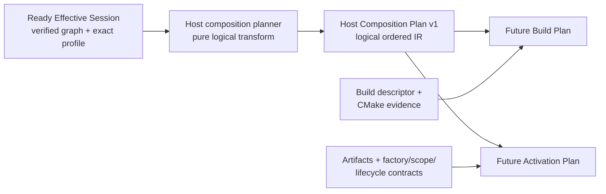

# ADR：Host Composition Plan v1

## 状态

Accepted and implemented for #275。本文冻结每宿主逻辑组合计划的架构、数据所有权、排序与失败合同；
`host-composition-plan-v1.schema.json`、`tools/host_package_composition.py` 和对应单元测试已经实现该合同。

本 planner 已在 #281 完成输入硬切：它只从 Ready `EffectiveSessionPlan` 读取 verified resolved graph、Project options 与
Distribution-owned exact Host Profile snapshot，不再接受独立的 raw Project/Profile 或 `LockedGraphVerificationResult`。
会话证据合同见 [Effective Session v1](adr-effective-session-v1.md)。

本文接续 [Locked Package Graph Verification & Reuse v1](adr-package-lock-verification-v1.md)、
[Project Manifest 与 Package Lock v2](adr-project-manifest-lock-v2-hard-cut.md) 与 [Host Profile v1](adr-host-profile-v1.md)：第一项证明 exact package
graph、stable source 和 payload 在本次检查边界仍可复用，Project Manifest 保存 package option overrides，Host Profile 则筛选逻辑
module/contribution identities。三者之间仍缺少一个可规范化、可解释、可供后继 build/activation adapters 消费的确定性 IR。

该 IR 命名为 **Host Composition Plan**，不是可执行 Activation Plan。当前没有 artifact、factory、scope、phase、lease、rollback
或 unload 合同，不能把 module DAG 的拓扑顺序伪装成系统启动顺序。

## 问题

现有 `select_host_profile_data()` 能稳定返回：

- 当前 `hostKind` 与 `targetPlatform`；
- 排序后的 exact package/module identities；
- 通过 Host Profile 过滤且 owner module 已选中的 contributions。

它刻意没有回答：

- resolved package graph 中 Feature Set 与 installable nodes 的依赖优先顺序；
- 已选 package-local module dependencies 的依赖优先顺序；
- 哪些 `entryModules` 在当前 Host selection 中实际可见；
- author defaults 与 Project Manifest overrides 合并后的 effective typed package options；
- 本次 plan 对应哪一份 normalized lock、Project Manifest 与 Host Profile；
- 如何把等价输入规范化为 byte-equivalent handoff。

这些信息足以形成逻辑 composition IR，但仍不足以构建或激活系统。build target、artifact、factory 和 runtime lifecycle 必须继续由
独立合同补齐。

## 资料验证与结论

本决策对照以下官方资料：

| 资料 | 官方行为 | 对 Asharia 的约束 |
| --- | --- | --- |
| [Cargo `metadata`](https://doc.rust-lang.org/cargo/commands/cargo-metadata.html) | `packages` 与 resolved dependency `nodes` 分开输出，resolved graph 表达 exact package relationships，不声明运行时生命周期 | exact package graph 可以成为 plan 输入证据，但不能自动升级为 activation semantics |
| [CMake File API codemodel](https://cmake.org/cmake/help/latest/manual/cmake-file-api.7.html) | codemodel 独立描述 buildsystem targets、target type 与 build dependencies | logical package/module 到 CMake target 的映射属于 Build Descriptor/Build Plan，不应复制进 Host Composition Plan |
| [Unreal Engine Modules](https://dev.epicgames.com/documentation/en-us/unreal-engine/unreal-engine-modules) | module type、platform/target filtering、loading phase 与 module dependency 是不同维度；同一 loading phase 内顺序并不天然确定 | `entryModules` 或 module DAG 本身不足以定义可执行启动顺序；phase/load contract 必须显式设计 |
| [O3DE Gem Module System](https://docs.o3de.org/docs/user-guide/programming/gems/overview/) | 实际 module load 需要已知 entry points、create/destroy 与 initialize/uninitialize lifecycle | 后继 Blueprint/Binding 必须绑定 factory/lifecycle 与 exact build evidence，不能只携带逻辑 ID |
| [O3DE System Components](https://docs.o3de.org/docs/user-guide/programming/components/system-components/) | system components 由 module 注册，并按 required services 约束 activation order | package/module dependency 与 runtime service dependency 是不同图，后者应由 Host Runtime 合同拥有 |

由此冻结四层而不是一个巨型计划：

1. **Host Composition Plan**：本 ADR；纯逻辑、backend-neutral、可确定重现；
2. **Build Plan**：消费 composition + build descriptor/CMake evidence，决定 targets、generation 与 products；
3. **Host Activation Blueprint**：构建前消费 composition + factory/scope/lifecycle contracts，生成 scope templates 与 factory order；
4. **[Host Executable Binding Receipt](adr-host-executable-binding-receipt-v1.md)**：构建后对证 Blueprint、registration snapshot、
   same-index configured target/compiler 与 exact staged Host artifact，供后继 Host Runtime 判断 artifact binding；它不证明 lifecycle 已执行。

## 决策

### 1. Planner 只消费成功的 verified graph

语义 API：

```text
planHostPackageComposition(
  readyEffectiveSession,
  validators
) -> HostCompositionPlanResult
```

Python 实现使用 snake_case 命名，但合同不依赖实现语言。`readyEffectiveSession` 必须：

- 是 composer 产生的 `EffectiveSessionPlan`，而不是失败 result；
- 携带 normalized Distribution、Project、Lock 与 selected candidates；
- 通过 graph、Project、Lock、candidate binding 与 Host Profile exact bytes fingerprints 复验；
- Host Profile path/kind/platform/integrity 仍与 Distribution inventory 唯一匹配。

planner 不接受彼此独立的 raw Distribution/Project/Lock/candidates/Profile 参数，避免调用方绕过 #274、#280 与 #281 的证据链。
它会通过 `validate_ready_effective_session()` 复验 nested snapshot 与 fingerprints；不重新求解版本、不枚举来源、不重新读取 payload，
也不写文件。

非 Ready result、unsupported/forged plan 或 nested mutation 返回空 plan 与稳定 diagnostics，不会触发 resolver fallback。



### 2. v1 是 versioned canonical logical IR

顶层 discriminator 冻结为：

```json
{
  "schema": "com.asharia.host-composition-plan",
  "schemaVersion": 1
}
```

成功模型包含：

```text
HostCompositionPlan
  schema, schemaVersion
  inputs
    engineApiVersion
    projectManifestIntegrity
    lockedGraphIntegrity
    hostProfileIntegrity
  host
    hostKind
    targetPlatform
    grantedCapabilities[]
  resolvedGraph
    directPackages[]
    directFeatureSets[]
    packages[]
  packages[]
  entries[]
  contributions[]
```

`lockedGraphIntegrity` 是 normalized lock bytes 的 `sha256`；`hostProfileIntegrity` 是 normalized Host Profile bytes 的 `sha256`。
两者沿用现有 `{ algorithm, digest }` 结构。它们用于 stale-plan 检测、缓存键和审计，不替代 lock 内每个 candidate 的
manifest/payload integrity。

`host.grantedCapabilities` 携带 normalized Host Profile 的 exact grants，使后继 Activation adapter 不必重新打开 profile 才能构造
factory context；当前 planner 只证明已选 module 的 requirements 是该集合的子集，不创建 capability token。

v1 renderer 使用固定 object field order、UTF-8 without BOM、LF、两空格缩进和结尾换行。生成 canonical bytes 不表示必须把 plan
提交到仓库；第一阶段允许它只作为内存 handoff、测试 golden 或调试输出。

### 3. `resolvedGraph` 保留完整 graph provenance

`resolvedGraph.directPackages` 与 `resolvedGraph.directFeatureSets` 复制 lock 中的 exact roots；`resolvedGraph.packages` 覆盖 lock 中每个
node，记录：

- exact `id`、`version` 与 `packageKind`；
- exact dependency references；
- dependency-first 的稳定 composition order。

它不复制 absolute payload path、CMake target、binary name 或 factory symbol。lock fingerprint 继续绑定 stable source 与 integrity
证据。

Feature Set 必须出现在 `resolvedGraph.packages` 中，证明用户 direct intent 如何展开成 exact graph；但 Feature Set 不出现在
`packages` 中，因为它没有可构建或可激活的 module。这样既保留 graph provenance，也不会把 meta-package 伪装成 runtime unit。

### 4. `packages` 覆盖全部 installable nodes

每个 `installable-capability` node 在 `packages` 中恰好出现一次，即使当前 Host Profile 没有选择其任何 module。空 module selection
表达“该完整 package 已锁定，但本 Host 不使用其内部逻辑单元”，而不是删除 package dependency 事实。

一个 package composition 记录：

- exact package reference；
- exact installable package dependency references；
- author defaults 与 Project Manifest overrides 合并后的 effective typed options；
- 当前 Host 选择的 modules，按 package-local dependency-first 顺序排列。

一个 module composition 记录：

- `moduleId`、`role` 与 `shippingClass`；
- 已经由 Host Profile 授权的 `requiredCapabilities`；
- 只引用同 package module 的 `dependsOn`。

package dependency 只表示完整能力的 locked dependency，不隐含跨 package module invocation edge。当前 manifest 没有声明跨 package
factory/service dependency，因此 planner 不猜测这张图。

### 5. Effective options 是自包含配置，不是选择开关

Package Lockfile v2 有意不复制 package options；effective values 必须由 pinned installable manifest defaults 与 normalized Project
Manifest overrides 唯一重建。planner 为每个 installable package 输出全部 declared options：

- `id`；
- declared `type`；
- declared `affects`；
- effective `value`。

当前 planner 从 Ready session 的 verified Lock v2 读取 `engine-distribution` nodes，但不会从 lock 读取发行 path/hash；这些
evidence 只属于 Engine Distribution，并已在 locked verification / Effective Session 阶段完成绑定。Host Composition Plan
不复制 Distribution，也不升级为第三个 lock。

没有 override 时使用 author default；有 override 时使用已经通过 cross-document validator 的 exact typed value。options 按 local ID
UTF-8 bytes 排序。Feature Set 不声明 options。

options 不参与 module fragment selection、package dependency resolution 或 Host policy；它们只是供后继 Build/Activation adapter 消费的
typed configuration。planner 不复制 enum allowed values、min/max 等 author validation metadata，因为 candidate manifest digest 已固定
这些约束。

### 6. 排序是 composition order，不是 activation order

稳定顺序规则：

1. `directPackages` 与 `directFeatureSets` 分别按 `(id, version, packageKind)` 的 UTF-8 bytes 排序；
2. 对全部 locked nodes 做 dependency-first topological order；independent ready nodes 按
   `(id, version, packageKind)` 的 UTF-8 bytes 打破平局；
3. `packages` 从该顺序过滤 installable nodes，保持相对顺序；
4. 每个 package 对 selected module subgraph 做 dependency-first topological order；ready modules 按 local `moduleId` UTF-8 bytes
   打破平局；
5. `entries` 按固定维度 `runtime -> authoring -> cook -> diagnostics`，再按 exact package/module reference 排序；
6. `contributions` 按 package order、owner module order、contribution ID 排序。

verified lock 与 author manifest validators 已拒绝 package/module cycle；planner 仍必须在自身边界 fail closed，不能在人工构造的
inconsistent result 上输出 partial order。

这里的 dependency-first 顺序只为 deterministic transform、diff 与后继 adapter 提供稳定输入。真正 activation order 还要合并
factory dependencies、scope、phase、service availability 与 rollback constraints，不能直接复用本顺序执行系统代码。

### 7. `entryModules` 只变成具名入口引用

planner 从每个 pinned installable manifest 读取 `entryModules`，只保留 owner module 已被 Host Profile 选择的引用。输出记录：

- entry dimension；
- exact package ID/version；
- local module ID。

entry 不成为新的 selection root；Host Profile 的 required roles、dependency closure 与 compatible contributions 仍是唯一选择语义。
未被当前 Host 选择的 entry 被省略，不构成错误。

v1 不把 entry dimension 映射为 `PreDefault`、`Startup`、`ProjectReady` 或任意生命周期 phase，也不把同一 dimension 中的数组位置
解释为调用顺序。

### 8. Contributions 必须保持 owner closure

planner 复用 Host Profile 投影后的 contribution selection，并为每项记录：

- exact package ID/version；
- contribution ID 与 kind；
- owner module ID。

每个 owner module 必须存在于同一 package 的 selected module plan 中；否则整个 plan 失败。planner 不创建 registry handle、factory、
callback 或 service instance。contribution kind 仍是声明性 identity，具体 registry contract 属于 Host Runtime。

### 9. 结果原子、输入只读、诊断稳定

```text
HostCompositionPlanResult
  plan: HostCompositionPlan | None
  diagnostics: stable tuple<Diagnostic>
  succeeded: bool
```

不变量：

- 成功：`plan` 非空，`diagnostics` 为空；
- 失败：`plan` 为空，`diagnostics` 非空；
- 不返回 partial packages/modules/entries/contributions；
- 不修改 verified lock、selected candidates、author manifests、Project Manifest 或 Host Profile；
- candidate iterable 与 Project/Profile 中语义无序数组的排列不改变 plan 或 diagnostic bytes；
- diagnostics 使用现有稳定 sort key，且不包含 adapter-local absolute paths。

实现模型使用 frozen records 与 tuples；canonical renderer 只读取这些 value objects，不向调用方暴露可变的内部工作集合。
作者清单本身由 lock 绑定 exact bytes；修改或重排其内部数组会改变 manifest evidence，是新的输入版本，不属于本条确定性承诺。

Host Profile schema/semantic、closure 与 capability 错误继续使用 `host.*` 权威 diagnostics；lock/candidate invariant 继续复用 `lock.*`。
只有 composition 边界新增 `plan.input.*`、`plan.graph.*`、`plan.entry.*` 与 `plan.contribution.*`。

### 10. Planner 不扩大 TOCTOU 承诺

#274 证明的是 verification 时刻的 mutable source roots。Effective Session composer 在派生时执行 locked verification；
Host Composition Plan 只读取其 deep-copied verified in-memory snapshot，不读取 binary、source tree 或构建产物。

plan fingerprint 使消费者能证明它对应哪份 normalized lock/project/profile，但不能保证未来 local root 永不变化。后续 Build/Activation adapter
必须消费不可变 acquired artifacts，或在真正读取 mutable root 前刷新 integrity verification。planner 不因存在 fingerprint 而声称
artifact 已安全可执行。

## 拒绝的替代方案

### 直接把 `HostProjection` 改名为 Activation Plan

拒绝。现有 projection 没有依赖顺序、entry labels、input fingerprints，更没有 artifact/factory/scope/lifecycle 信息。

### 现在生成可执行 Activation Plan

拒绝。Unreal 与 O3DE 的官方 module lifecycle 都要求独立 loading phase/entry point/create-destroy/service dependency 语义；当前仓库尚未
冻结这些合同。

### 先把 CMake targets 填进同一个 plan

拒绝。CMake codemodel 是 build graph 权威，而 installable manifest 是可移植能力权威。target mapping 应由独立
`asharia.package.build.json` 与 Build Plan adapter 对证，不能污染 backend-neutral composition IR。

### 只输出一个全局 module 列表

拒绝。它会丢失完整 package dependency、Feature Set provenance、zero-selection installable packages、package-local edges 与 entry owner。

### 把 package order 当作跨 package module order

拒绝。完整 package dependency 不等于 factory/service dependency。没有显式跨 package activation edge 时，任何运行顺序都是实现偶然。

### 在同一 Slice 加入 update/apply 或 Host Runtime

拒绝。lock update/apply 需要用户授权与 filesystem transaction；Host Runtime 需要 scope、factory、lease、rollback 与 lifecycle state。
两者都不属于纯 plan transform。

## 非目标

- 不实现 catalog/index、registry/download、candidate discovery 或 dependency resolution；
- 不实现 lock update policy、Project/lock writer、journal、rollback 或跨文件 apply；
- 不定义 build descriptor、artifact manifest、CMake target mapping、cook/staging 或 content roots 产品；
- 不定义 factory symbol、scope、thread affinity、activation phase、instance key、lease、rollback 或 unload；
- 不执行 module/contribution，不创建 Host Runtime、registry 或 system instance；
- 不实现 native hot load/unload、Editor Package Manager UI 或 production plan files；
- 不调整 CMake presets、clang-tidy、PCH、unity build 或 compiler cache。

## #275 实现切片

#275 保持为一个 PR-sized、Python/contract-first Slice，并已实现：

1. 新增 versioned Host Composition Plan models 与 canonical renderer；
2. 最初实现接受 successful `LockedGraphVerificationResult`、matching Project Manifest 与 Host Profile；#281 已将该入口硬切为
   Ready `EffectiveSessionPlan`，未保留 adapter；
3. 复用 Project option validation 与 Host Profile selection，补充 effective options、package/module topological order、entry 与 provenance；
4. 增加 stale Project、default/override options、forged/incomplete input、cycle、owner mismatch、atomicity、immutability、permutation 与
   no-resolver/no-write tests；
5. synthetic handoff 已扩展为 Discovery -> Resolve -> Effective Session -> Host Composition Plan；
6. 同步 package-first、Foundation/roadmap 状态与文档索引。

开发阶段优先运行受影响的 Python/contract tests，避免每次文档或纯 Python 小改都触发无收益的 native rebuild；Slice 收口时仍按
AGENTS.md 执行完整编码、文档、拓扑和 Conan-before-CMake 双编译器门禁。

## 后继边界

#275 完成后，按真实依赖分别设计：

1. [Source Build Plan v1](adr-source-build-plan-v1.md)：#276 已实现 logical module 到 source boundaries、真实 CMake build roots 与 configured codemodel evidence 的独立合同和 pure planner；它不拥有 artifacts 或 generation commands；
2. [Package Factory / Scope / Lifecycle Declaration v1](adr-package-factory-scope-lifecycle-v1.md)：#284 已实现
   logical factory、owner scope、required factory、contribution ownership 与 verified candidate handoff；它仍不生成可执行顺序；
3. Host Runtime：消费可执行 plan，拥有 instance、contribution handles、lease、rollback 与 shutdown。

Host Composition Plan 可以成为三者的共同逻辑输入，但不会替代其中任何一层权威。

## 相关资料

- [Host Profile v1](adr-host-profile-v1.md)
- [Source Build Plan v1](adr-source-build-plan-v1.md)
- [Locked Package Graph Verification & Reuse v1](adr-package-lock-verification-v1.md)
- [Installable Package Manifest v2](adr-installable-package-manifest-v2.md)
- [Package Candidate 与 Lockfile v1](adr-package-candidate-lockfile-v1.md)
- [Package-first 架构](package-first.md)
- [Foundation Framework](foundation-framework.md)
- GitHub #264、#271、#274、#275 与 #276
