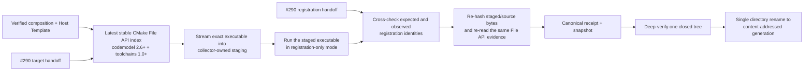

# ADR：Host Executable Binding Receipt v1

## 状态

Accepted and implemented for #288。本 ADR 冻结构建后的 `Host Executable Binding Receipt v1`：它把已经验证的
static-composition/Host Template、同一份 CMake File API reply 中的 final target 与 configured CXX compiler、
collector-owned staged executable bytes，以及该 staged executable 实际输出的 registration snapshot 绑定为一个
content-addressed generation。

Receipt 的 schemaVersion 仍为 1，不代表保留旧 Host 生成兼容。#295 当前硬切实现下，collector、binding assembly 与 deep verifier 只接受
Template renderer 2 + Composition renderer 5/provider v4 + RegistrationSnapshot v2；pre-current bindings/renderer/provider/snapshot
没有 reader、adapter 或只读验证路径。Receipt v1 只绑定 snapshot bytes/path/hash，因此 provider/runtime-binding hard cut 不要求机械
提升 Receipt。[Static Contribution Payload Accessors v1](adr-static-contribution-payload-accessors-v1.md) 的 accessor/type key 仍是
process-local private evidence，不进入 receipt。

名称刻意不使用 `Activation Receipt`。该 receipt 证明“这些构建输入、target 语义、可执行文件 bytes 与注册 identity
彼此一致”，不证明任何 factory instance 已创建，也不证明 Host 已完成 activation、进入 `Ready` 或正在当前进程中加载。

## 问题

#287、#289 与 #290 已分别提供：

- immutable static-composition generation；
- identity-only owning registration snapshot；
- immutable Windows Development Host Template、exact-target build 与 latest CMake File API target/path handoff。

这些证据仍存在三条断点：

1. CMake File API 描述配置后的 target、artifact path 与 toolchain 语义，但不证明该路径上某一时刻的 exact bytes；
2. build tree 是可变工作区，若直接执行或发布其中的 `.exe`，构建后重写会让 target handoff、snapshot 与 hash 指向不同对象；
3. registration snapshot 证明 generated provider calls 观察到了哪些 identity，不证明输出它的 executable 就是将被保存的 bytes。

因此需要一个独立的 post-build 边界，把“构建系统认为的 target”“被实际执行的 bytes”“观察到的注册 identity”与
“最终发布的 bytes”交叉对证，同时不把 artifact evidence 扩张成 lifecycle 或供应链信任声明。

## 决策摘要



发布路径固定为：

```text
<publication-root>/generations/<bindingGenerationId>/
├── asharia.host-executable-binding-receipt.json
├── host/<nameOnDisk>
└── evidence/asharia.static-factory-registration-snapshot.json
```

generation 是 closed tree。任何额外文件、目录、link/reparse、receipt/snapshot/executable 漂移，都会使首次发布、并发复用或
后续 deep verification fail closed。

## 1. 输入权威与所有权

| 输入或输出 | 权威 owner | 本 receipt 只消费或证明什么 |
| --- | --- | --- |
| Static Composition generation | #287 generator/publisher | generation ID、manifest integrity、expected provider/factory mappings 与 build identity |
| Windows Development Host Template generation | #290 template generator/publisher | exact composition binding、final target name 与 Host identity |
| CMake target/compiler evidence | latest stable File API client reply | configuration、generator、唯一 `EXECUTABLE` target、`nameOnDisk`、build-root-relative artifact path 与 configured CXX identity |
| RegistrationSnapshot handoff | #290 restricted verification | caller 观察到的 canonical identity snapshot；publication 必须用 staged bytes 再观察并完全匹配 |
| Host artifact | #288 collector | 从 exact File API path 流式复制出的 staged bytes、size 与 SHA-256 |
| Receipt generation | #288 assembler/publisher | 上述证据的 canonical cross binding 与 content identity |

resolver、Project Lock、Effective Session 和 Host Activation Blueprint 不读取 build tree，也不发布该 receipt。#288 不重新选择
package、module、factory 或 activation order；它只验证 upstream 已作出的选择是否在一个 exact executable generation 中一致体现。

## 2. CMake semantic evidence 与 artifact bytes 分离

query 同时请求：

- codemodel object `2.6`；
- toolchains object `1.0`。

binder 只接受同一个 stable latest reply index 中的 target、generator 与 configured CXX compiler。target 必须是 exact
configuration 下唯一同名 `EXECUTABLE`，primary artifact 必须以 exact `nameOnDisk` 结尾并保持在 caller-owned build root 内。
compiler evidence 记录 `language == CXX`、compiler ID、compiler version 与可选 target triple，不记录机器本地 compiler path。

File API evidence 和 byte evidence 是两个字段组：

- `target` 回答“CMake 配置出的哪个 target 应产生哪个相对路径”；
- `artifact` 回答“collector 实际保存的文件是什么 size/SHA-256 bytes”。

两者必须交叉匹配，但不能互相替代。publication 在 staging 前和 receipt 组装前各读取一次 configured target bundle；若 reply
index、target、generator 或 compiler 发生变化，则本次 publication 失败，不把两个 configure generation 混成一份 receipt。

## 3. staged executable 是验证与发布对象

collector 不把 mutable build-tree executable 直接当作 generation payload。它必须：

1. 从 File API 的 exact build-root-relative artifact path 定位 source；
2. 拒绝不同路径上仅 basename 相同的文件；
3. 拒绝交叠的 build/staging roots，以及路径组件中的 link/reparse 或非普通文件；
4. 以固定大小 chunk 流式复制到 `host/<nameOnDisk>`；
5. 对 source 与 staged file 做 before/open/after 状态检查，并独立计算 size/SHA-256；
6. 运行 staged file，而不是再次运行 build-tree file；
7. 在进程退出后重新验证 staged bytes，并确认 source 未从已收集 evidence 漂移。

因此 snapshot 与 receipt 中的 `artifact` 指向同一份 collector-owned bytes。build tree 只保留 source handoff 身份，不成为最终
generation 的运行或复用依据。

## 4. registration cross binding

staged Host 仍只接受 `--asharia-verify-static-registration`。成功结果必须满足 #290 的 stdout/stderr/exit、maximum bytes、
canonical JSON、expected composition generation 与 Blueprint digest 合同。

#288 再把 composition 中预期的 owning registration 与 observed snapshot 按以下 identity 交叉对证：

```text
(packageId, packageVersion, moduleId, factoryId) -> providerEntryPoint
```

duplicate、missing、extra 或 provider mismatch 都失败。比较使用 canonical identity order；该顺序只服务确定性证据，不是
Blueprint dependency order，更不是 runtime create/activate order。

## 5. Receipt v1

`asharia.host-executable-binding-receipt.json` 是 closed canonical JSON，至少包含：

- static-composition generation ID/manifest integrity；
- Host Template generation ID/manifest integrity；
- Host Activation Blueprint integrity；
- Engine generation、Host kind 与 target platform；
- configuration、CMake generator 与 configured CXX compiler identity；
- target name/type、`nameOnDisk`、build artifact relative path 与 File API object versions；
- published executable relative path、media type、size 与 SHA-256；
- published registration snapshot relative path、media type、size 与 SHA-256；
- content-derived `bindingGenerationId` 与 receipt self-integrity。

`bindingGenerationId` 由除 generation ID/self-integrity 外的全部 canonical descriptor 字段计算；receipt integrity 再覆盖带有
generation ID 的完整 canonical payload。absolute paths、timestamp、PID、invocation ID 与 machine-local compiler path 不进入
identity。

在同一 compiler identity 下，相同完整输入证据（包括 executable/snapshot exact bytes）必须生成字节等价 receipt；重复发布时
只能在 deep verification 成功后复用已有 generation。MSVC 与 ClangCL 的 compiler evidence 和 executable bytes 可以不同，因而
允许得到不同 generation。该规则是 receipt 的确定性，不承诺编译器在两次构建中产生 bit-reproducible executable；若 compiler
对相同 source 产生不同 bytes，receipt identity 应当随之改变。

## 6. 原子发布与只读 deep verification

publisher 只在 collector-owned temporary generation 中写入 exact executable、snapshot 与 receipt。commit 前 verifier 必须：

- strict parse canonical receipt，并复算 generation ID/self-integrity；
- 对证 caller 提供的完整 composition/Template generation；
- 要求 generation 目录名等于 `bindingGenerationId`；
- 要求目录布局与 receipt 的三个 exact files 完全一致；
- strict parse canonical snapshot，并重新执行 registration cross binding；
- 流式复算 executable/snapshot size 与 SHA-256。

通过后只执行一次 directory rename。若目标 generation 已存在，或 rename race 中由另一 publisher 先提交，只能 deep-verify
现有 tree 后返回 reuse；不能覆盖、合并或仅凭目录名/receipt 自报 identity 复用。失败清理只作用于本次拥有的 temporary tree。

deep verifier 是 read-only evidence verifier，不执行 Host、不修复 build tree，也不把健康 receipt 解释为某个进程已经加载该
generation。

## 7. lifecycle、session 与 trust 边界

该 receipt 证明：

- upstream immutable generation、CMake configured target/compiler 与 exact staged bytes 一致；
- staged bytes 在受限模式下输出了与 composition 完全一致的 registration identities；
- published closed tree 在验证时仍与 receipt 一致。

它不证明：

- factory callback 可用，或 create/activate/quiesce/deactivate/destroy 成功；
- scope、dependency order、rollback、shutdown、`Ready` 或当前进程加载状态；
- C++ ABI 稳定、DLL 可热卸载或跨 Engine generation 兼容；
- compiler、linker、CMake、Host verification code 或本地 publisher 没有被攻陷；
- artifact signing、builder identity、remote attestation 或任一 SLSA Build Level。

Windows `CreateFileW` 文档明确区分是否使用 `FILE_FLAG_OPEN_REPARSE_POINT` 时的 symbolic-link 跟随行为。因此，仅校验路径文本
不能建立 object identity。v1 通过逐组件 link/reparse rejection、普通文件检查、流式 hash 和 before/during/after fingerprint
降低协作式本地构建中的 TOCTOU 风险；但它没有建立 handle-relative directory walk、受保护 builder、签名或对抗恶意并发写者的
security boundary。拥有足够本机权限的进程仍可在验证后篡改未受保护的发布树。

SLSA v1.2 将 build provenance 定义为带 builder/build definition/inputs/subjects 的 attestation，并要求消费者结合签名、
builder identity 与 roots of trust 做验证。当前 receipt 没有这些字段和信任设施，因此只能称为 Asharia 本地 artifact binding
evidence，不能宣称兼容 SLSA provenance 或达到某个 SLSA level。未来若引入 CI signing，应新增外层 attestation，不改变 v1
receipt 对本地 exact bytes 的语义。

## 8. 拒绝的替代方案

### 只保存 CMake artifact path

拒绝。path 是配置/生成语义，不是 bytes identity；build tree 可在观察后被重写。

### hash build-tree executable，再直接运行它

拒绝。hash 与 spawn 之间仍可能切换 bytes，且运行结果未必对应最终保存对象。v1 先复制到 owned staging，再对 staged bytes
执行、复验和发布。

### 沿用 Activation Binding Receipt 名称

拒绝。registration-only process 不创建 instance，也不执行 lifecycle。名称会让 Bootstrap/Session 错把 artifact evidence 当作
`Ready` 证据。

### 现在直接采用通用 SLSA provenance

拒绝。当前本地开发 publisher 没有可信 builder identity、签名与 roots of trust。伪装成 SLSA 会扩大错误安全承诺；v1 保留
可被未来外层 attestation 引用的 content digest 即可。

## 官方依据

- [CMake 3.28 File API](https://cmake.org/cmake/help/v3.28/manual/cmake-file-api.7.html)：client 必须先读 reply index 并跟随
  `jsonFile`；lexicographically greatest index 是当前 reply，旧 reply 在并发 regenerate 后可能消失；codemodel 与 toolchains
  是独立 versioned object kinds。
- [SLSA v1.2 Build Provenance](https://slsa.dev/spec/v1.2/build-provenance)：provenance 把 build definition、builder 与 artifact
  subjects 组成 attestation，builder identity 界定其 trust base。
- [SLSA v1.2 Verifying Artifacts](https://slsa.dev/spec/v1.2/verifying-artifacts)：可信验证还需要 subject digest、签名、
  signer-builder expectation 与 roots of trust；本 receipt 不提供这些保证。
- [Microsoft `CreateFileW`](https://learn.microsoft.com/en-us/windows/win32/api/fileapi/nf-fileapi-createfilew)：
  `FILE_FLAG_OPEN_REPARSE_POINT` 决定打开 symbolic link 自身还是跟随 target，说明 pathname 与 opened object 不是天然同一证据。

## 验证要求

- receipt schema/codec 的 closed shape、canonical bytes、content-derived ID 与 self-integrity positive/negative tests；
- CMake codemodel `2.6+` + toolchains `1.0+` same-index target/compiler tests，以及 regenerate/drift negatives；
- multi-chunk artifact copy、same-basename wrong path、link/reparse、source/staged drift 与 partial cleanup tests；
- expected/observed registration duplicate/missing/extra/provider mismatch tests；
- closed-tree atomic publish/reuse、receipt/snapshot/executable tamper、extra entry 与 generation-name mismatch tests；
- MSVC 19.44.35215.0 与 Clang 19.1.5 exact Host integration：构建、运行 staged Host、发布 receipt 并 deep verify；
- full Python contracts/topology/encoding/doc-sync/diff gates 与 Conan-before-CMake 双编译器 builds/tests。

## 后续

1. [Static Factory Callback Table v1](adr-static-factory-callback-table-v1.md)：#291 已绑定 current-process typed callbacks；table
   与 receipt 都不单独授权调用；
2. [Activation Eligibility v1](adr-activation-eligibility-v1.md) 只接受 deep verifier 的 constructor-restricted receipt/snapshot
   projection；raw receipt JSON、generation directory 或自报 digest 都不能 mint admission。它先对证 Session/Blueprint/binding 与 sealed
   launch handoff，允许一次 provider recording；随后再对证同一 table instance/snapshot，才允许后续 Host Runtime lifecycle；
3. Bootstrap/Session adapter 把 missing/stale/verified receipt 与 runtime outcome 映射为 `PendingBuild`、`PendingRestart`、`Ready` 或
   `SafeMode`；
4. signing、trusted builder identity 与 SLSA-compatible outer attestation 仅在 release/CI threat model 明确后单独设计。
