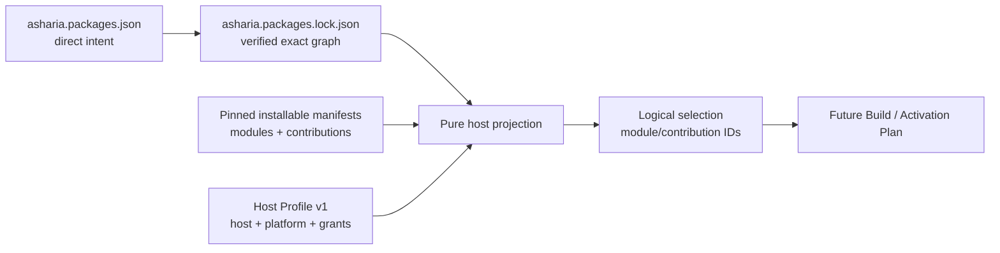

# ADR：Host Profile v1

## 状态

Proposed。本文冻结 `Minimal`、`Editor`、`Runtime`、`DedicatedServer` 与 `AssetWorker` 五个 Host Profile 的第一版
机器可读策略，以及 verified lock graph 到逻辑 module/contribution selection 的确定性投影。当前仓库已经实现 schema、语义校验、
normalized writer、纯数据投影器与 synthetic fixtures；仍不生成 Build Plan 或 Activation Plan，也不创建 Host、module、service
或 contribution runtime instance。

本文接续 [Package Candidate 与 Lockfile v1](adr-package-candidate-lockfile-v1.md)：lock 固定与 Host 无关的 exact package graph，
Host Profile 再从 pinned installable manifests 中选择当前进程允许使用的内部逻辑单元。两者不得合并为 per-host lockfile。

## 意图

同一份 verified `asharia.packages.lock.json` 必须能被 Editor、shipping Runtime、Dedicated Server、asset worker 和最小
headless process 复用，同时满足：

- Runtime/Server 不携带 Editor、tool、cook 或 development-only closure；
- AssetWorker 不自动激活 world/frame runtime modules，但允许 tool/cook module 显式依赖窄 runtime support；
- Minimal 只看到 manifest 明确允许给最小宿主的 contract modules；
- Integration Package 可以仅通过 compatible contribution 让 owner module 进入选择结果；
- module dependency 被 profile 过滤后不能留下半闭合结果；
- package 声明的 execution capability 未被 Host 明确授予时 fail closed；
- 输入顺序不影响输出顺序或 diagnostics。

Host Profile 不决定安装哪些 packages。Project Manifest、Feature Set 与 resolver 决定完整 package graph；profile 只过滤已锁定包
内部的 logical modules/contributions。

## 当前约束

- installable manifest v2 已冻结 `role`、`dependsOn`、`hostKinds`、`platforms`、`shippingClass`、
  `requiredCapabilities` 与 contribution owner。
- lock v1 每个 package identity 只有一个 exact version，并以 manifest/payload integrity 固定 author bytes。
- 当前没有 build descriptor、artifact manifest、target mapping、factory contract、lifecycle phases 或 contribution registry。
- capability provider resolution 明确不在 #270 范围内；Host grants 是权限输入，不是 package dependency 的替代品。
- `contentRoots` 的 build/cook/staging 选择需要 Build/Cook Plan 的 artifact 语义，本 Slice 不猜测其输出形态。

## 决策

### 1. Host Profile 是 lock 的独立调用输入



顶层 discriminator 固定为：

```json
{
  "schema": "com.asharia.host-profile",
  "schemaVersion": 1
}
```

Host Profile v1 包含：

| 字段 | 语义 |
| --- | --- |
| `hostKind` | 五个标准宿主之一 |
| `targetPlatform` | 当前 invocation 的单一 namespaced platform ID |
| `requiredRoles` | 对当前 host/platform 适用时自动成为选择根的 module roles |
| `allowedRoles` | 允许出现在 dependency/contribution closure 中的 module roles |
| `allowedShippingClasses` | 允许进入该进程结果的 shipping classes |
| `contributionFilter.mode` | `deny-all` 或 `allow-compatible` |
| `grantedCapabilities` | Host 明确授予的 exact namespaced capability IDs |

profile 不保存 package IDs、Feature Sets、version constraints、source、integrity、CMake target 或 binary path。五个 `hostKind`
本身就是 v1 policy identity，因此不再增加可漂移的 display name 或自由 profile ID。

### 2. 五个标准策略是封闭合同

`requiredRoles` 是选择根；`allowedRoles` 是闭包上限。required 必须是 allowed 的子集。v1 validator 要求以下集合与
`hostKind` 精确一致，不能把 `Runtime` profile 修改成允许 `editor` role 后仍声称它是标准 Runtime：

| Host | Required roles | Allowed roles | Allowed shipping | Contributions |
| --- | --- | --- | --- | --- |
| `minimal` | `contract` | `contract` | `runtime` | `deny-all` |
| `editor` | `contract`, `runtime`, `implementation`, `editor`, `diagnostics`, `content` | 全部八种 roles | `runtime`, `editor`, `tool`, `development-only` | `allow-compatible` |
| `runtime` | `contract`, `runtime`, `implementation`, `content` | `contract`, `runtime`, `implementation`, `diagnostics`, `content` | `runtime` | `allow-compatible` |
| `dedicated-server` | `contract`, `runtime`, `implementation`, `content` | `contract`, `runtime`, `implementation`, `diagnostics`, `content` | `runtime` | `allow-compatible` |
| `asset-worker` | `contract`, `tool`, `cook`, `diagnostics`, `content` | 除 `editor` 外的全部 roles | `runtime`, `tool`, `development-only` | `allow-compatible` |

Editor 不把所有 `tool/cook` modules 自动作为 roots；它们只有在被已选 module 依赖或拥有 compatible contribution 时进入结果。
这保留 Editor 与 AssetWorker 的进程边界，同时允许确实设计为 in-process 的工具 contribution。AssetWorker 不把全部
`runtime/implementation` modules 作为 roots；tool/cook closure 可以显式带入支持模块，但不能带入 `editor` role/class。

未来若需要 Client、Commandlet、CookCoordinator 或自定义 policy，应新增受版本控制的 profile kind/schema，而不是在 v1
用自由 role/shipping 数组冒充标准宿主。

### 3. host/platform applicability 先于 role policy

module 对当前 invocation 适用，当且仅当：

1. `profile.hostKind` 出现在 `module.hostKinds`；
2. `module.platforms` 包含 `com.asharia.platform.any` 或 exact `profile.targetPlatform`。

不适用的顶层 module 被确定性过滤，不构成错误；一个 package 可以在同一 manifest 中发布多个 host/platform variants。
但如果已选择 module 的 `dependsOn` 指向对当前 host/platform 不适用的 module，闭包不完整，必须报告
`host.module.host-closure` 或 `host.module.platform-closure`，不能悄悄删边。

`com.asharia.platform.any` 仍只存在于 package module 声明；Host Profile 的 `targetPlatform` 必须是具体平台，避免用
“any Host”绕过 platform mismatch 验证。

### 4. 选择算法只有 roots、closure 与稳定排序

对 lock 中每个 exact `installable-capability` node：

1. 找到 exact ID/version/kind 匹配且已通过 schema/semantic validation 的 pinned manifest；
2. 将对 host/platform 适用且 `role` 位于 `requiredRoles` 的 modules 加入 roots；
3. 当 contribution mode 为 `allow-compatible` 时，只保留 host、owner module platform、owner role 与 shipping class 都兼容的
   contributions，并把 owner module 加入 roots；
4. 从 roots 沿 package-local `dependsOn` 递归求完整闭包；
5. 对 root/closure module 检查 allowed role、allowed shipping class 与 capability grants；任何失败都拒绝整个投影；
6. 结果按 package ID、package version、local module/contribution ID 排序并冻结为不可变 tuples。

Feature Set nodes 参与 lock reachability，但没有 runtime modules，因此投影器跳过其 author payload。跨 package named dependency 已由
verified lock 固定；Host 投影不重新求解版本，也不做 capability provider resolution。

`entryModules` 继续描述未来 activation lifecycle 的逻辑入口；v1 Host selection 以 required role 作为完整 package 内部选择规则，
不在没有 lifecycle/phase 合同的情况下猜测 entry invocation 顺序。

### 5. Contribution filter 不能绕过 owner module

`deny-all` 产生空 contribution selection，且 contribution 不会反向选择 owner module。`allow-compatible` 依次检查：

- contribution `hostKinds` 包含当前 host；
- contribution/owner 的 `shippingClass` 受 profile 允许；
- owner module 对当前 target platform 适用；
- owner role 受 profile 允许。

通过后 owner module 成为 root，并接受与其他 roots 相同的 dependency/capability closure 验证。contribution 不能独立于 owner module
进入结果；被过滤的 contribution 也不能留下仅因它而激活的 owner。

v1 不加入自由 glob、kind prefix 或 arbitrary expression language。出现真实“某 Host 只接受某组 contribution kinds”的需求后，
应以 schema upgrade 增加 typed filter，而不是让不同调用方解释字符串表达式。

### 6. Capability grants 是 exact allowlist

`grantedCapabilities` 使用与 package `requiredCapabilities` 相同的 namespaced identity grammar。进入 roots/closure 的 module 所有
required capabilities 都必须在 grants 中；否则报告 `host.module.capability-denied`。

grant 只说明当前 Host 愿意把对应窄 token/facade 交给未来 factory context：

- 不证明某个 package 提供 capability；
- 不创建 service 或全局 locator；
- 不授权 OS handle、绝对路径、credential 或 unrestricted process access；
- 不替代完整 package dependency。

capability vocabulary、token enforcement 与 owner facade 属于 Foundation/Host Runtime 后续 Slice。v1 先冻结 fail-closed 数据流。

### 7. Shipping/editor closure 必须显式失败

installable manifest validator 已拒绝一般性的 `runtime -> editor/tool/development-only` shipping dependency。Host 投影还必须拒绝
对某个 profile 才非法的闭包，例如 AssetWorker 的 selected development diagnostics module 依赖 editor module：作者层允许
development-only module 依赖 editor，但 AssetWorker policy 明确不允许 `editor` role/class。

对 selected root/dependency 至少产生以下稳定 diagnostics：

- `host.module.role-closure`；
- `host.module.shipping-closure`；
- `host.module.host-closure`；
- `host.module.platform-closure`；
- `host.module.capability-denied`。

有任一 diagnostic 时不返回部分 selection。调用方不能把“能选出一半”误当作可执行 plan。

### 8. 输出不是 Activation Plan

成功输出只包含：

- `hostKind` 与 `targetPlatform`；
- 排序后的 `(packageId, packageVersion, moduleId)`；
- 排序后的 `(packageId, packageVersion, contributionId, kind, ownerModuleId)`。

它没有 dependency order、load phase、factory symbol、artifact path、thread affinity、scope、instance key、rollback step 或 lifecycle state。
这些字段必须等待 build descriptor、artifact manifest、factory/contribution contract 与 Host Runtime 设计后进入独立 Build/Activation Plan。

### 9. Normalized writer 不赋予输入数组顺序语义

normalized profile 使用固定 object field order；roles/shipping classes 按 schema vocabulary 顺序，capability IDs 按字典序；UTF-8
without BOM、LF、两空格缩进和结尾换行。semantic validator 比较集合而不是输入数组位置，因此等价 profile 的 normalized bytes
一致。

Host selection 同样不修改 lock、profile 或 author manifest 输入。diagnostics 与成功 tuples 都使用稳定排序。

## 拒绝的替代方案

### 为每个 Host 写一份 lockfile

拒绝。package resolution 与 Host module selection 会混合，Editor/Runtime/Server 无法证明使用同一 exact package graph，版本升级也会
产生多份漂移证据。

### 只按 `hostKinds` 过滤 modules

拒绝。它无法阻止 Runtime 带入 editor shipping dependency，也不能表达 Minimal/AssetWorker 对 roles、contributions 与 capability grants
的更窄政策。

### 过滤 dependency 后继续返回部分结果

拒绝。owner module 的行为依赖完整 local DAG；删掉不兼容边会把 manifest 声明的前置条件变成隐式 optional dependency。

### 在 profile 中列出 package/module IDs

拒绝。用户 package 选择属于 Project Manifest；package 内部 identity 属于 pinned author manifest。profile 复制这些列表会在 package
升级后产生第二份手工清单，并重新暴露内部 fragment selection。

### 现在生成 activation/load order

拒绝。当前没有 factory、phase、scope、artifact 或 rollback 合同；把 module DAG 拓扑序命名为 Activation Plan 会制造无法执行的
伪合同。

## 非目标

- 不实现 resolver、candidate discovery、download、registry 或 lock update；
- 不实现 build descriptor、artifact manifest、CMake/native link composition 或 content staging；
- 不实现 Activation Plan、activation executor、Host Runtime、factory registry、service instance 或 contribution registry；
- 不定义 hot load/unload、safe point、rollback 或 process restart；
- 不实现 capability provider resolution、OS sandbox、signature/trust 或 credential policy；
- 不创建生产 package manifests、Feature Sets、project lock 或 host profile files。

## 实现与验证基线

- Draft 2020-12 `host-profile-v1.schema.json`，并把 host/platform/role/shipping vocabulary 复用为 package-runtime common defs；
- discriminator dispatcher、标准 policy semantic validator 与 normalized writer；
- 纯数据 Host projection API 和不可变 selection records；
- 五个 positive profile fixtures 与一个覆盖全部 roles/contribution paths 的 synthetic installable manifest；
- negative tests：policy drift、platform/host dependency mismatch、role/shipping editor closure、denied capability、missing/mismatched pinned
  manifest；
- determinism tests：profile input order、manifest/module/contribution input order不改变 normalized bytes 或 selection tuples；
- package contracts、topology、encoding、doc-sync、whitespace 与当前 AGENTS.md 双编译器门禁。

## 依据

- [Unreal Engine Modules](https://dev.epicgames.com/documentation/en-us/unreal-engine/unreal-engine-modules) 将 Runtime、Editor 等
  module types 与 Game/Server/Editor/Program targets、platform lists 和 Shipping/Development configurations分开；本文保留 role、
  host、platform、shipping 四个正交维度，不复制 UBT 文件格式。
- [Unreal Engine Plugins](https://dev.epicgames.com/documentation/en-us/unreal-engine/plugins-in-unreal-engine) 允许一个完整 plugin 同时交付
  Runtime、Editor 与 Developer modules，并由应用类型过滤；这支持“完整 package 安装、内部 module 按 Host 选择”。
- [O3DE Gem Module System](https://docs.o3de.org/docs/user-guide/programming/gems/overview/) 让同一 Gem modules 服务 Editor、runtime
  与 dedicated server，并把实际加载交给 application/module manager；本文同样把 package identity 与 Host selection 分开。
- [Unity Dedicated Server build](https://docs.unity3d.com/cn/current/Manual/dedicated-server-build.html) 把 Server 作为明确 build profile/
  subtarget；本文把 DedicatedServer 定义成固定 Host policy，而不是运行时猜测“当前可能没有窗口”。

这些资料支持完整发行单元、内部 module 分类与目标宿主过滤的共同边界。Asharia 的 fixed role matrix、capability grants、
contribution owner closure 与 fail-closed diagnostics 是针对当前 package-first/Foundation 约束的项目决定，不声称是行业统一 schema。
