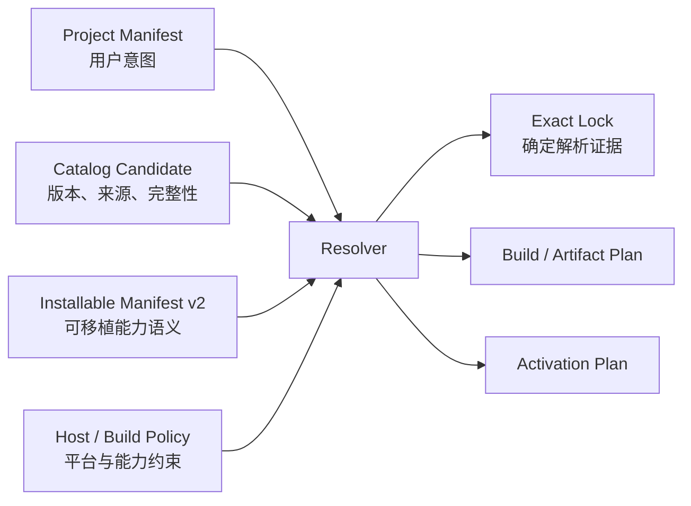

# ADR：Installable Package Manifest v2

## 状态

Proposed。本文定义第一阶段可执行合同；当前 26 个 `asharia.package.json` 仍是
`schemaVersion: 1`、`packageKind: "source-boundary"` 的仓库拓扑事实，不会在本阶段批量迁移。

本阶段实现 JSON Schema、跨字段语义校验和 synthetic fixtures。Project Manifest、Host Profile、候选发现、
resolver、lockfile、build/artifact plan 与生产 catalog entry 后续分步完成。

## 背景

当前 source-boundary manifest 能审计物理目录、CMake target ownership 与依赖边界，但它不是用户安装单位。
一个完整 Rendering System 可能聚合 renderer、RenderGraph、Vulkan RHI、materials 和 shader tooling 等多个
source boundaries。反过来，同一份可安装能力未来也可能由源码、预编译 native library、managed assembly 或纯内容提供。

如果把 CMake target、仓库路径、resolved source 与 payload hash 全部放进作者 manifest，Package Manager 就会把
“能力语义”“本地构建方式”和“本次解析证据”混成一个生命周期。这样既不能稳定支持预编译包，也会让同一内容因
下载位置不同而改变作者合同。

## 决策

### 1. 包管理由五层合同组成



- Project Manifest 只保存用户选择的完整 package identity、版本约束和 package options。
- Catalog Candidate 说明某个 exact version 从哪里取得，并携带可验证的 manifest/payload integrity。
- Installable Manifest v2 是作者发布的可移植语义合同。
- Host / Build Policy 描述当前宿主、平台、工具链和允许能力；不是 package 自己声称宿主满足什么。
- resolver 输出 exact lock、build/artifact plan 和 activation plan。运行时不直接解释作者 manifest。

这五层可以持久化为不同文件，也可以由 bundled catalog 在内存中提供，但其数据模型和所有权必须分开。

### 2. v2 使用封闭 discriminator

v2 继续使用发布根下的 `asharia.package.json`，并必须同时声明：

```json
{
  "schemaVersion": 2,
  "packageKind": "installable-capability"
}
```

- v1 只允许 `source-boundary`，用于当前源码/CMake topology 审计。
- v2 只允许 `installable-capability`，用于 catalog、resolution 与 planning。
- unsupported version/kind、未知字段和跨版本字段混用必须 fail closed。
- `plannedOwnershipRoot` 不能被自动推断为已经发布的 v2 package。
- Project Manifest 只能选择完整 package identity，不能选择内部 module、artifact、target 或 contribution。

### 3. v2 只保存可移植作者语义

v2 顶层合同包括：

| 字段 | 语义 |
| --- | --- |
| `id` | 全局稳定、反向域名形式的 package identity；rename 产生新 identity |
| `version` | exact Semantic Version |
| `displayName` / `description` | 面向 catalog 的显示元数据，不参与 identity |
| `catalogType` | `system`、`feature`、`integration`、`content` 或 `template` |
| `engineApi` | 对 Engine API 的结构化 exact/range 约束 |
| `dependencies` | 只引用完整 package identity 的 required dependencies |
| `options` | package 声明的 typed inputs；不得用来选择内部碎片 |
| `modules` | package-local logical modules及其 platform/host applicability，不包含构建系统 target |
| `entryModules` | 运行、创作、cook、diagnostics 的逻辑入口引用 |
| `contentRoots` | package payload 内的可移植相对路径与 shipping 角色 |
| `contributions` | 由 logical module 拥有的声明式扩展点 |

`feature-set` 不属于此枚举。它是项目选择层的 versioned meta-package，由
[Project Package Manifest v1](adr-project-package-manifest-v1.md) 单独设计，不能用一个空的 installable capability
伪装成完整能力。

### 4. logical module 不是 acquisition unit

每个 module 声明：

- package-local `id`；
- 单一 primary `role`：`contract/runtime/implementation/editor/tool/cook/diagnostics/content`；
- 同 manifest 内的 `dependsOn` DAG；
- 可适用的 `hostKinds`；
- namespaced `platforms`，其中 `com.asharia.platform.any` 表示平台无关；
- `shippingClass`：`runtime/editor/tool/development-only`；
- namespaced `requiredCapabilities`。

module 不声明 CMake target、source directory、binary filename 或加载函数。第一阶段只冻结
`minimal/editor/runtime/dedicated-server/asset-worker` 五个 host kind 名称；Host Profile 后续定义实际 profile、
grant/deny 与 compatibility。capability ID 在本阶段只做 namespaced 语法验证，不提前冻结运行时 token API。

`entryModules` 只引用上述 logical modules，维度不存在表示 package 不提供该入口。manifest 不保存
`complete: true` 或 `not-applicable` 之类自我证明状态。结构完整性由 validator 从 catalog type、entry references、
module graph 和 content roots 推导；更严格的第一方发布要求由 catalog publication policy 执行。

### 5. dependency constraint 是结构化数据

第一阶段只支持 required named dependency，版本约束为以下两种之一：

```json
{ "kind": "exact", "version": "1.2.3" }
```

```json
{
  "kind": "range",
  "minimumInclusive": "1.2.0",
  "maximumExclusive": "2.0.0",
  "allowPrerelease": false
}
```

不接受自由格式 range string，也暂不支持 optional dependency、conflict、replace 或 capability provider resolution。
跨 package 关系必须回到完整 package dependency；module 的 `dependsOn` 不能引用另一个 package 的内部 module。

### 6. source/CMake 映射属于独立 build descriptor

源码发行可以在 package 根提供独立的 `asharia.package.build.json`，将 v2 logical module 映射到当前
source-boundary identities、CMake targets、生成步骤和平台变体。它是开发/构建合同，不是通用安装 identity：

- v1 source-boundary manifest 仍是当前仓库目录与 CMake ownership 的事实源；
- build descriptor 必须引用 v2 logical module，不能产生新的用户可选项；
- CMake 仍是 target/link truth；descriptor 用于核对和生成 build plan，不反向替代 CMake；
- 预编译或纯内容 candidate 可以没有 CMake build descriptor；
- generated artifact manifest 把 logical module 映射到最终 binary/data products。

本阶段只冻结该边界，不实现 build descriptor schema。这样后续可以在不修改 package identity 的前提下支持 CMake、
预编译 native artifact、managed assembly 与 content-only delivery。

### 7. source、integrity 与 artifacts 属于候选和锁定证据

`bundled`、`project-embedded`、registry 或 local checkout 是 candidate 来源，不是作者 manifest 的身份字段。同一份 package
payload 可以通过多个来源提供；本机绝对路径不得写入可提交合同。

后续 [Package Candidate 与 Lockfile v1](adr-package-candidate-lockfile-v1.md) 已定义并实现合同/校验基线：

- stable source reference；
- exact manifest digest；
- 明确定义包含范围的 payload/artifact integrity；
- resolved dependency versions；
- resolver/schema version；
- package payload tree 的完整性证据。

logical module 到已验证 artifact 的映射继续属于尚未冻结的 build descriptor、artifact manifest 与 Build Plan；lock v1 不在
这些合同存在前猜测 binary/data artifact shape。

manifest 不能保存自身 hash，避免自引用；`requiresBuild` 也不属于通用作者语义，因为同一版本可能同时有 source 与
prebuilt candidates。

### 8. validator 分成 schema 与 semantic 两层

JSON Schema Draft 2020-12 负责字段、类型、封闭枚举和局部 shape。semantic validator 负责至少以下跨字段规则：

- exact SemVer 与 range ordering；
- dependency、option、module、content root 和 contribution ID 唯一；
- local module dependency/entry/contribution owner 引用存在；
- module graph 无自依赖和 cycle；
- module dependency 保持 host applicability 与 shipping closure；
- entry dimension 与 module role 一致；
- module role 与 shipping class 的明显冲突；
- content root 是 package-relative、正斜线、无 `.`/`..` 的路径；
- option default 与 enum/range 一致；
- `system` 至少有 runtime entry；`feature` 至少有 runtime entry 或 content root；
- `integration` 至少依赖两个完整 packages 且有 contribution；
- `content` 至少有 content root；`template` 至少有 template content root且无 runtime entry。

每条 diagnostic 包含 stable code、manifest path、JSON Pointer 和消息。解析错误必须确定排序；成功结果是不可变数据，
不创建 runtime object、OS/GPU resource 或 service registry。

### 9. 第一阶段 logical shape

以下 synthetic fixture 展示第一阶段合同，不代表当前仓库已有可发布 system：

```json
{
  "schemaVersion": 2,
  "packageKind": "installable-capability",
  "id": "com.asharia.system.synthetic-example",
  "version": "0.1.0",
  "displayName": "Synthetic Example System",
  "description": "Validates the portable installable package contract.",
  "catalogType": "system",
  "engineApi": {
    "kind": "range",
    "minimumInclusive": "0.1.0",
    "maximumExclusive": "0.2.0",
    "allowPrerelease": false
  },
  "dependencies": [],
  "options": [
    {
      "id": "validation",
      "type": "boolean",
      "default": true,
      "affects": ["build", "activation"]
    }
  ],
  "modules": [
    {
      "id": "runtime",
      "role": "runtime",
      "dependsOn": [],
      "hostKinds": ["editor", "runtime", "dedicated-server"],
      "platforms": ["com.asharia.platform.any"],
      "shippingClass": "runtime",
      "requiredCapabilities": []
    },
    {
      "id": "diagnostics",
      "role": "diagnostics",
      "dependsOn": ["runtime"],
      "hostKinds": ["editor", "runtime", "dedicated-server"],
      "platforms": ["com.asharia.platform.any"],
      "shippingClass": "development-only",
      "requiredCapabilities": []
    }
  ],
  "entryModules": {
    "runtime": ["runtime"],
    "diagnostics": ["diagnostics"]
  },
  "contentRoots": [],
  "contributions": []
}
```

## 兼容和迁移

1. source-boundary v1 与 package author contract v2 可以并存；topology validator 只审计 source-boundary v1，package
   contract dispatcher 审计 installable v2、Feature Set v2 与独立的 Project Manifest v1。
2. synthetic v2 fixtures 先验证 schema 与 diagnostics，不创建虚假生产 catalog entry。
3. 建立真实完整 ownership root 后，再为其添加 v2 manifest 和 build descriptor。
4. 生产 package 进入 catalog 前，必须通过 contract validator、publication policy 与 artifact integrity gate。
5. Project Manifest / Feature Set author contracts 由独立 ADR 冻结；Host Profile、resolver 与 lockfile 继续按独立 Slice
   推进，不从本 schema 猜测。

## 取舍

代价是同一个源码 package 可能同时存在 v1 topology、v2 author manifest 与 build descriptor，短期文件数量增加；收益是
三者各自只有一个变化原因，而且 Package Manager 不会依赖 Asharia 当前 CMake 布局。第一阶段也有意不解决 optional
dependencies、provider resolution、签名、ABI、hot reload 与远程 trust；这些能力需要先有稳定 Candidate、Host Profile
和 lock semantics。

## 验证依据

- [JSON Schema Draft 2020-12](https://json-schema.org/draft/2020-12) 提供封闭结构合同的标准基础。
- [Unity package manifest](https://docs.unity3d.com/cn/2022.1/Manual/upm-manifestPkg.html)、
  [project manifest](https://docs.unity3d.com/cn/current/Manual/upm-manifestPrj.html) 与
  [lock file](https://docs.unity3d.com/es/2021.1/Manual/upm-conflicts-auto.html) 分离作者元数据、项目意图和解析结果。
- [Unreal Engine Plugins](https://dev.epicgames.com/documentation/en-us/unreal-engine/plugins-in-unreal-engine) 允许一个发布插件包含多个不同加载角色的 modules；实际 build dependencies 仍在 module build rules 中。
- [O3DE Gem manifest](https://www.docs.o3de.org/docs/user-guide/programming/gems/manifest/) 保存 Gem identity、依赖与兼容元数据，
  [Gem 创建流程](https://www.docs.o3de.org/docs/user-guide/programming/gems/creating/) 将 native build 组织保留在 CMake 中。

这些资料支持“发布身份、项目选择、解析锁定、构建实现分层”的共同模式；本文字段和 Host/Profile 分层仍是 Asharia
针对自身 C++23/CMake 引擎选择的合同，不声称是行业统一 schema。
