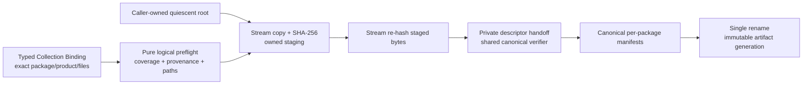

# ADR：Package Artifact Collection & Publication v1

## 状态

Accepted and implemented for #278。`tools/package_artifact_publication.py` 实现显式 root、流式复制/哈希、staged bytes
复验、closed layout 和本地不可变 artifact generation publication；
`tools/tests/test_package_artifact_evidence.py` 覆盖成功、复用、漂移、损坏与失败清理。

本 ADR 只冻结 package artifact build/install/cache evidence。它不定义 `EngineGenerationId`、Engine Distribution
Manifest、Editor Bootstrap、Effective Session Plan、Factory 或 Activation。发行与项目所有权以
[Editor Image、Engine Distribution 与原生组合 ADR](adr-editor-engine-distribution-and-native-composition.md) 为准；后继
session handoff 见 [Effective Session v1](adr-effective-session-v1.md)。
[Engine Distribution Assembly v1](adr-engine-distribution-assembly-v1.md) 只通过公开的只读 receipt 深度复验入口消费已提交
artifact generation，再把整代 exact bytes 纳入更外层 Distribution staging；collector 不因此取得 Distribution 所有权。

## 问题

[Package Product & Artifact Evidence v1](adr-package-product-artifact-evidence-v1.md) 已有 pure verifier：调用方提供 exact
immutable bytes，verifier 重新计算 size/SHA-256 并生成 canonical per-package manifests。该合同适合小型测试和纯
control-plane handoff，但生产 collector 还必须回答：

- 从哪个明确的 build/install/acquisition root 读取文件，怎样证明没有 missing/extra payload；
- 大文件怎样避免 `read_bytes()` 和整文件内存副本；
- 怎样拒绝 symlink、junction/reparse point、special file、path escape 和 source/publication root overlap；
- source 在复制时变化、staging 被修改或同名 generation 已存在时怎样 fail closed；
- manifest 与 artifacts 怎样作为同一个不可变 generation 对外可见，而不是发布半成品；
- collector 的 descriptor handoff 怎样保持受控，避免公共 verifier 开始信任任意 size/hash 字符串。

当前仓库没有统一 `install()` layout，不能扫描任意 CMake build tree 后按文件扩展名猜 product。v1 必须由上层 build/install
adapter 显式给出 package root 与 Product Declaration 中 exact product/file 的绑定。

## 依据与适用限制

| 依据 | 可确认的事实 | v1 约束 |
| --- | --- | --- |
| [CMake 3.28 `install()`](https://cmake.org/cmake/help/v3.28/command/install.html) | install rules 独立于 build-tree outputs，并按 artifact kind/component 显式组织相对 destination | collector 消费显式、隔离的 install/acquisition root，不猜测 CMake output |
| [Python `os.rename()`](https://docs.python.org/3.11/library/os.html#os.rename) | 同一 filesystem 内 rename 可以作为单个 namespace 操作；Windows 目标已存在时失败，跨 filesystem 失败 | staging 和 generation parent 必须同 filesystem；rename 是唯一 commit point |
| [Windows `MoveFileExW`](https://learn.microsoft.com/windows/win32/api/winbase/nf-winbase-movefileexw) | move/replace 与 write-through 是独立 policy，跨 volume 行为不同 | v1 不使用 copy fallback，不承诺跨卷原子性或 crash durability |
| [Windows file naming](https://learn.microsoft.com/windows/win32/fileio/naming-a-file) | 保留名、控制字符、尾随空格/点和特定字符不能作为统一可移植文件名 | artifact path 使用 Windows/POSIX 共同安全子集并阻止 case-fold/ancestor collision |

Python 3.11 on Windows 没有统一的 directory-fd/`O_NOFOLLOW` 遍历能力。因此本地 v1 不是面对恶意并发 writer 的安全
sandbox：调用方必须拥有且 quiesce source/publication roots。collector 仍在每个可用边界拒绝 links/reparse points，
并用 before/open/after file identity 与全树复扫检测合作式 build pipeline 中的漂移。

## 决策

### 1. Collection 是 typed、临时输入，不是第三份 manifest

调用方为每个实际交付 artifacts 的 exact package 提供：

```text
PackageArtifactCollection
  package_id + package_version
  artifact_root: pathlib.Path
  products[]
    module_id + product_id
    files[]: package-relative path + role + media_type
```

Collection 只绑定“从哪个 isolated root 取得已声明 product 的哪些文件”。它不持久化，不保存 target platform、configuration、
size 或 digest；这些分别来自 verified Source Build Plan 和 collector 实际读取的 bytes。没有 artifacts 的 selected package
不需要伪造空 root，pure verifier 仍会为其生成 closed manifest module evidence。

collector 不接受自动 discovery、glob、扩展名推断或任意 output directory。上层 build/install adapter 必须先把 package product
映射到隔离 root。

### 2. Public exact-bytes verifier 与 owned streaming handoff 分开

公共 `verify_package_artifacts()` 继续把 caller observation 当作不受信输入，必须从 exact immutable `bytes` 重算 size/hash。

collector 是同一模块域内的 filesystem owner：它先流式复制，再独立流式重哈希 staged file，最后才将
`ArtifactFileEvidence(path, role, mediaType, size, sha256)` 交给私有 `_verify_collected_package_artifacts()`。私有 handoff
复用全部 coverage、provenance、path、role 与 canonical manifest 规则，但不能成为对外接受任意 descriptor 的 API。



### 3. Artifact path 使用可真实落盘的共同子集

`is_portable_artifact_path()` 要求：

- Unicode NFC 且可编码为 UTF-8；
- `/` 分隔的非空相对路径，不含 drive/URI colon、反斜杠、空/`.`/`..` segment；
- 不使用 Windows reserved name、控制字符、`< > : " / \\ | ? *`、尾随空格或点；
- package root 不占用保留的 `asharia.package.artifacts.json`；
- 同一 package 内没有 exact duplicate、Unicode case-fold collision 或 file/directory ancestor collision。

这些是 publication layout 约束，不表示支持任意 Windows namespace spelling、alternate data stream 或 device path。

### 4. Roots 必须显式、隔离且只含 regular tree

`artifact_root` 和 `publication_root` 必须是已存在的显式 `pathlib.Path`。collector：

1. 从 filesystem anchor 到 root 检查每个 component；link/reparse 或非目录 component 立即失败；
2. resolve 后拒绝任意 package roots 相互重叠，或与 publication root 重叠；
3. 枚举每个 package root，拒绝 symlink/junction/reparse、socket/device/其他 special file；
4. actual files/directories 必须与绑定推导的 closed tree 完全相等，extra empty directory 也失败；
5. 复制完成后重新枚举并比较每个 source file fingerprint，检测新增、删除、替换或修改。

v1 不修改 source root，也不在 source root 中写 receipt。调用方负责在 build/install 完成后 quiesce root，直到函数返回。

### 5. 复制、复验与 publication 顺序固定

`collect_and_publish_package_artifacts()` 按以下顺序执行：

1. 对 Host Composition、Source Build Plan、Effective Session verified graph、Product Declaration snapshots 和 collection
   coverage 做无 publication IO 的 logical preflight；
2. 验证 roots、closed source trees 和同 filesystem publication parents；
3. 在 `<publication-root>/.asharia-package-artifact-staging/generation-*` 创建 owned temp directory；
4. 每个 source file 用 exclusive destination create，以最多 1 MiB chunk 复制并计算 SHA-256；
5. 比较 source `lstat/fstat` before/open/after evidence，再从 staged file 分块重算 size/SHA-256；
6. 私有 descriptor handoff 生成 canonical Package Artifact Manifests；
7. exclusive 写入 manifests，并验证 staged tree 的 exact files/directories/fingerprints；
8. 以 manifest-set integrity 生成 artifact publication identity；
9. 若 final path 不存在，以一次 `os.rename()` 提交整个 generation；若已存在，完整验证 layout、manifest bytes 与所有
   artifact hashes 后只读复用；任何损坏都失败且不覆盖。

结果布局：

```text
<publication-root>/
  generations/
    sha256-<manifest-set-digest>/
      packages/
        <package-id>/
          asharia.package.artifacts.json
          <declared artifact paths...>
```

receipt 字段明确命名为 `artifact_generation_id` / `artifact_generation_path`。该 ID 是 manifest-set content identity，
不是整个 Engine/Editor 发行组合的 `EngineGenerationId`。

### 6. 原子性只承诺本地 namespace commit

成功 receipt 只在 final generation directory 已经由 rename 提交，或已存在 generation 全量复验成功后返回。失败时不返回
receipt，并 best-effort 删除本次 owned staging directory。不会创建 `current` / `latest` mutable pointer；选择哪个 generation
属于后继 build/session/activation owner。

v1 明确不调用 `fsync`/`FlushFileBuffers`，不维护 journal，也不承诺断电/OS crash 后的 durable transaction。进程或机器崩溃
可能留下 staging directory，由后继维护任务按 owner policy 清理；已经存在的 final generation 在复用前始终重新验证。
publication root 必须是调用方独占 namespace；v1 不提供跨进程 lock 或 hostile concurrent writer 防护。

## 失败合同

所有预期失败返回排序后的 structured diagnostics 和空 receipt。主要类别包括：

- collection 输入、package/product coverage、portable path、root overlap/closed-tree 错误；
- source drift、copy/read/write、staging drift 或 staged integrity mismatch；
- cross-filesystem、layout/manifest mismatch、rename failure；
- 已存在 generation 缺失、混入额外文件或 artifact hash 损坏；
- staging cleanup 失败；此时诊断保留 owned path，不能伪装为原子成功。

## 被拒绝的方案

### 扫描 CMake build tree 自动猜 package artifacts

拒绝。build tree 包含 import libraries、PDB、utility outputs 与 configuration-specific paths；没有 install/product mapping 就无法
证明 package ownership。

### 把所有 artifact bytes 读入内存后调用公共 verifier

拒绝。它复制大文件并让 peak memory 随 package payload 线性增长。owned collector 用 bounded chunks，并在 staging 复验后走
私有 descriptor handoff。

### 逐文件直接复制到 final generation

拒绝。消费者可能观察到 manifest/files 不完整的半发布状态。final directory 只由单次 rename 出现。

### final generation 已存在时直接视为 cache hit

拒绝。content-addressed 名字本身不能证明本地 bytes 未损坏；复用前必须核对 closed layout、canonical manifests 与 artifact hashes。

### 由 collector 更新 `current` 或决定 Editor Activation

拒绝。collector 只发布证据。会话状态、restart、generation selection 和 factory lifecycle 属于 Distribution/Project
composition 与 Host Runtime。

## 验证

定向测试覆盖：

- public exact-bytes verifier 仍重新计算 bytes，输入不变且无 filesystem IO；
- Windows/POSIX portable path、reserved manifest/name、case-fold 与 ancestor collision；
- 大于两个 chunks 的 artifact 不调用 `Path.read_bytes()`，首次 publication 与乱序输入复用得到同一 ID；
- logical preflight 在创建 staging/generation parents 前失败；
- missing/extra file、overlap root、link/reparse、source drift；
- rename 注入失败清空 staging 且不暴露 final generation；
- 已存在 generation 被篡改时失败且不覆盖损坏现场。

本 Slice 是 Python/docs-only，不修改 CMake/C++ targets，不把编译性能优化混入 package architecture 变更。

## 后续

1. Engine Distribution Manifest v1、`EngineGenerationId`、Project Lock v2 硬切与 Effective Session handoff 已完成；
2. Distribution Assembler v1 已完成；installed Repair Verifier 与静态薄 composition root generation 仍是独立 Slice；
3. Factory/Scope/Lifecycle contracts 与 Activation Plan；
4. 真实 prebuilt/remote acquisition 出现后再定义 signature/trust、cross-process cache lock 与 crash-durable publication。
