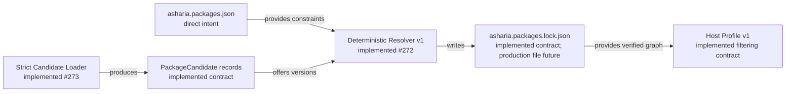

# ADR：Package Candidate 与 Lockfile v1

## 状态

Proposed。本文冻结 future `engine/package-runtime` 使用的 `PackageCandidate` 内存记录与项目根
`asharia.packages.lock.json` v1 合同。当前仓库已经实现对应 Draft 2020-12 schema、dispatcher、lock-local/cross-document
validator、normalized writer、payload tree digest 与 synthetic fixtures；
[Deterministic in-memory Package Resolver v1](adr-package-resolver-v1.md) 也已实现 caller-supplied candidates 到 canonical exact
lock graph 的求解基线。[Explicit-source Package Candidate Discovery v1](adr-package-candidate-discovery-v1.md) 也已实现 strict
candidate loader；上游 catalog/index、locked reuse/update workflow 与生产 lockfile 仍未实现。

本文是 [Project Package Manifest v1](adr-project-package-manifest-v1.md) 的下一层：Project Manifest 保存用户直接意图，
Candidate 表达 discovery adapter 提供的可选精确 payload，Lockfile 只保存一次成功求解选择出的精确、可验证图。

## 意图

同一份 `asharia.packages.json` 必须能在 Editor、CLI、CI、Runtime 和 Dedicated Server 中引用同一组精确 packages，而不受
后来发布的版本、本机绝对路径、JSON whitespace、目录枚举顺序或 Host Profile 影响。Lockfile 必须回答：

- 当时选择了哪个 exact package/Feature Set version；
- 每个节点来自哪个稳定 source reference；
- 实际读取的 author manifest 与 package payload 是否仍是同一份内容；
- 完整 exact dependency graph 是什么；
- lock 是否仍对应当前 normalized Project Manifest 和 engine API；
- 哪个 resolver/policy 版本生成了该结果。

它不负责重新求解版本、发现候选、下载 payload、映射 CMake targets、选择 Host modules、生成 Build/Activation Plan 或执行
package activation。

## 当前约束

- `asharia.packages.json` 已冻结 direct packages、direct Feature Sets 和 package option overrides；其 normalized writer 已实现。
- installable package v2 与 Feature Set v2 author manifests 保存 ranges 和逻辑内容，不保存 source 或自身 hash。
- 同一 resolved graph 必须供多个 Host Profiles 使用；Host/module/platform filtering 不能改变 lock graph。
- 第一阶段只支持 `bundled`、`project-embedded` 和 `local` candidates；registry、签名与远程 acquisition 后置。
- package-runtime 是 bootstrap component，不能依赖 Editor、Vulkan、GLFW、project-core 或可选 Data Model package 才能读 lock。
- 当前没有 build descriptor、artifact manifest 或 publication file list；本文不能虚构 logical module 到 binary artifact 的映射。

## 决策

### 1. Candidate 是内存边界，不新增项目文件



`PackageCandidate` 是 discovery/resolver API 的 typed record，不是 author-owned sidecar，也不是新的 `candidates.json`。每条
candidate 至少包含：

- `id`、exact `version`、`packageKind`；
- stable `source`；
- `manifestIntegrity`；
- `payloadIntegrity`；
- 已 schema/semantic 验证的 author manifest projection；
- adapter-local payload location，仅存在于进程内，不可进入 lock。

同一 `id + version` 可以由多个来源提供多个 candidates。来源优先级、歧义失败与版本选择属于后续 resolver；lock 只记录
最终选中的一条 source/integrity evidence。

### 2. Lockfile 只保存 direct roots 与 exact nodes

顶层 discriminator 固定为：

```json
{
  "schema": "com.asharia.package-lock",
  "schemaVersion": 1
}
```

顶层字段固定为：

| 字段 | 语义 |
| --- | --- |
| `resolver` | 生成者 semantic version 与 resolution policy version |
| `inputs` | normalized Project Manifest digest 与 exact engine API version |
| `roots` | direct packages 与 direct Feature Sets 的 exact node references |
| `nodes` | 完整、精确、可达的 installable/Feature Set dependency graph |

节点 shape：

```json
{
  "id": "com.asharia.system.rendering-vulkan",
  "version": "0.1.0",
  "packageKind": "installable-capability",
  "source": {
    "kind": "bundled",
    "distributionId": "com.asharia.distribution.engine-0-1",
    "relativePath": "packages/systems/rendering-vulkan"
  },
  "manifestIntegrity": {
    "algorithm": "sha256",
    "digest": "0000000000000000000000000000000000000000000000000000000000000000"
  },
  "payloadIntegrity": {
    "algorithm": "sha256",
    "digest": "1111111111111111111111111111111111111111111111111111111111111111"
  },
  "dependencies": []
}
```

`roots.directPackages` 与 `roots.directFeatureSets` 使用 exact node reference：`id`、`version`、`packageKind`。每条
`dependencies` 也使用相同 exact reference，不保存 range。Project Manifest 和 author manifests 仍是 constraint origin；
lock 是它们成功求交后的结果。

### 3. 一个 resolved graph 中每个 package identity 只有一个版本

v1 拒绝同一 `id` 的多个 exact versions。Asharia packages 不是彼此隔离的普通库副本：它们可能拥有系统状态、stable type IDs、
contribution IDs、assets、settings 与 Host lifecycle。允许两个版本同时存在会立即要求 namespaced ABI、serialization identity、
factory/contribution conflict 和 asset ownership 规则，而当前没有任何真实需求或隔离机制支持它。

未来若出现可隔离的 tool-only package 多版本需求，必须通过新 schema version 和独立 ADR 引入，不能让 v1 lock 悄悄接受。

### 4. Source reference 必须稳定且不泄漏机器路径

v1 使用封闭 union：

| `kind` | 可提交字段 | 禁止 |
| --- | --- | --- |
| `bundled` | `distributionId` + distribution-relative `relativePath` | engine 安装绝对路径 |
| `project-embedded` | project-relative `relativePath` | project root 绝对路径 |
| `local` | namespaced logical `sourceId` | checkout/file URL/盘符路径 |

`local.sourceId` 由 workspace/CLI source configuration 映射到机器路径。另一台机器缺少映射时 locked restore 必须以
`lock.source.unavailable` 失败，不能搜索任意同名目录；找到 payload 后还必须通过两个 integrity checks。

registry URL、git commit、signature/trust metadata 与 credential 不进入 v1。未来 registry source 通过 schema upgrade 添加，
不会把自由 URL 提前塞进通用 `reference` 字符串。

### 5. Integrity 同时定义算法、编码和 byte domain

v1 integrity object 固定：

```json
{
  "algorithm": "sha256",
  "digest": "64 lowercase hexadecimal characters"
}
```

保留显式 `algorithm` 便于未来 schema version 增加算法；v1 只接受 SHA-256，避免实现“声明支持但无法验证”的自由算法。
SHA-256 在这里提供内容完整性与确定性缓存 identity，不提供 publisher authentication；签名与 trust policy 后置。

三个 digest 的 byte domain 分开：

1. `inputs.projectManifestIntegrity`：对 `render_normalized_project_manifest()` 产生的 UTF-8 bytes 计算；whitespace 和输入数组顺序
   不改变 digest。
2. `manifestIntegrity`：对 candidate payload 内 `asharia.package.json` 的 exact UTF-8 file bytes 计算。encoding gate 已禁止 BOM；
   author manifest 任意 byte change 都要求更新 lock。
3. `payloadIntegrity`：对下面定义的 `asharia-package-tree-v1` canonical stream 计算，不对 ZIP/TAR container bytes、mtime、ACL、
   Windows file attributes 或目录枚举顺序计算。

`asharia-package-tree-v1`：

- payload root 由 discovery adapter 提供；author manifest 必须位于 root；
- 递归包含所有 regular files，包括 author manifest；
- 仅排除 root-level `.git/`、`.hg/`、`.svn/`、`build/` 和 `generated/`；不接受 caller 自定义 exclude；
- v1 拒绝 symlink、junction、device file 和其他非 regular file；
- relative path 必须为 Unicode NFC、UTF-8、`/` 分隔、无空段、`.`、`..`、反斜线、盘符或 case-fold collision；
- entries 按 relative path UTF-8 bytes 升序；
- hash input 以 ASCII `asharia-package-tree-v1\0` 开始；每个 entry 依次写入 big-endian uint64 path byte count、path bytes、
  big-endian uint64 file byte count、file bytes。

固定 excludes 只移除仓库和构建机器状态。若 package 需要不同 publication payload，后续 artifact/publication manifest 必须显式
提供文件集合；不能把 ad-hoc glob、`.gitignore` 或当前目录 mtime 当成 lock 语义。

### 6. Exact graph 必须闭合、可达且 kind-correct

semantic validator 至少拒绝：

- duplicate root 或 node identity；
- 同一 `id` 多版本；
- root/dependency 引用不存在，或 exact version/`packageKind` 不匹配；
- node self dependency 与 dependency cycle；
- 从 roots 不可达的 orphan node；
- installable node 依赖 Feature Set；
- author manifest dependency/member 未出现在 exact edges，或 lock 添加 author manifest 未声明的 edge；
- selected version 不满足 Project/author constraint；
- Feature Set 被展开但 exact meta node 丢失；
- engine API version 不满足 selected candidate `engineApi`；
- Project option 指向未锁定/错误 kind package，或 option identity/type/value 与 pinned installable manifest 不匹配。

前六项可由 lock-local validator 检查。后五项由 cross-document validator 在调用方提供 Project Manifest 与 pinned author manifests
时检查；它验证一个已选择结果，不搜索候选或选择版本，因此不是 resolver。

### 7. Lock 不复制 package options、modules、contributions 或 artifacts

effective option values 可由 pinned installable manifest defaults 与 normalized Project Manifest overrides 唯一重建；把它们再写入 lock
会产生第三份可漂移事实。modules、content roots 和 contributions 同理由 manifest digest 固定，Host Profile 在验证 payload 后读取。

logical module 到 CMake target/binary/data artifact 的映射属于 build descriptor、artifact manifest 和 Build Plan。当前这些合同不存在，
lock v1 只固定 package payload tree，不能使用猜测字段提前占位。

### 8. Normalized writer 与 stale detection

lock parser 不给输入数组顺序赋予语义。normalized writer 使用：

- `roots.directPackages`、`roots.directFeatureSets` 按 `id` 排序；
- `nodes` 按 `id` 排序；
- 每个 `dependencies` 按 `id` 排序；
- object fields 使用 schema 定义的固定顺序；
- UTF-8 without BOM、LF、两空格缩进、结尾换行；
- 不写 timestamp、机器名、绝对路径或 lock 自身 hash。

locked mode 先规范化当前 `asharia.packages.json` 并计算 digest；与 `inputs.projectManifestIntegrity` 不一致时以
`lock.input.project-manifest-stale` fail closed。engine API version 不一致同样必须重新验证/resolve，不能只看文件 mtime。

未来 apply transaction 先在内存验证 proposed Project Manifest、候选与 lock，再写临时文件并 replace。跨文件 crash journal/rollback
仍由 apply workflow 设计；本文只提供 digest mismatch 恢复证据。

### 9. Host Profile 不进入 lock graph

同一 lock 必须供 Minimal、Editor、Runtime、DedicatedServer 与 AssetWorker 使用。后续
[Host Profile v1](adr-host-profile-v1.md) 已实现 fixed policy schema 与纯数据 projector：它消费 verified exact nodes 与 pinned
author manifests，按 module role、host/platform applicability、shipping class、capability 与 contribution filters 生成逻辑选择；
Activation Plan 仍未实现。

Host-specific active modules、dependency order、denied capabilities、build target 或 process state 都是派生 plan，不写回 lock。

## 第一版 logical shape

```json
{
  "schema": "com.asharia.package-lock",
  "schemaVersion": 1,
  "resolver": {
    "version": "0.1.0",
    "policyVersion": 1
  },
  "inputs": {
    "engineApiVersion": "0.1.0",
    "projectManifestIntegrity": {
      "algorithm": "sha256",
      "digest": "aaaaaaaaaaaaaaaaaaaaaaaaaaaaaaaaaaaaaaaaaaaaaaaaaaaaaaaaaaaaaaaa"
    }
  },
  "roots": {
    "directPackages": [],
    "directFeatureSets": [
      {
        "id": "com.asharia.features.standard3d",
        "version": "0.1.0",
        "packageKind": "feature-set"
      }
    ]
  },
  "nodes": [
    {
      "id": "com.asharia.features.standard3d",
      "version": "0.1.0",
      "packageKind": "feature-set",
      "source": {
        "kind": "bundled",
        "distributionId": "com.asharia.distribution.engine-0-1",
        "relativePath": "package-registry/features/standard3d"
      },
      "manifestIntegrity": {
        "algorithm": "sha256",
        "digest": "bbbbbbbbbbbbbbbbbbbbbbbbbbbbbbbbbbbbbbbbbbbbbbbbbbbbbbbbbbbbbbbb"
      },
      "payloadIntegrity": {
        "algorithm": "sha256",
        "digest": "cccccccccccccccccccccccccccccccccccccccccccccccccccccccccccccccc"
      },
      "dependencies": [
        {
          "id": "com.asharia.system.rendering-vulkan",
          "version": "0.1.0",
          "packageKind": "installable-capability"
        }
      ]
    },
    {
      "id": "com.asharia.system.rendering-vulkan",
      "version": "0.1.0",
      "packageKind": "installable-capability",
      "source": {
        "kind": "local",
        "sourceId": "com.asharia.source.rendering-workspace"
      },
      "manifestIntegrity": {
        "algorithm": "sha256",
        "digest": "dddddddddddddddddddddddddddddddddddddddddddddddddddddddddddddddd"
      },
      "payloadIntegrity": {
        "algorithm": "sha256",
        "digest": "eeeeeeeeeeeeeeeeeeeeeeeeeeeeeeeeeeeeeeeeeeeeeeeeeeeeeeeeeeeeeeee"
      },
      "dependencies": []
    }
  ]
}
```

## 拒绝的替代方案

### 在 Project Manifest 保存 exact transitive graph

拒绝。direct intent 与 generated resolution 会混合，无法区分用户选择和间接依赖，升级也产生大面积手工 diff。

### 创建可提交的 `candidates.json`

拒绝。candidate catalog 来自 engine distribution、项目目录与 workspace mappings；把机器发现结果提交会复制 source config，
并把未选择候选误当作项目事实。

### 在 lock 保存绝对路径或自由 source URL

拒绝。绝对路径不可跨机器复现；自由 URL 会在 registry/acquisition/trust policy 尚未设计时冻结凭据、重定向和来源歧义。

### 只保存 version 列表，不保存 exact edges

拒绝。无法证明完整依赖图、Feature Set 成员来源、reachability 或 `Required by` 关系，也无法为后续 Host plan 提供稳定输入。

### 允许同 ID 多版本以模仿通用语言包管理器

拒绝。当前 engine packages 不是隔离 libraries；系统状态、type/contribution IDs、assets 与 Host lifetime 会冲突。

### 把 Host-filtered modules 或 build artifacts 写入 lock

拒绝。Host/Build Plan 是同一 exact graph 的不同 projection；提前写入会让一个项目需要多份互相漂移的 lock。

## 非目标

- 不在本文实现 candidate discovery adapter、版本选择、constraint search/backtracking 或 lock reuse algorithm；显式来源 loader
  的相邻合同与实现由 [Package Candidate Discovery v1](adr-package-candidate-discovery-v1.md) 定义；
- 不实现下载、registry、git source、credential、signature、publisher trust 或 license policy；
- 不实现 build descriptor、artifact manifest、Build Plan、Activation Plan 或 Host filtering；
- 不创建生产 packages、Feature Sets 或项目 lockfile；
- 不定义 hot install/unload、ABI isolation 或同 identity 多版本；
- 不修改 `asharia.project.json`、Conan lock 或当前 CMake topology。

## 实现与验证计划

当前合同基线提供：

- Draft 2020-12 `package-lock-v1.schema.json`，复用 package common identity/SemVer definitions；
- lock dispatcher、lock-local semantic validator、cross-document selected-result validator；
- Project Manifest digest、manifest file digest 与 `asharia-package-tree-v1` digest helpers；
- normalized lock writer；
- positive fixtures：empty graph、direct installable、Feature Set transitive graph、三种 source kinds；
- negative tests：duplicate/multi-version、missing/kind/version mismatch、cycle、unreachable、absolute path、invalid digest、stale
  Project Manifest、constraint/engine API mismatch、undeclared edge、orphan/type-mismatched option；
- input order/whitespace/path enumeration 的 canonical byte equivalence tests；
- current topology、author-contract、encoding、doc-sync 与 whitespace gates。

纯 schema/Python Slice 不新增 native target；按 #270 约定不强制 native build，提交时仍遵守当前仓库 AGENTS.md 的实际门禁。

## 依据

- [npm package-lock](https://docs.npmjs.com/cli/v11/configuring-npm/package-lock-json/) 保存 exact dependency tree、resolved source 与
  artifact integrity，并提交到 source control；本文不继承其 location-keyed tree 或本地绝对路径语义。
- [Cargo resolver](https://doc.rust-lang.org/cargo/reference/resolver.html) 区分 manifest ranges 与 lock 中保留的 exact result；本文因
  engine system ownership 明确拒绝同 identity 多版本。
- [Unity lock files](https://docs.unity3d.com/es/2021.1/Manual/upm-conflicts-auto.html) 将成功 resolution 写入项目 lock，并在仍满足
  constraints 时复用 exact versions；本文另外加入 explicit integrity 与 Project Manifest digest。
- [W3C Subresource Integrity](https://www.w3.org/TR/SRI/) 证明 algorithm + digest 必须共同定义；本文使用结构化字段并额外冻结
  package-tree byte domain，不把 Web fetch/CORS 语义带入引擎。
