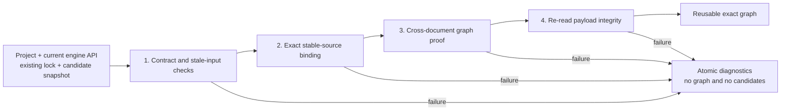

# ADR：锁定 Package Graph 验证与复用 v1

## 状态

Accepted and implemented for #274；只读、fail-closed、绝不隐式 resolve/write 的原则仍有效。裸
`engineApiVersion` 输入、`bundled` source binding 与 Lock v1 evidence 已由
[Project Manifest 与 Package Lock v2 硬切](adr-project-manifest-lock-v2-hard-cut.md) 取代。当前 verifier 同时验证
Engine Distribution、Project Manifest v2 与 Project Lock v2。
[Effective Session v1](adr-effective-session-v1.md) 现在调用该 verifier，并把成功值深拷贝为带 fingerprints 的
`VerifiedResolvedGraph`；Host Composition/Source Build/artifact consumers 不再直接接受 `LockedGraphVerificationResult`。

已有合同和实现已经能：

- 从显式 engine-distribution、project-embedded、local 来源加载不可变 `PackageCandidate` 快照；
- 把调用方提供的 candidates 确定性求解为 canonical exact lock graph；
- 验证 lock-local graph、Project/author-manifest cross-document 语义；
- 重新读取 package root 并验证 author-manifest exact bytes 与 canonical payload tree integrity。

缺失的是一个只读编排边界：当项目已经有 lock 时，判断它能否在本次 engine API 与本次候选快照下原样复用。

## 外部依据与结论

本决策对照了以下官方资料：

| 生态 | 官方行为 | 对 Asharia 的约束 |
| --- | --- | --- |
| Cargo | 首次求解写入 `Cargo.lock`；后续命令优先保留 locked versions，`--locked` / `--frozen` 在 lock 需要变化时失败；`cargo update` 是显式的独立更新命令。 | locked verification 不得隐式进入 resolver；更新策略必须有独立授权和边界。 |
| npm | `npm ci` 要求已有 lock；当 lock 与 `package.json` 不一致时退出，不更新 lock，也不写 package manifests。 | stale input 是 fail-closed，不是自动修复信号。 |
| NuGet | locked restore 在输入未变时复用 exact graph；locked mode 与 `--force-evaluate` 分属相反路径。 | “验证复用”与“重新求值”不能由同一个隐式 mode 混合。 |
| Python / OS | `os.replace` 成功时提供原子 rename，但跨文件系统、权限和目标类型仍有独立失败条件。 | 文件 apply、durability、journal 与跨文件恢复是另一个 transaction Slice，不属于只读验证。 |

资料：

- [Cargo dependency resolution](https://doc.rust-lang.org/cargo/reference/resolver.html)
- [`cargo update`](https://doc.rust-lang.org/cargo/commands/cargo-update.html)
- [`npm ci`](https://docs.npmjs.com/cli/v8/commands/npm-ci/)
- [NuGet PackageReference and lock files](https://learn.microsoft.com/nuget/consume-packages/package-references-in-project-files)
- [NuGet locked mode 与 force-evaluate 冲突说明](https://learn.microsoft.com/nuget/reference/errors-and-warnings/nu1512)
- [Python `os.replace`](https://docs.python.org/3/library/os.html#os.replace)

由此冻结三条顺序边界：

1. `verify/reuse`：只读、已有 lock 必需、失败即关闭；
2. `update planning`：显式决定 full、targeted 或 minimal-change graph，后继 ADR 负责；
3. `apply`：把已经验证的 proposed documents 安全写入文件系统，再后继 ADR 负责。

本 Slice 只覆盖第一条。

## 决策

### 1. 公共操作是只读验证，不是 package-manager mode switch

语义 API：

```text
verifyLockedPackageGraph(
  project,
  engineApiVersion,
  existingLock,
  candidates,
  validators
) -> LockedGraphVerificationResult
```

第一版实现使用 Python 命名 `verify_locked_package_graph()`，但合同不依赖具体语言。结果包含：

```text
LockedGraphVerificationResult
  lock: normalized exact lock graph | None
  selectedCandidates: stable tuple<PackageCandidate>
  diagnostics: stable tuple<Diagnostic>
  succeeded: bool
```

原子不变量：

- 成功：`lock` 非空、`selectedCandidates` 覆盖每个 locked node、`diagnostics` 为空；
- 失败：`lock` 为空、`selectedCandidates` 为空、`diagnostics` 非空；
- 不返回 partial graph、partial candidates 或 `needsUpdate` 状态；
- 不调用 resolver，不读取其他候选来源，不写任何文件；
- 不修改 caller-owned project、lock、candidate 或 manifest projection。

`needsUpdate` 被刻意排除，因为同一个 verification failure 可能表示正常 stale input，也可能表示 source 缺失、payload 损坏、来源身份改变或 TOCTOU。失败本身不授予重新求解或重写 lock 的权限。

### 2. 当前 engine API 是独立输入

现有 `validate_locked_result_data()` 会验证 selected author manifests 是否满足 lock 内记录的 engine API，却不能证明该记录等于本次 host 使用的 engine API。

workflow 必须：

1. 验证 caller 提供的是 exact SemVer；
2. 比较 `existingLock.inputs.engineApiVersion == engineApiVersion`；
3. 不一致时返回稳定的 `lock.input.engine-api-stale`；
4. 只有相等时，才以该 exact version 继续验证 selected author manifests。

不能以文件 mtime、engine branch、build preset 或“仍满足某个 range”替代 exact equality。lock 的 inputs 记录的是一次求解的完整输入，而不是宽松兼容声明。

### 3. 复用前必须完成四层证明



#### 3.1 Contract 与 stale-input

- 验证 Project Manifest 与 Package Lockfile schema/semantic contracts；
- 验证 exact current engine API；
- 重新计算 normalized Project Manifest digest，并与 `inputs.projectManifestIntegrity` 比较；
- 验证 lock roots、nodes、exact edges、kind、可达性和 cycle 等 lock-local 不变量。

缺失的 existing lock 是稳定失败。core API 可接受 `None` 并返回 `lock.input.missing`；文件不存在、JSON/UTF-8 读取失败由外围 loader 转换成同一 `lock.*` diagnostic 体系，但不在 core 中引入文件写入。

#### 3.2 Exact stable-source binding

每个 locked node 必须绑定当前 candidates 中恰好一个 payload。source object 先按 Package Lockfile v1 source union 规范化；绑定 identity 定义为：

```text
canonical source
+ exact package id
+ exact version
+ packageKind
```

匹配顺序以 stable source 为主：

1. 没有当前 candidate 提供 locked source：`lock.source.unavailable`；
2. 同一个 locked source 对应多个 current candidates：`lock.candidate.ambiguous-binding`；
3. 唯一 source candidate 的 `id`、`version` 或 `packageKind` 与 node 不同：返回对应 `lock.candidate.*-mismatch`；
4. candidate evidence/manifest 不满足既有合同：保留既有 contract/candidate diagnostics；
5. source 和 metadata 都一致后，才比较 candidate snapshot 的 `manifestIntegrity` / `payloadIntegrity` 与 lock evidence。

这意味着同一 id/version 在另一个 bundled path、project path 或 local `sourceId` 中出现，不能替代 lock 记录的来源。v1 没有 source precedence 或 fallback。

lock 未引用的合法 extra candidates 不参与结果，也不能影响结果 bytes。candidate 输入排列没有语义；selected candidates 按 locked identity 的 UTF-8 bytes 排序。

#### 3.3 Cross-document graph proof

把已绑定 candidates 的 validated author manifest projections 交给现有 `validate_locked_result_data()`，证明：

- direct Project roots 完整且满足 constraints；
- Feature Set members 与 installable dependencies 和 exact edges 双向一致；
- selected versions/kinds 与 author manifests 一致；
- package engine API constraints 满足本次 exact engine API；
- Project option IDs、types 与 values 对 pinned manifest 有效。

本阶段验证一个已经选择的结果，不搜索候选、不回溯、不选择版本。

#### 3.4 Re-read actual payload integrity

Candidate Discovery 产生的是某一时刻的快照。workflow 在返回成功前必须从每个已绑定 candidate 的 opaque `payloadLocation` 再次读取：

- `asharia.package.json` exact bytes；
- `asharia-package-tree-v1` canonical payload tree。

然后同时与 lock evidence 比较。只信任 discovery 时保存的 digest 会遗漏 discovery → verification 之间的变化；现有 `validate_locked_candidate_integrity()` 可作为重哈希基础，但调用方必须先完成 stable-source 精确绑定，不能继续使用仅按 package id 提供的任意 root map。

重哈希仍不能永久消除 verification → build/activation 的 TOCTOU。后继消费者必须使用不可变 acquired artifact，或在真正消费可变 local root 前再次验证。`LockedGraphVerificationResult` 证明的是本次检查边界，不是路径未来永远不变。

### 4. Normalization 不等于文件修改

core workflow 消费 parsed models，不要求现有文件 whitespace、object field order 或 array input order 已经 canonical。成功时返回 normalized semantic lock representation，并满足：

```text
renderNormalizedLock(result.lock)
  == renderNormalizedLock(existingLock)
```

它不把 normalized text 写回磁盘。把非 canonical formatting 当作 locked failure 没有提高 graph 可复现性，反而会把格式修复混入只读 restore。未来 writer/apply 只在显式产生并应用 proposed lock 时输出 canonical bytes。

### 5. Diagnostics 复用现有 `lock.*` 权威

优先保留现有 schema、semantic、cross-document 和 integrity diagnostics，避免创建第二套同义错误。workflow 只补充当前编排缺失的 codes：

| Code | 条件 |
| --- | --- |
| `lock.input.missing` | core 没有收到 existing lock |
| `lock.input.engine-api-stale` | 当前 exact engine API 与 lock input 不同 |
| `lock.candidate.identity-mismatch` | locked source 当前指向不同 package identity |
| `lock.candidate.ambiguous-binding` | 一个 locked source 无法唯一绑定当前 candidate |

继续复用的代表性 codes 包括：

- `lock.input.project-manifest-stale`；
- `lock.source.unavailable`；
- `lock.candidate.version-mismatch` / `lock.candidate.kind-mismatch`；
- `lock.integrity.payload-unreadable`；
- `lock.integrity.manifest-mismatch` / `lock.integrity.payload-mismatch`；
- lock-local 与 cross-document validator 已有的 `lock.root.*`、`lock.edge.*`、`lock.option.*`。

所有 diagnostics 按既有稳定 sort key 排序；message 不包含本机绝对路径。

## 拒绝的方案

### 验证失败后自动调用 resolver

拒绝。临时 source unavailable、payload corruption 或 source identity 改变会被误解释为升级机会，并可能把已审计 lock 静默重写。

### 在同一 Slice 中加入 minimal-change update

拒绝。当前 Resolver v1 选择最高兼容图，没有“保留未受影响 locked nodes”、targeted package、recursive update depth 或 security-only update policy。把 existing lock 传给 resolver 而不先冻结这些规则，会让所谓 minimal change 依赖实现偶然性。

### 只验证 lock schema 与 graph-local 结构

拒绝。合法 JSON 不能证明它对应当前 Project Manifest、当前 engine API、当前 author dependencies 或当前 payload bytes。

### 只按 package id 绑定 payload root

拒绝。同一个 identity/version 可以来自不同稳定来源；按 id 绑定会允许错误的本地目录替代已锁来源。

### 只信任 Candidate Discovery 已计算的 digest

拒绝。显式 local/project roots 是可变路径；discovery 后的内容变化必须在复用边界重哈希。

### 同时写 Project Manifest 与 lockfile

拒绝。跨文件 apply 涉及临时文件、原子 replace、durability、部分失败、journal/rollback 与进程并发，独立于 graph 是否可复用。

## #274 实现切片

#274 保持为一个 PR-sized Slice，并已完成以下实现：

1. 新增 `tools/package_lock_verification.py`，定义 frozen result/diagnostic 数据结构与只读 public entry point；
2. 复用或窄幅提取 candidate contract validation，禁止 import/call resolver entry point；
3. 实现 current engine API、Project digest、exact source binding 与 stable ordering；
4. 组合现有 lock-local、cross-document 和 selected payload integrity validators；
5. 增加 success、stale input、source mismatch/ambiguity、integrity/TOCTOU、atomicity、immutability、permutation 与 no-resolver/no-write tests；
6. 同步相邻 ADR、package-first/roadmap 状态与 package contract test inventory。

本 Slice 没有创建 production CLI，也不读取 registry/catalog。外围 file loader 若已有通用只读入口可以调用 core；否则 file-command UX 留到后继 package-manager orchestration。

## 验证矩阵

| 场景 | 期望 |
| --- | --- |
| exact Project/engine/lock/candidates/payload | 成功，返回相同 canonical graph 和全部 selected candidates |
| missing/invalid lock | 原子失败 |
| Project semantic order变化但 normalized bytes 相同 | 成功 |
| Project normalized digest 变化 | `lock.input.project-manifest-stale` |
| current engine API 变化 | `lock.input.engine-api-stale` |
| locked source 缺失 | `lock.source.unavailable` |
| 同 id/version 仅其他 source 可用 | `lock.source.unavailable`，不 fallback |
| locked source 指向不同 id/version/kind | 对应 candidate mismatch |
| 一个 locked source 多重绑定 | `lock.candidate.ambiguous-binding` |
| author dependency、Feature Set 或 option 漂移 | cross-document failure |
| discovery 后 manifest/payload 变化 | integrity failure |
| extra unreferenced candidates | 成功结果不变 |
| candidates 任意排列 | result 与 diagnostics bytes 不变 |
| 任一 node 失败 | 不返回 partial lock/candidates |
| resolver 或 file writer 被 mock 为 fail-on-call | verification 不触发它们 |

## 后继边界

只有 #274 实现与验证完成后，才根据真实需求设计 update policy。该 ADR 至少需要决定：

- full update、targeted update 与 transitive unlock 的区别；
- 未受影响 locked nodes 的保留规则；
- prerelease、source change 与 integrity-only refresh 是否允许；
- proposed lock 如何解释差异，何时需要用户确认。

apply transaction 再独立决定单文件/跨文件原子性、锁、临时文件、flush、replace、journal、rollback 与 crash recovery。当前不提前创建这些未来 Slice。

## 相关资料

- [Package Candidate 与 Lockfile v1](adr-package-candidate-lockfile-v1.md)
- [确定性内存 Package Resolver v1](adr-package-resolver-v1.md)
- [显式来源 Package Candidate Discovery v1](adr-package-candidate-discovery-v1.md)
- [Project Package Manifest v1](adr-project-package-manifest-v1.md)
- [Package-first 架构](package-first.md)
- GitHub #264、#270、#271、#272、#273 与 #274
