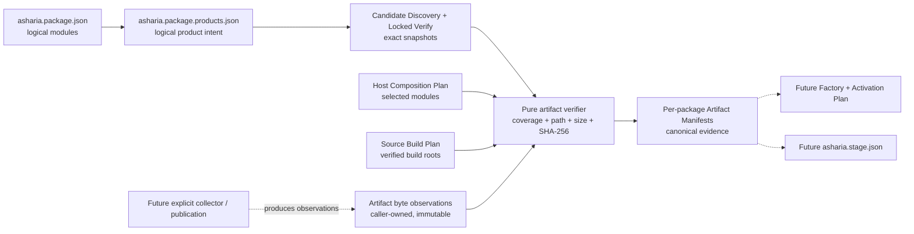

# ADR：Package Product & Artifact Evidence v1

## 状态

Accepted and implemented for #277。本 ADR 冻结 Package Product Declaration v1、Package Artifact Manifest v1、候选快照交接与
纯 artifact verifier 的最小合同。closed schemas、Candidate Discovery / Locked Verification 复验、确定性 per-package manifest
set 和 synthetic end-to-end tests 已落地。

这仍是 package control plane，不是最终游戏构建系统：实现不执行 CMake、不收集 build tree、不安装或复制文件、不生成
`asharia.stage.json`，也不加载 native module。它只回答“某个已验证 Source Build Plan 对应的 package logical products，是否被这组
精确 bytes 完整且一致地证明”。

## 问题

[Source Build Plan v1](adr-source-build-plan-v1.md) 已能证明某个 Host 的 selected logical modules 应构建哪些真实 CMake roots，以及
configured target closure 是什么。但 CMake target 成功并不能单独回答：

- package 作者认为每个 logical module 应交付哪些稳定 logical products；
- 一个 module 是明确不交付独立 artifact，还是应交付 link input、runtime binary、tool、content 或 metadata；
- 某次 build/acquisition 的文件是否完整映射到 exact package/module/product；
- 文件路径是否可移植，bytes 的 size 与 SHA-256 是否一致；
- artifact evidence 对应哪份 Host Composition、Source Build Plan 和 Product Declaration；
- 如何拒绝 missing、extra、duplicate、stale 或路径碰撞，而不产生 partial manifest；
- 如何保持 package artifact、Asset Product Manifest 与最终 game stage 三种权威不混淆。

当前仓库没有 `install(...)` 规则；CMake codemodel 中同时存在 static library、shared library、executable 和 utility targets，build-tree
artifact 还会混入 import library、PDB 等配置相关输出。因此不能扫描一个 build directory 后按扩展名猜 package product。

## 资料验证

| 资料或本地证据 | 可确认的事实 | 对 Asharia 的约束 |
| --- | --- | --- |
| [CMake 3.28 `install()`](https://cmake.org/cmake/help/v3.28/command/install.html) | install rules 独立于 build；target outputs 按 `RUNTIME`、`LIBRARY`、`ARCHIVE` 等 artifact kind 与 component 组织；relative destination 支持 relocatable install；interface library 可不安装 artifact | build-tree path 不是发布产品合同；后继 collector 必须消费显式 install/acquisition root，不扫描任意输出目录 |
| [OCI Image Descriptor](https://github.com/opencontainers/image-spec/blob/main/descriptor.md) | descriptor 的 digest 与 byte size 是 required content evidence，消费前应验证 size/digest；SHA-256 是基础算法 | v1 file evidence 使用 structured SHA-256 与非负 byte size；只借用 content descriptor 原则，不采用 OCI packaging |
| [in-toto Statement v1](https://in-toto.io/Statement/v1) | subject 必须带 digest，并假设被识别的 artifact 不可变 | verified artifact 以 bytes digest 为身份；只借用 immutable subject 原则，不生成 in-toto Statement |
| [SLSA Build Provenance v1.2](https://slsa.dev/spec/v1.2/build-provenance) | build outputs 由 subjects 识别，build definition 与本次 run details 分层 | Source Build Plan fingerprint 与 artifact bytes evidence 分开保存；v1 不声明 builder trust 或 SLSA level |
| `project-build-and-launch.md` | Native Build Tree、Stage Layout 和 Distribution Artifact 是不同权威；`asharia.stage.json` 属于 Project Product Pipeline | Package Artifact Manifest 不拥有 stage、entry point、deploy、session 或最终产品文件集合 |
| `asset_product.hpp` | Asset Product identity 绑定 `AssetId`、importer/settings/source hashes 和 asset payload | package binary/data evidence 不复用 Content pipeline 的 Asset Product Manifest |

## 决策概览

建立两份持久合同和一个纯内存验证边界：

1. **Package Product Declaration v1**：package 作者声明 exact package 每个 logical module 的 product intent；
2. **Package Artifact Manifest v1**：一次 source build 对一个 exact package 的实际文件证据；
3. **Artifact verifier**：把成功的 locked graph、Host Composition、Source Build Plan、candidate declaration snapshots 与 caller-owned
   immutable byte observations 原子地对证并生成有序 manifest set。



实线是 #277 已实现路径；虚线是明确后置的 adapter/consumer。

## 1. Package Product Declaration v1

### 1.1 独立作者文件

installable source package 可以在 package root 提供：

```text
asharia.package.products.json
```

顶层 discriminator 为 `com.asharia.package-products`、`schemaVersion: 1`，并精确绑定 author manifest 的 package ID/version：

```json
{
  "schema": "com.asharia.package-products",
  "schemaVersion": 1,
  "package": {
    "id": "com.asharia.system.rendering-vulkan",
    "version": "0.1.0"
  },
  "modules": []
}
```

declaration 必须完整、唯一地覆盖 author manifest 的全部 modules，而不是只覆盖当前 Host 选中的 modules。这样 module/product drift 在
candidate boundary 就会失败，不依赖某次 Host selection 是否碰巧使用该 module。

### 1.2 delivery 是 closed union

每个 module 只能声明：

```json
{
  "moduleId": "runtime",
  "delivery": {
    "kind": "artifact-set",
    "products": [
      {
        "id": "runtime-library",
        "purpose": "link-input"
      }
    ]
  }
}
```

或：

```json
{
  "moduleId": "diagnostics",
  "delivery": {
    "kind": "no-artifacts"
  }
}
```

`artifact-set` 至少有一个 module-local unique product。v1 `purpose` 是：

- `link-input`：后继 composition/link adapter 的输入，例如 static library；
- `runtime-binary`：运行时 executable/shared/module binary；
- `build-tool`：只在 build/cook/tool Host 使用的 executable/library；
- `runtime-content`：package 自有、非 Asset Product cache 的 runtime data；
- `metadata`：由后继 adapter 解释的 package metadata product。

declaration 不包含 target、path、extension、hash、platform-specific filename、command、factory、scope、phase、stage 或 deploy 字段。
同一 logical product 在不同 target/configuration 可以产生不同 files；这些事实属于 Artifact Manifest。

### 1.3 `no-artifacts` 不等于“没有代码”

`no-artifacts` 只表示该 logical module 在 package artifact boundary 没有独立 product。例如 header/contract-only module、完全嵌入另一
composition root 的逻辑声明或只贡献 author-time metadata，都可能选择该值。它不声明 runtime 是否激活，也不等于 CMake
`no-build`；build 与 delivery 是两份独立权威。

## 2. Candidate snapshot 与 locked re-verification

Candidate Discovery 与 `asharia.package.build.json` 使用相同证据规则：

- optional declaration 必须是 package root 下的 readable regular UTF-8 JSON file；
- schema、package ID/version 与完整 module coverage 在 discovery 时验证；
- candidate 保存独立 parsed projection、exact bytes 与 SHA-256 integrity；
- package payload tree integrity 自然覆盖 declaration file；
- payload tree 计算完成后再次读取 declaration，捕获 discovery 窗口内的 TOCTOU；
- Locked Graph Verification 重新核对 snapshot completeness、bytes hash、parsed equality、binding 与 on-disk exact bytes；
- declaration 不存在时，resolve/lock/Host Composition/Source Build Plan 仍可工作；只有 selected module 进入 artifact verification 时才
  fail closed。

Artifact verifier 只消费 candidate 内存 snapshot，不重新打开 payload root。因此它本身是 side-effect-free；filesystem freshness 由前置
Locked Verification 负责。

## 3. Package Artifact Manifest v1

### 3.1 每个 package 一份 manifest

generated manifest 的逻辑文件名为：

```text
asharia.package.artifacts.json
```

一份 manifest 只属于一个 exact package/version 和一个 Host/target/configuration context。Host 级 verifier 原子地产生有序
`tuple<PackageArtifactManifest>`；任一 package 失败时整个结果的 manifests 为空。

顶层字段：

- `package`：exact ID/version；
- `context`：Host kind、target platform、configuration；
- `provenance.kind: source-build`；
- `hostCompositionIntegrity`、`sourceBuildPlanIntegrity`、`productDeclarationIntegrity`；
- 当前 Host selected modules 的 delivery/product/file evidence；
- manifest 自身 `integrity`，覆盖除 self field 外的 canonical payload。

没有 timestamp、absolute root、username、build directory、CMake target ID/reply filename、command、factory、stage 或 deploy 字段。

### 3.2 file evidence

每个 declared product 必须恰好有一个 observation，且至少包含一个 file。每个 product 恰好一个 `primary` file；可选 companion roles：

- `link-companion`；
- `runtime-dependency`；
- `debug-symbol`；
- `metadata`。

每个 file 记录：

```json
{
  "path": "lib/asharia-rendering.lib",
  "role": "primary",
  "mediaType": "application/octet-stream",
  "size": 1234,
  "integrity": {
    "algorithm": "sha256",
    "digest": "..."
  }
}
```

`path` 相对于未来 caller/collector 拥有的 package artifact root。manifest 不保存该 root。路径必须：

- Unicode NFC；
- UTF-8 encodable；
- 使用 `/`；
- 非空、非绝对路径、不含 drive/URI colon；
- 不含空、`.` 或 `..` segment；
- 在同一 package 内 exact unique，且不与其他 path 发生 Unicode case-fold collision。

verifier 从 observation 的 exact `bytes` 重新计算 size 与 SHA-256，并与 caller claim 对证。v1 的 byte observation 是纯 control-plane
测试/适配合同；未来大文件 collector 可以流式 hash 后交付等价的受信 snapshot，但必须先独立冻结 trust/streaming boundary，不能悄悄让
verifier只相信未对证的字符串。

## 4. 纯 verifier 合同

概念 API：

```text
verifyPackageArtifacts(
  hostCompositionPlan,
  sourceBuildPlan,
  successfulLockedGraphVerification,
  immutableProductArtifactObservations,
  validators
) -> PackageArtifactVerificationResult
```

输入门禁：

- Host Composition 与 Source Build Plan 都通过 closed schema；Source Build Plan self-integrity 有效；
- Source Build Plan 的 Host Composition fingerprint、Host kind 与 target platform 精确匹配；
- successful locked graph normalized，Source Build Plan package/version/module selection 与 Host Composition 相同；
- 每个 selected package 有唯一 exact verified candidate，candidate/lock identity、source、manifest/payload integrity 相同；
- 有 selected modules 的 package 必须有完整、有效、未漂移的 Product Declaration snapshot；
- observation package/version/module/product、target platform/configuration 精确匹配；
- declared product coverage 完整，无 missing/duplicate/unknown observation；`no-artifacts` module 不接受 observation；
- files/roles/media type/path/size/SHA-256/primary cardinality 全部通过。

输出按 UTF-8 identity、module ID、product ID 和 file path 稳定排序。输入 iterable 或 files 的顺序不影响 serialized manifests、
self-integrity 或 manifest-set integrity。诊断按 path/pointer/code/message 稳定排序。

任一错误都返回：

```text
manifests = ()
manifestSetIntegrity = None
diagnostics != ()
```

verifier 不调用 resolver/CMake，不执行 IO，不修改 Host Plan、Source Plan、candidate、declaration 或 observations。

## 5. 静态链接、动态加载与 ABI

当前 baseline 主要通过 static libraries 和 generated composition root 工作。`link-input` 只表示一个 verified file 将成为后继 link
adapter 的输入；它不是可运行 module，也不包含 factory/lifecycle 语义。最终 game executable 是 Project Product Pipeline 在后续
Build/Stage 阶段链接和验证的 product，不是本 Slice 直接生成的 package manifest。

`runtime-binary` 也不自动表示 dynamic loading。只有独立 Factory / Scope / Lifecycle contract、ABI/toolchain compatibility、trust、
dependency loading、thread/lifetime 和 rollback 规则全部冻结后，Activation Plan 才能把某个 runtime binary 解释为可加载 module。

Source Build Plan/toolchain fingerprints 只能说明“这份 evidence 来自哪份 plan”，不能证明两个 native binaries ABI-compatible。v1 不保存
ABI tag，不承诺 hot reload/hot unload，也不把 debug/release 或 MSVC/ClangCL 同名输出视为可互换。

## 6. 与 Asset Product 和最终 stage 的边界

| 合同 | owner | identity | 是否由 #277 实现 |
| --- | --- | --- | --- |
| Asset Product Manifest/Record | Content import/cook pipeline | `AssetId` + importer/settings/source/dependency product facts | 否，保持现状 |
| Package Product Declaration | installable package author | exact package/module/product logical identity | 是 |
| Package Artifact Manifest | package build/acquisition evidence | exact package/module/product + path/size/SHA-256 + plan provenance | 是 |
| `asharia.stage.json` | Project Product Pipeline | 最终 runnable product、entry point、全部 staged files、cook catalog、toolchain/build/profile facts | 否，后置 |

因此 #277 不是“构建游戏”：它只为 package build/acquisition 结果建立可验证中间证据。后继 Project Build 可以消费多个 package manifests，
再链接 composition root、cook content、收集 runtime dependencies，并原子发布最终 stage。

## 拒绝的替代方案

### 从 CMake codemodel artifact paths 自动生成产品

拒绝。codemodel paths 是 configuration/build-tree facts，当前仓库也没有 install rules。它们不足以判断 import library、runtime DLL、
debug symbol、tool 或最终 distribution component。Source Build Plan 可以保存 target evidence，但 product mapping 必须由独立作者合同和显式
collector/acquisition adapter提供。

### 把 path/hash 写进 Product Declaration

拒绝。作者 declaration 必须跨平台和配置稳定；具体 filename、path、size 和 digest 是一次 build/acquisition 的结果。

### 复用 Asset Product Manifest

拒绝。Asset Product identity 与 invalidation 依赖 importer/settings/source graph；package binary/data evidence 依赖 exact package/module、
Source Build Plan 和 file bytes。复用会把 Content runtime 与 package control plane 重新耦合。

### 直接生成 `asharia.stage.json`

拒绝。最终 stage 还需要 generated executable、runtime dependency closure、cooked content catalog、licenses、Build Profile、entry point 与
atomic publication。把它们塞入本 Slice 会把 package evidence 与完整游戏产品构建混为一层。

### 采用 OCI/in-toto/SLSA JSON

拒绝。它们提供了可靠的 digest/provenance设计依据，但 Asharia v1 没有 registry object model、attestation envelope、trusted builder 或
SLSA level 语义。伪装兼容会比一个明确 closed local contract 更危险。

## 不做事项

- 不执行 build/install/cook/copy/collect/publish；
- 不扫描任意 output directory；
- 不写 manifest 文件或做 temp/replace/fsync/journal/rollback；
- 不建立 artifact acquisition、download、signature、trust 或 remote registry；
- 不定义 factory/scope/lifecycle、Activation Plan、Host Runtime、dynamic loading 或 ABI policy；
- 不生成 stage/distribution/deploy/session evidence；
- 不修改 CMake targets、presets、clang-tidy、PCH、unity 或 compiler cache；
- 不为当前 source-boundary packages 批量虚构未来 Product Declarations。

## 验证

#277 覆盖：

- Product Declaration closed schema、exact identity、完整 module coverage、duplicate product 和 normalization determinism；
- Candidate Discovery snapshot、payload inclusion、TOCTOU 与 Locked Verification on-disk drift；
- Artifact Manifest closed schema、self-integrity、primary cardinality、portable/NFC/case-fold paths；
- observation missing/duplicate/unknown、wrong package version/target/configuration、size/digest、roles/media type；
- stale Host Composition、Source Build Plan 和 Product Declaration snapshot；
- manifest/file/observation permutation determinism；
- atomic failure、input immutability、no resolver/no filesystem IO；
- Discovery → Resolve/Locked Verify → Host Composition → Source Build Plan → Artifact Manifest synthetic handoff。

## 后续边界

1. **Explicit artifact collector / atomic publication**：从明确 install/acquisition root 流式收集 bytes evidence，发布 per-package manifest；
2. **Factory / Scope / Lifecycle contract**：冻结可执行 entry/factory、scope、phase、service dependency、lease 与 rollback；
3. **Activation Plan**：对证 Host Composition、verified package artifacts 与 factory contracts；
4. **Project Stage v1**：由 Project Product Pipeline 生成最终 runnable `asharia.stage.json`；
5. **Acquired/prebuilt evidence**：在 trust/signature/source policy 冻结后，让 artifact-only candidate 复用同一 Package Artifact Manifest shape。

以上必须保持独立 Slice。#277 不提前创建 collector、Activation 或 stage 的 Issue；只有下一项边界达到 PR-sized 目标与验收条件后再进入
Project。
