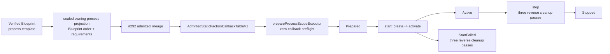

# ADR：ProcessScope Lifecycle v1

## 状态

Accepted and implemented for #293。本文冻结 `ProcessScope` 的 v1 owner、输入、状态、回滚、停止、线程与诊断合同；implementation、
focused failure traces、双编译器 CTest/build、Python/contracts、encoding、doc-sync 与 diff 门禁均已通过。

#292 已提供 current-process-only 的 `AdmittedStaticFactoryCallbackTableV1`，但仓库仍没有 production
`VerifiedCurrentProcessLaunchHandoffV1` issuer 或 long-lived generated Host。因此本 ADR 只实现可由 PRIVATE test issuer 驱动的 headless
ProcessScope baseline，不宣称 Editor、sample 或 generated Host 已完成端到端项目 activation。

当前唯一接受的 evidence tuple 已由 #294 后继硬切为 Windows Development Host Template renderer 2 + Static Composition renderer 4 +
`asharia-static-factory-provider-v3` + RegistrationSnapshot v2。本 Slice 的 lifecycle state machine 未改变，也不保留旧 provider、
renderer、executor 或 schema adapter。typed contribution payload/lease 仍不属于 ProcessScope v1。

## 问题

Activation Eligibility 只证明以下事实：

- Session、Blueprint、binding、current process 与 exact callback table 属于同一条 admitted lineage；
- table 的 identity snapshot 与 deep-verified expected snapshot 完全相等；
- descriptor 只能由持有 admitted owner 的 Host Runtime 私有路径同步借用。

这些事实仍不能直接执行 lifecycle：

1. callback table 的 canonical order 是 registration identity order，不是 dependency order；
2. table 不拥有 Blueprint 的 `process` scope、parent、factory requirements 与 dependency-first order；
3. table 可以同时包含其他 scope 的 descriptors，ProcessScope 不能把“表中存在”误解为“本 scope 应执行”；
4. raw descriptor span 是短期借用，不能成为 executor 的长期状态；
5. create/activate 中途失败时，Host 必须仍然唯一拥有并精确清理每个已经产生的 token；
6. 隐式析构 cleanup 可能发生在错误线程、吞掉 diagnostics，或在 callback table 之后销毁 token。

因此 #293 需要一个窄的 ProcessScope owner，把已验证的 Blueprint process template、admitted table 与具体 token lifetime 绑定起来，
同时在首个 package callback 前拒绝全部结构性错误。

## 决策摘要



`prepareProcessScopeExecutor(...)` 按值消费 admitted table，完成全部 owning allocation、process projection 验证与 exact descriptor
index 映射。成功结果 `ProcessScopeExecutorV1` 从 `Prepared` 开始；`start()` 只按 sealed Blueprint order 执行
`create -> activate`，`stop()` 只从 `Active` 执行三个完整 reverse passes。

任何 preparation failure 都不返回 partial executor，且 lifecycle callback invocation count 为零。任何 startup failure 都不暴露 partial
scope；完整 rollback 后进入终态 `StartFailed`。

## 1. Owner 与 target 方向

ProcessScope public owner 为 `ProcessScopeExecutorV1`，实现 target 固定为：

```text
asharia-host-runtime-process-scope
alias: asharia::host_runtime_process_scope
```

依赖只向下：

```text
asharia::host_runtime_contract
        ↓
asharia::host_runtime_registration
        ↓
asharia::host_runtime_activation_eligibility
        ↓
asharia::host_runtime_process_scope
```

该 target 位于 `engine/host-runtime`，不依赖 Package Runtime、Editor、Bootstrap UI、filesystem、JSON、resolver、build tools 或 package
implementation targets。它消费已经验证并投影到 C++ owning state 的事实，不读取 manifest、lock、receipt、Blueprint JSON 或 artifact bytes。

future Bootstrap/Host application owns executor 并显式调用 `start()` / `stop()`；executor 不反向发布 `Ready`、`SafeMode` 或其他 Editor
状态，也不成为全局 singleton。

## 2. Sealed Blueprint process projection

`VerifiedHostActivationBlueprintHandoffV1` 的 PRIVATE state 增加 owning
`ProcessScopeBlueprintProjectionStateV1`。该 projection 沿 `ActivationEligibilityLineageStateV1` 一起进入 admitted owner；普通调用方不能
默认构造、替换或从 snapshot strings 重建它。

projection 使用内部 owning 类型：

```text
ProcessScopeBlueprintProjectionStateV1
  scope = process
  parentScope = none
  engineGenerationId
  blueprintIntegrity
  lifecycleModel
  factories[] in exact Blueprint process order

ProcessFactoryProjectionStateV1
  ExactFactoryReferenceStateV1 reference
  ExactFactoryReferenceStateV1 requirements[]
```

exact factory reference 固定为：

```text
(packageId, packageVersion, moduleId, factoryId)
```

projection 必须由已经验证的 Blueprint process template 深拷贝产生：

- `factories[]` 保留 Blueprint 的 dependencies-first order；
- 每个 `requirements[]` 只包含该 Blueprint 声明的 exact process dependencies；
- strings、vectors 与 integrity 均由 projection 自己拥有，不借用 parser、JSON tree 或临时 span；
- projection 不包含 callback/token/pointer、table index、path、timestamp 或 runtime state；
- `scope != process`、存在 parent scope、generation/integrity/lifecycle model 不匹配都 fail closed。

registration snapshot 不能替代 projection。snapshot 证明“哪些 exact provider registrations 被 observed”，projection 决定“ProcessScope
为什么以及按什么依赖顺序执行其中哪一组 factory”。

## 3. Exact identity mapping；table order 不是 authority

preparation 通过 exact identity 把 process projection 的每个 factory 映射到 admitted table 中唯一 descriptor，并只缓存 descriptor
index。执行顺序始终遍历 projection；绝不遍历 table 来推导顺序。

规则固定为：

- 每个 process factory 必须恰好映射一个 descriptor；missing/duplicate mapping 失败；
- factory reference 与 requirements 均不得 duplicate、self-reference 或指向 plan 外 factory；
- 每个 requirement 必须在 dependent 之前出现，否则 `RequirementOrderInvalid`；
- empty process template 合法；
- admitted table 可以含 Project、Editor、ToolJob 或其他 scope 的 descriptors；它们不属于本 projection，保持 inert；
- table 的 canonical order 与 Blueprint order 不同是合法情况，不是 mismatch；
- provider invocation、registration timing、JSON array、filesystem、CMake target 与 callback address 都没有 lifecycle order 语义。

“拒绝 non-process input”只表示 sealed projection 自身必须是 root `process` template，且计划内记录必须来自该 template；它不要求整张
admitted table 只能包含 ProcessScope descriptor。

## 4. Zero-callback preflight

`prepareProcessScopeExecutor(...)` 在构造 `Prepared` owner 前完成以下原子检查：

1. admitted owner 未 moved-from，PRIVATE descriptor access 仍通过 admission、control thread、process epoch、origin、table address、storage
   anchor 与 expected snapshot 复验；
2. process projection 存在、owning facts 完整，且 generation、Blueprint integrity 与 fixed lifecycle model 和 admitted lineage 一致；
3. scope 恰为 `process` 且无 parent；
4. factory 与 requirement exact identities 唯一、完整、dependency-first；
5. 每个 process factory 与 table snapshot/descriptor storage 一对一 exact-map，五个 callback slots 均非空；
6. executor state、descriptor indices、dependency views 与 diagnostics 所需的 Host-owned storage 全部成功分配。

任一检查失败返回 `ProcessScopePreparationErrorV1`，不得调用 create、activate、quiesce、deactivate 或 destroy。错误通过稳定的
`ProcessScopeErrorCodeV1` 与可选 exact factory/requirement attribution 表达，不返回 partial executor、descriptor、span 或 token。

`start()` 在首个 callback 前再次验证 control-thread/process-epoch invariant。wrong-thread failure 保持 `Prepared` 以允许 owner 回到
control thread 重试；stale process epoch 或其他不可重试的 admitted-access failure 进入无 token 的 `StartFailed`。两类失败的 invocation
count 均为零。executor 不缓存 `AdmittedStaticFactoryCallbackTableAccessV1` 返回的 borrowed callback span；每次同步操作只在 admitted
owner 存活期间即时取得 span，并使用 preparation 已冻结的 index。

## 5. Factory phase contexts

具体 contexts 位于 `factory_lifecycle_contexts.hpp`，继续满足 #291 已冻结的 callback signatures：

- `ExactFactoryReferenceViewV1`：callback-duration-only 的 exact package/version/module/factory attribution；
- `FactoryAttributionViewV1`：Engine generation 与当前 exact factory；
- `FactoryDependencyViewV1`：一个已声明、已经 Active 的 process dependency identity 与其 `FactoryInstanceViewV1`；
- `FactoryCreateContextV1`：当前 attribution 加按 declaration 规范化的 dependency views；
- `FactoryActivateContextV1`、`FactoryQuiesceContextV1`、`FactoryDeactivateContextV1`：只暴露当前 Host-owned attribution。

四个 context 均由 Host 私有 access bridge 构造，不可复制、不可移动，只在对应 callback dynamic extent 内有效。provider 不得保存 context、
span、`string_view` 或 `FactoryDependencyViewV1` 本身。若 instance 需要长期引用 dependency，provider 必须在 create 内转换为自己能够遵守
non-owning lifetime contract 的状态；reverse destroy 保证 dependency token 晚于 dependent token 销毁。

Create context 只包含 Blueprint 对当前 factory 明确声明、并且此时已经 Active 的 dependencies。public API 不提供 arbitrary ID lookup、
`getService<T>()`、全局 registry、未声明 dependency、其他 scope instance 或 mutable Host state。

callback result 仍只返回 succeeded/failed 与 package-local numeric code。Host 使用 context 对应的 owning attribution 产生 canonical
diagnostic；不信任 provider 返回 factory ID、generation 或 borrowed message，也不把 diagnostic sink、自由文本 callback 或 allocator 扩大进
v1 context。

## 6. 状态机

`ProcessScopeExecutorV1` 使用以下 public states：

| 状态 | 含义 | 是否拥有 token |
| --- | --- | ---: |
| `Prepared` | preflight 完成，尚未调用 lifecycle | 否 |
| `Active` | 全部 process factories 已按顺序 create/activate | 是，恰好每 factory 一个 |
| `StartFailed` | startup 失败且 rollback 已完成 | 否 |
| `Stopped` | normal stop 的全部 cleanup passes 已完成 | 否 |
| `MovedFrom` | pimpl authority 已移交；source 永久不可用 | 否 |

允许的状态转换只有：

```text
Prepared --start success--> Active --stop--> Stopped
Prepared --start failure--> StartFailed
any movable state --move--> destination keeps state; source MovedFrom
```

`start()` 只接受 `Prepared`，`stop()` 只接受 `Active`。double start、double stop、stop-before-start、restart-after-failure、restart-after-stop
与 moved-from use 返回稳定 `ProcessScopeOperationErrorV1`，不调用任何 callback，也不改变原状态。

`start()` / `stop()` 的整个同步 dynamic extent 还由 executor-owned operation guard 保护。若 provider callback 通过同进程其他路径
重入同一个 executor，内层 `start()` 或 `stop()` 必须在调用额外 callback 前返回
`ProcessScopeErrorCodeV1::OperationInProgress`；外层 operation 继续按原有顺序完成或回滚。v1 不把重入排队，也不允许 callback
借重入改变当前 lifecycle state。

## 7. 单 control thread 与 process epoch invariant

ProcessScope 继续沿用 #292 admission 创建时绑定的 control-thread epoch；v1 不接受 caller 提供 `std::thread::id`、scheduler 或任意线程
affinity override。

- prepare、start、stop 与 move 后的后续 operation 都必须在同一 active control-thread epoch 执行；
- wrong-thread start 保持 `Prepared`，wrong-thread stop 保持 `Active`，callback count 为零，caller 可回到原 control thread 重试；
- pre-start process epoch stale 属于 start failure，进入无 token 的 `StartFailed`；
- `Active` lifetime 内禁止 rebind/invalidate current process epoch；必须先在原 control thread stop，再释放或替换 epoch；
- Active 期间强行使 epoch stale 是 Host owner protocol violation，不能降级为“跳过 destroy”。

本 Slice 是 single-threaded executor，不加 mutex、worker dispatch、parallel activation 或 callback cancellation。future threaded executor 必须另行
冻结 callback affinity、drain 与 data-race contract，不能复用 v1 名称静默改变行为。

`state()` 同样只是 control-thread 上的同步观察，不得与 `start()` / `stop()` 并发调用；wrong-thread operation error 是 fail-closed
misuse detection，不是对 concurrent access 的线程安全承诺。

## 8. Stable pimpl 与 table-before-token lifetime

public `ProcessScopeExecutorV1` 只持有 heap pimpl。move construction 转移同一 pimpl，source 进入 `MovedFrom`；move assignment 删除，避免
覆盖一个可能仍为 Active 的 owner。

pimpl 的 ownership order 固定为：

```text
admitted callback table owner  -- constructed first / destroyed last
frozen process plan + indices
created instance token storage -- constructed later / emptied before table
```

这保证：

- public handle move 不改变 admitted table 的物理 address；
- table 与 immutable descriptor storage 比所有由其 callbacks 创建的 tokens 活得更久；
- executor 只保存 descriptor indices，不保存可能因 access scope 结束而失效的 callback span；
- 每个 factory 在一个 ProcessScope generation 中最多拥有一个 token；
- 每个成功 token 最终恰好一次移动进对应 `destroy`，Host 不复制、解包、cast 或自行 delete payload。

## 9. Startup 与 rollback

`start()` 严格遍历 Blueprint process order。对每个 factory：

1. 从此前已经 Active 且被当前 factory 明确声明的 instances 组装 create dependency views；
2. 调用 `create(context)`；成功必须返回一个 valid owning token；
3. Host 立即取得该 token 的唯一 lifecycle responsibility；
4. 调用 `activate(context, instanceView)`；
5. 仅 activate success 后，factory 才成为后续 dependent 可见的 Active dependency。

create failure 必须返回空 token，partial construction 由 provider 自行清理。activate failure 时，该 factory 的 token 已由 Host 拥有，但
factory 不属于 Active set。

任一 create/activate failure 都停止正向执行，不暴露 partial ProcessScope，并运行三个完整 reverse passes：

1. reverse quiesce：只处理已经 Active 的 factories；
2. reverse deactivate：只处理已经 Active 的 factories；
3. reverse destroy：处理所有成功 create 的 tokens，包括“create 成功但 activate 失败”的 factory token。

每个 pass 都走完自己的完整集合。quiesce/deactivate failure 追加 cleanup diagnostic，但不能截断当前 pass 或后续 passes；destroy 为
`void noexcept`，没有可拒绝 cleanup 的 recoverable result。rollback 完成后状态为 `StartFailed`，`ProcessScopeStartFailureV1` 同时保存：

- primary create/activate diagnostic；
- 按实际 cleanup callback 顺序记录的 `cleanupDiagnostics`。

若 provider 从 `noexcept` callback 抛异常、返回合同不可能状态，或让 valid token 绕过 destroy 进入析构，属于 provider/Host programming
error；不能伪装成普通 local-code diagnostic。

## 10. Normal stop：三个 reverse passes

`stop()` 只从 `Active` 开始，并按相同 Blueprint order 的反序执行：

```text
reverse quiesce all active factories
reverse deactivate all active factories
reverse destroy all created tokens
```

不能改成对每个 factory 交错执行 `quiesce -> deactivate -> destroy`。分成三个完整 passes 可以保证所有 dependent 先停止接受新工作，
然后统一撤销 active behavior，最后才释放 instance storage；dependency token 始终晚于 dependent token destroy。

quiesce/deactivate failure 由 `ProcessScopeLifecycleDiagnosticV1` 收集到 `ProcessScopeStopReportV1`，但 cleanup 继续。最后一个 token 被
destroy 后，无论 report 是否包含 diagnostics，executor 都进入 `Stopped`；double stop 返回 state error，不重复调用 cleanup。

## 11. Diagnostics

Host-owned diagnostic attribution 固定包含：

- lifecycle stage：`Create`、`Activate`、`Quiesce` 或 `Deactivate`；
- exact Engine generation；
- exact package/version/module/factory identity；
- provider-local numeric code。

preparation、state/thread misuse 与 provider lifecycle failure 使用不同结果类型：

| 边界 | 结果 |
| --- | --- |
| prepare | `ProcessScopePreparationErrorV1` |
| invalid state/thread operation | `ProcessScopeOperationErrorV1` |
| startup primary + rollback | `ProcessScopeStartFailureV1` |
| quiesce/deactivate callback failure | `ProcessScopeLifecycleDiagnosticV1` |
| completed normal cleanup | `ProcessScopeStopReportV1` |

diagnostics 不包含 callback/function address、token/payload/pointer、table index、process anchor、OS handle、admission bytes 或 borrowed text。
`destroy` 没有 result，因此也没有可恢复的 Destroy-stage provider diagnostic；从 destroy 抛出会因 `noexcept` 终止进程。

## 12. Explicit stop 与 destructor fail-fast

`ProcessScopeExecutorV1` destructor 不隐式调用 `stop()`。原因是析构点可能位于错误线程，无法返回 `ProcessScopeStopReportV1`，也会把
可观察的 package native callbacks 隐藏在普通 RAII cleanup 中。

规则固定为：

- `Prepared`、`StartFailed`、`Stopped` 与 `MovedFrom` 可以安全析构；
- `Active` 必须由 owner 在正确 control thread 显式 `stop()`；
- Active executor 直接析构是 Host programming error，并 fail fast；
- `start()` / `stop()` operation 尚在执行时 move 或析构 executor 同样是 Host programming error，并 fail fast；这防止 callback
  让 pimpl、admitted table 或 token storage 在当前调用栈下失效；
- wrong-thread stop 保持 Active，因此 owner 仍可回到原线程完成 cleanup；
- destructor 不猜测 callback order、不跳过 token，也不吞掉 cleanup diagnostics。

## 13. 拒绝的方案

### 直接遍历 callback table

拒绝。table order 是 canonical registration identity order；它不携带 scope 和 requirement authority。

### 要求 admitted table 只能含 process factories

拒绝。同一 exact Host table 可以服务后续 Project/Editor/ToolJob scopes；本 executor 只 exact-map process projection 子集，其余 descriptor
保持 inert。

### 用 global registry 或 `getService<T>()` 解 dependency

拒绝。它允许 undeclared dependency，隐藏 Blueprint contract，并提前引入 #293 非目标的 registry/lease lifetime。

### 每个 factory 交错 quiesce/deactivate/destroy

拒绝。它会在其他 factories 仍 active 时提前销毁 dependency，破坏统一 drain 与 reverse lifetime 证明。

### destructor 自动 stop

拒绝。它不能可靠满足 control-thread affinity，无法返回 diagnostics，并把 package callback 隐藏进对象销毁。

### startup failure 后继续其余 factories 或允许 restart

拒绝。失败后依赖闭包已不完整；v1 原子回滚并进入终态 `StartFailed`。新的 attempt 必须重新取得 evidence、admission 与 executor。

## 14. 不做事项

本 Slice 不实现：

- Project、Editor、ToolJob、GameSession、World、LocalUser、EditorDocument、Preview scope 或 general scope tree；
- typed contribution registry、ActivationLease、jobs/subscriptions/callback gates 或 service locator；
- Bootstrap/Editor state mapping、`Ready`、`PendingBuild`、`PendingRestart`、`SafeMode` 或 UI；
- manifest/lock/receipt/Blueprint JSON parsing、resolver、build、repair、artifact IO 或 process launch；
- production current-process issuer 或 long-lived generated Host integration；
- suspend/resume、safe point、cancel/drain、multi-threaded execution 或 real domain systems；
- DLL、stable ABI、dynamic plugin discovery、hot reload/unload 或 cross-generation adapter；
- old provider/schema/renderer/executor compatibility；
- ActivationLease 意义上的 contribution rollback。Host 只能回滚本 Slice 明确拥有的 lifecycle transitions 与 tokens；provider 的任意外部
  side effects 仍是 provider author obligation。

## 资料依据

- [O3DE Component Services](https://docs.o3de.org/docs/user-guide/programming/components/services/)：required/dependent services
  决定 dependencies-first activation；provider service 必须先于 dependent active。
- [O3DE Component Lifecycle](https://www.docs.o3de.org/docs/user-guide/programming/components/overview/)：deactivation 使用 activation 的
  reverse order，使 dependent 在 dependency 之前停止。
- [Package Factory / Scope / Lifecycle Declaration v1](adr-package-factory-scope-lifecycle-v1.md)：冻结 factory scope、同 scope/祖先
  dependency 与五阶段 lifecycle author contract。
- [Host Activation Blueprint v1](adr-host-activation-blueprint-v1.md)：冻结 process template、exact reference 与 deterministic
  dependency-first order。
- [Static Factory Callback Table v1](adr-static-factory-callback-table-v1.md)：冻结五个 typed callbacks、opaque token 与 table-before-token
  lifetime。
- [Activation Eligibility v1](adr-activation-eligibility-v1.md)：冻结 current-process admission、exact table affinity 与短期 descriptor access。

O3DE 资料支持 dependency-first activation 和 reverse deactivation 的一般实践；Asharia 的 sealed projection、两段 admission、三个 reverse
passes、explicit stop 与 active-destructor fail-fast 仍是本 ADR 针对 native exact-build Host 的架构决策，不是对 O3DE 实现的复制或断言。

## 验证要求

- API/compile tests：move-only executor、deleted move assignment、non-constructible contexts、无 public raw descriptor/global lookup；
- preparation：invalid/moved admission、wrong thread、stale epoch、invalid process projection、generation/Blueprint/lifecycle mismatch；
- exact mapping：table/Blueprint order permutation 成功、missing descriptor、duplicate factory/requirement、missing/forward requirement；#291
  recorder regressions 继续证明 duplicate descriptor 与 missing callback slot 无法形成 admitted table，preflight 保留对应 defense branches；
- scope：empty ProcessScope、root process positive、non-process/parented projection negative、plan 外其他-scope descriptors 永不调用；
- success trace：多 factory dependency 的 exact create/activate order 与 reverse quiesce/deactivate/destroy order；
- failure matrix：每个 create/activate position、每个 quiesce/deactivate failure、cleanup continuation、primary/cleanup attribution；
- ownership：每个 successful token destroy exactly once，activate-failing token 也 destroy，table 始终 outlives tokens；
- state：double start/stop、stop-before-start、restart-after-failure/stop、moved-from use、wrong-thread retry；
- reentrancy：startup callback 内重入 start 与 cleanup callback 内重入 stop 时返回 `OperationInProgress`，不产生额外 lifecycle
  callback；
- fail-fast ownership：core contract 审查 operation 中 move/destruct 的终止分支；death tests 覆盖 Active destructor 与既有 valid-token
  drop；
- regression：#291 callback table/registration、#292 eligibility 与 #288/renderer 2 registration-only abort probes 不进入 lifecycle；
- Conan-before-CMake ClangCL/MSVC debug tests/builds，以及 full Python/contracts/topology/encoding/doc-sync/`git diff --check`；
- Vulkan review 证明无 renderer/RHI/frame-loop 改动；若 implementation 未修改 generated bytes/signatures，不提升 renderer/schema revision。

## 后续

1. typed contribution registry + `ActivationLease`，使 activate/deactivate 能由 Host 跟踪 contributions、jobs 与 subscriptions；
2. 按同一 Blueprint scope-template contract 增加 Project/Editor/ToolJob 等 concrete scope owners，而不是把
   `ProcessScopeExecutorV1` 泛化为未验证的万能 scope；
3. production Bootstrap/launcher issuer 与首个 long-lived generated Host，负责取得 current-process admission、显式 start/stop 与状态映射；
4. 若 future native module 采用 exact-build DLL 或 threaded executor，单独冻结 module lease、unload gate、thread affinity、drain 与 callback
   ABI，不修改 v1 语义。
