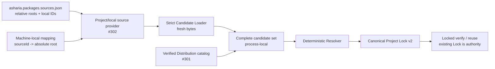

# ADR：Project / Local Package Source Catalog v1

## 状态

Accepted and implemented for #302。

本文补齐 [显式来源 Package Candidate Discovery v1](adr-package-candidate-discovery-v1.md) 的 Project/local 上游位置提供器。
[Engine Distribution Package Catalog Snapshot v1](adr-engine-distribution-package-catalog-snapshot-v1.md) 已独立拥有 verified
Distribution 的 bundled candidates；本文只拥有项目提交的 Project-embedded 来源选择、逻辑 local source 选择，以及调用进程提供的
机器本地路径映射。它不改变 resolver、Project Lock v2 或 Engine Distribution 的所有权。

## 背景

Strict Candidate Loader 已能从一个明确 payload root 生成 fresh manifest/payload evidence，但首次求解不能从 existing Lock 反推所有
可选来源。#301 已为 Engine Distribution 补齐完整 bundled provider，Project/local 仍缺少同等级的显式 provider。如果让调用方扫描
`Packages/`、workspace 父目录或任意约定目录，目录布局、glob、枚举顺序、link、权限与机器路径就会成为隐式 source protocol；如果把
绝对 local path 写入项目文件，团队成员、CI 与日志又会得到不可移植且可能敏感的状态。

因此需要同时冻结两层事实：

- 项目提交 `asharia.packages.sources.json`，只选择 Project-embedded 相对根和 logical local `sourceId`；
- Editor、CLI 或 CI 调用进程显式提供本机 `sourceId -> absolute payload root` 映射，映射不进入项目合同。

这两层只决定“把哪些明确位置交给 strict loader”，不声明 package identity、version、kind、integrity，不选择版本，也不写 Lock。

## 决策

### 1. 持久合同是 `asharia.packages.sources.json` v1

项目根下的 canonical 文件名是 `asharia.packages.sources.json`，schema discriminator 是
`com.asharia.project-package-sources`，`schemaVersion` 是 `1`。文档是 closed union：

```json
{
  "schema": "com.asharia.project-package-sources",
  "schemaVersion": 1,
  "sources": [
    {
      "kind": "local",
      "sourceId": "com.example.workspace.rendering"
    },
    {
      "kind": "project-embedded",
      "relativePath": "Packages/com.asharia.project.gameplay"
    }
  ]
}
```

| source kind | 持久字段 | strict-loader descriptor | 派生 stable source key |
| --- | --- | --- | --- |
| `project-embedded` | project-root-relative `relativePath` | `ProjectEmbeddedCandidateLocation(projectRoot, relativePath)` | `project-embedded:<relativePath>` |
| `local` | logical `sourceId` | `LocalCandidateLocation(sourceId, payloadRoot)` | `local:<sourceId>` |

文件不得保存 absolute root、package `id`、version、kind、manifest/payload integrity、mtime、cache path、credential 或自由文本 origin。
这些 package evidence 只能由 strict loader 从实际 bytes 派生。空 `sources` 是合法的空来源选择；项目是否可解由 resolver 决定。

Canonical writer 按 `(kind UTF-8 bytes, relativePath/sourceId UTF-8 bytes)` 排序，输出 UTF-8 without BOM、LF 与结尾换行。
Schema 和 semantic validator 拒绝未知字段、未知 source kind、重复 source key 与 Unicode case-fold collision。

### 2. Project-embedded 只接受显式、可移植的精确相对根

`relativePath` 必须是 Unicode NFC、以 `/` 分隔的 portable relative path。它不能是绝对路径，不能包含反斜杠、drive/colon、空段、
`.`、`..`、Windows reserved name、尾随空格/点或不可移植字符。路径相对于 source index 所在的 canonical project root；文件名虽可使用
`Packages/...`，但 `Packages/` 不是特殊目录，也不会被扫描。

同一个 index 中的 Project-embedded roots 不能相同、case-fold 冲突或在 lexical containment 上互为祖先。Adapter 和 strict loader
继续证明真实 project root、路径 containment、存在性、directory 类型，以及路径段中没有 symlink、junction 或其他 reparse/link entry。
一个 index entry 只能对应 exact payload root，不能让 loader 搜索其后代寻找 manifest。

### 3. Local source 只持久化逻辑 ID，绝对路径留在进程内

`local.sourceId` 使用既有 package identity 字形规则。调用方为 index 实际选择的每个 local ID 恰好提供一个绝对、机器本地
payload root；缺失、重复或非绝对映射都使整个操作失败。Provider 只读取额外 mapping 的 logical ID 以筛选选择集，不访问或验证
未选 mapping 的 payload root，也不允许它扩大 candidate set。

机器本地映射由未来 Editor Settings、CLI/CI 参数或 workspace configuration adapter 拥有。本文不冻结它的持久文件格式，也不允许
把绝对路径复制进 `asharia.packages.sources.json`、Project Lock、snapshot 的 logical index/entry projection 或稳定 diagnostics。映射可以因机器不同而不同，
但相同 committed index、等价 logical mapping 和稳定 filesystem snapshot 必须产生等价 logical candidates。

### 4. Provider 只组合显式位置并复用 strict loader

语义入口是：

```text
deriveProjectPackageSourceCatalog(
  projectRoot,
  selectedLocalMappings,
  validators
)
  -> success(ProjectPackageSourceCatalogSnapshot)
   | failure(diagnostics)
```

处理顺序固定为：

1. 捕获 absolute、available、non-link canonical project root；
2. 从其根目录读取 non-link regular `asharia.packages.sources.json` exact bytes，并执行 strict UTF-8、schema 与 semantic validation；
3. 按 stable source key 排序 entries，只捕获 index 已选择的 local mappings，并记录每个 selected root 的物理身份；
4. 投影封闭的 `ProjectEmbeddedCandidateLocation` / `LocalCandidateLocation` records；
5. 一次调用既有 `loadPackageCandidates(...)`，让 strict loader 读取 manifest、验证 payload tree 并计算 exact integrity；
6. 证明每个 index entry 恰好产生一个 candidate、没有 unexpected candidate，且 candidate source/root 与 entry、mapping 完全一致；
7. 再读 source index 并重新对证 selected root 的物理身份，要求 index bytes 与步骤 2、root identity 与步骤 3 完全相同；
8. 发布 detached、immutable、process-local snapshot。

Provider 不递归扫描 candidate 父目录，不读取 sibling package，不修复或重写 source index，不缓存、不保留 watcher/open handle，也不调用
resolver。Snapshot 保存 canonical logical index projection、排序后的 entries 与 exact candidate snapshot；candidate 内部为 locked
verification/planning 保留的 opaque payload location 仍是 adapter-local 状态，不得序列化为新的 catalog 文件。

### 5. 所有选中 roots 必须物理不重叠

Strict loader 已拒绝两个不同 source keys 指向同一个 physical root。本文再要求全部已选 Project/local roots 之间不能互相包含；即使一个
local root 恰好位于另一个 Project-embedded root 下，也以 `project-sources.candidate.overlapping-root` fail closed。

这个限制确保一个 payload tree 的 integrity 计算不会把另一个被独立选择的 package 吞入自身，也避免同一 bytes 通过多个 logical
sources 重复进入 resolver。Diagnostic 只列 stable source keys，不列 absolute roots。

### 6. 结果原子、确定且路径脱敏

结果只有两种有效形状：

- 成功：一个完整 snapshot，diagnostics 为空；
- 失败：无 snapshot，至少一个稳定、确定排序的 diagnostic。

任一 index、mapping、root、loader、candidate cardinality/source/root binding 或 overlap failure 都禁止返回 partial candidates。Entries 与
candidates 按 stable source key 排序；diagnostics 按 source key、logical location、code、message 排序。调用方 iterable 顺序、JSON array
顺序、dictionary insertion order 和 filesystem enumeration order 不得改变结果 bytes。

Provider-owned failures 使用 `project-sources.*` namespace；复用的 contract/discovery codes 保留稳定 code，但附加的是 logical
`project-embedded:<relativePath>`、`local:<sourceId>` 或 index context。Rendered diagnostics 不得包含 project root、local payload root、
Windows extended path、底层平台异常原文、object address、时间戳或枚举序号。

### 7. Snapshot 只证明一次同步观察，不能取代 locked verification

Adapter 在 candidate collection 前后比较 source index exact bytes 与 selected root physical identity；strict loader 同时执行
manifest-before/after、regular-file、link 与 observable mutation 检查。整个 root 在 loader 返回后被原子替换也会以
`project-sources.candidate.root-changed` 失败。这能拒绝本次收集中可观察的 drift，但普通 filesystem 不能提供跨多棵目录的事务快照，
因此不承诺消除 TOCTOU。

首次求解将本 snapshot 的 candidates 与 verified Distribution catalog candidates 合并后交给 resolver；resolver 产生 canonical
Project Lock v2。已有 Lock 的 reuse 路径仍以 Lock 的 exact nodes、`source` 和 integrity 为 selected graph authority，并在使用前重新读取、
重 hash。`asharia.packages.sources.json` 可以为未来 update planning 提供候选位置，但不能在 existing locked reuse 中静默增加、替换或
重定向已选来源。



### 8. 本 Slice 不定义 source precedence

Provider 保留不同 stable source keys 产生的所有有效 candidates。相同 `identity + exact version` 同时来自 Project-embedded 与 local 时，
resolver v1 继续以 ambiguity fail closed；Project/local 与 Engine Distribution 使用同一 package identity 时，既有
`resolver.engine.distribution-shadowed` 规则继续拒绝。本文不引入 override、patch、fallback 或“local 总是优先”政策。

## Owner 边界

| Owner | 拥有 | 不拥有 |
| --- | --- | --- |
| Project team | committed `asharia.packages.sources.json` logical selection | machine-local absolute paths、candidate evidence、exact selected graph |
| Settings / CLI / CI adapter | 当前进程的 `sourceId -> absolute root` mapping | 项目 portable source contract、resolver policy、Lock |
| Project/local catalog provider | index/mapping 捕获、explicit descriptor projection、strict-loader handoff、atomic snapshot | directory scan、source precedence、version selection、Lock write |
| Strict Candidate Loader | exact root 的 manifest/payload/safety evidence | 来源枚举、mapping persistence、resolver policy |
| Resolver | complete candidate set 到 canonical exact graph | source IO、mapping、apply transaction |
| Locked verification/reuse | existing Lock source/integrity 的再次对证 | 从 source index 静默更新 Lock |
| 后继 update/apply owner | update policy、impact preview、Project Manifest/Lock transaction 与 recovery | Engine Distribution mutation、source scanning |

当前 `tools/project_package_source_catalog.py` 是仓库内 reference oracle 与 CI 验证实现。正式 Editor、Launcher、Installer、Repair 或
Runtime 不得启动、携带或依赖 Python；产品实现应由 C#/.NET 或 native 代码共享本文 schema、owner、失败、确定性和脱敏合同。

## 拒绝的替代方案

### 扫描固定 `Packages/` 或 workspace 父目录

拒绝。约定目录、glob、extra folders、权限和枚举顺序会变成候选协议；Project/local 也无法共享同一显式 adapter。

### 在项目文件中保存 local absolute path

拒绝。它不可移植，会污染提交、Lock、diagnostics 和缓存 key，并可能泄漏用户名、磁盘布局或 CI secret mount。

### 从 package manifest 反向发现 source roots

拒绝。Manifest 只能描述已经定位到的 package；先递归寻找 manifest 会把扫描重新引入 provider，并使一个坏目录静默改变候选集合。

### 直接把 source index entry 转成 `PackageCandidate`

拒绝。Index 没有权声明 identity/version/integrity；fresh filesystem evidence 必须来自 strict loader。

### 让 Project-embedded 或 local 自动覆盖其他来源

拒绝。Unity 风格的 implicit override 会绕过 resolver ambiguity 与 Distribution shadow protection。Source policy 必须是独立后继设计。

### 用 source index 取代 Project Lock

拒绝。Index 是可选位置输入，不是 exact resolved graph；它不固定 transitive dependencies、versions、Engine generation 或 integrity。

## 非目标

- source precedence、override/patch/fallback 或 resolver policy 修改；
- Lock update planning、minimal-change policy、impact preview、apply、journal、rollback 或 recovery；
- registry、git、download、credential、signature、publisher trust、license 或 acquisition cache；
- local mapping 的持久文件、Settings UI、Package Manager UI 或 CLI command surface；
- Project Manifest direct intent 或 Project Lock v2 wire shape 修改；
- production package/profile declarations、Build Plan、Activation Plan、Launcher、Installer 或 Repair Executor；
- 任意目录扫描、glob、watcher、best-effort partial catalog 或 candidate catalog persistence。

## 实现与验证

#302 保持为一个独立、可回退 Slice：

- `schemas/package-runtime/project-package-sources-v1.schema.json` 冻结 closed v1 wire contract；
- `tools/check_package_contracts.py` 提供 schema/semantic validation、repository discovery 与 canonical writer；
- `tools/project_package_source_catalog.py` 提供 reference provider、immutable snapshot 与 stable diagnostics；
- focused tests 覆盖 portable path、duplicate/case-fold/ancestor collision、canonical writer、空 index、selected-only local mappings、
  missing/duplicate/invalid mapping、link/alias/unavailable roots、Project/local physical overlap、index mutation、diagnostic redaction、candidate
  cardinality/source/root binding、embedded/local root replacement、resolver ambiguity、Distribution shadow 和首次求解到 locked reuse
  的合成交接；
- 提交前仍运行 Python 3.14 全量 tests、package contracts/topology、encoding、doc-sync、diff 与 Conan-before-CMake ClangCL/MSVC gates。

## 外部边界参照

[Cargo workspaces](https://doc.rust-lang.org/cargo/reference/workspaces.html) 允许 root manifest 以相对路径列出 workspace members；
[Cargo path dependencies](https://doc.rust-lang.org/cargo/reference/specifying-dependencies.html#specifying-path-dependencies) 进一步要求 local
path 指向 exact package folder，而不是遍历目录寻找 manifest。这支持 Asharia 的“项目拥有相对根 + exact-root loader”分层。Cargo 同时
支持 glob 与部分自动 membership；Asharia v1 不采纳这些行为，因为它们会扩大 committed source selection 的隐式输入。

[npm workspaces](https://docs.npmjs.com/cli/using-npm/workspaces/) 也把 local packages 显式列在顶层 `package.json` 的 `workspaces`
配置中。Asharia 只借鉴顶层 portable selection，不采用 glob 或 array-order 语义。

[Unity embedded dependencies](https://docs.unity3d.com/Manual/upm-embed.html) 把项目 `Packages` 目录下的 package 视为
embedded，并让 embedded copy 优先于 manifest/cache version。Asharia 保留“项目版本控制且可编辑”的 Project-embedded 概念，但明确
拒绝固定目录隐式扫描和 implicit override：每个 root 必须显式列出，冲突继续由 resolver fail closed。

这些参照只验证 ownership 与显式位置模型的合理性，不表示格式兼容，也不把其 registry、linking、override 或 lock 行为引入 Asharia。

## 后果与后继边界

正向后果：首次求解可以在没有 existing Lock 时组合完整 Distribution 与 Project/local candidates；项目提交保持可移植；机器路径不进入
Distribution ABI、Project Lock 或 diagnostics；坏来源不会静默缩小候选集合；同一 strict loader 可以服务 Editor、CLI 与 CI。

代价：团队必须显式维护每个 Project-embedded root 和 local source ID；每台机器必须配置所选 local mapping；每次 snapshot 都重新读取
和 hash payload；普通 filesystem 仍有 TOCTOU，因此 locked revalidation 不能省略。

后继 Slice 保持独立：

1. Lock update planning、impact preview 与 minimal-change policy；
2. Project Manifest/Lock atomic apply、journal、rollback 与 recovery；
3. local mapping 的产品 Settings/CLI owner；
4. registry/acquisition/trust；
5. Editor Package Manager UI 与 production C#/.NET 或 native 接入。

## 依据

- GitHub #264、#271、#273、#274、#301 与 #302；
- [Package-first 架构](package-first.md)；
- [Project Manifest 与 Package Lock v2 硬切](adr-project-manifest-lock-v2-hard-cut.md)；
- [显式来源 Package Candidate Discovery v1](adr-package-candidate-discovery-v1.md)；
- [Engine Distribution Package Catalog Snapshot v1](adr-engine-distribution-package-catalog-snapshot-v1.md)；
- [Deterministic in-memory Package Resolver v1](adr-package-resolver-v1.md)；
- [Locked Package Graph Verification & Reuse v1](adr-package-lock-verification-v1.md)。
