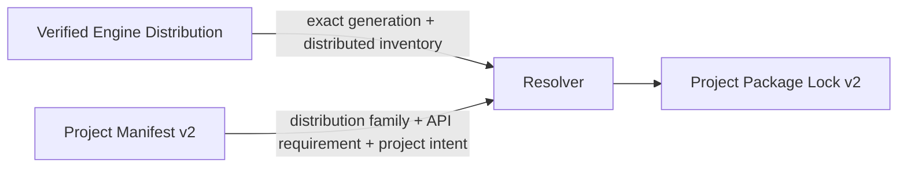

# ADR: Project Manifest 与 Package Lock v2 硬切

## 状态

Accepted（2026-07-14）

## 上下文

Project Manifest v1 只描述项目包选择，resolver 额外接收一个裸的 Engine API 字符串。Package Lock v1 又把随 Engine 发行的 package 当作普通 `bundled` source，重复记录 Distribution ID、相对路径以及 manifest/payload hash。

这使三种所有权混在同一份 lock 中：

- Engine Distribution Manifest 已经拥有发行库存、安装路径与不可变证据；
- Project Manifest 应只拥有项目依赖意图；
- Project Lock 应只固定一次项目图解析结果及其精确 Engine generation 输入。

当前仍处于早期重构阶段，没有需要兼容的已发布项目。因此继续保留 v1 reader、adapter 或双写只会扩大状态空间，并使错误所有权长期固化。

## 决策

Project Manifest 与 Package Lock 直接升级到 v2。canonical 文件名与 schema discriminator 不变，但 `schemaVersion: 1` 立即停止支持。



### Project Manifest v2

Project Manifest 新增 `engine` requirement：

```json
{
  "schema": "com.asharia.project-packages",
  "schemaVersion": 2,
  "engine": {
    "distributionId": "com.asharia.distribution.engine-0-1",
    "apiVersion": {
      "kind": "range",
      "minimumInclusive": "0.1.0",
      "maximumExclusive": "0.2.0",
      "allowPrerelease": false
    }
  }
}
```

项目声明兼容的 Distribution family 与 Engine API 范围，不声明精确 `EngineGenerationId`。切换同一 family 下满足约束的新 generation 不要求编辑项目意图，但会重新解析并产生新 lock。

### Package Lock v2

Lock 的 `inputs.engine` 固定 resolver 实际使用的：

- `distributionId`；
- 精确 `engineApiVersion`；
- 精确 `engineGenerationId`。

发行包 node 只记录 exact identity、version、kind、dependencies 与：

```json
{"kind": "engine-distribution"}
```

它不复制 `root`、`manifestIntegrity` 或 `payloadIntegrity`。这些字段只存在于该 generation 的 Engine Distribution Manifest。

`project-embedded` 与 `local` node 仍记录 source locator 和自己的 manifest/payload integrity，因为这些 payload 由项目开发状态拥有，不属于 Engine 发行库存。

### Resolver 与 verifier

Resolver 必须接收经过 contract 验证且 generation identity 正确的完整 Engine Distribution Manifest，不能再接收裸 Engine API 字符串。它必须：

1. 验证 Project 的 Distribution ID 和 API constraint；
2. 将 `engine-distribution` candidate 精确绑定到 `bundledPackages` inventory；
3. 拒绝项目或 local source 用相同 package ID shadow 发行库存；
4. 由 Distribution evidence 验证发行 candidate 的版本、kind 与 hash；
5. 将精确 generation 输入写入 lock。

Locked verification 重复上述绑定，并拒绝 stale generation、stale project digest、缺失发行 package 或来源 shadowing。验证只读取，不隐式 resolve 或写文件。

## 失败状态

- v1 Project Manifest 或 Lock：schema failure，要求重新生成；
- Project Distribution ID 不匹配：`distribution-mismatch`；
- Engine API 不满足 Project constraint：`api-incompatible`；
- Lock generation 与当前 Distribution 不同：`engine-generation-stale`；
- 发行 inventory 与 candidate evidence 不同：`distribution-candidate-mismatch`；
- project/local candidate shadow 发行 package ID：`distribution-shadowed`。

诊断码由具体阶段添加稳定前缀，例如 `resolver.engine.*` 或 `lock.engine.*`。

## 后果

- 依赖意图、发行库存和精确解析结果各有唯一所有者；
- 更换 Engine generation 会显式使 lock 失效，不会靠重复 path/hash 猜测；
- 日常 local/embedded 开发仍以 source payload 为当前真相；
- 现有 v1 fixtures 和调用方必须一次性迁移，旧文件不会自动升级；
- Host Composition、Source Build Plan 和 Artifact Evidence 在本 Slice 当时继续消费 verified lock graph；后继 #281 已将它们
  硬切为 Effective Session / `VerifiedResolvedGraph` handoff。

## 非目标

本 ADR 不定义 Effective Session、Factory/Activation、动态加载、Engine Distribution installer 或跨版本 ABI。后继
[Effective Session v1](adr-effective-session-v1.md) 已由 verified Distribution、Project Lock v2 与 Host Profile 派生。

## 取代关系

本 ADR 在 Project Manifest / Package Lock 所有权和 wire contract 上取代：

- `adr-project-package-manifest-v1.md`；
- `adr-package-candidate-lockfile-v1.md`；
- `adr-package-resolver-v1.md` 与 `adr-package-lock-verification-v1.md` 中以裸 `engineApiVersion` 和 `bundled` lock evidence 为基础的部分。
