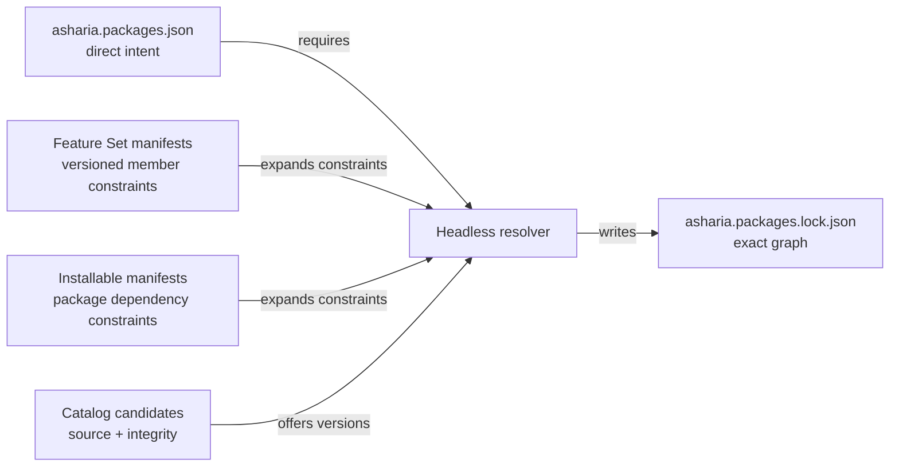

# ADR：Project Package Manifest v1

## 状态

Proposed。本文设计项目根 `asharia.packages.json` 与它直接引用的 Feature Set author contract。当前仓库已经实现
Project Manifest v1 / Feature Set v2 Draft 2020-12 schemas、共享 identity/version definitions、显式 contract dispatcher、
semantic validator、normalized writer 与 synthetic fixtures。后续 [Package Candidate 与 Lockfile v1](adr-package-candidate-lockfile-v1.md)
也已实现 schema/validator/digest/writer 基线；[Host Profile v1](adr-host-profile-v1.md) 的 schema、固定策略与纯数据投影器
同样已落地。尚未实现 resolver、candidate discovery、生产 Feature Set/lockfile 或 Build/Activation Plan。

Installable Capability Package 的作者合同已经由
[Installable Package Manifest v2](adr-installable-package-manifest-v2.md) 定义。本文只处理第二层“项目希望安装什么”，
不改变 `asharia.project.json`，也不定义 exact lock graph。

## 意图

项目需要一份团队可提交、Editor/CLI/CI 可共同编辑的直接依赖声明。它必须回答：

- 项目直接要求哪些完整 installable packages；
- 项目直接保留哪些版本化 Feature Sets；
- 每项直接要求接受什么版本范围；
- 项目为 resolved package 明确覆盖了哪些 typed options。

它不回答候选来自哪里、最终选择了哪个 exact version、间接依赖有哪些、当前 Host 激活哪些 modules，或 CMake 构建
哪些 targets。这些事实分别属于 Candidate/Lock、Host Profile、Activation Plan 与 Build Plan。

## 当前约束

- `asharia.project.json` 已由 `packages/project-core` 管理项目 UUID、资产源、缓存与 discovery；package-runtime 不应依赖
  project-core 才能首次解析 package graph。
- v2 installable manifest 的 dependency 和 option identity 已经冻结；Project Manifest 必须复用相同 version constraint
  语义，不能再发明第二套 range string。
- Package Manager 只允许选择完整 package identity，不允许 target、module、provider、artifact 或 contribution identity。
- Feature Set 是持续存在的版本化 meta-package；Project Template 是一次性项目创建操作，两者不能混用。
- 同一项目 package graph 要供 Editor、Runtime、DedicatedServer 与 AssetWorker 使用，因此 Host Profile 不能写入本文件。

## 决策

### 1. Project Manifest 只保存 direct intent



`asharia.packages.json` 使用独立 discriminator：

```json
{
  "schema": "com.asharia.project-packages",
  "schemaVersion": 1
}
```

它位于项目根，与 `asharia.project.json` 并列。文件不复制 `projectId`：二者由调用方以同一 project root 组合，避免
package-runtime 依赖 project-core UUID/parser，也允许同一 package selection 被明确复制到另一个项目。

计划中的 `engine/package-runtime` 拥有 schema projection、parser、normalized writer 与 diagnostics；Editor Package
Manager 和 CLI 只通过同一 package service 提交 typed edit，不各自维护 JSON 解释。该实现只能依赖 bootstrap-safe
IO/JSON/version primitives，不能依赖 Editor、Vulkan、GLFW、project-core 或可选 Data Model package。

### 2. 使用三个显式、必需的集合

第一版顶层字段固定为：

| 字段 | 语义 |
| --- | --- |
| `directPackages` | 用户直接要求的完整 Installable Capability Packages |
| `directFeatureSets` | 用户直接保留的 Feature Set meta-packages |
| `packageOptions` | 对 resolved installable package options 的项目级显式覆盖 |

三个字段即使为空也必须存在，使缺失字段与“明确没有选择”可区分。条目使用数组对象，不使用 package ID 作为 JSON
object key：这样 duplicate identity 能产生稳定 diagnostic，条目也能在不改变整体 shape 的情况下携带结构化 version
constraint。

`directPackages` 与 `directFeatureSets` 的 item shape 相同：

```json
{
  "id": "com.asharia.system.rendering-vulkan",
  "version": {
    "kind": "range",
    "minimumInclusive": "0.1.0",
    "maximumExclusive": "0.2.0",
    "allowPrerelease": false
  }
}
```

`version` 复用 installable manifest v2 的 `exact` 或 `[minimumInclusive, maximumExclusive)` 结构。Project Manifest 不使用
`^`、`~`、wildcard、OR 或自由 range string。

### 3. package options 独立于 direct dependency

package option 可能属于 Feature Set 或另一个 package 间接引入的 package。若把 options 嵌在 `directPackages` 内，用户仅为
修改配置就必须把间接依赖提升为直接依赖；Feature Set 移除后，这个伪 direct dependency 还会错误保留能力。

因此第一版使用：

```json
{
  "packageId": "com.asharia.system.rendering-vulkan",
  "values": [
    {
      "id": "validation",
      "value": true
    }
  ]
}
```

规则：

- `value` 只允许 JSON boolean、integer 或 string，与 v2 option types 对齐；不允许 object、array、null 或表达式；
- 同一 `packageId` 只能出现一次，同一 package 内 option `id` 只能出现一次；
- schema validator 检查局部 shape；resolver 在读取 candidate manifest 后检查 option 是否已声明、类型是否一致且值合法；
- `packageId` 必须出现在最终 resolved installable package graph 中，否则是 orphan option error；
- 未覆盖的 option 使用 package manifest 声明的 default；Feature Set 第一版不能注入或覆盖 option values。

项目显式 option 是唯一 override 层，不采用“后出现者覆盖”或数组顺序优先级。

### 4. Feature Set 是独立 author contract

Feature Set 继续使用候选发布根的 `asharia.package.json`，但使用独立 discriminator：

```json
{
  "schemaVersion": 2,
  "packageKind": "feature-set",
  "id": "com.asharia.features.standard3d",
  "version": "0.1.0",
  "displayName": "Asharia Standard 3D",
  "description": "A maintained set of complete packages for a standard 3D project.",
  "engineApi": {
    "kind": "range",
    "minimumInclusive": "0.1.0",
    "maximumExclusive": "0.2.0",
    "allowPrerelease": false
  },
  "packages": [
    {
      "id": "com.asharia.system.rendering-vulkan",
      "version": {
        "kind": "range",
        "minimumInclusive": "0.1.0",
        "maximumExclusive": "0.2.0",
        "allowPrerelease": false
      }
    }
  ],
  "featureSets": []
}
```

Feature Set：

- 没有 catalog type、modules、content roots、contributions、shipping class 或 package options；
- 至少包含一个 package 或 nested Feature Set；
- package/Feature Set member identity 各自唯一且不能跨列表重复，member 也不能引用自身；
- 可以组合其他 Feature Sets，resolver 必须检测 cycle；
- 所有成员都是 required constraints，不支持 optional/recommended member；
- 自身也是 exact-version candidate，来源与 integrity 由 Candidate/Lock 记录；
- 不创建 artifact、build target 或 activation unit，但必须作为 exact meta node 保留在 lock graph 中，以解释成员来源。

`com.asharia.features.minimal`、`standard3d`、`editor-authoring`、`dedicated-server` 和 `asset-worker` 使用同一反向域名
identity 规则。Feature Set member constraints 与项目 direct constraints 做交集，不是 override。

### 5. Project Template 不进入 persistent graph

Project Template 可以在创建项目时一次性写入 `directPackages`、`directFeatureSets`、`packageOptions`、设置与样例内容；执行后
template recipe 不保留在 package graph 中。若一个 `catalogType: template` installable package 的内容确实需要长期存在，
它可以像其他 installable package 一样作为 `directPackages` 条目；这与一次性 Project Template workflow 是两个概念。

### 6. source、integrity 与 Host 选择不进入 Project Manifest

- bundled candidates 由 engine distribution catalog 提供；
- project-embedded candidates 由约定的项目 package roots 发现；
- local candidate roots 由 workspace/CLI source configuration 提供；
- 本次实际选择的 source reference、manifest digest 和 payload integrity 写入 lockfile。

Project Manifest 不保存机器绝对路径，也不使用 source 优先级实现版本 override。同 ID/version 的多来源选择、source
priority 与 ambiguity failure 由 Candidate/Lock ADR 冻结。

Host Profile、platform、build profile、launch profile 和 module filters 同样不进入本文件。一份 direct graph 必须能为多个
Host 分别生成 plans。

### 7. constraint 合并没有隐式优先级

resolver 收集以下约束并求交集：

1. project direct package constraints；
2. project direct/nested Feature Set member constraints；
3. installable package dependencies；
4. engine API 与 candidate compatibility。

同一 package 被 direct selection 和 Feature Set 同时要求时，direct selection 不覆盖 Feature Set，只增加一个约束。交集为空
必须失败并列出全部 constraint origins。删除 direct package 只删除该直接约束；若 Feature Set 或其他 package 仍要求它，
resolved package 继续存在。删除 Feature Set 也只删除由该 meta graph 引入的约束。

### 8. 编辑与 lock 更新是一个 package transaction

Editor/CLI 对内存中的 proposed manifest 执行 add/remove/update/option edit，先完成 schema、candidate、constraint 与 option
验证，再生成 matching lock。成功后 normalized manifest 与 lock 通过临时文件和 replace 提交；失败时两份已提交文件都不改变。

手工编辑 `asharia.packages.json` 是允许的，但会使已有 lock 变为 stale。后续 lockfile 必须保存 normalized project manifest
digest；build、cook、runtime 的 locked mode 检测到 digest 不一致时 fail closed，并提示运行 resolve，不能静默继续使用旧图。
若进程在两次文件 replace 之间崩溃，digest mismatch 提供恢复证据；真正的跨文件 journal/rollback 由 lockfile/write workflow
设计补充，不能用“最后写入时间”猜测一致性。

### 9. 规范化与 diagnostics

parser 对数组顺序不赋予语义。normalized model 与 writer 使用：

- `directPackages`、`directFeatureSets` 按 `id` 排序；
- `packageOptions` 按 `packageId` 排序；
- option values 按 `id` 排序；
- UTF-8 without BOM、LF、两空格缩进、结尾换行；
- resolver input digest 基于 normalized model，不基于原始 whitespace。

validator 至少提供以下 stable diagnostics：

- missing/unknown field 与 unsupported schema；
- invalid package/Feature Set/option identity；
- duplicate identity，包括跨 direct package/Feature Set 列表冲突；
- invalid/empty version range；
- duplicate option override 与非法 option JSON type；
- direct selection 实际解析到 source-boundary、module、artifact 或错误 package kind；
- orphan/unknown/type-mismatched package option；
- Feature Set empty membership、unknown member、kind mismatch 与 cycle。

diagnostic 包含 manifest path、JSON Pointer、stable code、相关 identity；跨文档错误还要包含 constraint/member origin。

## 第一版 logical shape

```json
{
  "schema": "com.asharia.project-packages",
  "schemaVersion": 1,
  "directPackages": [
    {
      "id": "com.asharia.feature.advanced-camera",
      "version": {
        "kind": "range",
        "minimumInclusive": "1.2.0",
        "maximumExclusive": "2.0.0",
        "allowPrerelease": false
      }
    }
  ],
  "directFeatureSets": [
    {
      "id": "com.asharia.features.standard3d",
      "version": {
        "kind": "exact",
        "version": "0.1.0"
      }
    }
  ],
  "packageOptions": [
    {
      "packageId": "com.asharia.system.rendering-vulkan",
      "values": [
        {
          "id": "validation",
          "value": true
        }
      ]
    }
  ]
}
```

该 fixture 只展示 shape，不表示这些 package candidates 当前已经存在。

## 拒绝的替代方案

### 把 package graph 塞进 `asharia.project.json`

拒绝。它会让 bootstrap package-runtime 依赖 project-core/schema/archive，并把项目身份/资产配置与 package resolution
生命周期绑在一起。

### 在 Project Manifest 保存 exact transitive graph

拒绝。direct intent 与 resolution 会混合，升级产生大面积手工 diff，也无法区分用户选择和间接依赖；exact graph 属于
`asharia.packages.lock.json`。

### 用 JSON object map 保存 dependencies/options

拒绝。重复 JSON keys 的处理依赖 parser，难以生成精确 duplicate diagnostic；结构化数组更适合稳定排序、origin 与未来迁移。

### 用统一 `requirements` 数组加 `kind` discriminator

暂不采用。它能把两类 direct identity 放在一个集合中，但会给每个条目增加重复 `kind`，并弱化 Package Manager 中
Packages/Feature Sets 两个明确操作面。第一版只有这两类 persistent requirements，两个封闭数组更直接；若未来出现第三种
真实 persistent requirement，再通过 schema version 评估统一表示，而不是提前预留自由 kind。

### 把 option 嵌进 direct package 条目

拒绝。它不能配置 Feature Set 间接引入的 package，并会诱导伪 direct dependency。

### 让 Feature Set 展开后消失

拒绝。那是 Project Template 语义；Feature Set 必须持续约束成员，才能安全解释升级、移除和 `Required by Feature Set`。

## 非目标

- 不实现 resolver、candidate discovery、acquisition、lockfile 或 dependency conflict algorithm；
- 不定义 Host Profile、Build/Launch Profile 或 module/contribution filtering；
- 不支持 optional dependencies、provider capability resolution、source override 或 registry policy；
- 不修改 `asharia.project.json` 或现有 project-core C++ API；
- 不创建生产 Feature Set 或把当前 source boundaries 暴露给项目选择。

## 当前验证证据与后续门禁

当前合同基线已经提供：

- Project Manifest 与 Feature Set Draft 2020-12 schemas；
- positive fixtures：empty project、direct package、nested Feature Set、indirect package option；
- negative fixtures/tests：duplicate/cross-kind identity、invalid range、complex option value、empty/self Feature Set 与
  caller-provided selected Feature Set graph cycle；
- normalized writer 的 input-order/whitespace 等价测试；
- v1 source-boundary、v2 installable capability、v2 Feature Set 与 project schema 的 dispatcher isolation tests；
- 当前 package topology、encoding、doc sync 与 whitespace gates。

internal fragment/kind mismatch、unknown Feature Set member、orphan/unknown/type-mismatched option 都需要先读取候选 manifest 或
resolved graph；它们属于下一步 candidate catalog/resolver 的跨文档门禁，不能由本地 author-contract validator 猜测。
Feature Set graph helper 只审计调用方提供的“每个 identity 一个已选版本”集合；多版本候选选择和版本约束求解仍由 resolver 负责。

## 依据

- [Unity Project Manifest](https://docs.unity.cn/2023.1/Documentation/Manual/upm-manifestPrj.html) 将 project direct dependencies
  与 package manifests/lock 分开。
- [Unity dependency resolution](https://docs.unity.cn/Manual/upm-dependencies.html) 以 project direct dependency 为入口，
  成功求解后写 lockfile 保证确定性。
- [Unity Feature Set details](https://docs.unity3d.com/cn/2023.2/Manual/fs-details.html) 将 Feature Set 作为版本化、可持续管理的
  package 集合，并允许不冲突的显式版本请求参与求解。
- [Unity package removal](https://docs.unity3d.com/cn/2023.2/Manual/upm-ui-remove.html) 区分删除 direct dependency 与仍被
  Feature Set/其他 package 要求的间接安装状态。
- [Cargo dependency specification](https://doc.rust-lang.org/stable/cargo/reference/specifying-dependencies.html) 与
  [Cargo resolution](https://doc.rust-lang.org/cargo/reference/resolver.html) 支持 manifest constraints 与 exact lock 结果分层。
- [O3DE project configuration](https://docs.o3de.org/docs/user-guide/project-config/) 在 project configuration 中记录启用的 Gems
  与可选 version specifiers；Asharia 保留该“项目意图”分层，但不把它并入现有资产 project descriptor。
