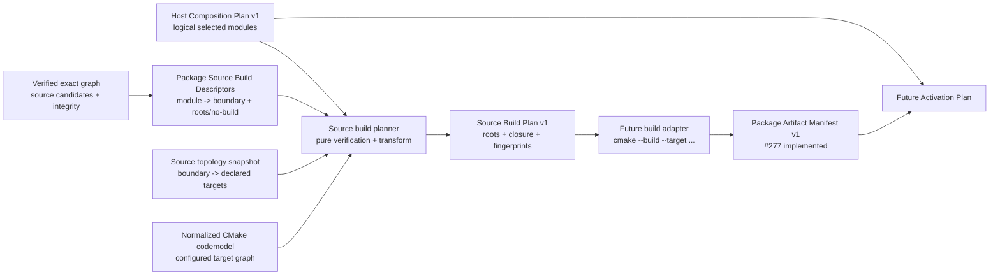

# ADR：Source Build Plan v1

## 状态

Accepted and implemented for #276。本 ADR 冻结 source build descriptor、规范化 CMake codemodel evidence 与 canonical Source Build Plan 的职责边界；closed schemas、只读 reader、pure planner、候选快照/锁定复验和 synthetic tests 已落地。后继 [Package Product & Artifact Evidence v1](adr-package-product-artifact-evidence-v1.md) 已为 #277 冻结 logical product 与 exact file evidence，[Package Artifact Collection & Publication v1](adr-package-artifact-collection-publication-v1.md) 已为 #278 实现显式流式收集与不可变 publication，[Effective Session v1](adr-effective-session-v1.md) 已在 #281 将 planner 的 graph input 硬切为 `VerifiedResolvedGraph`；但仓库仍没有生产 installable descriptors、上游 catalog/index、Distribution assembly 或执行 build/activation 的 adapter，因此不能据此宣称完整 Package Manager 已可供生产使用。

本文接续 [Host Composition Plan v1](adr-host-composition-plan-v1.md) 与 [Installable Package Manifest v2](adr-installable-package-manifest-v2.md)。前者已经给出某个 Host 的 exact logical packages、modules、entries、contributions 与 build-affecting options；后者已经决定 portable author manifest 不携带 CMake target、artifact 或 runtime lifecycle 细节。当前缺少的是一层经过真实 buildsystem 对证、但仍然不执行构建的 source build handoff。

## 问题

Host Composition Plan 可以回答“这个 Host 逻辑上选择了哪些 module”，但不能回答：

- 哪些当前 source boundaries 实现这些 logical modules；
- 哪些真实 CMake targets 是后继构建适配器的 roots；
- contract-only、header-only 或纯内容 module 是否明确不需要 native build；
- descriptor 中声明的 target 是否仍存在于本次 configure 生成的 CMake buildsystem；
- 某个 root 的真实 CMake build dependency closure 是什么；
- 当前 plan 对应哪一份 descriptor、topology、codemodel configuration 与 toolchain evidence；
- 如何在不泄漏 absolute paths、reply filenames、opaque target IDs 和时间戳的情况下得到 byte-equivalent handoff。

直接把 CMake targets 写回 portable package manifest 或 Host Composition Plan 会混合三种不同权威：

1. installable package graph：用户选择、版本解析、logical modules 与 portability；
2. configured build graph：当前平台、配置和工具链下实际存在的 CMake targets 与 build dependencies；
3. runtime activation graph：verified artifacts、factories、scope、phase、service dependencies 与 rollback。

Source Build Plan 只连接前两者，不提前定义第三者。

## 资料验证与当前实测

| 资料或证据 | 可确认的事实 | 对 Asharia 的约束 |
| --- | --- | --- |
| [CMake 3.28 File API](https://cmake.org/cmake/help/v3.28/manual/cmake-file-api.7.html) | client 在 build tree 中声明 query；CMake 在 generate 阶段写 reply index；codemodel v2 通过 index 中的 `jsonFile` 引用配置和 targets；target `id` 格式未指定 | reader 必须跟随显式 reply index 引用，不能猜 reply filename、解析 opaque ID 或把 build tree 当持久身份 |
| [CMake File API current documentation](https://cmake.org/cmake/help/latest/manual/cmake-file-api.7.html) | target object 暴露 type、artifacts 与 build dependencies；dependencies 不保证只是 direct link dependencies | closure 只能称为 CMake build evidence，不能冒充 package、link 或 activation graph |
| [CMake 3.28 build CLI](https://cmake.org/cmake/help/v3.28/manual/cmake.1.html#build-a-project) | `cmake --build --target <tgt>...` 接受一个或多个 target names | plan 可以输出唯一 root names，命令、cwd、jobs、环境和执行仍属于后继 adapter |
| [Cargo `metadata`](https://doc.rust-lang.org/cargo/commands/cargo-metadata.html) | package definitions/targets 与 resolved package nodes 分层表达 | portable package graph 与 backend build-target evidence 应分开建模 |
| 当前 `msvc-debug` configure | CMake 3.28.0-rc5、Ninja、codemodel v2.6；42 个 buildsystem targets：23 `STATIC_LIBRARY`、14 `UTILITY`、4 `EXECUTABLE`、1 `SHARED_LIBRARY` | v1 必须以仓库当前可获得的 2.6 facts 为基线，不依赖较新 codemodel 才有的抽象 target 表达 |
| 当前 codemodel target samples | `asharia-rendergraph`、`asharia-rhi-vulkan` 和 `asharia-renderer-basic-vulkan` 暴露真实 target dependencies；shader aggregation 以 `UTILITY` target 出现；artifacts 通常为 build-tree relative | generation 应由真实 CMake `UTILITY` roots 表达；plan 不需要发明 command array |
| 当前 topology manifests | `asharia::renderer_basic` 等 alias/INTERFACE API 身份存在于 source-boundary inventory，但没有出现在 codemodel v2.6 buildsystem targets 中 | descriptor 使用真实非 alias CMake target name；无需构建的 logical module 必须显式 `no-build` |

本次实测只用于验证可行性和边界，不是完整冷构建基准；#276 不调整 CMake presets、module scanning、clang-tidy、PCH、unity 或 compiler cache。

## 决策概览

Source build control plane 由三个独立、版本化的值对象组成：

1. **Package Source Build Descriptor v1**：随 exact source package candidate 发现并验证，把 logical modules 绑定到 source-boundary identities 与 CMake build roots；
2. **CMake Codemodel Snapshot v1**：把一次成功 configure 的 File API reply 规范化为 machine-neutral evidence；
3. **Source Build Plan v1**：纯 planner 对证 Host Composition、verified descriptor snapshots、source topology 与 codemodel 后输出的 canonical handoff。

Package Product Declaration 与 Artifact Manifest 已由 #277 的独立 ADR 实现；#278 已实现 installed/acquisition root 的本地
collector/publication。本文当时将 Engine Distribution/Effective Session、factory/scope/lifecycle contract 与 Activation Plan
保持为后续独立设计；其中 Distribution/Effective Session 已由 #279–#281 实现。



## 1. Package Source Build Descriptor v1

### 1.1 独立文件与 exact identity

源码发行候选可以在 package root 提供：

```text
asharia.package.build.json
```

顶层 discriminator 冻结为：

```json
{
  "schema": "com.asharia.package-source-build",
  "schemaVersion": 1,
  "package": {
    "id": "com.asharia.system.rendering-vulkan",
    "version": "0.1.0"
  }
}
```

`package.id` 与 `package.version` 必须精确等于同一 candidate 的 installable author manifest。descriptor 不拥有版本选择，也不允许 version range、fallback package 或 implicit current-directory identity。

### 1.2 每个 logical module 恰好一个 binding

descriptor 必须为 author manifest 声明的每一个 logical module 提供恰好一个 binding，而不只是为当前 Host 已选 modules 提供 binding。这样 descriptor/manifest drift 可以在 candidate 验证阶段发现，不依赖某个恰好覆盖该 module 的 Host Profile。

proposed shape：

```json
{
  "modules": [
    {
      "moduleId": "renderer.frontend",
      "sourceBoundaries": [
        "com.asharia.renderer-basic"
      ],
      "build": {
        "kind": "no-build"
      }
    },
    {
      "moduleId": "renderer.vulkan",
      "sourceBoundaries": [
        "com.asharia.renderer-basic-vulkan"
      ],
      "build": {
        "kind": "target-roots",
        "targets": [
          {
            "name": "asharia-renderer-basic-vulkan",
            "type": "STATIC_LIBRARY"
          }
        ]
      }
    }
  ]
}
```

约束：

- `moduleId` 在 descriptor 内唯一，并与 author manifest module ID 集合完全相等；
- `sourceBoundaries` 非空、去重、按 UTF-8 排序，引用 current source-boundary manifest 的稳定 `name`，不使用目录路径；
- `build.kind` 是 closed union：`target-roots` 或 `no-build`；
- `target-roots.targets` 非空、按 target name 排序，target name 唯一；
- `no-build` 不允许 `targets`、command、artifact 或隐含 fallback；
- target 使用 `add_library()` / `add_executable()` / `add_custom_target()` 的真实 canonical name，不使用 `asharia::<name>` alias；
- target entry 同时声明 expected CMake `type`，用于检测 target 被替换或语义漂移。

### 1.3 buildable target types

v1 接受以下 root type：

- `EXECUTABLE`；
- `STATIC_LIBRARY`；
- `SHARED_LIBRARY`；
- `MODULE_LIBRARY`；
- `OBJECT_LIBRARY`；
- `UTILITY`。

`INTERFACE_LIBRARY` 不作为可构建 root。当前 CMake 3.28 codemodel v2.6 不暴露 alias/abstract INTERFACE target；contract/header-only module 应使用 `no-build`，或者绑定到实际产生产物/生成步骤的真实 root。

### 1.4 不设计 platform variant mini-language

Host Composition Plan 已经按 `hostKind` 与 `targetPlatform` 筛选 logical modules。本次 configure 也只暴露当前 platform/configuration 的实际 target graph。因此 v1 要求所绑定的 canonical target name 在当前 codemodel 中存在；missing target fail closed。

若未来同一 logical module 在不同平台必须使用不同 target name，应优先建立稳定 CMake facade target；确有必要时再以新的 schema version 引入可审计 variant 规则。v1 不提前发明 platform expression language。

### 1.5 generation 仍由 CMake 拥有

descriptor 不包含任意 shell command、working directory、environment 或 generation-step command array。当前 shader generation 已由 CMake `UTILITY` targets 表达；需要生成步骤的 module 应把相应 `UTILITY` target 作为 root 或由其真实 build dependency closure 纳入。

这样 command quoting、generator behavior、incremental state 和依赖调度继续由 CMake 拥有，Package Manager 不维护第二份构建脚本。

## 2. Descriptor 必须属于 verified candidate snapshot

### 2.1 discovery 一次性捕获

`PackageCandidate` 携带 optional、只读的 parsed build descriptor snapshot、exact bytes 与 byte integrity。Candidate Discovery 在读取 author manifest 和计算 payload tree integrity 的同一 discovery transaction 中读取 descriptor，并在 hashing 前后按现有 mutable-root 防护重新验证必要证据。

理由：

- descriptor 文件本身已经被 payload tree integrity 间接绑定；
- candidate 的 byte integrity 精确绑定 discovery/locked verification 使用的 descriptor bytes；Source Build Plan 记录 normalized descriptor-set integrity，使仅格式或声明顺序变化不会改变 canonical handoff；
- planner 只消费成功 verified graph 中的 in-memory candidate snapshots，不重新打开 mutable payload roots；
- locked reuse 刷新 payload integrity 时也会覆盖 descriptor 变更，不需要建立旁路 freshness 规则。

resolver 不读取 descriptor 语义，也不根据 CMake target 改变 package version resolution。descriptor 是 build handoff evidence，不是 dependency solver 输入。

### 2.2 descriptor availability

Source Build Plan v1 只覆盖明确具有 source build descriptor 的 selected source packages：

- 如果某个 Host 选中了 package module，则该 exact candidate 必须有 matching descriptor；
- descriptor 可为某个 selected module 声明 `no-build`；
- Host Composition 中零 module 的 package 不因此产生 build roots；
- prebuilt、installed 或 artifact-only distribution 等待未来 Artifact Manifest / acquired artifact pipeline，不通过猜测 CMake target 接入；
- planner 不从 source directory、manifest `targets` 或命名约定合成缺失 descriptor。

## 3. Source topology snapshot 是独立输入

`asharia.package.build.json` 引用的是 source-boundary identity，而 CMake codemodel 不保留该 ownership identity。planner 因此还需要由 `tools/check_package_topology.py` 同一规则产生的 canonical topology snapshot，至少包含：

- source-boundary `name`；
- normalized repository-relative package identity，不进入最终 plan 的 absolute path；
- declared production targets、target roles 与 declared target dependencies；
- planned ownership root；
- topology schema/tool contract version 与 canonical fingerprint。

验证规则：

- 每个 descriptor `sourceBoundaries` identity 在 topology 中恰好存在一次；
- binding 中的每个 root 必须由至少一个列出的 boundary 声明且 role 不是 `test`；
- 同一 root 不得被无关 exact package descriptor 争用；
- topology 中的 declared dependencies 用于 drift diagnostics，不覆盖 CMake codemodel 的 configured dependency facts；
- current source-boundary manifest 仍不是 Package Manager 安装条目。

第一版实现可以扩展现有 topology inventory 的机器输出，而不是另建一套目录扫描器。

## 4. CMake Codemodel Snapshot v1

### 4.1 adapter 是只读的

File API adapter 不运行 Conan、CMake configure 或 build。调用方负责：

1. 按 Conan-before-CMake workflow 准备 toolchain；
2. 在 build tree 中声明 codemodel-v2 query；
3. 成功运行 configure/generate；
4. 把本次显式 reply index path 与 expected build/configuration evidence 交给 reader。

reader 只读取该 index 引用的 reply objects。它不得按 filename 猜“最新 reply”，不得扫描任意旧 object 后自行拼接 snapshot。

为了降低读取期间 reply 被替换的 TOCTOU 风险，adapter 在读取所有 referenced objects 后重新读取并比较 index bytes/fingerprint；变化即失败，不输出 partial snapshot。

### 4.2 opaque identity 只在一次读取中使用

File API target `id` 可以用于本次 snapshot 内把 dependency references 连接到 target objects，但：

- 不解释 `id` 格式；
- 不把 `id` 写入 descriptor 或 Source Build Plan；
- 不把 reply/index filenames 当 stable identity；
- dependency reference 无法解析、重复映射到不同 target 或跨 configuration 混用时 fail closed。

### 4.3 规范化字段

proposed snapshot identity：

```json
{
  "schema": "com.asharia.cmake-codemodel-snapshot",
  "schemaVersion": 1,
  "configuration": "Debug",
  "generator": {
    "name": "Ninja",
    "multiConfig": false
  },
  "toolchain": {
    "compilerId": "MSVC",
    "compilerVersion": "...",
    "targetSystem": "Windows",
    "targetArchitecture": "x86_64"
  },
  "targets": []
}
```

每个 normalized target 至少保留：

- canonical `name`；
- CMake `type`；
- sorted unique dependency target names；
- normalized build-tree-relative artifact evidence（若 File API 提供）；
- 必要时的 source/build relationship diagnostics，但不进入 canonical plan。

snapshot 删除或拒绝：

- absolute source/build paths；
- filesystem timestamp；
- reply/index/target object filename；
- opaque target IDs；
- command line、environment 和 generator-local transient state。

artifact evidence 只用于证明配置输出 facts 与诊断 descriptor drift；Source Build Plan v1 不复制 artifact paths。最终产品的 hash、kind、ABI、location 与 provenance 属于未来 Artifact Manifest。

### 4.4 configuration 与 toolchain evidence 必须显式

单配置 generator 仍要记录 non-empty configuration；多配置 generator 必须选择恰好一个 configuration object，禁止把多个 configuration 的 targets 合并为一张模糊图。

toolchain evidence 是调用方提供并由 adapter 对证的规范化值，不从 absolute compiler path 推导持久身份。至少包含 compiler family/version、target system/architecture 与 generator identity；未来需要 ABI 级兼容判断时升级独立 toolchain contract，不向 v1 塞入本机环境快照。

## 5. Source Build Plan v1

### 5.1 planner API 与输入

语义 API：

```text
planSourceBuild(
  hostCompositionPlan,
  verifiedGraph,
  topologySnapshot,
  cmakeCodemodelSnapshot
) -> SourceBuildPlanResult
```

planner 是 pure transform：不读 payload roots、不访问 build tree、不运行 resolver、不 configure/build、不写文件。

成功前必须确认：

- Host Composition 的 lock/project/profile fingerprints 与 verified graph 仍一致；
- 每个 selected exact package 对应同一个 verified candidate；
- candidate descriptor 的 exact package ID/version 与 author manifest 一致；
- descriptor module set 与 author manifest 完全一致；
- selected module 的 source boundaries 与 roots/no-build 通过 topology 对证；
- target roots 在 codemodel 中存在、type 相等且可构建；
- codemodel configuration/toolchain evidence 与 requested build context 一致；
- 所有 input snapshots 的 canonical integrity 可重算且匹配。

### 5.2 canonical output

顶层 discriminator：

```json
{
  "schema": "com.asharia.source-build-plan",
  "schemaVersion": 1
}
```

成功 plan proposed fields：

```text
SourceBuildPlan
  host
    hostKind
    targetPlatform
  configuration
    name
    generator
    toolchain
  packages[]
    id
    version
    modules[]
      moduleId
      sourceBoundaries[]
      build
        kind: target-roots | no-build
        targets[]
  buildRoots[]
    name
    type
  targetClosure[]
    name
    type
    dependencies[]
  buildOptions[]
    packageId
    optionId
    type
    value
    affects
  inputs
    hostCompositionIntegrity
    descriptorSetIntegrity
    topologyIntegrity
    codemodelIntegrity
    configurationIntegrity
  integrity
    algorithm
    digest
```

`packages` 与 `modules` 保留 Host Composition 的 dependency-first canonical order，便于 diff/provenance；每个 module 内的 source boundaries/targets、全局 `buildRoots`、`targetClosure` 和 dependency names 按 UTF-8 排序。

`buildOptions` 只保留 Host Composition effective options 中 `affects` 包含 `build` 的项，并保留 typed value 与完整 `affects` 声明。planner 不把 option 翻译成 `-D`、environment 或 compiler flag；该映射需要未来显式 build adapter contract。

### 5.3 roots 与 closure

`buildRoots` 是所有 selected `target-roots` bindings 的稳定去重集合。后继 adapter 可以把 names 作为：

```text
cmake --build <build-dir> --target <root-1> <root-2> ...
```

的逻辑输入，但 Source Build Plan 不保存 `<build-dir>`、完整命令、jobs、verbosity 或环境。

`targetClosure` 从每个 root 沿 codemodel build dependencies 遍历，并包含 roots 自身。它用于：

- 证明 roots 在当前 configured graph 上闭合；
- 解释生成 target 或内部库为何会被构建；
- 检测 dangling/duplicate/type drift；
- 为后续 build report 提供 expected target set。

它不定义：

- package dependency graph；
- logical module dependency order；
- direct link interface；
- build executor 的实际调度顺序；
- runtime activation/startup/shutdown order。

CMake 继续拥有真实执行和增量判断。

### 5.4 fingerprints

所有 integrity 使用现有 contract 的 canonical JSON、UTF-8 bytes 与明确算法标识。`descriptorSetIntegrity` 对按 exact package ID/version 排序后的 descriptor canonical bytes 计算，不能只 hash filename 或 directory。

plan fingerprint 证明逻辑输入与 configured evidence 的确定关联，但不承诺 mutable source/build tree 在未来永不变化。执行构建前，adapter 必须刷新所需 candidate integrity 与 codemodel/configuration evidence，或消费不可变 acquisition；不能仅凭旧 plan fingerprint 运行已变化的目录。

## 6. 失败、原子性与确定性

```text
SourceBuildPlanResult
  plan: SourceBuildPlan | None
  diagnostics: stable tuple<Diagnostic>
  succeeded: bool
```

不变量：

- 成功时 `plan` 非空且 diagnostics 为空；
- 失败时 `plan` 为空且 diagnostics 非空；
- 不返回 partial packages、roots 或 closure；
- 不修改 Host Composition、verified candidates、descriptors、topology 或 codemodel snapshots；
- semantically unordered arrays、candidate iterables 与 File API object traversal order 的排列不改变 plan bytes 或 diagnostic bytes；
- diagnostics 不包含 adapter-local absolute paths、opaque IDs 或 reply filenames。

至少覆盖以下 stable diagnostic families：

- `build.input.*`：forged/incomplete/stale Host Composition、verified graph、topology、codemodel 或 configuration；
- `build.descriptor.*`：schema、identity、module coverage、duplicate binding、unknown boundary、非法 union 或 closed-contract 字段；
- `build.target.*`：unknown root、wrong type、non-buildable/alias root、unowned root、dangling dependency；
- `build.codemodel.*`：malformed index/reply、configuration ambiguity、opaque reference resolution、reply changed during read；
- `build.plan.*`：closure、canonicalization 或 integrity invariant。

schema 是 closed contract，明确拒绝：

- absolute artifact/source/build/compiler paths；
- executable command、shell、cwd、environment、jobs；
- installed/exported artifact discovery；
- factory symbol、dynamic library entry point；
- scope、phase、thread affinity、lease、rollback、unload；
- service dependency 或 activation order。

## 拒绝的替代方案

### 直接从 source-boundary manifest 的 `targets` 生成 plan

拒绝。current topology manifest 是仓库边界审计事实，不是 exact installable package 的 module-to-build binding；它也不能证明 target 在本次 configured codemodel 中存在。

### 把 CMake fields 加进 portable installable manifest

拒绝。这会让 package identity 绑定单一 backend，并污染 lock/Host Composition。source distribution 的 backend mapping 应保持独立 descriptor。

### 把 `asharia::` aliases 当 build roots

拒绝。alias 是 consumer-facing CMake identity，不保证是 generator 暴露的 buildsystem target；当前 codemodel v2.6 已证明 interface/alias target 不可按此使用。

### 从 package dependencies 推导 target closure

拒绝。package graph、source-boundary dependencies、CMake build dependencies 和 runtime service dependencies 是不同图；推导会隐藏 generator/custom target 等真实 edges。

### 在 descriptor 中保存任意 generation commands

拒绝。它会复制 CMake 的命令、依赖和增量语义，并引入 quoting、platform 与安全边界。真实 `UTILITY` root 是 v1 的唯一 generation handoff。

### 把 codemodel artifacts 直接当 Artifact Manifest

拒绝。File API artifact path 不是已验证的 distribution product contract，也不提供 package-level hash、ABI、acquisition provenance、factory 或 staging semantics。

### planner 自动运行 CMake 或 build

拒绝。纯 planner 必须 deterministic、可单元测试并无外部副作用；configure/build 属于显式 adapter/executor。

## 非目标

- 不执行 Conan、CMake configure/build/install/export/CPack；
- 不修改 root/package CMakeLists、presets 或 compiler gates；
- 不实现 source acquisition、registry/download、lock update/apply；
- 不为全部 current source boundaries 批量编写未来 installable package/build descriptors；
- 不定义 Artifact Manifest、stage/cook/product layout 或 runtime binary discovery；
- 不定义 Factory / Scope / Lifecycle contract、Activation Plan 或 Host Runtime；
- 不解释 Conan dependency graph；`conan.lock` 继续作为第三方依赖权威；
- 不承诺 native hot load/unload；
- 不把 compile performance 调整并入本 Slice。

## #276 实现结果

#276 作为一个 PR-sized、contract-first Slice 落地了：

1. `package-source-build-v1`、`source-topology-snapshot-v1`、`cmake-codemodel-snapshot-v1` 与 `source-build-plan-v1` closed schemas/models；
2. candidate discovery/locked verification 对 optional `asharia.package.build.json` exact bytes、integrity、payload tree 与 author-manifest binding 的捕获和复验；
3. topology machine snapshot 中供 planner 使用的 normalized target ownership/dependency facts；
4. 只消费显式 reply index 的 CMake File API codemodel v2 reader，以及 machine-neutral normalization/fingerprint；
5. 只转换 verified in-memory evidence 的 pure planner、CMake build closure、build-affecting option projection 与 stable diagnostics；
6. malformed/stale/TOCTOU/alias/type/ownership/no-build/determinism/atomicity/immutability negative tests；
7. synthetic Discovery → Resolve → Effective Session → Host Composition → Source Build handoff 与当前 MSVC codemodel read-only smoke；
8. repository contract/test workflow 对这些 contracts 与 planner tests 的持续门禁。

开发阶段优先运行受影响 Python/contract tests，避免文档或纯 planner 小改反复触发无收益的 native rebuild；最终提交前不降低既有完整门禁。

## 后续边界

#276 之后的边界按顺序设计；其中前 3 项已经完成合同层闭环：

1. **Product Declaration + Artifact publication**：#277 已绑定 logical products 与 exact file evidence；#278 已从显式
   quiescent roots 流式发布不可变 package artifact generation；ABI 与 acquired/prebuilt trust 仍后置；
2. **Engine Distribution + Effective Session**：#279–#281 已分离只读发行库存与 Project Lock，冻结 `EngineGenerationId`、
   Ready/Upgrade/Repair/SafeMode 与 verified graph handoff；Bootstrap UI/进程仍后置；
3. **Factory / Scope / Lifecycle + static provider binding**：Factory Declaration 与 Host Activation Blueprint 保持 logical/artifact-neutral；
   #286 通过独立 source sidecar 与派生 Binding Plan，把 selected factory 对证到本 Source Build Plan 已选择的静态 target 和
   type-safe C++ entry point；
4. **Generated composition root + post-build receipt**：消费 verified Binding Plan 生成薄注册源，构建后再把实际 registration table
   与 exact host artifact generation 对证；
5. **Host Runtime**：执行 activation/deactivation 并拥有 instance、contribution handles、lease、rollback 与 shutdown。

Source Build Plan 只为 build adapter 提供 verified roots/closure，不替代以上任何权威。

## 相关资料

- [Host Composition Plan v1](adr-host-composition-plan-v1.md)
- [Installable Package Manifest v2](adr-installable-package-manifest-v2.md)
- [Package Candidate / Lockfile v1](adr-package-candidate-lockfile-v1.md)
- [Package Candidate Discovery v1](adr-package-candidate-discovery-v1.md)
- [Locked Package Graph Verification & Reuse v1](adr-package-lock-verification-v1.md)
- [Effective Session v1](adr-effective-session-v1.md)
- [Package Product & Artifact Evidence v1](adr-package-product-artifact-evidence-v1.md)
- [Static Factory Provider Bindings v1](adr-static-factory-provider-bindings-v1.md)
- [Package-first 架构](package-first.md)
- [Foundation Framework](foundation-framework.md)
- GitHub #264、#270、#274、#275 与 #276
