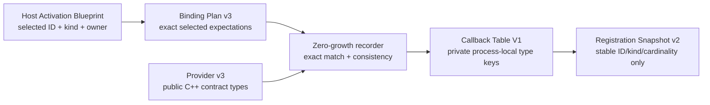

# ADR：Static Typed Contribution Contract Bindings v1

## 状态

Implemented for #294。

后继 [Static Contribution Payload Accessors v1](adr-static-contribution-payload-accessors-v1.md) 已由 #295 实现
`StaticContributionBindingV2`、provider v4 与 Composition renderer 5 的硬切目标。它只在同一 selected binding 中增加 future
payload accessor evidence；#294 下文的 binding v1/provider v3/renderer 4 继续记录本 Slice 已实现的历史合同。

本 ADR 冻结 logical contribution `kind` 与当前进程 C++ contract type 之间的最小静态绑定。它位于
[Host Activation Blueprint v1](adr-host-activation-blueprint-v1.md)、
[Static Factory Provider Bindings v1](adr-static-factory-provider-bindings-v1.md) 与
[Static Factory Callback Table v1](adr-static-factory-callback-table-v1.md) 之间。

本阶段只建立未来 typed contribution registry 能信任的类型证据，不发布 contribution payload，不提供 lookup，也不创建
`ActivationLease`。registry 与 lease 必须在本 ADR 的证据稳定后由后续 Slice 共同实现。

## 问题

Host Activation Blueprint 已经保存每个 selected contribution 的 exact ID、logical kind 与 owner factory；在 #294 之前，
`StaticFactoryProviderBindingPlan v2`、generated composition root 与 C++ callback table 只保存 factory identity 和五个
lifecycle callbacks。于是 Blueprint 到当前进程之间丢失了两项事实：

1. logical `kind` 对应哪个 public C++ contract type；
2. 该 contract 允许一个 scope generation 中存在单个还是多个实现。

如果直接实现 registry，只能退化成 `string -> void*`：调用方可以写错 cast，provider 可以重复声明 kind，序列化证据也无法证明
当前进程采用了同一个 C++ contract。这样的 registry 名义上 typed，实际上没有类型权威。

## 资料约束

| 资料 | 官方行为 | 对 Asharia 的约束 |
| --- | --- | --- |
| [C++ inline declaration](https://eel.is/c++draft/dcl.inline) | 一个具有 external/module linkage 的 inline entity 在程序内是同一 entity，并具有同一地址 | 可用 public header 中具有 external linkage 的 inline variable template 生成仅限当前程序比较的 type key，不需要序列化 RTTI 名称 |
| [MSVC `/OPT:ICF`](https://learn.microsoft.com/en-us/cpp/build/reference/opt-optimizations?view=msvc-170) | retail link 默认可启用 identical COMDAT folding；不同函数或只读 `const` data 可能取得同一地址 | type key 必须使用 writable inline storage；不能依赖 `const` data/function address 唯一，也不能把正确性绑定到全局 `/OPT:NOICF` policy |
| [O3DE Component Services](https://docs.o3de.org/docs/user-guide/programming/components/services/) | provided/required services 参与依赖与激活顺序验证 | logical contribution 必须保持 Blueprint owner 与依赖证据，不能由运行时“先注册者获胜” |
| [O3DE `AZ::Interface`](https://docs.o3de.org/docs/api/frameworks/azcore/class_a_z_1_1_interface.html) | 单实例接口要求 exact instance 注册与注销 | `single` 是一种明确契约，但不能被推断为所有 contribution kind 的统一规则 |
| [Unreal `IModularFeatures`](https://dev.epicgames.com/documentation/en-us/unreal-engine/API/Runtime/Core/IModularFeatures) | 一个 feature type 可以登记多个实现 | registry 必须显式区分 `single` 与 `multiple`，不能假定所有 kind 都是单例 |
| [Unreal `ShutdownModule`](https://dev.epicgames.com/documentation/en-us/unreal-engine/API/Runtime/Core/IModuleInterface/ShutdownModule) | Engine shutdown 时按 `StartupModule` 完成顺序的反序调用，已引用的依赖仍可用于清理 | payload publication 与撤销最终必须受 lifecycle lease 管理，但不应在类型证据尚未成立时提前实现 |

这些资料只约束行为，不要求 Asharia 复制 O3DE 或 Unreal 的公共 API、ABI 或插件模型。

## 决策

### 1. Public contract type 是类型权威

一个可发布的 C++ contribution contract 必须由 public header 中的 contract type 唯一声明：

```cpp
struct ExampleServiceContractV1 final {
    static constexpr std::string_view kind{"com.asharia.example-service"};
    static constexpr asharia::host_runtime::StaticContributionCardinalityV1 cardinality{
        asharia::host_runtime::StaticContributionCardinalityV1::Single};
};
```

provider 只能通过受约束的 helper 为 exact contribution ID 创建 binding：

```cpp
bindStaticContributionV1<ExampleServiceContractV1>(
    "com.asharia.example-service.default")
```

helper 从 contract type 取得 `kind` 与 cardinality，并产生一个 equality-only、process-local type key。provider API 不允许再次自由传入
kind、cardinality 或 type key，避免同一个 public type 被拼成不同 logical contracts。

key storage 是每个 contract type 一个具有 external linkage 的 writable inline byte。Host Runtime 从不修改 byte；writable 只用于阻止
MSVC retail linker 把不同 contract 的只读 COMDAT 折叠为同一地址。function address、`inline constexpr`/其他只读 data 与全局
`/OPT:NOICF` 都不是该正确性的替代条件。

type key 只证明“同一当前 Host program 内是否为同一个 C++ type”：

- 不持久化；
- 不打印地址；
- 不转换为 hash、名称、GUID 或布尔 capability；
- 不承诺跨 executable、Engine generation、DLL 或工具链稳定；
- 只由 Host Runtime PRIVATE storage 比较和持有。

### 2. Cardinality 只是本阶段的 contract metadata

contract 必须选择：

- `single`：未来每个 owning registry/scope generation 至多发布一个实现；
- `multiple`：未来每个 owning registry/scope generation 可以发布多个实现。

#294 只验证同一个 logical kind 在当前 table 内始终使用相同 C++ type 与相同 cardinality。它不在整张 static table 上执行
`single` 数量限制，因为 table 可以同时描述多个 scope template；不同 Process/Editor/Project scope generation 中出现同 kind 是合法的。

真正的 `single` 冲突、lookup 结果与 generation 失效语义属于后续 registry/`ActivationLease` Slice。

### 3. Binding Plan v3 携带 Blueprint-selected exact set

author-owned `asharia.package.static-factory-bindings.json` 硬切到 schema/model v3 与 provider API
`asharia-static-factory-provider-v3`。它仍只声明 factory 由哪个 public static provider entry point 提供，不记录 C++ type 名称。

derived `StaticFactoryProviderBindingPlan v3` 将 provider 下的 `factoryIds` 改为：

```json
{
  "factories": [
    {
      "factoryId": "runtime",
      "contributions": [
        {
          "id": "com.asharia.example-service.default",
          "kind": "com.asharia.example-service"
        }
      ]
    }
  ]
}
```

provider 已经携带 exact package/version/module，因此嵌套结构唯一导出 owner factory exact identity，不再重复 owner 字段。

规范化顺序为：

- providers：现有 exact provider UTF-8 key；
- factories：local factory ID UTF-8 bytes；
- contributions：contribution ID UTF-8 bytes。

planner 从 Blueprint 直接派生 selected factory/contribution exact set；composition generator 在消费任意 Binding Plan 时，再与 Blueprint
做双向 exact comparison。missing、extra、wrong owner 或 wrong kind 都不得进入 composition generation。Binding Plan 不复制
scope/requirement 图，也不成为第三份依赖 lock。

### 4. Provider v3 在一次 factory registration authority 内提交可用 bindings

provider v3 保持一个顶层 `noexcept` entry point，但 registrar 硬切为：

```cpp
registerFactory(localFactoryId, completeCallbacks, availableContributionBindings)
```

规则如下：

- binding 与 local factory ID、五个完整 callbacks 在同一次调用中提交；
- generated context 提供该 factory 的 exact selected contribution ID/kind expectation；
- provider 提交该 factory 在当前 binary 中可用的 binding span；Host 只验证并纳入本次 Blueprint selected bindings，未选集合的
  完整性不构成 evidence；
- unselected available binding 保持 inert，不获得 activation authority；这是 Host Profile 选择 package 内部分 contribution 的必要条件；
- available binding ID 重复、空 ID/kind、无 type key 或非法 cardinality 仍 fail closed；
- selected binding 缺失或 kind 不符 fail closed；
- provider 调用顺序和 binding span 顺序都不成为证据，materialization 按 canonical identity 排序。

generated Composition v4 只生成上述 stable logical expectations。generator 不为 selected contribution 增加 contract header include，
不生成 C++ type name、per-contribution accessor 或额外 TU；contract type 只出现在 package 已有 public header/implementation 对
templated helper 的调用路径中。

不允许 process-global registry、static constructor discovery、字符串 symbol lookup 或 detached binding registration。

### 5. Recorder 继续 atomic、sticky、zero-growth

公开 registration protocol 提升为 capacity/context v2，并预先给出：

- provider slot count；
- factory slot count；
- selected contribution slot count；
- generation、Blueprint、provider、factory、contribution ID/kind 的全部 owning text bytes；
- factory 与 contribution 失败归因缓冲区容量。

provider invocation window 内 recorder-owned `vector`/text storage 不允许增长。第一个确定性错误保持 sticky；任何错误都不返回
partial table 或 partial snapshot，且五个 lifecycle callback 调用次数保持为零。

至少区分并归因以下错误：

- expected factories/contributions 非 canonical 或 owner 不存在；
- duplicate available contribution ID；
- selected contribution missing；
- selected contribution kind mismatch；
- same-kind C++ type mismatch；
- same-kind cardinality mismatch；
- provider/factory/contribution count mismatch；
- text、factory diagnostic 或 contribution diagnostic capacity exceeded。

完成 state-owned provider observation 后，普通错误归因保存 exact provider、factory ID 与 contribution ID，不输出 pointer/type key。
expected factory/contribution set 的 pre-copy validation 故意不借用 caller-owned provider text：这类 error 的 provider 字段为空，
但在 diagnostic capacity 足够时仍保存 exact factory/contribution ID。若 factory/contribution diagnostic capacity 本身不足，则对应
error 只保存 observed byte count，不截断或伪造 ID。

same-kind conflict 不在 provider 调用时采用“first seen”判定。recorder 先把所有 selected bindings 写入预分配 slots；finish 以
`kind + exact owner factory + contribution ID` stable key 做 pairwise conflict 检测，并把 canonical order 中最早的 conflicting later
binding 作为归因。固定错误优先级为 cardinality mismatch 先于 C++ type mismatch；type key 不参与 stable key、hash 或诊断。
因此 same-kind conflict 的 primary attribution 不受 provider、factory 或 available binding 观察顺序影响；其他 sticky registration
错误仍按 generated canonical call path 中第一个实际观察到的错误归因。

### 6. Callback table 拥有 private type evidence，Snapshot v2 只拥有稳定证据

五个 lifecycle callback typedef 与 `StaticFactoryCallbackTableV1` 的 move-only ownership、table affinity 和 callback lifetime 语义保持
v1；public `registrationSnapshot()` 已硬切为返回 Snapshot v2，private table storage 也增加 type evidence。storage 为每个 selected
binding 拥有：

```text
exact contribution ID
stable logical kind
single | multiple
private process-local type key
```

`StaticFactoryRegistrationSnapshotV2` 保留 zero-contribution factory，并在每个 factory registration 内嵌 canonical contributions：

```json
{
  "packageId": "com.asharia.example",
  "packageVersion": "1.0.0",
  "moduleId": "runtime",
  "factoryId": "runtime",
  "providerEntryPoint": "asharia::example::provideStaticFactories",
  "contributions": [
    {
      "id": "com.asharia.example-service.default",
      "kind": "com.asharia.example-service",
      "cardinality": "single"
    }
  ]
}
```

Snapshot v2 绝不包含 address、RTTI、type key、callback 或 payload。Host Receipt schema v1 保持不变，但其 snapshot parser、cross-verifier 与
hash evidence 必须只接受 Snapshot v2。

### 7. 唯一受支持的 generation tuple

| 轴 | #294 implemented value |
| --- | --- |
| package static factory bindings | schema/model v3 |
| derived provider Binding Plan | schema/model v3 |
| static provider API | `asharia-static-factory-provider-v3` |
| Static Composition Root | schema v1 / renderer revision 4 |
| registration capacity/context | C++ v2 |
| Registration Snapshot | schema/model/C++ v2 |
| Windows Development Host Template | schema v1 / renderer revision 2 |
| Host Executable Binding Receipt | schema v1 |
| callbacks / callback table / lifecycle model | C++ v1 |

active pipeline 删除 pre-current schema、reader、alias 与 adapter。Host Template renderer 保持 2 的条件是它生成的 `main.cpp` 与 CMake bytes
完全不变；template 使用 `auto` 与未版本化 JSON render function，因此 linked Host Runtime 的 Snapshot v2 不要求修改模板。若实现导致任一
generated template byte 改变，则必须提升 renderer，而不能虚报 revision 2。

## 数据流



这一数据流只建立证据。Snapshot 成功不等于允许 lookup 或 activation；现有 eligibility/admission 边界继续负责阻止未验证 Host 调用
lifecycle。

## 拒绝的方案

### `string -> void*` 或 `std::any`

拒绝。logical kind 与 C++ type 没有单一权威，cast 失败只能延迟到运行时，且 cleanup/lifetime ownership 不明确。

### 序列化 C++ type name、RTTI name 或编译器派生 hash

拒绝。这些值不构成跨工具链、跨 generation ABI，反而会让 portable evidence 暗示不存在的兼容保证。

### process-global contract registry 或 static constructor

拒绝。它绕过 generated exact provider list、Blueprint selection、registration admission 与确定性失败归因。

### 在整个 table 上执行 `single`

拒绝。table 包含 scope templates，不是一个具体 registry generation；全局检查会拒绝跨 scope 的合法声明。

### first-provider-wins、priority、replacement 或 shadowing

拒绝。它们会把 verified exact graph 重新变成运行时选择问题。未来 registry 对 `single` 冲突必须 fail closed。

### 本阶段同时实现 registry 与 ActivationLease

拒绝。#294 没有 payload、scope-generation registry owner 或 handle invalidation authority。提前加入 lease 只会制造没有对象可撤销的抽象。

## 验证要求

- public contract helper 的 compile-time valid/invalid shape tests；
- writable inline type key 的 distinct-contract identity 与 same-type equality tests；
- exact factory/contribution plan projection、canonical order 与 Blueprint 双向一致性；
- missing、duplicate、wrong owner/kind、type mismatch、cardinality mismatch negatives；
- unselected available binding inert positive；
- zero-contribution factory 保留；
- provider/binding observation order 扰动后 Snapshot v2 bytes 不变；
- callback table move/lifetime 后 private type evidence 仍归属同一 immutable storage；
- JSON 不出现 pointer、RTTI、callback 或 type name；
- lifecycle callback invocation count 全部为零；
- only-current generation tuple 与旧 v2/C3/Snapshot v1 拒绝；
- Host Template renderer 2 generated bytes golden regression；
- Python contracts、C++ tests、encoding、docs sync、ClangCL 与 MSVC 全量门禁。

## 不做事项

- contribution payload publication、lookup 或 raw pointer/reference；
- registry owner、publication transaction、`ActivationLease`、generation handle 或 revoke；
- `single` winner policy、优先级或替换；
- scope projection、safe point、job/subscription cleanup 或线程安全；
- DLL、hot reload/unload、跨 Engine generation ABI；
- production Editor/Runtime/Bootstrap 接线；
- 旧 schema/provider/renderer compatibility adapter。

## 后续边界

直接后继 [Static Contribution Payload Accessors v1](adr-static-contribution-payload-accessors-v1.md) 先把 selected binding 硬切为
compile-time typed、registration/verification 零调用的 `Contract* (FactoryInstanceViewV1) noexcept` accessor。再下一 Slice 才在
admitted `ProcessScope` 内实现 typed publication staging、atomic commit 与 contribution-only `ActivationLease`：`activate` 成功后调用
selected accessors，rollback/stop 时按 reverse lifecycle 撤销，旧 generation handle fail closed。之后再依据同一模式扩展
Editor/Project/World scopes；生产 Bootstrap/Session adapter 仍是独立工作。
