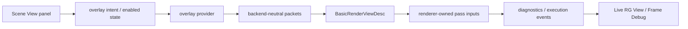
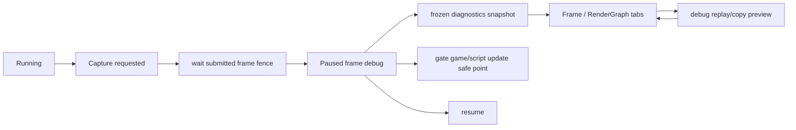

# 架构思想与开发规范

本文记录 Asharia Engine 后续跨系统开发的共同架构原则。它不是某个功能的实现计划，
而是评审 renderer、editor、runtime、asset、script 和 tooling 改动时必须先检查的规则。

当前真实实现仍以 [flow.md](flow.md)、[overview.md](overview.md)、[editor.md](editor.md)、
[render-layer.md](render-layer.md) 和对应系统文档为准。本文只定义方向、边界和判断标准。
尚未落地的能力必须显式标注 planned / future，不能写成当前事实。

## 核心思想

成熟游戏引擎架构的重点不是把系统一次性做全，而是把变化频率、生命周期、线程边界和运行位置不同的
数据隔离开，再用明确的数据合同连接。

### 外部资料提炼

本文参考 Godot、Unreal、Unity、O3DE、Bevy、Vulkan/Khronos 等资料后，只采纳能直接约束
Asharia Engine 的原则：

- Godot 的 Scene / Server / Driver 分层说明：高层 scene/editor 对象、长期子系统服务和平台驱动必须
  分开；可线程访问的是受控 server / handle API，不是活动 scene tree 对象。
- Unreal 的 GameThread / RenderThread / RHIThread 和 RDG 说明：线程之间传递的是 proxy、render command、
  pass parameter 或 frame packet；render 线程不能直接读写 gameplay/editor object。
- Unity Job System / Bevy ECS 说明：并行来自显式数据访问合同。系统或任务必须声明读写对象、资源和顺序，
  否则默认只能在 owner thread 串行执行。
- Unity Asset Database 与 O3DE Asset Processor 说明：source asset、metadata、import settings、product、
  cache、dependency 和 runtime loaded resource 是不同阶段；generated product 可重建，不是 source truth。
- Unity / Unreal RenderGraph 说明：RenderGraph 只管理单次 graph execution 内的资源 handle、依赖、lifetime、
  culling 和同步点；跨帧持久资源由外部 owner 创建后 import。
- Unity SceneView / Camera、Unreal FSceneView、Godot Viewport / Camera3D 说明：编辑器视窗相机可以由
  editor viewport 拥有导航状态，但进入渲染后必须转换成统一的 view/camera 输入；Scene/Game/Preview 的差异
  主要是 view kind、render target、culling/layer mask、show/debug flags、overlay intent 和 refresh policy。
- Unity / Godot shader built-ins 与 Vulkan descriptor / push constants 说明：model、view、projection、
  view-projection、camera position 等矩阵和视图数据是 shader input 合同。需要这些数据的 pass 必须显式消费
  per-view / per-draw 参数、buffer 或常量绑定，diagnostics 只能回显，不能作为渲染输入来源。
- Vulkan Guide / Khronos samples 说明：Vulkan 多线程扩展的是 host-side command recording；command pool、
  descriptor pool/cache、upload scratch 必须按 frame / thread 明确归属，queue submit 仍由 owner 串行管控。

### Package-first

Asharia Engine 采用 package-first，而不是 app-first。`apps/sample-viewer`、`apps/editor` 和未来 runtime host
只组合需要的 package；它们不拥有 engine 核心架构。

规则：

- 新能力必须先判断属于 foundation、platform、runtime、renderer、RHI、asset、editor、tools 还是 app host。
- package 不 include 另一个 package 的 `src/`，只消费 `include/` public API。
- 低层 package 不反向依赖 editor、app、asset importer 或 backend-specific debug UI。
- app 层可以 glue 多个 package，但 glue 不能变成长期公共 API。
- CMake target 依赖是构建真相；manifest 的 package-level `dependencies` 只能说明粗边界，多 target package
  必须用 `targetDependencies` 和 CMake target link 一起审查。

### 单向依赖

依赖方向必须表达所有权：

```text
apps/editor or apps/runtime
  -> editor/runtime orchestration
  -> renderer frontend / scene extraction / asset runtime handles
  -> rendergraph / RHI adapters
  -> platform / core
```

禁止方向：

- `rhi_vulkan` 依赖 RenderGraph。
- backend-neutral `renderer_basic` 记录 Vulkan command。
- runtime scene 依赖 editor panel、ImGui state 或 importer-only data。
- script VM 直接持有 Vulkan resource、ImGui id 或 editor panel object。

### 数据合同优先

跨系统交互默认使用 descriptor、packet、snapshot、handle 或 event，而不是直接共享对象引用。

常见合同：

- editor viewport intent：`EditorViewportRequest` / `EditorViewportOverlayFlags`，按 `panelId + EditorViewportKind`
  keyed 收集，避免 Scene/Game/Preview 同帧请求互相覆盖
- renderer view intent：`BasicRenderViewDesc`
- debug draw data：`BasicDebugWorldLine` 等 backend-neutral packet
- RenderGraph debug data：`RenderGraphDiagnosticsSnapshot`
- Frame Debug data：frozen capture snapshot + selected execution event id
- asset reference：stable asset id / handle，而不是 source path、runtime pointer 或 GPU handle

如果一个功能需要跨层拿对象，优先新增窄数据合同，而不是暴露对象内部实现。

### Frame boundary

Frame boundary 是系统同步点。Simulation、script update、scene extraction、RenderView recording、GPU submit、
present 和 editor diagnostics consumption 必须有清楚顺序。

规则：

- Frame Debug pause 不只是冻结 renderer diagnostics；它也必须 gate 被检查 world 的后续 game/script update safe
  point。
- 当前 editor 实现用 `EditorInspectedWorldScheduler` 的 counter-based seam 验证 frame advance、game update 和
  script update safe point 在 paused capture 期间不会推进；真正 runtime/script owner 接入时必须复用这个 gate。
- Editor UI 可以继续绘制 frozen diagnostics，但 normal RenderView recording 必须按 Frame Debug 状态暂停或走
  debug replay/copy path。
- 跨线程或跨帧数据通过 snapshot、command queue、frame packet 或 deferred destruction 传递。
- 不用 `vkDeviceWaitIdle` 解决正常 frame-loop 同步；只允许 teardown、早期 MVP 简化路径或有注释的 debug probe。

### RenderGraph 是声明式调度

RenderGraph 的职责是 pass/resource declaration、依赖分析、资源 lifetime、transition plan、culling 和
diagnostics。它不是 editor node canvas，也不是 drawcall identity 的替代品。

规则：

- pass 必须显式声明读写资源、访问类型、queue/domain 和副作用。
- Vulkan layout/stage/access translation 属于 Vulkan adapter target。
- RG View 只读 compiled diagnostics snapshot。
- Frame Debug 的 RenderGraph tab 只读 frozen snapshot。
- 如果需要 drawcall/event 级调试，renderer 必须显式产出 execution event / draw packet id，不能从
  RenderGraph command summary 反推。

### RenderView 是统一视图合同

`RenderView` 表达“从哪个 view/camera、以什么 view policy、渲染到哪个 target”。它不是 Game View 专用通道；
Scene View、Game View、Preview View 和未来 ReflectionProbe 都应走同一套 renderer-facing 合同。

规则：

- per-view 数据包括 camera view/projection/viewProjection、camera position、near/far、render target/extent、
  frame params、view kind、culling/layer mask、show/debug flags 和 overlay policy。
- per-draw 数据包括 model/local-to-world matrix、mesh/draw range、material/shader key 和 resource bindings。
- camera-aware 或 object-aware 的 RenderGraph pass 必须通过 typed pass params、descriptor/uniform buffer、
  push constants 或等价 renderer-owned binding 显式接收这些数据。
- editor viewport 可以拥有 orbit target、pivot、临时 navigation state、grid/gizmo/selection toggle 和
  refresh reason；这些状态在 RenderView recording 前必须被转换为 renderer-owned camera、view flags、
  culling/filtering policy 或 backend-neutral packets。
- `BasicRenderViewDiagnostics` 和 `RenderGraphDiagnosticsSnapshot` 只用于观测与调试。它们可以证明 camera
  或资源合同已被记录，但不能成为后续 pass 读取矩阵、RT、model 或 resource state 的数据源。

当前状态：`BasicRenderViewDesc` 已有 `camera` 字段，`EditorViewportCoordinator` 会把 Scene View request
桥接到 `BasicRenderViewCamera`；`BasicFullscreenTextureRenderer::recordViewFrame()` 现在会在存在
`BasicDebugWorldLine` 时插入 `builtin.render-view-overlay` pass，把 camera position / near plane、frame params、
debug world-line count 作为 typed params 与 command summary 记录，并在 `renderer_basic_vulkan` 内投影 world line，
通过 debug-line shader/pipeline 绘制 line-list。没有 debug line 时 overlay intent 只保留在 diagnostics，避免空
pass。现有 mesh/draw-list smoke 仍在 renderer 内部用 extent 和 model matrix 计算 MVP。后续相机相关 grid、scene
mesh、selection、gizmo 或 debug line pass 必须继续沿 renderer-owned per-view constants / pass input 合同推进，不能回退到
diagnostics-only 数据源。

### Editor 是 orchestration

Editor 负责工具、面板、命令、selection、undo/redo、workspace、viewport orchestration 和 asset authoring。
它不拥有 runtime 数据模型、renderer backend 或 GPU 生命周期。

规则：

- editor panel 不记录 Vulkan command。
- Scene View overlay strip 只控制 editor intent 或 provider enabled state。
- World overlay provider 输出 backend-neutral packets。
- Renderer bridge 把 packets 转成 renderer-owned view data 或 pass inputs。
- Scene View panel 可以持有 editor-owned navigation/camera state，但不能形成 renderer 矩阵旁路；相机变化必须
  转成 `RenderView` camera 数据和 `CameraInputChanged` repaint intent。
- Game View 默认不继承 Scene View grid、gizmo、selection outline 等 authoring overlay。

### Asset 与热更新

Asset 和热更新必须经过确定性的编译产物和 runtime-safe handle。

规则：

- source asset、metadata、import settings、product/cache key、dependency 和 runtime handle 分离。
- generated product/cache 可删除重建，默认不作为 source truth。
- 脚本热更新可以改 manifest、settings、layout 描述和 provider 参数。
- 脚本热更新不能直接创建、销毁或持有 GPU resource。
- shader/material/mesh/texture reload 必须通过 resource key、generation、deferred destruction 和 diagnostics
  暴露状态。

### 持久化不是内存布局

持久化 schema 表达用户工程数据，不表达 C++ 当前内存布局、editor widget 或脚本 VM 私有对象。

规则：

- `schema` 拥有 stable type / field id 和 typed metadata。
- `cpp-binding` 只是 C++ 对象与 schema field 的读写桥，不决定 persistence、editor 或 script 规则。
- `archive` 只拥有 value tree 和严格 IO facade，不理解 schema 或 C++ 对象。
- `persistence` 组合 schema、binding 和 archive，负责 save/load/default/unknown-field/migration。
- Scene、material、asset metadata 和 script exposed state 保存 stable id、GUID、field id 和 schema version；
  不保存 runtime index、pointer、GPU handle、ImGui id、absolute build path 或 generated cache path。
- 改名、移动、字段删除和类型替换必须通过 alias、redirect 或 migration 保留诊断，不能静默丢弃用户数据。

### 线程与任务所有权

第一版以 owner thread 明确性优先，只有当数据合同和 profiler 证明收益时才扩展并行。

规则：

- Window / OS event、active editor state、active scene mutation 和 ImGui frame 默认属于 main thread。
- Runtime script update 属于明确的 script owner safe point；render command recording 不回调 VM。
- Worker task 输入必须是 immutable snapshot、span、POD buffer、asset handle 或 job-local data；输出必须是
  result、packet、command 或 diagnostic。
- Worker task 不直接修改 active World、selection、inspector object、asset catalog mutation state 或 GPU resource。
- 新增 RenderThread 前必须先定义 `RenderFramePacket` 的 ownership、lifetime、fallback 和 smoke。
- 新增 Vulkan 多线程录制时，必须证明 command pool、descriptor pool/cache、upload scratch 是 per-frame /
  per-thread owner，不共享可变 Vulkan pool。

### 可观测性是架构合同

跨系统功能必须提供机器可读 diagnostics、counter 或 snapshot，不能依赖解析 debug text。

规则：

- Frame Debug、Live RG View、profiling 和 smoke 应消费结构化 snapshot / packet / event id。
- renderer execution event id 由 renderer 显式产生，不能从 RenderGraph command summary 反推。
- asset import、shader build、script action 和 hot reload 失败必须带 source path、stable id、版本、owner stage
  和恢复策略。
- 性能优化必须有 profiler counter 或 benchmark；不能凭直觉加入常驻线程、全局 cache 或新 backend path。

### 内部代码设计也是架构

Package 边界正确不代表架构已经健康。跨系统功能还必须检查内部对象职责、状态模型、数据合同和生命周期。

规则：

- `Context`、`Coordinator`、`Manager`、`Registry`、app glue 和大型 public header 必须定期审查职责是否过宽；
  如果同时承担状态所有权、调度、UI、GPU 生命周期和 diagnostics，必须拆分或记录阶段性保留理由。
- 每个跨层字段都要追到真实消费者；camera、overlay、format、descriptor、resource access 和 pass params
  只进入 diagnostics 不算合同落地。
- 单实例过渡实现必须标注何时升级为多实例模型；viewport、view、panel、world、capture 和 refresh reason
  不能长期靠“最后一次请求”代表全局状态。
- GPU work 必须在 RenderGraph、frame loop 或 named external pass 中可见；隐藏的 fill/copy/upload/barrier
  会破坏 Frame Debug、RG View 和同步审查。
- 持久 editor mutation 必须通过 command/transaction 或明确 owner，不让 panel 直接修改未来会被保存、
  undo/redo、script 或 collaboration 消费的状态。

## 层级职责

| 层级 | 拥有 | 不拥有 |
| --- | --- | --- |
| `engine/core` | result/error、log、基础 utility、稳定 ID | Vulkan、ImGui、editor、asset importer |
| `engine/platform` / `window-glfw` | window、surface、input polling、OS glue | scene、renderer policy、editor workflow |
| `profiling` | backend-neutral CPU scope、frame sample、counter、benchmark output | Vulkan timestamp ownership、editor UI policy |
| `schema` | stable type/field id、typed metadata | archive IO、C++ object binding、editor/script/backend |
| `archive` | `ArchiveValue`、严格 JSON/binary IO facade | schema registry、C++ object lifecycle、migration policy |
| `cpp-binding` | C++ object/member/getter/setter 到 schema field 的桥 | persistence policy、archive format、editor/script metadata |
| `persistence` | save/load/default/unknown-field/migration | editor transaction、script VM、asset database、renderer |
| `scene-core` | headless world、entity id、transform/runtime state | editor panel、GPU resource、importer UI |
| `asset-core` | asset id、metadata、runtime-safe reference、product key | concrete importer UI、Vulkan image、editor browser |
| planned `asset-pipeline` / `asset-processor` | source scan、metadata IO facade、import job、product manifest、cache invalidation | editor panel rendering、runtime resource ownership、GPU upload |
| `rendergraph` | pass/resource/buffer/access/dependency/diagnostics | editor view、Vulkan command recording、drawcall identity |
| `rhi_vulkan` | instance/device/swapchain/allocator/command/sync | RenderGraph policy、editor diagnostics UI |
| `renderer_basic` | backend-neutral renderer contract、RenderView、debug packets、shared schemas | Vulkan handles、descriptor writes、ImGui texture ids |
| `renderer_basic_vulkan` | Vulkan command recording、pipeline、descriptor、GPU resource binding | editor panel state、script object ownership |
| `shader-slang` | Slang compile、SPIR-V validation、shader metadata/reflection product | runtime material ownership、Vulkan pipeline policy |
| planned `scripting` | script host/context/binding/diagnostics/permission model | editor UI implementation、Vulkan/RHI escape hatch、GPU ownership |
| planned `editor-core` | editor id、selection、transaction、service facade、action metadata | ImGui backend、Vulkan backend、renderer implementation |
| `apps/editor` | panels、actions、tools、workspace、viewport coordination、ImGui integration | runtime serialization truth、renderer backend internals |

## 推荐数据流

### Viewport overlay



当前状态：Grid 已有 `EditorViewportOverlayProvider` v0。Scene View panel 持有 editor-owned navigation/camera
state；这是输入所有权，不是 renderer 矩阵旁路。Scene View request 携带 camera context，
`EditorViewportCoordinator` 会 bridge 到 `BasicRenderViewCamera`，provider context 和 RenderView diagnostics
也能收到 camera/view/projection 数据；`editorViewportCameraForExtent()` 负责 resize 后重算投影，
`unprojectEditorViewportPoint()` 提供 viewport-local pixel（左上角原点，Y down）到 world ray 的后端无关语义；
ray 由 inverse view-projection 计算，`origin`/`nearPoint` 是 near clipping plane 上的 world point，
`farPoint` 是 far clipping plane 上的 world point。provider 仍只在 Scene View grid intent enabled 时生成
原点附近固定 XZ `EditorViewportOverlayPacket`。`EditorViewportCoordinator` 只负责把 packet bridge 到
`BasicRenderViewOverlayDesc`。`renderer_basic_vulkan` 已消费该 debug-line route 并绘制可见 line-list；这仍不是
runtime camera system、manifest-backed provider、camera-aware grid policy 或 source overlay id diagnostics。

下一步顺序：

1. 让 provider 参数来自 manifest/settings-ready 数据。
2. 实现 camera-aware range/fade policy。
3. 增加 source overlay id diagnostics。
4. 补 pixel/readback camera-difference smoke。
5. 让 Frame Debug / RG View 显示 pass、packet count、view kind 和 selected event 的更多细节。

### Frame Debug



规则：

- Frozen capture 不序列化 script VM object。当前 smoke 验证 RenderView recording 暂停，并用 counter-based
  scheduler seam 验证被检查 world 的 frame/game/script safe point 不推进；后续真实 runtime/script scheduler 必须接到同一 gate。
- Frame Debug 和 Frame Debug RG View 是同一面板的两个 tab，不是两个独立数据源。
- Frame view 以 pass / execution event 列表驱动右侧详情和图形预览。

## 功能进入前检查

任何跨系统功能开始前，先回答：

1. 这个功能的 source of truth 在哪一层？
2. 它需要持久化吗？如果需要，稳定 ID 和 migration 怎么处理？
3. 它的 runtime 数据、editor state、GPU resource、generated product 是否分离？
4. 它跨 frame 或跨线程时使用 snapshot、packet 还是 command queue？
5. 它是否会让低层 package 依赖 editor、app 或 backend UI？
6. 它是否需要 Frame Debug / RG View / profiling 可见性？
7. 它的内部 owner、生命周期、单/多实例状态和错误路径是否清楚？
8. 它新增的跨层字段是否有真实消费者，而不是只进入 diagnostics？
9. 它能用哪个 smoke 或 review script 证明没有破坏现有边界和内部设计？
10. 它是否修改了真实依赖、frame flow、schema、asset pipeline 或 lifetime 文档？

如果这些问题没有答案，先补 contract 和 diagnostics，不要先做 UI 或视觉效果。

## 验证矩阵

| 改动类型 | 必须同步的文档 | 最小验证 |
| --- | --- | --- |
| package / target / manifest 依赖 | `package-first.md`、`flow.md` | `tools\check-doc-sync.ps1`、`git diff --check`、相关 CMake preset build |
| RenderGraph pass/resource/transition | `flow.md`、`render-layer.md`、RenderGraph 系统文档 | `--smoke-rendergraph`、相关 renderer/RHI smoke、clangcl + msvc build |
| Vulkan sync / swapchain / frame loop | `overview.md`、`flow.md`、`frame-loop-threading.md` | frame/swapchain/resize/deferred-deletion smoke、Vulkan review script |
| editor shell / panel / action / viewport | `editor.md`、`editor-extension-architecture.md` | `--smoke-editor-shell`、viewport / frame-debugger smoke |
| asset identity / product / hot reload | `docs/systems/asset-architecture.md` | package-local asset tests、metadata/product/dependency smoke |
| schema / archive / persistence / migration | `docs/systems/reflection-serialization.md`、`naming.md` | serialization roundtrip、json archive、migration smoke |
| script binding / editor script extension | `docs/systems/scripting.md`、`editor-ui-scripting.md` | permission、transaction、reload 和 diagnostics smoke |
| threading / worker / RenderThread | `frame-loop-threading.md`、`flow.md` | owner/fallback 文档、single-thread fallback smoke、profiler counter |

## 禁止事项

- 不为单个 Grid/Gizmo 需求创建全局 debug renderer。
- 不把 editor-only overlay 直接塞进 Game View。
- 不把 RenderGraph diagnostics 当成 drawcall id。
- 不让脚本、panel 或 hot reload path 持有 GPU 对象。
- 不让 renderer backend 知道 editor panel、ImGui id 或 script object。
- 不用长生命周期全局单例绕过 package 边界。
- 不把临时 smoke glue 提升成公共 API，除非已有两个以上真实消费者。
- 不把 C++ 成员名、widget label、script field name 或 JSON key 当作长期 stable schema identity。
- 不用 source path、runtime pointer 或 loaded resource 状态替代 asset GUID / handle。
- 不为了“未来会多线程”提前引入常驻线程；必须先有 owner、packet、failure path、counter 和 fallback。

## 参考资料

- Godot Architecture Overview: https://docs.godotengine.org/en/stable/engine_details/architecture/godot_architecture_diagram.html
- Godot Thread-safe APIs: https://docs.godotengine.org/en/stable/tutorials/performance/thread_safe_apis.html
- Godot Internal Rendering Architecture: https://docs.godotengine.org/en/stable/engine_details/architecture/internal_rendering_architecture.html
- Game Programming Patterns: https://gameprogrammingpatterns.com/
- Gaffer On Games - Fix Your Timestep: https://gafferongames.com/post/fix_your_timestep/
- Unity Entities: https://docs.unity.cn/Packages/com.unity.entities%401.0/manual/index.html
- Unity Overlays: https://docs.unity.cn/Manual/overlays.html
- Unity SceneView: https://docs.unity3d.com/ScriptReference/SceneView.html
- Unity Camera.cameraType: https://docs.unity3d.com/ScriptReference/Camera-cameraType.html
- Unity Camera.cullingMask: https://docs.unity3d.com/ScriptReference/Camera-cullingMask.html
- Unity shader built-in variables: https://docs.unity.cn/2023.3/Documentation/Manual/SL-UnityShaderVariables.html
- Unity Job System Thread-safe Types: https://docs.unity.cn/Manual/JobSystemNativeContainer.html
- Unity Render Graph Fundamentals: https://docs.unity.cn/Packages/com.unity.render-pipelines.core%4017.0/manual/render-graph-fundamentals.html
- Unity Asset Database: https://docs.unity.cn/Manual/AssetDatabase.html
- Unity Asset Metadata: https://docs.unity.cn/Manual/AssetMetadata.html
- Unreal Actors: https://dev.epicgames.com/documentation/unreal-engine/actors-in-unreal-engine
- Unreal FEditorViewportClient::CalcSceneView: https://dev.epicgames.com/documentation/en-us/unreal-engine/API/Editor/UnrealEd/FEditorViewportClient/CalcSceneView
- Unreal FSceneView: https://dev.epicgames.com/documentation/en-us/unreal-engine/API/Runtime/Engine/FSceneView
- Unreal Threaded Rendering: https://dev.epicgames.com/documentation/en-us/unreal-engine/threaded-rendering-in-unreal-engine
- Unreal Parallel Rendering Overview: https://dev.epicgames.com/documentation/en-us/unreal-engine/parallel-rendering-overview-for-unreal-engine
- Unreal Render Dependency Graph: https://dev.epicgames.com/documentation/en-us/unreal-engine/render-dependency-graph-in-unreal-engine
- Unreal Asynchronous Asset Loading: https://dev.epicgames.com/documentation/en-us/unreal-engine/asynchronous-asset-loading-in-unreal-engine
- Open 3D Engine Asset Processor: https://docs.o3de.org/docs/user-guide/assets/asset-processor/
- Open 3D Engine Product Assets: https://docs.o3de.org/docs/user-guide/assets/pipeline/product-assets/
- Bevy ECS: https://bevy.org/learn/quick-start/getting-started/ecs/
- Godot Viewport: https://docs.godotengine.org/en/latest/classes/class_viewport.html
- Godot Camera3D: https://docs.godotengine.org/en/latest/classes/class_camera3d.html
- Godot spatial shader built-ins: https://docs.godotengine.org/en/latest/tutorials/shaders/shader_reference/spatial_shader.html
- Vulkan Guide - Threading: https://docs.vulkan.org/guide/latest/threading.html
- Vulkan Guide - Push Constants: https://docs.vulkan.org/guide/latest/push_constants.html
- Khronos Vulkan Samples - Command Buffer Usage and Multi-threaded Recording: https://docs.vulkan.org/samples/latest/samples/performance/command_buffer_usage/README.html
- Filament FrameGraph: https://google.github.io/filament/notes/framegraph.html
- Bitsquid Tool Architecture: https://bitsquid.blogspot.com/2010/04/our-tool-architecture.html
- Molecular Matters Content Pipeline: https://blog.molecular-matters.com/2012/01/31/a-content-pipeline-for-fast-iteration-times/
